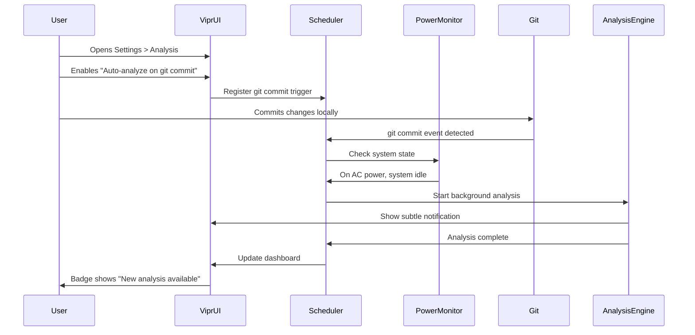

# Scheduled Background Analysis

## User Story

**As a user**, I want Vipr to automatically run background analysis on a schedule (hourly, daily, on git events) so my analysis stays current without manual intervention.

## Desktop Capability Utilized

**Electron's Background Process Management** combined with **Node.js timers and system event listeners** enables:

- Persistent background scheduling independent of UI visibility
- Integration with OS power management (battery vs. AC power)
- Git event monitoring (commits, pulls, branch switches)
- Intelligent scheduling based on system idle time
- Graceful handling of sleep/wake cycles
- CPU/memory-aware throttling to prevent system slowdown

**Why can't this be done in a web app?**

Web applications are fundamentally limited:

- Background tabs are throttled by browsers (timers delayed to 1 minute minimum)
- Tabs can be suspended or killed at any time by browser
- No access to system power state or idle time detection
- Cannot monitor git repository events outside of active tab
- Service Workers have restrictive execution limits
- No persistent background process when browser is closed
- Cannot detect system sleep/wake events

## UX Flow

### User Journey



### Schedule Configuration UI

**Settings > Analysis > Scheduling**:

```
┌─ Automatic Analysis ──────────────────────────────┐
│                                                    │
│  When should Vipr analyze your codebase?          │
│                                                    │
│  [✓] On file changes                              │
│      Delay: [5 seconds] after last change         │
│                                                    │
│  [✓] On git events                                │
│      [✓] After commits                            │
│      [✓] After pulling changes                    │
│      [ ] On branch switch                         │
│                                                    │
│  [ ] On a schedule                                │
│      Interval: [ Hourly   ▼ ]                     │
│      Time:     [ 02:00 AM    ] (for Daily)        │
│                                                    │
│  Power Management:                                │
│  [✓] Pause analysis on battery power              │
│  [✓] Only analyze when system is idle             │
│  [ ] Run at lower priority when on battery        │
│                                                    │
│  Throttling:                                      │
│  Max CPU usage:    [25%        ]                  │
│  Run analysis in:  [ Background ▼ ]               │
│                    (Background / Low Priority /   │
│                     Normal Priority)              │
│                                                    │
│  [Test Schedule Now]                              │
│                                                    │
└────────────────────────────────────────────────────┘
```

### Analysis Notification States

**Subtle Notification** (doesn't interrupt work):

```
┌─────────────────────────────────────┐
│ 🔄 Analysis Running...              │
│ Started: 2:34 PM                    │
│ Files analyzed: 234 / 1,200         │
│ Estimated time: 2 minutes           │
│ [Pause] [View Progress]             │
└─────────────────────────────────────┘
```

**Completion Notification**:

```
┌─────────────────────────────────────┐
│ ✓ Analysis Complete                 │
│ 1,200 files analyzed in 3m 12s      │
│ 3 new issues found                  │
│ [View Dashboard] [Dismiss]          │
└─────────────────────────────────────┘
```

**Error Notification**:

```
┌─────────────────────────────────────┐
│ ⚠ Analysis Failed                   │
│ Unable to read file: broken.tsx     │
│ [View Logs] [Retry] [Dismiss]       │
└─────────────────────────────────────┘
```

### Platform Differences

**macOS**:

- System idle detection via `powerMonitor.getSystemIdleTime()`
- App Nap may suspend background processes (must request background processing)
- Energy impact shown in Activity Monitor (keep it low)

**Windows**:

- Power throttling on battery (Windows 10+)
- Background task scheduling via Task Scheduler integration (future)
- System idle detection available

**Linux**:

- Idle detection varies by desktop environment
- systemd timer integration possible for system-level scheduling
- Power management less standardized across distributions

## Electron APIs and Patterns

### Primary APIs Used

**`powerMonitor.getSystemIdleTime()`**: Detect user inactivity

```typescript
import { powerMonitor } from 'electron';

const idleSeconds = powerMonitor.getSystemIdleTime();

if (idleSeconds > 300) {
  // 5 minutes idle
  startBackgroundAnalysis();
}
```

**`powerMonitor.on('on-battery')` / `on-ac`**: Detect power state changes

```typescript
powerMonitor.on('on-battery', () => {
  console.log('Switched to battery power');
  if (config.pauseOnBattery) {
    pauseBackgroundAnalysis();
  }
});

powerMonitor.on('on-ac', () => {
  console.log('Plugged into AC power');
  resumeBackgroundAnalysis();
});
```

**`powerMonitor.on('suspend')` / `resume`**: Handle system sleep/wake

```typescript
powerMonitor.on('suspend', () => {
  console.log('System going to sleep');
  pauseAnalysis();
  saveState();
});

powerMonitor.on('resume', () => {
  console.log('System waking up');
  checkForChanges();
  resumeAnalysis();
});
```

**`app.on('will-quit')`**: Clean shutdown of scheduled tasks

```typescript
app.on('will-quit', event => {
  if (analysisInProgress) {
    event.preventDefault();
    gracefulShutdown().then(() => app.quit());
  }
});
```

**`setInterval()` and `setTimeout()` (Node.js)**: Basic scheduling

```typescript
// Schedule analysis every hour
const intervalId = setInterval(
  () => {
    if (shouldRunAnalysis()) {
      runScheduledAnalysis();
    }
  },
  60 * 60 * 1000
); // 1 hour

// Clean up on shutdown
app.on('will-quit', () => clearInterval(intervalId));
```

**`node-cron` (npm)**: Advanced scheduling with cron syntax

```typescript
import cron from 'node-cron';

// Run daily at 2:00 AM
const task = cron.schedule('0 2 * * *', () => {
  runDailyAnalysis();
});

// Stop scheduler
app.on('will-quit', () => task.stop());
```

**`chokidar` (npm)**: File system monitoring

```typescript
import chokidar from 'chokidar';

const watcher = chokidar.watch(repoPath, {
  ignored: /(node_modules|\.git)/,
  persistent: true,
  ignoreInitial: true,
});

watcher.on('change', path => {
  scheduleIncrementalAnalysis(path);
});
```

**`simple-git` (npm)**: Git event monitoring

```typescript
import simpleGit from 'simple-git';

const git = simpleGit(repoPath);

// Watch for commits
git.log().then(log => {
  const lastCommit = log.latest;
  if (lastCommit.hash !== lastKnownCommitHash) {
    onGitCommit(lastCommit);
  }
});
```

### Process Architecture

**Main Process**: Owns all scheduling logic and coordinates analysis.

**Why?** Scheduling must persist independent of renderer windows:

- Timers continue running when all windows are closed
- Power monitor events only available in main process
- File system watchers must remain active when UI is hidden
- Background analysis doesn't require visible UI

**Utility Process** (optional): Run analysis in isolated process.

**Benefits**:

- CPU-intensive analysis doesn't block main process
- Can set lower CPU priority for background work
- Memory isolation prevents leaks in main process
- Easy to cancel/restart without affecting main app

**Renderer Process**: Displays schedule status and configuration UI.

### IPC Communication

**Renderer → Main**: Configure schedule

```typescript
// renderer/hooks/useScheduler.ts
const setAnalysisSchedule = async (config: ScheduleConfig) => {
  await ipcRenderer.invoke('scheduler:set-config', config);
};

const triggerManualAnalysis = async () => {
  await ipcRenderer.invoke('scheduler:trigger-now');
};
```

**Main → Renderer**: Broadcast analysis events

```typescript
// main/scheduler.ts
scheduler.on('analysis:started', () => {
  BrowserWindow.getAllWindows().forEach(win => {
    win.webContents.send('analysis:status', {
      status: 'running',
      startedAt: Date.now(),
    });
  });
});

scheduler.on('analysis:progress', progress => {
  BrowserWindow.getAllWindows().forEach(win => {
    win.webContents.send('analysis:progress', progress);
  });
});

scheduler.on('analysis:complete', result => {
  BrowserWindow.getAllWindows().forEach(win => {
    win.webContents.send('analysis:complete', result);
  });
});
```

**Main → Utility Process**: Trigger analysis work

```typescript
// main/analysis-coordinator.ts
const startBackgroundAnalysis = () => {
  analysisProcess.postMessage({
    type: 'start-analysis',
    repoPath,
    config: analysisConfig,
  });
};

analysisProcess.on('message', msg => {
  if (msg.type === 'progress') {
    handleAnalysisProgress(msg.data);
  }
});
```

## Configuration and Preferences

### Schedule Configuration Schema

```typescript
interface ScheduleConfig {
  enabled: boolean; // Master enable/disable

  // Trigger types
  onFileChange: boolean; // Analyze on file changes
  fileChangeDelay: number; // Debounce delay (seconds)

  onGitCommit: boolean; // Analyze after commits
  onGitPull: boolean; // Analyze after pulls
  onGitBranchSwitch: boolean; // Analyze on branch change

  scheduled: boolean; // Enable scheduled runs
  scheduleInterval: 'hourly' | 'daily' | 'weekly' | 'custom';
  scheduleCron?: string; // Custom cron expression
  scheduleTime?: string; // Time for daily/weekly (HH:MM format)

  // Power management
  pauseOnBattery: boolean; // Pause when on battery
  lowPriorityOnBattery: boolean; // Reduce priority on battery
  requireSystemIdle: boolean; // Only run when system idle
  systemIdleThreshold: number; // Idle time required (seconds)

  // Throttling
  maxCpuPercent: number; // Max CPU usage (0-100)
  maxMemoryMB: number; // Max memory usage
  processPriority: 'low' | 'normal' | 'high';

  // Notifications
  notifyOnStart: boolean; // Show notification when starting
  notifyOnComplete: boolean; // Show notification when complete
  notifyOnError: boolean; // Show notification on errors
}
```

### Storage

SQLite `preferences` table:

```sql
CREATE TABLE preferences (
  key TEXT PRIMARY KEY,
  value TEXT NOT NULL,
  updated_at INTEGER NOT NULL
);

-- key: 'scheduler.config'
-- value: '{"enabled":true,"onFileChange":true,...}'
```

### Schedule State Tracking

```sql
CREATE TABLE schedule_history (
  id INTEGER PRIMARY KEY AUTOINCREMENT,
  trigger_type TEXT NOT NULL,  -- 'file-change' | 'git-commit' | 'scheduled' | 'manual'
  started_at INTEGER NOT NULL,
  completed_at INTEGER,
  status TEXT NOT NULL,        -- 'running' | 'completed' | 'failed' | 'cancelled'
  files_analyzed INTEGER,
  issues_found INTEGER,
  error_message TEXT
);
```

### Sensible Defaults

```typescript
const DEFAULT_SCHEDULE_CONFIG: ScheduleConfig = {
  enabled: true,

  onFileChange: true,
  fileChangeDelay: 5,

  onGitCommit: true,
  onGitPull: true,
  onGitBranchSwitch: false,

  scheduled: false,
  scheduleInterval: 'daily',
  scheduleTime: '02:00',

  pauseOnBattery: true,
  lowPriorityOnBattery: true,
  requireSystemIdle: false,
  systemIdleThreshold: 300, // 5 minutes

  maxCpuPercent: 25,
  maxMemoryMB: 500,
  processPriority: 'low',

  notifyOnStart: false,
  notifyOnComplete: true,
  notifyOnError: true,
};
```

---

## Component Map

### Architecture Note

**Reference Implementation**: Phase 12 (MCP Server Settings) - Use the same SettingCard pattern for all schedule preferences.

### Primary Components

| Component     | Import Path               | Configuration                                 | Purpose                     |
| ------------- | ------------------------- | --------------------------------------------- | --------------------------- |
| SettingCard   | `@vipr/ui/setting-card`   | `label`, `description`                        | Group schedule preferences  |
| Switch        | `@vipr/ui/switch`         | `checked`, `onChange`                         | Enable/disable toggles      |
| Checkbox      | `@vipr/ui/checkbox`       | `checked`, `onChange`, `label`                | Trigger condition selection |
| Dropdown      | `@vipr/ui/dropdown`       | `variant="select"`, `options`                 | Interval selection          |
| Input         | `@vipr/ui/input`          | `type="time"`, `type="number"`, `type="text"` | Time picker, delays, cron   |
| ProgressModal | `@vipr/ui/progress-modal` | `progress`, `title`                           | Analysis progress           |
| CardTable     | `@vipr/ui/card-table`     | `columns`, `data`                             | Analysis history            |
| Badge         | `@vipr/ui/badge`          | `variant`, `size="sm"`                        | Status indicators           |
| Tooltip       | `@vipr/ui/tooltip`        | Cron syntax help                              |

### Color Tokens

**Schedule Status:**

```tsx
// Enabled/active
'bg-green-500/20 text-green-700 dark:bg-green-500/10 dark:text-green-400';

// Paused (battery/idle)
'bg-yellow-500/20 text-yellow-700 dark:bg-yellow-500/10 dark:text-yellow-400';

// Disabled
'bg-gray-500/20 text-gray-700 dark:bg-gray-500/10 dark:text-gray-400';

// Error
'bg-red-500/20 text-red-700 dark:bg-red-500/10 dark:text-red-400';
```

### Typography Tokens

**Cron Expression:**

- Font: `font-mono text-xs`
- Color: `text-gray-700 dark:text-gray-300`

**Time Display:**

- Font: `font-mono tabular-nums text-sm`

### Layout Pattern: Schedule Settings

**Reference**: Phase 12 (MCP Server) - Follow the same SettingCard composition

```tsx
const ScheduleSettings: React.FC = () => {
  const [config, setConfig] = useState<ScheduleConfig>(DEFAULT_SCHEDULE_CONFIG);

  const updateConfig = <K extends keyof ScheduleConfig>(key: K, value: ScheduleConfig[K]) => {
    setConfig(prev => ({ ...prev, [key]: value }));
    // Save to backend via IPC
  };

  return (
    <div className="space-y-6 p-6">
      <div>
        <h2 className="text-lg font-semibold mb-4">Scheduled Analysis</h2>

        <div className="space-y-4">
          {/* Master Enable */}
          <SettingCard
            label="Enable Scheduled Analysis"
            description="Automatically analyze your codebase based on triggers and schedules"
          >
            <div className="flex items-center gap-3">
              <Switch
                checked={config.enabled}
                onChange={enabled => updateConfig('enabled', enabled)}
              />
              {config.enabled && (
                <Badge variant="success" size="sm">
                  Active
                </Badge>
              )}
            </div>
          </SettingCard>

          {/* File Change Triggers */}
          <SettingCard label="File Change Triggers" description="Analyze when files are modified">
            <div className="space-y-3">
              <Checkbox
                checked={config.onFileChange}
                onChange={checked => updateConfig('onFileChange', checked)}
                label="Analyze on file changes"
                disabled={!config.enabled}
              />

              {config.onFileChange && (
                <div className="ml-6">
                  <label className="text-xs text-gray-600 dark:text-gray-400 mb-1 block">
                    Debounce delay (seconds)
                  </label>
                  <Input
                    type="number"
                    value={config.fileChangeDelay}
                    onChange={e => updateConfig('fileChangeDelay', parseInt(e.target.value))}
                    min={1}
                    max={60}
                    className="w-32"
                    disabled={!config.enabled}
                  />
                </div>
              )}
            </div>
          </SettingCard>

          {/* Git Triggers */}
          <SettingCard label="Git Triggers" description="Analyze after git operations">
            <div className="space-y-2">
              <Checkbox
                checked={config.onGitCommit}
                onChange={checked => updateConfig('onGitCommit', checked)}
                label="After commit"
                disabled={!config.enabled}
              />
              <Checkbox
                checked={config.onGitPull}
                onChange={checked => updateConfig('onGitPull', checked)}
                label="After pull"
                disabled={!config.enabled}
              />
              <Checkbox
                checked={config.onGitBranchSwitch}
                onChange={checked => updateConfig('onGitBranchSwitch', checked)}
                label="After branch switch"
                disabled={!config.enabled}
              />
            </div>
          </SettingCard>

          {/* Time-based Schedule */}
          <SettingCard
            label="Time-based Schedule"
            description="Run analysis at specific times or intervals"
          >
            <div className="space-y-3">
              <Switch
                checked={config.scheduled}
                onChange={checked => updateConfig('scheduled', checked)}
                label="Enable scheduled runs"
                disabled={!config.enabled}
              />

              {config.scheduled && (
                <div className="space-y-3">
                  <Dropdown
                    variant="select"
                    label="Interval"
                    options={[
                      { value: 'hourly', label: 'Hourly' },
                      { value: 'daily', label: 'Daily' },
                      { value: 'weekly', label: 'Weekly' },
                      { value: 'custom', label: 'Custom (Cron)' },
                    ]}
                    value={config.scheduleInterval}
                    onChange={value => updateConfig('scheduleInterval', value)}
                    className="w-full"
                  />

                  {/* Time Picker - HTML input type="time" */}
                  {(config.scheduleInterval === 'daily' ||
                    config.scheduleInterval === 'weekly') && (
                    <div>
                      <label className="text-xs text-gray-600 dark:text-gray-400 mb-1 block">
                        Run at
                      </label>
                      <Input
                        type="time"
                        value={config.scheduleTime || '02:00'}
                        onChange={e => updateConfig('scheduleTime', e.target.value)}
                        className="font-mono w-32"
                      />
                    </div>
                  )}

                  {/* Custom Cron */}
                  {config.scheduleInterval === 'custom' && (
                    <div>
                      <label className="text-xs text-gray-600 dark:text-gray-400 mb-1 block">
                        Cron expression
                        <Tooltip content="Syntax: minute hour day month day-of-week">
                          <span className="ml-1 text-violet-500 cursor-help">?</span>
                        </Tooltip>
                      </label>
                      <Input
                        type="text"
                        value={config.scheduleCron || '0 2 * * *'}
                        onChange={e => updateConfig('scheduleCron', e.target.value)}
                        placeholder="0 2 * * *"
                        className="font-mono w-full"
                      />
                      <p className="text-xs text-gray-500 dark:text-gray-400 mt-1">
                        Example: "0 2 * * *" = daily at 2:00 AM
                      </p>
                    </div>
                  )}
                </div>
              )}
            </div>
          </SettingCard>

          {/* Power Management */}
          <SettingCard
            label="Power Management"
            description="Optimize resource usage based on system state"
          >
            <div className="space-y-2">
              <Checkbox
                checked={config.pauseOnBattery}
                onChange={checked => updateConfig('pauseOnBattery', checked)}
                label="Pause when on battery"
                disabled={!config.enabled}
              />
              <Checkbox
                checked={config.lowPriorityOnBattery}
                onChange={checked => updateConfig('lowPriorityOnBattery', checked)}
                label="Low priority when on battery"
                disabled={!config.enabled}
              />
              <Checkbox
                checked={config.requireSystemIdle}
                onChange={checked => updateConfig('requireSystemIdle', checked)}
                label="Require system idle"
                disabled={!config.enabled}
              />
            </div>
          </SettingCard>

          {/* Notifications */}
          <SettingCard label="Notifications" description="When to show desktop notifications">
            <div className="space-y-2">
              <Checkbox
                checked={config.notifyOnStart}
                onChange={checked => updateConfig('notifyOnStart', checked)}
                label="Notify on start"
                disabled={!config.enabled}
              />
              <Checkbox
                checked={config.notifyOnComplete}
                onChange={checked => updateConfig('notifyOnComplete', checked)}
                label="Notify on completion"
                disabled={!config.enabled}
              />
              <Checkbox
                checked={config.notifyOnError}
                onChange={checked => updateConfig('notifyOnError', checked)}
                label="Notify on error"
                disabled={!config.enabled}
              />
            </div>
          </SettingCard>
        </div>
      </div>
    </div>
  );
};
```

### Time Picker Solution

**HTML `<input type="time">`** with Input component styling:

```tsx
<Input
  type="time"
  value={scheduleTime} // "HH:MM" format (e.g., "02:00")
  onChange={e => setScheduleTime(e.target.value)}
  className="font-mono w-32"
/>
```

**Styling Considerations:**

- Use `font-mono` for consistent time display
- Native time picker UI varies by OS (macOS uses spinner, Windows uses dropdown)
- Value format is always "HH:MM" in 24-hour format

**Browser Support:**

- Excellent support in modern browsers
- Fallback: Use text Input with pattern validation if needed

### Analysis History Table

```tsx
<CardTable
  columns={[
    { key: 'date', label: 'Date', sortable: true },
    { key: 'trigger', label: 'Trigger' },
    { key: 'status', label: 'Status' },
    { key: 'files', label: 'Files', sortable: true },
    { key: 'issues', label: 'Issues', sortable: true },
    { key: 'duration', label: 'Duration' },
  ]}
  data={history.map(run => ({
    date: <span className="font-mono text-xs">{formatDate(run.started_at)}</span>,
    trigger: (
      <Badge variant="default" size="sm">
        {formatTrigger(run.trigger_type)}
      </Badge>
    ),
    status: (
      <Badge
        variant={
          run.status === 'completed' ? 'success' : run.status === 'failed' ? 'error' : 'default'
        }
        size="sm"
      >
        {run.status}
      </Badge>
    ),
    files: <span className="font-mono tabular-nums">{run.files_analyzed}</span>,
    issues: <span className="font-mono tabular-nums">{run.issues_found}</span>,
    duration: <span className="text-xs">{formatDuration(run.completed_at - run.started_at)}</span>,
  }))}
  defaultSort={{ key: 'date', direction: 'desc' }}
  className="border border-gray-200 dark:border-gray-700 rounded-lg"
/>
```

### Progress Modal During Analysis

```tsx
<ProgressModal
  open={analysisRunning}
  onClose={() => setAnalysisRunning(false)}
  title="Running Scheduled Analysis"
  progress={analysisProgress}
  message={`Analyzing ${currentFile}...`}
  canCancel
  onCancel={handleCancelAnalysis}
/>
```

### Composition Guidelines

**DO:**

- ✅ **Follow Phase 12 SettingCard pattern exactly**
- ✅ Use HTML `<input type="time">` with Input styling
- ✅ Use `font-mono` for cron expressions and times
- ✅ Add Tooltip for cron syntax help
- ✅ Use ProgressModal for analysis progress
- ✅ Show CardTable for history
- ✅ Disable child controls when parent feature is off

**DON'T:**

- ❌ Build custom time picker component
- ❌ Create elaborate cron editor
- ❌ Over-engineer the schedule UI
- ❌ Add real-time analysis streaming (use ProgressModal)

**Keep it simple** - Phase 12 pattern + HTML time input works perfectly.

---

## Error Handling and Edge Cases

### Analysis Already Running

**Scenario**: Scheduled analysis triggers while previous analysis is still running.

**Handling**:

```typescript
class AnalysisScheduler {
  private isRunning = false;

  async triggerAnalysis(reason: string) {
    if (this.isRunning) {
      console.log(`Analysis already running, skipping trigger: ${reason}`);
      return { success: false, reason: 'already-running' };
    }

    this.isRunning = true;
    try {
      await this.runAnalysis();
    } finally {
      this.isRunning = false;
    }
  }
}
```

**Alternative**: Queue analysis requests.

```typescript
class AnalysisQueue {
  private queue: AnalysisRequest[] = [];
  private processing = false;

  enqueue(request: AnalysisRequest) {
    this.queue.push(request);
    this.processQueue();
  }

  private async processQueue() {
    if (this.processing || this.queue.length === 0) return;

    this.processing = true;
    const request = this.queue.shift()!;

    await this.runAnalysis(request);

    this.processing = false;
    this.processQueue(); // Process next
  }
}
```

### System Going to Sleep During Analysis

**Scenario**: User closes laptop while analysis is running.

**Handling**:

```typescript
powerMonitor.on('suspend', () => {
  if (analysisInProgress) {
    console.log('System suspending, pausing analysis');

    // Save current state
    saveAnalysisCheckpoint({
      filesAnalyzed,
      currentFile,
      partialResults,
    });

    // Cancel current operation
    cancelAnalysis();
  }
});

powerMonitor.on('resume', () => {
  console.log('System resumed, checking if should continue');

  const checkpoint = loadAnalysisCheckpoint();
  if (checkpoint && config.resumeAfterSuspend) {
    resumeAnalysisFromCheckpoint(checkpoint);
  }
});
```

### Git Repository Locked

**Scenario**: User is running git operation while analysis tries to read git state.

**Handling**:

```typescript
async function readGitState(): Promise<GitState | null> {
  const maxRetries = 3;

  for (let i = 0; i < maxRetries; i++) {
    try {
      return await git.log();
    } catch (error) {
      if (error.message.includes('index.lock')) {
        console.log('Git locked, retrying in 1s...');
        await sleep(1000);
      } else {
        throw error;
      }
    }
  }

  return null; // Give up after retries
}
```

### CPU Throttling Not Working

**Scenario**: Analysis uses more CPU than configured limit.

**Detection**:

```typescript
import pidusage from 'pidusage';

setInterval(async () => {
  const usage = await pidusage(process.pid);
  const cpuPercent = usage.cpu;

  if (cpuPercent > config.maxCpuPercent) {
    console.warn(`CPU usage ${cpuPercent}% exceeds limit ${config.maxCpuPercent}%`);

    // Throttle by introducing delays
    await sleep(500);
  }
}, 1000);
```

**Implementation**: Use worker threads with CPU quotas (limited control in Node.js).

### File Watcher Overwhelmed

**Scenario**: Mass file operations (npm install, git checkout) trigger thousands of events.

**Handling**:

```typescript
import { debounce } from 'lodash';

const debouncedAnalysis = debounce(
  () => {
    runIncrementalAnalysis();
  },
  5000, // Wait 5s after last change
  { maxWait: 30000 } // But no more than 30s
);

watcher.on('change', () => {
  debouncedAnalysis();
});
```

### Schedule Drift

**Scenario**: Scheduled analysis misses its window due to system sleep.

**Correction**:

```typescript
import cron from 'node-cron';

const task = cron.schedule(
  '0 2 * * *',
  () => {
    runScheduledAnalysis();
  },
  {
    timezone: 'America/New_York',
  }
);

// On system resume, check if missed
powerMonitor.on('resume', () => {
  const lastRun = getLastScheduledRun();
  const now = Date.now();
  const oneDayMs = 24 * 60 * 60 * 1000;

  if (now - lastRun > oneDayMs) {
    console.log('Missed scheduled run, triggering now');
    runScheduledAnalysis();
  }
});
```

### Database Lock Contention

**Scenario**: Scheduled analysis tries to write while user is viewing dashboard.

**Handling**:

- Use SQLite WAL mode for better concurrency
- Background process uses read-only connection for queries
- Writes happen in batches with retry logic

```typescript
db.pragma('journal_mode = WAL'); // Write-Ahead Logging

async function writeAnalysisResults(results: AnalysisResult[]) {
  const maxRetries = 5;

  for (let i = 0; i < maxRetries; i++) {
    try {
      db.transaction(() => {
        for (const result of results) {
          db.run('INSERT INTO analyses (...) VALUES (...)', result);
        }
      })();
      return;
    } catch (error) {
      if (error.code === 'SQLITE_BUSY') {
        await sleep(100 * Math.pow(2, i)); // Exponential backoff
      } else {
        throw error;
      }
    }
  }

  throw new Error('Could not write results after retries');
}
```

## Platform-Specific Considerations

### macOS

**App Nap**: macOS suspends background apps to save energy.

**Prevention**:

```typescript
import { powerSaveBlocker } from 'electron';

let blockerId: number | null = null;

function startAnalysis() {
  // Prevent App Nap during analysis
  blockerId = powerSaveBlocker.start('prevent-app-suspension');

  runAnalysis().finally(() => {
    if (blockerId !== null) {
      powerSaveBlocker.stop(blockerId);
      blockerId = null;
    }
  });
}
```

**Background Processing**: Request explicit permission to run in background.

```typescript
// In Info.plist:
<key>LSUIElement</key>
<true/>  // Only if app should run without dock icon

// Or use background mode entitlement for App Store
<key>UIBackgroundModes</key>
<array>
  <string>processing</string>
</array>
```

**Activity Monitor Energy Impact**: Keep "Energy Impact" low.

- Use efficient algorithms
- Minimize I/O operations
- Sleep between processing batches

**Notification Permission**: Required for analysis notifications.

```typescript
import { Notification } from 'electron';

if (process.platform === 'darwin') {
  // macOS automatically requests permission on first notification
  new Notification({ title: 'Analysis Complete' }).show();
}
```

### Windows

**Power Throttling**: Windows 10+ throttles background processes on battery.

**Detection**:

```typescript
powerMonitor.on('on-battery', () => {
  console.log('On battery, system may throttle background processes');

  if (config.lowPriorityOnBattery) {
    setProcessPriority('below-normal');
  }
});
```

**Task Scheduler Integration** (future enhancement):

```typescript
import { exec } from 'child_process';

// Create scheduled task
exec(
  `schtasks /create /tn "Vipr Daily Analysis" /tr "${app.getPath('exe')}" /sc daily /st 02:00`,
  error => {
    if (error) console.error('Failed to create scheduled task');
  }
);
```

**Background Task Host**: Windows manages background tasks automatically.

**Best Practice**: No special handling needed, Windows manages well.

### Linux

**systemd Timer Integration** (future enhancement):

```bash
# Create ~/.config/systemd/user/vipr-analysis.service
[Unit]
Description=Vipr Code Analysis

[Service]
ExecStart=/usr/bin/vipr --analyze
Type=oneshot

# Create ~/.config/systemd/user/vipr-analysis.timer
[Unit]
Description=Vipr Analysis Timer

[Timer]
OnCalendar=daily
OnCalendar=02:00
Persistent=true

[Install]
WantedBy=timers.target
```

**Cron Alternative**: Use cron for scheduling.

```bash
# User crontab
0 2 * * * /usr/bin/vipr --analyze
```

**Desktop Environment Idle Detection**: Varies by DE.

```typescript
// GNOME: Use org.gnome.Mutter.IdleMonitor via D-Bus
// KDE: Use org.kde.kscreensaver via D-Bus
// XFCE: Use xprintidle command

import { exec } from 'child_process';

async function getIdleTime(): Promise<number> {
  // Fallback: try xprintidle
  return new Promise(resolve => {
    exec('xprintidle', (error, stdout) => {
      if (error) {
        resolve(0); // Can't detect, assume not idle
      } else {
        resolve(parseInt(stdout.trim()) / 1000); // Convert ms to seconds
      }
    });
  });
}
```

## Security and Permissions

### Required Permissions

**macOS**:

- Notification permission (auto-requested)
- No additional permissions for background processing

**Windows**:

- No special permissions required
- Task Scheduler requires user permissions (future)

**Linux**:

- No special permissions required
- Cron/systemd timer requires user setup

### Security Considerations

**Git Access**: Background process accesses git repository.

**Risk**: Minimal. Read-only access to repository metadata.

**File System Access**: Background process reads source files.

**Risk**: Minimal. Only reads files within repository.

**CPU Usage**: Background process consumes CPU cycles.

**Mitigation**: User-configurable throttling, low priority execution.

### Privacy Implications

**Data Collection**: Background analysis doesn't send data externally.

**Transparency**: Settings clearly indicate when analysis runs.

**User Control**: Easy to disable or pause background analysis.

## Performance Considerations

### CPU Impact

**Target**: < 25% CPU during background analysis.

**Implementation**:

```typescript
import { cpus } from 'os';

// Calculate CPU cores available
const availableCores = cpus().length;

// Limit parallel work
const maxWorkers = Math.max(1, Math.floor(availableCores * 0.25));

// Use worker pool
const pool = new WorkerPool(maxWorkers);
```

**Monitoring**:

```typescript
import pidusage from 'pidusage';

setInterval(async () => {
  const stats = await pidusage(process.pid);
  console.log(
    `CPU: ${stats.cpu.toFixed(1)}%, Memory: ${(stats.memory / 1024 / 1024).toFixed(0)}MB`
  );

  if (stats.cpu > config.maxCpuPercent) {
    throttleAnalysis();
  }
}, 5000);
```

### Memory Footprint

**Target**: < 500 MB for background analysis.

**Optimization**:

- Process files in batches
- Clear caches between batches
- Use streaming for large files

```typescript
async function analyzeInBatches(files: string[], batchSize = 50) {
  for (let i = 0; i < files.length; i += batchSize) {
    const batch = files.slice(i, i + batchSize);
    await analyzeBatch(batch);

    // Clear caches
    clearParseCache();

    // Allow garbage collection
    if (global.gc) global.gc();
  }
}
```

### Battery Impact

**Target**: < 5% additional battery drain.

**Optimization**:

- Pause analysis on battery by default
- Reduce analysis frequency on battery
- Lower CPU priority on battery

**Measurement**: No direct API, rely on user feedback and system monitors.

### Disk I/O

**Target**: < 10 MB/s sustained disk I/O.

**Optimization**:

- Cache file hashes to avoid re-reading unchanged files
- Read files once, analyze multiple times in memory
- Use SQLite WAL mode to reduce write locks

```typescript
async function readFileOnce(filePath: string): Promise<string> {
  const hash = await calculateHash(filePath);
  const cached = fileCache.get(hash);

  if (cached) {
    return cached;
  }

  const content = await fs.readFile(filePath, 'utf-8');
  fileCache.set(hash, content);

  return content;
}
```

### Network Impact

**None**: Background analysis is entirely local. No network requests.

## Testing Strategy

### Unit Tests (Vitest)

**Test scheduling logic**:

```typescript
describe('AnalysisScheduler', () => {
  it('should trigger analysis on schedule', () => {
    vi.useFakeTimers();

    const scheduler = new AnalysisScheduler({ scheduleInterval: 'hourly' });
    const spy = vi.fn();

    scheduler.on('analysis:triggered', spy);
    scheduler.start();

    vi.advanceTimersByTime(60 * 60 * 1000); // 1 hour

    expect(spy).toHaveBeenCalled();
  });

  it('should skip analysis if already running', async () => {
    const scheduler = new AnalysisScheduler({});

    const firstRun = scheduler.triggerAnalysis('test1');
    const secondRun = scheduler.triggerAnalysis('test2');

    const [result1, result2] = await Promise.all([firstRun, secondRun]);

    expect(result1.success).toBe(true);
    expect(result2.success).toBe(false);
    expect(result2.reason).toBe('already-running');
  });
});
```

**Test power management**:

```typescript
describe('PowerManager', () => {
  it('should pause analysis on battery', () => {
    const manager = new PowerManager({ pauseOnBattery: true });
    const scheduler = new AnalysisScheduler({});

    manager.on('power-state-changed', state => {
      if (state === 'battery') scheduler.pause();
    });

    manager.emit('on-battery');

    expect(scheduler.isPaused()).toBe(true);
  });
});
```

### Integration Tests (Vitest)

**Test file watcher integration**:

```typescript
describe('File Watcher Integration', () => {
  it('should trigger analysis on file change', async () => {
    const tempDir = await createTempRepo();
    const scheduler = new AnalysisScheduler({
      onFileChange: true,
      fileChangeDelay: 0.1, // Fast for testing
    });

    const spy = vi.fn();
    scheduler.on('analysis:triggered', spy);

    // Modify file
    await fs.writeFile(path.join(tempDir, 'test.ts'), 'console.log("changed")');

    await sleep(200); // Wait for debounce

    expect(spy).toHaveBeenCalledWith(expect.objectContaining({ reason: 'file-change' }));
  });
});
```

**Test git event integration**:

```typescript
describe('Git Integration', () => {
  it('should trigger analysis on commit', async () => {
    const tempRepo = await createTempGitRepo();
    const scheduler = new AnalysisScheduler({ onGitCommit: true });

    const spy = vi.fn();
    scheduler.on('analysis:triggered', spy);

    // Make a commit
    await git.add('test.ts');
    await git.commit('Test commit');

    await waitFor(() => expect(spy).toHaveBeenCalled());
  });
});
```

### End-to-End Tests (Playwright)

**Test schedule configuration UI**:

```typescript
test('should configure analysis schedule', async ({ page }) => {
  await page.click('[data-test="settings-button"]');
  await page.click('[data-test="analysis-tab"]');

  await page.check('[data-test="on-git-commit"]');
  await page.click('[data-test="save-button"]');

  // Verify saved
  await page.reload();
  await expect(page.locator('[data-test="on-git-commit"]')).toBeChecked();
});
```

**Test analysis notification**:

```typescript
test('should show notification when analysis completes', async ({ electronApp }) => {
  // Trigger background analysis
  await electronApp.evaluate(({ ipcMain }) => {
    ipcMain.emit('scheduler:trigger-now');
  });

  // Wait for notification
  const notification = await electronApp.waitForEvent('notification');

  expect(notification.title).toContain('Analysis Complete');
});
```

### Manual Testing (Platform-Specific)

**macOS**:

- [ ] App continues running after closing all windows
- [ ] Analysis runs while app is in background
- [ ] App Nap doesn't suspend analysis
- [ ] Energy impact is low in Activity Monitor
- [ ] Notifications appear correctly

**Windows**:

- [ ] Analysis runs on battery (if configured)
- [ ] Power throttling doesn't break analysis
- [ ] Analysis continues after system sleep/wake
- [ ] Task Manager shows reasonable CPU/memory usage

**Linux**:

- [ ] Analysis works across different desktop environments
- [ ] Idle detection works (if available)
- [ ] No excessive CPU usage during analysis

### Manual Testing Checklist (All Platforms)

- [ ] File change triggers analysis after delay
- [ ] Git commit triggers analysis
- [ ] Git pull triggers analysis
- [ ] Scheduled analysis runs at configured time
- [ ] Analysis pauses on battery (if configured)
- [ ] Analysis resumes on AC power
- [ ] Analysis pauses during system sleep
- [ ] Analysis handles concurrent trigger attempts
- [ ] CPU usage stays within configured limit
- [ ] Memory usage is reasonable (< 500 MB)
- [ ] Notifications appear correctly
- [ ] Settings persist across restarts

## Integration with Application

### Dependencies

- **US-02 (SQLite Persistence)**: Stores analysis results
- **US-03 (File System Watching)**: File change detection
- **US-08 (System Tray)**: Coordinate with tray for status display

### Components That Use This Feature

**Main Process** (`main/scheduler.ts`):

```typescript
class AnalysisScheduler extends EventEmitter {
  private config: ScheduleConfig;
  private cronTask: cron.ScheduledTask | null = null;
  private fileWatcher: chokidar.FSWatcher | null = null;

  start() {
    if (this.config.scheduled) {
      this.startCronSchedule();
    }

    if (this.config.onFileChange) {
      this.startFileWatcher();
    }

    if (this.config.onGitCommit) {
      this.startGitMonitoring();
    }

    this.registerPowerListeners();
  }

  private startCronSchedule() {
    const cronExpression = this.getCronExpression();
    this.cronTask = cron.schedule(cronExpression, () => {
      this.triggerAnalysis('scheduled');
    });
  }

  private async triggerAnalysis(reason: string) {
    if (!this.shouldRunNow()) {
      return;
    }

    this.emit('analysis:triggered', { reason });
    await this.runAnalysis();
  }
}
```

**Settings UI** (`renderer/pages/Settings/AnalysisTab.tsx`):

```typescript
const AnalysisTab = () => {
  const [config, setConfig] = useState<ScheduleConfig>(defaultConfig);

  const handleSave = async () => {
    await ipcRenderer.invoke('scheduler:set-config', config);
    showToast('Schedule saved');
  };

  return (
    <div>
      <Checkbox
        checked={config.onGitCommit}
        onChange={(checked) => setConfig({ ...config, onGitCommit: checked })}
      >
        Analyze on git commits
      </Checkbox>

      <Slider
        label="Max CPU Usage"
        value={config.maxCpuPercent}
        onChange={(value) => setConfig({ ...config, maxCpuPercent: value })}
        min={1}
        max={100}
      />

      <Button onClick={handleSave}>Save Schedule</Button>
    </div>
  );
};
```

**Analysis Status Component** (`renderer/components/AnalysisStatus.tsx`):

```typescript
const AnalysisStatus = () => {
  const [status, setStatus] = useState<'idle' | 'running' | 'paused'>('idle');
  const [progress, setProgress] = useState<number>(0);

  useEffect(() => {
    ipcRenderer.on('analysis:status', (_, newStatus) => {
      setStatus(newStatus.status);
    });

    ipcRenderer.on('analysis:progress', (_, prog) => {
      setProgress(prog.percentage);
    });
  }, []);

  if (status === 'idle') return null;

  return (
    <div>
      {status === 'running' ? '🔄' : '⏸️'} Analysis {status}
      <ProgressBar value={progress} />
    </div>
  );
};
```

### Shared State Management

**Scheduler State Store** (Main Process):

```typescript
interface SchedulerState {
  status: 'idle' | 'running' | 'paused';
  currentAnalysis: {
    startedAt: number;
    reason: string;
    progress: number;
  } | null;
  nextScheduled: number | null;
  history: ScheduleHistoryEntry[];
}

class SchedulerStateManager {
  private state: SchedulerState;

  updateStatus(status: SchedulerState['status']) {
    this.state.status = status;
    this.broadcastState();
  }

  updateProgress(progress: number) {
    if (this.state.currentAnalysis) {
      this.state.currentAnalysis.progress = progress;
      this.broadcastState();
    }
  }

  private broadcastState() {
    BrowserWindow.getAllWindows().forEach(win => {
      win.webContents.send('scheduler:state', this.state);
    });
  }
}
```

## Future Enhancements

### Machine Learning-Based Scheduling

**Feature**: Learn user patterns and schedule analysis during inactive periods.

**Algorithm**:

- Track user activity patterns over 30 days
- Identify low-activity time windows
- Schedule background work during those windows

**Implementation**:

```typescript
class SmartScheduler {
  private activityLog: Array<{ timestamp: number; active: boolean }> = [];

  recordActivity(active: boolean) {
    this.activityLog.push({ timestamp: Date.now(), active });
  }

  findOptimalScheduleWindow(): { hour: number; minute: number } {
    // Analyze activity log to find least-active hour
    const histogram = this.buildHourHistogram();
    const leastActiveHour = histogram.indexOf(Math.min(...histogram));

    return { hour: leastActiveHour, minute: 0 };
  }
}
```

### Priority-Based Analysis

**Feature**: Analyze recently changed files first, defer rarely-changed files.

**Benefit**: Provides faster feedback on active work.

**Implementation**:

```typescript
function prioritizeFiles(files: string[]): string[] {
  return files.sort((a, b) => {
    const aLastModified = getLastModifiedTime(a);
    const bLastModified = getLastModifiedTime(b);

    return bLastModified - aLastModified; // Most recent first
  });
}
```

### Conditional Analysis Rules

**Feature**: Run different analysis based on context.

**Examples**:

- Only analyze TypeScript on `.ts` changes
- Skip tests unless in `*.test.ts`
- Deep analysis on pre-commit, shallow on file save

**Configuration**:

```typescript
interface ConditionalRule {
  condition: {
    filePattern?: string;
    gitBranch?: string;
    timeOfDay?: string;
  };
  analysisConfig: Partial<AnalysisConfig>;
}

const rules: ConditionalRule[] = [
  {
    condition: { filePattern: '*.test.ts' },
    analysisConfig: { skipTestFiles: false },
  },
  {
    condition: { gitBranch: 'main' },
    analysisConfig: { deepAnalysis: true },
  },
];
```

### Team Synchronization

**Feature**: Coordinate analysis schedules across team members.

**Use Case**: Avoid entire team running analysis simultaneously after shared git pull.

**Implementation**: Stagger analysis start times based on machine ID hash.

```typescript
function calculateStaggeredDelay(teamSize: number): number {
  const machineId = getMachineId();
  const hash = hashCode(machineId);
  const slot = hash % teamSize;

  return slot * 60 * 1000; // 1 minute per slot
}
```

### Analysis Presets

**Feature**: Quick-switch between different scheduling configurations.

**Presets**:

- "Minimal" - Only on commits
- "Balanced" - File changes + daily schedule
- "Aggressive" - Every file change + hourly
- "Battery Saver" - Only when plugged in

**UI**: Dropdown in settings to select preset, custom for advanced users.

### Remote Trigger via Web API

**Feature**: Trigger analysis remotely via HTTP API (with authentication).

**Use Case**: CI/CD pipeline triggers analysis after deployment.

**Endpoint**:

```typescript
app.post('/api/trigger-analysis', authenticate, async (req, res) => {
  const { reason } = req.body;

  await scheduler.triggerAnalysis(reason);

  res.json({ success: true, message: 'Analysis triggered' });
});
```

### Integration with CI/CD

**Feature**: Export analysis schedule configuration for CI pipeline.

**Output**: GitHub Actions workflow file.

```yaml
name: Vipr Analysis
on:
  push:
    branches: [main]
  schedule:
    - cron: '0 2 * * *'
jobs:
  analyze:
    runs-on: ubuntu-latest
    steps:
      - uses: actions/checkout@v3
      - uses: vipr/analyze-action@v1
```
