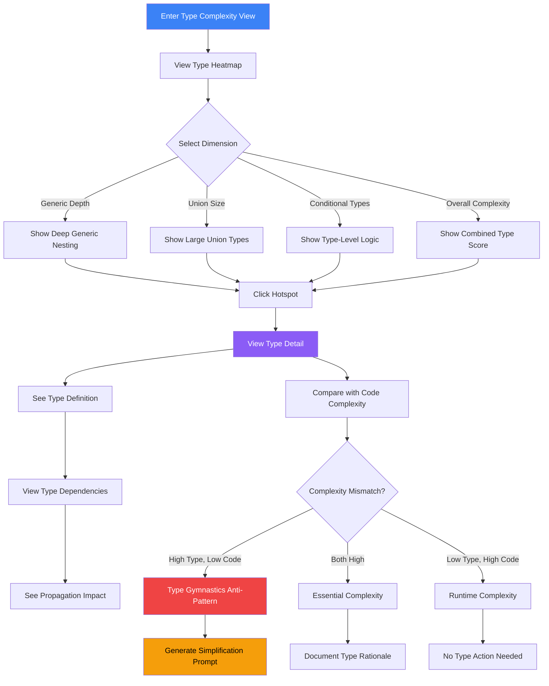

# TypeScript Type Complexity Visualization

## User Story

**As a TypeScript developer**, I want to visualize type-level complexity separately from runtime code complexity, so that I can identify where type gymnastics are adding cognitive load and maintenance burden to the codebase.

## User Need

TypeScript's type system enables powerful compile-time guarantees, but type complexity creates its own cognitive load that traditional code metrics miss. A component with cyclomatic complexity 15 might seem reasonable until you discover it uses deeply nested generics with conditional types that take 20 minutes to understand.

Developers need to answer:

- "Where is type complexity making code harder to maintain?"
- "Which types propagate complexity through the codebase?"
- "When does type safety become type burden?"
- "Where should we simplify types vs. accept essential complexity?"

Type complexity is distinct from code complexity but equally impacts maintainability. The type system creates its own cognitive overhead that compounds runtime complexity.

---

## Core Insight: Type Complexity as Cognitive Tax

TypeScript types exist only at compile time, but they affect:

- **Comprehension Time** - How long to understand what a type accepts
- **Modification Risk** - How easily breaking changes propagate through types
- **IDE Performance** - How fast autocomplete and type checking run
- **Onboarding Friction** - How quickly new developers can contribute

Unlike runtime complexity, type complexity can be avoided by using `any` or loosening constraints. This creates a tension: strict types catch bugs but complex types slow development.

---

## UX Flow

### Entry Points

1. **Primary:** Navigation sidebar "Type Complexity" under Technical Debt section
2. **Secondary:** Cognitive Load Heatmap shows type complexity as separate layer
3. **Contextual:** File detail shows type metrics alongside code metrics
4. **Alert:** Type complexity regression notification
5. **Search:** "complex types" or "type gymnastics" in global search

### User Journey



### Exit Points

1. **To File Detail:** Inspect specific file's type complexity
2. **To Type Dependency Graph:** Visualize type propagation
3. **To AI Prompt:** Generate type simplification suggestions
4. **To Comparison:** Compare type complexity across snapshots
5. **To Cognitive Heatmap:** See types in broader complexity context

---

## Information Architecture

### Type Complexity Metrics (from React Analyzer)

| Metric                          | What It Measures                     | Interpretation                                             |
| ------------------------------- | ------------------------------------ | ---------------------------------------------------------- |
| **Generic Depth**               | Nesting levels of generic parameters | `Array&lt;Promise&lt;Result&lt;T, E&gt;&gt;&gt;` = depth 3 |
| **Conditional Branches**        | Count of conditional type branches   | Ternary conditional type patterns                          |
| **Union Size**                  | Maximum members in union type        | `type Status = 'a' \| 'b' \| 'c' \| ...`                   |
| **Intersection Size**           | Maximum members in intersection type | Type intersection count                                    |
| **Mapped Type Count**           | Count of mapped types                | `{ [K in keyof T]: ... }`                                  |
| **Recursive Types**             | Self-referencing types               | `type Node = { children: Node[] }`                         |
| **Template Literal Complexity** | Template literal type sophistication | Template literal patterns                                  |
| **Type Parameter Count**        | Total generic type parameters        | Count of type parameters                                   |
| **Infer Usage**                 | Count of `infer` keywords            | Type extraction patterns                                   |

### Data Displayed

**Level 1: Type Heatmap (Repository View)**

- Treemap of files colored by type complexity
- Cell size = lines of TypeScript code
- Cell color = type complexity score (0-100)
- Overlayable with code complexity for comparison

**Level 2: Type Dimension View**

- Filter heatmap by specific type metric
- Show only generic depth, or only union size, etc.
- Identify files high on one dimension

**Level 3: Type Detail Panel**

- Specific complex types in the file
- Type dependency graph (what depends on this type)
- Type propagation impact (how far does it spread)
- Suggested simplifications

**Level 4: Type vs. Code Complexity Matrix**

- Scatterplot: X-axis = code complexity, Y-axis = type complexity
- Quadrants reveal different patterns:
  - High Type, Low Code = Type gymnastics
  - High Both = Essential complexity
  - Low Type, High Code = Runtime complexity
  - Low Both = Simple code

### Progressive Disclosure Strategy

| Visible By Default    | Revealed on Hover        | Revealed on Click      |
| --------------------- | ------------------------ | ---------------------- |
| Type complexity score | Breakdown by dimension   | Specific complex types |
| File name             | Type vs. code comparison | Type definitions       |
| Color intensity       | Propagation count        | Dependency graph       |
| Relative size         | Exact metrics            | Historical trend       |

---

## Interaction Patterns

### Primary Actions

| Action              | Trigger            | Result                                     |
| ------------------- | ------------------ | ------------------------------------------ |
| Switch dimensions   | Dropdown selection | Re-color heatmap by selected metric        |
| Compare with code   | Toggle overlay     | Show code complexity alongside types       |
| Filter by threshold | Slider adjustment  | Hide files below type complexity threshold |
| View type detail    | Click file         | Open type analysis panel                   |

### Secondary Actions

| Action             | Trigger         | Result                              |
| ------------------ | --------------- | ----------------------------------- |
| Export type report | Toolbar button  | Download type complexity summary    |
| Show propagation   | Click type name | Visualize where type is used        |
| Generate prompt    | AI button       | Create type simplification prompt   |
| Mark as justified  | Context menu    | Accept type complexity as necessary |

### Micro-interactions

**Heatmap Hover:**

- Show type vs. code complexity comparison
- Display top 3 complex types in file
- Indicate propagation impact badge

**Type Badge:**

- Color codes by severity:
  - Green: Simple types (0-20)
  - Yellow: Moderate types (21-40)
  - Orange: Complex types (41-60)
  - Red: Very complex types (61+)

**Comparison Toggle:**

- Smooth transition between type-only and split view
- Legend updates to show both scales
- Files can be colored by type or code independently

---

## Component Map

This section provides explicit `@vipr/ui` component specifications for TypeScript type complexity visualization.

### Primary Components

| Component      | Import Path               | Configuration                     | Usage in Phase 21                                         |
| -------------- | ------------------------- | --------------------------------- | --------------------------------------------------------- |
| MetricsHeatmap | @vipr/ui/heatmap          | files, metricDefs, onFileClick    | Type complexity visualization by file                     |
| Treemap        | @vipr/ui/treemap          | data, width, height               | Alternative hierarchical view of type complexity          |
| CardTable      | @vipr/ui/card-table       | data, columns, onRowClick         | **Interim scatter plot replacement** - two metric columns |
| MetricBarChart | @vipr/ui/metric-bar-chart | label, value, min, max, direction | Type metric details (generic depth, union size, etc.)     |
| MetricGroup    | @vipr/ui/metric-group     | data, defaultExpanded             | Grouped type metrics in file detail                       |
| InsightCard    | @vipr/ui/insight-card     | insight, defaultExpanded          | Type complexity insights and recommendations              |
| Tabs           | @vipr/ui/tabs             | tabs, variant="underline"         | Switch between Heatmap/Table/Detail views                 |
| Dropdown       | @vipr/ui/dropdown         | variant="filter", options         | Dimension filter, metric selection                        |
| Badge          | @vipr/ui/badge            | variant, size                     | Type complexity severity indicators                       |
| Button         | @vipr/ui/button           | appearance, size, onClick         | Generate simplification prompt, view details              |
| Alert          | @vipr/ui/alert            | variant="banner", type="warning"  | Type gymnastics anti-pattern warnings                     |

### Color Tokens

**Type Complexity Severity:**

- `green-500` / `green-500/20` - Simple (0-20)
- `yellow-500` / `yellow-500/20` - Moderate (21-40)
- `red-500` / `red-500/20` - Complex (41-60)
- `red-700` / `red-700/30` - Very Complex (61+)

**Type vs Code Quadrants:**

- `violet-500` - Type gymnastics (high type, low code)
- `red-500` - Essential complexity (high both)
- `sky-500` - Runtime complexity (low type, high code)
- `green-500` - Simple (low both)

**Code Styling:**

- `bg-gray-50 dark:bg-gray-900` - Code block backgrounds
- `border-gray-200 dark:border-gray-700` - Code block borders

### Typography Tokens

**Type Signatures:**

- `font-mono text-xs text-gray-800 dark:text-gray-100` - Type definitions
- `bg-gray-50 dark:bg-gray-900 rounded px-2 py-1` - Inline type code

**Metrics:**

- `text-sm font-medium text-gray-700 dark:text-gray-300` - Metric labels
- `text-lg font-semibold text-gray-800 dark:text-gray-100` - Metric values

**Severity Labels:**

- `text-xs font-semibold uppercase tracking-wide` - Severity badges (SIMPLE/MODERATE/COMPLEX)

### Layout Patterns

**Page Container:**

```tsx
className = 'px-4 sm:px-6 lg:px-8 py-8';
```

**Heatmap Container:**

```tsx
className = 'bg-white dark:bg-gray-800 rounded-xl shadow-xs p-6 mb-6';
```

**Type Detail Panel:**

```tsx
className = 'grid grid-cols-1 lg:grid-cols-2 gap-6';
```

### Composition Patterns

#### Type Complexity Dashboard

```tsx
<div className="px-4 sm:px-6 lg:px-8 py-8">
  {/* Page header */}
  <div className="flex items-center justify-between mb-6">
    <div>
      <h1 className="text-2xl font-semibold text-gray-800 dark:text-gray-100">
        TypeScript Type Complexity
      </h1>
      <p className="text-sm text-gray-600 dark:text-gray-300 mt-1">
        Identify where type-level complexity adds cognitive load
      </p>
    </div>

    <div className="flex items-center gap-3">
      <Dropdown
        variant="filter"
        label="Dimension"
        options={[
          { value: 'all', label: 'All Metrics' },
          { value: 'generic', label: 'Generic Depth' },
          { value: 'conditional', label: 'Conditional Types' },
          { value: 'union', label: 'Union Size' },
          { value: 'intersection', label: 'Intersection Size' },
        ]}
        selected={selectedDimension}
        onSelect={setSelectedDimension}
      />

      <Button appearance="secondary" onClick={exportReport}>
        Export Report
      </Button>
    </div>
  </div>

  {/* Type gymnastics warning */}
  {hasTypeGymnastics && (
    <Alert variant="banner" type="warning" className="mb-6">
      <div className="space-y-2">
        <p className="font-semibold">Type Gymnastics Detected</p>
        <p className="text-sm">
          {typeGymnasticsCount} files have high type complexity with low code complexity, indicating
          over-engineered types that may add more burden than value.
        </p>
        <Button appearance="tertiary" size="sm" onClick={viewTypeGymnastics}>
          View Files
        </Button>
      </div>
    </Alert>
  )}

  {/* Tabs for different views */}
  <Tabs
    variant="underline"
    tabs={[
      {
        label: 'Heatmap',
        content: (
          <div className="bg-white dark:bg-gray-800 rounded-xl shadow-xs p-6">
            <div className="flex items-center justify-between mb-4">
              <h2 className="text-lg font-semibold text-gray-800 dark:text-gray-100">
                Type Complexity by File
              </h2>
              <div className="flex items-center gap-4">
                <div className="flex items-center gap-2 text-sm text-gray-600 dark:text-gray-400">
                  <span>Color Scale:</span>
                  <div className="flex items-center gap-1">
                    <div className="w-12 h-4 bg-green-500 rounded-l" />
                    <div className="w-12 h-4 bg-yellow-500" />
                    <div className="w-12 h-4 bg-orange-500" />
                    <div className="w-12 h-4 bg-red-500 rounded-r" />
                  </div>
                  <span className="text-xs">0 → 100</span>
                </div>
              </div>
            </div>

            <MetricsHeatmap
              files={typescriptFiles}
              metricDefs={[
                {
                  id: 'typeComplexity',
                  label: 'Type Complexity',
                  getValue: file => file.metrics.typeComplexity,
                  color: value => {
                    if (value >= 61) return '#ff5656'; // red-500
                    if (value >= 41) return '#f7cd4c'; // yellow/orange
                    if (value >= 21) return '#f0bb33'; // yellow-500
                    return '#4bd37d'; // green-500
                  },
                },
              ]}
              onFileClick={file => openFileDetail(file.id)}
              maxFiles={500}
            />

            {/* Top complex types */}
            <div className="mt-6 border-t border-gray-200 dark:border-gray-700 pt-6">
              <h3 className="text-sm font-semibold text-gray-700 dark:text-gray-300 mb-3">
                Top Complex Types
              </h3>
              <div className="space-y-2">
                {topComplexTypes.slice(0, 5).map((type, index) => (
                  <div
                    key={index}
                    className="flex items-center justify-between p-3 bg-gray-50 dark:bg-gray-900 rounded hover:bg-gray-100 dark:hover:bg-gray-800 cursor-pointer"
                    onClick={() => openTypeDetail(type)}
                  >
                    <div className="flex-1">
                      <code className="text-xs font-mono text-violet-600 dark:text-violet-400">
                        {type.name}
                      </code>
                      <span className="text-xs text-gray-600 dark:text-gray-400 ml-2">
                        - {type.file}
                      </span>
                    </div>
                    <Badge
                      variant={type.score >= 61 ? 'red' : type.score >= 41 ? 'yellow' : 'gray'}
                      size="sm"
                    >
                      {type.score}
                    </Badge>
                  </div>
                ))}
              </div>
            </div>
          </div>
        ),
      },
      {
        label: 'Table View',
        content: (
          <CardTable
            title="Type Complexity Ranking"
            description="Files sorted by type complexity. Click to view details."
            columns={[
              { key: 'file', label: 'File', sortable: true },
              { key: 'typeComplexity', label: 'Type Complexity', sortable: true },
              { key: 'codeComplexity', label: 'Code Complexity', sortable: true },
              { key: 'delta', label: 'Delta', sortable: true },
              { key: 'pattern', label: 'Pattern' },
            ]}
            data={typescriptFiles.map(file => ({
              file: (
                <div className="space-y-1">
                  <div className="text-sm font-medium text-gray-800 dark:text-gray-100">
                    {file.name}
                  </div>
                  <div className="text-xs font-mono text-gray-600 dark:text-gray-400">
                    {file.path}
                  </div>
                </div>
              ),
              typeComplexity: (
                <div className="flex items-center gap-2">
                  <span
                    className={cn(
                      'text-sm font-semibold',
                      file.typeComplexity >= 61 && 'text-red-600 dark:text-red-400',
                      file.typeComplexity >= 41 &&
                        file.typeComplexity < 61 &&
                        'text-yellow-600 dark:text-yellow-400',
                      file.typeComplexity < 41 && 'text-green-600 dark:text-green-400'
                    )}
                  >
                    {file.typeComplexity}
                  </span>
                </div>
              ),
              codeComplexity: (
                <span className="text-sm text-gray-700 dark:text-gray-300">
                  {file.codeComplexity}
                </span>
              ),
              delta: (
                <span
                  className={cn(
                    'text-sm font-medium',
                    file.typeComplexity - file.codeComplexity > 20 &&
                      'text-violet-600 dark:text-violet-400',
                    Math.abs(file.typeComplexity - file.codeComplexity) <= 20 &&
                      'text-gray-600 dark:text-gray-400'
                  )}
                >
                  {file.typeComplexity > file.codeComplexity ? '+' : ''}
                  {file.typeComplexity - file.codeComplexity}
                </span>
              ),
              pattern: (
                <Badge
                  variant={
                    file.typeComplexity > file.codeComplexity + 20
                      ? 'violet'
                      : file.typeComplexity > 40 && file.codeComplexity > 40
                        ? 'red'
                        : 'gray'
                  }
                  size="sm"
                >
                  {file.typeComplexity > file.codeComplexity + 20
                    ? 'Type Gymnastics'
                    : file.typeComplexity > 40 && file.codeComplexity > 40
                      ? 'Essential'
                      : 'Balanced'}
                </Badge>
              ),
            }))}
            onRowClick={(row, index) => openFileDetail(typescriptFiles[index].id)}
            keyExtractor={(_, index) => typescriptFiles[index].id}
          />
        ),
      },
      {
        label: 'Type Detail',
        content: (
          <div className="space-y-6">
            {selectedFile && (
              <>
                {/* File header */}
                <div className="bg-white dark:bg-gray-800 rounded-xl shadow-xs p-6">
                  <h2 className="text-lg font-semibold text-gray-800 dark:text-gray-100 mb-1">
                    {selectedFile.name}
                  </h2>
                  <p className="text-sm font-mono text-gray-600 dark:text-gray-400 mb-4">
                    {selectedFile.path}
                  </p>

                  {/* Summary comparison */}
                  <div className="grid grid-cols-2 gap-4 mb-4">
                    <div>
                      <div className="text-xs text-gray-600 dark:text-gray-400 mb-1">
                        Type Complexity
                      </div>
                      <div className="text-2xl font-bold text-violet-600 dark:text-violet-400">
                        {selectedFile.typeComplexity}
                      </div>
                    </div>
                    <div>
                      <div className="text-xs text-gray-600 dark:text-gray-400 mb-1">
                        Code Complexity
                      </div>
                      <div className="text-2xl font-bold text-gray-800 dark:text-gray-100">
                        {selectedFile.codeComplexity}
                      </div>
                    </div>
                  </div>

                  {/* Pattern identification */}
                  {selectedFile.typeComplexity > selectedFile.codeComplexity + 20 && (
                    <Alert variant="card" type="warning">
                      <p className="text-sm font-semibold mb-1">Type Gymnastics Anti-Pattern</p>
                      <p className="text-xs">
                        This file has significantly higher type complexity than code complexity,
                        suggesting over-engineered types that may add more cognitive burden than
                        value.
                      </p>
                    </Alert>
                  )}
                </div>

                {/* Type metrics breakdown */}
                <div className="bg-white dark:bg-gray-800 rounded-xl shadow-xs p-6">
                  <h3 className="text-lg font-semibold text-gray-800 dark:text-gray-100 mb-4">
                    Type Metrics Breakdown
                  </h3>

                  <MetricGroup
                    data={{
                      label: 'Type Complexity Metrics',
                      score: selectedFile.typeComplexity,
                      metrics: [
                        {
                          label: 'Generic Depth',
                          value: selectedFile.metrics.genericDepth,
                          min: 0,
                          max: 10,
                          direction: 'lower-is-better',
                          description: 'Nesting levels of generic parameters',
                        },
                        {
                          label: 'Conditional Types',
                          value: selectedFile.metrics.conditionalTypes,
                          min: 0,
                          max: 20,
                          direction: 'lower-is-better',
                          description: 'Count of conditional type branches',
                        },
                        {
                          label: 'Union Size',
                          value: selectedFile.metrics.unionSize,
                          min: 0,
                          max: 15,
                          direction: 'lower-is-better',
                          description: 'Maximum members in union type',
                        },
                        {
                          label: 'Mapped Types',
                          value: selectedFile.metrics.mappedTypes,
                          min: 0,
                          max: 10,
                          direction: 'lower-is-better',
                          description: 'Count of mapped type constructs',
                        },
                      ],
                    }}
                    defaultExpanded
                  />
                </div>

                {/* Complex type definitions */}
                <div className="bg-white dark:bg-gray-800 rounded-xl shadow-xs p-6">
                  <h3 className="text-lg font-semibold text-gray-800 dark:text-gray-100 mb-4">
                    Complex Type Definitions
                  </h3>

                  <div className="space-y-4">
                    {selectedFile.complexTypes.map((type, index) => (
                      <div
                        key={index}
                        className="border border-gray-200 dark:border-gray-700 rounded-lg p-4"
                      >
                        <div className="flex items-start justify-between mb-2">
                          <code className="text-sm font-mono text-violet-600 dark:text-violet-400">
                            {type.name}
                          </code>
                          <Badge
                            variant={
                              type.complexity >= 60
                                ? 'red'
                                : type.complexity >= 40
                                  ? 'yellow'
                                  : 'gray'
                            }
                            size="sm"
                          >
                            Complexity: {type.complexity}
                          </Badge>
                        </div>

                        <div className="bg-gray-50 dark:bg-gray-900 rounded border border-gray-200 dark:border-gray-700 p-3 mb-3">
                          <pre className="text-xs font-mono text-gray-800 dark:text-gray-100 overflow-x-auto">
                            {type.definition}
                          </pre>
                        </div>

                        <div className="flex items-center gap-2">
                          <Button
                            appearance="secondary"
                            size="sm"
                            onClick={() => generateSimplificationPrompt(type)}
                          >
                            Generate Simplification Prompt
                          </Button>
                          <Button
                            appearance="tertiary"
                            size="sm"
                            onClick={() => viewTypeDependencies(type)}
                          >
                            View Dependencies
                          </Button>
                        </div>
                      </div>
                    ))}
                  </div>
                </div>

                {/* Insights and recommendations */}
                {selectedFile.insights && selectedFile.insights.length > 0 && (
                  <div>
                    {selectedFile.insights.map((insight, index) => (
                      <InsightCard
                        key={index}
                        insight={insight}
                        defaultExpanded={index === 0}
                        onAction={action => handleInsightAction(action)}
                      />
                    ))}
                  </div>
                )}
              </>
            )}
          </div>
        ),
      },
    ]}
  />
</div>
```

### Type Signature Styling Pattern

**For inline type code:**

```tsx
<code className="font-mono text-xs bg-gray-50 dark:bg-gray-900 text-violet-600 dark:text-violet-400 px-2 py-1 rounded">
  {typeName}
</code>
```

**For type definition blocks:**

```tsx
<div className="bg-gray-50 dark:bg-gray-900 rounded border border-gray-200 dark:border-gray-700 p-3">
  <pre className="text-xs font-mono text-gray-800 dark:text-gray-100 overflow-x-auto whitespace-pre">
    {typeDefinition}
  </pre>
</div>
```

### Responsive Behavior

**Mobile (< 640px):**

- Heatmap uses reduced grid size (max 20×20 instead of 60×60)
- Type detail panel collapses to single column
- Table hides Delta and Pattern columns
- Type definition code blocks scroll horizontally

**Tablet (640px - 1024px):**

- Heatmap uses medium grid (30×30)
- Type detail shows 1 column
- Table shows all columns

**Desktop (1024px+):**

- Full heatmap grid (up to 60×60)
- Type detail uses 2-column layout
- All table columns visible

### Dark Mode Considerations

All components adapt automatically:

- Code blocks: `bg-gray-50` → `bg-gray-900`, `border-gray-200` → `border-gray-700`
- Type names: `text-violet-600` → `text-violet-400`
- MetricBarChart: Uses alpha variants for fill colors
- InsightCard: Background and text adapt seamlessly

## Design System Gaps

### Gap 1: Scatter Plot / Bubble Chart 📊 MEDIUM PRIORITY

**Description:** XY scatter chart to visualize correlation between type complexity and code complexity.

**Current Impact on Phase 21:**

- Cannot visualize the four quadrants spatially:
  - Type Gymnastics (high type, low code)
  - Essential Complexity (high both)
  - Runtime Complexity (low type, high code)
  - Simple (low both)
- Cannot show correlation pattern visually
- Missing spatial clustering that reveals patterns

**Interim Solution (Implemented Above):**

Use **CardTable with two metric columns:**

```tsx
<CardTable
  columns={[
    { key: 'file', label: 'File' },
    { key: 'typeComplexity', label: 'Type Complexity', sortable: true },
    { key: 'codeComplexity', label: 'Code Complexity', sortable: true },
    { key: 'delta', label: 'Delta', sortable: true },
    { key: 'pattern', label: 'Pattern' },
  ]}
  // Delta column = typeComplexity - codeComplexity
  // Pattern column = Badge showing quadrant classification
/>
```

**Why this works:**

- ✅ Provides all the same data (two metrics per file)
- ✅ Sortable by either metric to find extremes
- ✅ Delta column shows relationship strength
- ✅ Pattern Badge classifies files into quadrants
- ✅ Searchable and filterable
- ✅ Accessible (screen readers)

**Missing from table approach:**

- ❌ Visual clustering of similar files
- ❌ Quadrant boundaries (invisible in table)
- ❌ Spatial correlation visualization
- ❌ Outlier detection by visual inspection

**Future Enhancement Options:**

**Option 1: Chart.js Scatter Plugin**

- Use Chart.js built-in scatter chart type
- Pros: Already have Chart.js as dependency, simple to add
- Cons: Limited customization, basic quadrant support
- Timeline: 1-2 days

**Option 2: Recharts Library**

- Add Recharts for more sophisticated scatter charts
- Pros: Better customization, React-native, responsive
- Cons: Additional dependency (~60KB), different API than Chart.js
- Timeline: 3-5 days

**Option 3: Custom D3 Scatter**

- Build custom scatter plot with D3
- Pros: Full control, can add quadrant lines, labels
- Cons: Significant development effort, state management
- Timeline: 1-2 weeks

**Recommendation:** **Start with table-only approach** (implemented above). Add Chart.js scatter only if:

1. Users explicitly request spatial visualization
2. Pattern detection requires visual clustering
3. Team has bandwidth for 1-2 day implementation

**User Impact:** Low-Medium - table provides 80% of value, scatter adds polish

---

## Visual Concepts

**NOTE:** Visual concepts updated to reflect table-based implementation for type vs. code correlation. Scatter plot deferred to future enhancement (see Design System Gaps).

### Type Complexity Heatmap

```
TypeScript Type Complexity
================================================================================

View: [Type Complexity v]    Dimension: [All Metrics v]    [Compare with Code]

+------------------------------------------------------------------+
|  src/types/                                                       |
|  +------------------------+  +----------------------------------+ |
|  | api-types.ts          |  | utility-types.ts                 | |
|  | Generic Depth: 5      |  | Conditional: 12                  | |
|  | Union Size: 8         |  | Mapped: 7                        | |
|  |                        |  |                                  | |
|  |      ORANGE            |  |         RED                      | |
|  +------------------------+  +----------------------------------+ |
|                              +----------------------------------+ |
|  +------------------------+  | domain-types.ts                  | |
|  | component-props.ts     |  | Union Size: 3                    | |
|  | Generic Depth: 2       |  | Generic Depth: 2                 | |
|  |                        |  |                                  | |
|  |      GREEN             |  |      GREEN                       | |
|  +------------------------+  +----------------------------------+ |
+------------------------------------------------------------------+

Color Scale (Type Complexity):
[  GREEN  |  YELLOW  |  ORANGE  |   RED   ]
    0-20      21-40      41-60     61+

Top Complex Types:
1. `ApiResponse<T, E>` - utility-types.ts - Score: 78
2. `RouteConfig` - api-types.ts - Score: 65
3. `ComponentProps<T>` - component-props.ts - Score: 42

================================================================================
```

### Type vs. Code Complexity Matrix

```
Type vs. Code Complexity Scatter
================================================================================

Type
Complexity
100 |
    |                    [domain-types.ts]
 80 |         [api-types.ts]
    |                                    TYPE GYMNASTICS
 60 |                                    (Simplify types)
    |  [utils.ts]
 40 |            [component-props.ts]   ESSENTIAL COMPLEXITY
    |                                    (Accept or refactor both)
 20 |  [Button.tsx]
    |               [hooks.ts]          RUNTIME COMPLEXITY
  0 +----------------------------------------> Code Complexity
    0      20      40      60      80     100

QUADRANTS:

Bottom-Left (Low Type, Low Code): Simple, maintainable code
Bottom-Right (Low Type, High Code): Runtime complexity, types are fine
Top-Left (High Type, Low Code): TYPE GYMNASTICS - simplify types
Top-Right (High Type, High Code): Essential complexity or needs refactoring

================================================================================
```

### Type Detail Panel

```
+------------------------------------------------------------------+
| Type Complexity: api-types.ts                                     |
+------------------------------------------------------------------+
| Overall Score: 65 (Complex)                                       |
|                                                                   |
| Breakdown:                                                        |
| - Generic Depth: 5         [========--------] High              |
| - Conditional Branches: 3  [=====-----------] Moderate          |
| - Union Size: 8            [=======---------] High              |
| - Mapped Types: 2          [===--------------] Low              |
|                                                                   |
| -- Complex Types ---------------------------------------------------
|                                                                   |
| 1. ApiResponse&lt;T, E = Error&gt;                         Score: 78   |
|    Location: line 24                                             |
|    Used by: 47 files                                             |
|                                                                   |
|    type ApiResponse&lt;T, E = Error&gt; =                              |
|      | { status: 'success'; data: T }                             |
|      | { status: 'error'; error: E }                              |
|      | { status: 'loading' }                                      |
|      | { status: 'idle' };                                        |
|                                                                   |
|    Complexity Factors:                                           |
|    - Discriminated union (4 branches)                            |
|    - Generic with default parameter                              |
|    - Used extensively (high propagation)                         |
|                                                                   |
|    Suggestion: Consider simpler alternatives for common cases    |
|    [Generate Simplification Prompt]   [View Propagation]         |
|                                                                   |
| 2. `DeepPartial<T>`                                    Score: 65   |
|    Location: line 156                                            |
|    Used by: 12 files                                             |
|                                                                   |
|    type DeepPartial&lt;T&gt; = T extends object                        |
|      ? { [P in keyof T]?: DeepPartial&lt;T[P]&gt; }                    |
|      : T;                                                         |
|                                                                   |
|    Complexity Factors:                                           |
|    - Recursive type definition                                   |
|    - Conditional type logic                                      |
|    - Mapped type transformation                                  |
|                                                                   |
|    Suggestion: Consider using library utility types              |
|    [Generate Simplification Prompt]   [Mark as Justified]        |
|                                                                   |
+------------------------------------------------------------------+
| [Export Type Report]   [Compare with Code Complexity]            |
+------------------------------------------------------------------+
```

### Type Propagation Graph

```
Type Propagation: ApiResponse&lt;T, E&gt;
================================================================================

ApiResponse&lt;T, E&gt; (api-types.ts)
  |
  +-- DIRECT USAGE (12 files)
  |   |
  |   +-- hooks/useApi.ts
  |   +-- services/user-service.ts
  |   +-- services/product-service.ts
  |   +-- ... (9 more)
  |
  +-- INDIRECT USAGE (35 files)
      |
      +-- hooks/useUser.ts (via useApi)
      +-- hooks/useProducts.ts (via useApi)
      +-- components/UserProfile.tsx (via useUser)
      +-- pages/Dashboard.tsx (via useUser, useProducts)
      +-- ... (31 more)

IMPACT ANALYSIS:

Total Affected Files: 47
Propagation Depth: 4 levels
Breaking Change Risk: HIGH

If you change ApiResponse, you must update:
- 12 direct consumers
- Review 35 indirect consumers
- Consider compatibility wrappers

[Show Full Dependency Tree]   [Generate Migration Prompt]

================================================================================
```

---

## Complexity Analysis Methodology

### Type Complexity Score Calculation

```
TypeComplexity = (
  genericDepth × 3.0 +
  conditionalBranches × 2.5 +
  unionSize × 0.5 +
  intersectionSize × 0.5 +
  mappedTypeCount × 2.0 +
  recursiveTypes × 4.0 +
  templateLiteralComplexity × 1.5 +
  typeParameterCount × 0.5 +
  inferKeywordCount × 2.0
)

Where weights reflect cognitive load per unit.
```

### Meaningful Thresholds

| Type Score | Classification | Interpretation                         | Action                    |
| ---------- | -------------- | -------------------------------------- | ------------------------- |
| 0-20       | Simple Types   | Easy to understand, low cognitive load | None needed               |
| 21-40      | Moderate Types | Requires attention but manageable      | Monitor                   |
| 41-60      | Complex Types  | Significant cognitive overhead         | Review for simplification |
| 61+        | Very Complex   | High maintenance burden, IDE slowdown  | Priority refactoring      |

### Threshold Justification

**Generic Depth Threshold: 3 levels**

- Depth 1: `Array<T>` - Trivial
- Depth 2: `Promise<Result<T>>` - Common pattern
- Depth 3: `Array<Promise<Result<T>>>` - Cognitive limit
- Depth 4+: `Map<K, Array<Promise<Result<T>>>>` - Difficult to reason about

**Union Size Threshold: 10 members**

- 2-4 members: Discriminated union pattern (good)
- 5-10 members: State machine or enum-like (acceptable)
- 11-20 members: Difficult to exhaustively handle
- 21+ members: Consider alternative approaches

**Conditional Types Threshold: 5 in file**

- 1-2: Common utility types (good)
- 3-5: Type-level logic emerging (moderate)
- 6-10: Significant type-level programming (complex)
- 11+: Type system being abused (refactor)

### Pattern Recognition

**Type Anti-Patterns That Indicate Problems:**

1. **Generic Soup**
   - Pattern: `<T, U, V, W, X, Y, Z>` - Many type parameters
   - Problem: Impossible to track relationships
   - Detection: typeParameterCount > 5 in single type
   - Example: `function complex<T, U, V, W, X>(a: T, b: U, c: V, d: W, e: X): ...`
   - Solution: Extract to multiple simpler functions

2. **Conditional Type Maze**
   - Pattern: Nested conditional types 3+ levels deep
   - Problem: Mental stack overflow
   - Detection: conditionalBranches > 5, nesting > 2
   - Example: Nested conditional types with multiple branches
   - Solution: Extract to helper types with descriptive names

3. **Union Explosion**
   - Pattern: 15+ member union type
   - Problem: Exhaustive handling is tedious
   - Detection: unionSize > 15
   - Example: `type Status = 'a' | 'b' | 'c' | ... | 'o' | 'p'`
   - Solution: Group into discriminated unions or use string literals with validation

4. **Recursive Type Hell**
   - Pattern: Deeply recursive type without clear termination
   - Problem: Type checking slowness, IDE hangs
   - Detection: recursiveTypes > 0, genericDepth > 4
   - Example: `type DeepReadonly<T> = { readonly [K in keyof T]: DeepReadonly<T[K]> }`
   - Solution: Limit recursion depth or use library utilities

5. **Type Gymnastics**
   - Pattern: High type complexity, low code complexity
   - Problem: Types doing work that could be simpler
   - Detection: typeScore > 60, cyclomaticComplexity < 20
   - Example: Complex mapped types for simple transformations
   - Solution: Use runtime validation or simpler types

---

## Detection Algorithms

### Type Complexity vs. Code Complexity Correlation

```
FOR each file:
  typeScore = calculateTypeComplexity(file)
  codeScore = calculateCodeComplexity(file)

  IF typeScore > 60 AND codeScore < 30:
    FLAG as "type_gymnastics"
    SUGGEST: Simplify types, consider runtime validation

  ELSE IF typeScore > 50 AND codeScore > 50:
    FLAG as "essential_complexity"
    SUGGEST: Accept or refactor both type and code

  ELSE IF typeScore < 30 AND codeScore > 60:
    FLAG as "runtime_complexity"
    SUGGEST: Types are fine, focus on code refactoring

  ELSE IF typeScore < 30 AND codeScore < 30:
    FLAG as "simple_code"
    SUGGEST: No action needed
```

### Type Propagation Analysis

```
function analyzeTypePropagation(typeName: string, sourceFile: string):
  directUsages = findDirectImports(typeName, sourceFile)
  indirectUsages = []

  FOR each directUsage:
    transitiveUsages = findTransitiveImports(directUsage.file)
    indirectUsages.extend(transitiveUsages)

  propagationDepth = calculateMaxDepth(directUsages, indirectUsages)
  propagationBreadth = directUsages.length + indirectUsages.length

  blastRadius = (
    typeComplexityScore × propagationBreadth × (1 + 0.2 × propagationDepth)
  )

  RETURN {
    directUsages,
    indirectUsages,
    depth: propagationDepth,
    breadth: propagationBreadth,
    blastRadius
  }
```

### Type Anti-Pattern Detection

```
function detectTypeAntiPatterns(file: SourceFile):
  anti-patterns = []

  // Generic Soup
  FOR each function/type:
    IF typeParameters.length > 5:
      anti-patterns.add({
        type: "generic_soup",
        severity: "warning",
        location: function.location,
        suggestion: "Extract to multiple simpler functions"
      })

  // Conditional Type Maze
  conditionalDepth = calculateConditionalNesting(file)
  IF conditionalDepth > 2:
    anti-patterns.add({
      type: "conditional_maze",
      severity: "warning",
      suggestion: "Extract conditional types to named helpers"
    })

  // Recursive Type Hell
  FOR each recursive type:
    IF genericDepth > 4:
      anti-patterns.add({
        type: "recursive_hell",
        severity: "critical",
        suggestion: "Limit recursion or use library utilities"
      })

  // Type Gymnastics
  IF typeComplexity > 60 AND codeComplexity < 30:
    anti-patterns.add({
      type: "type_gymnastics",
      severity: "info",
      suggestion: "Consider simpler types or runtime validation"
    })

  RETURN anti-patterns
```

### Alert Triggers

| Condition                            | Alert Type        | Notification              |
| ------------------------------------ | ----------------- | ------------------------- |
| Type complexity > 70                 | Critical          | Immediate notification    |
| Type propagation affects 50+ files   | High Impact       | Daily digest              |
| Type vs. code mismatch (gymnastics)  | Type Anti-Pattern | Weekly summary            |
| Type complexity increases 20+ points | Regression        | Snapshot comparison alert |
| Generic depth > 5                    | Deep Nesting      | Code review flag          |

---

## Integration with Existing Features

### Cognitive Load Heatmap (18)

**Addition: Type Complexity Layer**

The cognitive load heatmap should offer type complexity as a separate dimension alongside Halstead effort and cognitive complexity.

**Implementation:**

- Add "Type Complexity" to metric dropdown
- Type complexity uses same color scale (0-100)
- Comparison mode: Side-by-side with code complexity
- Hybrid mode: Blended view (average of type and code)

**Insight Generation:**
When both type and code complexity are high, generate insight:

```
"This file has high complexity in both types (65) and code (72).
Consider refactoring both or documenting the essential complexity."
```

When type is high but code is low:

```
"Type complexity (68) significantly exceeds code complexity (22).
Review types for over-engineering or unnecessary type-level logic."
```

### Blast Radius Hotspot View (01)

**Addition: Type Propagation Factor**

Blast radius should account for type propagation, not just import dependencies.

**Enhanced Formula:**

```
BlastRadius = (
  ComplexityScore × DependencyFactor × TypePropagationFactor
)

Where:
  TypePropagationFactor = 1 + (0.1 × typePropagationBreadth)
```

**Why:** A complex generic type used in 50 components creates massive blast radius even if the file itself has low code complexity.

**Example:**

- File: `api-types.ts`
- Code Complexity: 25 (low)
- Type Complexity: 72 (high)
- Type Propagation: 47 files
- Result: Blast radius elevated from 50 to 85 due to type propagation

**Visual Indicator:**
Add badge to blast radius view showing type propagation:

```
[api-types.ts]
Blast Radius: 85
├─ Code Complexity: 25
├─ Dependencies: 12 direct
└─ Type Propagation: 47 files [!]
```

### Complexity Velocity Dashboard (02)

**Addition: Type Complexity Velocity Track**

Track type complexity changes over time alongside code complexity.

**New Chart: Dual-Track Velocity**

```
Complexity Velocity (Dual Track)
================================================================================

Score
100 |
    |                     CODE COMPLEXITY
 75 |                ___---    \
    |          ___---           \___
 50 |    ___--                      ---___
    |
 25 |              TYPE COMPLEXITY
    |         ___----------___
  0 +-----|-----|-----|-----|-----|-----|-----|-----|-----|-->
      Jan 5  Jan 10 Jan 15 Jan 20 Jan 25 Jan 30 Feb 1  Feb 5

Code Velocity: -1.2 pts/week [Improving]
Type Velocity: +0.8 pts/week [Degrading]

ANALYSIS: Type complexity increasing while code complexity decreasing.
Possible over-engineering or excessive type safety efforts.
================================================================================
```

**Insights from Divergent Trends:**

1. **Type velocity up, code velocity down:** Possible over-engineering
2. **Both velocity up:** Technical debt accumulation
3. **Type velocity down, code velocity up:** Good refactoring (simplifying types while adding features)
4. **Both velocity down:** Successful refactoring campaign

### Architectural AntiPatterns Detection (04)

**Addition: Type-Level AntiPatterns**

Extend architectural anti-patterns to include type-specific anti-patterns.

**New Anti-Pattern Categories:**

| Anti-Pattern              | Description                              | Detection Signal                             |
| ------------------------- | ---------------------------------------- | -------------------------------------------- |
| **Type Gymnastics**       | Overly complex types for simple problems | typeComplexity > 60, codeComplexity < 30     |
| **Generic Soup**          | Too many type parameters                 | typeParameterCount > 5 in single declaration |
| **Conditional Maze**      | Nested conditional types                 | conditionalBranches > 5, nesting > 2         |
| **Type Propagation Bomb** | Type used in 50+ files                   | typePropagationBreadth > 50                  |
| **Recursive Type Hell**   | Deep recursive types                     | recursiveTypes > 0, genericDepth > 4         |
| **Union Explosion**       | Massive union types                      | unionSize > 15                               |

**Example Anti-Pattern Report:**

```
Type Gymnastics Anti-Pattern
================================================================================

File: utils/types.ts
Severity: Warning

This file has high type complexity (68) but low code complexity (22).
The types are doing more work than the runtime code.

Complex Types:
1. `DeepPartial<T>` - Recursive mapped type with conditionals
2. `StrictOmit<T, K>` - Complex conditional type for omitting keys
3. `PathsToProps<T>` - Template literal type maze

RECOMMENDATION:
Consider using established library utilities (e.g., type-fest) rather than
implementing complex type transformations. For unique cases, ensure types
are well-documented and tested with type assertions.

[Generate Simplification Prompt]   [Mark as Justified]
================================================================================
```

---

## Psychological Principles

### Separating Type from Code Complexity

Developers mentally separate "type problems" from "code problems." Visualizing them separately:

- Validates their experience ("these types ARE hard")
- Enables targeted action (simplify types without touching code)
- Prevents conflation (high type complexity != bad code)

### Making Invisible Work Visible

Type complexity is invisible in traditional metrics. Showing it explicitly:

- Acknowledges the cognitive load developers experience
- Justifies time spent understanding types
- Validates requests for type simplification

### Framing Type Complexity as a Trade-off

Avoid framing complex types as "bad." Instead, frame as trade-off:

- High type complexity + high safety = worthwhile
- High type complexity + low bug prevention = over-engineering
- Context determines whether complexity is justified

### Type Propagation as Blast Radius

Using the same "blast radius" mental model for types:

- Leverages existing understanding
- Shows consequences of type changes
- Encourages consideration before modifying widely-used types

---

## Success Metrics

| Metric                         | Target       | Measurement                                        |
| ------------------------------ | ------------ | -------------------------------------------------- |
| Type hotspot identification    | < 10 seconds | Time to find highest type complexity file          |
| Type vs. code comparison usage | > 40%        | Users who view type/code scatter plot              |
| Type anti-pattern recognition  | > 60%        | Users who correctly identify type gymnastics       |
| Type simplification prompts    | > 25%        | Type anti-patterns leading to AI prompt generation |
| Type propagation review        | > 50%        | Users who check propagation before changing type   |

---

## Example Scenarios

### Scenario 1: Type Gymnastics Detection

**File:** `utils/type-helpers.ts`
**Metrics:**

- Type Complexity: 78 (Very Complex)
- Code Complexity: 18 (Low)
- Type/Code Ratio: 4.3x

**Analysis:**
The file implements custom utility types with deep recursion and conditional logic:

```typescript
type DeepPartial<T> = T extends object ? { [P in keyof T]?: DeepPartial<T[P]> } : T;

type StrictOmit<T, K extends keyof T> = Pick<T, Exclude<keyof T, K>>;

type PathsToProps<T> = T extends object
  ? {
      [K in keyof T]: K extends string
        ? T[K] extends object
          ? `${K}` | `${K}.${PathsToProps<T[K]>}`
          : `${K}`
        : never;
    }[keyof T]
  : never;
```

**Complexity Breakdown:**

- DeepPartial: Recursive (4 pts), Conditional (2.5 pts), Mapped (2 pts) = 8.5
- StrictOmit: Mapped (2 pts), Generic depth 2 (6 pts) = 8
- PathsToProps: Recursive (4 pts), Template literal (4.5 pts), Nested conditionals (7.5 pts) = 16

**Recommendation:**
Replace with established library utilities:

```typescript
// Before (custom, complex)
type DeepPartial&lt;T&gt; = ...

// After (library, simple)
import type { PartialDeep } from 'type-fest';
```

**Expected Outcome:**
Type complexity drops from 78 to 25. Maintenance burden reduced. IDE performance improves.

---

### Scenario 2: Type Propagation Bomb

**File:** `types/api.ts`
**Type:** `ApiResponse<T, E = Error>`
**Metrics:**

- Type Complexity: 45 (Moderate)
- Direct Usage: 23 files
- Indirect Usage: 68 files
- Propagation Depth: 5 levels
- Blast Radius: 92 (Critical)

**Analysis:**
The type itself is moderately complex, but it propagates through the entire application:

```
ApiResponse (api.ts)
  ├─ useApi (hooks/useApi.ts) - 12 usages
  │   ├─ useUser (hooks/useUser.ts) - 15 usages
  │   │   ├─ UserProfile (components/UserProfile.tsx)
  │   │   ├─ UserSettings (components/UserSettings.tsx)
  │   │   └─ ... (13 more)
  │   ├─ useProducts (hooks/useProducts.ts) - 18 usages
  │   └─ ... (10 more hooks)
  ├─ apiService (services/api.ts) - 8 usages
  └─ ... (11 more direct usages)
```

**Impact:**
Any change to `ApiResponse` requires:

1. Reviewing 23 direct consumers
2. Testing 68 indirect consumers
3. Potentially breaking 91 total files

**Recommendation:**
Before modifying `ApiResponse`:

1. Create compatibility wrapper for transition
2. Use feature flags for gradual rollout
3. Generate migration guide with AI prompt
4. Consider versioning strategy (ApiResponseV2)

---

### Scenario 3: Essential Type Complexity

**File:** `state-machine/types.ts`
**Metrics:**

- Type Complexity: 68 (Complex)
- Code Complexity: 62 (High)
- Both High: Essential Complexity

**Analysis:**
The file implements a type-safe state machine with strict transitions:

```typescript
type State = 'idle' | 'loading' | 'success' | 'error';

type Transition<From extends State, To extends State> = {
  from: From;
  to: To;
  action: string;
};

type ValidTransitions =
  | Transition<'idle', 'loading'>
  | Transition<'loading', 'success'>
  | Transition<'loading', 'error'>
  | Transition<'success', 'idle'>
  | Transition<'error', 'idle'>;

type Machine<S extends State> = {
  current: S;
  transition<T extends Extract<ValidTransitions, { from: S }>>(transition: T): Machine<T['to']>;
};
```

**Complexity Justification:**

- Type complexity ensures impossible states are unrepresentable
- Catches invalid transitions at compile time
- Complexity reflects problem domain complexity (state machines are inherently complex)

**Recommendation:**
Accept the complexity but:

1. Document thoroughly with examples
2. Provide helper functions for common patterns
3. Mark as "justified complexity" in anti-pattern detector
4. Ensure comprehensive type tests

**Outcome:**
Type complexity marked as "essential" rather than "anti-pattern." No refactoring needed.

---

### Scenario 4: Type Velocity Regression

**Timeline:** 6 weeks
**Starting Type Score:** 35 (Moderate)
**Ending Type Score:** 58 (Complex)
**Type Velocity:** +3.8 pts/week
**Code Velocity:** +1.2 pts/week

**Analysis:**
Type complexity growing faster than code complexity. Investigation reveals:

Week 2: Added complex generic utilities (+8 type pts)
Week 4: Implemented conditional type helpers (+10 type pts)
Week 6: Created recursive type transformations (+5 type pts)

**Root Cause:**
Team experimenting with advanced TypeScript features without considering maintenance burden.

**Recommendation:**

1. Pause new type-level features
2. Review recent type additions for simplification
3. Establish type complexity budget
4. Create guidelines for when to use advanced types
5. Target: Return to type score ~40 within 4 weeks

---

## Open Questions

1. **Type vs. Code Weight:** Should type complexity weight equally with code complexity in overall scores, or should it be a separate dimension?

2. **Type Anti-Pattern Severity:** What threshold makes type complexity a "anti-pattern" vs. acceptable? Should this be configurable per project?

3. **IDE Performance Correlation:** Can we measure IDE slowdown and correlate it with type complexity scores?

4. **Type Testing:** Should we encourage type tests (using TypeScript's type system to verify type behavior) for complex types?

5. **Library Types:** Should type complexity from node_modules be tracked separately? Some libraries have intentionally complex types.

6. **Type Inference Complexity:** Should we track type inference complexity (how hard for TypeScript to infer types) vs. readability complexity?

---

## Implementation Recommendations

### Phase 1: Foundation (Weeks 1-2)

1. Add type complexity to file detail view
2. Show type complexity score alongside code complexity
3. Implement basic type heatmap

### Phase 2: Integration (Weeks 3-4)

1. Add type complexity layer to cognitive heatmap
2. Integrate type propagation into blast radius
3. Add type complexity track to velocity dashboard

### Phase 3: Advanced (Weeks 5-6)

1. Implement type vs. code complexity scatter plot
2. Add type-specific anti-patterns to architectural anti-patterns
3. Create type propagation visualization
4. Generate type-aware AI prompts

### Phase 4: Refinement (Weeks 7-8)

1. User testing and feedback incorporation
2. Threshold calibration based on real codebases
3. Documentation and onboarding materials
4. Performance optimization for large codebases

---

## Technical Considerations

### Data Storage

Type complexity metrics already captured by React analyzer. Need to:

- Store type complexity scores in snapshots
- Track type propagation relationships
- Index types by name for propagation queries
- Store type-to-file mapping for dependency resolution

### Performance

Type analysis can be slow on large codebases. Optimize by:

- Caching type complexity calculations
- Computing propagation on-demand (lazy)
- Incremental analysis (only changed files)
- Background processing for visualization

### Accuracy

Type complexity scoring is heuristic-based. Improve accuracy by:

- Calibrating weights against real-world codebases
- Allowing user feedback on false positives
- Machine learning on "marked as justified" patterns
- Community-driven threshold refinement

---

## Conclusion

TypeScript type complexity is a distinct dimension of code maintainability that deserves separate visualization and analysis. By making type complexity visible, measurable, and actionable, Vipr can help teams:

1. Identify where type complexity adds cognitive load
2. Balance type safety with maintainability
3. Detect type-level anti-patterns
4. Make informed decisions about type system usage
5. Track type complexity trends over time

The key insight is that type complexity is not inherently bad but must be considered as a trade-off. Complex types that catch bugs and enable safe refactoring are worthwhile. Complex types that exist for their own sake are technical debt.

By integrating type complexity into the existing UX patterns (heatmaps, blast radius, velocity, anti-patterns), developers can understand the full picture of codebase complexity and make better architectural decisions.
