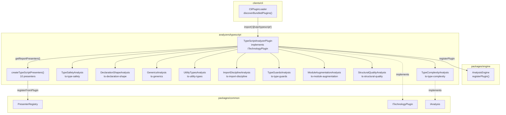
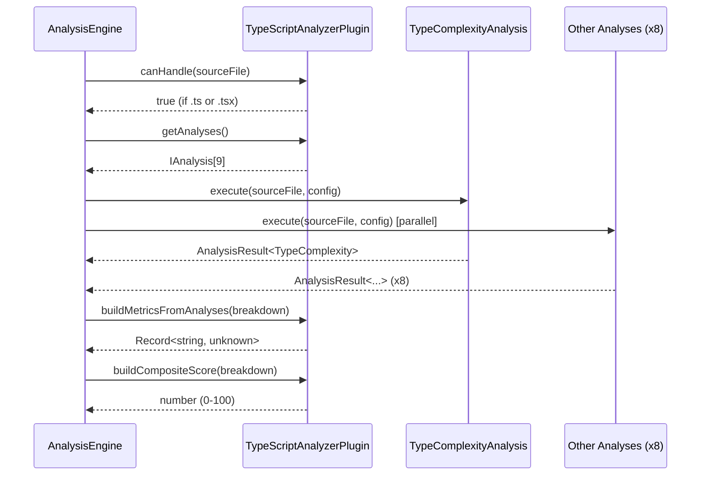

# TypeScript Analyzer Plugin

## Overview

This phase extracts TypeScript type analysis from the React plugin and establishes `@vipr/typescript` as a first-class, standalone analyzer plugin. The new plugin lives at `analyzers/typescript/` and runs on all `.ts` and `.tsx` files, providing type-level quality metrics that are orthogonal to React-specific concerns.

The React plugin currently houses a `TypeAnalyzerAnalysis` (id: `react-type-analyzer`) that runs general TypeScript type complexity analysis. This analysis has no dependency on React — it examines generic depth, conditional types, union sizes, and recursive type structures. Its presence in the React plugin is a categorization error, and it carries a scoring bug where higher raw scores indicate more complexity rather than higher quality. Both issues are resolved in this phase.

The TypeScript plugin registers 9 analyses covering type complexity, type safety, declaration shapes, generics, utility types, import discipline, type guards, module augmentation, and structural code quality. Each produces a 0-100 quality score where higher is better.

### Scope

- New package `@vipr/typescript` at `analyzers/typescript/`
- Handles all `.ts` and `.tsx` files unconditionally (type analysis is not React-specific)
- Does not conflict with the React plugin: the TypeScript plugin measures type-level concerns, the React plugin measures React component concerns
- 1 analysis migrated from `@vipr/react` with a score inversion fix
- 8 new analyses covering type hygiene dimensions not previously captured (9 total)
- Migration removes `react-type-analyzer` from `@vipr/react` entirely

---

## Architecture

### Plugin Structure

```
analyzers/typescript/
  src/
    plugin.ts
    analyses/
      type-complexity-analysis.ts
      type-safety-analysis.ts
      declaration-shape-analysis.ts
      generics-analysis.ts
      utility-types-analysis.ts
      import-discipline-analysis.ts
      type-guards-analysis.ts
      module-augmentation-analysis.ts
      structural-quality-analysis.ts
    types/
      index.ts
    constants/
      weights.ts
      thresholds.ts
    presenters/
      index.ts
      ts-overview-presenter.ts
      ts-type-complexity-presenter.ts
      ts-type-safety-presenter.ts
      ts-declaration-shape-presenter.ts
      ts-generics-presenter.ts
      ts-utility-types-presenter.ts
      ts-import-discipline-presenter.ts
      ts-type-guards-presenter.ts
      ts-module-augmentation-presenter.ts
      ts-structural-quality-presenter.ts
    utils/
      file-type-detector.ts
    index.ts
  package.json
  tsconfig.json
  tsup.config.ts
```

### Component Diagram



### Analysis Execution Flow



### `canHandle` Logic

The TypeScript plugin's `canHandle` method is unconditional for `.ts` and `.tsx` files. It does not yield to or coordinate with the React plugin. Both plugins may analyze the same `.tsx` file simultaneously — the TypeScript plugin measures type-level concerns and the React plugin measures React component concerns. These dimensions are orthogonal.

```typescript
canHandle(sourceFile: SourceFile): boolean {
  const filePath = sourceFile.getFilePath();
  return /\.(ts|tsx)$/.test(filePath);
}
```

| File Extension         | Handled                 | Rationale                                                                                                                                                                                                        |
| ---------------------- | ----------------------- | ---------------------------------------------------------------------------------------------------------------------------------------------------------------------------------------------------------------- |
| `.ts`                  | Yes                     | All TypeScript source files carry type annotations                                                                                                                                                               |
| `.tsx`                 | Yes                     | TSX files carry both type annotations and JSX; type analysis is independent of JSX                                                                                                                               |
| `.js`                  | No                      | No TypeScript type annotations present                                                                                                                                                                           |
| `.jsx`                 | No                      | No TypeScript type annotations present                                                                                                                                                                           |
| `.test.ts`, `.spec.ts` | Yes (reduced penalties) | Test files legitimately use `any`, type assertions, and `@ts-ignore` for mocking/fixtures. Analyses that detect these apply a 0.5x penalty multiplier when the file matches `*.test.ts` or `*.spec.ts` patterns. |
| `.d.ts`                | No                      | Declaration files are excluded because they are typically generated or third-party authored. Analyzing them would produce noise for code the user does not control. May be reconsidered in a future phase.       |

### Package Setup

Follow `analyzers/core/package.json` as the canonical reference.

**`analyzers/typescript/package.json`**

```json
{
  "name": "@vipr/typescript",
  "version": "1.0.0",
  "description": "TypeScript type system analyzer for Vipr",
  "main": "dist/index.js",
  "types": "dist/index.d.ts",
  "exports": {
    ".": {
      "import": "./dist/index.js",
      "require": "./dist/index.cjs",
      "types": "./dist/index.d.ts"
    }
  },
  "scripts": {
    "build": "tsup",
    "typecheck": "tsc --noEmit",
    "test": "vitest run",
    "lint": "eslint src"
  },
  "dependencies": {
    "@vipr/common": "workspace:*",
    "@vipr/engine": "workspace:*",
    "@vipr/logging": "workspace:*",
    "ts-morph": "^24.0.0"
  },
  "devDependencies": {
    "typescript": "^5.7.0",
    "vitest": "^2.0.0",
    "tsup": "^8.0.0"
  }
}
```

### Integration Points

**`clients/cli/src/plugins/loader.ts`** — add the TypeScript analyzer to `discoverBundledPlugins()`:

```typescript
// Import TypeScript analyzer
try {
  const { TypeScriptAnalyzerPlugin } = await import('@vipr/typescript');
  plugins.push(new TypeScriptAnalyzerPlugin());
} catch (error) {
  logger.warn(
    'TypeScript analyzer not available:',
    error instanceof Error ? error.message : String(error)
  );
}
```

Add `typescript` to `pluginPackageMap` in `getLoadedPluginPackages()`:

```typescript
const pluginPackageMap: Record<string, string> = {
  react: '@vipr/react',
  core: '@vipr/core',
  nextjs: '@vipr/nextjs',
  typescript: '@vipr/typescript',
};
```

**Desktop coordinator** — add `@vipr/typescript` alongside the existing react/core/nextjs plugin registrations. Consult the desktop plugin coordinator file for the exact registration pattern (it mirrors the CLI loader pattern using dynamic imports).

---

## The 9 Analyses

### Analysis 1: `ts-type-complexity`

Migrated from `analyzers/react/src/analyses/types-analysis.ts` (`react-type-analyzer`).

| Property           | Value                |
| ------------------ | -------------------- |
| ID                 | `ts-type-complexity` |
| Category           | `technical-debt`     |
| Execution cost     | 3                    |
| Enabled by default | Yes                  |

**What it measures.** Maximum generic nesting depth, count of conditional type branches (including distributive conditionals), maximum union member count, maximum intersection member count, mapped type count (distinguishing simple mapped types from those with key remapping via `as` clauses), recursive type count with estimated recursion depth, template literal type complexity (measured as estimated cartesian product size for unions in template positions), total type parameter count across all declarations, `infer` keyword count, variadic tuple type usage, and indexed access type chain depth.

**Distributive conditional detection.** When a conditional type's checked position contains a naked type parameter (e.g., `T extends U ? X : Y` where `T` is a bare parameter), it distributes over union members. This is tracked separately as `distributiveConditionalCount` because distributive behavior is a frequent source of unexpected results and a distinct complexity axis.

**Score inversion fix.** The existing `react-type-analyzer` computes:

```typescript
// BUG: higher score = more complex, not higher quality
const score =
  genericDepth * 2.0 +
  conditionalBranches * 3.0 +
  unionSize * 0.5 +
  intersectionSize * 0.8 +
  mappedTypeCount * 2.5 +
  recursiveTypes * 5.0 +
  templateLiteralComplexity * 1.5 +
  typeParameterCount * 1.0 +
  inferKeywordCount * 2.0;
```

The system expects quality scores where higher is better. The new analysis inverts this:

```typescript
const rawComplexity =
  genericDepth * TYPE_COMPLEXITY_WEIGHTS.genericDepth +
  conditionalBranches * TYPE_COMPLEXITY_WEIGHTS.conditionalBranches +
  unionSize * TYPE_COMPLEXITY_WEIGHTS.unionSize +
  intersectionSize * TYPE_COMPLEXITY_WEIGHTS.intersectionSize +
  mappedTypeCount * TYPE_COMPLEXITY_WEIGHTS.mappedType +
  recursiveTypes * TYPE_COMPLEXITY_WEIGHTS.recursiveType +
  templateLiteralComplexity * TYPE_COMPLEXITY_WEIGHTS.templateLiteral +
  typeParameterCount * TYPE_COMPLEXITY_WEIGHTS.typeParameter +
  inferKeywordCount * TYPE_COMPLEXITY_WEIGHTS.inferKeyword;

// Normalize against a reference ceiling calibrated so a "typical complex file" scores ~40 quality
// Reference ceiling: 60 raw weighted sum (empirically: 4 generics + 3 conditionals + 2 recursives = ~56)
const normalizedComplexity = Math.min(rawComplexity / TYPE_COMPLEXITY_REFERENCE_CEILING, 1.0);
const score = Math.max(0, Math.round(100 - normalizedComplexity * 100));
```

`TYPE_COMPLEXITY_REFERENCE_CEILING` lives in `analyzers/typescript/src/constants/thresholds.ts` and is set to `60` initially. Adjust after calibrating against real codebases.

**Output type.**

```typescript
// analyzers/typescript/src/types/index.ts

interface ComplexTypeExample {
  type: string;
  complexity: number;
  location: string;
}

interface TypeComplexity {
  /** Quality score 0-100. Higher is better (simpler type system). */
  score: number;
  genericDepth: number;
  conditionalBranches: number;
  distributiveConditionalCount: number;
  unionSize: number;
  intersectionSize: number;
  mappedTypeCount: number;
  mappedTypeWithRemappingCount: number;
  recursiveTypes: number;
  maxRecursionDepth: number;
  templateLiteralComplexity: number;
  typeParameterCount: number;
  inferKeywordCount: number;
  variadicTupleCount: number;
  indexedAccessDepth: number;
  insights: string[];
  examples: ComplexTypeExample[];
}
```

**Insight rules.**

| Condition                          | Severity | Message                                                                                         |
| ---------------------------------- | -------- | ----------------------------------------------------------------------------------------------- |
| `genericDepth > 3`                 | warning  | Deep generic nesting ({n} levels) reduces readability                                           |
| `conditionalBranches > 2`          | warning  | {n} conditional types detected — consider extracting each branch into a named type alias        |
| `distributiveConditionalCount > 0` | info     | {n} distributive conditional types — verify distribution over unions is intentional             |
| `unionSize > 5`                    | info     | Large union type ({n} members) — consider discriminated union                                   |
| `recursiveTypes > 0`               | warning  | Recursive type detected: {name} — verify termination condition                                  |
| `maxRecursionDepth > 5`            | error    | Recursive type depth of {n} approaching compiler limit (50) — add explicit termination          |
| `mappedTypeCount > 5`              | info     | High mapped type count ({n}) — verify each is necessary                                         |
| `mappedTypeWithRemappingCount > 0` | info     | {n} mapped types with key remapping (`as` clauses) — higher complexity than simple mapped types |
| `templateLiteralComplexity > 100`  | warning  | Template literal type has estimated {n} cartesian product members — risk of slow compilation    |
| `indexedAccessDepth > 3`           | info     | Deep indexed access chain ({n} levels) — consider intermediate type aliases                     |

---

### Analysis 2: `ts-type-safety`

| Property           | Value            |
| ------------------ | ---------------- |
| ID                 | `ts-type-safety` |
| Category           | `technical-debt` |
| Execution cost     | 2                |
| Enabled by default | Yes              |

**What it measures.** Unsafe constructs (deductions) and safe constructs (bonuses).

| Metric                     | Direction         | Detection method                                                                                                |
| -------------------------- | ----------------- | --------------------------------------------------------------------------------------------------------------- | ------------------------------------------------ |
| `anyCount`                 | Deduction         | Type annotations matching `any` keyword node                                                                    |
| `typeAssertionCount`       | Deduction         | `AsExpression` nodes (e.g., `x as Foo`)                                                                         |
| `doubleAssertionCount`     | Heavy deduction   | `x as unknown as T` patterns — double assertions bypass type system safety entirely                             |
| `tsIgnoreCount`            | Deduction         | `// @ts-ignore` comment lines                                                                                   |
| `tsExpectErrorCount`       | Neutral/deduction | `// @ts-expect-error` comment lines (penalize lightly — legitimate uses exist)                                  |
| `tsNoCheckCount`           | Heavy deduction   | `// @ts-nocheck` directive — disables all type checking for the entire file                                     |
| `nonNullAssertionCount`    | Deduction         | `NonNullExpression` nodes (`x!`)                                                                                |
| `implicitAnyCatchCount`    | Deduction         | `catch (e)` without type annotation (defaults to `any` without `useUnknownInCatchVariables`)                    |
| `indexSignatureAbuseCount` | Deduction         | `Record<string, any>`, `{ [key: string]: any }`, and other broad index signatures that defeat structural typing |
| `unknownCount`             | Bonus             | Type annotations using `unknown` (proper alternative to `any`)                                                  |
| `narrowingPatternCount`    | Bonus             | Type predicate functions, `typeof` guards, `instanceof` guards                                                  |
| `satisfiesCount`           | Bonus             | `satisfies` operator usage (TS 4.9+) — type validation without widening                                         |
| `readonlyPropertyCount`    | Bonus             | Properties, parameters, or array types marked `readonly`                                                        |
| `brandedTypeCount`         | Bonus             | Branded/nominal type patterns (`string & { __brand: 'UserId' }`) — prevents primitive obsession                 |
| `resultTypeCount`          | Bonus             | Discriminated union result types (`{ ok: true; data: T }                                                        | { ok: false; error: E }`) — typed error handling |

**Positional weighting.** Type safety violations in exported function signatures (return types, parameter types) carry 1.5x the penalty of violations in private/internal positions. A `return x as any` in a public API is more harmful than an `any` cast in a local variable.

**Output type.**

```typescript
interface TypeSafety {
  /** Quality score 0-100. Higher is better (fewer unsafe constructs). */
  score: number;
  anyCount: number;
  typeAssertionCount: number;
  doubleAssertionCount: number;
  tsIgnoreCount: number;
  tsExpectErrorCount: number;
  tsNoCheckCount: number;
  nonNullAssertionCount: number;
  implicitAnyCatchCount: number;
  indexSignatureAbuseCount: number;
  unknownCount: number;
  narrowingPatternCount: number;
  satisfiesCount: number;
  readonlyPropertyCount: number;
  brandedTypeCount: number;
  resultTypeCount: number;
  insights: string[];
}
```

**Scoring logic.** Start at 100. Apply deductions per unsafe construct, add bonuses for safe patterns, clamp to [0, 100].

```typescript
const baseScore = 100;
const deductions =
  anyCount * TYPE_SAFETY_WEIGHTS.any +
  typeAssertionCount * TYPE_SAFETY_WEIGHTS.typeAssertion +
  doubleAssertionCount * TYPE_SAFETY_WEIGHTS.doubleAssertion +
  tsIgnoreCount * TYPE_SAFETY_WEIGHTS.tsIgnore +
  tsExpectErrorCount * TYPE_SAFETY_WEIGHTS.tsExpectError +
  tsNoCheckCount * TYPE_SAFETY_WEIGHTS.tsNoCheck +
  nonNullAssertionCount * TYPE_SAFETY_WEIGHTS.nonNullAssertion +
  implicitAnyCatchCount * TYPE_SAFETY_WEIGHTS.implicitAnyCatch +
  indexSignatureAbuseCount * TYPE_SAFETY_WEIGHTS.indexSignatureAbuse;
const bonuses =
  unknownCount * TYPE_SAFETY_WEIGHTS.unknownBonus +
  narrowingPatternCount * TYPE_SAFETY_WEIGHTS.narrowingBonus +
  satisfiesCount * TYPE_SAFETY_WEIGHTS.satisfiesBonus +
  Math.min(
    readonlyPropertyCount * TYPE_SAFETY_WEIGHTS.readonlyBonus,
    TYPE_SAFETY_WEIGHTS.maxReadonlyBonus
  ) +
  brandedTypeCount * TYPE_SAFETY_WEIGHTS.brandedTypeBonus +
  resultTypeCount * TYPE_SAFETY_WEIGHTS.resultTypeBonus;
const score = Math.max(0, Math.min(100, Math.round(baseScore - deductions + bonuses)));
```

Initial weight values in `analyzers/typescript/src/constants/weights.ts`:

```typescript
export const TYPE_SAFETY_WEIGHTS = {
  any: 8,
  typeAssertion: 3,
  doubleAssertion: 12,
  tsIgnore: 15,
  tsExpectError: 5,
  tsNoCheck: 50,
  nonNullAssertion: 4,
  implicitAnyCatch: 3,
  indexSignatureAbuse: 5,
  unknownBonus: 2,
  narrowingBonus: 1,
  satisfiesBonus: 2,
  readonlyBonus: 1,
  maxReadonlyBonus: 10,
  brandedTypeBonus: 3,
  resultTypeBonus: 3,
} as const;
```

**Insight rules.**

| Condition                      | Severity | Message                                                                                               |
| ------------------------------ | -------- | ----------------------------------------------------------------------------------------------------- |
| `anyCount > 0`                 | warning  | {n} explicit `any` annotations found — use `unknown` and narrow                                       |
| `tsNoCheckCount > 0`           | error    | `@ts-nocheck` disables all type checking for this file — remove and fix underlying errors             |
| `tsIgnoreCount > 0`            | error    | {n} `@ts-ignore` directives suppress type errors — fix the underlying issue                           |
| `doubleAssertionCount > 0`     | error    | {n} double assertions (`as unknown as T`) bypass type safety entirely — investigate the type mismatch |
| `nonNullAssertionCount > 3`    | warning  | {n} non-null assertions (`!`) — add null checks or restructure types                                  |
| `typeAssertionCount > 5`       | info     | High type assertion count ({n}) — verify assertions are correct                                       |
| `implicitAnyCatchCount > 0`    | info     | {n} catch clauses without type annotation — annotate with `unknown`                                   |
| `indexSignatureAbuseCount > 0` | warning  | {n} broad index signatures (`Record<string, any>`) — use specific types                               |
| `satisfiesCount > 0`           | info     | {n} `satisfies` usages detected — good practice for type validation without widening                  |
| `brandedTypeCount > 0`         | info     | {n} branded types detected — good practice for preventing primitive obsession                         |

---

### Analysis 3: `ts-declaration-shape`

| Property           | Value                  |
| ------------------ | ---------------------- |
| ID                 | `ts-declaration-shape` |
| Category           | `patterns`             |
| Execution cost     | 2                      |
| Enabled by default | Yes                    |

**What it measures.** The structural shape of type declarations in a file.

| Metric                                    | Description                                                                              |
| ----------------------------------------- | ---------------------------------------------------------------------------------------- |
| `interfaceCount`                          | Count of `interface` declarations                                                        |
| `typeAliasCount`                          | Count of `type` alias declarations                                                       |
| `enumCount`                               | Count of `enum` declarations (regular enums)                                             |
| `constEnumCount`                          | Count of `const enum` declarations (inlined at compile time, different module interop)   |
| `namespaceCount`                          | Count of `namespace` declarations (legacy pattern, conflicts with ES modules)            |
| `classCount`                              | Count of `class` declarations                                                            |
| `abstractClassCount`                      | Count of `abstract class` declarations                                                   |
| `emptyInterfaceCount`                     | Count of `interface Foo {}` declarations (almost always a mistake or placeholder)        |
| `maxInterfacePropertyCount`               | Highest member count on a single interface (ISP indicator)                               |
| `avgInterfaceMemberCount`                 | Average member count across interfaces                                                   |
| `functionOverloadCount`                   | Count of function overload signatures                                                    |
| `declarationMergingCount`                 | Count of interfaces declared with the same name (merging)                                |
| `maxInheritanceDepth`                     | Deepest `extends` chain among all interfaces                                             |
| `avgTypeAliasComplexity`                  | Average node count across all type alias bodies                                          |
| `exportedFunctionCount`                   | Count of exported functions                                                              |
| `exportedFunctionWithExplicitReturnCount` | Exported functions with explicit return type annotations (best practice for public APIs) |
| `readonlyPropertyRatio`                   | Proportion of interface/type properties marked `readonly`                                |
| `valueParameterCount`                     | Max function parameter count (for detecting long parameter lists)                        |

**Output type.**

```typescript
interface DeclarationShape {
  /** Quality score 0-100. Higher is better. */
  score: number;
  interfaceCount: number;
  typeAliasCount: number;
  enumCount: number;
  constEnumCount: number;
  namespaceCount: number;
  classCount: number;
  abstractClassCount: number;
  emptyInterfaceCount: number;
  maxInterfacePropertyCount: number;
  avgInterfaceMemberCount: number;
  functionOverloadCount: number;
  declarationMergingCount: number;
  maxInheritanceDepth: number;
  avgTypeAliasComplexity: number;
  exportedFunctionCount: number;
  exportedFunctionWithExplicitReturnCount: number;
  readonlyPropertyRatio: number;
  maxValueParameterCount: number;
  insights: string[];
}
```

**Scoring logic.** Start at 100. Deductions for anti-patterns, no bonuses.

```typescript
const deductions =
  Math.max(0, maxInheritanceDepth - DECLARATION_THRESHOLDS.inheritanceDepthOk) *
    DECLARATION_SHAPE_WEIGHTS.excessiveInheritanceDepth +
  Math.max(0, functionOverloadCount - DECLARATION_THRESHOLDS.overloadCountOk) *
    DECLARATION_SHAPE_WEIGHTS.excessiveOverloads +
  declarationMergingCount * DECLARATION_SHAPE_WEIGHTS.declarationMerging +
  namespaceCount * DECLARATION_SHAPE_WEIGHTS.namespace +
  emptyInterfaceCount * DECLARATION_SHAPE_WEIGHTS.emptyInterface +
  Math.max(0, maxInterfacePropertyCount - DECLARATION_THRESHOLDS.interfacePropertyCountOk) *
    DECLARATION_SHAPE_WEIGHTS.excessiveInterfaceProperties +
  Math.max(0, maxValueParameterCount - DECLARATION_THRESHOLDS.parameterCountOk) *
    DECLARATION_SHAPE_WEIGHTS.longParameterList;

// Bonus for explicit return types on exported functions
const explicitReturnRatio =
  exportedFunctionCount > 0 ? exportedFunctionWithExplicitReturnCount / exportedFunctionCount : 1;
const explicitReturnBonus = Math.round(
  explicitReturnRatio * DECLARATION_SHAPE_WEIGHTS.maxExplicitReturnBonus
);

const score = Math.max(0, Math.min(100, Math.round(100 - deductions + explicitReturnBonus)));
```

**Insight rules.**

| Condition                                                   | Severity | Message                                                                                          |
| ----------------------------------------------------------- | -------- | ------------------------------------------------------------------------------------------------ |
| `maxInheritanceDepth > 3`                                   | warning  | Interface inheritance depth of {n} — prefer composition over deep inheritance                    |
| `functionOverloadCount > 5`                                 | info     | {n} function overloads — consider union parameter types                                          |
| `declarationMergingCount > 2`                               | info     | {n} declaration merge sites — ensure intentional and documented                                  |
| `enumCount > 0`                                             | info     | {n} enums found — consider `as const` object or string union for tree-shaking and type safety    |
| `namespaceCount > 0`                                        | warning  | {n} `namespace` declarations — namespaces conflict with ES modules; prefer module-scoped exports |
| `emptyInterfaceCount > 0`                                   | warning  | {n} empty interfaces (`interface Foo {}`) — likely a placeholder or mistake                      |
| `maxInterfacePropertyCount > 10`                            | warning  | Interface with {n} properties — consider splitting (Interface Segregation Principle)             |
| `exportedFunctionCount > 0` and `explicitReturnRatio < 0.5` | info     | {pct}% of exported functions lack explicit return types — add for API stability                  |
| `maxValueParameterCount > 4`                                | warning  | Function with {n} parameters — consider a parameter object                                       |
| `avgTypeAliasComplexity > 20`                               | info     | High average type alias complexity ({n} AST nodes) — consider simplifying                        |

---

### Analysis 4: `ts-generics`

| Property           | Value            |
| ------------------ | ---------------- |
| ID                 | `ts-generics`    |
| Category           | `technical-debt` |
| Execution cost     | 2                |
| Enabled by default | Yes              |

**What it measures.** Quality of generic type parameter usage across all declarations.

| Metric                      | Description                                                                                           |
| --------------------------- | ----------------------------------------------------------------------------------------------------- |
| `unconstrainedParamCount`   | Type parameters without an `extends` clause (bare `<T>`)                                              |
| `broadConstraintCount`      | Parameters with weak constraints (`extends object`, `extends {}`, `extends any`)                      |
| `unusedTypeParamCount`      | Generic parameters declared but never referenced in the body (dead type-level code)                   |
| `singleUseTypeParamCount`   | Parameters used exactly once in the signature, adding no constraint value (e.g., `<T>(x: T) => void`) |
| `varianceAnnotationCount`   | Parameters annotated with `in`, `out`, or `in out`                                                    |
| `constTypeParamCount`       | Parameters with `const` modifier (`<const T>`, TS 5.0) for improved inference                         |
| `maxArity`                  | Highest number of type parameters on a single declaration                                             |
| `defaultTypeParamCount`     | Parameters with default types (`T = string`)                                                          |
| `constraintComplexityScore` | Sum of node counts within all constraint expressions                                                  |

**Output type.**

```typescript
interface GenericsMetrics {
  /** Quality score 0-100. Higher is better. */
  score: number;
  unconstrainedParamCount: number;
  broadConstraintCount: number;
  unusedTypeParamCount: number;
  singleUseTypeParamCount: number;
  varianceAnnotationCount: number;
  constTypeParamCount: number;
  maxArity: number;
  defaultTypeParamCount: number;
  constraintComplexityScore: number;
  insights: string[];
}
```

**Scoring logic.** Start at 100. Deductions for unconstrained or overly broad params and high arity. Bonuses for variance annotations and default parameters (which reduce call-site burden).

```typescript
const deductions =
  unconstrainedParamCount * GENERICS_WEIGHTS.unconstrainedParam +
  broadConstraintCount * GENERICS_WEIGHTS.broadConstraint +
  unusedTypeParamCount * GENERICS_WEIGHTS.unusedTypeParam +
  singleUseTypeParamCount * GENERICS_WEIGHTS.singleUseTypeParam +
  Math.max(0, maxArity - GENERICS_THRESHOLDS.arityOk) * GENERICS_WEIGHTS.excessiveArity;
const bonuses =
  Math.min(
    varianceAnnotationCount * GENERICS_WEIGHTS.varianceBonus,
    GENERICS_WEIGHTS.maxVarianceBonus
  ) +
  Math.min(
    defaultTypeParamCount * GENERICS_WEIGHTS.defaultParamBonus,
    GENERICS_WEIGHTS.maxDefaultBonus
  ) +
  Math.min(
    constTypeParamCount * GENERICS_WEIGHTS.constTypeParamBonus,
    GENERICS_WEIGHTS.maxConstBonus
  );
const score = Math.max(0, Math.min(100, Math.round(100 - deductions + bonuses)));
```

**Insight rules.**

| Condition                     | Severity | Message                                                                         |
| ----------------------------- | -------- | ------------------------------------------------------------------------------- |
| `unconstrainedParamCount > 2` | warning  | {n} unconstrained type parameters — add `extends` constraints to improve safety |
| `maxArity > 4`                | warning  | Generic with {n} type parameters — consider decomposing the type                |
| `broadConstraintCount > 0`    | info     | {n} broad constraints (`extends object`) — narrow to a more specific shape      |
| `unusedTypeParamCount > 0`    | warning  | {n} unused type parameters — remove dead generic parameters                     |
| `singleUseTypeParamCount > 0` | info     | {n} single-use type parameters — verify generic abstraction is necessary        |

---

### Analysis 5: `ts-utility-types`

| Property           | Value              |
| ------------------ | ------------------ |
| ID                 | `ts-utility-types` |
| Category           | `patterns`         |
| Execution cost     | 1                  |
| Enabled by default | Yes                |

**What it measures.** Usage of TypeScript's built-in utility types and detection of redundant custom reimplementations.

Built-in utilities tracked: `Partial`, `Required`, `Readonly`, `Record`, `Pick`, `Omit`, `Exclude`, `Extract`, `NonNullable`, `ReturnType`, `Parameters`, `ConstructorParameters`, `InstanceType`, `Awaited`, `NoInfer`, `ThisType`, `ThisParameterType`, `OmitThisParameter`, `Uppercase`, `Lowercase`, `Capitalize`, `Uncapitalize`, `ReadonlyArray`.

**Redundant custom type detection heuristic.** To detect custom types that replicate a built-in utility, pattern-match the AST structure of mapped type bodies against known utility type shapes:

| Pattern                                                | Matches        |
| ------------------------------------------------------ | -------------- |
| `{ [K in keyof T]?: T[K] }`                            | `Partial<T>`   |
| `{ [K in keyof T]-?: T[K] }`                           | `Required<T>`  |
| `{ readonly [K in keyof T]: T[K] }`                    | `Readonly<T>`  |
| `{ [K in T]: V }` where T extends string/number/symbol | `Record<T, V>` |
| `{ [K in Extract<keyof T, U>]: T[K] }`                 | `Pick<T, U>`   |
| `{ [K in Exclude<keyof T, U>]: T[K] }`                 | `Omit<T, U>`   |

The detection is intentionally conservative — only flag exact structural matches to avoid false positives.

| Metric                     | Description                                                                    |
| -------------------------- | ------------------------------------------------------------------------------ |
| `builtinUtilityCount`      | Total usage count of recognized built-in utility types                         |
| `uniqueUtilitiesUsed`      | Count of distinct utility types in use                                         |
| `customMappedTypeCount`    | Count of custom mapped types (user-defined `{ [K in ...]: ... }`)              |
| `redundantCustomTypeCount` | Custom types that replicate a built-in utility (e.g., a manual `MyPartial<T>`) |

**Output type.**

```typescript
interface UtilityTypeAnalysis {
  /** Quality score 0-100. Higher is better. */
  score: number;
  builtinUtilityCount: number;
  uniqueUtilitiesUsed: number;
  customMappedTypeCount: number;
  redundantCustomTypeCount: number;
  utilityUsageBreakdown: Record<string, number>;
  insights: string[];
}
```

**Scoring logic.** Start at 80 (neutral baseline — not every file needs utility types). Bonuses for breadth of built-in utility usage. Deductions for redundant custom implementations.

```typescript
const diversityBonus = Math.min(uniqueUtilitiesUsed * UTILITY_WEIGHTS.diversityBonus, 20);
const redundancyDeduction = redundantCustomTypeCount * UTILITY_WEIGHTS.redundantCustomPenalty;
const score = Math.max(0, Math.min(100, Math.round(80 + diversityBonus - redundancyDeduction)));
```

**Insight rules.**

| Condition                      | Severity | Message                                                                              |
| ------------------------------ | -------- | ------------------------------------------------------------------------------------ |
| `redundantCustomTypeCount > 0` | warning  | {n} custom types duplicate a built-in utility — replace with `Partial`, `Pick`, etc. |
| `customMappedTypeCount > 3`    | info     | {n} custom mapped types — verify none replicate existing utility types               |

---

### Analysis 6: `ts-import-discipline`

| Property           | Value                  |
| ------------------ | ---------------------- |
| ID                 | `ts-import-discipline` |
| Category           | `patterns`             |
| Execution cost     | 1                      |
| Enabled by default | Yes                    |

**What it measures.** Whether type-only imports use the `import type` syntax, reducing runtime overhead and improving bundle clarity.

| Metric                      | Description                                                                          |
| --------------------------- | ------------------------------------------------------------------------------------ |
| `totalImports`              | Total import statement count                                                         |
| `typeOnlyImportCount`       | Count of `import type { ... }` statements                                            |
| `typeOnlyExportCount`       | Count of `export type { ... }` statements                                            |
| `namespaceImportCount`      | Count of `import * as Foo` statements                                                |
| `importTypeRatio`           | `typeOnlyImportCount / totalImports` (if totalImports > 0)                           |
| `valueImportsCarryingTypes` | Estimated count of regular imports used solely to import types                       |
| `reExportCount`             | Count of `export { ... } from '...'` and `export * from '...'` re-export statements  |
| `reExportRatio`             | `reExportCount / totalExports` — identifies barrel files (ratio > 0.9 = barrel file) |

**Output type.**

```typescript
interface ImportDiscipline {
  /** Quality score 0-100. Higher is better. */
  score: number;
  totalImports: number;
  typeOnlyImportCount: number;
  typeOnlyExportCount: number;
  namespaceImportCount: number;
  importTypeRatio: number;
  valueImportsCarryingTypes: number;
  reExportCount: number;
  reExportRatio: number;
  insights: string[];
}
```

**Scoring logic.** Files with no imports score 100. Files where all type imports use `import type` score 100. Deductions for value imports that carry type-only symbols.

```typescript
if (totalImports === 0) return 100;

// Score starts at 100. Deductions only for concrete problems.
// The importTypeRatio is an informational metric, NOT the score basis — a file with
// mostly value imports is not inherently bad if none of those values are type-only.
const valueCarryingDeduction = valueImportsCarryingTypes * IMPORT_WEIGHTS.valueCarryingTypes;
const namespaceDeduction =
  Math.max(0, namespaceImportCount - 1) * IMPORT_WEIGHTS.excessiveNamespace;
const barrelDeduction = reExportRatio > 0.9 ? IMPORT_WEIGHTS.barrelFile : 0;
const score = Math.max(
  0,
  Math.min(100, 100 - valueCarryingDeduction - namespaceDeduction - barrelDeduction)
);
```

**Detection of `valueImportsCarryingTypes`.** When a symbol imported via a regular `import` statement (not `import type`) is used exclusively in type positions (type annotations, interface extends, type alias bodies), it is counted. This requires checking symbol usage sites against the set of type-only positions. Use `ts-morph`'s `getReferencingNodes()` on each import specifier and verify all references are in type positions via `Node.isTypeNode()` or `SyntaxKind` inspection.

**Performance note.** The `getReferencingNodes()` call triggers the TypeScript language service per symbol and can be slow on large files with many imports. For files with >50 import specifiers, consider a heuristic fallback: check whether the symbol appears only in type annotation positions via a single AST pass rather than per-symbol reference resolution. The listed execution cost of 1 may need adjustment to 2 for large files.

**Insight rules.**

| Condition                                    | Severity | Message                                                                                               |
| -------------------------------------------- | -------- | ----------------------------------------------------------------------------------------------------- |
| `valueImportsCarryingTypes > 0`              | warning  | {n} type-only symbols imported without `import type` — add the `type` keyword                         |
| `importTypeRatio < 0.5` (and file has types) | info     | Less than 50% of imports use `import type`                                                            |
| `namespaceImportCount > 1`                   | info     | Multiple namespace imports (`import *`) — consider named imports for tree-shaking                     |
| `reExportRatio > 0.9`                        | warning  | Barrel file detected (90%+ re-exports) — barrel exports increase bundle size and slow IDE performance |

---

### Analysis 7: `ts-type-guards`

| Property           | Value            |
| ------------------ | ---------------- |
| ID                 | `ts-type-guards` |
| Category           | `patterns`       |
| Execution cost     | 2                |
| Enabled by default | Yes              |

**What it measures.** The presence and quality of runtime type narrowing patterns.

| Metric                     | Description                                                                                                 |
| -------------------------- | ----------------------------------------------------------------------------------------------------------- |
| `typePredicateCount`       | Functions with `x is Type` return type annotations                                                          |
| `assertionFunctionCount`   | Functions with `asserts x is Type` or `asserts x` (distinguish both forms in insights)                      |
| `discriminatedUnionCount`  | Switch or if-else chains that narrow a discriminant property                                                |
| `exhaustivenessCheckCount` | Switch default branches assigning to or passing `never`, plus if-else chains ending with `never` assignment |
| `typeofGuardCount`         | `typeof x === '...'` narrowing patterns                                                                     |
| `instanceofGuardCount`     | `x instanceof Foo` narrowing patterns                                                                       |
| `inOperatorGuardCount`     | `'key' in obj` narrowing patterns (common for discriminated unions)                                         |
| `nullishCheckCount`        | `x != null`, `x !== undefined`, `x !== null` narrowing patterns                                             |
| `userDefinedGuardCount`    | Calls to user-defined type predicate functions                                                              |

**Output type.**

```typescript
interface TypeGuardAnalysis {
  /** Quality score 0-100. Higher is better. */
  score: number;
  typePredicateCount: number;
  assertionFunctionCount: number;
  discriminatedUnionCount: number;
  exhaustivenessCheckCount: number;
  typeofGuardCount: number;
  instanceofGuardCount: number;
  inOperatorGuardCount: number;
  nullishCheckCount: number;
  userDefinedGuardCount: number;
  insights: string[];
}
```

**Scoring logic.** Files with no union types or discriminated unions have no basis for type guards and score neutral (75). Files with complex union types that lack narrowing patterns are penalized. Files that demonstrate narrowing score higher.

```typescript
const totalNarrowing =
  typePredicateCount +
  exhaustivenessCheckCount +
  discriminatedUnionCount +
  typeofGuardCount +
  instanceofGuardCount +
  inOperatorGuardCount +
  nullishCheckCount;

// If there are no complex types requiring narrowing, default to neutral
if (conditionalBranches === 0 && unionSize <= 2) return 75;

const expectedNarrowing = Math.max(1, Math.ceil(unionSize / 3));
const ratio = Math.min(totalNarrowing / expectedNarrowing, 1.0);
const exhaustivenessBonus = exhaustivenessCheckCount * TYPE_GUARD_WEIGHTS.exhaustivenessBonus;
const score = Math.max(0, Math.min(100, Math.round(ratio * 85 + exhaustivenessBonus)));
```

Note: `conditionalBranches` and `unionSize` come from the `ts-type-complexity` analysis result. The engine passes the full `analysisBreakdown` to `buildCompositeScore` but individual analyses run independently. For this scoring cross-reference, `ts-type-guards` reads the source file's union type count directly rather than depending on another analysis result.

**Insight rules.**

| Condition                                                          | Severity | Message                                                                                  |
| ------------------------------------------------------------------ | -------- | ---------------------------------------------------------------------------------------- |
| `exhaustivenessCheckCount === 0` and `discriminatedUnionCount > 0` | warning  | Discriminated unions present but no exhaustiveness checks — add `never` default branches |
| `typePredicateCount > 0`                                           | info     | {n} type predicate functions detected — verify they are accurate                         |
| `assertionFunctionCount > 0`                                       | warning  | {n} assertion functions — ensure they `throw` on failure                                 |

---

### Analysis 8: `ts-module-augmentation`

| Property           | Value                    |
| ------------------ | ------------------------ |
| ID                 | `ts-module-augmentation` |
| Category           | `patterns`               |
| Execution cost     | 1                        |
| Enabled by default | Yes                      |

**What it measures.** Global scope pollution and module declaration augmentation.

| Metric                 | Description                                                                            |
| ---------------------- | -------------------------------------------------------------------------------------- |
| `declareModuleCount`   | Count of `declare module '...'` blocks                                                 |
| `declareGlobalCount`   | Count of `declare global { ... }` blocks                                               |
| `ambientModuleCount`   | Ambient module declarations (no module specifier path, e.g., `declare module '*.svg'`) |
| `augmentationTargets`  | Array of module specifiers being augmented                                             |
| `globalPollutionScore` | Weighted sum of global additions (`var`, `interface`, `function` in `declare global`)  |

**Output type.**

```typescript
interface ModuleAugmentation {
  /** Quality score 0-100. Higher is better. */
  score: number;
  declareModuleCount: number;
  declareGlobalCount: number;
  ambientModuleCount: number;
  augmentationTargets: string[];
  globalPollutionScore: number;
  insights: string[];
}
```

**Scoring logic.** Ambient module declarations for assets (`.svg`, `.png`, `.css`) are neutral and expected. `declare module` for third-party augmentation is slightly penalized (often a necessary workaround, but increases maintenance surface). `declare global` is penalized more heavily as it pollutes the global type scope.

```typescript
// Exclude asset module declarations from penalty
const augmentationPenalty =
  Math.max(0, declareModuleCount - ambientModuleCount) * MODULE_AUG_WEIGHTS.moduleAugmentation;
const globalPenalty = declareGlobalCount * MODULE_AUG_WEIGHTS.globalDeclaration;
const pollutionPenalty = globalPollutionScore * MODULE_AUG_WEIGHTS.globalPollution;
const score = Math.max(0, Math.round(100 - augmentationPenalty - globalPenalty - pollutionPenalty));
```

**Insight rules.**

| Condition                  | Severity | Message                                                               |
| -------------------------- | -------- | --------------------------------------------------------------------- |
| `declareGlobalCount > 0`   | warning  | {n} `declare global` blocks — global type additions increase coupling |
| `globalPollutionScore > 5` | error    | High global scope pollution score — review global type declarations   |
| `declareModuleCount > 3`   | info     | {n} module augmentations — verify all are intentional and documented  |

---

### Analysis 9: `ts-structural-quality`

| Property           | Value                   |
| ------------------ | ----------------------- |
| ID                 | `ts-structural-quality` |
| Category           | `patterns`              |
| Execution cost     | 2                       |
| Enabled by default | Yes                     |

**What it measures.** Structural code quality patterns and anti-patterns that affect maintainability, testability, and adherence to design principles. This analysis bridges the gap between type-level metrics and code-level quality.

| Metric                      | Description                                                                                                |
| --------------------------- | ---------------------------------------------------------------------------------------------------------- |
| `singletonPatternCount`     | Classes with `private constructor` + static `getInstance()` — anti-pattern for testability                 |
| `factoryFunctionCount`      | Functions named `create*` or `make*` that return interface types — positive DI signal                      |
| `constructorInjectionCount` | Class constructors that accept interface-typed parameters — positive testability signal                    |
| `concreteClassImportCount`  | Value imports of concrete classes (vs interface/type imports) — coupling indicator                         |
| `throwStatementCount`       | `throw` statements in the file — compare against `resultTypeCount` from `ts-type-safety`                   |
| `untypedThrowCount`         | `throw new Error(string)` vs throwing typed error subclasses                                               |
| `emptyCatchCount`           | `catch (e) {}` or `catch {}` patterns — swallowed errors                                                   |
| `switchCaseCount`           | Max cases in a single switch statement — high counts suggest missing polymorphism                          |
| `decoratorCount`            | Stage 3 decorator usage (`@decorator`, TS 5.0+)                                                            |
| `legacyDecoratorCount`      | Experimental decorator usage (`experimentalDecorators` flag)                                               |
| `usingDeclarationCount`     | `using` and `await using` declarations (TS 5.2, explicit resource management)                              |
| `typeToRuntimeRatio`        | Ratio of type declarations to runtime code — extremely high ratios suggest over-engineered type gymnastics |
| `globalStateAccessCount`    | Direct access to `globalThis`, `window`, `process.env` in non-entry-point files                            |

**Output type.**

```typescript
interface StructuralQuality {
  /** Quality score 0-100. Higher is better. */
  score: number;
  singletonPatternCount: number;
  factoryFunctionCount: number;
  constructorInjectionCount: number;
  concreteClassImportCount: number;
  throwStatementCount: number;
  untypedThrowCount: number;
  emptyCatchCount: number;
  switchCaseCount: number;
  decoratorCount: number;
  legacyDecoratorCount: number;
  usingDeclarationCount: number;
  typeToRuntimeRatio: number;
  globalStateAccessCount: number;
  insights: string[];
}
```

**Scoring logic.** Start at 100. Deductions for anti-patterns, bonuses for positive patterns.

```typescript
const deductions =
  singletonPatternCount * STRUCTURAL_WEIGHTS.singleton +
  emptyCatchCount * STRUCTURAL_WEIGHTS.emptyCatch +
  untypedThrowCount * STRUCTURAL_WEIGHTS.untypedThrow +
  Math.max(0, switchCaseCount - STRUCTURAL_THRESHOLDS.switchCaseOk) *
    STRUCTURAL_WEIGHTS.excessiveSwitchCases +
  globalStateAccessCount * STRUCTURAL_WEIGHTS.globalStateAccess;
const bonuses =
  Math.min(
    factoryFunctionCount * STRUCTURAL_WEIGHTS.factoryBonus,
    STRUCTURAL_WEIGHTS.maxFactoryBonus
  ) +
  Math.min(
    constructorInjectionCount * STRUCTURAL_WEIGHTS.injectionBonus,
    STRUCTURAL_WEIGHTS.maxInjectionBonus
  ) +
  Math.min(usingDeclarationCount * STRUCTURAL_WEIGHTS.usingBonus, STRUCTURAL_WEIGHTS.maxUsingBonus);
const score = Math.max(0, Math.min(100, Math.round(100 - deductions + bonuses)));
```

**Insight rules.**

| Condition                       | Severity | Message                                                                                   |
| ------------------------------- | -------- | ----------------------------------------------------------------------------------------- |
| `singletonPatternCount > 0`     | warning  | {n} singleton patterns detected — singletons make testing harder via hidden global state  |
| `emptyCatchCount > 0`           | warning  | {n} empty catch blocks — handle or rethrow errors explicitly                              |
| `switchCaseCount > 5`           | info     | Switch with {n} cases — consider polymorphic dispatch or strategy pattern                 |
| `untypedThrowCount > 0`         | info     | {n} untyped throws (`throw new Error(string)`) — consider typed error classes             |
| `globalStateAccessCount > 0`    | info     | {n} direct global state accesses — consider dependency injection for testability          |
| `legacyDecoratorCount > 0`      | info     | {n} legacy (experimental) decorators — consider migrating to stage 3 decorators (TS 5.0+) |
| `usingDeclarationCount > 0`     | info     | {n} `using` declarations detected — good practice for explicit resource management        |
| `constructorInjectionCount > 0` | info     | {n} classes use constructor injection — good pattern for testability                      |
| `typeToRuntimeRatio > 10`       | info     | High type-to-runtime ratio ({n}:1) — verify type abstractions earn their complexity       |

---

## Score Architecture

### Analysis Weights

| Analysis            | ID                       | Weight | Rationale                                                                                              |
| ------------------- | ------------------------ | ------ | ------------------------------------------------------------------------------------------------------ |
| Type Complexity     | `ts-type-complexity`     | 0.22   | Core metric. Type system complexity is the primary driver of TypeScript maintainability burden.        |
| Type Safety         | `ts-type-safety`         | 0.20   | Direct code quality indicator. `any` and `@ts-ignore` undermine the value of the type system entirely. |
| Generics Quality    | `ts-generics`            | 0.13   | Unconstrained generics are a common source of unsound type inference and hard-to-debug errors.         |
| Structural Quality  | `ts-structural-quality`  | 0.10   | Code-level quality patterns affecting testability, error handling, and design principle adherence.     |
| Declaration Shape   | `ts-declaration-shape`   | 0.10   | Structural health of the type layer. Deep inheritance hierarchies compound maintenance costs.          |
| Type Guards         | `ts-type-guards`         | 0.08   | Runtime safety. Exhaustiveness and narrowing patterns prevent unhandled cases at runtime.              |
| Utility Types       | `ts-utility-types`       | 0.07   | Best practice adherence. Built-in utilities are vetted, composable, and semantically clear.            |
| Import Discipline   | `ts-import-discipline`   | 0.06   | Module hygiene. Correct `import type` usage reduces runtime coupling and aids bundlers.                |
| Module Augmentation | `ts-module-augmentation` | 0.04   | Scope hygiene. Global type pollution propagates across the entire program.                             |

Weights sum to 1.00.

### Composite Score Formula

```
compositeScore = sum(analysisScore_i * weight_i) for i in [1..9]
```

All analysis scores are 0-100 quality scores (higher is better). The composite score is also 0-100.

### Quality Level Thresholds

| Range  | Level     | Description                                             |
| ------ | --------- | ------------------------------------------------------- |
| 80-100 | Excellent | Type system is well-structured, safe, and idiomatic     |
| 60-79  | Good      | Solid type usage with minor improvements possible       |
| 40-59  | Fair      | Moderate type hygiene concerns that should be addressed |
| 0-39   | Poor      | Significant type system issues requiring attention      |

These thresholds follow the same semantics used by `CoreAnalyzerPlugin` and `ReactAnalyzerPlugin`.

---

## Plugin Implementation

### `plugin.ts` Skeleton

```typescript
// analyzers/typescript/src/plugin.ts

import { SourceFile } from 'ts-morph';
import type {
  ITechnologyPlugin,
  PluginResult,
  AnalyzerConfig,
  Rule,
  IAnalysis,
  AnalysisResult,
  AnalysisId,
  ComplexityInsight,
  IReportPresenter,
} from '@vipr/common';
import { createAnalysisId, roundScore } from '@vipr/common';
import { TypeComplexityAnalysis } from './analyses/type-complexity-analysis';
import { TypeSafetyAnalysis } from './analyses/type-safety-analysis';
import { DeclarationShapeAnalysis } from './analyses/declaration-shape-analysis';
import { GenericsAnalysis } from './analyses/generics-analysis';
import { UtilityTypesAnalysis } from './analyses/utility-types-analysis';
import { ImportDisciplineAnalysis } from './analyses/import-discipline-analysis';
import { TypeGuardsAnalysis } from './analyses/type-guards-analysis';
import { ModuleAugmentationAnalysis } from './analyses/module-augmentation-analysis';
import { StructuralQualityAnalysis } from './analyses/structural-quality-analysis';
import { createTypeScriptPresenters } from './presenters';
import { detectTypeScriptFileType } from './utils/file-type-detector';
import { TYPESCRIPT_ANALYSIS_WEIGHTS } from './constants/weights';

export class TypeScriptAnalyzerPlugin implements ITechnologyPlugin {
  readonly id = 'typescript';
  readonly name = 'TypeScript Analyzer';
  readonly version = '1.0.0';
  readonly filePatterns = ['**/*.ts', '**/*.tsx'];

  private rules: Rule[] = [];
  private analyses: Map<string, IAnalysis> = new Map();
  private presenters: IReportPresenter[];

  constructor() {
    this.registerAnalyses();
    this.presenters = createTypeScriptPresenters();
  }

  private registerAnalyses(): void {
    this.registerAnalysis(new TypeComplexityAnalysis());
    this.registerAnalysis(new TypeSafetyAnalysis());
    this.registerAnalysis(new DeclarationShapeAnalysis());
    this.registerAnalysis(new GenericsAnalysis());
    this.registerAnalysis(new UtilityTypesAnalysis());
    this.registerAnalysis(new ImportDisciplineAnalysis());
    this.registerAnalysis(new TypeGuardsAnalysis());
    this.registerAnalysis(new ModuleAugmentationAnalysis());
    this.registerAnalysis(new StructuralQualityAnalysis());
  }

  private registerAnalysis(analysis: IAnalysis): void {
    this.analyses.set(analysis.id, analysis);
  }

  getAnalyses(): IAnalysis[] {
    return Array.from(this.analyses.values());
  }

  getReportPresenters(): IReportPresenter[] {
    return this.presenters;
  }

  canHandle(sourceFile: SourceFile): boolean {
    return /\.(ts|tsx)$/.test(sourceFile.getFilePath());
  }

  buildMetricsFromAnalyses(
    analysisBreakdown: Map<AnalysisId, AnalysisResult>
  ): Record<string, unknown> {
    const metrics: Record<string, unknown> = {};
    for (const [analysisId, result] of analysisBreakdown.entries()) {
      metrics[String(analysisId)] = result.data;
    }
    return metrics;
  }

  buildCompositeScore(analysisBreakdown: Map<AnalysisId, AnalysisResult>): number {
    let totalScore = 0;
    let totalWeight = 0;

    for (const [analysisId, result] of analysisBreakdown.entries()) {
      const id = String(analysisId);
      const weight = TYPESCRIPT_ANALYSIS_WEIGHTS[id as keyof typeof TYPESCRIPT_ANALYSIS_WEIGHTS];
      if (weight === undefined) continue;

      const score =
        result?.data && typeof result.data === 'object' && 'score' in result.data
          ? (result.data as { score: number }).score
          : undefined;

      if (score !== undefined) {
        totalScore += score * weight;
        totalWeight += weight;
      }
    }

    return totalWeight > 0 ? roundScore(totalScore / totalWeight) : 0;
  }

  async runAnalysis(
    analysisId: AnalysisId,
    sourceFile: SourceFile,
    config?: AnalyzerConfig
  ): Promise<AnalysisResult> {
    const analysis = this.analyses.get(String(analysisId));
    if (!analysis) {
      throw new Error(`Unknown analysis: ${String(analysisId)}`);
    }
    return analysis.execute(sourceFile, config);
  }

  async analyze(sourceFile: SourceFile, config?: AnalyzerConfig): Promise<PluginResult> {
    const startTime = performance.now();
    const enabledAnalyses = this.getEnabledAnalyses(config);
    const analysisResults: AnalysisResult[] = [];
    const allInsights: ComplexityInsight[] = [];

    for (const analysis of enabledAnalyses) {
      try {
        const result = await Promise.resolve(analysis.execute(sourceFile, config));
        analysisResults.push(result);
        allInsights.push(...result.insights);
      } catch (error) {
        // Individual analysis failure should not prevent other analyses from running.
        // Log the error and continue with partial results.
        logger.warn(
          `Analysis ${analysis.id} failed for ${sourceFile.getFilePath()}: ${error instanceof Error ? error.message : String(error)}`
        );
      }
    }

    return this.aggregateResults(analysisResults, allInsights, startTime, sourceFile);
  }

  private getEnabledAnalyses(config?: AnalyzerConfig): IAnalysis[] {
    return Array.from(this.analyses.values()).filter(analysis => {
      const analysisConfig = config?.analyses?.[analysis.id];
      return analysisConfig?.enabled ?? analysis.enabledByDefault;
    });
  }

  private aggregateResults(
    analysisResults: AnalysisResult[],
    allInsights: ComplexityInsight[],
    startTime: number,
    sourceFile: SourceFile
  ): PluginResult {
    const analysisBreakdown = new Map<AnalysisId, AnalysisResult>();
    for (const result of analysisResults) {
      analysisBreakdown.set(createAnalysisId(result.analysisId), result);
    }

    const compositeScore = this.buildCompositeScore(analysisBreakdown);
    const metrics = this.buildMetricsFromAnalyses(analysisBreakdown);
    const fileType = detectTypeScriptFileType(sourceFile);

    const pluginInsights = allInsights.map((insight, index) => ({
      id: `typescript-${insight.category}-${index}`,
      severity: insight.severity,
      category: insight.category,
      message: insight.message,
      location: insight.location,
      suggestion: insight.suggestion,
      source: this.id,
      autoFixable: insight.autoFixable,
      autoFix: insight.autoFix,
      prompt: insight.prompt,
    }));

    return {
      pluginId: this.id,
      score: compositeScore,
      insights: pluginInsights,
      executionTimeMs: Math.round(performance.now() - startTime),
      metrics,
      analysisBreakdown,
      fileType,
    };
  }

  getRules(): Rule[] {
    return this.rules;
  }
}
```

### `constants/weights.ts`

```typescript
// analyzers/typescript/src/constants/weights.ts

export const TYPESCRIPT_ANALYSIS_WEIGHTS = {
  'ts-type-complexity': 0.22,
  'ts-type-safety': 0.2,
  'ts-generics': 0.13,
  'ts-structural-quality': 0.1,
  'ts-declaration-shape': 0.1,
  'ts-type-guards': 0.08,
  'ts-utility-types': 0.07,
  'ts-import-discipline': 0.06,
  'ts-module-augmentation': 0.04,
} as const;

export const TYPE_COMPLEXITY_WEIGHTS = {
  genericDepth: 2.0,
  conditionalBranches: 3.0,
  unionSize: 0.5,
  intersectionSize: 0.8,
  mappedType: 2.5,
  recursiveType: 5.0,
  templateLiteral: 1.5,
  typeParameter: 1.0,
  inferKeyword: 2.0,
} as const;

export const TYPE_SAFETY_WEIGHTS = {
  any: 8,
  typeAssertion: 3,
  doubleAssertion: 12,
  tsIgnore: 15,
  tsExpectError: 5,
  tsNoCheck: 50,
  nonNullAssertion: 4,
  implicitAnyCatch: 3,
  indexSignatureAbuse: 5,
  unknownBonus: 2,
  narrowingBonus: 1,
  satisfiesBonus: 2,
  readonlyBonus: 1,
  maxReadonlyBonus: 10,
  brandedTypeBonus: 3,
  resultTypeBonus: 3,
} as const;

export const DECLARATION_SHAPE_WEIGHTS = {
  excessiveInheritanceDepth: 10,
  excessiveOverloads: 3,
  declarationMerging: 5,
  namespace: 8,
  emptyInterface: 3,
  excessiveInterfaceProperties: 2,
  longParameterList: 3,
  maxExplicitReturnBonus: 10,
} as const;

export const GENERICS_WEIGHTS = {
  unconstrainedParam: 5,
  broadConstraint: 3,
  unusedTypeParam: 8,
  singleUseTypeParam: 2,
  excessiveArity: 8,
  varianceBonus: 3,
  maxVarianceBonus: 10,
  defaultParamBonus: 2,
  maxDefaultBonus: 6,
  constTypeParamBonus: 2,
  maxConstBonus: 6,
} as const;

export const UTILITY_WEIGHTS = {
  diversityBonus: 3,
  redundantCustomPenalty: 10,
} as const;

export const IMPORT_WEIGHTS = {
  valueCarryingTypes: 5,
  excessiveNamespace: 3,
  barrelFile: 15,
} as const;

export const TYPE_GUARD_WEIGHTS = {
  exhaustivenessBonus: 5,
} as const;

export const MODULE_AUG_WEIGHTS = {
  moduleAugmentation: 5,
  globalDeclaration: 15,
  globalPollution: 3,
} as const;

export const STRUCTURAL_WEIGHTS = {
  singleton: 8,
  emptyCatch: 5,
  untypedThrow: 2,
  excessiveSwitchCases: 3,
  globalStateAccess: 3,
  factoryBonus: 3,
  maxFactoryBonus: 10,
  injectionBonus: 3,
  maxInjectionBonus: 10,
  usingBonus: 2,
  maxUsingBonus: 6,
} as const;
```

### `constants/thresholds.ts`

```typescript
// analyzers/typescript/src/constants/thresholds.ts

/**
 * Reference ceiling for type complexity normalization.
 * A raw weighted sum at or above this value yields a quality score of 0.
 * Calibrated so that a file with genericDepth=4, conditionalBranches=3,
 * recursiveTypes=2, and assorted mappedTypes scores approximately 40 quality.
 */
export const TYPE_COMPLEXITY_REFERENCE_CEILING = 60;

export const TYPE_COMPLEXITY_THRESHOLDS = {
  genericDepth: 3,
  conditionalBranches: 2,
  unionSize: 5,
  interfaceMembers: 10,
  complexTypeScore: 5,
} as const;

export const DECLARATION_THRESHOLDS = {
  inheritanceDepthOk: 2,
  overloadCountOk: 3,
  interfacePropertyCountOk: 10,
  parameterCountOk: 4,
} as const;

export const GENERICS_THRESHOLDS = {
  arityOk: 3,
} as const;

export const STRUCTURAL_THRESHOLDS = {
  switchCaseOk: 5,
} as const;
```

---

## Presenter Plan

The presenter layer follows the exact pattern established by `analyzers/core/src/presenters/`. Each presenter extends `BaseReportPresenter` and implements `IReportPresenter`.

### Registration

```typescript
// analyzers/typescript/src/presenters/index.ts

import type { IReportPresenter } from '@vipr/common';
import { TsOverviewPresenter } from './ts-overview-presenter';
import { TsTypeComplexityPresenter } from './ts-type-complexity-presenter';
import { TsTypeSafetyPresenter } from './ts-type-safety-presenter';
import { TsDeclarationShapePresenter } from './ts-declaration-shape-presenter';
import { TsGenericsPresenter } from './ts-generics-presenter';
import { TsUtilityTypesPresenter } from './ts-utility-types-presenter';
import { TsImportDisciplinePresenter } from './ts-import-discipline-presenter';
import { TsTypeGuardsPresenter } from './ts-type-guards-presenter';
import { TsModuleAugmentationPresenter } from './ts-module-augmentation-presenter';
import { TsStructuralQualityPresenter } from './ts-structural-quality-presenter';

export function createTypeScriptPresenters(): IReportPresenter[] {
  return [
    new TsOverviewPresenter(),
    new TsTypeComplexityPresenter(),
    new TsTypeSafetyPresenter(),
    new TsDeclarationShapePresenter(),
    new TsGenericsPresenter(),
    new TsStructuralQualityPresenter(),
    new TsUtilityTypesPresenter(),
    new TsImportDisciplinePresenter(),
    new TsTypeGuardsPresenter(),
    new TsModuleAugmentationPresenter(),
  ];
}
```

### Overview Presenter

`TsOverviewPresenter` uses `reportType = 'overview'` and `pluginId = 'typescript'`. It extracts all 9 analysis scores from `analysisBreakdown` and renders a composite health section followed by per-dimension score sections. Follow the `CoreOverviewPresenter.present()` structure with sections built from `createAnalysisId('ts-type-complexity')` etc.

The overview presenter should also include an informational "Modern TypeScript Features" section that reports which TS 5.x features are in use across the file (decorators, `using` declarations, `const` type parameters, `satisfies`, import attributes) without scoring them. This provides visibility into feature adoption without penalizing or rewarding specific language version choices.

### Per-Analysis Presenters

Each per-analysis presenter:

- `reportType` matches the analysis ID (e.g., `'ts-type-safety'`)
- `pluginId = 'typescript'`
- `canPresent()` checks `pluginResult.pluginId === 'typescript'`
- `getMetadata()` returns `label`, `hint`, `icon`, `order`, `licenseTier` via `createMetadata()`
- `present()` extracts the typed data from `analysisBreakdown.get(createAnalysisId('ts-type-safety'))` and builds `PresentationSection[]`

Presenter `order` values:

| Presenter                       | Order |
| ------------------------------- | ----- |
| `TsOverviewPresenter`           | 0     |
| `TsTypeComplexityPresenter`     | 1     |
| `TsTypeSafetyPresenter`         | 2     |
| `TsGenericsPresenter`           | 3     |
| `TsDeclarationShapePresenter`   | 4     |
| `TsStructuralQualityPresenter`  | 5     |
| `TsTypeGuardsPresenter`         | 6     |
| `TsUtilityTypesPresenter`       | 7     |
| `TsImportDisciplinePresenter`   | 8     |
| `TsModuleAugmentationPresenter` | 9     |

---

## Migration Plan

Migration removes `react-type-analyzer` from `@vipr/react` and replaces it with `ts-type-complexity` in `@vipr/typescript`. The steps must be executed in this order to avoid breaking the build at any intermediate step.

### Step 1: Create the TypeScript plugin

Create `analyzers/typescript/` with the full directory structure above. Implement `ts-type-complexity` by copying `analyzers/react/src/analyses/types-analysis.ts` and applying:

1. Change `id` from `react-type-analyzer` to `ts-type-complexity`
2. Change `name` to `'TypeScript Type Complexity Analysis'`
3. Replace the raw weighted sum score with the inverted quality score formula
4. Remove the `ReactAnalysisContext` dependency (this analysis does not require React context — the `reactContext.hasTypes` fast-path can be replaced with a direct check on the source file)
5. Update imports to use `@vipr/typescript` internal paths

Implement the remaining 8 analyses. All 9 analyses must pass `pnpm --filter @vipr/typescript typecheck` before proceeding.

### Step 2: Register the plugin in the CLI

In `clients/cli/src/plugins/loader.ts`:

- Add the `@vipr/typescript` dynamic import block to `discoverBundledPlugins()`
- Add `typescript: '@vipr/typescript'` to `pluginPackageMap`

Verify with `pnpm --filter @vipr/cli typecheck`.

### Step 3: Remove `react-type-analyzer` from the React plugin

Edit `analyzers/react/src/plugin.ts`:

1. Remove `import { TypeAnalyzerAnalysis } from './analyses/types-analysis'`
2. Remove `import type { TypeComplexity as TypeAnalyzerComplexity } from './types'`
3. Remove `this.registerAnalysis(new TypeAnalyzerAnalysis())` from `registerAnalyses()`
4. In `buildMetricsFromAnalyses()`:
   - Remove `let typeAnalyzer: TypeAnalyzerComplexity | undefined`
   - Remove the `else if (id === 'react-type-analyzer')` branch
   - Remove `types: typeAnalyzer || { ... }` from the returned metrics object
5. In `buildCompositeScore()`:
   - Remove the `else if (id === 'react-type-analyzer')` branch mapping to `qualityScores.types`
6. In `aggregateResults()`:
   - Remove `const typeAnalyzer = resultMap.get('react-type-analyzer')?.data ...`
   - Remove `types: typeAnalyzer || { ... }` from the returned `metrics` object
7. In `analyzers/react/src/constants/thresholds.ts`:
   - Remove `typeAnalyzer: 20` from `NORMALIZATION_REFERENCE`
8. In `analyzers/react/src/constants/weights.ts`:
   - Remove `TYPE_COMPLEXITY_WEIGHTS` export (it now lives in `@vipr/typescript`)
   - Verify no remaining internal references

Verify with `pnpm --filter @vipr/react typecheck`.

### Step 4: Update desktop code

Search for any desktop code reading `metrics.types` from React plugin results. The desktop stores analysis results keyed by `plugin_id`. Code that queries `plugin_id = 'react'` and accesses a `types` key on the metrics JSON must be updated to query `plugin_id = 'typescript'` and the `ts-type-complexity` analysis key.

Grep pattern: `metrics\.types` or `plugin_id.*react.*types` in `clients/desktop/src/`.

If no desktop UI surfaces the React type metrics yet, this step is a no-op — but verify explicitly rather than assuming.

### Step 5: Run the full test suite

```
pnpm typecheck
pnpm test
pnpm build
```

Verify:

- `@vipr/react` tests pass with `react-type-analyzer` removed
- `@vipr/typescript` unit tests pass for all 9 analyses
- CLI integration test produces TypeScript plugin results for `.ts` files
- CLI integration test no longer produces `types` metrics from the React plugin

### Database Impact

New analysis runs produce rows with `plugin_id = 'typescript'`. Historical React plugin rows that contain a `types` key in their metrics JSON are stale but harmless — the engine does not merge metrics across `plugin_id` rows. No migration of existing DB data is required.

---

## Testing Strategy

### Unit Tests (per analysis)

Each analysis file has a peer test file in the same directory:

```
analyzers/typescript/src/analyses/type-complexity-analysis.ts
analyzers/typescript/src/analyses/type-complexity-analysis.test.ts
```

Test structure for each analysis:

```typescript
describe('TypeComplexityAnalysis', () => {
  it('scores 100 for a file with no type declarations', () => { ... });
  it('scores lower for deeply nested generics', () => { ... });
  it('scores lower for recursive types', () => { ... });
  it('scores lower for high conditional type count', () => { ... });
  it('never produces a score outside [0, 100]', () => { ... });
  it('returns insights when thresholds are exceeded', () => { ... });
});
```

The `never outside [0, 100]` boundary test is mandatory for every analysis. Use property-based test patterns (e.g., with `fast-check`) or a fuzz table of extreme inputs.

**Required properties to verify:**

| Property            | Description                                                         |
| ------------------- | ------------------------------------------------------------------- |
| Score range         | `0 <= score <= 100` for all possible inputs                         |
| Monotonicity        | More complexity/anti-patterns always yields equal or lower scores   |
| Empty file baseline | A file with no type declarations scores high (varies per analysis)  |
| Insight consistency | If an insight fires, the corresponding metric exceeds its threshold |
| Determinism         | Same input always produces same output                              |

### Integration Tests

`analyzers/typescript/src/plugin.test.ts` — full plugin execution against fixture files:

```
analyzers/typescript/src/__fixtures__/
  simple.ts                  -- minimal file, all analyses score high
  unsafe-types.ts            -- any, ts-ignore, ts-nocheck, double assertions, type assertions
  complex-generics.ts        -- unconstrained params, deep nesting, high arity, unused type params
  exhaustive-narrowing.ts    -- discriminated unions with never checks, in-operator guards
  import-discipline.ts       -- mix of import type and regular imports, barrel file
  module-augmentation.ts     -- declare global, declare module
  structural-patterns.ts     -- singletons, factories, constructor injection, using declarations
  modern-features.ts         -- satisfies, const type params, decorators, branded types
  test-file-scoring.test.ts  -- verify reduced penalty multiplier for test files
```

Integration test assertions:

- `plugin.canHandle()` returns true for `.ts` and `.tsx`, false for `.js` and `.jsx`
- `plugin.analyze()` returns `pluginId === 'typescript'`
- `pluginResult.fileType` is set and not undefined
- `pluginResult.score` is within [0, 100]
- Each fixture produces expected score ranges (not exact values — ranges are more stable)

### Migration Regression Tests

In `analyzers/react/src/plugin.test.ts`:

```typescript
it('does not register react-type-analyzer analysis', () => {
  const plugin = new ReactAnalyzerPlugin();
  const ids = plugin.getAnalyses().map(a => a.id);
  expect(ids).not.toContain('react-type-analyzer');
});

it('does not include types key in buildMetricsFromAnalyses output', () => {
  const plugin = new ReactAnalyzerPlugin();
  const breakdown = new Map(); // empty
  const metrics = plugin.buildMetricsFromAnalyses(breakdown);
  expect(metrics).not.toHaveProperty('types');
});
```

### Score Inversion Verification

```typescript
it('lower complexity files score higher than higher complexity files', () => {
  const analysis = new TypeComplexityAnalysis();
  const simpleResult = analysis.execute(createSourceFileFromText('type A = string;'));
  const complexResult = analysis.execute(
    createSourceFileFromText(`
      type Deep<T> = T extends string
        ? { a: Deep<Deep<T>> }
        : { b: Deep<T> };
    `)
  );
  expect(simpleResult.score).toBeGreaterThan(complexResult.score);
});
```

---

## Reference Files

| File                                                       | Purpose                                                                                                    |
| ---------------------------------------------------------- | ---------------------------------------------------------------------------------------------------------- |
| `analyzers/core/src/plugin.ts`                             | Plugin structure: `registerAnalyses`, `getAnalyses`, `aggregateResults`, `getRules`, `getReportPresenters` |
| `analyzers/react/src/plugin.ts`                            | `buildMetricsFromAnalyses` and `buildCompositeScore` patterns; `COMPLEXITY_WEIGHTS` usage                  |
| `analyzers/react/src/analyses/types-analysis.ts`           | Source analysis being migrated; score inversion bug is on line 248-257                                     |
| `analyzers/react/src/types/types-analysis-types.ts`        | `TypeComplexity` and `ComplexTypeExample` interfaces                                                       |
| `analyzers/react/src/constants/weights.ts`                 | `TYPE_COMPLEXITY_WEIGHTS` values to carry forward                                                          |
| `analyzers/react/src/constants/thresholds.ts`              | `TYPE_COMPLEXITY_THRESHOLDS` and `NORMALIZATION_REFERENCE.typeAnalyzer`                                    |
| `packages/common/src/types/plugin/index.ts`                | `ITechnologyPlugin` interface                                                                              |
| `packages/common/src/types/analysis/IAnalysis.ts`          | `IAnalysis` interface and `AnalysisCategory` union                                                         |
| `clients/cli/src/plugins/loader.ts`                        | `discoverBundledPlugins` and `pluginPackageMap`                                                            |
| `analyzers/core/src/presenters/core-overview-presenter.ts` | `BaseReportPresenter` extension pattern, `createMetadata`, `PresentationSection` construction              |
| `analyzers/core/src/presenters/index.ts`                   | `createCorePresenters` factory pattern                                                                     |

---

## Known Limitations and Future Considerations

### Per-file vs. Project-level Analysis

All 9 analyses operate at the per-file level. Several valuable analyses require project-level aggregation and are explicitly out of scope for v1:

| Analysis                                            | Why Project-level                                       | Interim                                 |
| --------------------------------------------------- | ------------------------------------------------------- | --------------------------------------- |
| Circular dependency detection                       | Requires module dependency graph across files           | Defer to future phase                   |
| Afferent coupling (how many files import this file) | Requires cross-file import analysis                     | Track efferent coupling only            |
| Dead exports                                        | Requires checking if any other file imports the export  | Defer to future phase                   |
| Re-export chain depth                               | Requires following re-export chains across barrel files | Flag individual barrel files only       |
| LCOM (Lack of Cohesion of Methods)                  | Requires intra-class field/method usage analysis        | Partial via `maxInterfacePropertyCount` |

Project-level aggregation should be addressed in a future phase. Useful project-level insights include: "42% of files use `any`", "project-wide `import type` adoption rate", and "distribution of type complexity scores across the codebase".

### `tsconfig.json` Awareness

The analyses operate on individual files via `ts-morph` but do not currently load a project's `tsconfig.json`. Without it:

- `ts-morph` uses default compiler options
- `strictNullChecks`, `exactOptionalPropertyTypes`, `noUncheckedIndexedAccess` awareness is lost
- Module resolution behavior may differ from the actual project

**Recommendation:** Initialize `ts-morph`'s `Project` with the nearest `tsconfig.json` if one is found. If no tsconfig is available, document the default compiler options used and note this as context in the overview presenter. This affects the meaning of many metrics — for example, `implicitAnyCatchCount` is only relevant when `useUnknownInCatchVariables` is not enabled.

### Configuration Extensibility

The spec supports `config?.analyses?.[analysis.id]?.enabled` for enabling/disabling analyses but does not describe per-analysis configuration (e.g., custom thresholds for `genericDepth`, custom weights for `any` penalty). Future phases may add:

- Custom threshold overrides per analysis
- Workspace-level configuration via `.viprrc` or similar
- Severity overrides for specific insight rules

### Presenter `categories` Metadata

Each presenter must specify `categories` in `getMetadata()`. Recommended values:

| Presenter                       | Categories                         |
| ------------------------------- | ---------------------------------- |
| `TsOverviewPresenter`           | `['overview']`                     |
| `TsTypeComplexityPresenter`     | `['technical-debt', 'complexity']` |
| `TsTypeSafetyPresenter`         | `['technical-debt', 'safety']`     |
| `TsGenericsPresenter`           | `['technical-debt', 'generics']`   |
| `TsDeclarationShapePresenter`   | `['patterns', 'declarations']`     |
| `TsStructuralQualityPresenter`  | `['patterns', 'quality']`          |
| `TsTypeGuardsPresenter`         | `['patterns', 'safety']`           |
| `TsUtilityTypesPresenter`       | `['patterns', 'utilities']`        |
| `TsImportDisciplinePresenter`   | `['patterns', 'modules']`          |
| `TsModuleAugmentationPresenter` | `['patterns', 'modules']`          |
