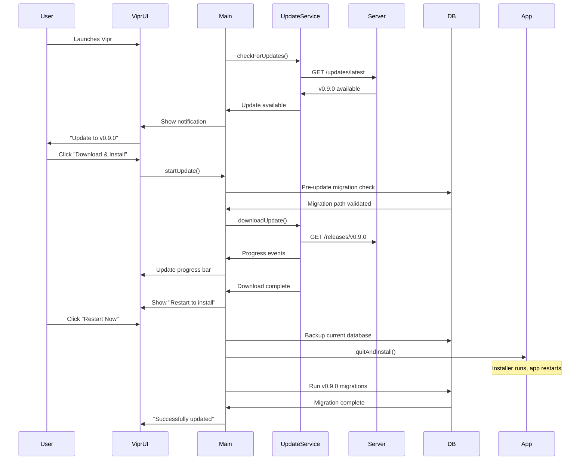
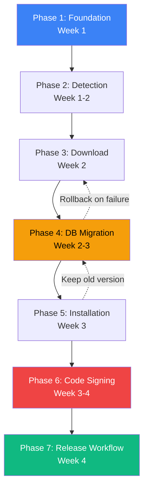
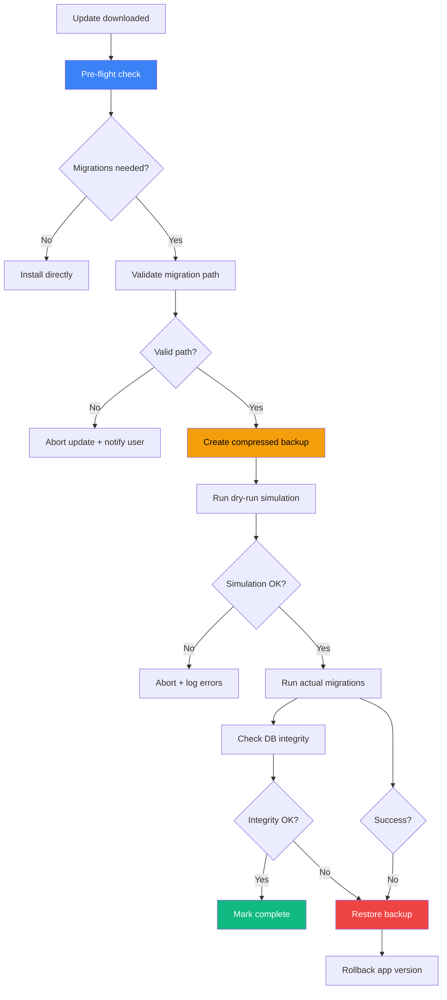
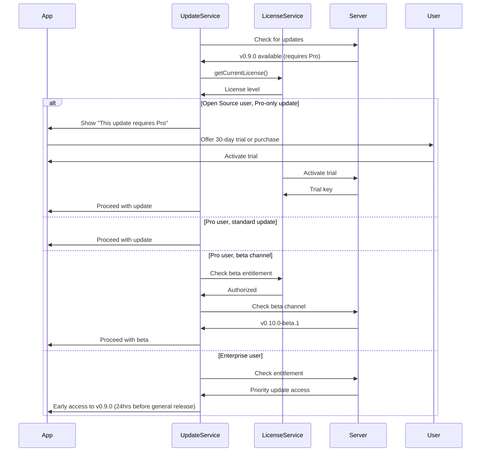
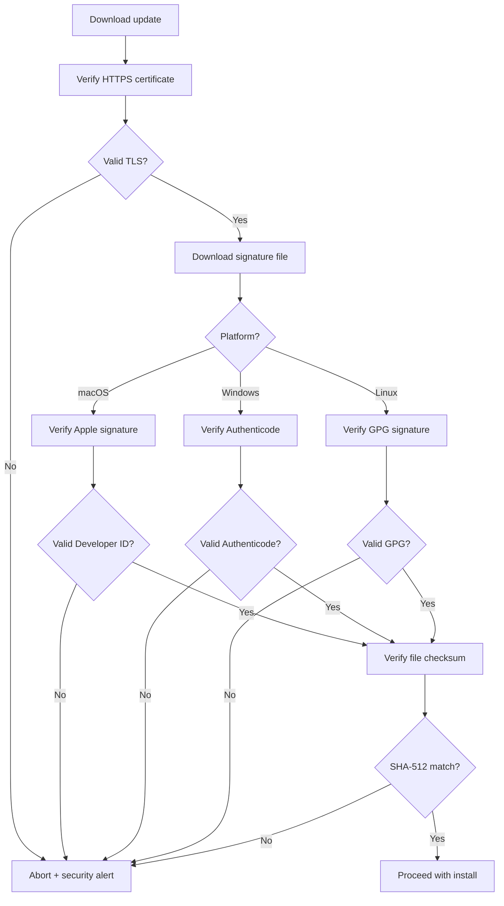

# Self-Updating Electron Application

## 1. User Story

**As a** Vipr desktop user,
**I want** the application to automatically update itself when new versions are available,
**So that** I always have the latest features, security patches, and bug fixes without manual intervention.

**Current Pain Points:**

- Users must manually download new versions from the website or GitHub Releases
- Version fragmentation across teams leads to inconsistent behavior and difficult bug reproduction
- Security patches take weeks to reach users who don't check for updates regularly
- Database schema changes require careful coordination when users skip multiple versions
- No clear signal when an update is available or what it contains

**Desktop Capability Utilized:**
This feature leverages native desktop update mechanisms (Squirrel.Mac, Squirrel.Windows, AppImageUpdate) to provide seamless, secure, and automatic updates. Unlike web applications that update transparently, desktop apps require code signing, signature verification, installer management, and careful coordination with local databases. The desktop environment allows us to:

- Download updates in the background without disrupting the user
- Verify cryptographic signatures before installation
- Coordinate database migrations with application updates
- Restart the application to apply updates with minimal friction
- Rollback to previous versions if migrations fail

## 2. User Need

### Why Manual Updates Fail

Manual software updates create significant friction in the user experience:

**Discovery Problem:** Users don't know when updates are available. They must actively check the website, GitHub Releases, or social media for announcements. Most users never check, running outdated versions indefinitely.

**Download Friction:** Even when users know an update exists, they must:

1. Navigate to the download page
2. Choose the correct platform installer
3. Download (often 100+ MB)
4. Locate the download in their file system
5. Run the installer
6. Replace the existing installation
7. Restart the application

This 7-step process takes 5-10 minutes and requires technical knowledge. Many users defer updates until they encounter a blocking bug.

**Version Fragmentation:** In teams, different users run different versions. This creates:

- Inconsistent behavior when sharing workspace configurations
- Difficult bug reproduction ("It works on my machine")
- Database schema incompatibilities when users collaborate
- Support burden (maintainers must debug multiple versions)

**Security Implications:** Security vulnerabilities remain unpatched for weeks or months. Critical fixes in v0.8.1 don't reach users still on v0.7.5 until they manually update. This is especially concerning for desktop applications that may access sensitive codebases or corporate networks.

**Data Migration Complexity:** Database schema changes (adding tables, columns, indexes) require migrations. When users skip multiple versions (v0.7.0 → v0.9.0), migrations must run sequentially. Manual updates don't validate migration paths or provide rollback mechanisms, leading to corrupted databases and lost data.

### The Need for Automatic Updates

Automatic updates solve these problems:

**Reduced Friction:** Updates happen in the background. Users see a notification, click "Install," and restart. The entire process takes 30 seconds.

**Faster Security Patching:** Critical fixes reach 90%+ of users within 48 hours instead of weeks.

**Team Consistency:** All team members converge on the latest version within days, eliminating "works on my machine" issues.

**Database Safety:** The update system validates migration paths, creates automatic backups, and provides rollback on failure. Users never encounter corrupted databases.

**Better User Experience:** Users always have the latest features and improvements without thinking about updates.

### Requirements

**Must Have:**

- Detect available updates in the background
- Download updates with progress indication
- Verify cryptographic signatures before installation
- Coordinate database migrations with updates
- Rollback on migration failure
- Restart to install updates
- Manual "Check for Updates" trigger
- Stable and beta channel support

**Should Have:**

- Resume interrupted downloads
- Pre-flight migration validation (dry-run)
- Automatic database backups before updates
- Changelog viewer in-app
- Disk space validation before download

**Could Have:**

- Delta updates (binary diffs for smaller downloads)
- Staged rollouts (release to 10% of users first)
- Automatic installation scheduling (install at 3 AM)
- In-app rollback UI for previous versions

## 3. UX Flow

### 3.1 Entry Points

Users interact with the update system through four entry points:

**1. System Tray "Check for Updates" (Manual Trigger)**

- Location: System tray menu → "Check for Updates"
- Action: Immediately checks for updates and shows result
- Outcome: Modal with "Update Available" or "You're up to date"

**2. Settings → Updates Tab (Configuration)**

- Location: Main window → Settings → Updates
- Action: Configure auto-update preferences
- Controls: Auto-update toggle, frequency dropdown, channel selector
- Outcome: Persistent configuration saved to user preferences

**3. Automatic Background Checks (Default Behavior)**

- Trigger: On app startup + configurable interval (daily/weekly)
- Action: Silent check in background
- Outcome: Notification badge if update available

**4. Startup Notifications (Post-Update)**

- Trigger: First launch after successful update
- Action: Show "Successfully updated to v0.9.0" message
- Outcome: Link to changelog, dismiss option

### 3.2 User Journey Sequence Diagram



### 3.3 Update States

**Background Check Notification (Subtle, Dismissible)**

- Visual: Badge on settings icon, system tray notification
- Message: "Update to v0.9.0 available"
- Actions: "View Details" | "Remind Me Later" | "Skip This Version"
- Behavior: Auto-dismisses after 10 seconds, reappears next session

**Download Progress Modal (Blocking, Cancelable)**

- Visual: ProgressModal with percentage, download speed, ETA
- Message: "Downloading Vipr v0.9.0... (45 MB / 120 MB)"
- Actions: "Cancel Download"
- Behavior: Resumes if interrupted, shows error if fails
- Component: `<ProgressModal progress={75} onCancel={cancelDownload} />`

**Ready to Install Notification (Persistent)**

- Visual: Alert banner at top of window
- Message: "Update ready. Restart to install v0.9.0"
- Actions: "Restart Now" | "Restart Later"
- Behavior: Persists until user restarts or dismisses
- Component: `<Alert variant="banner" type="info" />`

**Update Failed Error State (Actionable)**

- Visual: ErrorDisplay with retry and details
- Message: "Update to v0.9.0 failed: Download checksum mismatch"
- Actions: "Retry" | "Skip Version" | "View Logs"
- Behavior: Logs full error details, allows retry
- Component: `<ErrorDisplay variant="card" error={updateError} />`

**Post-Update Success Message (Informational)**

- Visual: Alert banner (auto-dismisses after 5 seconds)
- Message: "Successfully updated to v0.9.0"
- Actions: "What's New?" (opens changelog)
- Behavior: Shows on first launch after update
- Component: `<Alert variant="banner" type="success" />`

## 4. Information Architecture

### Progressive Disclosure Table

Updates provide information at five levels, balancing awareness with cognitive load:

| Level                      | Information                                          | Components                                              | User Action Required       | Persistence           |
| -------------------------- | ---------------------------------------------------- | ------------------------------------------------------- | -------------------------- | --------------------- |
| **Level 1 (Notification)** | Version number, release date, file size              | `<Badge variant="success">`, `<Alert variant="banner">` | Click to expand            | Until dismissed       |
| **Level 2 (Details)**      | Changelog summary, breaking changes, migration notes | `<Modal>`, Markdown renderer                            | Click "Download" or "Skip" | Modal dismissal       |
| **Level 3 (Progress)**     | Download percentage, speed (MB/s), ETA               | `<ProgressModal progress={percent}>`                    | Wait or cancel             | Until complete/failed |
| **Level 4 (Post-install)** | Migration status, warnings, rollback notice          | `<Alert>`, `<DataList>`                                 | Acknowledge                | One-time on restart   |
| **Level 5 (History)**      | Full migration logs, checksums, signatures           | Settings → Updates → History                            | Navigate to logs           | Persistent file       |

**Progressive Disclosure Pattern:**

```tsx
// Level 1: Badge notification
<Badge variant="success" size="sm">1</Badge>

// Level 2: Expand to modal
<Modal isOpen={showUpdateModal}>
  <h2>Update to v0.9.0</h2>
  <p>Released: 2026-02-15 · Size: 120 MB</p>
  <Markdown>{changelog}</Markdown>
  {hasBreakingChanges && (
    <Alert type="warning">
      This update includes database changes. A backup will be created.
    </Alert>
  )}
  <Button onClick={startDownload}>Download & Install</Button>
</Modal>

// Level 3: Download progress
<ProgressModal
  title="Downloading Vipr v0.9.0"
  progress={downloadProgress}
  onCancel={cancelDownload}
/>

// Level 4: Post-update summary
<Alert type="success">
  Successfully updated to v0.9.0
  <DataList
    items={[
      { label: 'Migrations Run', value: '2 (v3 → v4 → v5)' },
      { label: 'Backup Created', value: '~/.vipr/backups/v0.8.0.db' },
      { label: 'Install Time', value: '12 seconds' }
    ]}
  />
</Alert>
```

## 5. Platform-Specific Strategy

### Distribution Decision Matrix

| Platform    | Direct Distribution    | App Store       | Recommendation | Reasoning                                                                |
| ----------- | ---------------------- | --------------- | -------------- | ------------------------------------------------------------------------ |
| **macOS**   | Squirrel.Mac + DMG     | Mac App Store   | **Direct**     | Avoid 2-7 day review delays for updates; full control over beta channels |
| **Windows** | Squirrel.Windows + MSI | Microsoft Store | **Direct**     | More flexibility with code signing; faster update deployment             |
| **Linux**   | AppImage auto-update   | Snap/Flatpak    | **Multiple**   | AppImage for auto-update; Snap/Flatpak for discoverability               |

**Rationale for Direct Distribution:**

**Faster Updates:** Direct distribution allows updates to reach users within hours of release. App stores (especially Mac App Store) have unpredictable review times (2-14 days), delaying critical security patches.

**Beta Channels:** Direct distribution enables stable/beta channel switching in-app. App stores require separate beta programs with complex enrollment.

**Better Analytics:** Direct updates provide detailed telemetry (update success rates, download times, migration failures). App stores limit this data.

**Full Control:** No review rejection risk for non-UI changes. App stores occasionally reject updates for policy violations unrelated to code quality.

**Trade-offs:** Initial installation requires user trust (Gatekeeper warnings on macOS). App stores provide pre-established trust but limit update agility.

**Hybrid Approach:** Offer both direct download (vipr.dev) and app stores for discovery. Users who install via app store still get faster updates through direct distribution once installed.

### Platform Differences Table

| Aspect                     | macOS                           | Windows                       | Linux                            |
| -------------------------- | ------------------------------- | ----------------------------- | -------------------------------- |
| **Update mechanism**       | Squirrel.Mac (ZIP-based)        | Squirrel.Windows (NSIS-based) | AppImageUpdate (zsync)           |
| **Code signing**           | Apple Developer cert ($99/year) | EV/OV cert ($200-500/year)    | GPG signatures (free)            |
| **Installer format**       | DMG (drag-to-install)           | MSI/EXE (wizard)              | AppImage/deb/rpm                 |
| **Notarization**           | Required (macOS 10.15+)         | Optional (SmartScreen)        | N/A                              |
| **Auto-update library**    | electron-updater                | electron-updater              | electron-updater (AppImage only) |
| **Signature verification** | codesign + notary               | Authenticode                  | GPG verify                       |
| **User trust**             | Gatekeeper (first launch)       | SmartScreen                   | Manual signature check           |
| **Rollback**               | Time Machine                    | System Restore                | Manual backup                    |

**Platform-Specific Considerations:**

**macOS:**

- Notarization is mandatory for distribution outside Mac App Store (Catalina+)
- Hardened Runtime required (affects certain Node.js features)
- Users on older OS versions (< 10.15) can't install without disabling Gatekeeper
- DMG requires manual drag-to-Applications (vs auto-install on Windows)

**Windows:**

- EV certificates provide immediate SmartScreen trust (no "unknown publisher" warning)
- Standard certificates require ~1000 installations before SmartScreen trust
- MSI installers integrate with Windows Installer service (better uninstall)
- Per-user vs per-machine installation affects auto-update permissions

**Linux:**

- AppImage auto-update works without package manager dependencies
- Snap/Flatpak auto-update through respective stores (slower)
- Distribution-specific packages (deb, rpm) require repository hosting
- No universal code signing standard (GPG signatures optional)

## 6. Implementation Phases

### Phase 1: Foundation (Week 1)

**Goal:** Set up core infrastructure for update detection and installation.

**Tasks:**

1. Add electron-updater dependency: `pnpm add electron-updater`
2. Configure `forge.config.ts` publishers (GitHub, S3)
3. Create `UpdateService` class skeleton (`src/main/services/update-service.ts`)
4. Add IPC handlers (`updates:check`, `updates:download`, `updates:install`)
5. Set up basic logging for update events

**Code Example:**

```typescript
// src/main/services/update-service.ts
import { autoUpdater } from 'electron-updater';
import { app } from 'electron';

export class UpdateService {
  constructor() {
    autoUpdater.autoDownload = false; // Manual control
    autoUpdater.autoInstallOnAppQuit = true;
    autoUpdater.logger = logger;

    this.setupListeners();
  }

  private setupListeners() {
    autoUpdater.on('update-available', this.onUpdateAvailable);
    autoUpdater.on('update-downloaded', this.onUpdateDownloaded);
    autoUpdater.on('error', this.onUpdateError);
    autoUpdater.on('download-progress', this.onDownloadProgress);
  }

  async checkForUpdates(): Promise<UpdateCheckResult> {
    const result = await autoUpdater.checkForUpdates();
    return {
      available: result.updateInfo.version !== app.getVersion(),
      version: result.updateInfo.version,
      releaseDate: result.updateInfo.releaseDate,
    };
  }
}
```

**Deliverable:** Update detection works, IPC handlers respond, no actual downloads yet.

### Phase 2: Update Detection (Week 1-2)

**Goal:** Implement background checks and manual triggers.

**Tasks:**

1. Implement background check on startup
2. Add configurable check interval (daily/weekly)
3. Manual "Check for Updates" from system tray
4. Parse update manifest (version, changelog, checksums)
5. Channel switching (stable ↔ beta)
6. Skip version functionality

**Configuration:**

```typescript
interface UpdateConfig {
  autoUpdate: boolean;
  checkFrequency: 'startup' | 'daily' | 'weekly' | 'never';
  channel: 'stable' | 'beta';
  skippedVersions: string[];
}
```

**Deliverable:** Users can check for updates manually, background checks work, channels switch correctly.

### Phase 3: Download & Verification (Week 2)

**Goal:** Download updates with progress tracking and security verification.

**Tasks:**

1. Implement streaming download with `autoUpdater.downloadUpdate()`
2. Emit progress events to renderer (percentage, speed, ETA)
3. Verify checksum after download
4. Verify code signature (platform-specific)
5. Handle download interruptions (resume support)
6. Disk space validation before starting download

**Progress Event:**

```typescript
autoUpdater.on('download-progress', progress => {
  mainWindow.webContents.send('update:progress', {
    percent: progress.percent,
    transferred: progress.transferred,
    total: progress.total,
    bytesPerSecond: progress.bytesPerSecond,
  });
});
```

**Deliverable:** Downloads complete with progress UI, signature verification works, interrupted downloads resume.

### Phase 4: Database Migration Integration (Week 2-3)

**Goal:** Coordinate updates with database schema changes, ensuring data safety.

**Tasks:**

1. Add pre-update migration validation (dry-run simulator)
2. Create automatic database backup before update
3. Implement post-update migration runner
4. Add rollback mechanism on migration failure
5. Create `migration_history` table for audit trail
6. Emit migration progress events to UI

**Migration History Table:**

```sql
CREATE TABLE migration_history (
  id INTEGER PRIMARY KEY AUTOINCREMENT,
  version INTEGER NOT NULL,
  direction TEXT CHECK(direction IN ('up', 'down')),
  started_at INTEGER NOT NULL,
  completed_at INTEGER,
  status TEXT CHECK(status IN ('running', 'success', 'failed', 'rolled_back')),
  error_message TEXT,
  backup_path TEXT,
  UNIQUE(version, started_at)
);
```

**Migration Workflow:**

```typescript
async function runUpdateMigrations(
  db: DatabaseSync,
  currentVersion: number,
  targetVersion: number
): Promise<MigrationResult> {
  // 1. Validate migration path
  const path = getMigrationPath(currentVersion, targetVersion);
  if (!path.isValid) {
    throw new Error(`Cannot migrate from v${currentVersion} to v${targetVersion}`);
  }

  // 2. Create backup
  const backupPath = await createDatabaseBackup(db);

  // 3. Dry-run simulation
  const simulation = await simulateMigrations(db, path);
  if (!simulation.success) {
    throw new Error(`Migration simulation failed: ${simulation.error}`);
  }

  // 4. Run actual migrations with progress
  try {
    for (const migration of path.migrations) {
      await runMigrationWithProgress(migration, db);
    }
    return { success: true, backupPath };
  } catch (error) {
    await restoreDatabaseBackup(backupPath);
    throw error;
  }
}
```

**Deliverable:** Updates coordinate with database migrations, backups create automatically, rollback works on failure.

### Phase 5: Installation & Restart (Week 3)

**Goal:** Apply updates and restart the application seamlessly.

**Tasks:**

1. Implement `quitAndInstall()` with user confirmation
2. Save window state before quit (position, size, maximized)
3. Save current workspace ID to restore after restart
4. Post-install validation (app version matches expected)
5. Show success message on first launch after update

**Restart Flow:**

```typescript
async function installUpdate() {
  // 1. Save state
  const windowState = {
    bounds: mainWindow.getBounds(),
    isMaximized: mainWindow.isMaximized(),
    workspaceId: currentWorkspace.id,
  };
  await saveWindowState(windowState);

  // 2. Quit and install
  autoUpdater.quitAndInstall(false, true);
}

// On app restart
app.on('ready', async () => {
  const state = await loadWindowState();
  if (state.isMaximized) {
    mainWindow.maximize();
  } else {
    mainWindow.setBounds(state.bounds);
  }
  await loadWorkspace(state.workspaceId);
});
```

**Deliverable:** Updates install smoothly, app restarts to same state, success message shows.

### Phase 6: Code Signing Setup (Week 3-4)

**Goal:** Establish code signing infrastructure for all platforms.

**Tasks:**

1. Acquire Apple Developer certificate ($99, 1-2 days)
2. Configure macOS notarization (app-specific password)
3. Acquire Windows code signing certificate (EV preferred, 2-7 days)
4. Generate GPG key for Linux releases
5. Add certificates to CI/CD secrets
6. Configure `forge.config.ts` signing options
7. Test signature verification on all platforms

**forge.config.ts Configuration:**

```javascript
module.exports = {
  makers: [
    {
      name: '@electron-forge/maker-dmg',
      config: {
        sign: {
          identity: process.env.APPLE_IDENTITY,
        },
      },
    },
    {
      name: '@electron-forge/maker-squirrel',
      config: {
        certificateFile: process.env.WINDOWS_CERT_FILE,
        certificatePassword: process.env.WINDOWS_CERT_PASSWORD,
      },
    },
  ],
  publishers: [
    {
      name: '@electron-forge/publisher-s3',
      config: {
        bucket: 'vipr-updates',
        region: 'us-east-1',
        public: true,
      },
    },
  ],
};
```

**Deliverable:** All platform installers are code-signed, notarization works, signatures verify.

### Phase 7: Release Workflow (Week 4)

**Goal:** Automate the end-to-end release process.

**Tasks:**

1. Create GitHub Actions workflow for releases
2. Implement automated version bumping
3. Generate changelog from git commits
4. Build and sign on all platforms (matrix build)
5. Upload signed installers to S3
6. Create `latest.json` manifest
7. Create GitHub Release with attachments
8. Add rollback procedure
9. Set up monitoring for update success rates

**GitHub Actions Workflow:**

```yaml
name: Release Desktop App

on:
  push:
    tags: ['desktop-v*']

jobs:
  release:
    strategy:
      matrix:
        os: [macos-latest, windows-latest, ubuntu-latest]
    runs-on: ${{ matrix.os }}
    steps:
      - uses: actions/checkout@v3
      - uses: pnpm/action-setup@v2
      - uses: actions/setup-node@v3

      - name: Install dependencies
        run: pnpm install --frozen-lockfile

      - name: Build packages
        run: pnpm build

      - name: Import code signing certificate
        if: matrix.os == 'macos-latest'
        run: |
          echo "$APPLE_CERTIFICATE" | base64 -d > cert.p12
          security create-keychain -p "" build.keychain
          security import cert.p12 -k build.keychain -P "$APPLE_CERT_PASSWORD"

      - name: Build and sign
        run: pnpm --filter @vipr/desktop make

      - name: Notarize (macOS)
        if: matrix.os == 'macos-latest'
        run: pnpm --filter @vipr/desktop notarize

      - name: Upload to S3
        run: aws s3 sync out/make s3://vipr-updates/releases/${{ github.ref_name }}/

      - name: Create GitHub Release
        uses: softprops/action-gh-release@v1
        with:
          files: out/make/**/*
          generate_release_notes: true
```

**Deliverable:** Releases fully automated, installers published to S3 and GitHub, monitoring active.

### Implementation Timeline



## 7. Database Migration Enhancement

### Current System

**Existing Implementation:**

- Schema version: 3 (latest)
- Tables: `metadata`, `workspaces`, `analyses`, `files`, `dependencies`
- Migration system: Sequential up/down functions in `src/main/db/migrations/index.ts`
- Transaction support: All migrations wrapped in transactions
- WAL mode enabled for concurrent reads
- Foreign key constraints enforced

**Example Existing Migration:**

```typescript
const migrations: Migration[] = [
  {
    version: 1,
    up: db => {
      db.exec(`CREATE TABLE metadata (...)`);
      db.exec(`CREATE TABLE workspaces (...)`);
    },
    down: db => {
      db.exec(`DROP TABLE workspaces`);
      db.exec(`DROP TABLE metadata`);
    },
  },
  // ... v2, v3
];
```

### Enhancements Needed

| Requirement               | Current State           | Enhancement                                           | Priority |
| ------------------------- | ----------------------- | ----------------------------------------------------- | -------- |
| **Pre-flight validation** | ❌ No dry-run           | Add migration simulator that runs in separate DB copy | High     |
| **Automatic backups**     | ❌ Manual only          | Create compressed backup before any migration         | High     |
| **Migration metadata**    | ⚠️ Only current version | Add `migration_history` table with full audit trail   | High     |
| **Rollback support**      | ⚠️ Manual `down()` only | Automatic rollback on failure + backup restore        | High     |
| **Progress reporting**    | ❌ No feedback          | Emit events for long migrations (> 1 second)          | Medium   |
| **Multi-version jumps**   | ⚠️ Sequential only      | Validate complete path for skipped versions           | Medium   |
| **Migration timing**      | ❌ No tracking          | Record duration for performance monitoring            | Low      |
| **Corruption detection**  | ❌ No validation        | Run PRAGMA integrity_check after migration            | Medium   |

### New Table: migration_history

```sql
CREATE TABLE migration_history (
  id INTEGER PRIMARY KEY AUTOINCREMENT,
  version INTEGER NOT NULL,
  direction TEXT CHECK(direction IN ('up', 'down')) NOT NULL,
  started_at INTEGER NOT NULL,
  completed_at INTEGER,
  duration_ms INTEGER,
  status TEXT CHECK(status IN ('running', 'success', 'failed', 'rolled_back')) NOT NULL,
  error_message TEXT,
  backup_path TEXT,
  affected_rows INTEGER,
  UNIQUE(version, started_at)
);

CREATE INDEX idx_migration_history_version ON migration_history(version);
CREATE INDEX idx_migration_history_status ON migration_history(status);
```

### Migration Workflow Diagram



### Enhanced Migration Runner

```typescript
interface MigrationContext {
  db: DatabaseSync;
  currentVersion: number;
  targetVersion: number;
  backupPath?: string;
  dryRun: boolean;
  workspaceId: string;
}

interface MigrationResult {
  success: boolean;
  backupPath?: string;
  migrationsRun: number[];
  duration: number;
  error?: Error;
}

async function runUpdateMigrations(context: MigrationContext): Promise<MigrationResult> {
  const startTime = Date.now();

  // 1. Validate migration path
  const path = getMigrationPath(context.currentVersion, context.targetVersion);
  if (!path.isValid) {
    throw new Error(
      `Cannot migrate from v${context.currentVersion} to v${context.targetVersion}. ` +
        `Missing migrations: ${path.missingVersions.join(', ')}`
    );
  }

  logger.info(`Migration path validated: ${path.migrations.map(m => m.version).join(' → ')}`);

  // 2. Create backup (if not dry-run)
  if (!context.dryRun) {
    context.backupPath = await createDatabaseBackup(context.db, context.workspaceId);
    logger.info(`Database backup created: ${context.backupPath}`);
  }

  // 3. Run dry-run simulation on copy
  const simulation = await simulateMigrations(context.db, path);
  if (!simulation.success) {
    throw new Error(`Migration simulation failed: ${simulation.error}`);
  }
  logger.info('Dry-run simulation successful');

  // 4. Run actual migrations with progress
  const migrationsRun: number[] = [];
  try {
    for (const migration of path.migrations) {
      await runMigrationWithProgress(migration, context);
      migrationsRun.push(migration.version);
    }

    // 5. Verify database integrity
    const integrityCheck = context.db.prepare('PRAGMA integrity_check').get();
    if (integrityCheck.integrity_check !== 'ok') {
      throw new Error(`Database integrity check failed: ${integrityCheck.integrity_check}`);
    }

    logger.info('All migrations completed successfully');
    return {
      success: true,
      backupPath: context.backupPath,
      migrationsRun,
      duration: Date.now() - startTime,
    };
  } catch (error) {
    logger.error('Migration failed, rolling back', error);

    // Restore from backup
    if (context.backupPath) {
      await restoreDatabaseBackup(context.backupPath, context.workspaceId);
    }

    return {
      success: false,
      backupPath: context.backupPath,
      migrationsRun,
      duration: Date.now() - startTime,
      error: error as Error,
    };
  }
}

async function runMigrationWithProgress(
  migration: Migration,
  context: MigrationContext
): Promise<void> {
  const startTime = Date.now();

  // Log to migration_history
  const stmt = context.db.prepare(`
    INSERT INTO migration_history (version, direction, started_at, status)
    VALUES (?, 'up', ?, 'running')
  `);
  const result = stmt.run(migration.version, Math.floor(Date.now() / 1000));
  const historyId = result.lastInsertRowid;

  try {
    // Emit progress event
    mainWindow.webContents.send('migration:progress', {
      version: migration.version,
      status: 'running',
    });

    // Run migration
    migration.up(context.db);

    // Update history
    context.db
      .prepare(
        `
      UPDATE migration_history
      SET completed_at = ?, duration_ms = ?, status = 'success'
      WHERE id = ?
    `
      )
      .run(Math.floor(Date.now() / 1000), Date.now() - startTime, historyId);

    logger.info(`Migration v${migration.version} completed in ${Date.now() - startTime}ms`);
  } catch (error) {
    // Mark as failed
    context.db
      .prepare(
        `
      UPDATE migration_history
      SET status = 'failed', error_message = ?
      WHERE id = ?
    `
      )
      .run((error as Error).message, historyId);

    throw error;
  }
}

async function createDatabaseBackup(db: DatabaseSync, workspaceId: string): Promise<string> {
  const timestamp = new Date().toISOString().replace(/:/g, '-');
  const backupDir = path.join(app.getPath('userData'), 'backups');
  await fs.mkdir(backupDir, { recursive: true });

  const backupPath = path.join(backupDir, `workspace-${workspaceId}-${timestamp}.db`);

  // Use SQLite backup API for consistent copy
  await db.backup(backupPath);

  // Compress for storage efficiency
  const gzipPath = `${backupPath}.gz`;
  await compressFile(backupPath, gzipPath);
  await fs.unlink(backupPath);

  return gzipPath;
}
```

### Migration Path Validation

```typescript
interface MigrationPath {
  isValid: boolean;
  migrations: Migration[];
  missingVersions: number[];
}

function getMigrationPath(from: number, to: number): MigrationPath {
  const requiredVersions = Array.from({ length: to - from }, (_, i) => from + i + 1);

  const availableMigrations = migrations.filter(m => requiredVersions.includes(m.version));

  const missingVersions = requiredVersions.filter(
    v => !availableMigrations.find(m => m.version === v)
  );

  return {
    isValid: missingVersions.length === 0,
    migrations: availableMigrations.sort((a, b) => a.version - b.version),
    missingVersions,
  };
}
```

## 8. Licensing Model Architecture

### License Types

| Type            | Features                                          | Updates              | Support                 | Price    | Target Audience                      |
| --------------- | ------------------------------------------------- | -------------------- | ----------------------- | -------- | ------------------------------------ |
| **Open Source** | Full analysis, single workspace, all plugins      | ✅ All updates       | Community (GitHub)      | Free     | Individual developers, OSS projects  |
| **Pro**         | Multi-workspace, scheduled analysis, MCP server   | ✅ All updates       | Email (48hr response)   | $49/year | Professional developers, small teams |
| **Enterprise**  | SSO, audit logs, priority updates, custom plugins | ✅ All + beta access | Priority (4hr response) | Custom   | Organizations, large teams           |

### Feature Gating

**Open Source (Default):**

- ✅ Single workspace
- ✅ All analysis plugins (React, Next.js, Core)
- ✅ CLI export
- ✅ Manual analysis triggers
- ✅ Stable update channel
- ❌ Multi-workspace
- ❌ Scheduled analysis
- ❌ MCP server
- ❌ Beta updates

**Pro (License Key):**

- ✅ Everything in Open Source
- ✅ Unlimited workspaces
- ✅ Scheduled analysis (hourly/daily/weekly)
- ✅ Embedded MCP server
- ✅ Beta update channel
- ❌ SSO integration
- ❌ Audit logging

**Enterprise (License + Auth):**

- ✅ Everything in Pro
- ✅ SSO (SAML, OAuth)
- ✅ Audit logs
- ✅ Priority updates (1 day early)
- ✅ Custom plugin development support
- ✅ SLA guarantees

### License Validation Flow



### Update Manifest with Licensing

```json
{
  "version": "0.9.0",
  "releaseDate": "2026-02-15T10:00:00Z",
  "minimumLicense": "pro",
  "channels": {
    "stable": {
      "version": "0.9.0",
      "requiredLicense": "open-source",
      "platforms": {
        "darwin": {
          "url": "https://cdn.vipr.dev/releases/v0.9.0/Vipr-0.9.0.dmg",
          "sha512": "abc123...",
          "size": 125829120
        }
      }
    },
    "beta": {
      "version": "0.10.0-beta.1",
      "requiredLicense": "pro",
      "releaseDate": "2026-02-14T10:00:00Z"
    }
  },
  "features": {
    "multi-workspace": "pro",
    "scheduled-analysis": "pro",
    "mcp-server": "pro",
    "sso": "enterprise"
  }
}
```

### License Check Integration

```typescript
interface LicenseInfo {
  type: 'open-source' | 'pro' | 'enterprise';
  expiresAt?: number; // Unix timestamp
  features: string[];
  trialActive?: boolean;
  trialExpiresAt?: number;
}

class UpdateService {
  async checkForUpdates(): Promise<UpdateCheckResult> {
    const license = await licenseService.getCurrentLicense();
    const manifest = await fetchUpdateManifest(license.type);

    const latestVersion = manifest.channels[this.config.channel];

    // Check license requirement
    if (!this.hasRequiredLicense(latestVersion.requiredLicense, license.type)) {
      return {
        available: true,
        version: latestVersion.version,
        requiresUpgrade: true,
        requiredLicense: latestVersion.requiredLicense,
      };
    }

    return {
      available: latestVersion.version > app.getVersion(),
      version: latestVersion.version,
    };
  }

  private hasRequiredLicense(required: string, current: string): boolean {
    const hierarchy = ['open-source', 'pro', 'enterprise'];
    return hierarchy.indexOf(current) >= hierarchy.indexOf(required);
  }
}
```

## 9. Component Map

### Primary Components Table

| Component         | Import Path               | Configuration                                    | Usage in Phase 22                                                   | Example                 |
| ----------------- | ------------------------- | ------------------------------------------------ | ------------------------------------------------------------------- | ----------------------- |
| **SettingCard**   | `@vipr/ui/setting-card`   | `label`, `description`, `children`               | Update preferences section (auto-update toggle, frequency selector) | Wrap Switch/Dropdown    |
| **Switch**        | `@vipr/ui/switch`         | `checked`, `onChange`, `disabled`                | Auto-update toggle, beta channel toggle                             | Enable/disable features |
| **Dropdown**      | `@vipr/ui/dropdown`       | `type: 'select'`, `options`, `value`, `onChange` | Update frequency selector, channel selector                         | Select from options     |
| **Badge**         | `@vipr/ui/badge`          | `variant`, `size`, `children`                    | Version number indicator, update count                              | Show "v0.9.0" or "1"    |
| **Button**        | `@vipr/ui/button`         | `appearance`, `size`, `onClick`, `isLoading`     | Check/Install/Cancel buttons                                        | Primary actions         |
| **Alert**         | `@vipr/ui/alert`          | `variant`, `type`, `children`, `onDismiss`       | Update notifications, success/error messages                        | Banner/toast alerts     |
| **ProgressModal** | `@vipr/ui/progress-modal` | `title`, `progress`, `onCancel`                  | Download progress with cancellation                                 | 0-100% with cancel      |
| **Modal**         | `@vipr/ui/modal`          | `isOpen`, `onClose`, `title`, `children`         | Changelog viewer, confirmation dialogs                              | Full-screen overlay     |
| **DataList**      | `@vipr/ui/data-list`      | `items`, `renderItem`                            | Migration details, update metadata                                  | Key-value pairs         |
| **ErrorDisplay**  | `@vipr/ui/error-display`  | `variant`, `error`, `retry`                      | Update failure state with retry                                     | Show errors clearly     |

### Settings Panel Implementation

Following the Phase 12 (MCP Server) pattern for settings panels:

```tsx
// src/renderer/pages/Settings/UpdatesTab.tsx
import { SettingCard } from '@vipr/ui/setting-card';
import { Switch } from '@vipr/ui/switch';
import { Dropdown } from '@vipr/ui/dropdown';
import { Button } from '@vipr/ui/button';
import { Alert } from '@vipr/ui/alert';
import { Badge } from '@vipr/ui/badge';

export function UpdatesTab() {
  const { config, updateConfig } = useUpdateConfig();
  const { checkForUpdates, updateAvailable, isChecking } = useUpdates();

  return (
    <div className="space-y-6">
      <div className="flex items-center justify-between">
        <div>
          <h2 className="text-lg font-semibold">Updates</h2>
          <p className="text-sm text-gray-500 dark:text-gray-400">
            Keep Vipr up to date with automatic updates
          </p>
        </div>
        {updateAvailable && (
          <Badge variant="success" size="sm">
            Update available
          </Badge>
        )}
      </div>

      <SettingCard
        label="Automatic Updates"
        description="Download and install updates automatically without interrupting your work"
      >
        <Switch
          checked={config.autoUpdate}
          onChange={checked => updateConfig({ autoUpdate: checked })}
        />
      </SettingCard>

      <SettingCard label="Update Frequency" description="How often to check for new versions">
        <Dropdown
          type="select"
          value={config.updateFrequency}
          onChange={value => updateConfig({ updateFrequency: value })}
          options={[
            { value: 'startup', label: 'On Startup' },
            { value: 'daily', label: 'Daily' },
            { value: 'weekly', label: 'Weekly' },
            { value: 'never', label: 'Manual Only' },
          ]}
          disabled={!config.autoUpdate}
        />
      </SettingCard>

      <SettingCard
        label="Update Channel"
        description="Stable for production use, beta for early access to new features"
      >
        <Dropdown
          type="select"
          value={config.channel}
          onChange={value => updateConfig({ channel: value })}
          options={[
            { value: 'stable', label: 'Stable (Recommended)' },
            { value: 'beta', label: 'Beta (Pro only)' },
          ]}
          disabled={!hasProLicense && config.channel === 'stable'}
        />
      </SettingCard>

      <div className="flex items-center gap-4">
        <Button appearance="secondary" onClick={checkForUpdates} isLoading={isChecking}>
          Check for Updates
        </Button>
        <span className="text-sm text-gray-500 dark:text-gray-400">
          Last checked: {formatLastChecked(config.lastChecked)}
        </span>
      </div>

      {updateAvailable && (
        <Alert variant="banner" type="info" onDismiss={() => dismissUpdate()}>
          <div className="flex items-center justify-between">
            <div>
              <strong>Update available: v{updateAvailable.version}</strong>
              <p className="text-sm mt-1">
                Released {formatDate(updateAvailable.releaseDate)} ·{' '}
                {formatSize(updateAvailable.size)}
              </p>
            </div>
            <div className="flex gap-2">
              <Button appearance="secondary" size="sm" onClick={viewChangelog}>
                What's New?
              </Button>
              <Button appearance="primary" size="sm" onClick={downloadUpdate}>
                Download & Install
              </Button>
            </div>
          </div>
        </Alert>
      )}
    </div>
  );
}
```

### Update Progress Modal

```tsx
// src/renderer/components/updates/UpdateProgress.tsx
import { ProgressModal } from '@vipr/ui/progress-modal';

export function UpdateProgress({ visible, progress, onCancel }) {
  return (
    <ProgressModal
      title={`Downloading Vipr v${progress.version}`}
      progress={progress.percent}
      onCancel={onCancel}
    >
      <div className="space-y-2 text-sm text-gray-600 dark:text-gray-400">
        <div className="flex justify-between">
          <span>Downloaded:</span>
          <span>
            {formatSize(progress.transferred)} / {formatSize(progress.total)}
          </span>
        </div>
        <div className="flex justify-between">
          <span>Speed:</span>
          <span>{formatSpeed(progress.bytesPerSecond)}</span>
        </div>
        <div className="flex justify-between">
          <span>Time remaining:</span>
          <span>{formatETA(progress.eta)}</span>
        </div>
      </div>
    </ProgressModal>
  );
}
```

### Changelog Viewer Modal

```tsx
// src/renderer/components/updates/ChangelogViewer.tsx
import { Modal } from '@vipr/ui/modal';
import { Button } from '@vipr/ui/button';
import { Badge } from '@vipr/ui/badge';

export function ChangelogViewer({ isOpen, onClose, changelog }) {
  return (
    <Modal isOpen={isOpen} onClose={onClose} title={`What's New in v${changelog.version}`}>
      <div className="space-y-4">
        <div className="flex items-center gap-2">
          <Badge variant="success">Released {formatDate(changelog.releaseDate)}</Badge>
          <Badge variant="neutral">{formatSize(changelog.size)}</Badge>
        </div>

        {changelog.breaking && (
          <Alert type="warning" variant="card">
            <strong>⚠️ Breaking Changes</strong>
            <p className="text-sm mt-1">{changelog.breaking}</p>
          </Alert>
        )}

        <div className="prose prose-sm dark:prose-invert max-w-none">
          <ReactMarkdown>{changelog.body}</ReactMarkdown>
        </div>

        <div className="flex justify-end gap-2">
          <Button appearance="secondary" onClick={onClose}>
            Close
          </Button>
          <Button appearance="primary" onClick={startDownload}>
            Download & Install
          </Button>
        </div>
      </div>
    </Modal>
  );
}
```

## 10. Electron APIs

### electron-updater Integration

```typescript
// src/main/services/update-service.ts
import { autoUpdater, UpdateInfo, ProgressInfo } from 'electron-updater';
import { app, BrowserWindow } from 'electron';
import logger from '../utils/logger';

export class UpdateService {
  private mainWindow: BrowserWindow;
  private currentDownload: UpdateInfo | null = null;

  constructor(mainWindow: BrowserWindow) {
    this.mainWindow = mainWindow;
    this.configureAutoUpdater();
    this.setupListeners();
  }

  private configureAutoUpdater() {
    // Manual control over downloads
    autoUpdater.autoDownload = false;
    autoUpdater.autoInstallOnAppQuit = true;

    // Logging
    autoUpdater.logger = logger;

    // Update feed URL (overridden by forge.config.ts publishers)
    if (process.env.NODE_ENV === 'development') {
      autoUpdater.updateConfigPath = path.join(__dirname, 'dev-app-update.yml');
    }
  }

  private setupListeners() {
    autoUpdater.on('checking-for-update', () => {
      logger.info('Checking for updates...');
      this.mainWindow.webContents.send('update:checking');
    });

    autoUpdater.on('update-available', (info: UpdateInfo) => {
      logger.info(`Update available: v${info.version}`);
      this.currentDownload = info;
      this.mainWindow.webContents.send('update:available', {
        version: info.version,
        releaseDate: info.releaseDate,
        size: info.files[0]?.size || 0,
        changelog: info.releaseNotes,
      });
    });

    autoUpdater.on('update-not-available', (info: UpdateInfo) => {
      logger.info('No updates available');
      this.mainWindow.webContents.send('update:not-available', {
        currentVersion: app.getVersion(),
      });
    });

    autoUpdater.on('download-progress', (progress: ProgressInfo) => {
      this.mainWindow.webContents.send('update:progress', {
        percent: Math.round(progress.percent),
        transferred: progress.transferred,
        total: progress.total,
        bytesPerSecond: progress.bytesPerSecond,
      });
    });

    autoUpdater.on('update-downloaded', (info: UpdateInfo) => {
      logger.info(`Update downloaded: v${info.version}`);
      this.mainWindow.webContents.send('update:downloaded', {
        version: info.version,
      });
    });

    autoUpdater.on('error', (error: Error) => {
      logger.error('Update error:', error);
      this.mainWindow.webContents.send('update:error', {
        message: error.message,
        stack: error.stack,
      });
    });
  }

  async checkForUpdates(): Promise<UpdateCheckResult> {
    try {
      const result = await autoUpdater.checkForUpdates();
      if (!result) {
        return { available: false, currentVersion: app.getVersion() };
      }

      return {
        available: result.updateInfo.version !== app.getVersion(),
        version: result.updateInfo.version,
        currentVersion: app.getVersion(),
        releaseDate: result.updateInfo.releaseDate,
      };
    } catch (error) {
      logger.error('Failed to check for updates:', error);
      throw error;
    }
  }

  async downloadUpdate(): Promise<void> {
    if (!this.currentDownload) {
      throw new Error('No update available to download');
    }

    try {
      await autoUpdater.downloadUpdate();
    } catch (error) {
      logger.error('Failed to download update:', error);
      throw error;
    }
  }

  async quitAndInstall(): Promise<void> {
    // false = don't force quit, true = restart after quit
    autoUpdater.quitAndInstall(false, true);
  }

  setChannel(channel: 'stable' | 'beta'): void {
    autoUpdater.channel = channel;
    logger.info(`Update channel set to: ${channel}`);
  }
}
```

### IPC Handlers

```typescript
// src/main/ipc/handlers/updates.ts
import { ipcMain } from 'electron';
import { UpdateService } from '../../services/update-service';

export function registerUpdateHandlers(updateService: UpdateService) {
  ipcMain.handle('updates:check', async () => {
    return await updateService.checkForUpdates();
  });

  ipcMain.handle('updates:download', async () => {
    await updateService.downloadUpdate();
  });

  ipcMain.handle('updates:install', async () => {
    await updateService.quitAndInstall();
  });

  ipcMain.handle('updates:set-channel', async (event, channel: 'stable' | 'beta') => {
    updateService.setChannel(channel);
  });
}
```

### Renderer Hook

```typescript
// src/renderer/hooks/useUpdates.ts
import { useState, useEffect } from 'react';

interface UpdateInfo {
  available: boolean;
  version?: string;
  currentVersion: string;
  releaseDate?: string;
  size?: number;
  changelog?: string;
}

interface DownloadProgress {
  percent: number;
  transferred: number;
  total: number;
  bytesPerSecond: number;
}

export function useUpdates() {
  const [updateInfo, setUpdateInfo] = useState<UpdateInfo | null>(null);
  const [isChecking, setIsChecking] = useState(false);
  const [downloadProgress, setDownloadProgress] = useState<DownloadProgress | null>(null);
  const [isDownloading, setIsDownloading] = useState(false);
  const [isReadyToInstall, setIsReadyToInstall] = useState(false);
  const [error, setError] = useState<string | null>(null);

  useEffect(() => {
    // Listen for update events
    const unsubChecking = window.ipc.on('update:checking', () => {
      setIsChecking(true);
      setError(null);
    });

    const unsubAvailable = window.ipc.on('update:available', info => {
      setIsChecking(false);
      setUpdateInfo({ available: true, ...info });
    });

    const unsubNotAvailable = window.ipc.on('update:not-available', info => {
      setIsChecking(false);
      setUpdateInfo({ available: false, ...info });
    });

    const unsubProgress = window.ipc.on('update:progress', progress => {
      setDownloadProgress(progress);
    });

    const unsubDownloaded = window.ipc.on('update:downloaded', () => {
      setIsDownloading(false);
      setIsReadyToInstall(true);
      setDownloadProgress(null);
    });

    const unsubError = window.ipc.on('update:error', ({ message }) => {
      setIsChecking(false);
      setIsDownloading(false);
      setError(message);
    });

    return () => {
      unsubChecking();
      unsubAvailable();
      unsubNotAvailable();
      unsubProgress();
      unsubDownloaded();
      unsubError();
    };
  }, []);

  const checkForUpdates = async () => {
    setIsChecking(true);
    setError(null);
    try {
      const result = await window.ipc.invoke('updates:check');
      setUpdateInfo(result);
    } catch (err) {
      setError((err as Error).message);
    } finally {
      setIsChecking(false);
    }
  };

  const downloadUpdate = async () => {
    setIsDownloading(true);
    setError(null);
    try {
      await window.ipc.invoke('updates:download');
    } catch (err) {
      setError((err as Error).message);
      setIsDownloading(false);
    }
  };

  const installUpdate = async () => {
    await window.ipc.invoke('updates:install');
  };

  const setChannel = async (channel: 'stable' | 'beta') => {
    await window.ipc.invoke('updates:set-channel', channel);
  };

  return {
    updateInfo,
    isChecking,
    downloadProgress,
    isDownloading,
    isReadyToInstall,
    error,
    checkForUpdates,
    downloadUpdate,
    installUpdate,
    setChannel,
  };
}
```

## 11. Error Handling

### Error Scenarios Table

| Scenario                      | Detection Method                  | Recovery Strategy                          | User Experience                                                     | Retry Logic                |
| ----------------------------- | --------------------------------- | ------------------------------------------ | ------------------------------------------------------------------- | -------------------------- |
| **No internet connection**    | HTTP timeout (30s)                | Exponential backoff retry (1s, 2s, 4s, 8s) | "Cannot check for updates. Retrying in 8 seconds..."                | Automatic, max 4 attempts  |
| **Download interrupted**      | Progress stalled (>60s no change) | Resume from last byte (HTTP Range header)  | Transparent resume, progress bar continues                          | Automatic resume           |
| **Checksum mismatch**         | SHA-512 verification failure      | Re-download from scratch                   | "Download corrupted. Retrying..."                                   | Automatic, max 2 attempts  |
| **Disk space insufficient**   | Pre-download space check          | Abort with cleanup suggestion              | "Not enough space. Need 500 MB, have 200 MB. Free up space?"        | Manual user action         |
| **Migration failure**         | Exception during migration        | Rollback to backup + abort update          | "Update failed. Database restored to previous version."             | Manual retry after fix     |
| **Code signature invalid**    | Platform-specific verification    | Abort install, report to server            | "Update signature invalid. Security risk detected. Do not install." | No retry, security alert   |
| **Update server unreachable** | HTTP 5xx or DNS failure           | Retry with alternate CDN URLs              | "Update server temporarily unavailable. Retrying..."                | Automatic, max 3 attempts  |
| **Incompatible OS version**   | Manifest OS requirement check     | Show upgrade path or warning               | "This update requires macOS 11+. You have 10.15."                   | No retry, informational    |
| **Battery low (laptop)**      | Battery < 20%                     | Delay until plugged in                     | "Update delayed until power adapter connected (battery low)"        | Automatic check every 5min |

### Error Recovery Implementation

```typescript
// src/main/services/update-service.ts

class UpdateService {
  private retryAttempts = 0;
  private maxRetries = 3;
  private backoffDelays = [1000, 2000, 4000, 8000]; // Exponential backoff

  async checkForUpdatesWithRetry(): Promise<UpdateCheckResult> {
    try {
      return await this.checkForUpdates();
    } catch (error) {
      if (this.retryAttempts < this.maxRetries) {
        const delay = this.backoffDelays[this.retryAttempts];
        this.retryAttempts++;

        logger.warn(
          `Update check failed, retrying in ${delay}ms (attempt ${this.retryAttempts}/${this.maxRetries})`,
          error
        );

        this.mainWindow.webContents.send('update:retry', {
          attempt: this.retryAttempts,
          delay,
        });

        await new Promise(resolve => setTimeout(resolve, delay));
        return this.checkForUpdatesWithRetry();
      }

      // Max retries exceeded
      logger.error('Update check failed after max retries', error);
      throw new UpdateError('Failed to check for updates', 'NETWORK_ERROR', error);
    }
  }

  async downloadUpdateWithResume(): Promise<void> {
    try {
      await autoUpdater.downloadUpdate();
    } catch (error) {
      if (this.isResumableError(error)) {
        logger.info('Download interrupted, resuming...');
        // electron-updater handles resume automatically via HTTP Range headers
        return this.downloadUpdateWithResume();
      }

      if (this.isChecksumError(error)) {
        logger.warn('Checksum mismatch, re-downloading...');
        await this.cleanupPartialDownload();
        return this.downloadUpdateWithResume();
      }

      throw error;
    }
  }

  private async validateDiskSpace(requiredBytes: number): Promise<void> {
    const { free } = await checkDiskSpace(app.getPath('userData'));

    if (free < requiredBytes * 1.5) {
      // 50% buffer
      throw new UpdateError(
        `Insufficient disk space. Need ${formatSize(requiredBytes)}, have ${formatSize(free)}`,
        'DISK_SPACE',
        { required: requiredBytes, available: free }
      );
    }
  }

  private async validateBatteryStatus(): Promise<void> {
    if (!powerMonitor.isOnBatteryPower()) {
      return; // Plugged in, proceed
    }

    const batteryLevel = await powerMonitor.getBatteryLevel();
    if (batteryLevel < 0.2) {
      // 20%
      throw new UpdateError(
        'Battery too low. Connect power adapter to install updates.',
        'BATTERY_LOW',
        { level: batteryLevel }
      );
    }
  }

  private async verifyCodeSignature(filePath: string): Promise<void> {
    if (process.platform === 'darwin') {
      const result = await execAsync(`codesign --verify --deep --strict "${filePath}"`);
      if (result.exitCode !== 0) {
        throw new UpdateError('Code signature verification failed', 'SIGNATURE_INVALID', {
          output: result.stderr,
        });
      }
    } else if (process.platform === 'win32') {
      // Windows Authenticode verification
      const result = await execAsync(`signtool verify /pa "${filePath}"`);
      if (result.exitCode !== 0) {
        throw new UpdateError('Code signature verification failed', 'SIGNATURE_INVALID', {
          output: result.stderr,
        });
      }
    }
  }
}

class UpdateError extends Error {
  constructor(
    message: string,
    public code: string,
    public metadata?: unknown
  ) {
    super(message);
    this.name = 'UpdateError';
  }
}
```

### User-Facing Error Messages

```tsx
// src/renderer/components/updates/UpdateError.tsx
import { ErrorDisplay } from '@vipr/ui/error-display';
import { Button } from '@vipr/ui/button';

export function UpdateError({ error, onRetry, onDismiss }) {
  const messages: Record<string, { title: string; message: string; action: string }> = {
    NETWORK_ERROR: {
      title: 'Cannot Connect to Update Server',
      message: 'Check your internet connection and try again.',
      action: 'Retry',
    },
    DISK_SPACE: {
      title: 'Insufficient Disk Space',
      message: `You need ${error.metadata.required} but only have ${error.metadata.available} available. Free up space and try again.`,
      action: 'Open Disk Utility',
    },
    SIGNATURE_INVALID: {
      title: 'Security Risk Detected',
      message:
        'The update signature could not be verified. Do not install this update. Please report this issue.',
      action: 'Report Issue',
    },
    MIGRATION_FAILED: {
      title: 'Database Migration Failed',
      message:
        'The update was downloaded but failed to migrate your database. Your data has been restored to the previous version.',
      action: 'View Logs',
    },
    BATTERY_LOW: {
      title: 'Update Delayed',
      message: `Your battery is at ${Math.round(error.metadata.level * 100)}%. Connect to power to install the update.`,
      action: 'Remind Me When Plugged In',
    },
  };

  const errorInfo = messages[error.code] || {
    title: 'Update Failed',
    message: error.message,
    action: 'Retry',
  };

  return (
    <ErrorDisplay
      variant="card"
      error={{
        title: errorInfo.title,
        message: errorInfo.message,
      }}
    >
      <div className="flex gap-2 mt-4">
        <Button appearance="secondary" onClick={onDismiss}>
          Dismiss
        </Button>
        <Button appearance="primary" onClick={onRetry}>
          {errorInfo.action}
        </Button>
      </div>
    </ErrorDisplay>
  );
}
```

## 12. Security Considerations

### Code Signing Requirements

| Platform    | Certificate Type               | Cost          | Validity  | Renewal | Notarization         | Trust Level                  |
| ----------- | ------------------------------ | ------------- | --------- | ------- | -------------------- | ---------------------------- |
| **macOS**   | Apple Developer ID Application | $99/year      | 1 year    | Annual  | Required (Catalina+) | Immediate (no warnings)      |
| **Windows** | Standard Code Signing (OV)     | $200-300/year | 1-3 years | Manual  | Optional             | SmartScreen learning (weeks) |
| **Windows** | Extended Validation (EV)       | $400-500/year | 1-3 years | Manual  | Optional             | Immediate SmartScreen trust  |
| **Linux**   | GPG Key                        | Free          | Perpetual | N/A     | N/A                  | User verification required   |

### Certificate Acquisition Steps

**macOS (Apple Developer):**

1. Enroll in Apple Developer Program ($99/year)
2. Generate Certificate Signing Request (CSR) in Keychain Access
3. Create "Developer ID Application" cert in Apple Developer portal
4. Download .cer file, install in Keychain
5. Export as .p12 with password
6. Convert to base64: `base64 -i cert.p12 -o cert.b64`
7. Add to GitHub Secrets: `APPLE_CERTIFICATE`, `APPLE_CERT_PASSWORD`
8. Create app-specific password for notarization
9. Add to GitHub Secrets: `APPLE_ID`, `APPLE_ID_PASSWORD`, `APPLE_TEAM_ID`

**Windows (Standard/EV):**

1. Purchase from trusted CA (DigiCert, Sectigo, GlobalSign)
2. Complete business verification (2-7 days for standard, 1-2 weeks for EV)
3. Download .pfx file
4. Convert to base64: `certutil -encode cert.pfx cert.b64`
5. Add to GitHub Secrets: `WINDOWS_CERTIFICATE`, `WINDOWS_CERT_PASSWORD`

**Linux (GPG):**

1. Generate key: `gpg --full-generate-key` (RSA 4096, no expiration)
2. Export public key: `gpg --armor --export releases@vipr.dev > public.key`
3. Export private key: `gpg --armor --export-secret-keys releases@vipr.dev > private.key`
4. Convert to base64: `base64 -i private.key -o private.b64`
5. Add to GitHub Secrets: `GPG_PRIVATE_KEY`, `GPG_PASSPHRASE`
6. Publish public key to keyserver: `gpg --send-keys KEY_ID`

### Signature Verification Flow



### Signature Verification Implementation

```typescript
// src/main/services/signature-verifier.ts

import { exec } from 'child_process';
import { promisify } from 'util';
import crypto from 'crypto';
import fs from 'fs/promises';

const execAsync = promisify(exec);

export class SignatureVerifier {
  async verifyUpdate(filePath: string, expectedChecksum: string): Promise<void> {
    // 1. Verify platform-specific code signature
    await this.verifyCodeSignature(filePath);

    // 2. Verify file checksum
    await this.verifyChecksum(filePath, expectedChecksum);

    logger.info('Update signature and checksum verified successfully');
  }

  private async verifyCodeSignature(filePath: string): Promise<void> {
    switch (process.platform) {
      case 'darwin':
        await this.verifyMacOSSignature(filePath);
        break;
      case 'win32':
        await this.verifyWindowsSignature(filePath);
        break;
      case 'linux':
        await this.verifyLinuxSignature(filePath);
        break;
      default:
        logger.warn('Code signature verification not supported on this platform');
    }
  }

  private async verifyMacOSSignature(filePath: string): Promise<void> {
    try {
      // Verify signature
      const { stdout } = await execAsync(`codesign --verify --deep --strict "${filePath}"`);

      // Check signature details
      const { stdout: details } = await execAsync(`codesign -dvv "${filePath}" 2>&1`);

      // Verify it's signed by Vipr (check Team ID)
      if (!details.includes('TeamIdentifier=YOUR_TEAM_ID')) {
        throw new Error('Update not signed by Vipr');
      }

      // Verify notarization
      const { stdout: notarization } = await execAsync(
        `spctl -a -vvv -t install "${filePath}" 2>&1`
      );
      if (!notarization.includes('accepted')) {
        throw new Error('Update not notarized');
      }

      logger.info('macOS signature and notarization verified');
    } catch (error) {
      throw new Error(`macOS signature verification failed: ${error.message}`);
    }
  }

  private async verifyWindowsSignature(filePath: string): Promise<void> {
    try {
      // Verify Authenticode signature
      const { stdout } = await execAsync(
        `powershell -Command "Get-AuthenticodeSignature '${filePath}' | Select-Object -ExpandProperty Status"`
      );

      if (stdout.trim() !== 'Valid') {
        throw new Error(`Invalid Authenticode signature: ${stdout}`);
      }

      // Verify publisher
      const { stdout: publisher } = await execAsync(
        `powershell -Command "Get-AuthenticodeSignature '${filePath}' | Select-Object -ExpandProperty SignerCertificate | Select-Object -ExpandProperty Subject"`
      );

      if (!publisher.includes('CN=Vipr')) {
        throw new Error('Update not signed by Vipr');
      }

      logger.info('Windows Authenticode signature verified');
    } catch (error) {
      throw new Error(`Windows signature verification failed: ${error.message}`);
    }
  }

  private async verifyLinuxSignature(filePath: string): Promise<void> {
    try {
      const signatureFile = `${filePath}.sig`;

      // Verify GPG signature
      const { stdout } = await execAsync(`gpg --verify "${signatureFile}" "${filePath}" 2>&1`);

      if (!stdout.includes('Good signature')) {
        throw new Error('Invalid GPG signature');
      }

      // Verify it's signed by Vipr's key
      if (!stdout.includes('releases@vipr.dev')) {
        throw new Error('Update not signed by Vipr GPG key');
      }

      logger.info('Linux GPG signature verified');
    } catch (error) {
      throw new Error(`Linux signature verification failed: ${error.message}`);
    }
  }

  private async verifyChecksum(filePath: string, expectedChecksum: string): Promise<void> {
    const fileBuffer = await fs.readFile(filePath);
    const hash = crypto.createHash('sha512');
    hash.update(fileBuffer);
    const actualChecksum = hash.digest('hex');

    if (actualChecksum !== expectedChecksum) {
      throw new Error(`Checksum mismatch. Expected: ${expectedChecksum}, Got: ${actualChecksum}`);
    }

    logger.info('File checksum verified');
  }
}
```

### Security Best Practices

**1. HTTPS Only:**

- All update manifests and downloads served over HTTPS
- Pin CDN certificate to prevent MITM attacks
- Use certificate transparency logs

**2. Signature Chain of Trust:**

- Sign with platform-specific certificates (Apple Developer ID, Authenticode, GPG)
- Verify signatures before execution
- Log all signature verification attempts

**3. Rollback Protection:**

- Never allow downgrades (v0.9.0 → v0.8.0) unless explicitly requested
- Maintain version monotonicity
- Verify target version > current version

**4. Secure Storage:**

- Store update files in secure temp directory (permissions 0700)
- Delete partial downloads on failure
- Clean up old backups (keep last 3)

**5. Audit Logging:**

- Log all update attempts (success/failure)
- Record signature verification results
- Track version changes
- Send telemetry to monitoring service

## 13. Testing Strategy

### Unit Tests (Vitest)

**Update Detection Logic:**

```typescript
// src/main/services/__tests__/update-service.test.ts
import { describe, it, expect, vi, beforeEach } from 'vitest';
import { UpdateService } from '../update-service';

describe('UpdateService', () => {
  let updateService: UpdateService;

  beforeEach(() => {
    updateService = new UpdateService(mockMainWindow);
  });

  it('should detect when update is available', async () => {
    vi.mocked(autoUpdater.checkForUpdates).mockResolvedValue({
      updateInfo: { version: '0.9.0' },
    });

    const result = await updateService.checkForUpdates();

    expect(result.available).toBe(true);
    expect(result.version).toBe('0.9.0');
  });

  it('should return false when already on latest version', async () => {
    vi.mocked(app.getVersion).mockReturnValue('0.9.0');
    vi.mocked(autoUpdater.checkForUpdates).mockResolvedValue({
      updateInfo: { version: '0.9.0' },
    });

    const result = await updateService.checkForUpdates();

    expect(result.available).toBe(false);
  });

  it('should retry on network failure', async () => {
    vi.mocked(autoUpdater.checkForUpdates)
      .mockRejectedValueOnce(new Error('Network error'))
      .mockResolvedValueOnce({ updateInfo: { version: '0.9.0' } });

    const result = await updateService.checkForUpdatesWithRetry();

    expect(result.available).toBe(true);
    expect(autoUpdater.checkForUpdates).toHaveBeenCalledTimes(2);
  });
});
```

**Checksum Verification:**

```typescript
// src/main/services/__tests__/signature-verifier.test.ts
describe('SignatureVerifier', () => {
  it('should pass checksum verification for valid file', async () => {
    const filePath = '/tmp/test-update.dmg';
    const expectedChecksum = 'abc123...';

    await fs.writeFile(filePath, 'test content');
    const actualChecksum = computeSHA512(filePath);

    await expect(verifier.verifyChecksum(filePath, actualChecksum)).resolves.not.toThrow();
  });

  it('should fail checksum verification for tampered file', async () => {
    const filePath = '/tmp/test-update.dmg';
    const expectedChecksum = 'abc123...';

    await expect(verifier.verifyChecksum(filePath, 'wrong-checksum')).rejects.toThrow(
      'Checksum mismatch'
    );
  });
});
```

**Migration Path Validation:**

```typescript
// src/main/db/__tests__/migrations.test.ts
describe('Migration Path Validation', () => {
  it('should validate sequential migration path', () => {
    const path = getMigrationPath(1, 4);

    expect(path.isValid).toBe(true);
    expect(path.migrations).toHaveLength(3);
    expect(path.migrations.map(m => m.version)).toEqual([2, 3, 4]);
  });

  it('should detect missing migrations', () => {
    const path = getMigrationPath(1, 5); // v4 missing

    expect(path.isValid).toBe(false);
    expect(path.missingVersions).toContain(4);
  });
});
```

**Rollback Mechanism:**

```typescript
describe('Database Rollback', () => {
  it('should restore backup on migration failure', async () => {
    const backupPath = await createDatabaseBackup(db, 'workspace-1');

    // Simulate migration failure
    await expect(
      runUpdateMigrations({
        db,
        currentVersion: 3,
        targetVersion: 4,
        dryRun: false,
      })
    ).rejects.toThrow();

    // Verify rollback
    const version = db.prepare('SELECT value FROM metadata WHERE key = ?').get('schema_version');
    expect(version.value).toBe('3'); // Rolled back to v3
  });
});
```

### Integration Tests

**Full Update Cycle:**

```typescript
// __tests__/integration/update-cycle.test.ts
describe('Full Update Cycle', () => {
  it('should complete check → download → install flow', async () => {
    // Setup mock update server
    const server = setupMockUpdateServer({
      version: '0.9.0',
      files: { 'Vipr-0.9.0.dmg': mockDMG },
    });

    // Check for updates
    const checkResult = await updateService.checkForUpdates();
    expect(checkResult.available).toBe(true);

    // Download update
    await updateService.downloadUpdate();
    expect(fs.existsSync(updateFilePath)).toBe(true);

    // Verify signature
    await signatureVerifier.verifyUpdate(updateFilePath, expectedChecksum);

    // Install (mock quitAndInstall)
    vi.spyOn(autoUpdater, 'quitAndInstall').mockImplementation(() => {});
    await updateService.quitAndInstall();
    expect(autoUpdater.quitAndInstall).toHaveBeenCalled();

    server.close();
  });
});
```

**Database Migration + Rollback:**

```typescript
describe('Migration Integration', () => {
  it('should run migrations and rollback on failure', async () => {
    const db = openTestDatabase();

    // Create backup
    const backupPath = await createDatabaseBackup(db, 'test');

    // Run migrations (v3 → v4 succeeds, v4 → v5 fails)
    const result = await runUpdateMigrations({
      db,
      currentVersion: 3,
      targetVersion: 5,
      dryRun: false,
    });

    expect(result.success).toBe(false);
    expect(result.migrationsRun).toContain(4); // v4 succeeded
    expect(result.migrationsRun).not.toContain(5); // v5 failed

    // Verify rollback to v3
    const version = db.prepare('SELECT value FROM metadata WHERE key = ?').get('schema_version');
    expect(version.value).toBe('3');
  });
});
```

### Manual Testing Checklist

**Update Detection:**

- [ ] Check for updates with internet connected → detects v0.9.0
- [ ] Check for updates offline → shows error, retries automatically
- [ ] Check for updates when already latest → shows "Up to date"
- [ ] Switch to beta channel → detects beta version
- [ ] Skip version → doesn't show notification again

**Download:**

- [ ] Download update → progress bar shows 0-100%
- [ ] Cancel download mid-way → stops cleanly
- [ ] Resume interrupted download → continues from last byte
- [ ] Insufficient disk space → shows error before starting
- [ ] Checksum mismatch → re-downloads automatically

**Installation:**

- [ ] Install update → restarts app, shows success message
- [ ] Install with database migration → runs migration, shows progress
- [ ] Migration failure → rolls back database, shows error
- [ ] Battery low on laptop → delays until plugged in
- [ ] Code signature invalid → blocks install, shows security warning

**Platform-Specific:**

- [ ] macOS: Gatekeeper allows app to run (no warning)
- [ ] macOS: Notarization verified
- [ ] Windows: SmartScreen trusts app (EV cert) or learning mode (standard cert)
- [ ] Linux: GPG signature verifies

**Channels:**

- [ ] Stable channel → gets v0.9.0
- [ ] Beta channel (Pro license) → gets v0.10.0-beta.1
- [ ] Beta channel (no license) → shows upgrade prompt
- [ ] Switch stable → beta → stable → versions update correctly

**Configuration:**

- [ ] Auto-update toggle → disables background checks
- [ ] Update frequency "Daily" → checks once per day
- [ ] Update frequency "Never" → only manual checks
- [ ] Settings persist across restarts

## 14. Integration with Existing Application

### Dependencies

**US-02 (SQLite Persistence):**

- Database migration system must coordinate with updates
- Backup creation before schema changes
- Rollback on migration failure
- Migration history audit trail

**US-08 (System Tray):**

- "Check for Updates" menu item
- Update notification badge
- Quick access to download/install

**Integration Points:**

```typescript
// System Tray (src/main/system-tray.ts)
function createTrayMenu() {
  return Menu.buildFromTemplate([
    // ... existing items
    { type: 'separator' },
    {
      label: 'Check for Updates',
      click: async () => {
        const result = await updateService.checkForUpdates();
        if (result.available) {
          showUpdateNotification(result);
        } else {
          showToast('You're up to date', 'success');
        }
      }
    }
  ]);
}
```

### File Structure

```
clients/desktop/
├── src/
│   ├── main/
│   │   ├── services/
│   │   │   ├── update-service.ts          # Core update logic
│   │   │   ├── signature-verifier.ts      # Code signature verification
│   │   │   └── license-validator.ts       # License entitlement checks
│   │   ├── db/
│   │   │   ├── migrations/
│   │   │   │   ├── index.ts               # Enhanced with dry-run, backup
│   │   │   │   └── version-4.ts           # Next schema version
│   │   │   └── backup-manager.ts          # Backup/restore logic
│   │   ├── ipc/handlers/
│   │   │   └── updates.ts                 # IPC handlers
│   │   └── system-tray.ts                 # Add "Check for Updates"
│   ├── renderer/
│   │   ├── pages/
│   │   │   └── Settings/
│   │   │       └── UpdatesTab.tsx         # Settings panel
│   │   ├── hooks/
│   │   │   └── useUpdates.ts              # React hook
│   │   └── components/updates/
│   │       ├── UpdateBanner.tsx           # Notification banner
│   │       ├── UpdateProgress.tsx         # Download progress modal
│   │       ├── ChangelogViewer.tsx        # Changelog display
│   │       └── UpdateError.tsx            # Error states
│   └── shared/
│       └── types/updates.ts               # Shared types
├── forge.config.ts                        # Add publishers, signing
├── dev-app-update.yml                     # Dev update manifest
└── __tests__/
    ├── unit/
    │   ├── update-service.test.ts
    │   └── signature-verifier.test.ts
    └── integration/
        └── update-cycle.test.ts
```

### Configuration Files

**forge.config.ts Updates:**

```javascript
module.exports = {
  packagerConfig: {
    appBundleId: 'dev.vipr.desktop',
    appCategoryType: 'public.app-category.developer-tools',
    osxSign: {
      identity: process.env.APPLE_IDENTITY,
      'hardened-runtime': true,
      entitlements: 'entitlements.plist',
      'entitlements-inherit': 'entitlements.plist',
      'gatekeeper-assess': false,
    },
    osxNotarize: {
      tool: 'notarytool',
      appleId: process.env.APPLE_ID,
      appleIdPassword: process.env.APPLE_ID_PASSWORD,
      teamId: process.env.APPLE_TEAM_ID,
    },
  },
  makers: [
    {
      name: '@electron-forge/maker-dmg',
      config: {
        format: 'ULFO',
        icon: 'assets/icon.icns',
      },
    },
    {
      name: '@electron-forge/maker-squirrel',
      config: {
        certificateFile: process.env.WINDOWS_CERT_FILE,
        certificatePassword: process.env.WINDOWS_CERT_PASSWORD,
        iconUrl: 'https://vipr.dev/icon.ico',
        setupIcon: 'assets/icon.ico',
      },
    },
    {
      name: '@electron-forge/maker-deb',
      config: {},
    },
    {
      name: '@electron-forge/maker-rpm',
      config: {},
    },
  ],
  publishers: [
    {
      name: '@electron-forge/publisher-s3',
      config: {
        bucket: 'vipr-updates',
        region: 'us-east-1',
        public: true,
        folder: 'releases',
      },
    },
    {
      name: '@electron-forge/publisher-github',
      config: {
        repository: {
          owner: 'vipr',
          name: 'vipr',
        },
        prerelease: false,
        draft: true,
      },
    },
  ],
};
```

**dev-app-update.yml (Development Testing):**

```yaml
provider: generic
url: http://localhost:3000/updates
updaterCacheDirName: vipr-updater-dev
```

## 15. Release Workflow

### GitHub Actions Workflow

```yaml
# .github/workflows/release-desktop.yml
name: Release Desktop App

on:
  push:
    tags: ['desktop-v*']

jobs:
  release:
    name: Build and Release (${{ matrix.os }})
    strategy:
      fail-fast: false
      matrix:
        include:
          - os: macos-latest
            platform: darwin
            arch: x64
          - os: macos-latest
            platform: darwin
            arch: arm64
          - os: windows-latest
            platform: win32
            arch: x64
          - os: ubuntu-latest
            platform: linux
            arch: x64

    runs-on: ${{ matrix.os }}

    steps:
      - name: Checkout code
        uses: actions/checkout@v3

      - name: Setup pnpm
        uses: pnpm/action-setup@v2
        with:
          version: 8

      - name: Setup Node.js
        uses: actions/setup-node@v3
        with:
          node-version: '22.22.0'
          cache: 'pnpm'

      - name: Install dependencies
        run: pnpm install --frozen-lockfile

      - name: Build packages
        run: pnpm build

      - name: Import Apple certificate (macOS)
        if: matrix.platform == 'darwin'
        run: |
          echo "$APPLE_CERTIFICATE" | base64 --decode > certificate.p12
          security create-keychain -p "" build.keychain
          security default-keychain -s build.keychain
          security unlock-keychain -p "" build.keychain
          security import certificate.p12 -k build.keychain -P "$APPLE_CERT_PASSWORD" -T /usr/bin/codesign
          security set-key-partition-list -S apple-tool:,apple:,codesign: -s -k "" build.keychain
        env:
          APPLE_CERTIFICATE: ${{ secrets.APPLE_CERTIFICATE }}
          APPLE_CERT_PASSWORD: ${{ secrets.APPLE_CERT_PASSWORD }}

      - name: Build and sign desktop app
        run: pnpm --filter @vipr/desktop make
        env:
          APPLE_ID: ${{ secrets.APPLE_ID }}
          APPLE_ID_PASSWORD: ${{ secrets.APPLE_ID_PASSWORD }}
          APPLE_TEAM_ID: ${{ secrets.APPLE_TEAM_ID }}
          WINDOWS_CERT_FILE: ${{ secrets.WINDOWS_CERTIFICATE }}
          WINDOWS_CERT_PASSWORD: ${{ secrets.WINDOWS_CERT_PASSWORD }}

      - name: Notarize app (macOS)
        if: matrix.platform == 'darwin'
        run: pnpm --filter @vipr/desktop notarize
        env:
          APPLE_ID: ${{ secrets.APPLE_ID }}
          APPLE_ID_PASSWORD: ${{ secrets.APPLE_ID_PASSWORD }}
          APPLE_TEAM_ID: ${{ secrets.APPLE_TEAM_ID }}

      - name: Generate checksums
        run: |
          cd clients/desktop/out/make
          find . -type f \( -name "*.dmg" -o -name "*.exe" -o -name "*.deb" -o -name "*.rpm" \) -exec sha512sum {} \; > SHA512SUMS

      - name: Upload to S3
        run: |
          aws s3 sync clients/desktop/out/make s3://vipr-updates/releases/${{ github.ref_name }}/ \
            --acl public-read \
            --cache-control "max-age=31536000"
        env:
          AWS_ACCESS_KEY_ID: ${{ secrets.AWS_ACCESS_KEY_ID }}
          AWS_SECRET_ACCESS_KEY: ${{ secrets.AWS_SECRET_ACCESS_KEY }}
          AWS_DEFAULT_REGION: us-east-1

      - name: Update latest.json
        if: matrix.platform == 'darwin' && matrix.arch == 'x64'
        run: |
          node scripts/generate-update-manifest.js
          aws s3 cp latest.json s3://vipr-updates/latest.json \
            --acl public-read \
            --cache-control "max-age=60"
        env:
          AWS_ACCESS_KEY_ID: ${{ secrets.AWS_ACCESS_KEY_ID }}
          AWS_SECRET_ACCESS_KEY: ${{ secrets.AWS_SECRET_ACCESS_KEY }}

      - name: Create GitHub Release
        uses: softprops/action-gh-release@v1
        with:
          files: |
            clients/desktop/out/make/**/*.dmg
            clients/desktop/out/make/**/*.exe
            clients/desktop/out/make/**/*.deb
            clients/desktop/out/make/**/*.rpm
            clients/desktop/out/make/SHA512SUMS
          generate_release_notes: true
          draft: true
        env:
          GITHUB_TOKEN: ${{ secrets.GITHUB_TOKEN }}
```

### Update Manifest Generator

```javascript
// scripts/generate-update-manifest.js
const fs = require('fs');
const path = require('path');
const crypto = require('crypto');

const version = process.env.GITHUB_REF_NAME.replace('desktop-v', '');
const outDir = path.join(__dirname, '../clients/desktop/out/make');

function generateChecksum(filePath) {
  const buffer = fs.readFileSync(filePath);
  return crypto.createHash('sha512').update(buffer).digest('hex');
}

function getFileSize(filePath) {
  return fs.statSync(filePath).size;
}

const manifest = {
  version,
  releaseDate: new Date().toISOString(),
  platforms: {},
};

// macOS
const dmgPath = path.join(outDir, `Vipr-${version}.dmg`);
if (fs.existsSync(dmgPath)) {
  manifest.platforms.darwin = {
    url: `https://cdn.vipr.dev/releases/desktop-v${version}/Vipr-${version}.dmg`,
    sha512: generateChecksum(dmgPath),
    size: getFileSize(dmgPath),
  };
}

// Windows
const exePath = path.join(outDir, `squirrel.windows/x64/Vipr-${version} Setup.exe`);
if (fs.existsSync(exePath)) {
  manifest.platforms.win32 = {
    url: `https://cdn.vipr.dev/releases/desktop-v${version}/Vipr-${version}-Setup.exe`,
    sha512: generateChecksum(exePath),
    size: getFileSize(exePath),
  };
}

// Linux
const appImagePath = path.join(outDir, `Vipr-${version}.AppImage`);
if (fs.existsSync(appImagePath)) {
  manifest.platforms.linux = {
    url: `https://cdn.vipr.dev/releases/desktop-v${version}/Vipr-${version}.AppImage`,
    sha512: generateChecksum(appImagePath),
    size: getFileSize(appImagePath),
  };
}

fs.writeFileSync('latest.json', JSON.stringify(manifest, null, 2));
console.log('Update manifest generated:', manifest);
```

## 16. Future Enhancements

### Delta Updates (Binary Diffs)

**Problem:** Full updates are 100-200 MB. Users on slow connections wait minutes.

**Solution:** Delta updates download only changed bytes (~10-20 MB for minor versions).

**Implementation:**

- Use `electron-differential-updater`
- Generate binary diffs (bsdiff) during release
- Store diffs in S3 (`v0.8.0-to-v0.9.0.diff`)
- Reduce bandwidth by 80-90%

**Complexity:** Requires maintaining diff files for all version pairs, increased storage costs.

---

### Staged Rollouts (Canary Deployments)

**Problem:** Critical bugs reach all users simultaneously.

**Solution:** Release to 5% → 25% → 50% → 100% over 2-3 days.

**Implementation:**

- Add `rollout_percentage` to update manifest
- Backend generates user cohorts (hash user ID → 0-100)
- Users in cohort see update, others wait
- Monitor error rates, pause rollout if failures spike

**Complexity:** Requires backend service to manage cohorts and rollout state.

---

### A/B Testing

**Problem:** Unknown which UI changes improve UX.

**Solution:** Test features with subset of users, measure engagement.

**Implementation:**

- Ship multiple variants in single release
- Feature flags toggle variants based on user cohort
- Track metrics (feature usage, session duration)
- Roll out winning variant to 100%

**Complexity:** Requires analytics infrastructure and feature flag service.

---

### In-App Rollback UI

**Problem:** Users stuck on buggy version, must manually download old version.

**Solution:** "Rollback to v0.8.0" button in settings.

**Implementation:**

- Store last 3 versions locally (~300 MB)
- Show rollback UI if current version installed < 24 hours
- Re-download old version if not cached
- Run down migrations to revert database

**Complexity:** Increases disk usage, requires careful migration rollback testing.

---

### Automatic Scheduling (Install at 3 AM)

**Problem:** Updates interrupt work during the day.

**Solution:** Schedule installation during low-usage hours.

**Implementation:**

- Download update immediately when available
- Defer installation until user-configured time (default 3 AM)
- Show "Update will install tonight at 3 AM" notification
- Option to install now or change schedule

**Complexity:** Requires background scheduler, handling timezone changes.

---

## 17. Conclusion

This document provides a comprehensive implementation plan for adding self-updating capabilities to the Vipr Electron desktop application. The plan balances security (code signing, signature verification), user experience (progressive disclosure, transparent downloads), and data safety (migration coordination, automatic backups).

**Key Takeaways:**

1. **Security First:** Code signing and signature verification are mandatory, not optional.
2. **Coordinate with Database:** Updates must validate migration paths and rollback on failure.
3. **Progressive Disclosure:** Show minimal info by default, expand on user request.
4. **Platform Differences:** macOS, Windows, Linux have different signing, notarization, and trust models.
5. **Licensing Integration:** Updates respect license tiers (stable vs beta channels).
6. **Testing is Critical:** Unit tests, integration tests, and manual testing checklists ensure reliability.

**Next Steps:**

1. Review this plan with team
2. Begin Phase 1 (Foundation) implementation
3. Set up CI/CD pipeline with code signing secrets
4. Acquire platform-specific certificates (Apple Developer, EV cert, GPG key)
5. Implement Phase 2-7 iteratively
6. Beta test with small user group
7. Monitor telemetry post-launch
8. Iterate based on user feedback

**Estimated Timeline:** 4 weeks full-time (1 engineer) or 6-8 weeks part-time.

**Success Metrics:**

- 90% of users on latest version within 1 week of release
- < 1% update failure rate
- < 0.1% migration rollback rate
- Average update installation time < 2 minutes

---

**Document Version:** 1.0
**Last Updated:** 2026-02-14
**Author:** Vipr Engineering Team
**Status:** Ready for Implementation
