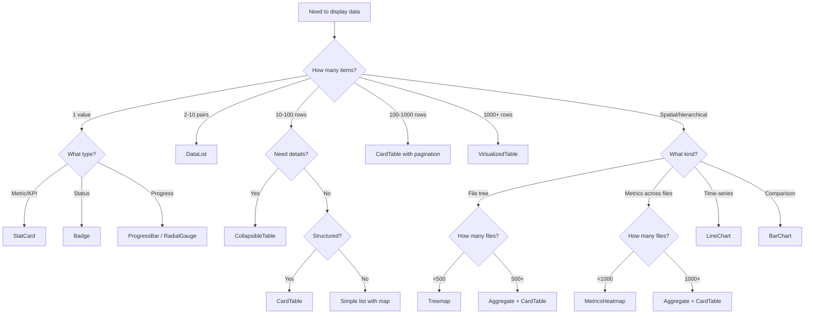
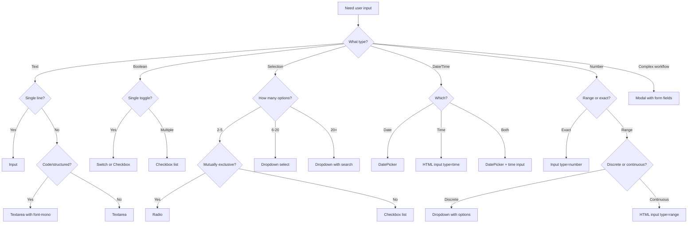
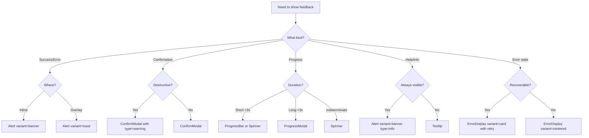

# Component Selection Guide

## Overview

This guide helps you choose the right `@vipr/ui` component for common UI patterns in the Electron app. Use the decision trees and quick reference tables to select components that match your use case without over-engineering.

**Guiding Principles:**

1. **Table-first** - For <100 items, tables beat complex visualizations
2. **Existing before custom** - Use @vipr/ui components before building new ones
3. **Simple before complex** - Start with Tier 1/2 components, use Tier 3 sparingly
4. **Proven patterns** - Reference Phase 12 (settings) and InsightCard (progressive disclosure)

---

## Component Taxonomy

### Tier 1: Primitives (Use Freely)

**Characteristics:** Minimal state, single responsibility, low cognitive overhead

| Component  | Use Case                   | Example                                              |
| ---------- | -------------------------- | ---------------------------------------------------- |
| Button     | Actions, CTAs              | `<Button appearance="primary">Save</Button>`         |
| Input      | Text entry                 | `<Input type="text" label="Name" />`                 |
| Textarea   | Multi-line text            | `<Textarea className="font-mono text-xs" />`         |
| Select     | Dropdown selection         | `<Select options={items} />`                         |
| Checkbox   | Boolean toggles            | `<Checkbox checked={enabled} label="Enable" />`      |
| Radio      | Mutually exclusive choices | `<Radio options={choices} />`                        |
| Switch     | Feature toggles            | `<Switch checked={enabled} onChange={setEnabled} />` |
| Badge      | Status indicators          | `<Badge variant="success">Active</Badge>`            |
| Tooltip    | Contextual help            | `<Tooltip content="Help text">?</Tooltip>`           |
| Breadcrumb | Navigation context         | `<Breadcrumb items={path} />`                        |
| Pagination | Page navigation            | `<Pagination page={1} total={10} />`                 |

**When to use:** Always prefer Tier 1 for basic interactions

---

### Tier 2: Moderate Complexity (Primary Workhorses)

**Characteristics:** Managed state, composed patterns, 100-300 LOC

| Component            | Use Case               | Capacity              | Example                       |
| -------------------- | ---------------------- | --------------------- | ----------------------------- |
| **StatCard**         | Metrics display        | Single value + trend  | Dashboard KPIs                |
| **Alert**            | Notifications          | Banners, toasts       | Error messages, confirmations |
| **ErrorDisplay**     | Error states           | Centered or card      | API failures, validation      |
| **Modal**            | Dialogs                | Forms, confirmations  | IDE picker, settings          |
| **ConfirmModal**     | User confirmation      | Yes/No decisions      | Delete actions                |
| **ProgressModal**    | Loading states         | Long operations       | Analysis progress             |
| **CardTable**        | Structured data        | <100 rows             | File lists, issue tables      |
| **CollapsibleTable** | Detail-on-demand       | <100 rows             | Expandable rows               |
| **DataList**         | Key-value pairs        | <50 items             | Configuration display         |
| **ActivityFeed**     | Timeline events        | <50 events            | Recent activity               |
| **Dropdown**         | Complex selects        | Filters, sorts, menus | Metric selector               |
| **Tabs**             | Content organization   | 2-10 tabs             | View switching                |
| **Accordion**        | Progressive disclosure | Unlimited sections    | Grouped content               |

**When to use:** Most UI patterns - these are the workhorses

---

### Tier 3: High Complexity (Use Sparingly)

**Characteristics:** Performance-optimized, 400+ LOC, significant cognitive overhead

| Component            | Use Case              | Capacity       | When to Use                                         | When NOT to Use              |
| -------------------- | --------------------- | -------------- | --------------------------------------------------- | ---------------------------- |
| **InsightCard**      | Issues/anti-patterns  | Single insight | Insight display with 5-level progressive disclosure | Metrics without details      |
| **Heatmap**          | File metrics          | 100-2500 files | Codebase-wide patterns                              | <100 files (use table)       |
| **RadialGauge**      | Hero metrics          | Single value   | Dashboard centerpiece (1-3 per view)                | Lists, repeated elements     |
| **Treemap**          | Hierarchical data     | <500 nodes     | Directory structure                                 | Flat data (use table)        |
| **VirtualizedTable** | Large datasets        | 1000+ rows     | Performance-critical lists                          | <100 rows (use CardTable)    |
| **Charts**           | Trends, distributions | Varies         | Time-series, comparisons                            | Single values (use StatCard) |

**When to use:** Only when simpler components are insufficient

---

## Decision Trees

### Data Display: Which Component?



### User Input: Which Component?



### Feedback/Notifications: Which Component?



---

## Quick Reference Tables

### Settings & Preferences

**Pattern**: Phase 12 (MCP Server) - SettingCard composition

| Feature            | Components                        | Example                     |
| ------------------ | --------------------------------- | --------------------------- |
| Enable/disable     | SettingCard + Switch              | Tray, Shortcuts, MCP        |
| Dropdown selection | SettingCard + Dropdown            | IDE picker, Intervals       |
| Numeric input      | SettingCard + Input (type=number) | Port, Delay                 |
| Boolean list       | SettingCard + Checkbox list       | Notifications, Git triggers |
| Time selection     | SettingCard + Input (type=time)   | Scheduled time              |

**Reference Implementation:** `/round-two/12-embedded-mcp-server.md`

---

### Progressive Disclosure

**Pattern**: InsightCard - 5-level expansion with persistence

| Feature              | Components       | Example                        |
| -------------------- | ---------------- | ------------------------------ |
| Issues/Anti-patterns | InsightCard      | Prop drilling, High complexity |
| Insights             | InsightCard      | Hotspots, Churn analysis       |
| Expandable rows      | CollapsibleTable | File details                   |
| Grouped content      | Accordion        | FAQ, Settings sections         |
| Multi-tab content    | Tabs             | File Changes / Git Context     |

**Reference Implementation:** `packages/ui/src/components/common/InsightCard.tsx`

---

### Tables & Lists

| Data Size        | Component        | Sorting | Virtualization | Best For              |
| ---------------- | ---------------- | ------- | -------------- | --------------------- |
| 1-10             | DataList         | No      | No             | Key-value pairs       |
| 10-100           | CardTable        | Yes     | No             | Rich file/issue lists |
| 10-100 (details) | CollapsibleTable | Yes     | No             | Expandable content    |
| 100-1000         | CardTable        | Yes     | Pagination     | Medium datasets       |
| 1000+            | VirtualizedTable | Yes     | Built-in       | Large datasets        |

---

### Modals & Dialogs

| Purpose           | Component               | Size  | Footer Pattern    |
| ----------------- | ----------------------- | ----- | ----------------- |
| Form input        | Modal                   | md/lg | Cancel + Submit   |
| Confirmation      | ConfirmModal            | sm    | Cancel + Confirm  |
| IDE picker        | Modal + Radio           | md    | Cancel + Open     |
| Wizard            | Modal + WizardContainer | lg/xl | Back + Next       |
| Progress          | ProgressModal           | md    | Cancel (optional) |
| Prompt generation | Modal + Textarea        | xl    | Close + Copy      |

---

### Visualizations

| Data Type           | Count | Component                    | Alternative          |
| ------------------- | ----- | ---------------------------- | -------------------- |
| Single metric       | 1     | StatCard or RadialGauge      | Badge                |
| Metric trend        | 1     | StatCard with LineChart slot | LineChart            |
| Time-series         | Many  | LineChart                    | CardTable with dates |
| Comparison          | 2-10  | BarChart or MetricBarChart   | CardTable            |
| Distribution        | Many  | BarChart                     | CardTable (sorted)   |
| File metrics        | <1000 | MetricsHeatmap               | CardTable            |
| File metrics        | 1000+ | Aggregate + CardTable        | VirtualizedTable     |
| Directory structure | <500  | Treemap                      | Accordion            |
| Dependencies        | Any   | CardTable (recommended)      | Graph (future)       |

---

## Common Patterns

### Dashboard Layout

```tsx
<div className="grid grid-cols-12 gap-6">
  {/* Stats row - full width */}
  <div className="col-span-full">
    <StatsRow>
      <StatCard variant="compact" title="Files" value={1234} />
      <StatCard variant="compact" title="Issues" value={42} />
      <StatCard variant="compact" title="Health" value={85} />
    </StatsRow>
  </div>

  {/* Main content - 8 columns */}
  <div className="col-span-12 lg:col-span-8 space-y-6">
    <MetricsHeatmap files={files} metrics={['complexity']} />
    <CardTable data={issues} columns={columns} />
  </div>

  {/* Sidebar - 4 columns */}
  <div className="col-span-12 lg:col-span-4 space-y-6">
    <RadialGauge value={health} max={100} label="Health" />
    <ActivityFeed events={recent} />
  </div>
</div>
```

### Settings Panel (Phase 12 Pattern)

```tsx
<div className="space-y-4">
  <SettingCard label="Feature Name" description="What this feature does">
    <Switch checked={enabled} onChange={setEnabled} />
  </SettingCard>

  <SettingCard label="Configuration" description="Additional settings">
    <Dropdown variant="select" options={options} value={selected} onChange={setSelected} />
  </SettingCard>
</div>
```

### Form in Modal

```tsx
<Modal
  open={open}
  onClose={onClose}
  title="Form Title"
  size="md"
  footer={
    <>
      <Button appearance="tertiary" onClick={onClose}>
        Cancel
      </Button>
      <Button appearance="primary" onClick={handleSubmit}>
        Submit
      </Button>
    </>
  }
>
  <div className="space-y-4">
    <Input label="Name" value={name} onChange={setName} />
    <Dropdown variant="select" label="Type" options={types} />
    <Checkbox checked={enabled} label="Enable feature" />
  </div>
</Modal>
```

### Issue/Insight Display

```tsx
{
  /* Use InsightCard for progressive disclosure */
}
<div className="space-y-4">
  {issues.map(issue => (
    <InsightCard
      key={issue.id}
      insight={issue}
      defaultExpanded={false}
      onActionClick={action => handleAction(issue, action)}
    />
  ))}
</div>;

{
  /* Or use CardTable for simple list */
}
<CardTable
  columns={[
    { key: 'file', label: 'File' },
    { key: 'issue', label: 'Issue' },
    { key: 'severity', label: 'Severity' },
  ]}
  data={issues}
/>;
```

---

## Anti-Patterns to Avoid

### ❌ DON'T: Over-engineer

```tsx
// Bad: Custom dropdown for 3 options
<CustomDropdown options={['Option 1', 'Option 2', 'Option 3']} />

// Good: Use Radio for 2-5 mutually exclusive options
<Radio options={[...]} value={selected} onChange={setSelected} />
```

### ❌ DON'T: Use complex visualizations for small datasets

```tsx
// Bad: Heatmap for 20 files
<MetricsHeatmap files={20Files} metrics={['complexity']} />

// Good: CardTable is clearer and faster
<CardTable data={20Files} columns={[...]} />
```

### ❌ DON'T: Use RadialGauge in lists

```tsx
// Bad: Performance overhead
{
  metrics.map(m => <RadialGauge value={m.value} />);
}

// Good: Use Badge or StatCard (compact)
{
  metrics.map(m => <StatCard variant="compact" value={m.value} />);
}
```

### ❌ DON'T: Build custom components when existing ones work

```tsx
// Bad: Custom notification system
<CustomNotificationCenter notifications={list} />

// Good: Use Alert with toast variant
<Alert variant="toast" type="success" open={show}>Success!</Alert>
```

---

## Performance Guidelines

### Component Performance Tiers

| Component              | Typical Render Time | Max Capacity  | Notes                     |
| ---------------------- | ------------------- | ------------- | ------------------------- |
| Button, Input, Badge   | <1ms                | Unlimited     | Negligible cost           |
| StatCard, Alert, Modal | <5ms                | 100+ per view | Low cost                  |
| CardTable              | 1-10ms              | 100 rows      | Acceptable                |
| CollapsibleTable       | 5-20ms              | 100 rows      | Moderate (expansion cost) |
| VirtualizedTable       | 10-50ms initial     | 10,000+ rows  | Uses virtualization       |
| MetricsHeatmap         | 50-200ms            | 2500 cells    | Canvas rendering          |
| Treemap                | 100-500ms           | 500 nodes     | D3 layout computation     |
| RadialGauge            | 20-50ms             | 3-5 per view  | SVG animation             |
| InsightCard            | 5-10ms              | 50+ per view  | React state management    |

### When to Aggregate Data

- **<100 items:** Render directly
- **100-1000 items:** Use virtualization (VirtualizedTable) or pagination
- **1000+ items:** Aggregate in main process, send summary to renderer

### When to Use Canvas vs. DOM

- **DOM (React components):** <100 elements, need interactivity
- **Canvas (Heatmap, Treemap):** 100+ elements, read-only visualization
- **SVG (RadialGauge, Charts):** Animations, precise rendering

---

## Choosing Between Similar Components

### StatCard vs. Badge

| Use Case                 | Choose                             |
| ------------------------ | ---------------------------------- |
| Single metric with label | StatCard (compact)                 |
| Status indicator         | Badge                              |
| Value in table cell      | Badge for status, number for value |
| Dashboard KPI            | StatCard (default) with chart slot |

### Modal vs. Alert

| Use Case              | Choose                         |
| --------------------- | ------------------------------ |
| Form input            | Modal                          |
| Confirmation          | ConfirmModal or Alert (banner) |
| Success/error message | Alert (toast or banner)        |
| Multi-step process    | Modal with WizardContainer     |

### CardTable vs. CollapsibleTable

| Use Case                 | Choose           |
| ------------------------ | ---------------- |
| Simple data display      | CardTable        |
| Row-level details        | CollapsibleTable |
| Nested/hierarchical data | CollapsibleTable |
| >100 rows                | VirtualizedTable |

### Tabs vs. Accordion

| Use Case                  | Choose    |
| ------------------------- | --------- |
| Mutually exclusive views  | Tabs      |
| Multiple sections visible | Accordion |
| 2-5 sections              | Tabs      |
| 6+ sections               | Accordion |
| Grouped settings          | Accordion |

---

## Conclusion

**Key Takeaways:**

1. **Start simple** - Use Tier 1/2 components before Tier 3
2. **Table-first** - Tables work for most data <100 items
3. **Reference patterns** - Phase 12 (settings), InsightCard (disclosure)
4. **Aggregate data** - Handle scale in backend, not UI
5. **Avoid custom** - @vipr/ui has most patterns covered

**When in doubt:**

- Settings → Phase 12 SettingCard pattern
- Progressive disclosure → InsightCard
- Data display → Decision tree above
- Performance issue → Check capacity limits, aggregate data
