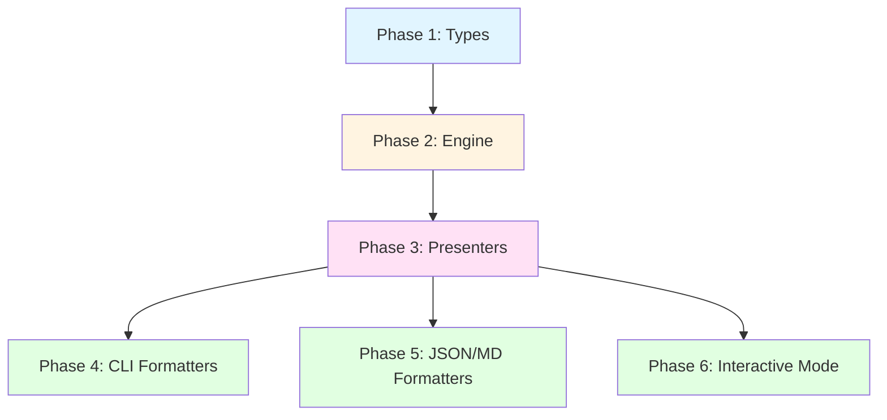

# Phase 0: Multi-File Analysis Feature Overview

## Problem Statement

Currently, Vipr analyzes single files and provides detailed reports on individual code files. However, users often need to understand the overall health and quality of an entire codebase, directory, or module. This requires:

1. Analyzing multiple files in a directory tree
2. Aggregating results across files
3. Providing summary statistics and insights
4. Identifying patterns and trends across the codebase
5. Highlighting the worst offenders and areas needing attention

Without multi-file analysis, users must manually review individual file reports, making it difficult to:

- Get a bird's-eye view of project health
- Prioritize refactoring efforts
- Track quality metrics across modules
- Generate documentation for stakeholders

## Feature Goals

### Primary Goals

1. **Directory Analysis**: Analyze all eligible files in a directory and its subdirectories
2. **Aggregated Reporting**: Combine results into meaningful summaries
3. **Multiple Report Types**: Provide different views of the aggregated data
4. **Progressive Disclosure**: Show summaries by default, detailed views on demand
5. **Multi-Technology Support**: Work seamlessly with React, TypeScript, Next.js, etc.

### Secondary Goals

1. **Performance**: Handle large codebases efficiently with progress indicators
2. **Filtering**: Allow users to filter by score thresholds, severity, technology
3. **Pagination**: Support viewing large result sets in manageable chunks
4. **Format Support**: Work with all existing output formats (CLI, JSON, Markdown, Interactive)

## Architecture Overview

### Key Design Decisions

| Decision                             | Rationale                                                                                                            |
| ------------------------------------ | -------------------------------------------------------------------------------------------------------------------- |
| **New `BatchAnalysisResult` type**   | First-class aggregate with computed stats, not just `AggregatedResult[]`. Provides semantic clarity and type safety. |
| **Batch presenters in `@vipr/core`** | Follows existing plugin pattern, auto-discovered via registry. Maintains consistency with architecture.              |
| **Extended formatters**              | Detect batch vs single, render appropriately. Reuses existing formatter infrastructure.                              |
| **Progressive disclosure**           | Summary by default, drill-down on demand. Balances overview with detail.                                             |
| **Technology-agnostic aggregation**  | Engine doesn't know about report types. Presenters handle technology-specific formatting.                            |

### Report Types

The feature introduces four new batch report types:

1. **Project Summary** (`project-summary`)
   - Overall health score (weighted average)
   - Technology breakdown (file counts, average scores)
   - Total issue counts by severity
   - File distribution by score ranges

2. **Issues Report** (`batch-issues`)
   - Issues grouped by category
   - File counts per issue type
   - Severity distribution
   - Top files with most issues

3. **Complexity Report** (`batch-complexity`)
   - Distribution histograms (cyclomatic, cognitive)
   - Percentile statistics (50th, 75th, 90th, 95th)
   - Most complex files by metric
   - Technology-specific complexity patterns

4. **Worst Files** (`worst-files`)
   - Bottom-N files by overall score
   - Files with critical issues
   - Files with highest complexity
   - Recommended refactoring priorities

### Phase Dependency Graph



## Implementation Phases

### Phase 1: Types and Data Structures

**File**: `01-types-and-data-structures.md`

**Deliverables**:

- `BatchAnalysisResult` interface
- `TechnologyBreakdown` type
- `IssueStatistics` type
- `ComplexityDistribution` type
- Type guards (`isBatchResult()`)
- Migration path for existing types

**Key Decisions**:

- Batch results are a distinct type, not a wrapper around `AggregatedResult[]`
- Statistics are pre-computed in the result (not calculated on-demand)
- Type guards enable formatters to detect batch vs single results

### Phase 2: Engine Aggregation

**File**: `02-engine-aggregation.md`

**Deliverables**:

- Enhanced `analyzeDirectory()` in `AnalysisEngine`
- `ProgressCallback` interface
- File traversal logic with filtering
- Aggregation algorithm
- Caching strategy for batch results

**Key Decisions**:

- Engine emits progress events for UI updates
- Parallel analysis where possible (respecting resource limits)
- Incremental aggregation to support large directories
- Results cached by directory path + options hash

### Phase 3: Core Presenters

**File**: `03-core-presenters.md`

**Deliverables**:

- `ProjectSummaryPresenter` (full implementation)
- `BatchIssuesPresenter` (full implementation)
- `BatchComplexityPresenter` (full implementation)
- `WorstFilesPresenter` (full implementation)
- Presenter metadata registration
- Integration with `PresenterRegistry`

**Key Decisions**:

- Presenters live in `analyzers/core/src/presenters/`
- Auto-discovered via plugin's `getReportPresenters()`
- Metadata includes `categories: ['batch']` for filtering
- Reuse existing component presenters where possible

### Phase 4: CLI Formatters

**File**: `04-cli-formatters.md`

**Deliverables**:

- Batch detection in `CliFormatter`
- Progress indicator implementation
- Summary rendering with tables
- New CLI options (`--limit`, `--page`, `--below-threshold`, `--show-all`)
- Help text updates

**Key Decisions**:

- Auto-detect batch vs single based on result type
- Show progress during analysis (spinner with file count)
- Default to summary views, full details on `--show-all`
- Pagination for large result sets

### Phase 5: JSON/Markdown Formatters

**File**: `05-json-markdown-formatters.md`

**Deliverables**:

- `BatchJsonOutput` schema
- JSON serialization for batch results
- Markdown template for batch reports
- Examples of both formats

**Key Decisions**:

- JSON includes metadata for parsing/filtering
- Markdown uses sections with collapsible details
- Both formats support partial rendering (summaries only)

### Phase 6: Interactive Mode

**File**: `06-interactive-mode.md`

**Deliverables**:

- Batch navigation flow in `analyze-flow.ts`
- Drill-down from summary to file details
- Filtering by score, severity, technology
- State machine for navigation
- Keyboard shortcuts

**Key Decisions**:

- Summary screen is entry point
- Each report type has dedicated view
- Drill-down opens single-file interactive mode
- Back navigation returns to summary

## File Structure

### New Files

```
packages/common/src/types/output/
├── batch.ts                          # BatchAnalysisResult and related types

analyzers/core/src/presenters/
├── project-summary-presenter.ts      # Project summary report
├── batch-issues-presenter.ts         # Aggregated issues report
├── batch-complexity-presenter.ts     # Complexity distribution report
└── worst-files-presenter.ts          # Worst files report
```

### Modified Files

```
packages/engine/src/
└── analysis-engine.ts                # Enhanced analyzeDirectory()

analyzers/core/src/presenters/
└── index.ts                          # Register batch presenters

clients/cli/src/
├── commands/analyze-command.ts       # Batch options
├── formatters/cli-formatter.ts       # Batch rendering
├── formatters/json-formatter.ts      # Batch JSON
├── formatters/markdown-formatter.ts  # Batch markdown
└── interactive/flows/analyze-flow.ts # Batch navigation
```

## CLI Usage Examples

### Basic Directory Analysis

```bash
# Analyze entire directory
vipr analyze src/

# Analyze with specific format
vipr analyze src/ --format json -o results.json
vipr analyze src/ --format markdown -o report.md
```

### Filtering and Pagination

```bash
# Show only files below threshold
vipr analyze src/ --below-threshold 50

# Show all files (not just summaries)
vipr analyze src/ --show-all

# Paginate results
vipr analyze src/ --limit 20 --page 2

# Filter by minimum severity
vipr analyze src/ --min-severity critical
```

### Interactive Mode

```bash
# Launch interactive mode for directory
vipr analyze src/ -i

# Navigation flow:
# 1. Project Summary screen
# 2. Select report type (issues, complexity, worst files)
# 3. View detailed report
# 4. Drill down to specific file
# 5. Back to summary
```

## Success Criteria

### Functional Requirements

- [ ] Analyze all eligible files in a directory tree
- [ ] Generate four batch report types
- [ ] Support all output formats (CLI, JSON, Markdown, Interactive)
- [ ] Provide filtering and pagination options
- [ ] Show progress during analysis
- [ ] Handle large codebases (1000+ files)

### Non-Functional Requirements

- [ ] Analysis completes in reasonable time (< 5 min for 1000 files)
- [ ] Memory usage scales linearly with file count
- [ ] No breaking changes to existing API
- [ ] Full test coverage for new components
- [ ] Documentation for all new features

### User Experience

- [ ] Clear, actionable summaries
- [ ] Easy navigation in interactive mode
- [ ] Helpful error messages for edge cases
- [ ] Consistent formatting across report types

## Testing Strategy

### Unit Tests

- Type guards and utilities
- Aggregation algorithms
- Presenter formatting logic
- Filter and pagination helpers

### Integration Tests

- End-to-end directory analysis
- Batch result generation
- Formatter output validation
- Interactive mode flows

### Performance Tests

- Large directory analysis (1000+ files)
- Memory usage profiling
- Parallel analysis efficiency

## Migration Path

### Backward Compatibility

- Existing single-file analysis unchanged
- All current CLI options still work
- Formatters detect result type automatically
- No API breaking changes

### Deprecation Strategy

None required - this is purely additive.

## Future Enhancements

### Post-MVP Features

1. **Trend Analysis**: Compare batch results over time
2. **Custom Thresholds**: Per-project quality gates
3. **Export Formats**: PDF, HTML reports
4. **CI Integration**: GitHub Actions, GitLab CI integration
5. **Watch Mode**: Re-analyze on file changes
6. **Incremental Analysis**: Only re-analyze changed files

### Potential Optimizations

1. **Worker Threads**: Parallelize analysis across CPU cores
2. **Streaming Results**: Start rendering before all files analyzed
3. **Smart Caching**: Invalidate only affected files
4. **Compression**: Compress cached results to save space

## Related Documentation

- `plugin-architecture.md` - Overall architecture
- `presenter-registry.md` - Presenter system
- `analysis-engine.md` - Engine internals
- `cli-guide.md` - CLI usage

## Next Steps

1. Review this overview document
2. Proceed to Phase 1: Types and Data Structures
3. Implement and test each phase sequentially
4. Update main documentation after completion
