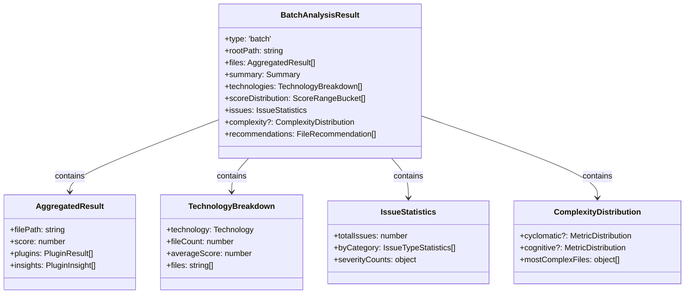

# Phase 1: Types and Data Structures

## Overview

This phase defines the type system for batch analysis results. We extend the existing `BatchStatistics` and output types with presenter-specific types that enable rich aggregated reporting.

## Existing Types (Context)

The codebase already has batch output types in `packages/common/src/types/output/`:

```typescript
// From compact.ts
interface BatchStatistics {
  totalFiles: number;
  analyzedFiles: number;
  skippedFiles: number;
  averageScore: number;
  totalInsights: InsightSummary;
  executionTimeMs: number;
}

// From full.ts
interface FullBatchStatistics extends BatchStatistics {
  insightsByCategory: Record<string, number>;
  pluginAverages: Record<string, number>;
  worstFiles: ReadonlyArray<{ filePath: string; score: number }>;
}
```

These types represent **serialization formats** (JSON output). The new types represent **presenter input** (aggregated analysis results).

## Design Principles

1. **Separation of Concerns**: Serialization types vs presenter input types
2. **Pre-computed Statistics**: Avoid on-demand calculation in presenters
3. **Type Safety**: Distinct types for batch vs single-file results
4. **Technology-Agnostic**: Core types don't know about specific analyzers
5. **Extensible**: Easy to add new aggregation dimensions

## New Types

### File Location

**Path**: `packages/common/src/types/output/batch.ts`

```typescript
/**
 * Batch analysis result types for multi-file analysis.
 *
 * These types represent aggregated analysis results used by batch presenters.
 * They are distinct from serialization formats (DefaultBatchOutput, FullBatchOutput).
 *
 * @module @vipr/types/output/batch
 */

import type { PluginResult, PluginInsight } from '../plugin';
import type { AggregatedResult } from '../plugin/formatter';

/**
 * Technology detected in the analyzed codebase.
 */
export type Technology = 'react' | 'typescript' | 'javascript' | 'nextjs' | 'unknown';

/**
 * Breakdown of files by detected technology.
 */
export interface TechnologyBreakdown {
  /** Technology identifier */
  readonly technology: Technology;
  /** Number of files using this technology */
  readonly fileCount: number;
  /** Average score for files using this technology */
  readonly averageScore: number;
  /** Minimum score in this technology */
  readonly minScore: number;
  /** Maximum score in this technology */
  readonly maxScore: number;
  /** File paths in this technology */
  readonly files: ReadonlyArray<string>;
}

/**
 * Score range bucket for distribution analysis.
 */
export interface ScoreRangeBucket {
  /** Range label (e.g., "0-20", "80-100") */
  readonly label: string;
  /** Minimum score (inclusive) */
  readonly min: number;
  /** Maximum score (inclusive) */
  readonly max: number;
  /** Number of files in this range */
  readonly count: number;
  /** Percentage of total files */
  readonly percentage: number;
  /** File paths in this bucket */
  readonly files: ReadonlyArray<string>;
}

/**
 * Aggregated statistics for a specific issue type.
 */
export interface IssueTypeStatistics {
  /** Issue category (e.g., "accessibility", "performance") */
  readonly category: string;
  /** Total occurrences of this issue type */
  readonly count: number;
  /** Number of files affected */
  readonly fileCount: number;
  /** Severity distribution */
  readonly severityCounts: {
    readonly critical: number;
    readonly warning: number;
    readonly info: number;
  };
  /** Files with this issue type (sorted by count descending) */
  readonly affectedFiles: ReadonlyArray<{
    readonly filePath: string;
    readonly count: number;
  }>;
}

/**
 * Aggregated issue statistics across all files.
 */
export interface IssueStatistics {
  /** Total number of insights */
  readonly totalIssues: number;
  /** Issues grouped by category */
  readonly byCategory: ReadonlyArray<IssueTypeStatistics>;
  /** Overall severity distribution */
  readonly severityCounts: {
    readonly critical: number;
    readonly warning: number;
    readonly info: number;
  };
  /** Files with the most issues */
  readonly mostAffectedFiles: ReadonlyArray<{
    readonly filePath: string;
    readonly issueCount: number;
    readonly criticalCount: number;
  }>;
}

/**
 * Distribution statistics for a numeric metric.
 */
export interface MetricDistribution {
  /** Metric name (e.g., "Cyclomatic Complexity") */
  readonly metricName: string;
  /** Minimum value observed */
  readonly min: number;
  /** Maximum value observed */
  readonly max: number;
  /** Average (mean) value */
  readonly mean: number;
  /** Median value (50th percentile) */
  readonly median: number;
  /** 75th percentile */
  readonly p75: number;
  /** 90th percentile */
  readonly p90: number;
  /** 95th percentile */
  readonly p95: number;
  /** Standard deviation */
  readonly stdDev: number;
  /** Histogram buckets for visualization */
  readonly histogram: ReadonlyArray<{
    readonly range: string;
    readonly count: number;
  }>;
}

/**
 * Complexity analysis across all files.
 */
export interface ComplexityDistribution {
  /** Cyclomatic complexity distribution */
  readonly cyclomatic?: MetricDistribution;
  /** Cognitive complexity distribution */
  readonly cognitive?: MetricDistribution;
  /** Halstead volume distribution */
  readonly halsteadVolume?: MetricDistribution;
  /** Maintainability index distribution */
  readonly maintainability?: MetricDistribution;
  /** Files with highest complexity (any metric) */
  readonly mostComplexFiles: ReadonlyArray<{
    readonly filePath: string;
    readonly score: number;
    readonly primaryComplexity: {
      readonly metric: string;
      readonly value: number;
    };
  }>;
}

/**
 * File recommendation for refactoring.
 */
export interface FileRecommendation {
  /** File path */
  readonly filePath: string;
  /** Overall score */
  readonly score: number;
  /** Number of critical issues */
  readonly criticalIssues: number;
  /** Number of total issues */
  readonly totalIssues: number;
  /** Primary reason for recommendation */
  readonly primaryReason: string;
  /** Secondary reasons (if any) */
  readonly secondaryReasons: ReadonlyArray<string>;
  /** Estimated effort (low, medium, high) */
  readonly estimatedEffort: 'low' | 'medium' | 'high';
}

/**
 * Result of batch (multi-file) analysis.
 * This is the input type for batch presenters.
 */
export interface BatchAnalysisResult {
  /** Type discriminator */
  readonly type: 'batch';
  /** Timestamp of analysis */
  readonly analyzedAt: string;
  /** Root directory analyzed */
  readonly rootPath: string;
  /** Individual file results */
  readonly files: ReadonlyArray<AggregatedResult>;
  /** Overall statistics */
  readonly summary: {
    /** Total files discovered */
    readonly totalFiles: number;
    /** Files successfully analyzed */
    readonly analyzedFiles: number;
    /** Files skipped (ineligible or errors) */
    readonly skippedFiles: number;
    /** Weighted average score */
    readonly averageScore: number;
    /** Minimum score observed */
    readonly minScore: number;
    /** Maximum score observed */
    readonly maxScore: number;
    /** Total execution time (ms) */
    readonly executionTimeMs: number;
  };
  /** Technology breakdown */
  readonly technologies: ReadonlyArray<TechnologyBreakdown>;
  /** Score distribution */
  readonly scoreDistribution: ReadonlyArray<ScoreRangeBucket>;
  /** Aggregated issue statistics */
  readonly issues: IssueStatistics;
  /** Complexity distribution */
  readonly complexity?: ComplexityDistribution;
  /** Files recommended for refactoring */
  readonly recommendations: ReadonlyArray<FileRecommendation>;
}

/**
 * Type guard to check if result is a batch result.
 */
export function isBatchResult(
  result: AggregatedResult | BatchAnalysisResult
): result is BatchAnalysisResult {
  return 'type' in result && result.type === 'batch';
}

/**
 * Type guard to check if result is a single-file result.
 */
export function isSingleResult(
  result: AggregatedResult | BatchAnalysisResult
): result is AggregatedResult {
  return !isBatchResult(result);
}
```

## Type Relationships



## Technology Detection

Technology is inferred from plugin results:

```typescript
/**
 * Infer technology from plugin results.
 *
 * @param result - Aggregated result for a file
 * @returns Detected technology
 */
export function detectTechnology(result: AggregatedResult): Technology {
  const pluginIds = result.plugins.map(p => p.pluginId);

  if (pluginIds.includes('nextjs')) return 'nextjs';
  if (pluginIds.includes('react')) return 'react';
  if (pluginIds.includes('typescript')) return 'typescript';
  if (pluginIds.includes('javascript')) return 'javascript';

  return 'unknown';
}
```

## Score Distribution Buckets

Default score ranges for distribution:

```typescript
/**
 * Default score range buckets.
 */
export const DEFAULT_SCORE_BUCKETS: ReadonlyArray<{ min: number; max: number; label: string }> = [
  { min: 0, max: 20, label: '0-20 (Critical)' },
  { min: 21, max: 40, label: '21-40 (Poor)' },
  { min: 41, max: 60, label: '41-60 (Fair)' },
  { min: 61, max: 80, label: '61-80 (Good)' },
  { min: 81, max: 100, label: '81-100 (Excellent)' },
];

/**
 * Create score distribution from file results.
 *
 * @param files - File results
 * @returns Score distribution buckets
 */
export function createScoreDistribution(
  files: ReadonlyArray<AggregatedResult>
): ReadonlyArray<ScoreRangeBucket> {
  return DEFAULT_SCORE_BUCKETS.map(({ min, max, label }) => {
    const bucketFiles = files.filter(f => f.score >= min && f.score <= max);
    return {
      label,
      min,
      max,
      count: bucketFiles.length,
      percentage: (bucketFiles.length / files.length) * 100,
      files: bucketFiles.map(f => f.filePath),
    };
  });
}
```

## Statistics Calculation

Helper functions for computing aggregated statistics:

```typescript
/**
 * Calculate basic summary statistics.
 *
 * @param files - File results
 * @returns Summary statistics
 */
export function calculateSummary(files: ReadonlyArray<AggregatedResult>) {
  const scores = files.map(f => f.score);
  return {
    totalFiles: files.length,
    analyzedFiles: files.length,
    skippedFiles: 0, // Updated by engine
    averageScore: scores.reduce((sum, s) => sum + s, 0) / scores.length,
    minScore: Math.min(...scores),
    maxScore: Math.max(...scores),
    executionTimeMs: 0, // Updated by engine
  };
}

/**
 * Calculate percentile for a sorted array.
 *
 * @param sortedValues - Sorted numeric array
 * @param percentile - Percentile (0-100)
 * @returns Percentile value
 */
export function calculatePercentile(sortedValues: number[], percentile: number): number {
  const index = (percentile / 100) * (sortedValues.length - 1);
  const lower = Math.floor(index);
  const upper = Math.ceil(index);
  const weight = index - lower;

  if (lower === upper) return sortedValues[lower];
  return sortedValues[lower] * (1 - weight) + sortedValues[upper] * weight;
}

/**
 * Calculate metric distribution statistics.
 *
 * @param values - Metric values
 * @param metricName - Name of the metric
 * @returns Distribution statistics
 */
export function calculateDistribution(values: number[], metricName: string): MetricDistribution {
  const sorted = [...values].sort((a, b) => a - b);
  const mean = values.reduce((sum, v) => sum + v, 0) / values.length;
  const variance = values.reduce((sum, v) => sum + (v - mean) ** 2, 0) / values.length;

  return {
    metricName,
    min: Math.min(...values),
    max: Math.max(...values),
    mean,
    median: calculatePercentile(sorted, 50),
    p75: calculatePercentile(sorted, 75),
    p90: calculatePercentile(sorted, 90),
    p95: calculatePercentile(sorted, 95),
    stdDev: Math.sqrt(variance),
    histogram: createHistogram(sorted),
  };
}

/**
 * Create histogram buckets from values.
 *
 * @param sortedValues - Sorted values
 * @returns Histogram buckets
 */
function createHistogram(sortedValues: number[]): Array<{ range: string; count: number }> {
  // Simple implementation: 10 equal-width buckets
  const min = sortedValues[0];
  const max = sortedValues[sortedValues.length - 1];
  const bucketWidth = (max - min) / 10;

  const buckets = Array.from({ length: 10 }, (_, i) => ({
    min: min + i * bucketWidth,
    max: min + (i + 1) * bucketWidth,
    count: 0,
  }));

  sortedValues.forEach(value => {
    const bucketIndex = Math.min(Math.floor((value - min) / bucketWidth), 9);
    buckets[bucketIndex].count++;
  });

  return buckets.map(b => ({
    range: `${b.min.toFixed(1)}-${b.max.toFixed(1)}`,
    count: b.count,
  }));
}
```

## Integration with Existing Types

### AggregatedResult (Existing)

From `packages/common/src/types/plugin/formatter.ts`:

```typescript
export interface AggregatedResult {
  filePath: string;
  analyzedAt: string;
  score: number;
  plugins: PluginResult[];
  insights: PluginInsight[];
  errors: Array<{ pluginId: string; error: Error }>;
}
```

This remains the type for single-file results. `BatchAnalysisResult` contains an array of these.

### Formatter Input Types

Formatters receive either single or batch results:

```typescript
// In packages/common/src/types/plugin/formatter.ts (to be added)
export type FormatterInput = AggregatedResult | BatchAnalysisResult;
```

## Export Structure

Update `packages/common/src/types/output/index.ts`:

```typescript
// Existing exports
export * from './envelope';
export * from './compact';
export * from './full';

// New batch types
export * from './batch';
export {
  isBatchResult,
  isSingleResult,
  detectTechnology,
  createScoreDistribution,
  calculateSummary,
  calculatePercentile,
  calculateDistribution,
} from './batch';
```

## Testing Strategy

### Unit Tests

Create `packages/common/src/types/output/batch.test.ts`:

```typescript
import { describe, it, expect } from 'vitest';
import {
  isBatchResult,
  isSingleResult,
  detectTechnology,
  createScoreDistribution,
  calculatePercentile,
  calculateDistribution,
} from './batch';

describe('Type Guards', () => {
  it('should identify batch results', () => {
    const batch = { type: 'batch', files: [] /* ... */ };
    expect(isBatchResult(batch)).toBe(true);
  });

  it('should identify single results', () => {
    const single = { filePath: 'test.ts', score: 80 /* ... */ };
    expect(isSingleResult(single)).toBe(true);
  });
});

describe('Technology Detection', () => {
  it('should detect React', () => {
    const result = {
      filePath: 'Component.tsx',
      plugins: [{ pluginId: 'react' /* ... */ }],
      /* ... */
    };
    expect(detectTechnology(result)).toBe('react');
  });

  it('should prioritize Next.js over React', () => {
    const result = {
      filePath: 'page.tsx',
      plugins: [{ pluginId: 'react' /* ... */ }, { pluginId: 'nextjs' /* ... */ }],
      /* ... */
    };
    expect(detectTechnology(result)).toBe('nextjs');
  });
});

describe('Statistics Calculation', () => {
  it('should calculate percentiles correctly', () => {
    const values = [1, 2, 3, 4, 5, 6, 7, 8, 9, 10];
    expect(calculatePercentile(values, 50)).toBe(5.5);
    expect(calculatePercentile(values, 90)).toBe(9.1);
  });

  it('should create score distribution', () => {
    const files = [{ score: 15 }, { score: 45 }, { score: 85 }, { score: 90 }] as any[];

    const distribution = createScoreDistribution(files);
    expect(distribution).toHaveLength(5);
    expect(distribution[0].count).toBe(1); // 0-20
    expect(distribution[2].count).toBe(1); // 41-60
    expect(distribution[4].count).toBe(2); // 81-100
  });

  it('should calculate metric distribution', () => {
    const values = [5, 10, 15, 20, 25, 30, 35, 40];
    const dist = calculateDistribution(values, 'Cyclomatic');

    expect(dist.min).toBe(5);
    expect(dist.max).toBe(40);
    expect(dist.mean).toBe(22.5);
    expect(dist.median).toBeCloseTo(22.5);
    expect(dist.histogram).toHaveLength(10);
  });
});
```

## Migration Considerations

### No Breaking Changes

- Existing `AggregatedResult` type unchanged
- Existing formatters continue to work with single files
- Batch types are purely additive

### Formatter Updates

Formatters will detect result type and branch:

```typescript
export class SomeFormatter {
  format(input: FormatterInput): string {
    if (isBatchResult(input)) {
      return this.formatBatch(input);
    }
    return this.formatSingle(input);
  }

  private formatBatch(result: BatchAnalysisResult): string {
    // Batch formatting logic
  }

  private formatSingle(result: AggregatedResult): string {
    // Existing single-file logic
  }
}
```

## Next Steps

1. **Implement the types** in `packages/common/src/types/output/batch.ts`
2. **Write unit tests** to validate type guards and statistics calculations
3. **Update exports** in `packages/common/src/types/output/index.ts`
4. **Proceed to Phase 2**: Engine aggregation logic

## Success Criteria

- [ ] All types defined with full JSDoc comments
- [ ] Type guards work correctly
- [ ] Statistics helpers tested with edge cases
- [ ] No breaking changes to existing types
- [ ] Full TypeScript type safety (no `any` types)
- [ ] Exports properly configured

## Files Created

- `packages/common/src/types/output/batch.ts` - Type definitions and helpers
- `packages/common/src/types/output/batch.test.ts` - Unit tests

## Files Modified

- `packages/common/src/types/output/index.ts` - Export updates
- `packages/common/src/types/plugin/formatter.ts` - Add `FormatterInput` type
