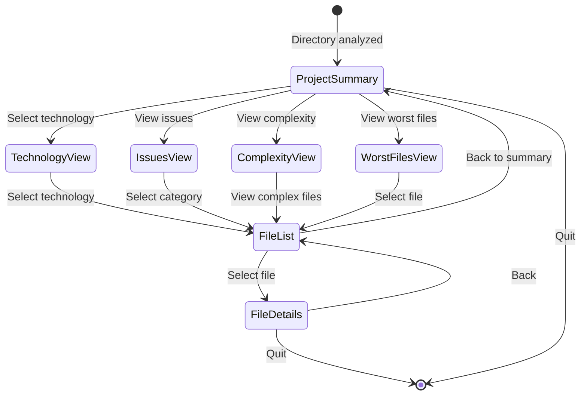

# Phase 6: Interactive Mode

## Overview

This phase adds batch analysis navigation to the interactive CLI mode, enabling users to explore project summaries, drill down into specific reports, and navigate to individual file details.

## Design Goals

1. **Hierarchical Navigation**: Project summary → Report type → File details
2. **Progressive Disclosure**: Start with overview, drill down as needed
3. **Filtering**: Filter files by score, severity, technology
4. **Seamless Integration**: Batch mode feels native to interactive CLI
5. **State Management**: Maintain navigation history for back/forward

## Navigation Flow



## Interactive State Types

Add to `clients/cli/src/interactive/types.ts`:

```typescript
/**
 * Interactive mode state for batch analysis.
 */
export interface BatchInteractiveState {
  /** Current view mode */
  mode:
    | 'summary'
    | 'technology'
    | 'issues'
    | 'complexity'
    | 'worst-files'
    | 'file-list'
    | 'file-details';

  /** Batch analysis result */
  batchResult: BatchAnalysisResult;

  /** Currently selected technology (if in technology view) */
  selectedTechnology?: Technology;

  /** Currently selected issue category (if in issues view) */
  selectedCategory?: string;

  /** Currently selected file (if in file details view) */
  selectedFile?: AggregatedResult;

  /** File list being displayed */
  currentFileList?: AggregatedResult[];

  /** Navigation history for back button */
  history: HistoryEntry[];

  /** Filters applied */
  filters: {
    minScore?: number;
    maxScore?: number;
    minSeverity?: Severity;
    technology?: Technology;
    hasIssues?: boolean;
  };
}

interface HistoryEntry {
  mode: BatchInteractiveState['mode'];
  selectedTechnology?: Technology;
  selectedCategory?: string;
  timestamp: number;
}
```

## Project Summary Screen

### Implementation

Update `clients/cli/src/interactive/flows/analyze-flow.ts`:

```typescript
/**
 * Main batch analysis flow.
 */
export async function batchAnalysisFlow(
  result: BatchAnalysisResult,
  registry: PresenterRegistry
): Promise<void> {
  const state: BatchInteractiveState = {
    mode: 'summary',
    batchResult: result,
    history: [],
    filters: {},
  };

  while (true) {
    const action = await renderCurrentView(state, registry);

    if (action.type === 'quit') {
      break;
    }

    handleAction(state, action);
  }
}

/**
 * Render the current view based on state.
 */
async function renderCurrentView(
  state: BatchInteractiveState,
  registry: PresenterRegistry
): Promise<ViewAction> {
  switch (state.mode) {
    case 'summary':
      return renderSummaryView(state, registry);
    case 'technology':
      return renderTechnologyView(state, registry);
    case 'issues':
      return renderIssuesView(state, registry);
    case 'complexity':
      return renderComplexityView(state, registry);
    case 'worst-files':
      return renderWorstFilesView(state, registry);
    case 'file-list':
      return renderFileListView(state);
    case 'file-details':
      return renderFileDetailsView(state, registry);
  }
}

/**
 * Render project summary view.
 */
async function renderSummaryView(
  state: BatchInteractiveState,
  registry: PresenterRegistry
): Promise<ViewAction> {
  console.clear();

  // Render project summary using ProjectSummaryPresenter
  const presenter = registry.get('core', 'project-summary');
  if (presenter) {
    const presentation = presenter.present(state.batchResult);
    const renderer = new CliReportRenderer();
    console.log(renderer.render(presentation));
  }

  // Interactive menu
  const choices = [
    { name: '📊 View Technology Breakdown', value: 'technology' },
    { name: '⚠️ View Issues Report', value: 'issues' },
    { name: '📈 View Complexity Analysis', value: 'complexity' },
    { name: '🔥 View Worst Files', value: 'worst-files' },
    { name: '🔍 Filter Files', value: 'filter' },
    { name: '⚙️ Options', value: 'options' },
    { name: '❌ Quit', value: 'quit' },
  ];

  const { action } = await inquirer.prompt([
    {
      type: 'list',
      name: 'action',
      message: 'What would you like to do?',
      choices,
      loop: false,
    },
  ]);

  return { type: action };
}
```

### Summary Screen Example

```
┌────────────────────────────────────────────────────────────┐
│                Project Analysis Summary                    │
│                   127 files analyzed                       │
├────────────────────────────────────────────────────────────┤
│ Overall Health                                    75/100   │
│ ████████████████████████████████████░░░░░░░░░░░░░          │
├────────────────────────────────────────────────────────────┤
│ Total Files: 127              Analyzed: 127                │
│ Avg Score: 75/100             Range: 35-98                 │
│ Time: 5.23s                   Skipped: 0                   │
└────────────────────────────────────────────────────────────┘

Technology Breakdown
━━━━━━━━━━━━━━━━━━━━━━━━━━━━━━━━━━━━━━━━━━━━━━━━━━━━━━━━━━━━
  React                    65 files    Avg: 78/100
  TypeScript               42 files    Avg: 72/100
  JavaScript               20 files    Avg: 68/100

Score Distribution
━━━━━━━━━━━━━━━━━━━━━━━━━━━━━━━━━━━━━━━━━━━━━━━━━━━━━━━━━━━━
  0-20 (Critical)          5 files     3.9%
  21-40 (Poor)             12 files    9.4%
  41-60 (Fair)             28 files    22.0%
  61-80 (Good)             45 files    35.4%
  81-100 (Excellent)       37 files    29.1%

? What would you like to do? (Use arrow keys)
❯ 📊 View Technology Breakdown
  ⚠️ View Issues Report
  📈 View Complexity Analysis
  🔥 View Worst Files
  🔍 Filter Files
  ⚙️ Options
  ❌ Quit
```

## Technology Breakdown View

### Implementation

```typescript
async function renderTechnologyView(
  state: BatchInteractiveState,
  registry: PresenterRegistry
): Promise<ViewAction> {
  console.clear();

  console.log(chalk.bold.cyan('Technology Breakdown\n'));

  const choices = state.batchResult.technologies.map(tech => ({
    name: `${formatTechnology(tech.technology)} - ${tech.fileCount} files (avg: ${Math.round(tech.averageScore)}/100)`,
    value: tech.technology,
  }));

  choices.push(
    { name: chalk.dim('────────────────'), value: 'separator' },
    { name: '← Back to Summary', value: 'back' }
  );

  const { technology } = await inquirer.prompt([
    {
      type: 'list',
      name: 'technology',
      message: 'Select a technology to view files:',
      choices,
      loop: false,
    },
  ]);

  if (technology === 'back') {
    return { type: 'back' };
  }

  return {
    type: 'view-technology',
    technology,
  };
}
```

## File List View

### Implementation

```typescript
async function renderFileListView(state: BatchInteractiveState): Promise<ViewAction> {
  console.clear();

  const files = state.currentFileList ?? [];

  console.log(chalk.bold.cyan(`Files (${files.length} total)\n`));

  // Sort by score (worst first)
  const sorted = [...files].sort((a, b) => a.overallScore - b.overallScore);

  const choices = sorted.slice(0, 50).map(file => {
    const scoreColor = getScoreColor(file.overallScore);
    const criticalCount = file.insights.filter(i => i.severity === 'critical').length;
    const criticalBadge = criticalCount > 0 ? chalk.red(` [${criticalCount} critical]`) : '';

    return {
      name: `${scoreColor(file.overallScore.toString().padStart(3))} ${formatFilePath(file.filePath)}${criticalBadge}`,
      value: file.filePath,
    };
  });

  if (files.length > 50) {
    choices.push({
      name: chalk.dim(`... and ${files.length - 50} more`),
      value: 'more',
    });
  }

  choices.push(
    { name: chalk.dim('────────────────'), value: 'separator' },
    { name: '🔍 Filter Files', value: 'filter' },
    { name: '← Back', value: 'back' }
  );

  const { filePath } = await inquirer.prompt([
    {
      type: 'list',
      name: 'filePath',
      message: 'Select a file to view details:',
      choices,
      loop: false,
      pageSize: 20,
    },
  ]);

  if (filePath === 'back') {
    return { type: 'back' };
  }

  if (filePath === 'filter') {
    return { type: 'filter' };
  }

  return {
    type: 'view-file',
    filePath,
  };
}

function getScoreColor(score: number): (str: string) => string {
  if (score < 40) return chalk.red;
  if (score < 60) return chalk.yellow;
  if (score < 80) return chalk.blue;
  return chalk.green;
}
```

### File List Example

```
Files (28 total)

? Select a file to view details: (Use arrow keys)
❯ 35  src/legacy/old-api.ts [15 critical]
  42  src/utils/old-helpers.ts [3 critical]
  58  src/components/LegacyForm.tsx
  67  src/hooks/useLocalStorage.ts
  72  src/utils/validators.ts
  78  src/components/Button.tsx
  85  src/pages/Dashboard.tsx

  🔍 Filter Files
  ← Back
```

## File Details View

### Implementation

```typescript
async function renderFileDetailsView(
  state: BatchInteractiveState,
  registry: PresenterRegistry
): Promise<ViewAction> {
  console.clear();

  const file = state.selectedFile;
  if (!file) {
    return { type: 'back' };
  }

  // Render single-file analysis using existing interactive flow
  // This reuses the single-file interactive mode
  await renderSingleFileInteractive(file, registry);

  return { type: 'back' };
}

/**
 * Render single file in interactive mode.
 * Reuses existing single-file interactive flow.
 */
async function renderSingleFileInteractive(
  file: AggregatedResult,
  registry: PresenterRegistry
): Promise<void> {
  // Use existing single-file interactive flow
  const singleFileFlow = new AnalyzeFlow(registry);
  await singleFileFlow.run(file);
}
```

## Filtering

### Filter Dialog

```typescript
async function renderFilterDialog(state: BatchInteractiveState): Promise<ViewAction> {
  console.clear();

  console.log(chalk.bold.cyan('Filter Files\n'));

  const answers = await inquirer.prompt([
    {
      type: 'number',
      name: 'minScore',
      message: 'Minimum score (0-100, or leave blank):',
      default: state.filters.minScore,
    },
    {
      type: 'number',
      name: 'maxScore',
      message: 'Maximum score (0-100, or leave blank):',
      default: state.filters.maxScore,
    },
    {
      type: 'list',
      name: 'minSeverity',
      message: 'Minimum severity:',
      choices: [
        { name: 'Any', value: undefined },
        { name: 'Critical', value: 'critical' },
        { name: 'Warning', value: 'warning' },
        { name: 'Info', value: 'info' },
      ],
      default: state.filters.minSeverity,
    },
    {
      type: 'list',
      name: 'technology',
      message: 'Technology:',
      choices: [
        { name: 'All', value: undefined },
        ...state.batchResult.technologies.map(t => ({
          name: formatTechnology(t.technology),
          value: t.technology,
        })),
      ],
      default: state.filters.technology,
    },
    {
      type: 'confirm',
      name: 'hasIssues',
      message: 'Only files with issues?',
      default: state.filters.hasIssues ?? false,
    },
  ]);

  return {
    type: 'apply-filters',
    filters: answers,
  };
}

/**
 * Apply filters to batch result.
 */
function applyFilters(
  result: BatchAnalysisResult,
  filters: BatchInteractiveState['filters']
): AggregatedResult[] {
  let files = result.files;

  if (filters.minScore !== undefined) {
    files = files.filter(f => f.overallScore >= filters.minScore!);
  }

  if (filters.maxScore !== undefined) {
    files = files.filter(f => f.overallScore <= filters.maxScore!);
  }

  if (filters.minSeverity) {
    const severityLevels = { info: 0, warning: 1, critical: 2 };
    const minLevel = severityLevels[filters.minSeverity];
    files = files.filter(f => f.insights.some(i => severityLevels[i.severity] >= minLevel));
  }

  if (filters.technology) {
    files = files.filter(f => detectTechnology(f) === filters.technology);
  }

  if (filters.hasIssues) {
    files = files.filter(f => f.insights.length > 0);
  }

  return files;
}
```

## Action Handling

### Action Types

```typescript
type ViewAction =
  | { type: 'quit' }
  | { type: 'back' }
  | { type: 'technology' }
  | { type: 'issues' }
  | { type: 'complexity' }
  | { type: 'worst-files' }
  | { type: 'filter' }
  | { type: 'options' }
  | { type: 'view-technology'; technology: Technology }
  | { type: 'view-category'; category: string }
  | { type: 'view-file'; filePath: string }
  | { type: 'apply-filters'; filters: BatchInteractiveState['filters'] };
```

### Action Handler

```typescript
function handleAction(state: BatchInteractiveState, action: ViewAction): void {
  // Save history (except for back actions)
  if (action.type !== 'back' && action.type !== 'quit') {
    state.history.push({
      mode: state.mode,
      selectedTechnology: state.selectedTechnology,
      selectedCategory: state.selectedCategory,
      timestamp: Date.now(),
    });
  }

  switch (action.type) {
    case 'quit':
      // Handled by main loop
      break;

    case 'back':
      handleBack(state);
      break;

    case 'technology':
      state.mode = 'technology';
      break;

    case 'issues':
      state.mode = 'issues';
      break;

    case 'complexity':
      state.mode = 'complexity';
      break;

    case 'worst-files':
      state.mode = 'worst-files';
      break;

    case 'filter':
      state.mode = 'summary'; // Stay on current view, just show filter dialog
      break;

    case 'view-technology':
      state.selectedTechnology = action.technology;
      state.currentFileList =
        state.batchResult.technologies
          .find(t => t.technology === action.technology)
          ?.files.map(filePath => state.batchResult.files.find(f => f.filePath === filePath)!)
          .filter(Boolean) ?? [];
      state.mode = 'file-list';
      break;

    case 'view-category':
      state.selectedCategory = action.category;
      state.currentFileList =
        state.batchResult.issues.byCategory
          .find(c => c.category === action.category)
          ?.affectedFiles.map(af => state.batchResult.files.find(f => f.filePath === af.filePath)!)
          .filter(Boolean) ?? [];
      state.mode = 'file-list';
      break;

    case 'view-file':
      state.selectedFile = state.batchResult.files.find(f => f.filePath === action.filePath);
      state.mode = 'file-details';
      break;

    case 'apply-filters':
      state.filters = action.filters;
      state.currentFileList = applyFilters(state.batchResult, action.filters);
      state.mode = 'file-list';
      break;
  }
}

function handleBack(state: BatchInteractiveState): void {
  const previous = state.history.pop();
  if (previous) {
    state.mode = previous.mode;
    state.selectedTechnology = previous.selectedTechnology;
    state.selectedCategory = previous.selectedCategory;
  } else {
    state.mode = 'summary';
  }
}
```

## Keyboard Shortcuts

Add to interactive mode:

```typescript
/**
 * Global keyboard shortcuts for batch mode.
 */
const shortcuts = {
  'ctrl+h': 'Go to summary (home)',
  'ctrl+b': 'Go back',
  'ctrl+f': 'Open filter dialog',
  'ctrl+q': 'Quit',
  '/': 'Search files',
};

// Register shortcuts using inquirer plugins or readline
```

## Entry Point

Update `clients/cli/src/commands/analyze-command.ts`:

```typescript
if (options.interactive) {
  const stat = await fs.stat(path);

  if (stat.isDirectory()) {
    // Batch interactive mode
    const result = await engine.analyzeDirectory(path, {
      /* options */
    });
    await batchAnalysisFlow(result, registry);
  } else {
    // Single-file interactive mode (existing)
    const result = await engine.analyzeFile(path);
    await singleFileAnalysisFlow(result, registry);
  }
}
```

## Testing Strategy

### Unit Tests

```typescript
describe('Batch Interactive Mode', () => {
  it('should start in summary mode', () => {
    const state = createInitialState(mockBatchResult);
    expect(state.mode).toBe('summary');
  });

  it('should navigate to technology view', () => {
    const state = createInitialState(mockBatchResult);
    handleAction(state, { type: 'technology' });
    expect(state.mode).toBe('technology');
  });

  it('should apply filters correctly', () => {
    const state = createInitialState(mockBatchResult);
    handleAction(state, {
      type: 'apply-filters',
      filters: { minScore: 50 },
    });
    expect(state.currentFileList?.every(f => f.overallScore >= 50)).toBe(true);
  });

  it('should handle back navigation', () => {
    const state = createInitialState(mockBatchResult);
    handleAction(state, { type: 'technology' });
    handleAction(state, { type: 'back' });
    expect(state.mode).toBe('summary');
  });
});
```

### Integration Tests

```typescript
describe('Batch Interactive Flow', () => {
  it('should navigate through full flow', async () => {
    // Mock inquirer prompts
    const mockPrompt = vi
      .fn()
      .mockResolvedValueOnce({ action: 'technology' })
      .mockResolvedValueOnce({ technology: 'react' })
      .mockResolvedValueOnce({ filePath: 'src/App.tsx' })
      .mockResolvedValueOnce({ action: 'quit' });

    inquirer.prompt = mockPrompt;

    await batchAnalysisFlow(mockBatchResult, registry);

    expect(mockPrompt).toHaveBeenCalledTimes(4);
  });
});
```

## Next Steps

1. **Implement batch interactive state management**
2. **Create all view renderers**
3. **Add filtering logic**
4. **Implement navigation handlers**
5. **Add keyboard shortcuts**
6. **Write comprehensive tests**
7. **Update interactive mode documentation**

## Success Criteria

- [ ] Summary screen displays correctly
- [ ] Navigation works between all views
- [ ] File list shows filtered results
- [ ] Drill-down to single file works
- [ ] Back navigation maintains state
- [ ] Filters apply correctly
- [ ] Keyboard shortcuts work
- [ ] Full test coverage

## Files Created

- `clients/cli/src/interactive/flows/batch-flow.ts` - Batch analysis flow
- `clients/cli/src/interactive/views/summary-view.ts` - Summary view renderer
- `clients/cli/src/interactive/views/technology-view.ts` - Technology view
- `clients/cli/src/interactive/views/file-list-view.ts` - File list view
- `clients/cli/src/interactive/filters.ts` - Filter logic
- `clients/cli/src/interactive/batch-flow.test.ts` - Integration tests

## Files Modified

- `clients/cli/src/interactive/types.ts` - Add batch state types
- `clients/cli/src/commands/analyze-command.ts` - Entry point for batch interactive
- `clients/cli/src/interactive/flows/analyze-flow.ts` - Single-file flow integration
