# Feature Architecture Diagram

This diagram visualizes how the main features of the Vipr VSCode extension fit together.

## System Components

```mermaid
---
title: Vipr VSCode Extension - Feature Architecture
config:
  theme: neutral
  layout: elk
---
graph TB
    accTitle: Vipr VSCode Extension Architecture
    accDescr: Shows the main components and how they interact including storage, analysis, UI providers, and git integration

    subgraph VSCode["VSCode Extension Host"]
        Extension["Extension Activation<br/>(extension.ts)"]

        subgraph Core["Core Services"]
            AnalysisManager["Analysis Manager<br/>(state management)"]
            ConfigManager["Config Manager<br/>(settings)"]
            LicenseValidator["License Validator"]
            PluginLoader["Plugin Loader<br/>(dynamic plugins)"]
            AnalysisEngine["Analysis Engine<br/>(@vipr/engine)"]
            StorageService["Storage Service<br/>(SQLite WASM)"]
        end

        subgraph Providers["UI Providers"]
            DiagnosticProvider["Diagnostic Provider<br/>(problems panel)"]
            CodeLensProvider["CodeLens Provider<br/>(inline hints)"]
            DecorationProvider["Decoration Provider<br/>(gutter icons)"]
            CodeActionProvider["Code Action Provider<br/>(quick fixes)"]
            DashboardProvider["Dashboard Provider<br/>(webview sidebar)"]
            FileTreeProvider["File Tree Provider<br/>(navigator)"]
            HistoryPanel["History Panel<br/>(temporal view)"]
        end

        subgraph Commands["Commands"]
            AnalyzeFile["Analyze File"]
            AnalyzeWorkspace["Analyze Workspace"]
            ShowHistory["Show History"]
            FindRegression["Find Regression"]
            CleanupHistory["Cleanup History"]
            ExportReport["Export Report"]
            FixWithAI["Fix with AI"]
        end

        subgraph GitServices["Git Integration"]
            GitHistoryService["Git History Service<br/>(git operations)"]
            RegressionDetector["Regression Detector<br/>(binary search)"]
        end

        subgraph Performance["Performance Components"]
            WorkerManager["Worker Manager<br/>(CPU-intensive tasks)"]
            ResultCache["Result Cache<br/>(content-based)"]
            MemoryMonitor["Memory Monitor"]
            LazyLoader["Lazy Loader<br/>(on-demand initialization)"]
        end

        subgraph AI["AI Features"]
            ChatParticipant["Chat Participant<br/>(Copilot integration)"]
            LanguageModelService["Language Model Service"]
            LanguageModelTools["Language Model Tools"]
        end
    end

    subgraph External["External Systems"]
        Database[("SQLite Database<br/>(vipr-history.db)")]
        GitRepo[("Git Repository<br/>(workspace)")]
        FileSystem[("File System<br/>(source code)")]
    end

    %% Core connections
    Extension --> AnalysisManager
    Extension --> ConfigManager
    Extension --> LicenseValidator
    Extension --> StorageService
    Extension --> PluginLoader
    PluginLoader --> AnalysisEngine

    %% Provider connections
    Extension --> DiagnosticProvider
    Extension --> CodeLensProvider
    Extension --> DecorationProvider
    Extension --> CodeActionProvider
    Extension --> DashboardProvider
    Extension --> FileTreeProvider

    %% Command connections
    Commands --> AnalysisManager
    ShowHistory --> HistoryPanel
    FindRegression --> RegressionDetector
    CleanupHistory --> StorageService

    %% Git service connections
    Extension --> GitHistoryService
    Extension --> RegressionDetector
    RegressionDetector --> GitHistoryService
    GitHistoryService --> StorageService

    %% Performance connections
    Extension --> WorkerManager
    Extension --> ResultCache
    Extension --> MemoryMonitor
    Extension --> LazyLoader
    AnalysisEngine -.lazy load.- LazyLoader

    %% AI connections
    Extension --> ChatParticipant
    Extension --> LanguageModelService
    Extension --> LanguageModelTools

    %% External connections
    StorageService --> Database
    GitHistoryService --> GitRepo
    AnalysisEngine --> FileSystem

    %% Analysis flow
    AnalysisManager --> ResultCache
    AnalysisManager --> AnalysisEngine
    AnalysisEngine --> WorkerManager

    %% Provider updates
    AnalysisManager -.updates.-> DiagnosticProvider
    AnalysisManager -.updates.-> CodeLensProvider
    AnalysisManager -.updates.-> DecorationProvider
    AnalysisManager -.updates.-> DashboardProvider
    AnalysisManager -.updates.-> FileTreeProvider

    %% Styling
    classDef coreService fill:#3b82f6,stroke:#1e40af,color:#fff
    classDef provider fill:#10b981,stroke:#059669,color:#fff
    classDef command fill:#f59e0b,stroke:#d97706,color:#fff
    classDef gitService fill:#8b5cf6,stroke:#7c3aed,color:#fff
    classDef performance fill:#ec4899,stroke:#db2777,color:#fff
    classDef ai fill:#06b6d4,stroke:#0891b2,color:#fff
    classDef external fill:#64748b,stroke:#475569,color:#fff

    class AnalysisManager,ConfigManager,LicenseValidator,PluginLoader,AnalysisEngine,StorageService coreService
    class DiagnosticProvider,CodeLensProvider,DecorationProvider,CodeActionProvider,DashboardProvider,FileTreeProvider,HistoryPanel provider
    class AnalyzeFile,AnalyzeWorkspace,ShowHistory,FindRegression,CleanupHistory,ExportReport,FixWithAI command
    class GitHistoryService,RegressionDetector gitService
    class WorkerManager,ResultCache,MemoryMonitor,LazyLoader performance
    class ChatParticipant,LanguageModelService,LanguageModelTools ai
    class Database,GitRepo,FileSystem external
```

## Component Responsibilities

### Core Services

- **Analysis Manager**: Manages analysis state, caching, and coordinates analysis runs
- **Config Manager**: Handles extension settings and configuration
- **License Validator**: Validates license keys and feature tiers
- **Plugin Loader**: Dynamically loads analyzer plugins at runtime
- **Analysis Engine**: Core analysis orchestration from @vipr/engine package
- **Storage Service**: SQLite WASM database for historical analysis snapshots

### UI Providers

- **Diagnostic Provider**: Populates VSCode Problems panel with findings
- **CodeLens Provider**: Shows inline hints above functions/classes
- **Decoration Provider**: Displays gutter icons for issues
- **Code Action Provider**: Provides quick fix suggestions
- **Dashboard Provider**: Webview sidebar with metrics and charts
- **File Tree Provider**: Navigator tree view with score-based filtering
- **History Panel**: Standalone panel for temporal analysis visualization

### Git Integration

- **Git History Service**: Executes git operations (log, blame, show)
- **Regression Detector**: Binary search algorithm to find regression commits

### Performance Components

- **Worker Manager**: Offloads CPU-intensive analysis to worker threads
- **Result Cache**: Content-based caching with TTL
- **Memory Monitor**: Tracks heap usage and triggers cleanup
- **Lazy Loader**: Defers initialization of heavy dependencies

### AI Features

- **Chat Participant**: GitHub Copilot chat integration
- **Language Model Service**: VSCode Language Model API integration
- **Language Model Tools**: Function calling tools for AI agents

## Key Design Patterns

1. **Lazy Initialization**: Heavy components (Analysis Engine, Plugin Loader) are loaded on first use
2. **Event-Driven Updates**: Analysis Manager emits events that providers subscribe to
3. **Plugin Architecture**: Analyzers are loaded dynamically via plugin registry
4. **Caching Strategy**: Multi-layer caching (Result Cache + SQLite Storage)
5. **Progressive Enhancement**: Features gracefully degrade if dependencies unavailable
