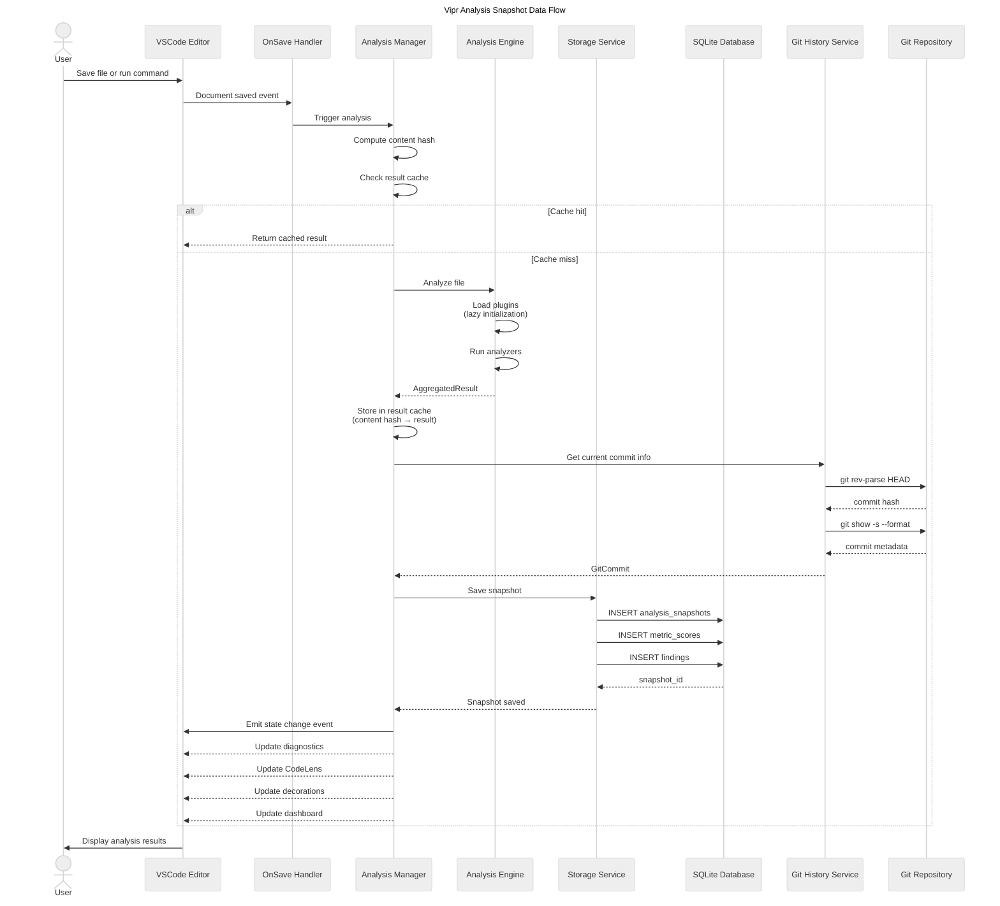
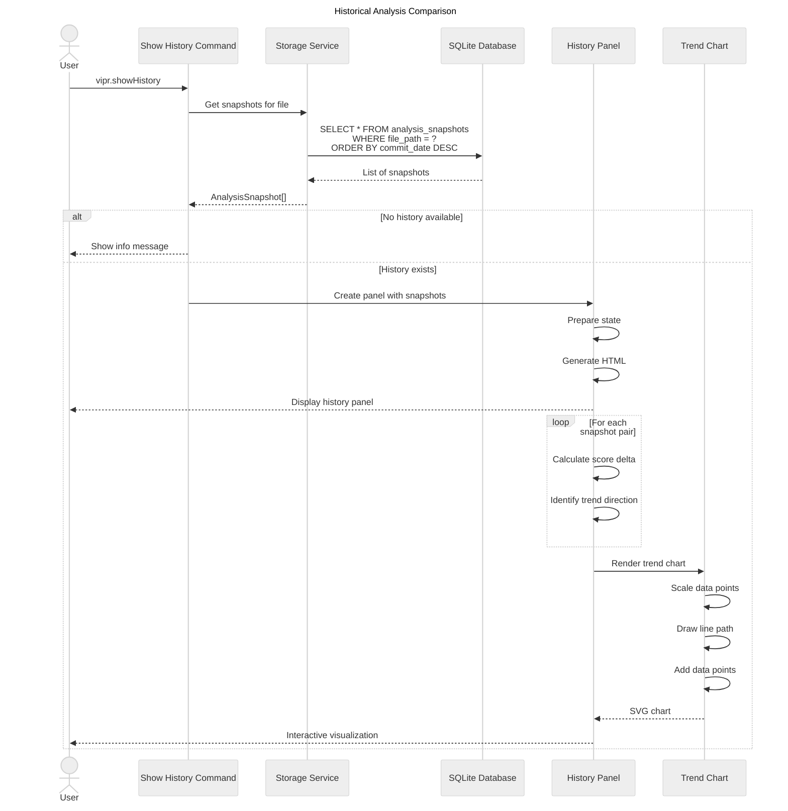
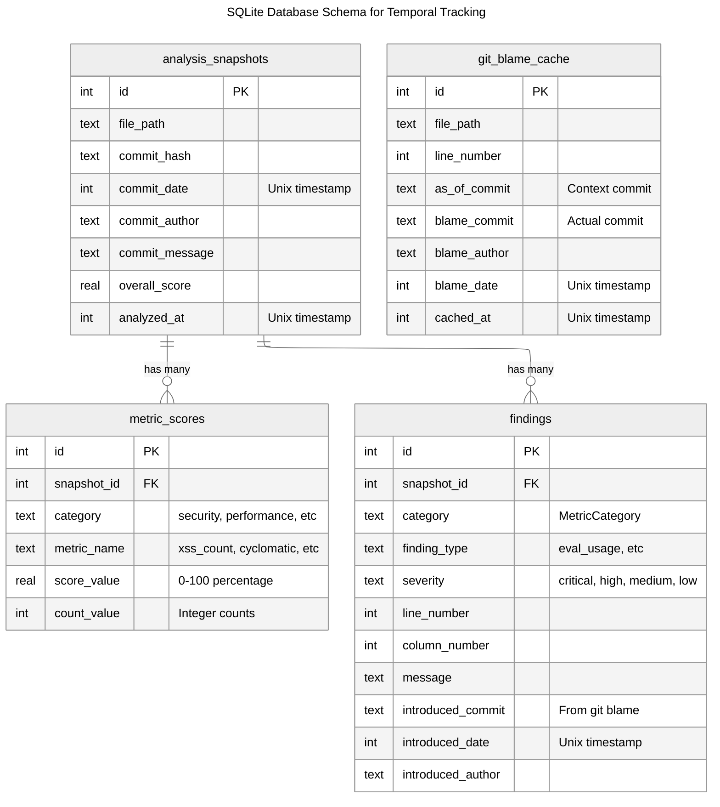
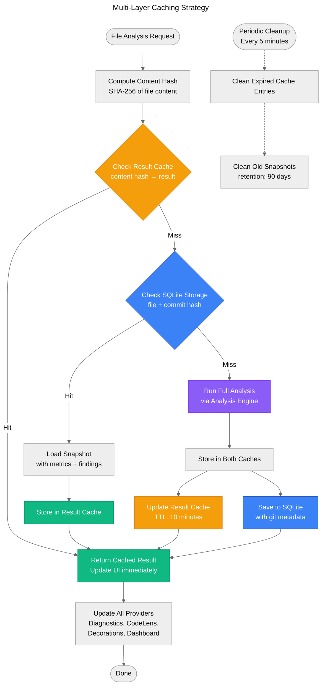

# Data Flow Diagram

This diagram shows how analysis snapshots flow through the system for temporal analysis.

## Analysis Snapshot Data Flow

## Historical Comparison Flow

## Metric Storage Schema

## Cache Invalidation Strategy

## Key Insights

### Performance Optimizations

1. **Content-Based Hashing**: Files with identical content reuse cached results
2. **Lazy SQLite Writes**: Batch database writes to reduce I/O
3. **Git Blame Caching**: Expensive git operations cached in database
4. **TTL-Based Expiration**: Result cache expires after 10 minutes (configurable)

### Storage Strategy

1. **Snapshot on Every Analysis**: Each analysis run creates a new snapshot
2. **Deduplication**: Same file + commit hash combination is updated, not duplicated
3. **Flexible Metrics**: Schema supports evolving metric types without migration
4. **Attribution Data**: Findings include git blame for accountability

### Data Flow Guarantees

1. **Eventual Consistency**: UI updates immediately from cache, storage is async
2. **No Data Loss**: Failed storage operations don't block analysis
3. **Graceful Degradation**: Extension works without git repository
4. **Offline Support**: Result cache works without network/git access
