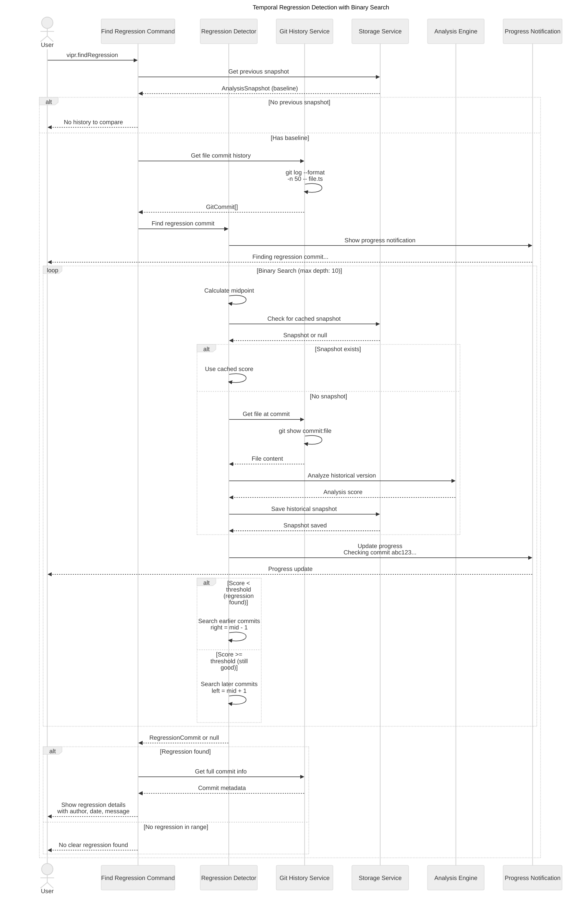
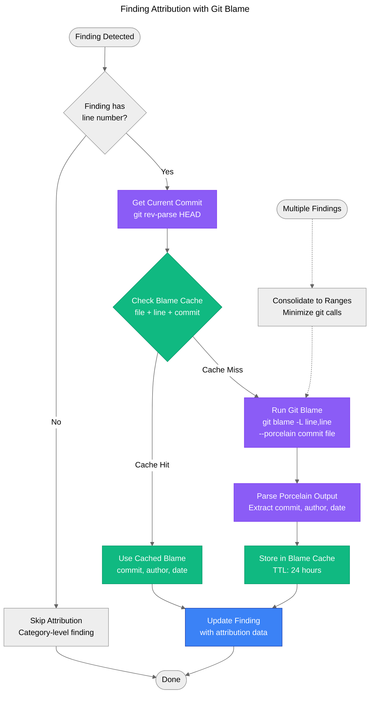
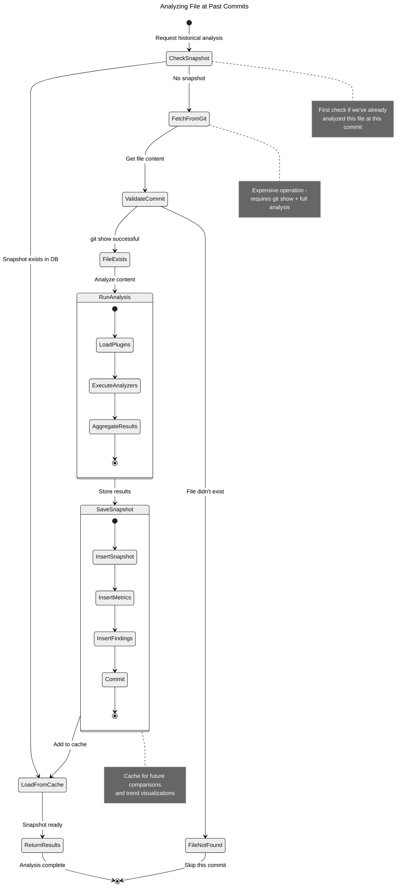
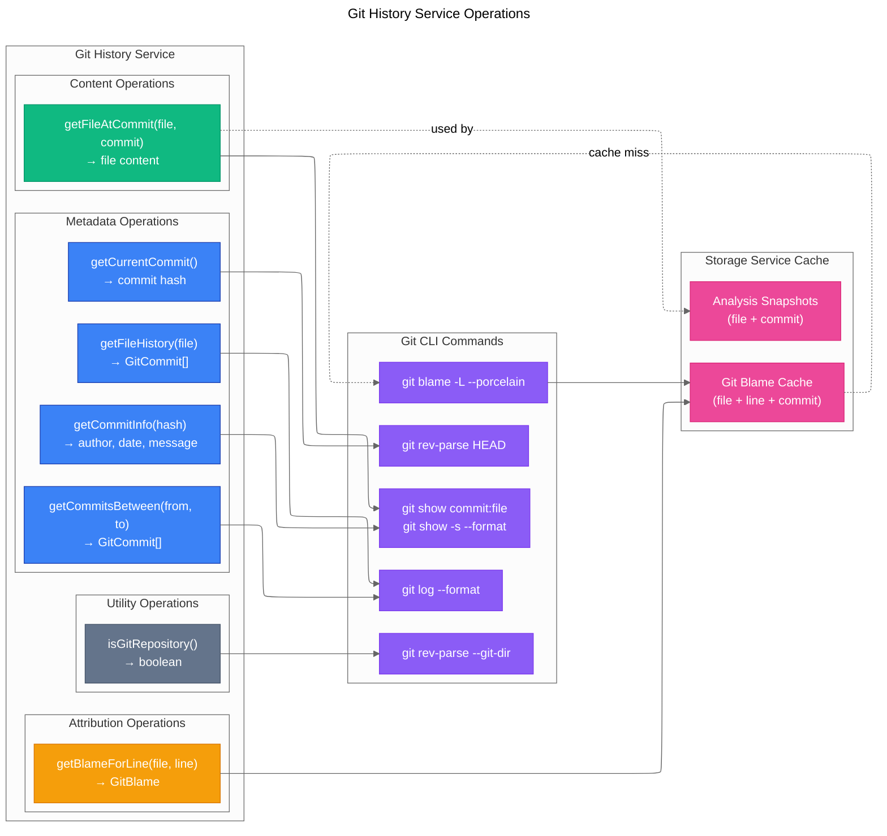

# Git Integration Flow

This diagram shows how git history is leveraged for regression detection and attribution.

## Regression Detection Flow



## Git Blame Attribution Flow



## Historical Analysis Workflow



## Git History Service Architecture



## Regression Detection Algorithm

```mermaid
---
title: Binary Search for Regression Detection
config:
  theme: neutral
---
flowchart TD
    accTitle: Binary Search Regression Detection Algorithm
    accDescr: Detailed algorithm for finding the first bad commit using binary search

    Start([Start Regression Detection]) --> GetHistory[Get Commit History<br/>git log -n 50 file.ts]
    GetHistory --> ValidateHistory{History has<br/>2+ commits?}

    ValidateHistory -->|No| NoHistory[Return null<br/>Insufficient history]
    NoHistory --> End([End])

    ValidateHistory -->|Yes| Initialize[Initialize Search<br/>left = 0<br/>right = commits.length - 1<br/>depth = 0<br/>maxDepth = 10]

    Initialize --> SearchLoop{left <= right<br/>AND depth < maxDepth}

    SearchLoop -->|No| ReturnResult[Return Best Match<br/>or null if none found]
    ReturnResult --> End

    SearchLoop -->|Yes| CalcMid[Calculate Midpoint<br/>mid = floor((left + right) / 2)]
    CalcMid --> GetCommit[Get Commit at Index<br/>commits[mid]]

    GetCommit --> CheckSnapshot{Snapshot exists<br/>for this commit?}

    CheckSnapshot -->|Yes| GetCachedScore[Get Score from Cache]
    GetCachedScore --> EvaluateScore

    CheckSnapshot -->|No| FetchContent[Fetch File Content<br/>git show commit:file]
    FetchContent --> ValidateContent{Content exists?}

    ValidateContent -->|No| SkipCommit[Skip Commit<br/>right = mid - 1]
    SkipCommit --> IncrementDepth

    ValidateContent -->|Yes| AnalyzeContent[Analyze Historical Version<br/>Run full analysis]
    AnalyzeContent --> StoreSnapshot[Store Snapshot<br/>for future use]
    StoreSnapshot --> EvaluateScore{Score < threshold<br/>(e.g., 70)?}

    EvaluateScore -->|Bad Score| FoundRegression[Potential Regression<br/>Store as candidate<br/>right = mid - 1<br/>Search for earlier bad commit]
    FoundRegression --> IncrementDepth

    EvaluateScore -->|Good Score| NotRegression[Commit is Good<br/>left = mid + 1<br/>Search for later regression]
    NotRegression --> IncrementDepth

    IncrementDepth[Increment Depth<br/>depth++<br/>Update Progress UI] --> SearchLoop

    %% Styling
    classDef decision fill:#f59e0b,stroke:#d97706,color:#fff
    classDef process fill:#3b82f6,stroke:#1e40af,color:#fff
    classDef cache fill:#10b981,stroke:#059669,color:#fff
    classDef found fill:#ef4444,stroke:#dc2626,color:#fff

    class ValidateHistory,CheckSnapshot,ValidateContent,EvaluateScore,SearchLoop decision
    class CalcMid,GetCommit,FetchContent,AnalyzeContent,IncrementDepth process
    class GetCachedScore,StoreSnapshot cache
    class FoundRegression found
```

## Key Design Decisions

### Binary Search Efficiency

1. **Depth Limit**: Maximum 10 iterations prevents excessive git operations
2. **Caching**: Previously analyzed commits reuse stored snapshots
3. **Progressive Search**: Finds the earliest regression, not just any bad commit
4. **Cancellable**: User can cancel long-running searches

### Git Blame Optimization

1. **Batching**: Multiple findings consolidated into range-based blame calls
2. **Cache Duration**: 24-hour TTL balances accuracy vs performance
3. **Porcelain Format**: Structured output easier to parse than default format
4. **Fallback**: Gracefully handles missing or moved files

### Historical Analysis Challenges

1. **File Existence**: File may not exist in old commits
2. **Line Number Drift**: Findings from current analysis may not map to historical lines
3. **Plugin Availability**: Historical analysis uses current plugin versions
4. **Performance**: Full analysis of old commits is expensive (mitigated by caching)

### Storage Considerations

1. **Snapshot Deduplication**: Same file + commit only stored once
2. **Retention Policy**: Configurable cleanup (default: 90 days)
3. **Incremental Growth**: Database grows with each analysis, bounded by retention
4. **Query Performance**: Indexes on file_path + commit_date for fast lookups
