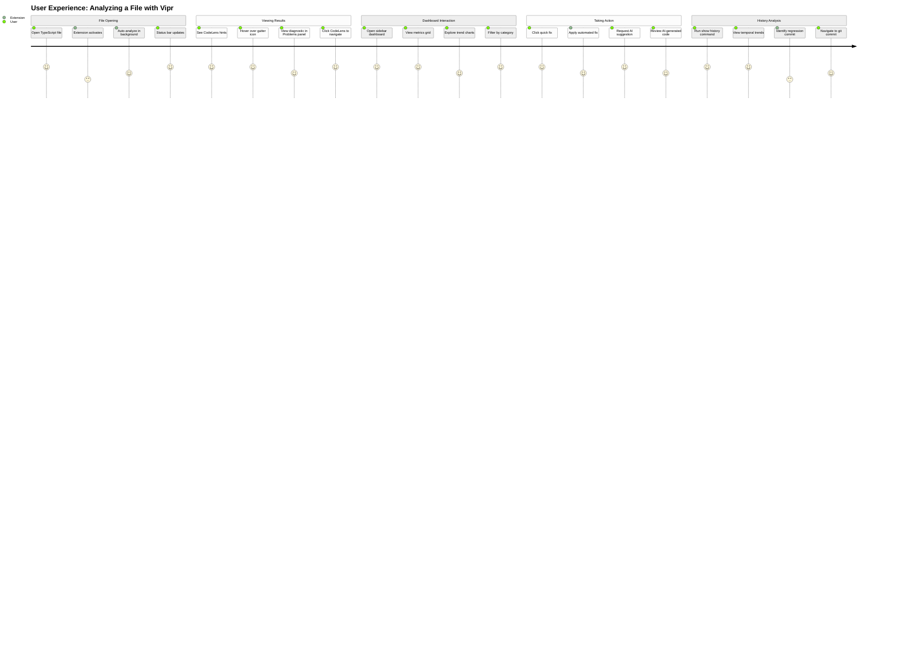
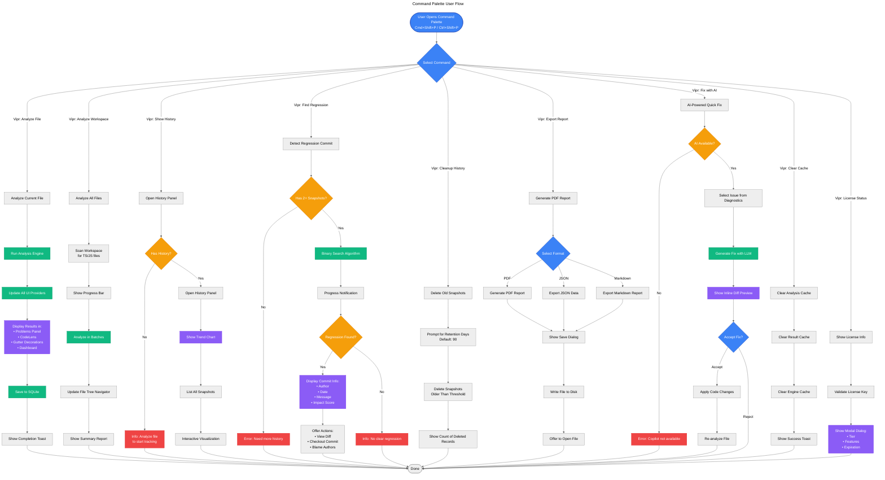
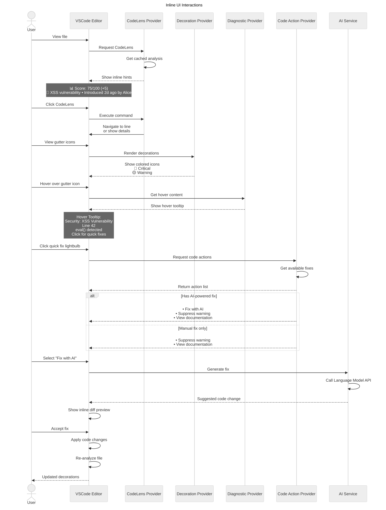
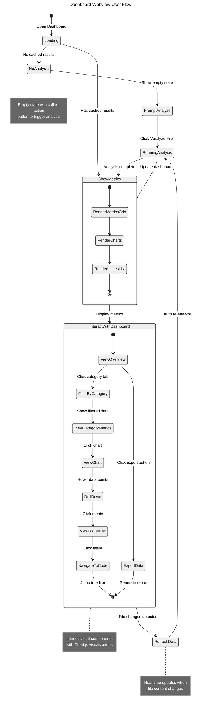
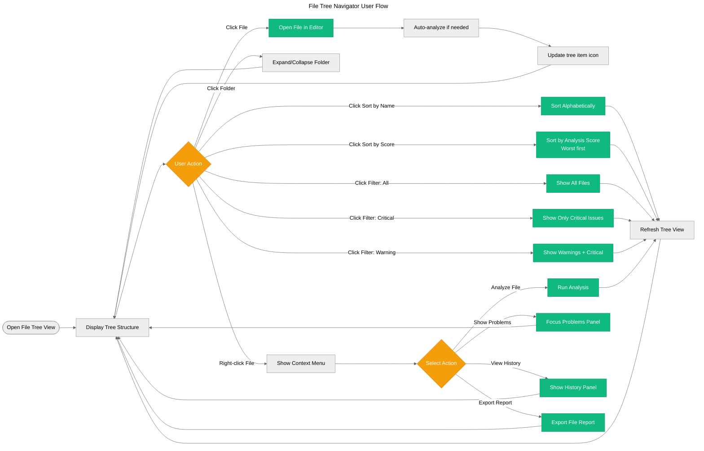

# User Interaction Flow

This diagram visualizes how users interact with the extension through commands, CodeLens, diagnostics, and the webview.

## User Journey: Analyzing a File

## Command Palette Interactions

## CodeLens and Gutter Interactions

## Dashboard Webview Interactions

## File Tree Navigator Interactions

## Keyboard Shortcuts and Quick Actions

```mermaid
---
title: Keyboard Shortcuts and Accessibility
config:
  theme: neutral
---
flowchart TD
    accTitle: Keyboard Shortcuts and Quick Actions
    accDescr: Shows available keyboard shortcuts and their associated actions

    subgraph Shortcuts["Keyboard Shortcuts"]
        direction TB

        CmdShiftP["Cmd/Ctrl + Shift + P<br/>Command Palette"] --> AllCommands[Access all Vipr commands]

        CmdShiftM["Cmd/Ctrl + Shift + M<br/>Problems Panel"] --> ShowProblems[View all diagnostics]

        F1["F1<br/>Command Palette"] --> AllCommands

        Escape["Escape<br/>Dismiss"] --> ClosePanel[Close active panel]

        Enter["Enter<br/>Navigate"] --> GoToIssue[Jump to selected issue]

        Arrow["Arrow Keys<br/>Navigate"] --> BrowseList[Browse issues list]

        CmdClick["Cmd/Ctrl + Click<br/>Open Link"] --> FollowLink[Open documentation<br/>or git commit]
    end

    subgraph QuickActions["Quick Actions (Editor)"]
        direction TB

        Lightbulb["💡 Lightbulb Icon<br/>Code Action"] --> QuickFixMenu[Show quick fixes]

        HoverMessage["Hover over Gutter<br/>Icon"] --> ShowTooltip[Display issue details]

        ClickCodeLens["Click CodeLens<br/>Hint"] --> ExecuteAction[Run associated command]

        RightClick["Right-click<br/>Context Menu"] --> ContextCommands[Show Vipr commands]
    end

    subgraph Accessibility["Accessibility Features"]
        direction TB

        ScreenReader["Screen Reader Support"] --> Announce[Announce diagnostics<br/>and results]

        HighContrast["High Contrast Mode"] --> ThemeAdapt[Adapt colors to theme]

        KeyboardOnly["Keyboard-only Navigation"] --> FullAccess[Access all features<br/>without mouse]

        FocusIndicators["Focus Indicators"] --> VisibleFocus[Clear focus states]
    end

    %% Styling
    classDef shortcut fill:#3b82f6,stroke:#1e40af,color:#fff
    classDef quick fill:#10b981,stroke:#059669,color:#fff
    classDef a11y fill:#f59e0b,stroke:#d97706,color:#fff

    class CmdShiftP,CmdShiftM,F1,Escape,Enter,Arrow,CmdClick shortcut
    class Lightbulb,HoverMessage,ClickCodeLens,RightClick quick
    class ScreenReader,HighContrast,KeyboardOnly,FocusIndicators a11y
```

## Key User Experience Principles

### Progressive Disclosure

1. **Auto-analysis on Save**: Silent background analysis doesn't interrupt workflow
2. **Inline Hints First**: CodeLens provides quick overview without opening panels
3. **Details on Demand**: Hover for tooltips, click for full information
4. **Contextual Actions**: Quick fixes appear when relevant

### Performance Perception

1. **Optimistic UI**: Show cached results immediately
2. **Background Processing**: Heavy analysis in worker threads
3. **Incremental Loading**: Dashboard renders progressively
4. **Progress Indicators**: Clear feedback for long operations

### Discoverability

1. **Command Palette**: All features accessible via search
2. **Context Menus**: Right-click for relevant actions
3. **Empty States**: Helpful prompts when no data available
4. **Onboarding**: Welcome messages guide new users

### Error Handling

1. **Graceful Degradation**: Features work without git/AI when possible
2. **Clear Error Messages**: Actionable feedback on failures
3. **Recovery Actions**: Suggest next steps (e.g., "Install Copilot")
4. **Silent Failures**: Non-critical errors logged, not shown

### Accessibility

1. **Keyboard Navigation**: Full functionality without mouse
2. **Screen Reader Support**: Semantic HTML and ARIA labels
3. **High Contrast**: Respects VSCode theme colors
4. **Focus Management**: Clear focus indicators and logical tab order
