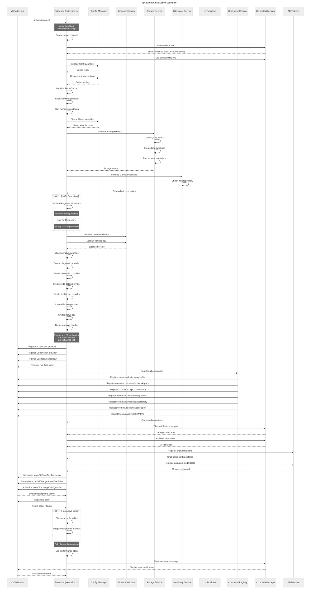
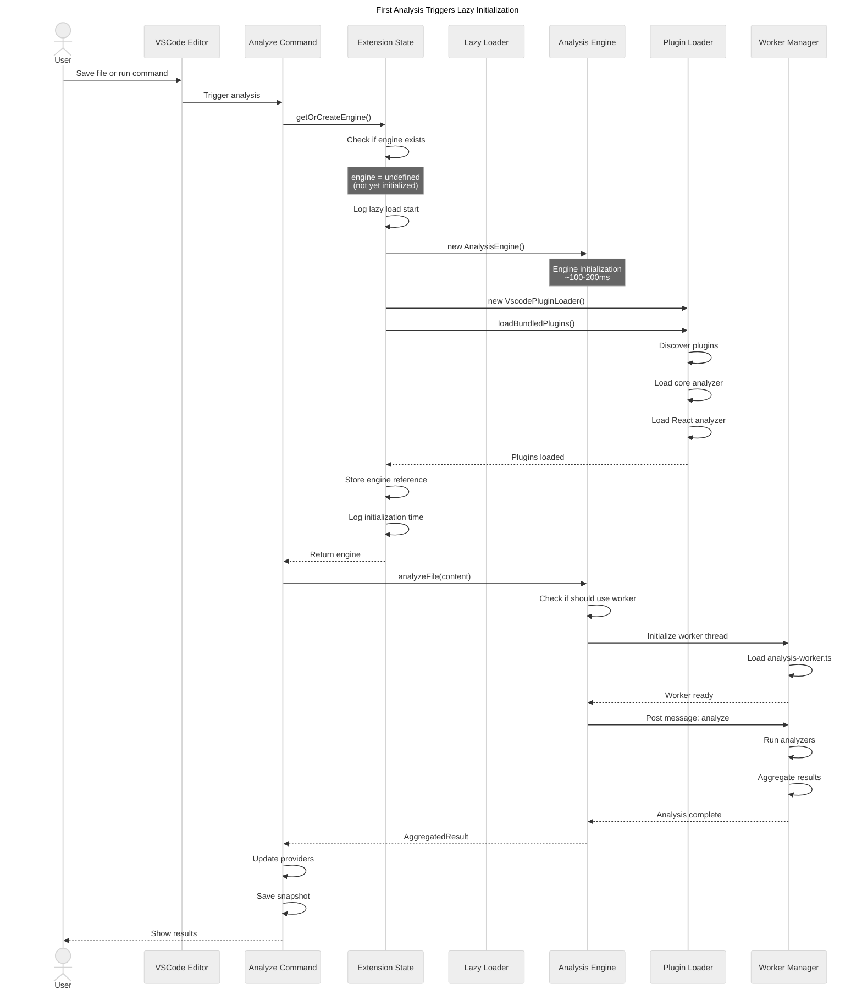
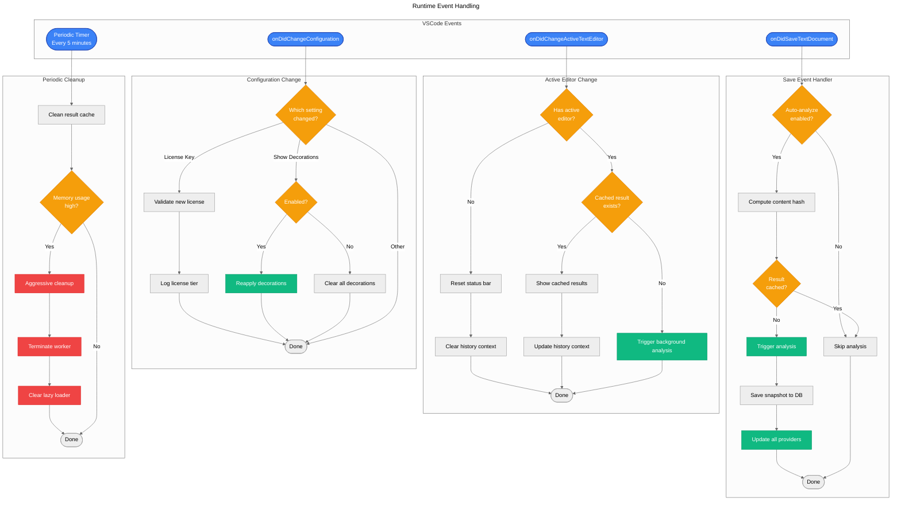
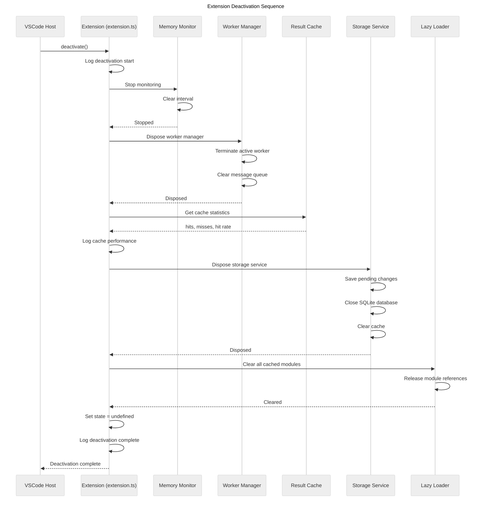
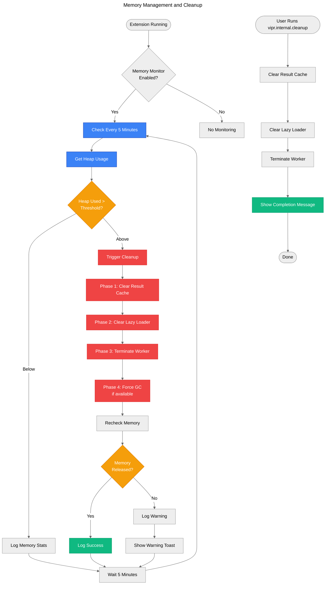
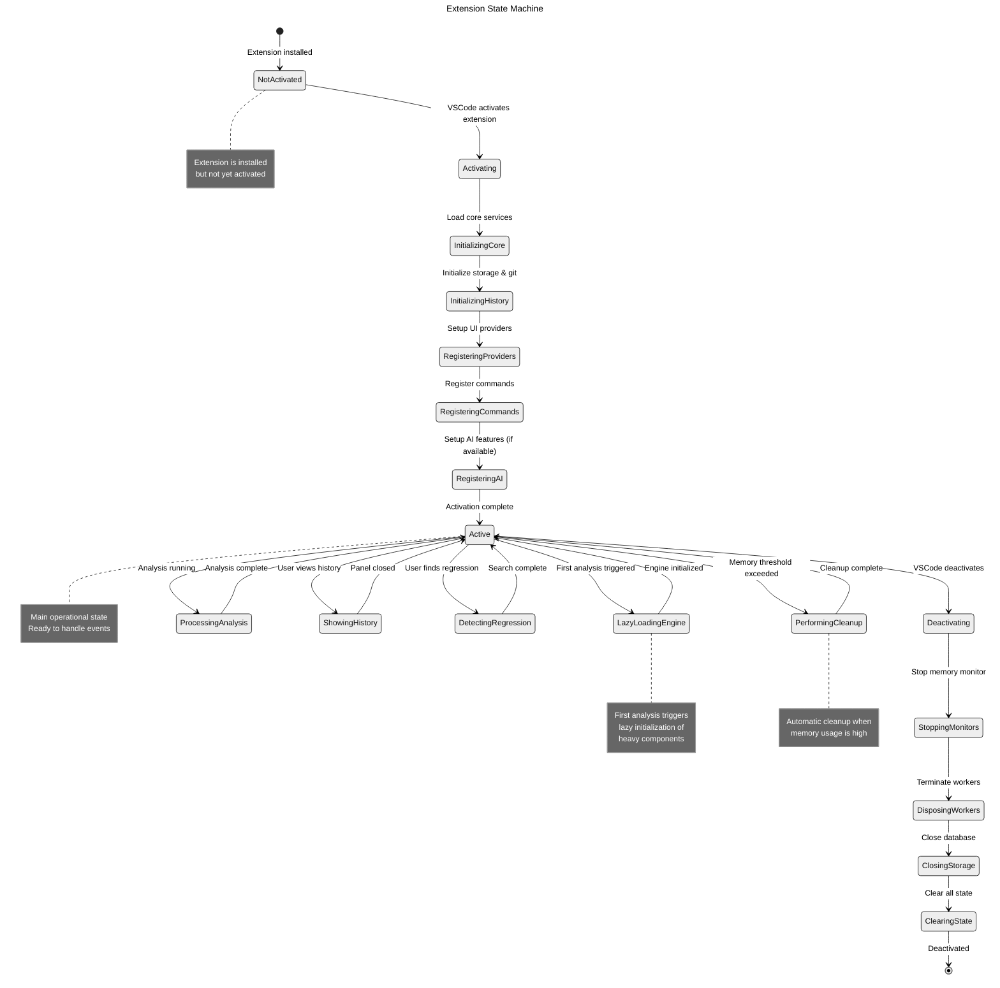

# Extension Lifecycle

This diagram shows the complete lifecycle of the Vipr VSCode extension from activation to deactivation.

## Activation Sequence

## First Analysis Flow (Lazy Loading)

## Runtime Event Handling

## Deactivation Sequence

## Memory Management

## Lifecycle State Transitions

## Performance Metrics

The extension tracks several performance metrics during its lifecycle:

### Activation Time Breakdown

| Phase                 | Target        | Typical       | Notes                                  |
| --------------------- | ------------- | ------------- | -------------------------------------- |
| Core initialization   | &lt;50ms      | 30-40ms       | Config, License, Storage               |
| Provider registration | &lt;30ms      | 20-25ms       | Register all UI providers              |
| Command registration  | &lt;20ms      | 10-15ms       | Register all commands                  |
| AI feature setup      | &lt;50ms      | 30-40ms       | Conditional, only if Copilot available |
| **Total Activation**  | **&lt;150ms** | **100-120ms** | Without lazy-loaded components         |

### First Analysis Time

| Component                | Target        | Typical       | Notes                           |
| ------------------------ | ------------- | ------------- | ------------------------------- |
| Lazy load engine         | &lt;200ms     | 150-180ms     | One-time cost on first analysis |
| Plugin loading           | &lt;100ms     | 80-100ms      | Load core + React analyzers     |
| Worker initialization    | &lt;50ms      | 30-40ms       | Create worker thread            |
| Actual analysis          | Varies        | 100-500ms     | Depends on file size/complexity |
| **Total First Analysis** | **&lt;500ms** | **400-600ms** | Subsequent analyses much faster |

### Runtime Performance

| Operation               | Target    | Typical   | Notes                      |
| ----------------------- | --------- | --------- | -------------------------- |
| Cached result retrieval | &lt;5ms   | 2-3ms     | Content hash lookup        |
| Background analysis     | &lt;200ms | 100-150ms | For small-medium files     |
| History snapshot save   | &lt;50ms  | 30-40ms   | SQLite insert              |
| Git blame lookup        | &lt;100ms | 50-80ms   | With caching               |
| Regression detection    | Varies    | 2-5s      | Binary search with caching |

## Key Lifecycle Optimizations

### 1. Lazy Initialization

- Analysis Engine not created until first analysis
- Worker threads spawned on demand
- Reduces initial activation time by ~60%

### 2. Deferred Database Connections

- SQLite database opened during activation
- But migrations run lazily
- Reduces activation blocking

### 3. Progressive Feature Registration

- Core features registered immediately
- AI features registered conditionally
- Non-critical subscriptions deferred

### 4. Memory Monitoring

- Automatic cleanup at threshold
- Proactive worker termination
- Lazy loader cache clearing

### 5. Graceful Shutdown

- Pending snapshots flushed
- Database closed cleanly
- Workers terminated properly
- No zombie processes
