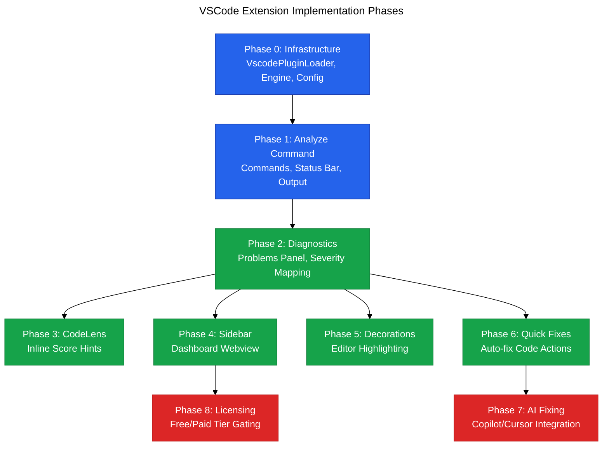

# Vipr VSCode Extension v2 Documentation

**Purpose**: Comprehensive technical documentation for building the Vipr VSCode Extension v2, a React/TypeScript code quality extension powered by the existing Vipr plugin architecture.

**Last Updated**: 2026-01-18

**Audience**: Engineers implementing the VSCode extension

## Overview

The Vipr VSCode Extension v2 brings the power of Vipr's advanced React and TypeScript analysis directly into the editor. It analyzes code for complexity, anti-patterns, security issues, accessibility violations, and more, providing real-time feedback through diagnostics, inline hints, quick fixes, and an interactive sidebar dashboard.

### Key Features

- Real-time analysis of React/TypeScript files in the editor
- Diagnostics in the Problems panel with severity levels
- Inline CodeLens hints showing component scores
- Interactive sidebar dashboard with overall score and plugin breakdown
- Quick fixes for auto-fixable issues
- AI-assisted fixing integration with Copilot/Cursor
- Tiered licensing system for free and paid reports
- Editor decorations highlighting issues with gutter icons and hover tooltips

### Architecture Highlights

The extension leverages the existing Vipr plugin architecture:

- Uses `@vipr/engine` for analysis orchestration
- Dynamically loads `@vipr/react` and `@vipr/core` analyzer plugins
- Queries `PresenterRegistry` for available reports (no hardcoded report types)
- Respects presenter metadata (labels, icons, order) for UI display
- Follows the anti-pattern avoidance guidelines from `plugin-architecture.md`

## Phase Dependency Graph

The implementation is organized into 9 phases with clear dependencies:



## Directory Structure

The extension code will be organized as follows:

```
clients/
  └─ vscode-extension/
     ├─ package.json                    # Extension manifest
     ├─ tsconfig.json                   # TypeScript config
     ├─ .vscodeignore                   # Files to exclude from package
     ├─ README.md                       # User-facing documentation
     ├─ CHANGELOG.md                    # Version history
     ├─ src/
     │  ├─ extension.ts                 # Main activation entry point
     │  ├─ types/                       # Extension-specific types
     │  │  ├─ config.ts                 # Configuration types
     │  │  ├─ analysis.ts               # Analysis result types
     │  │  ├─ webview.ts                # Webview message types
     │  │  └─ license.ts                # License tier types
     │  ├─ core/                        # Core infrastructure (Phase 0)
     │  │  ├─ plugin-loader.ts          # VscodePluginLoader
     │  │  ├─ analysis-manager.ts       # Manages analysis state/cache
     │  │  ├─ config-manager.ts         # Configuration management
     │  │  └─ license-validator.ts      # License key validation
     │  ├─ commands/                    # Commands (Phase 1)
     │  │  ├─ analyze-file.ts           # Analyze current file
     │  │  ├─ analyze-workspace.ts      # Analyze workspace
     │  │  └─ index.ts                  # Command registration
     │  ├─ providers/                   # LSP-style providers
     │  │  ├─ diagnostic-provider.ts    # Phase 2: Problems panel
     │  │  ├─ codelens-provider.ts      # Phase 3: Inline hints
     │  │  ├─ decoration-provider.ts    # Phase 5: Editor highlighting
     │  │  └─ codeaction-provider.ts    # Phase 6 & 7: Quick fixes
     │  ├─ views/                       # View providers
     │  │  ├─ sidebar-view-provider.ts  # Phase 4: Sidebar dashboard
     │  │  └─ status-bar.ts             # Phase 1: Status bar item
     │  ├─ webview/                     # Webview resources
     │  │  ├─ dashboard.html            # Dashboard HTML template
     │  │  ├─ dashboard.css             # Dashboard styles
     │  │  └─ dashboard.js              # Dashboard client-side logic
     │  ├─ ai/                          # AI integration (Phase 7)
     │  │  ├─ template-engine.ts        # Prompt template interpolation
     │  │  ├─ copilot-integration.ts    # GitHub Copilot API
     │  │  └─ cursor-integration.ts     # Cursor API
     │  └─ utils/                       # Shared utilities
     │     ├─ severity-mapper.ts        # Map Vipr severity to VSCode
     │     ├─ score-formatter.ts        # Format scores for display
     │     └─ theme-helper.ts           # Detect light/dark theme
     └─ test/                           # Extension tests
        ├─ suite/
        │  ├─ extension.test.ts
        │  ├─ plugin-loader.test.ts
        │  ├─ diagnostic-provider.test.ts
        │  └─ ...
        └─ runTest.ts
```

## Document Index

Each phase has dedicated documentation with implementation details, code examples, and acceptance criteria:

### Foundation Documentation

1. **[01-types.md](./01-types.md)** - TypeScript type definitions for all extension-specific types
2. **[phase-00-infrastructure.md](./phase-00-infrastructure.md)** - Foundation: plugin loading, engine setup, configuration

### Feature Implementation Phases

3. **[phase-01-analyze-command.md](./phase-01-analyze-command.md)** - Analysis commands and status bar integration
4. **[phase-02-diagnostics.md](./phase-02-diagnostics.md)** - Problems panel with diagnostics
5. **[phase-03-codelens.md](./phase-03-codelens.md)** - Inline score hints above components
6. **[phase-04-sidebar.md](./phase-04-sidebar.md)** - Interactive dashboard webview
7. **[phase-05-decorations.md](./phase-05-decorations.md)** - Editor highlighting with gutter icons
8. **[phase-06-quick-fixes.md](./phase-06-quick-fixes.md)** - Auto-fix code actions

### Advanced Features

9. **[phase-07-ai-fixing.md](./phase-07-ai-fixing.md)** - AI-assisted fixing with Copilot/Cursor
10. **[phase-08-licensing.md](./phase-08-licensing.md)** - Free/paid tier gating

## Quick Start Guide

To begin implementing the extension:

1. **Set up the workspace**:

   ```bash
   cd clients/
   mkdir -p vscode-extension
   cd vscode-extension
   npm init -y
   ```

2. **Install dependencies**:

   ```bash
   npm install --save @vipr/engine @vipr/common @vipr/react @vipr/core
   npm install --save-dev @types/vscode @vscode/test-electron typescript
   ```

3. **Follow phase order**:
   - Start with Phase 0 (Infrastructure)
   - Verify each phase with acceptance criteria
   - Run tests before proceeding to next phase

4. **Reference existing patterns**:
   - `clients/cli/src/plugins/loader.ts` for plugin loading pattern
   - `packages/common/src/presenters/presenter-registry.ts` for registry usage
   - `docs/plugin-architecture.md` for anti-patterns to avoid

## Scoring System

The extension uses a point-based scoring system (no letter grades):

- **Display Format**: `85/100` or `85%`
- **Score Levels**:
  - Excellent: 80-100
  - Good: 60-79
  - Fair: 40-59
  - Poor: 0-39

## Licensing Tiers

The extension implements a two-tier licensing model:

### Free Tier

Available reports without license key:

- Core Overview (from `@vipr/core`)
- React Overview (from `@vipr/react`)

### Paid Tier

Requires valid license key (VIPR-PRO-xxx or VIPR-ENT-xxx):

- Security
- Accessibility
- Performance
- Reliability
- Migration
- Anti-Patterns
- Dataflow
- Technical Debt

## Critical Design Patterns

The extension MUST follow these patterns from the existing architecture:

### Plugin System

```typescript
// CORRECT: Dynamic plugin loading via VscodePluginLoader
const engine = new AnalysisEngine();
const loader = new VscodePluginLoader(engine);
await loader.loadBundledPlugins();
const registry = loader.getPresenterRegistry();

// WRONG: Direct import of analyzers
import { ReactAnalyzerPlugin } from '@vipr/react'; // AVOID
```

### Registry-Based Discovery

```typescript
// CORRECT: Query registry for available reports
const availableReports = registry.getAvailableReports();
for (const metadata of availableReports) {
  const presenter = registry.get(metadata.pluginId, metadata.reportType);
  // Use metadata.label, metadata.icon, etc.
}

// WRONG: Hardcoded report types
const REPORT_TYPES = ['security', 'accessibility']; // AVOID
```

### Presenter Metadata

```typescript
// CORRECT: Use metadata from presenters
const metadata = presenter.getMetadata();
console.log(metadata.label); // "Security"
console.log(metadata.icon); // "🔒"
console.log(metadata.order); // 20

// WRONG: Hardcoded labels and icons
const REPORT_ICONS = { security: '🔒' }; // AVOID
```

## Anti-Patterns to Avoid

Per `CLAUDE.md` and `plugin-architecture.md`:

| Anti-Pattern                     | Why It Breaks Architecture                   | Correct Pattern                          |
| -------------------------------- | -------------------------------------------- | ---------------------------------------- |
| Import presenters directly       | Couples extension to analyzer implementation | Use `registry.get(pluginId, reportType)` |
| Hardcoded report type arrays     | Bypasses dynamic discovery                   | Use `registry.getAvailableReports()`     |
| Hardcoded icons/labels           | Duplicates metadata from presenters          | Use `metadata.icon`, `metadata.label`    |
| Creating presenters in extension | Bypasses plugin system                       | Plugins create and register presenters   |
| `normalizeReportType()` mapping  | Couples formatter to report naming           | Use exact `reportType` from metadata     |

## Testing Strategy

Each phase document includes specific test requirements. General approach:

1. **Unit Tests**: Test individual providers, managers, utilities in isolation
2. **Integration Tests**: Test interaction between components (e.g., analysis to diagnostics)
3. **Manual Verification**: Visual verification of UI elements, decorations, webviews
4. **Acceptance Criteria**: Each phase has a checklist that must be completed

## VSCode API Surface

The extension uses these VSCode APIs:

- `vscode.commands` - Register commands
- `vscode.languages` - Register providers (diagnostics, CodeLens, code actions)
- `vscode.window` - Status bar, output channels, webviews
- `vscode.workspace` - Configuration, file system watching
- `vscode.Diagnostic` - Problems panel integration
- `vscode.CodeLens` - Inline hints
- `vscode.CodeAction` - Quick fixes
- `vscode.TextEditorDecorationType` - Editor highlighting
- `vscode.WebviewViewProvider` - Sidebar dashboard

## Related Documentation

- `/docs/plugin-architecture.md` - Complete plugin system architecture with mermaid diagrams
- `/packages/common/src/types/presentation/presenter.ts` - Presenter interfaces
- `/packages/common/src/types/plugin/index.ts` - Plugin interfaces
- `/clients/cli/src/plugins/loader.ts` - Plugin loader reference implementation
- `/CLAUDE.md` - Project-wide best practices and anti-patterns

## Development Workflow

1. Read phase documentation thoroughly
2. Implement types first (from `01-types.md`)
3. Follow phase order strictly (respect dependency graph)
4. Write tests alongside implementation
5. Verify acceptance criteria before moving to next phase
6. Reference existing CLI patterns for consistency

## Notes

- The extension reuses the same `AnalysisEngine` and plugin system as the CLI
- All presentation logic uses `PresenterRegistry` for dynamic discovery
- No hardcoded report types, icons, labels, or categories anywhere
- Score display is always point-based (85/100), never letter grades
- License validation is simple prefix-based for MVP (no server calls)
- AI fixing is optional and gracefully degrades if APIs unavailable
