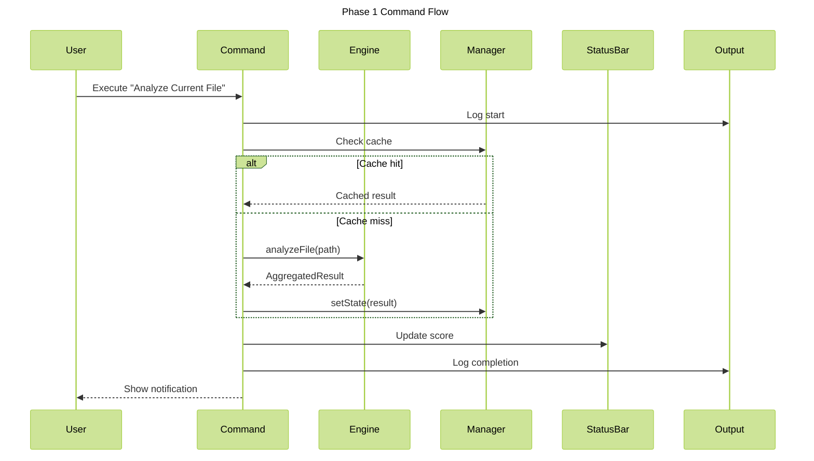

# Phase 1: Analyze Command

**Purpose**: Implement analysis commands that allow users to trigger file and workspace analysis with visual feedback.

**Dependencies**: Phase 0 (Infrastructure)

**Deliverables**: Commands, status bar integration, output channel logging, progress notifications

## Overview

Phase 1 adds user-facing commands to trigger analysis:

1. `Vipr: Analyze Current File` - Analyze the active editor file
2. `Vipr: Analyze Workspace` - Analyze all eligible files in workspace
3. Status bar item showing current file score
4. Output channel for detailed logs
5. Progress notifications during long-running analysis

This phase provides the foundation for user-initiated analysis before implementing automatic triggers.

## Architecture Diagram



## File Changes

### 1. Analyze File Command

**File**: `src/commands/analyze-file.ts`

```typescript
import * as vscode from 'vscode';
import { getExtensionState } from '../extension';

/**
 * Command: Analyze current file
 * Analyzes the active editor file and displays results
 */
export async function analyzeFile(uri?: vscode.Uri): Promise<void> {
  const { engine, analysisManager, outputChannel, configManager } = getExtensionState();

  // Determine target file
  const targetUri = uri ?? vscode.window.activeTextEditor?.document.uri;
  if (!targetUri) {
    vscode.window.showWarningMessage('No file to analyze');
    return;
  }

  const document = await vscode.workspace.openTextDocument(targetUri);

  // Check if file is eligible for analysis
  if (!isEligibleFile(document)) {
    vscode.window.showInformationMessage(
      `File ${document.fileName} is not a TypeScript or React file`
    );
    return;
  }

  outputChannel.appendLine(`\nAnalyzing: ${document.fileName}`);
  outputChannel.show(true);

  try {
    // Compute content hash
    const content = document.getText();
    const contentHash = analysisManager.computeContentHash(content);

    // Check cache
    const cached = analysisManager.getCachedResult(targetUri, contentHash);
    if (cached) {
      outputChannel.appendLine('Using cached result');
      updateStatusBarFromResult(cached);
      vscode.window.showInformationMessage(`Analysis complete: ${cached.overallScore}/100`);
      return;
    }

    // Show progress
    await vscode.window.withProgress(
      {
        location: vscode.ProgressLocation.Notification,
        title: 'Vipr: Analyzing file...',
        cancellable: false,
      },
      async progress => {
        progress.report({ increment: 0 });

        // Mark as analyzing
        analysisManager.setAnalyzing(targetUri, true);

        // Run analysis
        const result = await engine.analyzeFile(targetUri.fsPath);

        // Store result
        analysisManager.setState({
          uri: targetUri,
          result,
          diagnostics: [],
          analyzedAt: new Date(),
          contentHash,
          isAnalyzing: false,
        });

        progress.report({ increment: 100 });

        // Log results
        outputChannel.appendLine(`Overall Score: ${result.overallScore}/100`);
        outputChannel.appendLine(`Analysis Time: ${result.executionTimeMs}ms`);
        outputChannel.appendLine(`Plugins: ${result.pluginResults.size}`);

        // Update status bar
        updateStatusBarFromResult(result);

        // Show notification
        const level = getScoreLevelText(result.overallScore);
        vscode.window.showInformationMessage(
          `Analysis complete: ${result.overallScore}/100 (${level})`
        );
      }
    );
  } catch (error) {
    const message = error instanceof Error ? error.message : String(error);
    outputChannel.appendLine(`Error: ${message}`);
    vscode.window.showErrorMessage(`Vipr: Analysis failed - ${message}`);

    // Store error state
    analysisManager.setState({
      uri: targetUri,
      result: createErrorResult(targetUri.fsPath),
      diagnostics: [],
      analyzedAt: new Date(),
      contentHash: '',
      isAnalyzing: false,
      error: error instanceof Error ? error : new Error(message),
    });
  }
}

/**
 * Check if file is eligible for analysis
 */
function isEligibleFile(document: vscode.TextDocument): boolean {
  const ext = document.fileName.split('.').pop()?.toLowerCase();
  return ext === 'ts' || ext === 'tsx' || ext === 'js' || ext === 'jsx';
}

/**
 * Update status bar from analysis result
 */
function updateStatusBarFromResult(result: any): void {
  // Implementation in status-bar.ts
  const { statusBar } = getExtensionState();
  statusBar?.update(result.overallScore);
}

/**
 * Get score level text
 */
function getScoreLevelText(score: number): string {
  if (score >= 80) return 'Excellent';
  if (score >= 60) return 'Good';
  if (score >= 40) return 'Fair';
  return 'Poor';
}

/**
 * Create error result placeholder
 */
function createErrorResult(filePath: string): any {
  return {
    filePath,
    analyzedAt: new Date().toISOString(),
    overallScore: 0,
    pluginResults: new Map(),
    insights: [],
    errors: [],
  };
}
```

### 2. Analyze Workspace Command

**File**: `src/commands/analyze-workspace.ts`

```typescript
import * as vscode from 'vscode';
import { getExtensionState } from '../extension';

/**
 * Command: Analyze workspace
 * Analyzes all eligible files in the workspace
 */
export async function analyzeWorkspace(): Promise<void> {
  const { engine, analysisManager, outputChannel } = getExtensionState();

  outputChannel.appendLine('\n=== Workspace Analysis Started ===');
  outputChannel.show(true);

  try {
    // Find all eligible files
    const files = await vscode.workspace.findFiles('**/*.{ts,tsx,js,jsx}', '**/node_modules/**');

    if (files.length === 0) {
      vscode.window.showInformationMessage('No files found to analyze');
      return;
    }

    outputChannel.appendLine(`Found ${files.length} file(s) to analyze`);

    let completed = 0;
    let failed = 0;
    const results: { uri: vscode.Uri; score: number }[] = [];

    // Analyze with progress
    await vscode.window.withProgress(
      {
        location: vscode.ProgressLocation.Notification,
        title: 'Vipr: Analyzing project...',
        cancellable: true,
      },
      async (progress, token) => {
        for (const uri of files) {
          if (token.isCancellationRequested) {
            outputChannel.appendLine('Analysis cancelled by user');
            break;
          }

          const increment = (1 / files.length) * 100;
          progress.report({
            increment,
            message: `${completed + 1}/${files.length}: ${uri.fsPath}`,
          });

          try {
            const document = await vscode.workspace.openTextDocument(uri);
            const content = document.getText();
            const contentHash = analysisManager.computeContentHash(content);

            // Check cache
            let result = analysisManager.getCachedResult(uri, contentHash);

            if (!result) {
              // Run analysis
              result = await engine.analyzeFile(uri.fsPath);

              // Store result
              analysisManager.setState({
                uri,
                result,
                diagnostics: [],
                analyzedAt: new Date(),
                contentHash,
                isAnalyzing: false,
              });
            }

            results.push({ uri, score: result.overallScore });
            completed++;
          } catch (error) {
            failed++;
            const message = error instanceof Error ? error.message : String(error);
            outputChannel.appendLine(`  ✗ ${uri.fsPath}: ${message}`);
          }
        }
      }
    );

    // Calculate summary
    const avgScore =
      results.length > 0
        ? Math.round(results.reduce((sum, r) => sum + r.score, 0) / results.length)
        : 0;

    const hotspots = results.sort((a, b) => a.score - b.score).slice(0, 10);

    // Log summary
    outputChannel.appendLine('\n=== Workspace Analysis Complete ===');
    outputChannel.appendLine(`Total Files: ${files.length}`);
    outputChannel.appendLine(`Analyzed: ${completed}`);
    outputChannel.appendLine(`Failed: ${failed}`);
    outputChannel.appendLine(`Average Score: ${avgScore}/100`);
    outputChannel.appendLine('\nTop 10 Hotspots (Lowest Scores):');
    hotspots.forEach((h, i) => {
      outputChannel.appendLine(`  ${i + 1}. ${h.uri.fsPath} - ${h.score}/100`);
    });

    // Show summary notification
    vscode.window.showInformationMessage(
      `Workspace analysis complete: ${completed}/${files.length} files (avg: ${avgScore}/100)`
    );
  } catch (error) {
    const message = error instanceof Error ? error.message : String(error);
    outputChannel.appendLine(`Error: ${message}`);
    vscode.window.showErrorMessage(`Vipr: Workspace analysis failed - ${message}`);
  }
}
```

### 3. Status Bar Item

**File**: `src/views/status-bar.ts`

```typescript
import * as vscode from 'vscode';

/**
 * Status bar item showing current file score
 */
export class ViprStatusBar {
  private statusBarItem: vscode.StatusBarItem;

  constructor() {
    this.statusBarItem = vscode.window.createStatusBarItem(vscode.StatusBarAlignment.Right, 100);
    this.statusBarItem.command = 'vipr.analyzeFile';
    this.statusBarItem.tooltip = 'Click to analyze file';
    this.hide();
  }

  /**
   * Update status bar with score
   */
  update(score?: number): void {
    if (score === undefined) {
      this.hide();
      return;
    }

    const icon = this.getScoreIcon(score);
    const level = this.getScoreLevel(score);

    this.statusBarItem.text = `$(${icon}) Vipr: ${score}/100`;
    this.statusBarItem.tooltip = `Code Quality: ${score}/100 (${level})\nClick to re-analyze`;
    this.statusBarItem.backgroundColor = this.getBackgroundColor(score);
    this.show();
  }

  /**
   * Show loading state
   */
  showLoading(): void {
    this.statusBarItem.text = '$(sync~spin) Vipr: Analyzing...';
    this.statusBarItem.tooltip = 'Analysis in progress...';
    this.statusBarItem.backgroundColor = undefined;
    this.show();
  }

  /**
   * Show error state
   */
  showError(message: string): void {
    this.statusBarItem.text = '$(error) Vipr: Error';
    this.statusBarItem.tooltip = `Analysis failed: ${message}`;
    this.statusBarItem.backgroundColor = new vscode.ThemeColor('statusBarItem.errorBackground');
    this.show();
  }

  /**
   * Show status bar
   */
  show(): void {
    this.statusBarItem.show();
  }

  /**
   * Hide status bar
   */
  hide(): void {
    this.statusBarItem.hide();
  }

  /**
   * Dispose status bar
   */
  dispose(): void {
    this.statusBarItem.dispose();
  }

  /**
   * Get icon for score
   */
  private getScoreIcon(score: number): string {
    if (score >= 80) return 'check-all';
    if (score >= 60) return 'check';
    if (score >= 40) return 'warning';
    return 'error';
  }

  /**
   * Get score level text
   */
  private getScoreLevel(score: number): string {
    if (score >= 80) return 'Excellent';
    if (score >= 60) return 'Good';
    if (score >= 40) return 'Fair';
    return 'Poor';
  }

  /**
   * Get background color for score
   */
  private getBackgroundColor(score: number): vscode.ThemeColor | undefined {
    if (score < 40) {
      return new vscode.ThemeColor('statusBarItem.errorBackground');
    }
    if (score < 60) {
      return new vscode.ThemeColor('statusBarItem.warningBackground');
    }
    return undefined;
  }
}
```

### 4. Command Registration

**File**: `src/commands/index.ts`

```typescript
import * as vscode from 'vscode';
import { analyzeFile } from './analyze-file';
import { analyzeWorkspace } from './analyze-workspace';

/**
 * Register all commands
 */
export function registerCommands(context: vscode.ExtensionContext): void {
  context.subscriptions.push(
    vscode.commands.registerCommand('vipr.analyzeFile', analyzeFile),
    vscode.commands.registerCommand('vipr.analyzeWorkspace', analyzeWorkspace)
  );
}
```

### 5. Update Extension Entry Point

**File**: `src/extension.ts` (additions)

```typescript
import { registerCommands } from './commands';
import { ViprStatusBar } from './views/status-bar';

interface ExtensionState {
  // ... existing fields
  statusBar: ViprStatusBar;
}

export async function activate(context: vscode.ExtensionContext): Promise<void> {
  // ... existing initialization

  // Create status bar
  const statusBar = new ViprStatusBar();
  context.subscriptions.push(statusBar);

  // Update state
  state = {
    // ... existing state
    statusBar,
  };

  // Register commands
  registerCommands(context);

  outputChannel.appendLine('Vipr extension activated successfully');
}
```

## Configuration

**File**: `package.json` (contributes.commands section)

```json
{
  "contributes": {
    "commands": [
      {
        "command": "vipr.analyzeFile",
        "title": "Analyze Current File",
        "category": "Vipr",
        "icon": "$(file-code)"
      },
      {
        "command": "vipr.analyzeWorkspace",
        "title": "Analyze Workspace",
        "category": "Vipr",
        "icon": "$(folder)"
      }
    ],
    "menus": {
      "commandPalette": [
        {
          "command": "vipr.analyzeFile",
          "when": "editorLangId == typescript || editorLangId == typescriptreact || editorLangId == javascript || editorLangId == javascriptreact"
        },
        {
          "command": "vipr.analyzeWorkspace"
        }
      ],
      "editor/context": [
        {
          "command": "vipr.analyzeFile",
          "when": "editorLangId == typescript || editorLangId == typescriptreact || editorLangId == javascript || editorLangId == javascriptreact",
          "group": "vipr@1"
        }
      ]
    }
  }
}
```

## Acceptance Criteria

- [ ] `Vipr: Analyze Current File` command appears in command palette
- [ ] `Vipr: Analyze Workspace` command appears in command palette
- [ ] Commands are only enabled for TypeScript/JavaScript files
- [ ] Right-click context menu shows analyze command for eligible files
- [ ] Analysis shows progress notification
- [ ] Output channel logs analysis progress and results
- [ ] Status bar shows score after analysis completes
- [ ] Status bar icon changes based on score level
- [ ] Status bar click triggers re-analysis
- [ ] Cached results are used when file content hasn't changed
- [ ] Error handling shows appropriate notifications
- [ ] Workspace analysis can be cancelled mid-progress
- [ ] Workspace analysis summary shows average score and hotspots

## Testing Strategy

### Unit Tests

**File**: `src/commands/analyze-file.test.ts`

```typescript
import { describe, it, expect, vi, beforeEach } from 'vitest';
import * as vscode from 'vscode';
import { analyzeFile } from './analyze-file';

describe('analyzeFile', () => {
  beforeEach(() => {
    vi.clearAllMocks();
  });

  it('should warn when no file is open', async () => {
    vi.spyOn(vscode.window, 'activeTextEditor', 'get').mockReturnValue(undefined);
    const showWarning = vi.spyOn(vscode.window, 'showWarningMessage');

    await analyzeFile();

    expect(showWarning).toHaveBeenCalledWith('No file to analyze');
  });

  it('should analyze TypeScript files', async () => {
    const mockDocument = {
      uri: vscode.Uri.file('/test.ts'),
      fileName: '/test.ts',
      getText: () => 'const x = 1;',
    } as any;

    vi.spyOn(vscode.window, 'activeTextEditor', 'get').mockReturnValue({
      document: mockDocument,
    } as any);

    // Mock engine and manager
    // ... test implementation
  });

  it('should use cached result when available', async () => {
    // ... test implementation
  });
});
```

### Manual Verification

1. Open a TypeScript React file
2. Run `Vipr: Analyze Current File` from command palette
3. Verify progress notification appears
4. Verify output channel shows analysis logs
5. Verify status bar updates with score
6. Verify information notification shows final score
7. Click status bar to re-analyze
8. Verify cached result is used (faster second run)
9. Run `Vipr: Analyze Workspace`
10. Verify all files are analyzed
11. Verify summary is logged to output channel
12. Cancel workspace analysis mid-progress
13. Verify analysis stops gracefully

## Code Examples

### Using Commands Programmatically

```typescript
// Trigger analysis from another command
await vscode.commands.executeCommand('vipr.analyzeFile', uri);

// Trigger workspace analysis
await vscode.commands.executeCommand('vipr.analyzeWorkspace');
```

### Accessing Analysis Results

```typescript
import { getExtensionState } from '../extension';

const { analysisManager } = getExtensionState();
const state = analysisManager.getState(document.uri);

if (state) {
  console.log(`Score: ${state.result.overallScore}`);
  console.log(`Issues: ${state.result.insights.length}`);
}
```

## Summary

Phase 1 provides essential user-facing commands:

- Manual analysis triggering for files and workspace
- Visual feedback through status bar and notifications
- Progress tracking for long-running operations
- Caching to avoid redundant analysis
- Detailed logging to output channel

These commands serve as the foundation for automatic analysis triggers in later phases (on-save, on-open) and provide users with immediate value.
