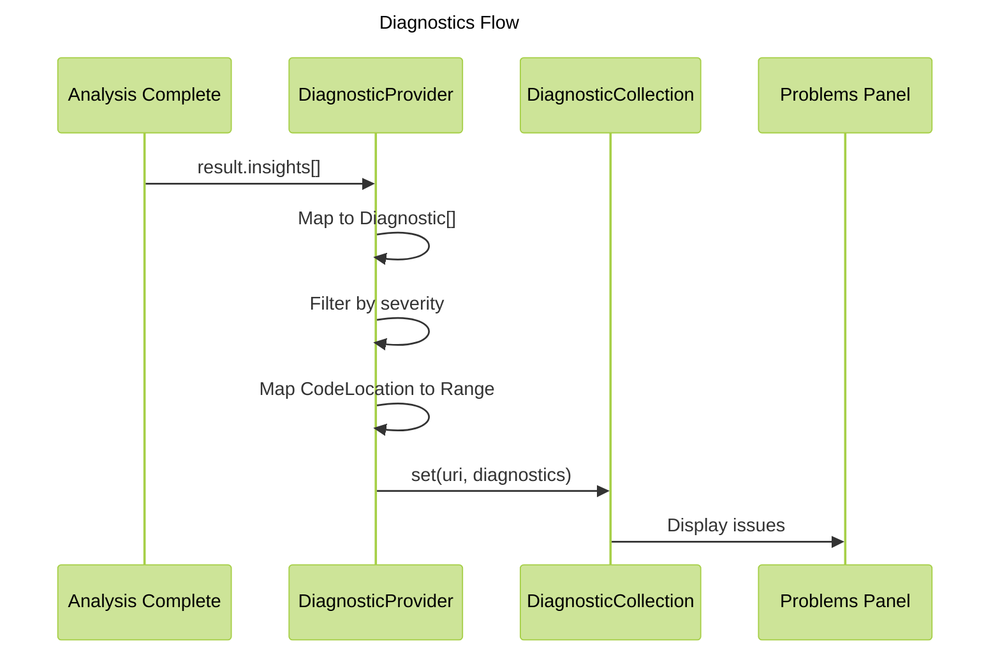

# Phase 2: Diagnostics

**Purpose**: Integrate analysis results into VSCode's Problems panel with severity-based diagnostics.

**Dependencies**: Phase 0 (Infrastructure), Phase 1 (Analyze Command)

**Deliverables**: Diagnostic provider, severity mapping, on-save analysis integration

## Overview

Phase 2 surfaces analysis insights as VSCode diagnostics in the Problems panel:

1. DiagnosticProvider that converts `ComplexityInsight[]` to `Diagnostic[]`
2. Severity mapping from Vipr (`info`|`warning`|`critical`) to VSCode (`Information`|`Warning`|`Error`)
3. Navigate to issue locations by clicking diagnostics
4. Optional on-save automatic analysis
5. Diagnostic filtering by minimum severity level

## Architecture Diagram



## File Changes

### 1. Diagnostic Provider

**File**: `src/providers/diagnostic-provider.ts`

```typescript
import * as vscode from 'vscode';
import type { AggregatedResult, ComplexityInsight, CodeLocation } from '@vipr/common';
import type { DiagnosticSeverityLevel } from '../types/config';

/**
 * Provides diagnostics from analysis results
 */
export class DiagnosticProvider {
  private diagnosticCollection: vscode.DiagnosticCollection;

  constructor() {
    this.diagnosticCollection = vscode.languages.createDiagnosticCollection('vipr');
  }

  /**
   * Update diagnostics for a file
   */
  updateDiagnostics(
    uri: vscode.Uri,
    result: AggregatedResult,
    minSeverity: DiagnosticSeverityLevel = 'all'
  ): vscode.Diagnostic[] {
    const diagnostics = this.createDiagnostics(result.insights, minSeverity);
    this.diagnosticCollection.set(uri, diagnostics);
    return diagnostics;
  }

  /**
   * Clear diagnostics for a file
   */
  clearDiagnostics(uri: vscode.Uri): void {
    this.diagnosticCollection.delete(uri);
  }

  /**
   * Clear all diagnostics
   */
  clearAll(): void {
    this.diagnosticCollection.clear();
  }

  /**
   * Dispose the diagnostic collection
   */
  dispose(): void {
    this.diagnosticCollection.dispose();
  }

  /**
   * Create diagnostics from insights
   */
  private createDiagnostics(
    insights: ComplexityInsight[],
    minSeverity: DiagnosticSeverityLevel
  ): vscode.Diagnostic[] {
    return insights
      .filter(insight => this.meetsMinimumSeverity(insight.severity, minSeverity))
      .map(insight => this.insightToDiagnostic(insight));
  }

  /**
   * Convert ComplexityInsight to VSCode Diagnostic
   */
  private insightToDiagnostic(insight: ComplexityInsight): vscode.Diagnostic {
    const range = this.locationToRange(insight.location);
    const severity = this.mapSeverity(insight.severity);

    const diagnostic = new vscode.Diagnostic(range, insight.message, severity);
    diagnostic.source = 'Vipr';
    diagnostic.code = insight.category;

    if (insight.suggestion) {
      diagnostic.relatedInformation = [
        new vscode.DiagnosticRelatedInformation(
          new vscode.Location(vscode.Uri.file(''), range),
          `Suggestion: ${insight.suggestion}`
        ),
      ];
    }

    return diagnostic;
  }

  /**
   * Convert CodeLocation to VSCode Range
   */
  private locationToRange(location?: CodeLocation): vscode.Range {
    if (!location) {
      return new vscode.Range(0, 0, 0, 0);
    }

    const startLine = Math.max(0, location.line - 1); // Convert 1-indexed to 0-indexed
    const startCol = location.column ?? 0;
    const endLine = location.endLine ? Math.max(0, location.endLine - 1) : startLine;
    const endCol = location.endColumn ?? startCol + 1;

    return new vscode.Range(startLine, startCol, endLine, endCol);
  }

  /**
   * Map Vipr severity to VSCode DiagnosticSeverity
   */
  private mapSeverity(severity: string): vscode.DiagnosticSeverity {
    switch (severity) {
      case 'critical':
        return vscode.DiagnosticSeverity.Error;
      case 'warning':
        return vscode.DiagnosticSeverity.Warning;
      case 'info':
      default:
        return vscode.DiagnosticSeverity.Information;
    }
  }

  /**
   * Check if insight meets minimum severity level
   */
  private meetsMinimumSeverity(severity: string, minSeverity: DiagnosticSeverityLevel): boolean {
    if (minSeverity === 'all') return true;
    if (minSeverity === 'error') return severity === 'critical';
    if (minSeverity === 'warning') return severity === 'critical' || severity === 'warning';
    return false;
  }
}
```

### 2. Update Analyze Command Integration

**File**: `src/commands/analyze-file.ts` (additions)

```typescript
import { DiagnosticProvider } from '../providers/diagnostic-provider';

// In analyzeFile function, after storing result:
const { diagnosticProvider, configManager } = getExtensionState();
const minSeverity = configManager.get('diagnosticSeverity');
const diagnostics = diagnosticProvider.updateDiagnostics(targetUri, result, minSeverity);

// Update state with diagnostics
analysisManager.setState({
  uri: targetUri,
  result,
  diagnostics,
  analyzedAt: new Date(),
  contentHash,
  isAnalyzing: false,
});
```

### 3. On-Save Analysis

**File**: `src/core/on-save-handler.ts`

```typescript
import * as vscode from 'vscode';
import { analyzeFile } from '../commands/analyze-file';
import { getExtensionState } from '../extension';

/**
 * Handle file save events for automatic analysis
 */
export class OnSaveHandler {
  private disposable: vscode.Disposable;

  constructor() {
    this.disposable = vscode.workspace.onDidSaveTextDocument(this.onDidSave, this);
  }

  /**
   * Handle document save
   */
  private async onDidSave(document: vscode.TextDocument): Promise<void> {
    const { configManager } = getExtensionState();

    if (!configManager.get('analyzeOnSave')) {
      return;
    }

    // Check if file is eligible
    const ext = document.fileName.split('.').pop()?.toLowerCase();
    if (!['ts', 'tsx', 'js', 'jsx'].includes(ext ?? '')) {
      return;
    }

    // Trigger analysis
    await analyzeFile(document.uri);
  }

  /**
   * Dispose handler
   */
  dispose(): void {
    this.disposable.dispose();
  }
}
```

### 4. Update Extension State

**File**: `src/extension.ts` (additions)

```typescript
import { DiagnosticProvider } from './providers/diagnostic-provider';
import { OnSaveHandler } from './core/on-save-handler';

interface ExtensionState {
  // ... existing
  diagnosticProvider: DiagnosticProvider;
  onSaveHandler: OnSaveHandler;
}

export async function activate(context: vscode.ExtensionContext): Promise<void> {
  // ... existing initialization

  const diagnosticProvider = new DiagnosticProvider();
  const onSaveHandler = new OnSaveHandler();

  context.subscriptions.push(diagnosticProvider, onSaveHandler);

  state = {
    // ... existing
    diagnosticProvider,
    onSaveHandler,
  };
}
```

## Configuration

No additional package.json changes required (configuration already defined in Phase 0).

## Acceptance Criteria

- [ ] Analysis results appear in Problems panel
- [ ] Diagnostics show correct severity icons (error, warning, info)
- [ ] Clicking diagnostic navigates to correct line and column
- [ ] Severity mapping is correct (critical→Error, warning→Warning, info→Information)
- [ ] Diagnostic filtering respects minimum severity setting
- [ ] Diagnostics include suggestion as related information when available
- [ ] On-save analysis triggers when enabled in settings
- [ ] On-save analysis respects file type eligibility
- [ ] Diagnostics are cleared when file is closed
- [ ] Diagnostics update when file is re-analyzed

## Testing Strategy

### Unit Tests

**File**: `src/providers/diagnostic-provider.test.ts`

```typescript
import { describe, it, expect } from 'vitest';
import * as vscode from 'vscode';
import { DiagnosticProvider } from './diagnostic-provider';

describe('DiagnosticProvider', () => {
  it('should map critical severity to Error', () => {
    const provider = new DiagnosticProvider();
    const insights = [
      {
        severity: 'critical' as const,
        category: 'security',
        message: 'Security issue',
      },
    ];

    const mockResult = {
      filePath: '/test.ts',
      overallScore: 50,
      insights,
      pluginResults: new Map(),
      errors: [],
      analyzedAt: new Date().toISOString(),
    };

    const diagnostics = provider.updateDiagnostics(vscode.Uri.file('/test.ts'), mockResult, 'all');

    expect(diagnostics[0].severity).toBe(vscode.DiagnosticSeverity.Error);
  });

  it('should filter by minimum severity', () => {
    const provider = new DiagnosticProvider();
    const insights = [
      { severity: 'info' as const, category: 'test', message: 'Info' },
      { severity: 'warning' as const, category: 'test', message: 'Warning' },
      { severity: 'critical' as const, category: 'test', message: 'Critical' },
    ];

    const mockResult = {
      filePath: '/test.ts',
      overallScore: 50,
      insights,
      pluginResults: new Map(),
      errors: [],
      analyzedAt: new Date().toISOString(),
    };

    const diagnostics = provider.updateDiagnostics(
      vscode.Uri.file('/test.ts'),
      mockResult,
      'error'
    );

    expect(diagnostics.length).toBe(1);
    expect(diagnostics[0].message).toBe('Critical');
  });
});
```

### Manual Verification

1. Analyze a file with issues
2. Open Problems panel (View → Problems)
3. Verify issues appear with correct severity icons
4. Click an issue and verify navigation to correct location
5. Change `vipr.diagnosticSeverity` to `warning`
6. Re-analyze and verify info-level issues are hidden
7. Enable `vipr.analyzeOnSave`
8. Edit and save a file
9. Verify automatic analysis triggers
10. Verify diagnostics update

## Summary

Phase 2 integrates analysis results into VSCode's native Problems panel, providing users with a familiar interface for viewing and navigating code quality issues. The diagnostic system respects VSCode conventions and user preferences for severity filtering.
