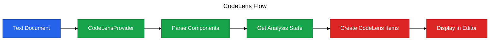

# Phase 3: CodeLens

**Purpose**: Display inline score hints above React components using VSCode's CodeLens feature.

**Dependencies**: Phase 0 (Infrastructure), Phase 2 (Diagnostics)

**Deliverables**: CodeLens provider showing component scores, configurable on/off

## Overview

Phase 3 adds inline visual hints directly in the editor:

1. CodeLensProvider that detects React components
2. Display component scores above function/class declarations
3. Click-to-analyze action on CodeLens
4. Configurable via `vipr.showInlineHints` setting
5. Updates automatically when file is analyzed

## Architecture Diagram



## File Changes

### 1. CodeLens Provider

**File**: `src/providers/codelens-provider.ts`

```typescript
import * as vscode from 'vscode';
import { Project, SourceFile, SyntaxKind } from 'ts-morph';
import { getExtensionState } from '../extension';

/**
 * Provides CodeLens hints showing component scores
 */
export class ViprCodeLensProvider implements vscode.CodeLensProvider {
  private project: Project;
  private onDidChangeEmitter = new vscode.EventEmitter<void>();
  public readonly onDidChangeCodeLenses = this.onDidChangeEmitter.event;

  constructor() {
    this.project = new Project({ useInMemoryFileSystem: true });
  }

  /**
   * Trigger CodeLens refresh
   */
  refresh(): void {
    this.onDidChangeEmitter.fire();
  }

  /**
   * Provide CodeLens items for document
   */
  async provideCodeLenses(
    document: vscode.TextDocument,
    token: vscode.CancellationToken
  ): Promise<vscode.CodeLens[]> {
    const { configManager, analysisManager } = getExtensionState();

    if (!configManager.get('showInlineHints')) {
      return [];
    }

    // Get analysis state
    const state = analysisManager.getState(document.uri);
    if (!state || !state.result) {
      return [];
    }

    // Parse document to find components
    const sourceFile = this.project.createSourceFile(document.uri.fsPath, document.getText(), {
      overwrite: true,
    });

    const components = this.findComponents(sourceFile);
    const codeLenses: vscode.CodeLens[] = [];

    for (const component of components) {
      const range = new vscode.Range(
        document.positionAt(component.pos),
        document.positionAt(component.end)
      );

      // Get component-specific score if available, otherwise use file score
      const score = state.result.overallScore;
      const scoreText = this.formatScore(score);

      const codeLens = new vscode.CodeLens(range, {
        title: `$(pulse) ${scoreText}`,
        tooltip: `Vipr Score: ${score}/100\nClick to re-analyze`,
        command: 'vipr.analyzeFile',
        arguments: [document.uri],
      });

      codeLenses.push(codeLens);
    }

    return codeLenses;
  }

  /**
   * Find React components in source file
   */
  private findComponents(sourceFile: SourceFile): Array<{ pos: number; end: number }> {
    const components: Array<{ pos: number; end: number }> = [];

    // Find function components
    sourceFile.getFunctions().forEach(func => {
      if (this.isReactComponent(func.getName() ?? '')) {
        components.push({
          pos: func.getPos(),
          end: func.getEnd(),
        });
      }
    });

    // Find arrow function components
    sourceFile.getVariableDeclarations().forEach(decl => {
      const initializer = decl.getInitializer();
      if (
        initializer &&
        (initializer.getKind() === SyntaxKind.ArrowFunction ||
          initializer.getKind() === SyntaxKind.FunctionExpression) &&
        this.isReactComponent(decl.getName())
      ) {
        components.push({
          pos: decl.getPos(),
          end: decl.getEnd(),
        });
      }
    });

    // Find class components
    sourceFile.getClasses().forEach(cls => {
      const baseTypes = cls.getBaseTypes();
      if (
        baseTypes.some(
          t =>
            t.getText().includes('Component') ||
            t.getText().includes('PureComponent') ||
            t.getText().includes('React.Component')
        )
      ) {
        components.push({
          pos: cls.getPos(),
          end: cls.getEnd(),
        });
      }
    });

    return components;
  }

  /**
   * Check if name looks like a React component (PascalCase)
   */
  private isReactComponent(name: string): boolean {
    return /^[A-Z][a-zA-Z0-9]*$/.test(name);
  }

  /**
   * Format score with color indicator
   */
  private formatScore(score: number): string {
    const level = this.getScoreLevel(score);
    return `${score}/100 (${level})`;
  }

  /**
   * Get score level
   */
  private getScoreLevel(score: number): string {
    if (score >= 80) return 'Excellent';
    if (score >= 60) return 'Good';
    if (score >= 40) return 'Fair';
    return 'Poor';
  }

  /**
   * Dispose provider
   */
  dispose(): void {
    this.onDidChangeEmitter.dispose();
  }
}
```

### 2. Register CodeLens Provider

**File**: `src/extension.ts` (additions)

```typescript
import { ViprCodeLensProvider } from './providers/codelens-provider';

interface ExtensionState {
  // ... existing
  codeLensProvider: ViprCodeLensProvider;
}

export async function activate(context: vscode.ExtensionContext): Promise<void> {
  // ... existing initialization

  const codeLensProvider = new ViprCodeLensProvider();

  // Register CodeLens provider for TypeScript/JavaScript files
  context.subscriptions.push(
    vscode.languages.registerCodeLensProvider(
      [
        { language: 'typescript', scheme: 'file' },
        { language: 'typescriptreact', scheme: 'file' },
        { language: 'javascript', scheme: 'file' },
        { language: 'javascriptreact', scheme: 'file' },
      ],
      codeLensProvider
    ),
    codeLensProvider
  );

  state = {
    // ... existing
    codeLensProvider,
  };
}
```

### 3. Update After Analysis

**File**: `src/commands/analyze-file.ts` (additions)

```typescript
// After successful analysis and storing state:
const { codeLensProvider } = getExtensionState();
codeLensProvider.refresh();
```

## Configuration

No additional package.json changes required (configuration already defined in Phase 0).

## Acceptance Criteria

- [ ] CodeLens appears above React components after analysis
- [ ] CodeLens shows score in format "XX/100 (Level)"
- [ ] CodeLens respects `vipr.showInlineHints` setting
- [ ] Clicking CodeLens triggers re-analysis
- [ ] CodeLens updates after each analysis
- [ ] CodeLens appears for function components
- [ ] CodeLens appears for arrow function components
- [ ] CodeLens appears for class components
- [ ] CodeLens does not appear for non-component functions
- [ ] CodeLens includes tooltip with full score details

## Testing Strategy

### Unit Tests

**File**: `src/providers/codelens-provider.test.ts`

```typescript
import { describe, it, expect } from 'vitest';
import { Project } from 'ts-morph';
import { ViprCodeLensProvider } from './codelens-provider';

describe('ViprCodeLensProvider', () => {
  it('should detect function components', () => {
    const provider = new ViprCodeLensProvider();
    const project = new Project({ useInMemoryFileSystem: true });
    const sourceFile = project.createSourceFile(
      'test.tsx',
      `
        function MyComponent() {
          return <div>Hello</div>;
        }
      `
    );

    const components = (provider as any).findComponents(sourceFile);
    expect(components.length).toBe(1);
  });

  it('should detect arrow function components', () => {
    const provider = new ViprCodeLensProvider();
    const project = new Project({ useInMemoryFileSystem: true });
    const sourceFile = project.createSourceFile(
      'test.tsx',
      `
        const MyComponent = () => {
          return <div>Hello</div>;
        };
      `
    );

    const components = (provider as any).findComponents(sourceFile);
    expect(components.length).toBe(1);
  });

  it('should detect class components', () => {
    const provider = new ViprCodeLensProvider();
    const project = new Project({ useInMemoryFileSystem: true });
    const sourceFile = project.createSourceFile(
      'test.tsx',
      `
        import { Component } from 'react';
        class MyComponent extends Component {
          render() { return <div>Hello</div>; }
        }
      `
    );

    const components = (provider as any).findComponents(sourceFile);
    expect(components.length).toBe(1);
  });

  it('should not detect non-component functions', () => {
    const provider = new ViprCodeLensProvider();
    const project = new Project({ useInMemoryFileSystem: true });
    const sourceFile = project.createSourceFile(
      'test.tsx',
      `
        function myHelper() {
          return 42;
        }
      `
    );

    const components = (provider as any).findComponents(sourceFile);
    expect(components.length).toBe(0);
  });
});
```

### Manual Verification

1. Open a React file with components
2. Analyze the file
3. Verify CodeLens appears above each component
4. Verify score is displayed correctly
5. Hover over CodeLens to see tooltip
6. Click CodeLens to trigger re-analysis
7. Disable `vipr.showInlineHints` in settings
8. Verify CodeLens disappears
9. Re-enable setting
10. Verify CodeLens reappears

## Summary

Phase 3 provides inline visual feedback directly in the editor, making score information immediately visible without needing to open the Problems panel or sidebar. The CodeLens integration follows VSCode conventions and respects user preferences.
