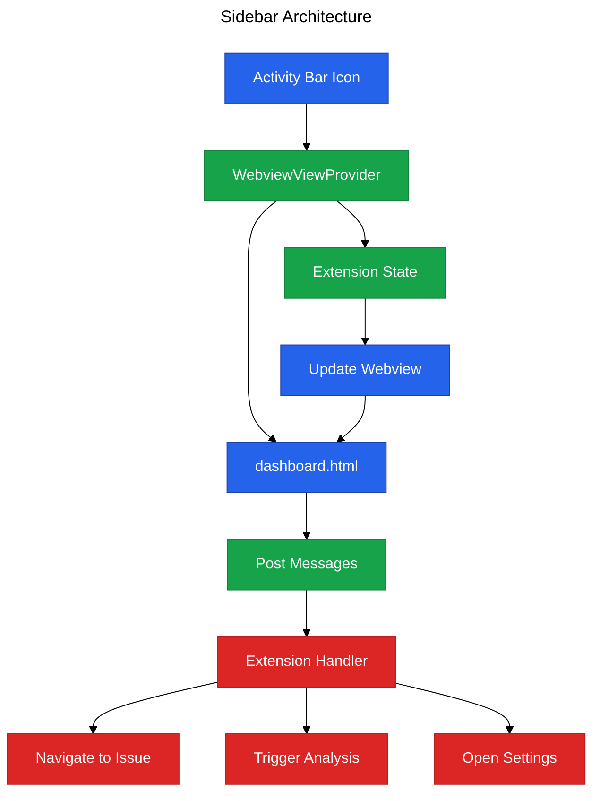

# Phase 4: Sidebar Dashboard

**Purpose**: Provide an interactive sidebar webview dashboard showing overall score, plugin breakdown, and navigation to issues.

**Dependencies**: Phase 0 (Infrastructure), Phase 2 (Diagnostics)

**Deliverables**: Activity Bar icon, webview dashboard, two-way message protocol, theme integration

## Overview

Phase 4 adds a dedicated sidebar view:

1. Custom Activity Bar icon for Vipr
2. WebviewView provider for dashboard content
3. Overall score display with visual indicator
4. Plugin-by-plugin breakdown with report scores
5. Top issues list with click-to-navigate
6. Message protocol for webview↔extension communication
7. Theme-aware styling (light/dark mode)

## Architecture Diagram



## File Changes

### 1. Sidebar View Provider

**File**: `src/views/sidebar-view-provider.ts`

```typescript
import * as vscode from 'vscode';
import { getExtensionState } from '../extension';
import type { DashboardData, WebviewMessage, WebviewToExtensionMessage } from '../types/webview';
import { getScoreLevel } from '../types/webview';

/**
 * Webview view provider for sidebar dashboard
 */
export class SidebarViewProvider implements vscode.WebviewViewProvider {
  public static readonly viewType = 'vipr.sidebarView';
  private view?: vscode.WebviewView;

  constructor(private readonly extensionUri: vscode.Uri) {}

  /**
   * Resolve webview view
   */
  public resolveWebviewView(
    webviewView: vscode.WebviewView,
    context: vscode.WebviewViewResolveContext,
    token: vscode.CancellationToken
  ): void | Thenable<void> {
    this.view = webviewView;

    webviewView.webview.options = {
      enableScripts: true,
      localResourceRoots: [this.extensionUri],
    };

    webviewView.webview.html = this.getHtmlForWebview(webviewView.webview);

    // Handle messages from webview
    webviewView.webview.onDidReceiveMessage(this.handleMessage.bind(this));

    // Send initial data
    this.updateView();
  }

  /**
   * Update view with current analysis state
   */
  public updateView(uri?: vscode.Uri): void {
    if (!this.view) {
      return;
    }

    const targetUri = uri ?? vscode.window.activeTextEditor?.document.uri;
    if (!targetUri) {
      return;
    }

    const { analysisManager, licenseValidator, configManager, pluginLoader } = getExtensionState();

    const state = analysisManager.getState(targetUri);
    if (!state) {
      return;
    }

    const licenseKey = configManager.get('licenseKey');
    const licenseTier = licenseValidator.getTier(licenseKey);
    const registry = pluginLoader.getPresenterRegistry();

    // Build dashboard data
    const data: DashboardData = {
      fileUri: targetUri.toString(),
      overallScore: state.result.overallScore,
      scoreLevel: getScoreLevel(state.result.overallScore),
      plugins: this.buildPluginData(state.result, registry, licenseTier),
      topIssues: this.buildTopIssues(state.result.insights),
      analyzedAt: state.analyzedAt.toISOString(),
      isAnalyzing: state.isAnalyzing,
      licenseTier,
    };

    this.view.webview.postMessage({
      type: 'updateAnalysis',
      payload: data,
    });
  }

  /**
   * Build plugin breakdown data
   */
  private buildPluginData(result: any, registry: any, licenseTier: any): any[] {
    const plugins = [];

    for (const [pluginId, pluginResult] of result.pluginResults) {
      const presenters = registry.getByPlugin(pluginId);
      const reports = presenters.map((presenter: any) => {
        const metadata = presenter.getMetadata();
        const requiresLicense = metadata.reportType !== 'overview';
        const hasAccess = !requiresLicense || licenseTier !== 'free';

        return {
          reportType: metadata.reportType,
          label: metadata.label,
          icon: metadata.icon,
          score: pluginResult.score,
          scoreLevel: pluginResult.score ? getScoreLevel(pluginResult.score) : undefined,
          issueCount: pluginResult.insights.filter((i: any) => i.category === metadata.reportType)
            .length,
          requiresLicense,
          hasAccess,
        };
      });

      plugins.push({
        id: pluginId,
        name: pluginResult.pluginId,
        score: pluginResult.score,
        scoreLevel: pluginResult.score ? getScoreLevel(pluginResult.score) : undefined,
        reports,
        issueCount: pluginResult.insights.length,
      });
    }

    return plugins;
  }

  /**
   * Build top issues list
   */
  private buildTopIssues(insights: any[]): any[] {
    return insights
      .filter(i => i.severity === 'critical' || i.severity === 'warning')
      .slice(0, 10)
      .map(i => ({
        message: i.message,
        severity: i.severity,
        category: i.category,
        filePath: '',
        line: i.location?.line ?? 0,
        column: i.location?.column ?? 0,
        autoFixable: i.autoFixable ?? false,
        suggestion: i.suggestion,
      }));
  }

  /**
   * Handle messages from webview
   */
  private async handleMessage(message: WebviewToExtensionMessage): Promise<void> {
    switch (message.type) {
      case 'navigateToIssue':
        await this.navigateToIssue(message.payload);
        break;
      case 'refreshAnalysis':
        await vscode.commands.executeCommand('vipr.analyzeFile');
        break;
      case 'analyzeWorkspace':
        await vscode.commands.executeCommand('vipr.analyzeWorkspace');
        break;
      case 'openSettings':
        await vscode.commands.executeCommand('workbench.action.openSettings', 'vipr');
        break;
    }
  }

  /**
   * Navigate to issue in editor
   */
  private async navigateToIssue(payload: any): Promise<void> {
    const editor = vscode.window.activeTextEditor;
    if (!editor) {
      return;
    }

    const position = new vscode.Position(payload.line - 1, payload.column);
    editor.selection = new vscode.Selection(position, position);
    editor.revealRange(new vscode.Range(position, position), vscode.TextEditorRevealType.InCenter);
  }

  /**
   * Get HTML content for webview
   */
  private getHtmlForWebview(webview: vscode.Webview): string {
    const styleUri = webview.asWebviewUri(
      vscode.Uri.joinPath(this.extensionUri, 'dist', 'webview', 'dashboard.css')
    );

    const scriptUri = webview.asWebviewUri(
      vscode.Uri.joinPath(this.extensionUri, 'dist', 'webview', 'dashboard.js')
    );

    return `<!DOCTYPE html>
<html lang="en">
<head>
  <meta charset="UTF-8">
  <meta name="viewport" content="width=device-width, initial-scale=1.0">
  <link href="${styleUri}" rel="stylesheet">
  <title>Vipr Dashboard</title>
</head>
<body>
  <div id="dashboard">
    <div class="loading">Loading...</div>
  </div>
  <script src="${scriptUri}"></script>
</body>
</html>`;
  }
}
```

### 2. Dashboard HTML Template

**File**: `src/webview/dashboard.html`

```html
<!DOCTYPE html>
<html lang="en">
  <head>
    <meta charset="UTF-8" />
    <meta name="viewport" content="width=device-width, initial-scale=1.0" />
    <title>Vipr Dashboard</title>
  </head>
  <body>
    <div id="dashboard" class="dashboard">
      <div class="header">
        <div class="score-circle" id="scoreCircle">
          <div class="score-value" id="scoreValue">--</div>
          <div class="score-label">Overall</div>
        </div>
        <div class="actions">
          <button id="refreshBtn" class="btn btn-primary">Refresh</button>
          <button id="settingsBtn" class="btn btn-secondary">Settings</button>
        </div>
      </div>

      <div class="plugins" id="plugins"></div>

      <div class="issues" id="issues">
        <h3>Top Issues</h3>
        <div id="issuesList"></div>
      </div>
    </div>
  </body>
</html>
```

### 3. Dashboard Styles

**File**: `src/webview/dashboard.css`

```css
body {
  padding: 0;
  margin: 0;
  font-family: var(--vscode-font-family);
  color: var(--vscode-foreground);
  background-color: var(--vscode-sideBar-background);
}

.dashboard {
  padding: 16px;
}

.header {
  display: flex;
  flex-direction: column;
  align-items: center;
  gap: 16px;
  margin-bottom: 24px;
  padding-bottom: 16px;
  border-bottom: 1px solid var(--vscode-panel-border);
}

.score-circle {
  width: 120px;
  height: 120px;
  border-radius: 50%;
  display: flex;
  flex-direction: column;
  align-items: center;
  justify-content: center;
  border: 4px solid var(--vscode-textLink-foreground);
  background-color: var(--vscode-editor-background);
}

.score-circle.excellent {
  border-color: #22c55e;
}
.score-circle.good {
  border-color: #3b82f6;
}
.score-circle.fair {
  border-color: #f59e0b;
}
.score-circle.poor {
  border-color: #ef4444;
}

.score-value {
  font-size: 32px;
  font-weight: bold;
}

.score-label {
  font-size: 12px;
  opacity: 0.7;
}

.actions {
  display: flex;
  gap: 8px;
}

.btn {
  padding: 6px 12px;
  border: 1px solid var(--vscode-button-border);
  background-color: var(--vscode-button-background);
  color: var(--vscode-button-foreground);
  cursor: pointer;
  border-radius: 2px;
}

.btn:hover {
  background-color: var(--vscode-button-hoverBackground);
}

.plugins {
  margin-bottom: 24px;
}

.plugin {
  margin-bottom: 16px;
  padding: 12px;
  background-color: var(--vscode-editor-background);
  border-radius: 4px;
  border: 1px solid var(--vscode-panel-border);
}

.plugin-header {
  display: flex;
  justify-content: space-between;
  margin-bottom: 8px;
}

.plugin-name {
  font-weight: bold;
}

.plugin-score {
  font-size: 14px;
  opacity: 0.8;
}

.reports {
  display: flex;
  flex-direction: column;
  gap: 4px;
}

.report {
  display: flex;
  justify-content: space-between;
  padding: 4px 8px;
  font-size: 13px;
}

.report.locked {
  opacity: 0.5;
}

.issues h3 {
  margin-bottom: 12px;
  font-size: 14px;
  font-weight: bold;
}

.issue {
  padding: 8px;
  margin-bottom: 8px;
  background-color: var(--vscode-editor-background);
  border-left: 3px solid var(--vscode-inputValidation-errorBorder);
  border-radius: 2px;
  cursor: pointer;
}

.issue:hover {
  background-color: var(--vscode-list-hoverBackground);
}

.issue.warning {
  border-left-color: var(--vscode-inputValidation-warningBorder);
}

.issue.info {
  border-left-color: var(--vscode-inputValidation-infoBorder);
}

.issue-message {
  font-size: 13px;
  margin-bottom: 4px;
}

.issue-location {
  font-size: 11px;
  opacity: 0.7;
}
```

### 4. Dashboard Client Script

**File**: `src/webview/dashboard.js`

```javascript
(function () {
  const vscode = acquireVsCodeApi();

  // Handle messages from extension
  window.addEventListener('message', event => {
    const message = event.data;

    switch (message.type) {
      case 'updateAnalysis':
        updateDashboard(message.payload);
        break;
    }
  });

  function updateDashboard(data) {
    // Update score circle
    const scoreCircle = document.getElementById('scoreCircle');
    const scoreValue = document.getElementById('scoreValue');
    scoreValue.textContent = data.overallScore;
    scoreCircle.className = `score-circle ${data.scoreLevel}`;

    // Update plugins
    const pluginsContainer = document.getElementById('plugins');
    pluginsContainer.innerHTML = data.plugins
      .map(
        plugin => `
      <div class="plugin">
        <div class="plugin-header">
          <div class="plugin-name">${plugin.name}</div>
          <div class="plugin-score">${plugin.score ?? '--'}/100</div>
        </div>
        <div class="reports">
          ${plugin.reports
            .map(
              report => `
            <div class="report ${report.hasAccess ? '' : 'locked'}">
              <span>${report.icon ?? ''} ${report.label}</span>
              <span>${report.score ?? '--'}/100</span>
            </div>
          `
            )
            .join('')}
        </div>
      </div>
    `
      )
      .join('');

    // Update issues
    const issuesList = document.getElementById('issuesList');
    issuesList.innerHTML = data.topIssues
      .map(
        issue => `
      <div class="issue ${issue.severity}" onclick="navigateToIssue(${issue.line}, ${issue.column})">
        <div class="issue-message">${issue.message}</div>
        <div class="issue-location">Line ${issue.line}</div>
      </div>
    `
      )
      .join('');
  }

  // Event handlers
  document.getElementById('refreshBtn')?.addEventListener('click', () => {
    vscode.postMessage({ type: 'refreshAnalysis' });
  });

  document.getElementById('settingsBtn')?.addEventListener('click', () => {
    vscode.postMessage({ type: 'openSettings' });
  });

  window.navigateToIssue = (line, column) => {
    vscode.postMessage({ type: 'navigateToIssue', payload: { line, column } });
  };
})();
```

### 5. Register View Provider

**File**: `src/extension.ts` (additions)

```typescript
import { SidebarViewProvider } from './views/sidebar-view-provider';

export async function activate(context: vscode.ExtensionContext): Promise<void> {
  // ... existing initialization

  const sidebarProvider = new SidebarViewProvider(context.extensionUri);
  context.subscriptions.push(
    vscode.window.registerWebviewViewProvider(SidebarViewProvider.viewType, sidebarProvider)
  );

  state = {
    // ... existing
    sidebarProvider,
  };
}
```

## Configuration

**File**: `package.json` (contributes section)

```json
{
  "contributes": {
    "viewsContainers": {
      "activitybar": [
        {
          "id": "vipr",
          "title": "Vipr",
          "icon": "resources/vipr-icon.svg"
        }
      ]
    },
    "views": {
      "vipr": [
        {
          "id": "vipr.sidebarView",
          "name": "Dashboard",
          "type": "webview"
        }
      ]
    }
  }
}
```

## Acceptance Criteria

- [ ] Activity Bar shows Vipr icon
- [ ] Clicking icon opens sidebar dashboard
- [ ] Dashboard displays overall score with color-coded circle
- [ ] Plugin breakdown shows all loaded plugins
- [ ] Report scores display for each plugin
- [ ] Locked reports show visual indicator for free tier
- [ ] Top issues list shows critical/warning issues
- [ ] Clicking issue navigates to location in editor
- [ ] Refresh button triggers re-analysis
- [ ] Settings button opens extension settings
- [ ] Theme changes (light/dark) update dashboard colors
- [ ] Dashboard updates automatically after analysis

## Testing Strategy

### Manual Verification

1. Click Vipr icon in Activity Bar
2. Verify dashboard opens in sidebar
3. Analyze a file
4. Verify score circle updates with color
5. Verify plugin breakdown appears
6. Verify locked reports show for free tier
7. Click a top issue
8. Verify navigation to issue location
9. Click refresh button
10. Verify re-analysis triggers
11. Switch between light/dark theme
12. Verify dashboard styling updates

## Summary

Phase 4 provides a comprehensive dashboard view that serves as the primary interface for interacting with Vipr analysis results. The webview-based implementation allows for rich, interactive UI while maintaining clear separation between extension and presentation logic.
