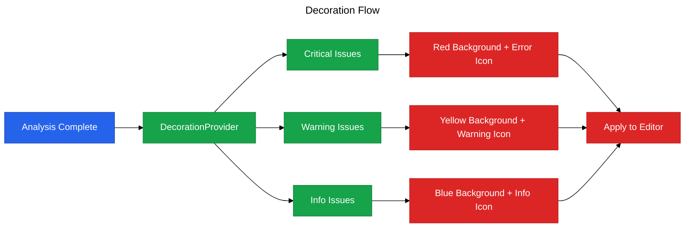

# Phase 5: Editor Decorations

**Purpose**: Highlight code issues directly in the editor with gutter icons, background colors, and hover tooltips.

**Dependencies**: Phase 0 (Infrastructure), Phase 2 (Diagnostics)

**Deliverables**: TextEditorDecorationType for severity levels, gutter icons, hover tooltips

## Overview

Phase 5 adds visual highlighting in the editor:

1. Colored background highlighting for issue ranges
2. Gutter icons indicating severity (error, warning, info)
3. Hover tooltips showing full issue details
4. Configurable via `vipr.showDecorations` setting
5. Updates automatically when analysis completes

## Architecture



## File Changes

### 1. Decoration Provider

**File**: `src/providers/decoration-provider.ts`

```typescript
import * as vscode from 'vscode';
import type { ComplexityInsight, CodeLocation } from '@vipr/common';

/**
 * Provides editor decorations for analysis issues
 */
export class DecorationProvider {
  private criticalDecorationType: vscode.TextEditorDecorationType;
  private warningDecorationType: vscode.TextEditorDecorationType;
  private infoDecorationType: vscode.TextEditorDecorationType;

  constructor() {
    this.criticalDecorationType = this.createDecorationType('critical');
    this.warningDecorationType = this.createDecorationType('warning');
    this.infoDecorationType = this.createDecorationType('info');
  }

  /**
   * Update decorations for editor
   */
  updateDecorations(editor: vscode.TextEditor, insights: ComplexityInsight[]): void {
    const criticalDecorations: vscode.DecorationOptions[] = [];
    const warningDecorations: vscode.DecorationOptions[] = [];
    const infoDecorations: vscode.DecorationOptions[] = [];

    for (const insight of insights) {
      const decoration = this.createDecoration(insight);

      switch (insight.severity) {
        case 'critical':
          criticalDecorations.push(decoration);
          break;
        case 'warning':
          warningDecorations.push(decoration);
          break;
        case 'info':
          infoDecorations.push(decoration);
          break;
      }
    }

    editor.setDecorations(this.criticalDecorationType, criticalDecorations);
    editor.setDecorations(this.warningDecorationType, warningDecorations);
    editor.setDecorations(this.infoDecorationType, infoDecorations);
  }

  /**
   * Clear decorations for editor
   */
  clearDecorations(editor: vscode.TextEditor): void {
    editor.setDecorations(this.criticalDecorationType, []);
    editor.setDecorations(this.warningDecorationType, []);
    editor.setDecorations(this.infoDecorationType, []);
  }

  /**
   * Clear all decorations
   */
  clearAll(): void {
    vscode.window.visibleTextEditors.forEach(editor => {
      this.clearDecorations(editor);
    });
  }

  /**
   * Dispose decoration types
   */
  dispose(): void {
    this.criticalDecorationType.dispose();
    this.warningDecorationType.dispose();
    this.infoDecorationType.dispose();
  }

  /**
   * Create decoration type for severity level
   */
  private createDecorationType(severity: string): vscode.TextEditorDecorationType {
    const colors = this.getSeverityColors(severity);

    return vscode.window.createTextEditorDecorationType({
      backgroundColor: colors.background,
      borderRadius: '2px',
      gutterIconPath: this.getGutterIcon(severity),
      gutterIconSize: 'contain',
      overviewRulerColor: colors.ruler,
      overviewRulerLane: vscode.OverviewRulerLane.Right,
    });
  }

  /**
   * Get colors for severity level
   */
  private getSeverityColors(severity: string): { background: string; ruler: string } {
    switch (severity) {
      case 'critical':
        return {
          background: 'rgba(239, 68, 68, 0.1)', // red-500 with 10% opacity
          ruler: 'rgba(239, 68, 68, 0.8)',
        };
      case 'warning':
        return {
          background: 'rgba(245, 158, 11, 0.1)', // amber-500 with 10% opacity
          ruler: 'rgba(245, 158, 11, 0.8)',
        };
      case 'info':
      default:
        return {
          background: 'rgba(59, 130, 246, 0.1)', // blue-500 with 10% opacity
          ruler: 'rgba(59, 130, 246, 0.8)',
        };
    }
  }

  /**
   * Get gutter icon for severity
   */
  private getGutterIcon(severity: string): vscode.Uri | undefined {
    // VSCode built-in codicons
    // These would be actual icon files in production
    return undefined; // Using built-in styling instead
  }

  /**
   * Create decoration from insight
   */
  private createDecoration(insight: ComplexityInsight): vscode.DecorationOptions {
    const range = this.locationToRange(insight.location);
    const hoverMessage = this.createHoverMessage(insight);

    return {
      range,
      hoverMessage,
    };
  }

  /**
   * Convert CodeLocation to Range
   */
  private locationToRange(location?: CodeLocation): vscode.Range {
    if (!location) {
      return new vscode.Range(0, 0, 0, 0);
    }

    const startLine = Math.max(0, location.line - 1);
    const startCol = location.column ?? 0;
    const endLine = location.endLine ? Math.max(0, location.endLine - 1) : startLine;
    const endCol = location.endColumn ?? startCol + 1;

    return new vscode.Range(startLine, startCol, endLine, endCol);
  }

  /**
   * Create hover message for insight
   */
  private createHoverMessage(insight: ComplexityInsight): vscode.MarkdownString {
    const md = new vscode.MarkdownString();
    md.isTrusted = true;

    md.appendMarkdown(`**Vipr: ${this.getSeverityLabel(insight.severity)}**\n\n`);
    md.appendMarkdown(`${insight.message}\n\n`);

    if (insight.suggestion) {
      md.appendMarkdown(`*Suggestion:* ${insight.suggestion}\n\n`);
    }

    if (insight.autoFixable) {
      md.appendMarkdown(`💡 *Auto-fix available*\n\n`);
    }

    md.appendMarkdown(`Category: \`${insight.category}\``);

    return md;
  }

  /**
   * Get human-readable severity label
   */
  private getSeverityLabel(severity: string): string {
    switch (severity) {
      case 'critical':
        return 'Critical Issue';
      case 'warning':
        return 'Warning';
      case 'info':
      default:
        return 'Information';
    }
  }
}
```

### 2. Update Extension State

**File**: `src/extension.ts` (additions)

```typescript
import { DecorationProvider } from './providers/decoration-provider';

interface ExtensionState {
  // ... existing
  decorationProvider: DecorationProvider;
}

export async function activate(context: vscode.ExtensionContext): Promise<void> {
  // ... existing initialization

  const decorationProvider = new DecorationProvider();
  context.subscriptions.push(decorationProvider);

  // Update decorations when active editor changes
  context.subscriptions.push(
    vscode.window.onDidChangeActiveTextEditor(editor => {
      if (editor) {
        updateDecorationsForEditor(editor);
      }
    })
  );

  state = {
    // ... existing
    decorationProvider,
  };
}

function updateDecorationsForEditor(editor: vscode.TextEditor): void {
  const { analysisManager, decorationProvider, configManager } = getExtensionState();

  if (!configManager.get('showDecorations')) {
    decorationProvider.clearDecorations(editor);
    return;
  }

  const state = analysisManager.getState(editor.document.uri);
  if (state && state.result) {
    decorationProvider.updateDecorations(editor, state.result.insights);
  }
}
```

### 3. Update Analyze Command

**File**: `src/commands/analyze-file.ts` (additions)

```typescript
// After successful analysis:
const { decorationProvider, configManager } = getExtensionState();

if (configManager.get('showDecorations')) {
  const editor = vscode.window.activeTextEditor;
  if (editor && editor.document.uri.toString() === targetUri.toString()) {
    decorationProvider.updateDecorations(editor, result.insights);
  }
}
```

## Configuration

No additional package.json changes required (configuration already defined in Phase 0).

## Acceptance Criteria

- [ ] Critical issues show red background highlighting
- [ ] Warning issues show yellow background highlighting
- [ ] Info issues show blue background highlighting
- [ ] Gutter icons appear for issues
- [ ] Hovering over highlighted code shows tooltip with details
- [ ] Tooltip includes suggestion when available
- [ ] Tooltip indicates if auto-fix is available
- [ ] Decorations respect `vipr.showDecorations` setting
- [ ] Decorations clear when setting is disabled
- [ ] Decorations update when switching between files
- [ ] Decorations update after re-analysis

## Testing Strategy

### Manual Verification

1. Analyze a file with issues
2. Verify colored backgrounds appear in editor
3. Verify gutter icons appear in left margin
4. Hover over highlighted code
5. Verify tooltip shows issue details
6. Verify tooltip shows suggestion if available
7. Verify tooltip indicates auto-fix availability
8. Disable `vipr.showDecorations` setting
9. Verify decorations disappear
10. Re-enable setting
11. Verify decorations reappear
12. Switch to different file
13. Verify decorations update correctly

## Summary

Phase 5 provides immediate visual feedback in the editor, making issues instantly visible without requiring users to check the Problems panel. The decoration system integrates seamlessly with VSCode's editing experience and respects user preferences.
