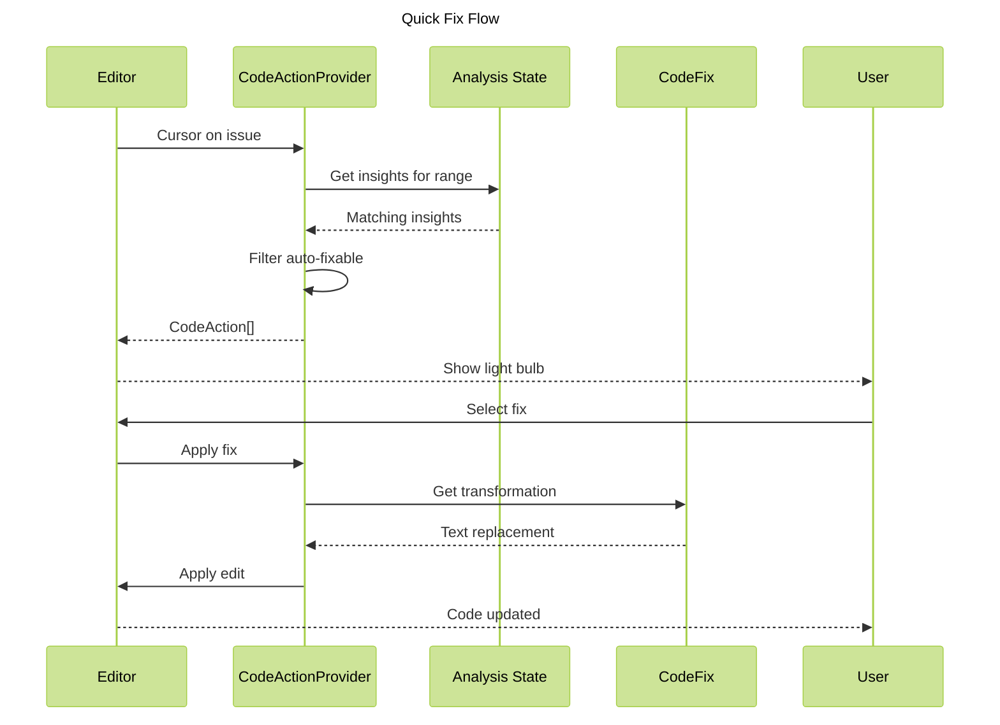

# Phase 6: Quick Fixes

**Purpose**: Provide code actions for auto-fixable issues using VSCode's light bulb feature.

**Dependencies**: Phase 0 (Infrastructure), Phase 2 (Diagnostics)

**Deliverables**: CodeActionProvider, auto-fix transformations, undo support

## Overview

Phase 6 enables automatic fixes for eligible issues:

1. CodeActionProvider that offers fixes for auto-fixable insights
2. Light bulb UI integration (appears when cursor is on issue)
3. Apply code transformations from `CodeFix` data
4. Support for undo/redo
5. Option to fix all issues of same type in file

## Architecture



## File Changes

### 1. Code Action Provider

**File**: `src/providers/codeaction-provider.ts`

```typescript
import * as vscode from 'vscode';
import { getExtensionState } from '../extension';
import type { ComplexityInsight, CodeFix } from '@vipr/common';

/**
 * Provides code actions for auto-fixable issues
 */
export class ViprCodeActionProvider implements vscode.CodeActionProvider {
  public static readonly providedCodeActionKinds = [vscode.CodeActionKind.QuickFix];

  /**
   * Provide code actions for document range
   */
  provideCodeActions(
    document: vscode.TextDocument,
    range: vscode.Range | vscode.Selection,
    context: vscode.CodeActionContext,
    token: vscode.CancellationToken
  ): vscode.CodeAction[] | undefined {
    const { analysisManager } = getExtensionState();

    const state = analysisManager.getState(document.uri);
    if (!state || !state.result) {
      return undefined;
    }

    // Find insights that overlap with the current range
    const relevantInsights = state.result.insights.filter(insight => {
      if (!insight.location || !insight.autoFixable || !insight.autoFix) {
        return false;
      }

      const insightRange = this.locationToRange(insight.location);
      return insightRange.intersection(range) !== undefined;
    });

    if (relevantInsights.length === 0) {
      return undefined;
    }

    const actions: vscode.CodeAction[] = [];

    // Create individual fix actions
    for (const insight of relevantInsights) {
      actions.push(this.createFixAction(document, insight));
    }

    // Create "fix all" action if multiple issues
    if (relevantInsights.length > 1) {
      actions.push(this.createFixAllAction(document, relevantInsights));
    }

    return actions;
  }

  /**
   * Create code action for single fix
   */
  private createFixAction(
    document: vscode.TextDocument,
    insight: ComplexityInsight
  ): vscode.CodeAction {
    const fix = insight.autoFix!;
    const action = new vscode.CodeAction(`Fix: ${insight.message}`, vscode.CodeActionKind.QuickFix);

    action.diagnostics = []; // Associate with diagnostic if available
    action.isPreferred = true;

    // Create workspace edit
    const edit = new vscode.WorkspaceEdit();
    const range = this.byteRangeToVscodeRange(document, fix.range);
    edit.replace(document.uri, range, fix.text);

    action.edit = edit;

    return action;
  }

  /**
   * Create code action to fix all similar issues
   */
  private createFixAllAction(
    document: vscode.TextDocument,
    insights: ComplexityInsight[]
  ): vscode.CodeAction {
    const action = new vscode.CodeAction(
      `Fix all (${insights.length} issues)`,
      vscode.CodeActionKind.QuickFix
    );

    const edit = new vscode.WorkspaceEdit();

    // Apply all fixes (in reverse order to avoid offset issues)
    const sortedInsights = insights
      .filter(i => i.autoFix)
      .sort((a, b) => b.autoFix!.range.start - a.autoFix!.range.start);

    for (const insight of sortedInsights) {
      const fix = insight.autoFix!;
      const range = this.byteRangeToVscodeRange(document, fix.range);
      edit.replace(document.uri, range, fix.text);
    }

    action.edit = edit;

    return action;
  }

  /**
   * Convert CodeLocation to VSCode Range
   */
  private locationToRange(location: any): vscode.Range {
    const startLine = Math.max(0, location.line - 1);
    const startCol = location.column ?? 0;
    const endLine = location.endLine ? Math.max(0, location.endLine - 1) : startLine;
    const endCol = location.endColumn ?? startCol + 1;

    return new vscode.Range(startLine, startCol, endLine, endCol);
  }

  /**
   * Convert byte range to VSCode Range
   */
  private byteRangeToVscodeRange(
    document: vscode.TextDocument,
    byteRange: { start: number; end: number }
  ): vscode.Range {
    const startPos = document.positionAt(byteRange.start);
    const endPos = document.positionAt(byteRange.end);
    return new vscode.Range(startPos, endPos);
  }
}
```

### 2. Register Code Action Provider

**File**: `src/extension.ts` (additions)

```typescript
import { ViprCodeActionProvider } from './providers/codeaction-provider';

export async function activate(context: vscode.ExtensionContext): Promise<void> {
  // ... existing initialization

  const codeActionProvider = new ViprCodeActionProvider();

  context.subscriptions.push(
    vscode.languages.registerCodeActionsProvider(
      [
        { language: 'typescript', scheme: 'file' },
        { language: 'typescriptreact', scheme: 'file' },
        { language: 'javascript', scheme: 'file' },
        { language: 'javascriptreact', scheme: 'file' },
      ],
      codeActionProvider,
      {
        providedCodeActionKinds: ViprCodeActionProvider.providedCodeActionKinds,
      }
    )
  );
}
```

### 3. Auto-fix on Save (Optional)

**File**: `src/core/on-save-handler.ts` (additions)

```typescript
private async onDidSave(document: vscode.TextDocument): Promise<void> {
  const { configManager } = getExtensionState();

  // Run analysis first
  if (configManager.get('analyzeOnSave')) {
    await analyzeFile(document.uri);
  }

  // Auto-fix if enabled
  if (configManager.get('autoFixOnSave')) {
    await this.autoFixDocument(document);
  }
}

private async autoFixDocument(document: vscode.TextDocument): Promise<void> {
  const { analysisManager } = getExtensionState();

  const state = analysisManager.getState(document.uri);
  if (!state || !state.result) {
    return;
  }

  const autoFixableInsights = state.result.insights.filter(
    i => i.autoFixable && i.autoFix
  );

  if (autoFixableInsights.length === 0) {
    return;
  }

  const edit = new vscode.WorkspaceEdit();

  // Sort by start position (reverse) to avoid offset issues
  const sorted = autoFixableInsights
    .filter(i => i.autoFix)
    .sort((a, b) => b.autoFix!.range.start - a.autoFix!.range.start);

  for (const insight of sorted) {
    const fix = insight.autoFix!;
    const range = this.byteRangeToRange(document, fix.range);
    edit.replace(document.uri, range, fix.text);
  }

  await vscode.workspace.applyEdit(edit);
}

private byteRangeToRange(
  document: vscode.TextDocument,
  byteRange: { start: number; end: number }
): vscode.Range {
  const startPos = document.positionAt(byteRange.start);
  const endPos = document.positionAt(byteRange.end);
  return new vscode.Range(startPos, endPos);
}
```

## Configuration

No additional package.json changes required (configuration already defined in Phase 0).

## Acceptance Criteria

- [ ] Light bulb appears when cursor is on auto-fixable issue
- [ ] Code action menu shows fix description
- [ ] Selecting fix applies code transformation
- [ ] Fix correctly replaces target text
- [ ] Undo reverses the fix
- [ ] Redo reapplies the fix
- [ ] "Fix all" action appears when multiple fixable issues exist
- [ ] "Fix all" applies all fixes correctly
- [ ] Auto-fix on save respects configuration setting
- [ ] Auto-fix on save only fixes auto-fixable issues
- [ ] Fixes are marked as "preferred" in quick fix menu

## Testing Strategy

### Unit Tests

**File**: `src/providers/codeaction-provider.test.ts`

```typescript
import { describe, it, expect } from 'vitest';
import * as vscode from 'vscode';
import { ViprCodeActionProvider } from './codeaction-provider';

describe('ViprCodeActionProvider', () => {
  it('should provide code actions for auto-fixable issues', () => {
    const provider = new ViprCodeActionProvider();
    // ... test implementation
  });

  it('should create fix all action when multiple issues exist', () => {
    // ... test implementation
  });

  it('should not provide actions for non-auto-fixable issues', () => {
    // ... test implementation
  });
});
```

### Manual Verification

1. Analyze a file with auto-fixable issues
2. Place cursor on highlighted issue
3. Verify light bulb appears in left margin
4. Click light bulb or press Ctrl+. (Cmd+.)
5. Verify quick fix menu appears
6. Select "Fix: [issue]" action
7. Verify code is updated correctly
8. Press Ctrl+Z (Cmd+Z) to undo
9. Verify fix is reverted
10. Press Ctrl+Y (Cmd+Shift+Z) to redo
11. Verify fix is reapplied
12. Enable `vipr.autoFixOnSave`
13. Edit file and save
14. Verify auto-fixable issues are fixed automatically

## Summary

Phase 6 empowers users to quickly address code quality issues with a single click. The integration with VSCode's code action system provides a familiar and efficient workflow for applying fixes, and the auto-fix on save option enables proactive code quality maintenance.
