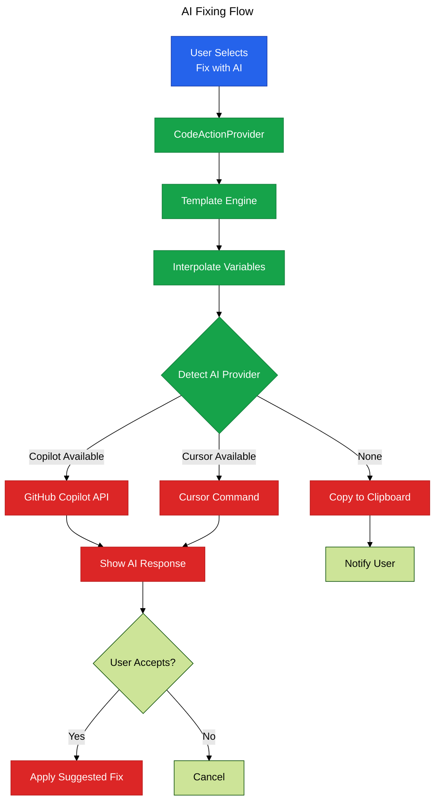

# Phase 7: AI-Assisted Fixing

**Purpose**: Integrate AI-powered fixing suggestions using GitHub Copilot, Cursor, or clipboard fallback.

**Dependencies**: Phase 0 (Infrastructure), Phase 6 (Quick Fixes)

**Deliverables**: AI prompt templates, Copilot/Cursor integration, enhanced CodeActionProvider

## Overview

Phase 7 adds AI-assisted fixing for complex issues:

1. Add `prompt` field to `ComplexityInsight` type in `@vipr/common`
2. Template interpolation engine for AI prompts
3. GitHub Copilot integration (chat API)
4. Cursor integration (command execution)
5. Clipboard fallback when AI APIs unavailable
6. "Fix with AI" code action
7. Initial prompts for Security and Accessibility analyses

## Architecture



## File Changes

### 1. Update ComplexityInsight Type

**File**: `packages/common/src/types/core/index.ts` (additions)

```typescript
export interface ComplexityInsight {
  /** Severity level */
  severity: Severity;
  /** Category for grouping */
  category: string;
  /** Human-readable message */
  message: string;
  /** Code location (enhanced to use full CodeLocation) */
  location?: CodeLocation;
  /** Legacy line number field for backward compatibility */
  line?: number;
  /** Actionable suggestion */
  suggestion?: string;
  /** Whether this can be auto-fixed */
  autoFixable?: boolean;
  /** Auto-fix if available */
  autoFix?: CodeFix;
  /** AI prompt template for fixing (Phase 7) */
  prompt?: AIPromptTemplate;
}

/**
 * AI prompt template for fixing suggestions
 */
export interface AIPromptTemplate {
  /** Template string with interpolation variables */
  template: string;
  /** Variables available for interpolation */
  variables: {
    /** The insight message */
    message?: boolean;
    /** Line number */
    line?: boolean;
    /** File path */
    file?: boolean;
    /** Code snippet */
    code?: boolean;
    /** Additional context */
    context?: Record<string, string>;
  };
}
```

### 2. Template Engine

**File**: `src/ai/template-engine.ts`

```typescript
import type { AIPromptTemplate, ComplexityInsight } from '@vipr/common';
import * as vscode from 'vscode';

/**
 * Template interpolation engine for AI prompts
 */
export class TemplateEngine {
  /**
   * Interpolate prompt template with insight data
   */
  async interpolate(
    template: AIPromptTemplate,
    insight: ComplexityInsight,
    document: vscode.TextDocument
  ): Promise<string> {
    let prompt = template.template;

    // Replace {{message}}
    if (template.variables.message) {
      prompt = prompt.replace(/\{\{message\}\}/g, insight.message);
    }

    // Replace {{line}}
    if (template.variables.line && insight.location) {
      prompt = prompt.replace(/\{\{line\}\}/g, String(insight.location.line));
    }

    // Replace {{file}}
    if (template.variables.file) {
      prompt = prompt.replace(/\{\{file\}\}/g, document.fileName);
    }

    // Replace {{code}}
    if (template.variables.code && insight.location) {
      const code = this.extractCode(document, insight.location);
      prompt = prompt.replace(/\{\{code\}\}/g, code);
    }

    // Replace custom context variables
    if (template.variables.context) {
      for (const [key, value] of Object.entries(template.variables.context)) {
        const pattern = new RegExp(`\\{\\{${key}\\}\\}`, 'g');
        prompt = prompt.replace(pattern, value);
      }
    }

    return prompt;
  }

  /**
   * Extract code snippet from location
   */
  private extractCode(document: vscode.TextDocument, location: any): string {
    const startLine = Math.max(0, location.line - 3); // 2 lines before
    const endLine = Math.min(document.lineCount - 1, location.line + 2); // 2 lines after

    const lines: string[] = [];
    for (let i = startLine; i `<=` endLine; i++) {
      lines.push(document.lineAt(i).text);
    }

    return lines.join('\n');
  }
}
```

### 3. Copilot Integration

**File**: `src/ai/copilot-integration.ts`

```typescript
import * as vscode from 'vscode';

/**
 * GitHub Copilot integration
 */
export class CopilotIntegration {
  /**
   * Check if Copilot is available
   */
  async isAvailable(): Promise<boolean> {
    const copilotExt = vscode.extensions.getExtension('GitHub.copilot');
    return copilotExt !== undefined && copilotExt.isActive;
  }

  /**
   * Send prompt to Copilot chat
   */
  async sendToChat(prompt: string): Promise<void> {
    // Use Copilot chat API
    await vscode.commands.executeCommand('workbench.action.chat.open', {
      message: prompt,
    });
  }

  /**
   * Request inline suggestion from Copilot
   */
  async getInlineSuggestion(prompt: string): Promise<string | undefined> {
    // Note: This would require access to Copilot's API
    // For MVP, we'll use the chat interface
    await this.sendToChat(prompt);
    return undefined; // User manually applies from chat
  }
}
```

### 4. Cursor Integration

**File**: `src/ai/cursor-integration.ts`

```typescript
import * as vscode from 'vscode';

/**
 * Cursor editor integration
 */
export class CursorIntegration {
  /**
   * Check if running in Cursor editor
   */
  isAvailable(): boolean {
    // Detect Cursor by checking for Cursor-specific commands/settings
    return vscode.env.appName.toLowerCase().includes('cursor');
  }

  /**
   * Send prompt to Cursor AI
   */
  async sendToAI(prompt: string): Promise<void> {
    // Cursor-specific command to open AI chat
    // This would need to be adapted based on Cursor's actual API
    await vscode.commands.executeCommand('cursor.openAIChat', {
      message: prompt,
    });
  }
}
```

### 5. Enhanced Code Action Provider

**File**: `src/providers/codeaction-provider.ts` (additions)

```typescript
import { TemplateEngine } from '../ai/template-engine';
import { CopilotIntegration } from '../ai/copilot-integration';
import { CursorIntegration } from '../ai/cursor-integration';

export class ViprCodeActionProvider implements vscode.CodeActionProvider {
  private templateEngine: TemplateEngine;
  private copilot: CopilotIntegration;
  private cursor: CursorIntegration;

  constructor() {
    this.templateEngine = new TemplateEngine();
    this.copilot = new CopilotIntegration();
    this.cursor = new CursorIntegration();
  }

  provideCodeActions(
    document: vscode.TextDocument,
    range: vscode.Range | vscode.Selection,
    context: vscode.CodeActionContext,
    token: vscode.CancellationToken
  ): vscode.CodeAction[] | undefined {
    // ... existing code

    // Add AI fix actions for insights with prompts
    for (const insight of relevantInsights) {
      if (insight.prompt) {
        actions.push(this.createAIFixAction(document, insight));
      }
    }

    return actions;
  }

  /**
   * Create AI-assisted fix action
   */
  private createAIFixAction(
    document: vscode.TextDocument,
    insight: ComplexityInsight
  ): vscode.CodeAction {
    const action = new vscode.CodeAction(
      `✨ Fix with AI: ${insight.message}`,
      vscode.CodeActionKind.QuickFix
    );

    action.command = {
      title: 'Fix with AI',
      command: 'vipr.fixWithAI',
      arguments: [document, insight],
    };

    return action;
  }
}
```

### 6. Fix with AI Command

**File**: `src/commands/fix-with-ai.ts`

```typescript
import * as vscode from 'vscode';
import { getExtensionState } from '../extension';
import type { ComplexityInsight } from '@vipr/common';
import { TemplateEngine } from '../ai/template-engine';
import { CopilotIntegration } from '../ai/copilot-integration';
import { CursorIntegration } from '../ai/cursor-integration';

/**
 * Command: Fix issue with AI assistance
 */
export async function fixWithAI(
  document: vscode.TextDocument,
  insight: ComplexityInsight
): Promise<void> {
  const { configManager } = getExtensionState();

  if (!configManager.get('enableAiFixing')) {
    vscode.window.showWarningMessage('AI fixing is disabled in settings');
    return;
  }

  if (!insight.prompt) {
    vscode.window.showWarningMessage('No AI prompt available for this issue');
    return;
  }

  const templateEngine = new TemplateEngine();
  const copilot = new CopilotIntegration();
  const cursor = new CursorIntegration();

  try {
    // Interpolate prompt template
    const prompt = await templateEngine.interpolate(insight.prompt, insight, document);

    // Determine AI provider
    const aiProvider = configManager.get('aiProvider');

    if (aiProvider === 'copilot' || (aiProvider === 'auto' && (await copilot.isAvailable()))) {
      await copilot.sendToChat(prompt);
      vscode.window.showInformationMessage('Sent to GitHub Copilot. Check the chat panel.');
    } else if (aiProvider === 'cursor' || (aiProvider === 'auto' && cursor.isAvailable())) {
      await cursor.sendToAI(prompt);
      vscode.window.showInformationMessage('Sent to Cursor AI. Check the AI panel.');
    } else {
      // Fallback to clipboard
      await vscode.env.clipboard.writeText(prompt);
      vscode.window.showInformationMessage(
        'AI prompt copied to clipboard. Paste it into your AI assistant.'
      );
    }
  } catch (error) {
    const message = error instanceof Error ? error.message : String(error);
    vscode.window.showErrorMessage(`Failed to send to AI: ${message}`);
  }
}
```

### 7. Register AI Command

**File**: `src/commands/index.ts` (additions)

```typescript
import { fixWithAI } from './fix-with-ai';

export function registerCommands(context: vscode.ExtensionContext): void {
  context.subscriptions.push(
    vscode.commands.registerCommand('vipr.analyzeFile', analyzeFile),
    vscode.commands.registerCommand('vipr.analyzeWorkspace', analyzeWorkspace),
    vscode.commands.registerCommand('vipr.fixWithAI', fixWithAI)
  );
}
```

### 8. Example: Security Analysis Prompts

**File**: `analyzers/react/src/analyses/security-analysis.ts` (additions)

```typescript
// In SecurityAnalysis.execute method, when creating insights:
const insight: ComplexityInsight = {
  severity: 'critical',
  category: 'security',
  message: 'Potential XSS vulnerability: dangerouslySetInnerHTML used',
  location: { line: node.getStartLineNumber(), column: 0 },
  suggestion: 'Use safe rendering methods or sanitize HTML input',
  autoFixable: false,
  prompt: {
    template: `Fix this React security issue:

Issue: {{message}}
File: {{file}}
Line: {{line}}

Code:
\`\`\`tsx
{{code}}
\`\`\`

Please suggest a secure alternative that avoids XSS vulnerabilities.`,
    variables: {
      message: true,
      file: true,
      line: true,
      code: true,
    },
  },
};
```

### 9. Example: Accessibility Analysis Prompts

**File**: `analyzers/react/src/analyses/accessibility-analysis.ts` (additions)

```typescript
const insight: ComplexityInsight = {
  severity: 'warning',
  category: 'accessibility',
  message: 'Interactive element missing accessible name',
  location: { line: node.getStartLineNumber(), column: 0 },
  suggestion: 'Add aria-label or aria-labelledby attribute',
  autoFixable: false,
  prompt: {
    template: `Fix this React accessibility issue:

Issue: {{message}}
File: {{file}}
Line: {{line}}

Code:
\`\`\`tsx
{{code}}
\`\`\`

Please suggest how to make this element accessible according to WCAG 2.1 guidelines.`,
    variables: {
      message: true,
      file: true,
      line: true,
      code: true,
    },
  },
};
```

## Configuration

No additional package.json changes required (configuration already defined in Phase 0).

## Acceptance Criteria

- [ ] `ComplexityInsight` type includes `prompt` field
- [ ] Template engine interpolates variables correctly
- [ ] GitHub Copilot integration detects availability
- [ ] Copilot integration opens chat with prompt
- [ ] Cursor integration detects when running in Cursor
- [ ] Cursor integration opens AI panel with prompt
- [ ] Clipboard fallback works when no AI available
- [ ] "Fix with AI" code action appears for insights with prompts
- [ ] Selecting "Fix with AI" sends prompt to appropriate AI
- [ ] Security analysis includes AI prompts
- [ ] Accessibility analysis includes AI prompts
- [ ] AI fixing respects `vipr.enableAiFixing` setting
- [ ] AI provider preference (`vipr.aiProvider`) is respected

## Testing Strategy

### Unit Tests

**File**: `src/ai/template-engine.test.ts`

```typescript
import { describe, it, expect } from 'vitest';
import { TemplateEngine } from './template-engine';

describe('TemplateEngine', () => {
  it('should interpolate message variable', async () => {
    const engine = new TemplateEngine();
    const template = {
      template: 'Fix this: {{message}}',
      variables: { message: true },
    };
    const insight = {
      severity: 'warning' as const,
      category: 'test',
      message: 'Test issue',
    };
    const mockDoc: any = { fileName: 'test.ts' };

    const result = await engine.interpolate(template, insight, mockDoc);
    expect(result).toBe('Fix this: Test issue');
  });

  it('should interpolate multiple variables', async () => {
    const engine = new TemplateEngine();
    const template = {
      template: 'File: {{file}}, Line: {{line}}, Message: {{message}}',
      variables: { file: true, line: true, message: true },
    };
    const insight = {
      severity: 'warning' as const,
      category: 'test',
      message: 'Test issue',
      location: { line: 42, column: 0 },
    };
    const mockDoc: any = { fileName: 'test.ts' };

    const result = await engine.interpolate(template, insight, mockDoc);
    expect(result).toContain('File: test.ts');
    expect(result).toContain('Line: 42');
    expect(result).toContain('Message: Test issue');
  });
});
```

### Manual Verification

1. Analyze a file with security or accessibility issues
2. Place cursor on issue with AI prompt
3. Open quick fix menu (Ctrl+. or Cmd+.)
4. Verify "Fix with AI" action appears with sparkle icon
5. Select "Fix with AI"
6. If Copilot is installed:
   - Verify Copilot chat opens
   - Verify prompt appears in chat
7. If running in Cursor:
   - Verify Cursor AI panel opens
   - Verify prompt appears
8. If no AI available:
   - Verify notification about clipboard copy
   - Verify prompt is in clipboard
9. Disable `vipr.enableAiFixing`
10. Verify "Fix with AI" action no longer appears

## Summary

Phase 7 brings AI assistance to complex code quality issues that don't have simple auto-fixes. By integrating with popular AI tools (Copilot, Cursor) and providing intelligent prompt templates, the extension helps developers quickly understand and address sophisticated issues. The graceful fallback to clipboard ensures the feature remains useful even without AI tool integration.
