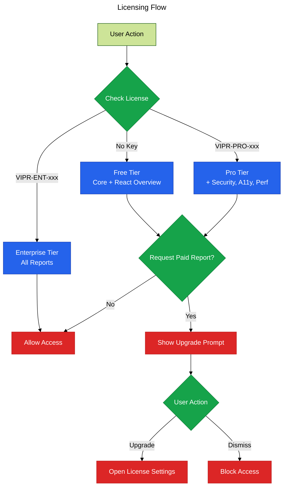

# Phase 8: Licensing

**Purpose**: Implement tiered licensing system to gate access to paid reports.

**Dependencies**: Phase 0 (Infrastructure), Phase 4 (Sidebar)

**Deliverables**: License validation UI, tier-based feature gating, upgrade prompts

## Overview

Phase 8 enforces licensing tiers for monetization:

1. Free tier: Core Overview, React Overview
2. Pro tier: Security, Accessibility, Performance, Reliability, Anti-Patterns
3. Enterprise tier: All reports including Migration, Dataflow, Technical Debt
4. Visual indicators in sidebar for locked reports
5. Upgrade prompts when accessing paid features
6. License key management in settings
7. License status display in sidebar

## Architecture



## File Changes

### 1. License Gating in Analysis

**File**: `src/core/license-gate.ts`

```typescript
import * as vscode from 'vscode';
import { getExtensionState } from '../extension';
import type { LicenseTier } from '../types/license';
import { requiresLicense, hasAccess } from '../types/license';

/**
 * License gating utilities
 */
export class LicenseGate {
  /**
   * Check if user has access to report type
   */
  static canAccess(reportType: string): boolean {
    const { configManager, licenseValidator } = getExtensionState();
    const licenseKey = configManager.get('licenseKey');
    const tier = licenseValidator.getTier(licenseKey);

    return hasAccess(tier, reportType);
  }

  /**
   * Show upgrade prompt for locked feature
   */
  static async showUpgradePrompt(reportType: string, requiredTier: LicenseTier): Promise<boolean> {
    const message = `This report requires a ${requiredTier} license. Upgrade to unlock advanced analysis features.`;

    const choice = await vscode.window.showInformationMessage(
      message,
      'View Plans',
      'Enter License Key',
      'Dismiss'
    );

    if (choice === 'View Plans') {
      await vscode.env.openExternal(vscode.Uri.parse('https://vipr.dev/pricing'));
      return false;
    } else if (choice === 'Enter License Key') {
      await this.promptForLicenseKey();
      return this.canAccess(reportType);
    }

    return false;
  }

  /**
   * Prompt user to enter license key
   */
  static async promptForLicenseKey(): Promise<void> {
    const key = await vscode.window.showInputBox({
      prompt: 'Enter your Vipr license key',
      placeHolder: 'VIPR-PRO-XXXXXXXX or VIPR-ENT-XXXXXXXX',
      password: true,
      validateInput: value => {
        if (!value) {
          return 'License key is required';
        }
        if (!value.startsWith('VIPR-')) {
          return 'Invalid license key format';
        }
        return undefined;
      },
    });

    if (!key) {
      return;
    }

    const { configManager, licenseValidator } = getExtensionState();

    // Validate key
    const validation = licenseValidator.validate(key);
    if (!validation.valid) {
      vscode.window.showErrorMessage(`Invalid license key: ${validation.error}`);
      return;
    }

    // Save to settings
    await configManager.set('licenseKey', key);

    vscode.window.showInformationMessage(
      `License activated: ${validation.tier} tier with ${validation.enabledFeatures.length} reports`
    );

    // Refresh sidebar
    const { sidebarProvider } = getExtensionState();
    sidebarProvider?.updateView();
  }

  /**
   * Get tier display name
   */
  static getTierDisplayName(tier: LicenseTier): string {
    switch (tier) {
      case 'free':
        return 'Free';
      case 'pro':
        return 'Pro';
      case 'enterprise':
        return 'Enterprise';
    }
  }

  /**
   * Get required tier for report
   */
  static getRequiredTier(reportType: string): LicenseTier {
    if (!requiresLicense(reportType)) {
      return 'free';
    }

    // Check enterprise-only reports
    const enterpriseReports = ['migration', 'dataflow', 'technical-debt'];
    if (enterpriseReports.includes(reportType)) {
      return 'enterprise';
    }

    return 'pro';
  }
}
```

### 2. Update Sidebar with License Indicators

**File**: `src/views/sidebar-view-provider.ts` (additions)

```typescript
import { LicenseGate } from '../core/license-gate';

private buildPluginData(result: any, registry: any, licenseTier: any): any[] {
  const plugins = [];

  for (const [pluginId, pluginResult] of result.pluginResults) {
    const presenters = registry.getByPlugin(pluginId);
    const reports = presenters.map((presenter: any) => {
      const metadata = presenter.getMetadata();
      const requiresLicense = LicenseGate.getRequiredTier(metadata.reportType) !== 'free';
      const hasAccess = LicenseGate.canAccess(metadata.reportType);

      return {
        reportType: metadata.reportType,
        label: metadata.label,
        icon: metadata.icon,
        score: hasAccess ? pluginResult.score : undefined,
        scoreLevel: hasAccess && pluginResult.score
          ? getScoreLevel(pluginResult.score)
          : undefined,
        issueCount: hasAccess
          ? pluginResult.insights.filter((i: any) => i.category === metadata.reportType).length
          : 0,
        requiresLicense,
        hasAccess,
        requiredTier: LicenseGate.getRequiredTier(metadata.reportType),
      };
    });

    plugins.push({
      id: pluginId,
      name: pluginResult.pluginId,
      score: pluginResult.score,
      scoreLevel: pluginResult.score ? getScoreLevel(pluginResult.score) : undefined,
      reports,
      issueCount: pluginResult.insights.length,
    });
  }

  return plugins;
}

private async handleMessage(message: WebviewToExtensionMessage): Promise<void> {
  switch (message.type) {
    // ... existing cases
    case 'unlockReport':
      await this.handleUnlockReport(message.payload);
      break;
  }
}

private async handleUnlockReport(payload: any): Promise<void> {
  const requiredTier = LicenseGate.getRequiredTier(payload.reportType);
  await LicenseGate.showUpgradePrompt(payload.reportType, requiredTier);
}
```

### 3. Update Dashboard HTML for Locked Reports

**File**: `src/webview/dashboard.html` (additions)

```html
<!-- In report rendering section -->
<div class="report ${report.hasAccess ? '' : 'locked'}"
     ${report.hasAccess ? '' : `onclick="unlockReport('${report.reportType}')"`}>
  <span>
    ${report.icon ?? ''} ${report.label}
    ${report.hasAccess ? '' : `<span class="lock-icon">🔒</span>`}
  </span>
  <span>
    ${report.hasAccess ? (report.score ?? '--') + '/100' :
      `<span class="upgrade-badge">${report.requiredTier}</span>`}
  </span>
</div>
```

### 4. Update Dashboard Styles

**File**: `src/webview/dashboard.css` (additions)

```css
.report.locked {
  opacity: 0.6;
  cursor: pointer;
}

.report.locked:hover {
  opacity: 0.8;
  background-color: var(--vscode-list-hoverBackground);
}

.lock-icon {
  margin-left: 4px;
  font-size: 10px;
}

.upgrade-badge {
  background-color: var(--vscode-button-background);
  color: var(--vscode-button-foreground);
  padding: 2px 6px;
  border-radius: 3px;
  font-size: 10px;
  font-weight: bold;
  text-transform: uppercase;
}

.license-info {
  padding: 8px;
  margin-bottom: 16px;
  background-color: var(--vscode-editor-background);
  border-radius: 4px;
  border: 1px solid var(--vscode-panel-border);
  display: flex;
  justify-content: space-between;
  align-items: center;
}

.license-tier {
  font-weight: bold;
}

.license-tier.free {
  color: #94a3b8;
}

.license-tier.pro {
  color: #3b82f6;
}

.license-tier.enterprise {
  color: #8b5cf6;
}

.upgrade-btn {
  font-size: 11px;
  padding: 4px 8px;
}
```

### 5. Update Dashboard Script

**File**: `src/webview/dashboard.js` (additions)

```javascript
window.unlockReport = reportType => {
  vscode.postMessage({ type: 'unlockReport', payload: { reportType } });
};

function updateDashboard(data) {
  // ... existing code

  // Add license info section
  const licenseInfo = document.createElement('div');
  licenseInfo.className = 'license-info';
  licenseInfo.innerHTML = `
    <div>
      <span class="license-tier ${data.licenseTier}">${getTierDisplayName(data.licenseTier)}</span>
      <span> License</span>
    </div>
    ${
      data.licenseTier === 'free'
        ? '<button class="btn upgrade-btn" onclick="upgradeLicense()">Upgrade</button>'
        : ''
    }
  `;

  const dashboard = document.getElementById('dashboard');
  dashboard.insertBefore(licenseInfo, dashboard.firstChild);

  // ... rest of existing code
}

function getTierDisplayName(tier) {
  switch (tier) {
    case 'free':
      return 'Free';
    case 'pro':
      return 'Pro';
    case 'enterprise':
      return 'Enterprise';
    default:
      return tier;
  }
}

window.upgradeLicense = () => {
  vscode.postMessage({ type: 'openSettings' });
};
```

### 6. License Status Command

**File**: `src/commands/license-status.ts`

```typescript
import * as vscode from 'vscode';
import { getExtensionState } from '../extension';
import { LicenseGate } from '../core/license-gate';

/**
 * Command: Show license status
 */
export async function showLicenseStatus(): Promise<void> {
  const { configManager, licenseValidator } = getExtensionState();

  const licenseKey = configManager.get('licenseKey');
  const validation = licenseValidator.validate(licenseKey);

  const tierName = LicenseGate.getTierDisplayName(validation.tier);
  const features = validation.enabledFeatures.join(', ');

  const message = `
**Vipr License Status**

Tier: ${tierName}
Features: ${validation.enabledFeatures.length} reports
Enabled: ${features}
${validation.validUntil ? `Valid Until: ${validation.validUntil.toDateString()}` : ''}
  `.trim();

  const choice = await vscode.window.showInformationMessage(
    message,
    { modal: true },
    'Upgrade',
    'Enter License Key',
    'Close'
  );

  if (choice === 'Upgrade') {
    await vscode.env.openExternal(vscode.Uri.parse('https://vipr.dev/pricing'));
  } else if (choice === 'Enter License Key') {
    await LicenseGate.promptForLicenseKey();
  }
}
```

### 7. Register License Commands

**File**: `src/commands/index.ts` (additions)

```typescript
import { showLicenseStatus } from './license-status';

export function registerCommands(context: vscode.ExtensionContext): void {
  context.subscriptions.push(
    vscode.commands.registerCommand('vipr.analyzeFile', analyzeFile),
    vscode.commands.registerCommand('vipr.analyzeWorkspace', analyzeWorkspace),
    vscode.commands.registerCommand('vipr.fixWithAI', fixWithAI),
    vscode.commands.registerCommand('vipr.licenseStatus', showLicenseStatus)
  );
}
```

### 8. Update Extension Message Types

**File**: `src/types/webview.ts` (additions)

```typescript
/**
 * Unlock report (upgrade prompt)
 */
export interface UnlockReportMessage extends WebviewMessage {
  type: 'unlockReport';
  payload: {
    reportType: string;
  };
}

export type WebviewToExtensionMessage =
  | NavigateToIssueMessage
  | RefreshAnalysisMessage
  | AnalyzeWorkspaceMessage
  | OpenSettingsMessage
  | UnlockReportMessage;
```

## Configuration

**File**: `package.json` (contributes.commands section)

```json
{
  "contributes": {
    "commands": [
      {
        "command": "vipr.licenseStatus",
        "title": "Show License Status",
        "category": "Vipr",
        "icon": "$(key)"
      }
    ]
  }
}
```

## Acceptance Criteria

- [ ] Free tier shows only Core and React Overview
- [ ] Pro tier shows Security, Accessibility, Performance, Reliability, Anti-Patterns
- [ ] Enterprise tier shows all reports
- [ ] Locked reports show lock icon in sidebar
- [ ] Locked reports show tier badge instead of score
- [ ] Clicking locked report shows upgrade prompt
- [ ] Upgrade prompt offers "View Plans", "Enter License Key", "Dismiss"
- [ ] "View Plans" opens pricing page in browser
- [ ] "Enter License Key" shows input dialog
- [ ] Invalid license key shows error message
- [ ] Valid license key activates tier and refreshes UI
- [ ] License status command shows current tier and features
- [ ] License tier display appears in sidebar header
- [ ] Free tier users see "Upgrade" button in sidebar

## Testing Strategy

### Unit Tests

**File**: `src/core/license-gate.test.ts`

```typescript
import { describe, it, expect } from 'vitest';
import { LicenseGate } from './license-gate';

describe('LicenseGate', () => {
  it('should identify free tier reports', () => {
    expect(LicenseGate.getRequiredTier('core-overview')).toBe('free');
    expect(LicenseGate.getRequiredTier('react-overview')).toBe('free');
  });

  it('should identify pro tier reports', () => {
    expect(LicenseGate.getRequiredTier('security')).toBe('pro');
    expect(LicenseGate.getRequiredTier('accessibility')).toBe('pro');
  });

  it('should identify enterprise tier reports', () => {
    expect(LicenseGate.getRequiredTier('migration')).toBe('enterprise');
    expect(LicenseGate.getRequiredTier('dataflow')).toBe('enterprise');
  });
});
```

### Manual Verification

1. Start with no license key (free tier)
2. Analyze a file
3. Open sidebar
4. Verify only Core and React Overview show scores
5. Verify other reports show lock icon and tier badge
6. Click a locked report
7. Verify upgrade prompt appears
8. Click "Enter License Key"
9. Enter invalid key
10. Verify error message
11. Enter valid Pro key (VIPR-PRO-12345678)
12. Verify activation message
13. Verify Pro tier reports unlock
14. Verify Enterprise reports still locked
15. Run `Vipr: Show License Status` command
16. Verify correct tier and feature list displayed
17. Enter Enterprise key (VIPR-ENT-12345678)
18. Verify all reports unlock

## Summary

Phase 8 implements the monetization strategy through a clean, user-friendly licensing system. The tiered approach provides clear value progression (Free → Pro → Enterprise) while maintaining a respectful user experience with non-intrusive upgrade prompts and transparent feature gating. The simple prefix-based validation makes the MVP implementation straightforward while leaving room for future server-based validation.
