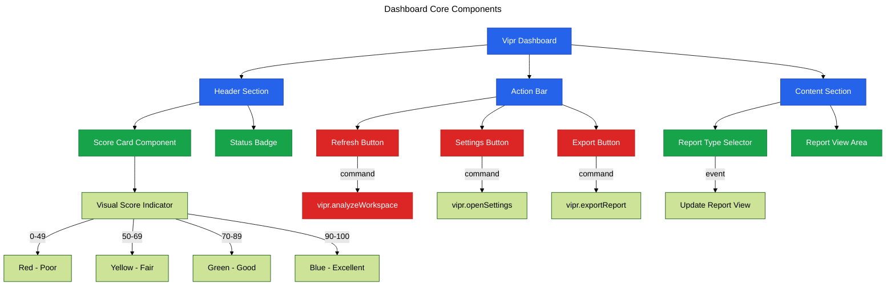

# Phase 11: Dashboard Migration - Core Components

**Purpose**: Migrate core dashboard UI elements (score display, buttons, dropdowns) to @vscode-elements components.

**Dependencies**: Phase 10 (@vscode-elements Foundation)

**Deliverables**: Score card component, action buttons, report selector, refresh controls

## Overview

Phase 11 implements the core interactive elements of the dashboard:

1. Create overall quality score card with visual indicator
2. Implement action button group for common commands
3. Build report type selector dropdown
4. Add refresh and settings buttons
5. Create loading and empty states
6. Implement error handling UI
7. Connect components to extension commands

## Architecture



## File Changes

### 1. Score Card Component

**File**: `src/webview/components/score-card.ts`

```typescript
import { LitElement, html, css } from 'lit';
import { customElement, property } from 'lit/decorators.js';

/**
 * Quality score display component
 */
@customElement('vipr-score-card')
export class ViprScoreCard extends LitElement {
  @property({ type: Number })
  score = 0;

  @property({ type: String })
  label = 'Overall Quality';

  static styles = css`
    :host {
      display: block;
    }

    .score-card {
      display: flex;
      flex-direction: column;
      align-items: center;
      padding: 24px;
      border: 1px solid var(--vscode-panel-border);
      border-radius: 8px;
      background: var(--vscode-editor-background);
    }

    .score-circle {
      width: 120px;
      height: 120px;
      border-radius: 50%;
      display: flex;
      align-items: center;
      justify-content: center;
      font-size: 36px;
      font-weight: 700;
      position: relative;
      margin-bottom: 16px;
    }

    .score-circle::before {
      content: '';
      position: absolute;
      inset: -4px;
      border-radius: 50%;
      padding: 4px;
      background: conic-gradient(
        var(--score-color) calc(var(--score) * 1%),
        var(--vscode-input-background) 0
      );
      -webkit-mask:
        linear-gradient(#fff 0 0) content-box,
        linear-gradient(#fff 0 0);
      -webkit-mask-composite: xor;
      mask-composite: exclude;
    }

    .score-value {
      color: var(--score-color);
    }

    .score-label {
      font-size: 14px;
      color: var(--vscode-descriptionForeground);
      text-align: center;
    }

    :host([score='0-49']) {
      --score-color: var(--vscode-errorForeground);
    }

    :host([score='50-69']) {
      --score-color: var(--vscode-editorWarning-foreground);
    }

    :host([score='70-89']) {
      --score-color: var(--vscode-terminal-ansiGreen);
    }

    :host([score='90-100']) {
      --score-color: var(--vscode-terminal-ansiBlue);
    }
  `;

  connectedCallback() {
    super.connectedCallback();
    this.updateScoreAttribute();
  }

  updated(changedProperties: Map<string, any>) {
    if (changedProperties.has('score')) {
      this.updateScoreAttribute();
    }
  }

  private updateScoreAttribute() {
    if (this.score < 50) {
      this.setAttribute('score', '0-49');
    } else if (this.score < 70) {
      this.setAttribute('score', '50-69');
    } else if (this.score < 90) {
      this.setAttribute('score', '70-89');
    } else {
      this.setAttribute('score', '90-100');
    }
  }

  render() {
    return html`
      <div class="score-card">
        <div class="score-circle" style="--score: ${this.score}">
          <span class="score-value">${this.score}</span>
        </div>
        <div class="score-label">${this.label}</div>
      </div>
    `;
  }
}
```

### 2. Action Bar Component

**File**: `src/webview/components/action-bar.ts`

```typescript
import { LitElement, html, css } from 'lit';
import { customElement, property } from 'lit/decorators.js';
import '@vscode-elements/elements/dist/vscode-button';
import '@vscode-elements/elements/dist/vscode-icon';

/**
 * Action button bar component
 */
@customElement('vipr-action-bar')
export class ViprActionBar extends LitElement {
  @property({ type: Boolean })
  analyzing = false;

  static styles = css`
    :host {
      display: block;
    }

    .action-bar {
      display: flex;
      gap: 8px;
      padding: 16px 0;
      border-bottom: 1px solid var(--vscode-panel-border);
    }

    .spacer {
      flex: 1;
    }

    vscode-button {
      white-space: nowrap;
    }
  `;

  private handleRefresh() {
    this.dispatchEvent(
      new CustomEvent('command', {
        detail: { command: 'vipr.analyzeWorkspace' },
        bubbles: true,
        composed: true,
      })
    );
  }

  private handleSettings() {
    this.dispatchEvent(
      new CustomEvent('command', {
        detail: { command: 'vipr.openSettings' },
        bubbles: true,
        composed: true,
      })
    );
  }

  private handleExport() {
    this.dispatchEvent(
      new CustomEvent('command', {
        detail: { command: 'vipr.exportReport' },
        bubbles: true,
        composed: true,
      })
    );
  }

  render() {
    return html`
      <div class="action-bar">
        <vscode-button
          appearance="primary"
          @click=${this.handleRefresh}
          ?disabled=${this.analyzing}
        >
          <vscode-icon name="refresh" slot="start"></vscode-icon>
          ${this.analyzing ? 'Analyzing...' : 'Refresh Analysis'}
        </vscode-button>

        <vscode-button @click=${this.handleExport}>
          <vscode-icon name="export" slot="start"></vscode-icon>
          Export Report
        </vscode-button>

        <div class="spacer"></div>

        <vscode-button appearance="icon" @click=${this.handleSettings}>
          <vscode-icon name="settings-gear"></vscode-icon>
        </vscode-button>
      </div>
    `;
  }
}
```

### 3. Report Selector Component

**File**: `src/webview/components/report-selector.ts`

```typescript
import { LitElement, html, css } from 'lit';
import { customElement, property } from 'lit/decorators.js';
import '@vscode-elements/elements/dist/vscode-dropdown';
import '@vscode-elements/elements/dist/vscode-option';

export interface ReportOption {
  value: string;
  label: string;
  description?: string;
}

/**
 * Report type selector component
 */
@customElement('vipr-report-selector')
export class ViprReportSelector extends LitElement {
  @property({ type: Array })
  reports: ReportOption[] = [];

  @property({ type: String })
  selected = '';

  static styles = css`
    :host {
      display: block;
    }

    .selector-container {
      padding: 16px 0;
    }

    .selector-label {
      display: block;
      margin-bottom: 8px;
      font-size: 13px;
      font-weight: 600;
      color: var(--vscode-foreground);
    }

    vscode-dropdown {
      width: 100%;
      max-width: 400px;
    }
  `;

  private handleChange(event: Event) {
    const dropdown = event.target as any;
    const value = dropdown.value;

    this.selected = value;

    this.dispatchEvent(
      new CustomEvent('report-change', {
        detail: { reportType: value },
        bubbles: true,
        composed: true,
      })
    );
  }

  render() {
    return html`
      <div class="selector-container">
        <label class="selector-label">Report Type</label>
        <vscode-dropdown @change=${this.handleChange} .value=${this.selected}>
          ${this.reports.map(
            report => html`
              <vscode-option value=${report.value}>
                ${report.label} ${report.description ? html` - ${report.description}` : ''}
              </vscode-option>
            `
          )}
        </vscode-dropdown>
      </div>
    `;
  }
}
```

### 4. Empty State Component

**File**: `src/webview/components/empty-state.ts`

```typescript
import { LitElement, html, css } from 'lit';
import { customElement, property } from 'lit/decorators.js';
import '@vscode-elements/elements/dist/vscode-button';
import '@vscode-elements/elements/dist/vscode-icon';

/**
 * Empty state component for when no data is available
 */
@customElement('vipr-empty-state')
export class ViprEmptyState extends LitElement {
  @property({ type: String })
  message = 'No analysis data available';

  @property({ type: String })
  actionText = 'Run Analysis';

  @property({ type: String })
  actionCommand = 'vipr.analyzeWorkspace';

  static styles = css`
    :host {
      display: block;
    }

    .empty-state {
      display: flex;
      flex-direction: column;
      align-items: center;
      justify-content: center;
      padding: 60px 20px;
      text-align: center;
    }

    .empty-icon {
      font-size: 48px;
      margin-bottom: 16px;
      opacity: 0.5;
    }

    .empty-message {
      font-size: 16px;
      color: var(--vscode-descriptionForeground);
      margin-bottom: 24px;
    }
  `;

  private handleAction() {
    this.dispatchEvent(
      new CustomEvent('command', {
        detail: { command: this.actionCommand },
        bubbles: true,
        composed: true,
      })
    );
  }

  render() {
    return html`
      <div class="empty-state">
        <div class="empty-icon">
          <vscode-icon name="inbox"></vscode-icon>
        </div>
        <div class="empty-message">${this.message}</div>
        <vscode-button appearance="primary" @click=${this.handleAction}>
          ${this.actionText}
        </vscode-button>
      </div>
    `;
  }
}
```

### 5. Loading State Component

**File**: `src/webview/components/loading-state.ts`

```typescript
import { LitElement, html, css } from 'lit';
import { customElement, property } from 'lit/decorators.js';
import '@vscode-elements/elements/dist/vscode-progress-ring';

/**
 * Loading state component
 */
@customElement('vipr-loading-state')
export class ViprLoadingState extends LitElement {
  @property({ type: String })
  message = 'Loading...';

  static styles = css`
    :host {
      display: block;
    }

    .loading-state {
      display: flex;
      flex-direction: column;
      align-items: center;
      justify-content: center;
      padding: 60px 20px;
      text-align: center;
    }

    .loading-message {
      margin-top: 16px;
      font-size: 14px;
      color: var(--vscode-descriptionForeground);
    }
  `;

  render() {
    return html`
      <div class="loading-state">
        <vscode-progress-ring></vscode-progress-ring>
        <div class="loading-message">${this.message}</div>
      </div>
    `;
  }
}
```

### 6. Update Main Dashboard Component

**File**: `src/webview/dashboard-app.ts` (refactored)

```typescript
import { LitElement, html, css } from 'lit';
import { customElement, state } from 'lit/decorators.js';
import '@vscode-elements/elements/dist/vscode-badge';
import './components/score-card';
import './components/action-bar';
import './components/report-selector';
import './components/empty-state';
import './components/loading-state';

interface AnalysisData {
  overallScore: number;
  fileCount: number;
  issueCount: number;
  reports: Array<{ value: string; label: string; description?: string }>;
  selectedReport?: string;
}

@customElement('vipr-dashboard')
export class ViprDashboard extends LitElement {
  @state()
  private analysisData: AnalysisData | null = null;

  @state()
  private loading = true;

  @state()
  private analyzing = false;

  @state()
  private selectedReport = '';

  static styles = css`
    :host {
      display: block;
      padding: 20px;
      color: var(--vscode-foreground);
      font-family: var(--vscode-font-family);
      font-size: var(--vscode-font-size);
    }

    .header {
      display: flex;
      justify-content: space-between;
      align-items: flex-start;
      margin-bottom: 24px;
      gap: 24px;
    }

    .header-info {
      flex: 1;
    }

    h1 {
      margin: 0 0 8px 0;
      font-size: 24px;
      font-weight: 600;
    }

    .header-meta {
      display: flex;
      gap: 12px;
      align-items: center;
    }

    .content {
      margin-top: 24px;
    }
  `;

  connectedCallback() {
    super.connectedCallback();
    this.setupMessageListener();
    this.notifyReady();
  }

  private setupMessageListener() {
    window.addEventListener('message', event => {
      const message = event.data;

      switch (message.type) {
        case 'init':
          this.analysisData = message.data;
          this.selectedReport = message.data?.selectedReport || '';
          this.loading = false;
          break;
        case 'update':
          this.analysisData = message.data;
          this.analyzing = false;
          break;
        case 'analyzing':
          this.analyzing = true;
          break;
        case 'error':
          this.loading = false;
          this.analyzing = false;
          console.error('Extension error:', message.data);
          break;
      }
    });
  }

  private notifyReady() {
    this.postMessage({ type: 'ready' });
  }

  private postMessage(message: any) {
    // @ts-ignore - vscode API injected by webview
    if (typeof vscode !== 'undefined') {
      vscode.postMessage(message);
    }
  }

  private handleCommand(event: CustomEvent) {
    const { command } = event.detail;
    this.postMessage({ type: 'command', command, args: [] });

    if (command === 'vipr.analyzeWorkspace') {
      this.analyzing = true;
    }
  }

  private handleReportChange(event: CustomEvent) {
    const { reportType } = event.detail;
    this.selectedReport = reportType;
    this.postMessage({ type: 'request', action: 'changeReport', reportType });
  }

  render() {
    if (this.loading) {
      return html`<vipr-loading-state message="Loading analysis data..."></vipr-loading-state>`;
    }

    if (!this.analysisData) {
      return html`
        <vipr-empty-state
          message="No analysis data available. Run an analysis to get started."
          actionText="Run Analysis"
          actionCommand="vipr.analyzeWorkspace"
          @command=${this.handleCommand}
        ></vipr-empty-state>
      `;
    }

    return html`
      <div class="header">
        <div class="header-info">
          <h1>Vipr Analysis Dashboard</h1>
          <div class="header-meta">
            <vscode-badge>${this.analysisData.fileCount} files</vscode-badge>
            <vscode-badge>${this.analysisData.issueCount} issues</vscode-badge>
          </div>
        </div>
        <vipr-score-card
          .score=${this.analysisData.overallScore}
          label="Overall Quality Score"
        ></vipr-score-card>
      </div>

      <vipr-action-bar
        .analyzing=${this.analyzing}
        @command=${this.handleCommand}
      ></vipr-action-bar>

      <div class="content">
        <vipr-report-selector
          .reports=${this.analysisData.reports}
          .selected=${this.selectedReport}
          @report-change=${this.handleReportChange}
        ></vipr-report-selector>

        <p>Report content will be added in Phase 12</p>
      </div>
    `;
  }
}

// Initialize the app when DOM is ready
if (document.readyState === 'loading') {
  document.addEventListener('DOMContentLoaded', () => {
    const app = document.createElement('vipr-dashboard');
    document.body.appendChild(app);
  });
} else {
  const app = document.createElement('vipr-dashboard');
  document.body.appendChild(app);
}
```

## Configuration

No additional package.json changes required (dependencies added in Phase 10).

## Acceptance Criteria

- [ ] Score card displays quality score with color-coded visual indicator
- [ ] Score card shows correct color for score ranges (0-49 red, 50-69 yellow, 70-89 green, 90-100 blue)
- [ ] Action bar contains refresh, export, and settings buttons
- [ ] Refresh button shows "Analyzing..." state when active
- [ ] Report selector dropdown displays available report types
- [ ] Selecting report type sends message to extension
- [ ] Empty state displays when no analysis data available
- [ ] Loading state displays during initial data fetch
- [ ] All buttons trigger correct VSCode commands
- [ ] Components use VSCode theme variables
- [ ] All interactive elements keyboard accessible
- [ ] No console errors in webview

## Testing Strategy

### Unit Tests

**File**: `src/webview/components/score-card.test.ts`

```typescript
import { describe, it, expect } from 'vitest';
import { fixture, html } from '@open-wc/testing';
import './score-card';
import type { ViprScoreCard } from './score-card';

describe('ViprScoreCard', () => {
  it('should render score value', async () => {
    const el = await fixture<ViprScoreCard>(html`<vipr-score-card .score=${85}></vipr-score-card>`);
    const scoreValue = el.shadowRoot?.querySelector('.score-value');
    expect(scoreValue?.textContent).toBe('85');
  });

  it('should set correct attribute for low score', async () => {
    const el = await fixture<ViprScoreCard>(html`<vipr-score-card .score=${35}></vipr-score-card>`);
    expect(el.getAttribute('score')).toBe('0-49');
  });

  it('should set correct attribute for medium score', async () => {
    const el = await fixture<ViprScoreCard>(html`<vipr-score-card .score=${65}></vipr-score-card>`);
    expect(el.getAttribute('score')).toBe('50-69');
  });

  it('should set correct attribute for good score', async () => {
    const el = await fixture<ViprScoreCard>(html`<vipr-score-card .score=${85}></vipr-score-card>`);
    expect(el.getAttribute('score')).toBe('70-89');
  });

  it('should set correct attribute for excellent score', async () => {
    const el = await fixture<ViprScoreCard>(html`<vipr-score-card .score=${95}></vipr-score-card>`);
    expect(el.getAttribute('score')).toBe('90-100');
  });
});
```

### Manual Verification

1. Open extension in debug mode
2. Run "Vipr: Show Dashboard" command
3. Verify score card displays with correct color
4. Test score ranges by modifying mock data:
   - Score 30: should be red
   - Score 60: should be yellow
   - Score 80: should be green
   - Score 95: should be blue
5. Click "Refresh Analysis" button
6. Verify button shows "Analyzing..." state
7. Verify notification shows command executed
8. Click "Export Report" button
9. Verify export command triggered
10. Click settings icon
11. Verify settings opened
12. Change report type in dropdown
13. Verify report view updates
14. Close and reopen dashboard
15. Verify state persists

## Summary

Phase 11 delivers a polished, interactive dashboard core using @vscode-elements components for buttons, dropdowns, and badges, combined with custom Lit components for specialized visualizations like the quality score card.
