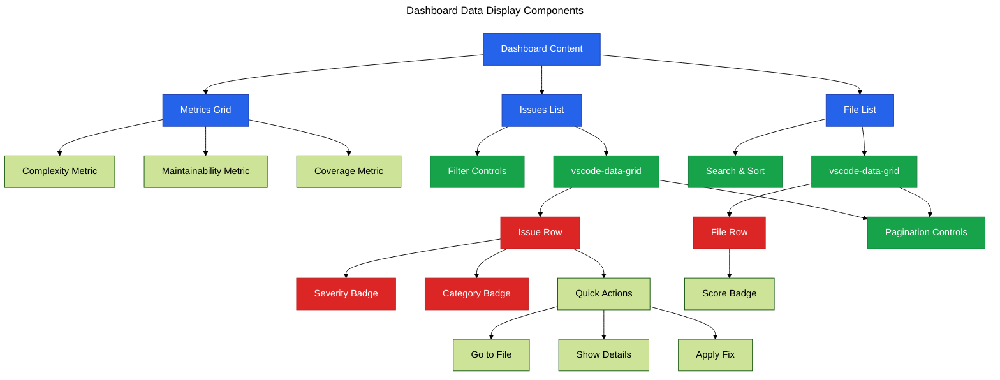

# Phase 12: Dashboard Migration - Data Display

**Purpose**: Implement data display components for metrics, issues, and analysis results using @vscode-elements.

**Dependencies**: Phase 11 (Dashboard Core)

**Deliverables**: Metrics grid, issues list, file list, severity badges, pagination controls

## Overview

Phase 12 completes the dashboard by adding data visualization components:

1. Create metrics summary grid component
2. Implement issues list with filtering and sorting
3. Build file analysis results table
4. Add severity and category badge components
5. Implement pagination for large datasets
6. Create collapsible sections for different data views
7. Add search and filter controls

## Architecture



## File Changes

### 1. Metrics Grid Component

**File**: `src/webview/components/metrics-grid.ts`

```typescript
import { LitElement, html, css } from 'lit';
import { customElement, property } from 'lit/decorators.js';
import '@vscode-elements/elements/dist/vscode-badge';

export interface Metric {
  label: string;
  value: number | string;
  unit?: string;
  trend?: 'up' | 'down' | 'stable';
  description?: string;
}

/**
 * Metrics summary grid component
 */
@customElement('vipr-metrics-grid')
export class ViprMetricsGrid extends LitElement {
  @property({ type: Array })
  metrics: Metric[] = [];

  static styles = css`
    :host {
      display: block;
    }

    .metrics-grid {
      display: grid;
      grid-template-columns: repeat(auto-fit, minmax(200px, 1fr));
      gap: 16px;
      margin: 24px 0;
    }

    .metric-card {
      padding: 16px;
      border: 1px solid var(--vscode-panel-border);
      border-radius: 6px;
      background: var(--vscode-editor-background);
    }

    .metric-label {
      font-size: 12px;
      color: var(--vscode-descriptionForeground);
      text-transform: uppercase;
      margin-bottom: 8px;
    }

    .metric-value {
      font-size: 28px;
      font-weight: 700;
      color: var(--vscode-foreground);
      margin-bottom: 4px;
    }

    .metric-unit {
      font-size: 14px;
      color: var(--vscode-descriptionForeground);
      margin-left: 4px;
    }

    .metric-description {
      font-size: 12px;
      color: var(--vscode-descriptionForeground);
      margin-top: 8px;
    }

    .metric-trend {
      display: inline-block;
      margin-left: 8px;
      font-size: 14px;
    }

    .trend-up {
      color: var(--vscode-terminal-ansiGreen);
    }

    .trend-down {
      color: var(--vscode-errorForeground);
    }

    .trend-stable {
      color: var(--vscode-descriptionForeground);
    }
  `;

  private getTrendIcon(trend?: string): string {
    switch (trend) {
      case 'up':
        return '↑';
      case 'down':
        return '↓';
      case 'stable':
        return '→';
      default:
        return '';
    }
  }

  render() {
    return html`
      <div class="metrics-grid">
        ${this.metrics.map(
          metric => html`
            <div class="metric-card">
              <div class="metric-label">${metric.label}</div>
              <div class="metric-value">
                ${metric.value}
                ${metric.unit ? html`<span class="metric-unit">${metric.unit}</span>` : ''}
                ${metric.trend
                  ? html`
                      <span class="metric-trend trend-${metric.trend}">
                        ${this.getTrendIcon(metric.trend)}
                      </span>
                    `
                  : ''}
              </div>
              ${metric.description
                ? html`<div class="metric-description">${metric.description}</div>`
                : ''}
            </div>
          `
        )}
      </div>
    `;
  }
}
```

### 2. Severity Badge Component

**File**: `src/webview/components/severity-badge.ts`

```typescript
import { LitElement, html, css } from 'lit';
import { customElement, property } from 'lit/decorators.js';
import '@vscode-elements/elements/dist/vscode-badge';

type Severity = 'critical' | 'error' | 'warning' | 'info';

/**
 * Severity badge component
 */
@customElement('vipr-severity-badge')
export class ViprSeverityBadge extends LitElement {
  @property({ type: String })
  severity: Severity = 'info';

  static styles = css`
    :host {
      display: inline-block;
    }

    vscode-badge {
      text-transform: capitalize;
    }

    :host([severity='critical']) vscode-badge {
      background: var(--vscode-errorForeground);
      color: var(--vscode-editor-background);
    }

    :host([severity='error']) vscode-badge {
      background: var(--vscode-editorError-foreground);
      color: var(--vscode-editor-background);
    }

    :host([severity='warning']) vscode-badge {
      background: var(--vscode-editorWarning-foreground);
      color: var(--vscode-editor-background);
    }

    :host([severity='info']) vscode-badge {
      background: var(--vscode-editorInfo-foreground);
      color: var(--vscode-editor-background);
    }
  `;

  updated(changedProperties: Map<string, any>) {
    if (changedProperties.has('severity')) {
      this.setAttribute('severity', this.severity);
    }
  }

  render() {
    return html`<vscode-badge>${this.severity}</vscode-badge>`;
  }
}
```

### 3. Issues List Component

**File**: `src/webview/components/issues-list.ts`

```typescript
import { LitElement, html, css } from 'lit';
import { customElement, property, state } from 'lit/decorators.js';
import '@vscode-elements/elements/dist/vscode-data-grid';
import '@vscode-elements/elements/dist/vscode-data-grid-row';
import '@vscode-elements/elements/dist/vscode-data-grid-cell';
import '@vscode-elements/elements/dist/vscode-button';
import '@vscode-elements/elements/dist/vscode-textfield';
import './severity-badge';

export interface Issue {
  id: string;
  severity: 'critical' | 'error' | 'warning' | 'info';
  category: string;
  message: string;
  file: string;
  line: number;
  autoFixable: boolean;
}

/**
 * Issues list component with filtering and sorting
 */
@customElement('vipr-issues-list')
export class ViprIssuesList extends LitElement {
  @property({ type: Array })
  issues: Issue[] = [];

  @state()
  private filteredIssues: Issue[] = [];

  @state()
  private searchQuery = '';

  @state()
  private severityFilter = 'all';

  @state()
  private currentPage = 1;

  @state()
  private pageSize = 20;

  static styles = css`
    :host {
      display: block;
    }

    .issues-header {
      display: flex;
      gap: 12px;
      margin-bottom: 16px;
      align-items: center;
    }

    .issues-header vscode-textfield {
      flex: 1;
    }

    .issues-count {
      font-size: 14px;
      color: var(--vscode-descriptionForeground);
      margin-left: auto;
    }

    .issues-grid {
      margin: 16px 0;
    }

    .issue-row {
      display: grid;
      grid-template-columns: 100px 120px 1fr 200px 80px 100px;
      gap: 12px;
      align-items: center;
      padding: 12px;
      border-bottom: 1px solid var(--vscode-panel-border);
    }

    .issue-row:hover {
      background: var(--vscode-list-hoverBackground);
    }

    .issue-file {
      font-family: var(--vscode-editor-font-family);
      font-size: 12px;
    }

    .issue-message {
      font-size: 13px;
    }

    .issue-line {
      font-family: var(--vscode-editor-font-family);
      font-size: 12px;
      color: var(--vscode-descriptionForeground);
    }

    .pagination {
      display: flex;
      justify-content: space-between;
      align-items: center;
      margin-top: 16px;
      padding-top: 16px;
      border-top: 1px solid var(--vscode-panel-border);
    }

    .pagination-info {
      font-size: 13px;
      color: var(--vscode-descriptionForeground);
    }

    .pagination-controls {
      display: flex;
      gap: 8px;
    }
  `;

  connectedCallback() {
    super.connectedCallback();
    this.updateFilteredIssues();
  }

  updated(changedProperties: Map<string, any>) {
    if (
      changedProperties.has('issues') ||
      changedProperties.has('searchQuery') ||
      changedProperties.has('severityFilter')
    ) {
      this.updateFilteredIssues();
    }
  }

  private updateFilteredIssues() {
    let filtered = this.issues;

    // Apply search filter
    if (this.searchQuery) {
      const query = this.searchQuery.toLowerCase();
      filtered = filtered.filter(
        issue =>
          issue.message.toLowerCase().includes(query) ||
          issue.file.toLowerCase().includes(query) ||
          issue.category.toLowerCase().includes(query)
      );
    }

    // Apply severity filter
    if (this.severityFilter !== 'all') {
      filtered = filtered.filter(issue => issue.severity === this.severityFilter);
    }

    this.filteredIssues = filtered;
    this.currentPage = 1;
  }

  private handleSearch(event: Event) {
    const input = event.target as HTMLInputElement;
    this.searchQuery = input.value;
  }

  private handleSeverityFilter(severity: string) {
    this.severityFilter = severity;
  }

  private handleGoToIssue(issue: Issue) {
    this.dispatchEvent(
      new CustomEvent('go-to-issue', {
        detail: { file: issue.file, line: issue.line },
        bubbles: true,
        composed: true,
      })
    );
  }

  private handleFixIssue(issue: Issue) {
    this.dispatchEvent(
      new CustomEvent('fix-issue', {
        detail: { issueId: issue.id },
        bubbles: true,
        composed: true,
      })
    );
  }

  private get paginatedIssues() {
    const start = (this.currentPage - 1) * this.pageSize;
    const end = start + this.pageSize;
    return this.filteredIssues.slice(start, end);
  }

  private get totalPages() {
    return Math.ceil(this.filteredIssues.length / this.pageSize);
  }

  private previousPage() {
    if (this.currentPage > 1) {
      this.currentPage--;
    }
  }

  private nextPage() {
    if (this.currentPage < this.totalPages) {
      this.currentPage++;
    }
  }

  render() {
    return html`
      <div class="issues-header">
        <vscode-textfield
          placeholder="Search issues..."
          @input=${this.handleSearch}
        ></vscode-textfield>

        <vscode-button
          appearance=${this.severityFilter === 'all' ? 'primary' : 'secondary'}
          @click=${() => this.handleSeverityFilter('all')}
        >
          All
        </vscode-button>

        <vscode-button
          appearance=${this.severityFilter === 'critical' ? 'primary' : 'secondary'}
          @click=${() => this.handleSeverityFilter('critical')}
        >
          Critical
        </vscode-button>

        <vscode-button
          appearance=${this.severityFilter === 'error' ? 'primary' : 'secondary'}
          @click=${() => this.handleSeverityFilter('error')}
        >
          Errors
        </vscode-button>

        <vscode-button
          appearance=${this.severityFilter === 'warning' ? 'primary' : 'secondary'}
          @click=${() => this.handleSeverityFilter('warning')}
        >
          Warnings
        </vscode-button>

        <span class="issues-count">${this.filteredIssues.length} issues</span>
      </div>

      <div class="issues-grid">
        ${this.paginatedIssues.map(
          issue => html`
            <div class="issue-row">
              <vipr-severity-badge .severity=${issue.severity}></vipr-severity-badge>
              <div class="issue-category">${issue.category}</div>
              <div class="issue-message">${issue.message}</div>
              <div class="issue-file">${issue.file}</div>
              <div class="issue-line">Line ${issue.line}</div>
              <div class="issue-actions">
                <vscode-button appearance="secondary" @click=${() => this.handleGoToIssue(issue)}>
                  Go to
                </vscode-button>
                ${issue.autoFixable
                  ? html`
                      <vscode-button
                        appearance="primary"
                        @click=${() => this.handleFixIssue(issue)}
                      >
                        Fix
                      </vscode-button>
                    `
                  : ''}
              </div>
            </div>
          `
        )}
      </div>

      ${this.filteredIssues.length > this.pageSize
        ? html`
            <div class="pagination">
              <div class="pagination-info">
                Page ${this.currentPage} of ${this.totalPages} (${this.filteredIssues.length} total)
              </div>
              <div class="pagination-controls">
                <vscode-button
                  appearance="secondary"
                  @click=${this.previousPage}
                  ?disabled=${this.currentPage === 1}
                >
                  Previous
                </vscode-button>
                <vscode-button
                  appearance="secondary"
                  @click=${this.nextPage}
                  ?disabled=${this.currentPage === this.totalPages}
                >
                  Next
                </vscode-button>
              </div>
            </div>
          `
        : ''}
    `;
  }
}
```

### 4. File List Component

**File**: `src/webview/components/file-list.ts`

```typescript
import { LitElement, html, css } from 'lit';
import { customElement, property, state } from 'lit/decorators.js';
import '@vscode-elements/elements/dist/vscode-textfield';
import '@vscode-elements/elements/dist/vscode-button';
import '@vscode-elements/elements/dist/vscode-badge';

export interface FileResult {
  path: string;
  score: number;
  issueCount: number;
  complexity: number;
  maintainability: number;
}

/**
 * File analysis results list
 */
@customElement('vipr-file-list')
export class ViprFileList extends LitElement {
  @property({ type: Array })
  files: FileResult[] = [];

  @state()
  private filteredFiles: FileResult[] = [];

  @state()
  private searchQuery = '';

  @state()
  private sortBy: 'name' | 'score' | 'issues' | 'complexity' = 'score';

  @state()
  private sortDirection: 'asc' | 'desc' = 'asc';

  static styles = css`
    :host {
      display: block;
    }

    .file-list-header {
      display: flex;
      gap: 12px;
      margin-bottom: 16px;
      align-items: center;
    }

    .file-list-header vscode-textfield {
      flex: 1;
    }

    .file-row {
      display: grid;
      grid-template-columns: 1fr 100px 100px 150px 100px;
      gap: 16px;
      align-items: center;
      padding: 12px;
      border-bottom: 1px solid var(--vscode-panel-border);
    }

    .file-row:hover {
      background: var(--vscode-list-hoverBackground);
      cursor: pointer;
    }

    .file-path {
      font-family: var(--vscode-editor-font-family);
      font-size: 13px;
      overflow: hidden;
      text-overflow: ellipsis;
      white-space: nowrap;
    }

    .file-score {
      font-weight: 600;
    }

    .score-critical {
      color: var(--vscode-errorForeground);
    }

    .score-warning {
      color: var(--vscode-editorWarning-foreground);
    }

    .score-good {
      color: var(--vscode-terminal-ansiGreen);
    }

    .score-excellent {
      color: var(--vscode-terminal-ansiBlue);
    }

    .file-metrics {
      display: flex;
      gap: 8px;
      font-size: 12px;
      color: var(--vscode-descriptionForeground);
    }
  `;

  connectedCallback() {
    super.connectedCallback();
    this.updateFilteredFiles();
  }

  updated(changedProperties: Map<string, any>) {
    if (
      changedProperties.has('files') ||
      changedProperties.has('searchQuery') ||
      changedProperties.has('sortBy') ||
      changedProperties.has('sortDirection')
    ) {
      this.updateFilteredFiles();
    }
  }

  private updateFilteredFiles() {
    let filtered = [...this.files];

    // Apply search filter
    if (this.searchQuery) {
      const query = this.searchQuery.toLowerCase();
      filtered = filtered.filter(file => file.path.toLowerCase().includes(query));
    }

    // Apply sorting
    filtered.sort((a, b) => {
      let valueA: number | string = 0;
      let valueB: number | string = 0;

      switch (this.sortBy) {
        case 'name':
          valueA = a.path;
          valueB = b.path;
          break;
        case 'score':
          valueA = a.score;
          valueB = b.score;
          break;
        case 'issues':
          valueA = a.issueCount;
          valueB = b.issueCount;
          break;
        case 'complexity':
          valueA = a.complexity;
          valueB = b.complexity;
          break;
      }

      if (valueA < valueB) return this.sortDirection === 'asc' ? -1 : 1;
      if (valueA > valueB) return this.sortDirection === 'asc' ? 1 : -1;
      return 0;
    });

    this.filteredFiles = filtered;
  }

  private handleSearch(event: Event) {
    const input = event.target as HTMLInputElement;
    this.searchQuery = input.value;
  }

  private handleSort(field: 'name' | 'score' | 'issues' | 'complexity') {
    if (this.sortBy === field) {
      this.sortDirection = this.sortDirection === 'asc' ? 'desc' : 'asc';
    } else {
      this.sortBy = field;
      this.sortDirection = 'asc';
    }
  }

  private handleFileClick(file: FileResult) {
    this.dispatchEvent(
      new CustomEvent('open-file', {
        detail: { path: file.path },
        bubbles: true,
        composed: true,
      })
    );
  }

  private getScoreClass(score: number): string {
    if (score < 50) return 'score-critical';
    if (score < 70) return 'score-warning';
    if (score < 90) return 'score-good';
    return 'score-excellent';
  }

  render() {
    return html`
      <div class="file-list-header">
        <vscode-textfield
          placeholder="Search files..."
          @input=${this.handleSearch}
        ></vscode-textfield>

        <vscode-button appearance="secondary" @click=${() => this.handleSort('name')}>
          Name ${this.sortBy === 'name' ? (this.sortDirection === 'asc' ? '↑' : '↓') : ''}
        </vscode-button>

        <vscode-button appearance="secondary" @click=${() => this.handleSort('score')}>
          Score ${this.sortBy === 'score' ? (this.sortDirection === 'asc' ? '↑' : '↓') : ''}
        </vscode-button>

        <vscode-button appearance="secondary" @click=${() => this.handleSort('issues')}>
          Issues ${this.sortBy === 'issues' ? (this.sortDirection === 'asc' ? '↑' : '↓') : ''}
        </vscode-button>
      </div>

      <div class="file-list">
        ${this.filteredFiles.map(
          file => html`
            <div class="file-row" @click=${() => this.handleFileClick(file)}>
              <div class="file-path">${file.path}</div>
              <div class="file-score ${this.getScoreClass(file.score)}">${file.score}</div>
              <vscode-badge>${file.issueCount} issues</vscode-badge>
              <div class="file-metrics">
                <span>Complexity: ${file.complexity}</span>
              </div>
              <div class="file-metrics">
                <span>MI: ${file.maintainability}</span>
              </div>
            </div>
          `
        )}
      </div>
    `;
  }
}
```

### 5. Update Main Dashboard

**File**: `src/webview/dashboard-app.ts` (additions)

```typescript
import './components/metrics-grid';
import './components/issues-list';
import './components/file-list';

// Add to AnalysisData interface
interface AnalysisData {
  // ... existing fields
  metrics: Array<{
    label: string;
    value: number | string;
    unit?: string;
    trend?: 'up' | 'down' | 'stable';
    description?: string;
  }>;
  issues: Array<{
    id: string;
    severity: 'critical' | 'error' | 'warning' | 'info';
    category: string;
    message: string;
    file: string;
    line: number;
    autoFixable: boolean;
  }>;
  files: Array<{
    path: string;
    score: number;
    issueCount: number;
    complexity: number;
    maintainability: number;
  }>;
}

// Add event handlers
private handleGoToIssue(event: CustomEvent) {
  const { file, line } = event.detail;
  this.postMessage({ type: 'command', command: 'vipr.goToFile', args: [file, line] });
}

private handleFixIssue(event: CustomEvent) {
  const { issueId } = event.detail;
  this.postMessage({ type: 'command', command: 'vipr.fixIssue', args: [issueId] });
}

private handleOpenFile(event: CustomEvent) {
  const { path } = event.detail;
  this.postMessage({ type: 'command', command: 'vipr.openFile', args: [path] });
}

// Update render method to include new components
<div class="content">
  <vipr-report-selector
    .reports=${this.analysisData.reports}
    .selected=${this.selectedReport}
    @report-change=${this.handleReportChange}
  ></vipr-report-selector>

  ${this.selectedReport === 'overview'
    ? html`
        <vipr-metrics-grid .metrics=${this.analysisData.metrics}></vipr-metrics-grid>
      `
    : ''}

  ${this.selectedReport === 'issues'
    ? html`
        <vipr-issues-list
          .issues=${this.analysisData.issues}
          @go-to-issue=${this.handleGoToIssue}
          @fix-issue=${this.handleFixIssue}
        ></vipr-issues-list>
      `
    : ''}

  ${this.selectedReport === 'files'
    ? html`
        <vipr-file-list
          .files=${this.analysisData.files}
          @open-file=${this.handleOpenFile}
        ></vipr-file-list>
      `
    : ''}
</div>
```

## Configuration

No additional package.json changes required.

## Acceptance Criteria

- [ ] Metrics grid displays key analysis metrics with trend indicators
- [ ] Severity badges show correct colors for each severity level
- [ ] Issues list displays all issues with filtering and sorting
- [ ] Search functionality filters issues by message, file, or category
- [ ] Severity filter buttons work correctly
- [ ] Pagination controls work for large issue lists
- [ ] "Go to" button opens file at correct line
- [ ] "Fix" button triggers fix command for auto-fixable issues
- [ ] File list displays analysis results with scores
- [ ] File list sorting works for name, score, and issue count
- [ ] Clicking file row opens file in editor
- [ ] All components use VSCode theme variables
- [ ] No console errors during interaction

## Testing Strategy

### Unit Tests

**File**: `src/webview/components/severity-badge.test.ts`

```typescript
import { describe, it, expect } from 'vitest';
import { fixture, html } from '@open-wc/testing';
import './severity-badge';
import type { ViprSeverityBadge } from './severity-badge';

describe('ViprSeverityBadge', () => {
  it('should render severity text', async () => {
    const el = await fixture<ViprSeverityBadge>(
      html`<vipr-severity-badge severity="critical"></vipr-severity-badge>`
    );
    const badge = el.shadowRoot?.querySelector('vscode-badge');
    expect(badge?.textContent).toBe('critical');
  });

  it('should set severity attribute', async () => {
    const el = await fixture<ViprSeverityBadge>(
      html`<vipr-severity-badge severity="warning"></vipr-severity-badge>`
    );
    expect(el.getAttribute('severity')).toBe('warning');
  });
});
```

### Manual Verification

1. Open dashboard with analysis data
2. Verify metrics grid shows key metrics
3. Verify trend indicators display correctly
4. Navigate to Issues view
5. Test search functionality:
   - Search by issue message
   - Search by file name
   - Search by category
6. Test severity filters:
   - Click "Critical" - verify only critical issues shown
   - Click "Errors" - verify only errors shown
   - Click "All" - verify all issues shown
7. Test issue actions:
   - Click "Go to" - verify file opens at correct line
   - Click "Fix" - verify fix command executes
8. Test pagination:
   - Verify "Next" button loads next page
   - Verify "Previous" button loads previous page
   - Verify page numbers update correctly
9. Navigate to Files view
10. Test file sorting:
    - Sort by name - verify alphabetical order
    - Sort by score - verify numerical order
    - Toggle direction - verify reverse order
11. Click file row - verify file opens in editor
12. Test with different themes (light/dark)

## Summary

Phase 12 completes the dashboard with rich data display components for metrics, issues, and file analysis results, providing comprehensive filtering, sorting, and pagination capabilities using @vscode-elements components.
