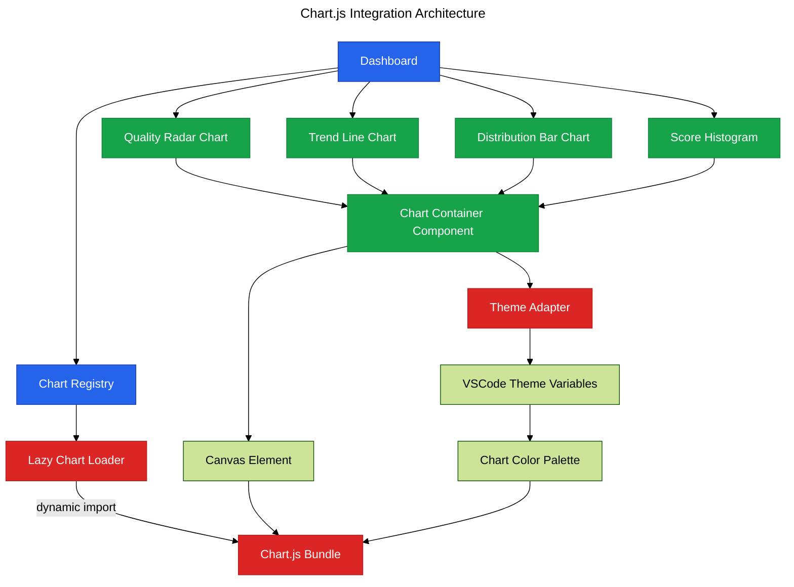

# Phase 13: Chart.js Integration

**Purpose**: Add data visualization using Chart.js for trends, distributions, and quality metrics.

**Dependencies**: Phase 12 (Dashboard Data Display)

**Deliverables**: Chart.js setup, radar chart for quality scores, line chart for trends, bar chart for distributions

## Overview

Phase 13 enhances the dashboard with interactive data visualizations:

1. Add Chart.js dependency and theme-aware configuration
2. Create reusable chart container component
3. Implement quality score radar chart
4. Build complexity trend line chart
5. Add issue distribution bar chart
6. Create file score distribution histogram
7. Lazy-load Chart.js bundle to optimize initial load

## Architecture



## File Changes

### 1. Add Chart.js Dependency

**File**: `clients/vscode-extension/package.json` (additions)

```json
{
  "dependencies": {
    "chart.js": "^4.4.0"
  }
}
```

### 2. Theme Adapter for Chart.js

**File**: `src/webview/utils/chart-theme.ts`

```typescript
import type { ChartOptions } from 'chart.js';

/**
 * Get Chart.js theme configuration based on VSCode theme
 */
export function getChartTheme(): Partial<ChartOptions> {
  const styles = getComputedStyle(document.documentElement);

  const foreground = styles.getPropertyValue('--vscode-foreground').trim();
  const gridColor = styles.getPropertyValue('--vscode-panel-border').trim();
  const backgroundColor = styles.getPropertyValue('--vscode-editor-background').trim();

  return {
    responsive: true,
    maintainAspectRatio: false,
    plugins: {
      legend: {
        labels: {
          color: foreground,
          font: {
            family: styles.getPropertyValue('--vscode-font-family').trim(),
            size: 12,
          },
        },
      },
      tooltip: {
        backgroundColor: backgroundColor,
        titleColor: foreground,
        bodyColor: foreground,
        borderColor: gridColor,
        borderWidth: 1,
      },
    },
    scales: {
      x: {
        grid: {
          color: gridColor,
        },
        ticks: {
          color: foreground,
        },
      },
      y: {
        grid: {
          color: gridColor,
        },
        ticks: {
          color: foreground,
        },
      },
    },
  };
}

/**
 * Get theme-aware color palette for charts
 */
export function getChartColors() {
  const styles = getComputedStyle(document.documentElement);

  return {
    critical: styles.getPropertyValue('--vscode-errorForeground').trim(),
    error: styles.getPropertyValue('--vscode-editorError-foreground').trim(),
    warning: styles.getPropertyValue('--vscode-editorWarning-foreground').trim(),
    info: styles.getPropertyValue('--vscode-editorInfo-foreground').trim(),
    success: styles.getPropertyValue('--vscode-terminal-ansiGreen').trim(),
    primary: styles.getPropertyValue('--vscode-terminal-ansiBlue').trim(),
    secondary: styles.getPropertyValue('--vscode-descriptionForeground').trim(),
  };
}
```

### 3. Chart Container Component

**File**: `src/webview/components/chart-container.ts`

```typescript
import { LitElement, html, css } from 'lit';
import { customElement, property, state } from 'lit/decorators.js';
import { ref, createRef, Ref } from 'lit/directives/ref.js';
import type { Chart, ChartConfiguration } from 'chart.js';

/**
 * Reusable chart container component
 */
@customElement('vipr-chart-container')
export class ViprChartContainer extends LitElement {
  @property({ type: Object })
  config: ChartConfiguration | null = null;

  @property({ type: String })
  title = '';

  @state()
  private chart: Chart | null = null;

  private canvasRef: Ref<HTMLCanvasElement> = createRef();

  static styles = css`
    :host {
      display: block;
    }

    .chart-wrapper {
      padding: 16px;
      border: 1px solid var(--vscode-panel-border);
      border-radius: 6px;
      background: var(--vscode-editor-background);
    }

    .chart-title {
      font-size: 14px;
      font-weight: 600;
      margin-bottom: 16px;
      color: var(--vscode-foreground);
    }

    .chart-canvas-wrapper {
      position: relative;
      height: 300px;
    }

    canvas {
      max-width: 100%;
    }
  `;

  async connectedCallback() {
    super.connectedCallback();
    await this.loadChart();
  }

  async updated(changedProperties: Map<string, any>) {
    if (changedProperties.has('config') && this.config) {
      await this.updateChart();
    }
  }

  disconnectedCallback() {
    super.disconnectedCallback();
    this.destroyChart();
  }

  private async loadChart() {
    // Lazy load Chart.js
    const { Chart, registerables } = await import('chart.js');
    Chart.register(...registerables);

    if (this.config && this.canvasRef.value) {
      this.chart = new Chart(this.canvasRef.value, this.config);
    }
  }

  private async updateChart() {
    if (!this.chart || !this.config) {
      await this.loadChart();
      return;
    }

    // Update existing chart
    this.chart.data = this.config.data;
    this.chart.options = this.config.options || {};
    this.chart.update();
  }

  private destroyChart() {
    if (this.chart) {
      this.chart.destroy();
      this.chart = null;
    }
  }

  render() {
    return html`
      <div class="chart-wrapper">
        ${this.title ? html`<div class="chart-title">${this.title}</div>` : ''}
        <div class="chart-canvas-wrapper">
          <canvas ${ref(this.canvasRef)}></canvas>
        </div>
      </div>
    `;
  }
}
```

### 4. Quality Radar Chart Component

**File**: `src/webview/components/quality-radar-chart.ts`

```typescript
import { LitElement, html, css } from 'lit';
import { customElement, property, state } from 'lit/decorators.js';
import type { ChartConfiguration } from 'chart.js';
import { getChartTheme, getChartColors } from '../utils/chart-theme';
import './chart-container';

export interface QualityMetrics {
  complexity: number;
  maintainability: number;
  testability: number;
  security: number;
  accessibility: number;
}

/**
 * Quality metrics radar chart
 */
@customElement('vipr-quality-radar-chart')
export class ViprQualityRadarChart extends LitElement {
  @property({ type: Object })
  metrics: QualityMetrics = {
    complexity: 0,
    maintainability: 0,
    testability: 0,
    security: 0,
    accessibility: 0,
  };

  @state()
  private chartConfig: ChartConfiguration | null = null;

  static styles = css`
    :host {
      display: block;
    }
  `;

  updated(changedProperties: Map<string, any>) {
    if (changedProperties.has('metrics')) {
      this.updateChartConfig();
    }
  }

  private updateChartConfig() {
    const theme = getChartTheme();
    const colors = getChartColors();

    this.chartConfig = {
      type: 'radar',
      data: {
        labels: ['Complexity', 'Maintainability', 'Testability', 'Security', 'Accessibility'],
        datasets: [
          {
            label: 'Current',
            data: [
              this.metrics.complexity,
              this.metrics.maintainability,
              this.metrics.testability,
              this.metrics.security,
              this.metrics.accessibility,
            ],
            backgroundColor: colors.primary + '33', // 20% opacity
            borderColor: colors.primary,
            borderWidth: 2,
            pointBackgroundColor: colors.primary,
            pointBorderColor: '#fff',
            pointHoverBackgroundColor: '#fff',
            pointHoverBorderColor: colors.primary,
          },
        ],
      },
      options: {
        ...theme,
        scales: {
          r: {
            beginAtZero: true,
            max: 100,
            ticks: {
              stepSize: 20,
              color: theme.scales?.x?.ticks?.color,
            },
            grid: {
              color: theme.scales?.x?.grid?.color,
            },
            pointLabels: {
              color: theme.scales?.x?.ticks?.color,
            },
          },
        },
      },
    };
  }

  render() {
    return html`
      <vipr-chart-container
        .config=${this.chartConfig}
        title="Quality Metrics"
      ></vipr-chart-container>
    `;
  }
}
```

### 5. Trend Line Chart Component

**File**: `src/webview/components/trend-line-chart.ts`

```typescript
import { LitElement, html, css } from 'lit';
import { customElement, property, state } from 'lit/decorators.js';
import type { ChartConfiguration } from 'chart.js';
import { getChartTheme, getChartColors } from '../utils/chart-theme';
import './chart-container';

export interface TrendDataPoint {
  date: string;
  score: number;
}

/**
 * Trend line chart for score over time
 */
@customElement('vipr-trend-line-chart')
export class ViprTrendLineChart extends LitElement {
  @property({ type: Array })
  data: TrendDataPoint[] = [];

  @state()
  private chartConfig: ChartConfiguration | null = null;

  static styles = css`
    :host {
      display: block;
    }
  `;

  updated(changedProperties: Map<string, any>) {
    if (changedProperties.has('data')) {
      this.updateChartConfig();
    }
  }

  private updateChartConfig() {
    const theme = getChartTheme();
    const colors = getChartColors();

    this.chartConfig = {
      type: 'line',
      data: {
        labels: this.data.map(d => d.date),
        datasets: [
          {
            label: 'Quality Score',
            data: this.data.map(d => d.score),
            borderColor: colors.primary,
            backgroundColor: colors.primary + '33',
            tension: 0.4,
            fill: true,
          },
        ],
      },
      options: {
        ...theme,
        plugins: {
          ...theme.plugins,
          legend: {
            display: false,
          },
        },
      },
    };
  }

  render() {
    return html`
      <vipr-chart-container
        .config=${this.chartConfig}
        title="Quality Trend"
      ></vipr-chart-container>
    `;
  }
}
```

### 6. Distribution Bar Chart Component

**File**: `src/webview/components/distribution-bar-chart.ts`

```typescript
import { LitElement, html, css } from 'lit';
import { customElement, property, state } from 'lit/decorators.js';
import type { ChartConfiguration } from 'chart.js';
import { getChartTheme, getChartColors } from '../utils/chart-theme';
import './chart-container';

export interface Distribution {
  critical: number;
  error: number;
  warning: number;
  info: number;
}

/**
 * Issue distribution bar chart
 */
@customElement('vipr-distribution-bar-chart')
export class ViprDistributionBarChart extends LitElement {
  @property({ type: Object })
  distribution: Distribution = {
    critical: 0,
    error: 0,
    warning: 0,
    info: 0,
  };

  @state()
  private chartConfig: ChartConfiguration | null = null;

  static styles = css`
    :host {
      display: block;
    }
  `;

  updated(changedProperties: Map<string, any>) {
    if (changedProperties.has('distribution')) {
      this.updateChartConfig();
    }
  }

  private updateChartConfig() {
    const theme = getChartTheme();
    const colors = getChartColors();

    this.chartConfig = {
      type: 'bar',
      data: {
        labels: ['Critical', 'Error', 'Warning', 'Info'],
        datasets: [
          {
            label: 'Issue Count',
            data: [
              this.distribution.critical,
              this.distribution.error,
              this.distribution.warning,
              this.distribution.info,
            ],
            backgroundColor: [colors.critical, colors.error, colors.warning, colors.info],
            borderWidth: 0,
          },
        ],
      },
      options: {
        ...theme,
        plugins: {
          ...theme.plugins,
          legend: {
            display: false,
          },
        },
      },
    };
  }

  render() {
    return html`
      <vipr-chart-container
        .config=${this.chartConfig}
        title="Issue Distribution"
      ></vipr-chart-container>
    `;
  }
}
```

### 7. Update Dashboard to Include Charts

**File**: `src/webview/dashboard-app.ts` (additions)

```typescript
import './components/quality-radar-chart';
import './components/trend-line-chart';
import './components/distribution-bar-chart';

// Add to AnalysisData interface
interface AnalysisData {
  // ... existing fields
  qualityMetrics: {
    complexity: number;
    maintainability: number;
    testability: number;
    security: number;
    accessibility: number;
  };
  trend: Array<{
    date: string;
    score: number;
  }>;
  issueDistribution: {
    critical: number;
    error: number;
    warning: number;
    info: number;
  };
}

// Update render method to include charts
${this.selectedReport === 'overview'
  ? html`
      <div style="display: grid; grid-template-columns: 1fr 1fr; gap: 24px; margin-bottom: 24px;">
        <vipr-quality-radar-chart
          .metrics=${this.analysisData.qualityMetrics}
        ></vipr-quality-radar-chart>
        <vipr-distribution-bar-chart
          .distribution=${this.analysisData.issueDistribution}
        ></vipr-distribution-bar-chart>
      </div>
      <vipr-trend-line-chart .data=${this.analysisData.trend}></vipr-trend-line-chart>
      <vipr-metrics-grid .metrics=${this.analysisData.metrics}></vipr-metrics-grid>
    `
  : ''}
```

## Configuration

Update esbuild configuration to handle Chart.js:

**File**: `clients/vscode-extension/esbuild.webview.mjs` (ensure tree-shaking works)

```javascript
// Chart.js is already ESM-compatible and tree-shakeable
// No special configuration needed
```

## Acceptance Criteria

- [ ] Chart.js loads lazily when charts are displayed
- [ ] Quality radar chart displays five quality dimensions
- [ ] Radar chart uses theme-aware colors
- [ ] Trend line chart shows quality score over time
- [ ] Distribution bar chart shows issue counts by severity
- [ ] Charts use correct VSCode theme colors
- [ ] Charts update when theme changes (light/dark)
- [ ] Charts are responsive to container size
- [ ] Tooltips display on hover with correct styling
- [ ] Charts render without blocking main thread
- [ ] Bundle size increase is acceptable (< 200KB gzipped for Chart.js)
- [ ] No console errors or warnings

## Testing Strategy

### Bundle Size Verification

```bash
cd clients/vscode-extension
pnpm build
ls -lh dist/webview/dashboard-app.js
# Should be < 500KB for full bundle including Chart.js
```

### Manual Verification

1. Open dashboard with analysis data
2. Navigate to Overview report
3. Verify three charts render:
   - Quality radar chart at top left
   - Issue distribution bar chart at top right
   - Trend line chart below
4. Hover over radar chart:
   - Verify tooltip shows metric name and value
   - Verify tooltip uses theme colors
5. Hover over bar chart:
   - Verify tooltip shows severity and count
6. Hover over line chart:
   - Verify tooltip shows date and score
7. Switch VSCode theme (light ↔ dark)
8. Verify all charts update colors automatically
9. Resize dashboard panel
10. Verify charts resize responsively
11. Check browser developer tools:
    - Verify Chart.js loaded via dynamic import
    - Verify no console errors
12. Navigate away from Overview and back
13. Verify charts re-render correctly
14. Test with different data:
    - All zero values
    - Very high values (> 100)
    - Missing trend data
15. Verify charts handle edge cases gracefully

### Performance Testing

1. Open dashboard with 100+ files
2. Navigate to Overview with charts
3. Measure time to render:
   - Should be < 500ms for initial render
   - Should be < 100ms for updates
4. Check memory usage:
   - Should not leak when navigating between views
   - Should clean up charts properly

## Summary

Phase 13 adds rich data visualizations using Chart.js with lazy loading, theme-aware styling, and responsive design, providing users with intuitive visual insights into code quality metrics and trends.
