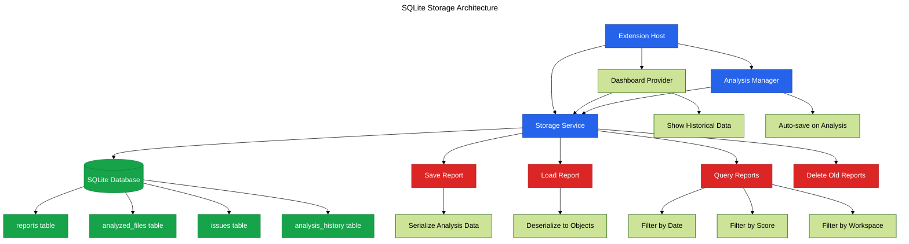

# Phase 15: SQLite Storage Foundation

**Purpose**: Implement SQLite database storage for persistent analysis reports and history.

**Dependencies**: Phase 10 (@vscode-elements Foundation)

**Deliverables**: SQLite database setup, report persistence, history tracking, query interface

## Overview

Phase 15 adds persistent storage for analysis results:

1. Add node-sqlite3-wasm dependency
2. Create database service with schema
3. Implement report storage and retrieval
4. Add analysis history tracking
5. Create query interface for filtering reports
6. Implement data retention policies
7. Add database migration system

## Architecture



## File Changes

### 1. Add SQLite Dependency

**File**: `clients/vscode-extension/package.json` (additions)

```json
{
  "dependencies": {
    "node-sqlite3-wasm": "^0.8.0"
  }
}
```

### 2. Database Schema

**File**: `src/core/database-schema.ts`

```typescript
export const DATABASE_VERSION = 1;

export const SCHEMA = `
-- Reports table - stores complete analysis reports
CREATE TABLE IF NOT EXISTS reports (
  id TEXT PRIMARY KEY,
  workspace_path TEXT NOT NULL,
  created_at INTEGER NOT NULL,
  overall_score INTEGER NOT NULL,
  file_count INTEGER NOT NULL,
  issue_count INTEGER NOT NULL,
  summary TEXT,
  UNIQUE(workspace_path, created_at)
);

-- Analyzed files table
CREATE TABLE IF NOT EXISTS analyzed_files (
  id TEXT PRIMARY KEY,
  report_id TEXT NOT NULL,
  file_path TEXT NOT NULL,
  relative_path TEXT NOT NULL,
  score INTEGER NOT NULL,
  complexity REAL,
  maintainability REAL,
  issue_count INTEGER NOT NULL,
  FOREIGN KEY (report_id) REFERENCES reports(id) ON DELETE CASCADE
);

-- Issues table
CREATE TABLE IF NOT EXISTS issues (
  id TEXT PRIMARY KEY,
  file_id TEXT NOT NULL,
  severity TEXT NOT NULL,
  category TEXT NOT NULL,
  message TEXT NOT NULL,
  line INTEGER,
  column INTEGER,
  auto_fixable INTEGER DEFAULT 0,
  FOREIGN KEY (file_id) REFERENCES analyzed_files(id) ON DELETE CASCADE
);

-- Analysis history for trend tracking
CREATE TABLE IF NOT EXISTS analysis_history (
  id TEXT PRIMARY KEY,
  workspace_path TEXT NOT NULL,
  timestamp INTEGER NOT NULL,
  overall_score INTEGER NOT NULL,
  file_count INTEGER NOT NULL,
  issue_count INTEGER NOT NULL
);

-- Metadata table for schema versioning
CREATE TABLE IF NOT EXISTS metadata (
  key TEXT PRIMARY KEY,
  value TEXT NOT NULL
);

-- Indexes for common queries
CREATE INDEX IF NOT EXISTS idx_reports_workspace ON reports(workspace_path);
CREATE INDEX IF NOT EXISTS idx_reports_created ON reports(created_at DESC);
CREATE INDEX IF NOT EXISTS idx_files_report ON analyzed_files(report_id);
CREATE INDEX IF NOT EXISTS idx_files_score ON analyzed_files(score);
CREATE INDEX IF NOT EXISTS idx_issues_file ON issues(file_id);
CREATE INDEX IF NOT EXISTS idx_issues_severity ON issues(severity);
CREATE INDEX IF NOT EXISTS idx_history_workspace ON analysis_history(workspace_path);
CREATE INDEX IF NOT EXISTS idx_history_timestamp ON analysis_history(timestamp DESC);
`;

export const MIGRATIONS: Record<number, string> = {
  // Future migrations will be added here
};
```

### 3. Storage Service

**File**: `src/core/storage-service.ts`

```typescript
import * as vscode from 'vscode';
import { Database } from 'node-sqlite3-wasm';
import * as crypto from 'crypto';
import { SCHEMA, DATABASE_VERSION } from './database-schema';
import type { FileAnalysisResult, ComplexityInsight } from '@vipr/common';

export interface StoredReport {
  id: string;
  workspacePath: string;
  createdAt: number;
  overallScore: number;
  fileCount: number;
  issueCount: number;
  summary?: string;
}

export interface TrendDataPoint {
  timestamp: number;
  score: number;
  fileCount: number;
  issueCount: number;
}

/**
 * SQLite-based storage service for analysis reports
 */
export class StorageService {
  private db: Database | null = null;
  private dbPath: string;

  constructor(private context: vscode.ExtensionContext) {
    this.dbPath = vscode.Uri.joinPath(context.globalStorageUri, 'vipr.db').fsPath;
  }

  /**
   * Initialize database connection and schema
   */
  async initialize(): Promise<void> {
    try {
      // Ensure storage directory exists
      await vscode.workspace.fs.createDirectory(this.context.globalStorageUri);

      // Open database
      this.db = new Database(this.dbPath);

      // Create schema
      this.db.exec(SCHEMA);

      // Check and update schema version
      await this.ensureSchemaVersion();

      console.log('[Vipr] Database initialized:', this.dbPath);
    } catch (error) {
      console.error('[Vipr] Failed to initialize database:', error);
      throw error;
    }
  }

  /**
   * Ensure database schema is up to date
   */
  private async ensureSchemaVersion(): Promise<void> {
    if (!this.db) return;

    const stmt = this.db.prepare('SELECT value FROM metadata WHERE key = ?');
    const row = stmt.get(['schema_version']) as { value: string } | undefined;
    stmt.finalize();

    const currentVersion = row ? parseInt(row.value, 10) : 0;

    if (currentVersion < DATABASE_VERSION) {
      console.log(`[Vipr] Migrating database from v${currentVersion} to v${DATABASE_VERSION}`);
      // Apply migrations if needed
      this.db.exec(`
        INSERT OR REPLACE INTO metadata (key, value)
        VALUES ('schema_version', '${DATABASE_VERSION}')
      `);
    }
  }

  /**
   * Save analysis report
   */
  async saveReport(
    workspacePath: string,
    overallScore: number,
    fileResults: FileAnalysisResult[]
  ): Promise<string> {
    if (!this.db) {
      throw new Error('Database not initialized');
    }

    const reportId = this.generateId();
    const timestamp = Date.now();
    const issueCount = fileResults.reduce((sum, f) => sum + f.insights.length, 0);

    try {
      this.db.exec('BEGIN TRANSACTION');

      // Insert report
      const insertReport = this.db.prepare(`
        INSERT INTO reports (id, workspace_path, created_at, overall_score, file_count, issue_count)
        VALUES (?, ?, ?, ?, ?, ?)
      `);
      insertReport.run([
        reportId,
        workspacePath,
        timestamp,
        overallScore,
        fileResults.length,
        issueCount,
      ]);
      insertReport.finalize();

      // Insert files and issues
      for (const fileResult of fileResults) {
        const fileId = this.generateId();

        const insertFile = this.db.prepare(`
          INSERT INTO analyzed_files
          (id, report_id, file_path, relative_path, score, complexity, maintainability, issue_count)
          VALUES (?, ?, ?, ?, ?, ?, ?, ?)
        `);
        insertFile.run([
          fileId,
          reportId,
          fileResult.filePath,
          fileResult.filePath.replace(workspacePath, ''),
          fileResult.overallScore,
          fileResult.metrics.cyclomaticComplexity || 0,
          fileResult.metrics.maintainabilityIndex || 0,
          fileResult.insights.length,
        ]);
        insertFile.finalize();

        // Insert issues
        for (const insight of fileResult.insights) {
          const issueId = this.generateId();
          const insertIssue = this.db.prepare(`
            INSERT INTO issues
            (id, file_id, severity, category, message, line, column, auto_fixable)
            VALUES (?, ?, ?, ?, ?, ?, ?, ?)
          `);
          insertIssue.run([
            issueId,
            fileId,
            insight.severity,
            insight.category,
            insight.message,
            insight.location?.line || null,
            insight.location?.column || null,
            insight.autoFixable ? 1 : 0,
          ]);
          insertIssue.finalize();
        }
      }

      // Add to history for trend tracking
      const historyId = this.generateId();
      const insertHistory = this.db.prepare(`
        INSERT INTO analysis_history
        (id, workspace_path, timestamp, overall_score, file_count, issue_count)
        VALUES (?, ?, ?, ?, ?, ?)
      `);
      insertHistory.run([
        historyId,
        workspacePath,
        timestamp,
        overallScore,
        fileResults.length,
        issueCount,
      ]);
      insertHistory.finalize();

      this.db.exec('COMMIT');

      console.log(`[Vipr] Saved report ${reportId} with ${fileResults.length} files`);
      return reportId;
    } catch (error) {
      this.db.exec('ROLLBACK');
      console.error('[Vipr] Failed to save report:', error);
      throw error;
    }
  }

  /**
   * Load report by ID
   */
  async loadReport(reportId: string): Promise<StoredReport | null> {
    if (!this.db) {
      throw new Error('Database not initialized');
    }

    const stmt = this.db.prepare(`
      SELECT id, workspace_path, created_at, overall_score, file_count, issue_count, summary
      FROM reports
      WHERE id = ?
    `);
    const row = stmt.get([reportId]) as any;
    stmt.finalize();

    if (!row) {
      return null;
    }

    return {
      id: row.id,
      workspacePath: row.workspace_path,
      createdAt: row.created_at,
      overallScore: row.overall_score,
      fileCount: row.file_count,
      issueCount: row.issue_count,
      summary: row.summary,
    };
  }

  /**
   * Get report history for workspace
   */
  async getWorkspaceHistory(workspacePath: string, limit = 30): Promise<TrendDataPoint[]> {
    if (!this.db) {
      throw new Error('Database not initialized');
    }

    const stmt = this.db.prepare(`
      SELECT timestamp, overall_score, file_count, issue_count
      FROM analysis_history
      WHERE workspace_path = ?
      ORDER BY timestamp DESC
      LIMIT ?
    `);
    const rows = stmt.all([workspacePath, limit]) as any[];
    stmt.finalize();

    return rows.map(row => ({
      timestamp: row.timestamp,
      score: row.overall_score,
      fileCount: row.file_count,
      issueCount: row.issue_count,
    }));
  }

  /**
   * Get all reports for workspace
   */
  async getWorkspaceReports(workspacePath: string, limit = 10): Promise<StoredReport[]> {
    if (!this.db) {
      throw new Error('Database not initialized');
    }

    const stmt = this.db.prepare(`
      SELECT id, workspace_path, created_at, overall_score, file_count, issue_count, summary
      FROM reports
      WHERE workspace_path = ?
      ORDER BY created_at DESC
      LIMIT ?
    `);
    const rows = stmt.all([workspacePath, limit]) as any[];
    stmt.finalize();

    return rows.map(row => ({
      id: row.id,
      workspacePath: row.workspace_path,
      createdAt: row.created_at,
      overallScore: row.overall_score,
      fileCount: row.file_count,
      issueCount: row.issue_count,
      summary: row.summary,
    }));
  }

  /**
   * Delete reports older than specified days
   */
  async deleteOldReports(daysToKeep = 30): Promise<number> {
    if (!this.db) {
      throw new Error('Database not initialized');
    }

    const cutoffTime = Date.now() - daysToKeep * 24 * 60 * 60 * 1000;

    const stmt = this.db.prepare('DELETE FROM reports WHERE created_at < ?');
    stmt.run([cutoffTime]);
    const changes = this.db.changes();
    stmt.finalize();

    console.log(`[Vipr] Deleted ${changes} old reports`);
    return changes;
  }

  /**
   * Close database connection
   */
  dispose(): void {
    if (this.db) {
      this.db.close();
      this.db = null;
    }
  }

  /**
   * Generate unique ID
   */
  private generateId(): string {
    return crypto.randomBytes(16).toString('hex');
  }
}
```

### 4. Integrate Storage with Extension

**File**: `src/extension.ts` (additions)

```typescript
import { StorageService } from './core/storage-service';

let storageService: StorageService | undefined;

export async function activate(context: vscode.ExtensionContext) {
  // Initialize storage service
  storageService = new StorageService(context);
  await storageService.initialize();

  context.subscriptions.push({
    dispose: () => storageService?.dispose(),
  });

  // ... rest of activation code
}

/**
 * Save analysis results to storage
 */
export async function saveAnalysisReport(
  workspacePath: string,
  overallScore: number,
  fileResults: FileAnalysisResult[]
): Promise<void> {
  if (storageService) {
    await storageService.saveReport(workspacePath, overallScore, fileResults);
  }
}

/**
 * Get workspace history for trend charts
 */
export async function getWorkspaceHistory(workspacePath: string): Promise<TrendDataPoint[]> {
  if (storageService) {
    return storageService.getWorkspaceHistory(workspacePath);
  }
  return [];
}
```

### 5. Add Cleanup Command

**File**: `src/commands/cleanup-storage.ts`

```typescript
import * as vscode from 'vscode';
import { getExtensionState } from '../extension';

/**
 * Command: Clean up old analysis reports
 */
export async function cleanupStorage(): Promise<void> {
  const { storageService } = getExtensionState();

  const result = await vscode.window.showQuickPick(
    ['Keep 7 days', 'Keep 30 days', 'Keep 90 days', 'Keep all'],
    {
      placeHolder: 'How long should analysis reports be kept?',
    }
  );

  if (!result) {
    return;
  }

  const daysMap: Record<string, number> = {
    'Keep 7 days': 7,
    'Keep 30 days': 30,
    'Keep 90 days': 90,
    'Keep all': 365 * 10, // 10 years
  };

  const days = daysMap[result];

  await vscode.window.withProgress(
    {
      location: vscode.ProgressLocation.Notification,
      title: 'Cleaning up old reports...',
    },
    async () => {
      const deleted = await storageService.deleteOldReports(days);
      vscode.window.showInformationMessage(`Deleted ${deleted} old report(s)`);
    }
  );
}
```

## Configuration

Add storage cleanup setting:

**File**: `clients/vscode-extension/package.json` (additions)

```json
{
  "configuration": {
    "properties": {
      "vipr.storage.retentionDays": {
        "type": "number",
        "default": 30,
        "description": "Number of days to keep analysis reports"
      },
      "vipr.storage.autoCleanup": {
        "type": "boolean",
        "default": true,
        "description": "Automatically clean up old reports on startup"
      }
    }
  },
  "commands": [
    {
      "command": "vipr.cleanupStorage",
      "title": "Clean Up Old Reports",
      "category": "Vipr"
    }
  ]
}
```

## Acceptance Criteria

- [ ] SQLite database initializes in globalStorageUri
- [ ] Database schema creates all required tables
- [ ] Analysis reports save successfully
- [ ] Reports can be loaded by ID
- [ ] Workspace history returns trend data
- [ ] Old reports can be deleted based on retention policy
- [ ] Database handles concurrent access safely
- [ ] Foreign key constraints work correctly
- [ ] Indexes improve query performance
- [ ] Database closes properly on extension deactivation
- [ ] Storage cleanup command works correctly
- [ ] No data corruption on extension crashes
- [ ] Database file size remains reasonable (< 50MB for typical usage)

## Testing Strategy

### Unit Tests

**File**: `src/core/storage-service.test.ts`

```typescript
import { describe, it, expect, beforeEach, afterEach } from 'vitest';
import { StorageService } from './storage-service';
import * as vscode from 'vscode';
import * as fs from 'fs';
import * as path from 'path';

describe('StorageService', () => {
  let service: StorageService;
  let tempDir: string;

  beforeEach(async () => {
    tempDir = path.join(__dirname, '../../.test-storage');
    if (!fs.existsSync(tempDir)) {
      fs.mkdirSync(tempDir, { recursive: true });
    }

    const mockContext = {
      globalStorageUri: vscode.Uri.file(tempDir),
    } as any;

    service = new StorageService(mockContext);
    await service.initialize();
  });

  afterEach(() => {
    service.dispose();
    if (fs.existsSync(tempDir)) {
      fs.rmSync(tempDir, { recursive: true });
    }
  });

  it('should save and load report', async () => {
    const reportId = await service.saveReport('/workspace', 85, [
      {
        filePath: '/workspace/test.ts',
        overallScore: 85,
        insights: [],
        metrics: { cyclomaticComplexity: 5, maintainabilityIndex: 70 },
      } as any,
    ]);

    const report = await service.loadReport(reportId);
    expect(report).not.toBeNull();
    expect(report?.overallScore).toBe(85);
    expect(report?.fileCount).toBe(1);
  });

  it('should retrieve workspace history', async () => {
    await service.saveReport('/workspace', 80, []);
    await service.saveReport('/workspace', 85, []);

    const history = await service.getWorkspaceHistory('/workspace');
    expect(history.length).toBeGreaterThan(0);
    expect(history[0].score).toBe(85);
  });

  it('should delete old reports', async () => {
    await service.saveReport('/workspace', 80, []);
    const deleted = await service.deleteOldReports(0); // Delete all
    expect(deleted).toBeGreaterThan(0);
  });
});
```

### Manual Verification

1. Open extension in debug mode
2. Run "Vipr: Analyze Workspace"
3. Check extension logs for "Database initialized" message
4. Verify database file created in:
   - macOS: `~/Library/Application Support/Code/User/globalStorage/<extension-id>/`
   - Windows: `%APPDATA%\Code\User\globalStorage\<extension-id>\`
   - Linux: `~/.config/Code/User/globalStorage/<extension-id>/`
5. Run analysis multiple times
6. Open dashboard and verify trend chart shows historical data
7. Run "Vipr: Clean Up Old Reports"
8. Select retention period
9. Verify old reports deleted
10. Close and reopen VSCode
11. Verify data persists across sessions
12. Test with large workspace (100+ files)
13. Verify database performance remains good
14. Check database file size

### Performance Testing

1. Run analysis on workspace with 1000 files
2. Measure save time (should be < 1 second)
3. Query history 100 times
4. Measure query time (should be < 50ms per query)
5. Verify no memory leaks after multiple analysis runs

## Summary

Phase 15 provides robust persistent storage for analysis reports using SQLite, enabling historical trend tracking, report comparison, and efficient data querying without blocking the main extension thread.
