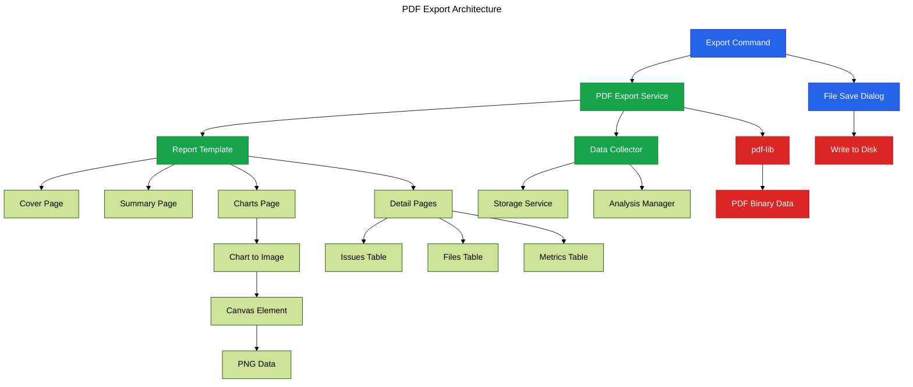

# Phase 16: PDF Export

**Purpose**: Enable PDF export of analysis reports with charts, tables, and formatted data.

**Dependencies**: Phase 15 (SQLite Storage), Phase 13 (Chart.js Integration)

**Deliverables**: PDF generation service, report templates, export command, file save dialog

## Overview

Phase 16 adds professional PDF report generation:

1. Add pdf-lib dependency for PDF creation
2. Create PDF generation service
3. Implement report template system
4. Add chart-to-image conversion for embedding
5. Create table and text formatting helpers
6. Implement export command with progress
7. Add export options configuration

## Architecture



## File Changes

### 1. Add PDF Dependencies

**File**: `clients/vscode-extension/package.json` (additions)

```json
{
  "dependencies": {
    "pdf-lib": "^1.17.0"
  }
}
```

### 2. Chart to Image Converter

**File**: `src/services/chart-to-image.ts`

```typescript
import type { Chart } from 'chart.js';

/**
 * Convert Chart.js chart to PNG data URL
 */
export async function chartToImage(chart: Chart, width = 800, height = 400): Promise<string> {
  // Get the canvas element from the chart
  const canvas = chart.canvas;

  // Create a new canvas with desired dimensions
  const exportCanvas = document.createElement('canvas');
  exportCanvas.width = width;
  exportCanvas.height = height;

  const ctx = exportCanvas.getContext('2d');
  if (!ctx) {
    throw new Error('Failed to get canvas context');
  }

  // Draw white background
  ctx.fillStyle = '#ffffff';
  ctx.fillRect(0, 0, width, height);

  // Draw the chart
  ctx.drawImage(canvas, 0, 0, width, height);

  // Convert to data URL
  return exportCanvas.toDataURL('image/png');
}
```

### 3. PDF Export Service

**File**: `src/services/pdf-export-service.ts`

```typescript
import * as vscode from 'vscode';
import { PDFDocument, rgb, StandardFonts } from 'pdf-lib';
import type { FileAnalysisResult, ComplexityInsight } from '@vipr/common';

export interface ExportOptions {
  includeCharts: boolean;
  includeDetailedIssues: boolean;
  includeFileList: boolean;
  includeMetrics: boolean;
}

export interface ReportData {
  workspaceName: string;
  timestamp: number;
  overallScore: number;
  fileCount: number;
  issueCount: number;
  fileResults: FileAnalysisResult[];
  chartImages?: {
    radar?: string;
    trend?: string;
    distribution?: string;
  };
}

/**
 * PDF export service for analysis reports
 */
export class PDFExportService {
  /**
   * Generate PDF report
   */
  async generateReport(data: ReportData, options: ExportOptions): Promise<Uint8Array> {
    const pdfDoc = await PDFDocument.create();
    const font = await pdfDoc.embedFont(StandardFonts.Helvetica);
    const boldFont = await pdfDoc.embedFont(StandardFonts.HelveticaBold);

    // Add cover page
    await this.addCoverPage(pdfDoc, font, boldFont, data);

    // Add summary page
    await this.addSummaryPage(pdfDoc, font, boldFont, data);

    // Add charts page if requested and available
    if (options.includeCharts && data.chartImages) {
      await this.addChartsPage(pdfDoc, font, boldFont, data);
    }

    // Add metrics table if requested
    if (options.includeMetrics) {
      await this.addMetricsPage(pdfDoc, font, boldFont, data);
    }

    // Add file list if requested
    if (options.includeFileList) {
      await this.addFileListPage(pdfDoc, font, boldFont, data);
    }

    // Add detailed issues if requested
    if (options.includeDetailedIssues) {
      await this.addIssuesPages(pdfDoc, font, boldFont, data);
    }

    // Serialize the PDF
    const pdfBytes = await pdfDoc.save();
    return pdfBytes;
  }

  /**
   * Add cover page
   */
  private async addCoverPage(
    pdfDoc: PDFDocument,
    font: any,
    boldFont: any,
    data: ReportData
  ): Promise<void> {
    const page = pdfDoc.addPage([595, 842]); // A4
    const { width, height } = page.getSize();

    // Title
    page.drawText('Code Quality Analysis Report', {
      x: 50,
      y: height - 100,
      size: 28,
      font: boldFont,
      color: rgb(0.2, 0.2, 0.2),
    });

    // Workspace name
    page.drawText(data.workspaceName, {
      x: 50,
      y: height - 140,
      size: 18,
      font: font,
      color: rgb(0.4, 0.4, 0.4),
    });

    // Date
    const date = new Date(data.timestamp).toLocaleDateString('en-US', {
      year: 'numeric',
      month: 'long',
      day: 'numeric',
    });
    page.drawText(`Generated: ${date}`, {
      x: 50,
      y: height - 180,
      size: 12,
      font: font,
      color: rgb(0.5, 0.5, 0.5),
    });

    // Overall score (large centered)
    const scoreColor = this.getScoreColor(data.overallScore);
    page.drawText(data.overallScore.toString(), {
      x: width / 2 - 50,
      y: height / 2,
      size: 80,
      font: boldFont,
      color: scoreColor,
    });

    page.drawText('Overall Quality Score', {
      x: width / 2 - 80,
      y: height / 2 - 40,
      size: 14,
      font: font,
      color: rgb(0.4, 0.4, 0.4),
    });

    // Summary stats
    const statsY = height / 2 - 100;
    page.drawText(`Files Analyzed: ${data.fileCount}`, {
      x: width / 2 - 70,
      y: statsY,
      size: 12,
      font: font,
      color: rgb(0.3, 0.3, 0.3),
    });

    page.drawText(`Issues Found: ${data.issueCount}`, {
      x: width / 2 - 70,
      y: statsY - 20,
      size: 12,
      font: font,
      color: rgb(0.3, 0.3, 0.3),
    });

    // Footer
    page.drawText('Generated by Vipr - Code Quality Analysis', {
      x: 50,
      y: 30,
      size: 10,
      font: font,
      color: rgb(0.6, 0.6, 0.6),
    });
  }

  /**
   * Add summary page
   */
  private async addSummaryPage(
    pdfDoc: PDFDocument,
    font: any,
    boldFont: any,
    data: ReportData
  ): Promise<void> {
    const page = pdfDoc.addPage([595, 842]);
    const { width, height } = page.getSize();
    let yPosition = height - 60;

    // Title
    page.drawText('Executive Summary', {
      x: 50,
      y: yPosition,
      size: 20,
      font: boldFont,
      color: rgb(0.2, 0.2, 0.2),
    });
    yPosition -= 40;

    // Calculate summary statistics
    const criticalCount = this.countIssuesBySeverity(data.fileResults, 'critical');
    const errorCount = this.countIssuesBySeverity(data.fileResults, 'error');
    const warningCount = this.countIssuesBySeverity(data.fileResults, 'warning');

    const avgScore =
      data.fileResults.reduce((sum, f) => sum + f.overallScore, 0) / data.fileResults.length || 0;

    // Summary metrics
    const metrics = [
      { label: 'Overall Quality Score', value: data.overallScore.toString() },
      { label: 'Average File Score', value: avgScore.toFixed(1) },
      { label: 'Total Files Analyzed', value: data.fileCount.toString() },
      { label: 'Critical Issues', value: criticalCount.toString() },
      { label: 'Errors', value: errorCount.toString() },
      { label: 'Warnings', value: warningCount.toString() },
    ];

    for (const metric of metrics) {
      page.drawText(`${metric.label}:`, {
        x: 50,
        y: yPosition,
        size: 12,
        font: font,
        color: rgb(0.3, 0.3, 0.3),
      });

      page.drawText(metric.value, {
        x: 250,
        y: yPosition,
        size: 12,
        font: boldFont,
        color: rgb(0.2, 0.2, 0.2),
      });

      yPosition -= 25;
    }

    // Top issues by severity
    yPosition -= 20;
    page.drawText('Top Issues by Severity', {
      x: 50,
      y: yPosition,
      size: 16,
      font: boldFont,
      color: rgb(0.2, 0.2, 0.2),
    });
    yPosition -= 30;

    const topIssues = this.getTopIssues(data.fileResults, 5);
    for (const issue of topIssues) {
      const issueText = `${issue.severity.toUpperCase()}: ${issue.message}`;
      const truncated = issueText.length > 80 ? issueText.substring(0, 77) + '...' : issueText;

      page.drawText(truncated, {
        x: 60,
        y: yPosition,
        size: 10,
        font: font,
        color: rgb(0.4, 0.4, 0.4),
      });

      yPosition -= 20;

      if (yPosition < 60) break; // Prevent overflow
    }
  }

  /**
   * Add charts page
   */
  private async addChartsPage(
    pdfDoc: PDFDocument,
    font: any,
    boldFont: any,
    data: ReportData
  ): Promise<void> {
    const page = pdfDoc.addPage([595, 842]);
    const { width, height } = page.getSize();
    let yPosition = height - 60;

    // Title
    page.drawText('Visual Analysis', {
      x: 50,
      y: yPosition,
      size: 20,
      font: boldFont,
      color: rgb(0.2, 0.2, 0.2),
    });
    yPosition -= 40;

    // Embed chart images if available
    if (data.chartImages?.radar) {
      const imageData = data.chartImages.radar.split(',')[1];
      const imageBytes = Buffer.from(imageData, 'base64');
      const image = await pdfDoc.embedPng(imageBytes);

      const imageDims = image.scale(0.5);
      page.drawImage(image, {
        x: 50,
        y: yPosition - imageDims.height,
        width: imageDims.width,
        height: imageDims.height,
      });

      yPosition -= imageDims.height + 20;
    }

    if (data.chartImages?.distribution) {
      const imageData = data.chartImages.distribution.split(',')[1];
      const imageBytes = Buffer.from(imageData, 'base64');
      const image = await pdfDoc.embedPng(imageBytes);

      const imageDims = image.scale(0.5);
      page.drawImage(image, {
        x: 50,
        y: yPosition - imageDims.height,
        width: imageDims.width,
        height: imageDims.height,
      });
    }
  }

  /**
   * Add metrics page
   */
  private async addMetricsPage(
    pdfDoc: PDFDocument,
    font: any,
    boldFont: any,
    data: ReportData
  ): Promise<void> {
    const page = pdfDoc.addPage([595, 842]);
    let yPosition = page.getHeight() - 60;

    page.drawText('Code Metrics', {
      x: 50,
      y: yPosition,
      size: 20,
      font: boldFont,
      color: rgb(0.2, 0.2, 0.2),
    });
    yPosition -= 40;

    // Calculate aggregate metrics
    const totalComplexity = data.fileResults.reduce(
      (sum, f) => sum + (f.metrics.cyclomaticComplexity || 0),
      0
    );
    const avgComplexity = totalComplexity / data.fileResults.length || 0;

    const avgMaintainability =
      data.fileResults.reduce((sum, f) => sum + (f.metrics.maintainabilityIndex || 0), 0) /
        data.fileResults.length || 0;

    const metrics = [
      { label: 'Average Cyclomatic Complexity', value: avgComplexity.toFixed(2) },
      { label: 'Average Maintainability Index', value: avgMaintainability.toFixed(2) },
      { label: 'Total Lines Analyzed', value: '...' },
    ];

    for (const metric of metrics) {
      page.drawText(metric.label, {
        x: 50,
        y: yPosition,
        size: 12,
        font: font,
        color: rgb(0.3, 0.3, 0.3),
      });

      page.drawText(metric.value, {
        x: 350,
        y: yPosition,
        size: 12,
        font: boldFont,
        color: rgb(0.2, 0.2, 0.2),
      });

      yPosition -= 25;
    }
  }

  /**
   * Add file list page
   */
  private async addFileListPage(
    pdfDoc: PDFDocument,
    font: any,
    boldFont: any,
    data: ReportData
  ): Promise<void> {
    let page = pdfDoc.addPage([595, 842]);
    let yPosition = page.getHeight() - 60;

    page.drawText('File Analysis Results', {
      x: 50,
      y: yPosition,
      size: 20,
      font: boldFont,
      color: rgb(0.2, 0.2, 0.2),
    });
    yPosition -= 40;

    // Table header
    page.drawText('File', {
      x: 50,
      y: yPosition,
      size: 10,
      font: boldFont,
      color: rgb(0.2, 0.2, 0.2),
    });
    page.drawText('Score', {
      x: 400,
      y: yPosition,
      size: 10,
      font: boldFont,
      color: rgb(0.2, 0.2, 0.2),
    });
    page.drawText('Issues', {
      x: 480,
      y: yPosition,
      size: 10,
      font: boldFont,
      color: rgb(0.2, 0.2, 0.2),
    });
    yPosition -= 20;

    // Files
    for (const file of data.fileResults) {
      if (yPosition < 60) {
        page = pdfDoc.addPage([595, 842]);
        yPosition = page.getHeight() - 60;
      }

      const fileName = file.filePath.split('/').pop() || file.filePath;
      const truncatedName = fileName.length > 50 ? fileName.substring(0, 47) + '...' : fileName;

      page.drawText(truncatedName, {
        x: 50,
        y: yPosition,
        size: 9,
        font: font,
        color: rgb(0.3, 0.3, 0.3),
      });

      page.drawText(file.overallScore.toString(), {
        x: 400,
        y: yPosition,
        size: 9,
        font: font,
        color: this.getScoreColor(file.overallScore),
      });

      page.drawText(file.insights.length.toString(), {
        x: 480,
        y: yPosition,
        size: 9,
        font: font,
        color: rgb(0.3, 0.3, 0.3),
      });

      yPosition -= 15;
    }
  }

  /**
   * Add issues pages
   */
  private async addIssuesPages(
    pdfDoc: PDFDocument,
    font: any,
    boldFont: any,
    data: ReportData
  ): Promise<void> {
    let page = pdfDoc.addPage([595, 842]);
    let yPosition = page.getHeight() - 60;

    page.drawText('Detailed Issues', {
      x: 50,
      y: yPosition,
      size: 20,
      font: boldFont,
      color: rgb(0.2, 0.2, 0.2),
    });
    yPosition -= 40;

    for (const file of data.fileResults) {
      if (file.insights.length === 0) continue;

      for (const insight of file.insights) {
        if (yPosition < 100) {
          page = pdfDoc.addPage([595, 842]);
          yPosition = page.getHeight() - 60;
        }

        // Severity badge
        page.drawText(insight.severity.toUpperCase(), {
          x: 50,
          y: yPosition,
          size: 10,
          font: boldFont,
          color: this.getSeverityColor(insight.severity),
        });

        // Message
        const message =
          insight.message.length > 60 ? insight.message.substring(0, 57) + '...' : insight.message;
        page.drawText(message, {
          x: 120,
          y: yPosition,
          size: 9,
          font: font,
          color: rgb(0.3, 0.3, 0.3),
        });

        yPosition -= 15;

        // File and line
        const location = `${file.filePath}:${insight.location?.line || '?'}`;
        page.drawText(location, {
          x: 60,
          y: yPosition,
          size: 8,
          font: font,
          color: rgb(0.5, 0.5, 0.5),
        });

        yPosition -= 25;
      }
    }
  }

  /**
   * Helper: Get color for score
   */
  private getScoreColor(score: number): any {
    if (score < 50) return rgb(0.8, 0.2, 0.2);
    if (score < 70) return rgb(0.9, 0.6, 0.2);
    if (score < 90) return rgb(0.2, 0.7, 0.3);
    return rgb(0.2, 0.5, 0.9);
  }

  /**
   * Helper: Get color for severity
   */
  private getSeverityColor(severity: string): any {
    switch (severity) {
      case 'critical':
      case 'error':
        return rgb(0.8, 0.2, 0.2);
      case 'warning':
        return rgb(0.9, 0.6, 0.2);
      default:
        return rgb(0.4, 0.4, 0.4);
    }
  }

  /**
   * Helper: Count issues by severity
   */
  private countIssuesBySeverity(files: FileAnalysisResult[], severity: string): number {
    return files.reduce((count, file) => {
      return count + file.insights.filter(i => i.severity === severity).length;
    }, 0);
  }

  /**
   * Helper: Get top issues
   */
  private getTopIssues(files: FileAnalysisResult[], limit: number): ComplexityInsight[] {
    const allIssues: ComplexityInsight[] = [];
    for (const file of files) {
      allIssues.push(...file.insights);
    }

    // Sort by severity priority
    const severityOrder: Record<string, number> = { critical: 0, error: 1, warning: 2, info: 3 };
    allIssues.sort((a, b) => severityOrder[a.severity] - severityOrder[b.severity]);

    return allIssues.slice(0, limit);
  }
}
```

### 4. Export Command

**File**: `src/commands/export-report.ts`

```typescript
import * as vscode from 'vscode';
import { PDFExportService } from '../services/pdf-export-service';
import { getExtensionState } from '../extension';

/**
 * Command: Export analysis report to PDF
 */
export async function exportReport(): Promise<void> {
  const { analysisManager, configManager } = getExtensionState();

  // Get current analysis results
  const results = analysisManager.getResults();
  if (!results || results.length === 0) {
    vscode.window.showWarningMessage('No analysis results to export. Run an analysis first.');
    return;
  }

  // Get export options from user
  const options = await promptExportOptions();
  if (!options) {
    return; // User cancelled
  }

  // Get save location
  const defaultName = `vipr-report-${new Date().toISOString().split('T')[0]}.pdf`;
  const uri = await vscode.window.showSaveDialog({
    defaultUri: vscode.Uri.file(defaultName),
    filters: {
      'PDF Files': ['pdf'],
    },
  });

  if (!uri) {
    return; // User cancelled
  }

  // Generate PDF with progress
  await vscode.window.withProgress(
    {
      location: vscode.ProgressLocation.Notification,
      title: 'Exporting report to PDF...',
      cancellable: false,
    },
    async progress => {
      try {
        progress.report({ increment: 10, message: 'Collecting data...' });

        const workspaceName = vscode.workspace.workspaceFolders?.[0]?.name || 'Unknown Workspace';

        const reportData = {
          workspaceName,
          timestamp: Date.now(),
          overallScore: 85, // Calculate from results
          fileCount: results.length,
          issueCount: results.reduce((sum, f) => sum + f.insights.length, 0),
          fileResults: results,
        };

        progress.report({ increment: 30, message: 'Generating PDF...' });

        const exportService = new PDFExportService();
        const pdfBytes = await exportService.generateReport(reportData, options);

        progress.report({ increment: 30, message: 'Saving file...' });

        await vscode.workspace.fs.writeFile(uri, pdfBytes);

        progress.report({ increment: 30, message: 'Done!' });

        vscode.window
          .showInformationMessage(`Report exported to ${uri.fsPath}`, 'Open')
          .then(action => {
            if (action === 'Open') {
              vscode.env.openExternal(uri);
            }
          });
      } catch (error) {
        const message = error instanceof Error ? error.message : String(error);
        vscode.window.showErrorMessage(`Failed to export report: ${message}`);
      }
    }
  );
}

/**
 * Prompt user for export options
 */
async function promptExportOptions() {
  const items = [
    { label: 'Include Charts', picked: true, key: 'includeCharts' },
    { label: 'Include Detailed Issues', picked: true, key: 'includeDetailedIssues' },
    { label: 'Include File List', picked: true, key: 'includeFileList' },
    { label: 'Include Metrics', picked: true, key: 'includeMetrics' },
  ];

  const selected = await vscode.window.showQuickPick(items, {
    canPickMany: true,
    placeHolder: 'Select what to include in the report',
  });

  if (!selected) {
    return null;
  }

  return {
    includeCharts: selected.some(s => s.key === 'includeCharts'),
    includeDetailedIssues: selected.some(s => s.key === 'includeDetailedIssues'),
    includeFileList: selected.some(s => s.key === 'includeFileList'),
    includeMetrics: selected.some(s => s.key === 'includeMetrics'),
  };
}
```

### 5. Register Export Command

**File**: `clients/vscode-extension/package.json` (additions)

```json
{
  "commands": [
    {
      "command": "vipr.exportReport",
      "title": "Export Report to PDF",
      "category": "Vipr",
      "icon": "$(export)"
    }
  ]
}
```

## Configuration

No additional configuration needed.

## Acceptance Criteria

- [ ] PDF export command appears in command palette
- [ ] Export command prompts for options (charts, issues, files, metrics)
- [ ] Save dialog allows choosing export location
- [ ] PDF generation shows progress notification
- [ ] Generated PDF includes cover page with overall score
- [ ] Summary page shows key metrics
- [ ] Charts embedded as images when included
- [ ] File list table formatted correctly
- [ ] Detailed issues list readable and properly paginated
- [ ] PDF opens in default viewer after export
- [ ] Export handles large reports (1000+ files) without crashing
- [ ] PDF file size reasonable (< 5MB for typical reports)
- [ ] Fonts and colors look professional

## Testing Strategy

### Manual Verification

1. Run "Vipr: Analyze Workspace"
2. Run "Vipr: Export Report to PDF"
3. Select export options
4. Choose save location
5. Verify progress notification displays
6. Wait for export to complete
7. Open generated PDF
8. Verify cover page:
   - Workspace name correct
   - Date correct
   - Overall score displayed
9. Verify summary page:
   - Metrics accurate
   - Top issues listed
10. Verify charts page (if included):
    - Charts rendered as images
    - Readable and clear
11. Verify file list:
    - All files included
    - Scores displayed
12. Verify issues list:
    - Issues grouped by severity
    - File locations included
13. Test with different workspace sizes:
    - Small (10 files)
    - Medium (100 files)
    - Large (1000+ files)
14. Test all export option combinations
15. Verify PDF opens in default viewer

### Edge Cases

1. Export with no analysis results
2. Export with zero issues
3. Export with very long file paths
4. Export with special characters in file names
5. Export with 10,000+ issues
6. Export with incomplete analysis data

## Summary

Phase 16 delivers professional PDF report generation with customizable content, embedded charts, and formatted tables, enabling teams to share analysis results with stakeholders who don't have VSCode access.
