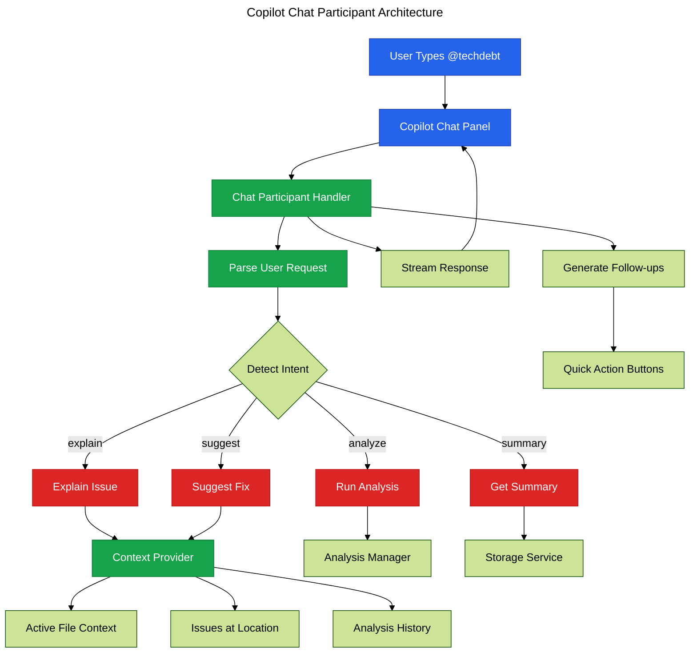

# Phase 17: Copilot Chat Participant

**Purpose**: Implement @techdebt chat participant for interactive code quality Q&A with GitHub Copilot.

**Dependencies**: Phase 7 (AI Fixing)

**Deliverables**: Chat participant registration, request handler, context provider, conversation history

## Overview

Phase 17 adds Copilot chat integration for natural language interaction:

1. Register @techdebt chat participant
2. Implement request handler with analysis context
3. Add follow-up questions and suggestions
4. Provide file and code context to Copilot
5. Handle multi-turn conversations
6. Add slash commands for common tasks
7. Implement participant icon and description

## Architecture



## File Changes

### 1. Chat Participant Registration

**File**: `src/ai/chat-participant.ts`

````typescript
import * as vscode from 'vscode';
import type { FileAnalysisResult, ComplexityInsight } from '@vipr/common';
import { getExtensionState } from '../extension';

interface ChatContext {
  activeFile?: vscode.TextDocument;
  selectedText?: string;
  cursorPosition?: vscode.Position;
  issues?: ComplexityInsight[];
  analysisResults?: FileAnalysisResult[];
}

/**
 * Register @techdebt chat participant
 */
export function registerChatParticipant(context: vscode.ExtensionContext): void {
  const participant = vscode.chat.createChatParticipant(
    'techdebt.analyzer',
    async (request, chatContext, response, token) => {
      const { analysisManager, storageService } = getExtensionState();

      try {
        // Gather context
        const context = await gatherContext(request, analysisManager);

        // Detect intent
        const intent = detectIntent(request.prompt);

        // Handle based on intent
        switch (intent) {
          case 'explain':
            await handleExplainIntent(request, context, response, token);
            break;
          case 'suggest':
            await handleSuggestIntent(request, context, response, token);
            break;
          case 'analyze':
            await handleAnalyzeIntent(request, context, response, analysisManager, token);
            break;
          case 'summary':
            await handleSummaryIntent(request, context, response, storageService, token);
            break;
          default:
            await handleGeneralQuery(request, context, response, token);
        }

        // Generate follow-up suggestions
        generateFollowUps(intent, response);
      } catch (error) {
        const message = error instanceof Error ? error.message : String(error);
        response.markdown(`❌ Error: ${message}`);
      }
    }
  );

  // Set participant metadata
  participant.iconPath = vscode.Uri.joinPath(
    context.extensionUri,
    'resources',
    'techdebt-icon.png'
  );

  context.subscriptions.push(participant);
}

/**
 * Gather context for chat request
 */
async function gatherContext(
  request: vscode.ChatRequest,
  analysisManager: any
): Promise<ChatContext> {
  const context: ChatContext = {};

  // Get active editor
  const editor = vscode.window.activeTextEditor;
  if (editor) {
    context.activeFile = editor.document;
    context.cursorPosition = editor.selection.active;

    if (!editor.selection.isEmpty) {
      context.selectedText = editor.document.getText(editor.selection);
    }

    // Get issues for active file
    const results = analysisManager.getResults();
    const fileResult = results?.find(
      (r: FileAnalysisResult) => r.filePath === editor.document.uri.fsPath
    );
    if (fileResult) {
      context.issues = fileResult.insights;

      // Filter issues near cursor
      if (context.cursorPosition) {
        const nearbyIssues = fileResult.insights.filter(issue => {
          if (!issue.location) return false;
          const distance = Math.abs(issue.location.line - context.cursorPosition!.line);
          return distance <= 5; // Within 5 lines
        });
        if (nearbyIssues.length > 0) {
          context.issues = nearbyIssues;
        }
      }
    }
  }

  // Get all analysis results
  context.analysisResults = analysisManager.getResults();

  return context;
}

/**
 * Detect user intent from prompt
 */
function detectIntent(prompt: string): string {
  const lower = prompt.toLowerCase();

  if (lower.includes('explain') || lower.includes('what') || lower.includes('why')) {
    return 'explain';
  }
  if (lower.includes('suggest') || lower.includes('fix') || lower.includes('how')) {
    return 'suggest';
  }
  if (lower.includes('analyze') || lower.includes('scan') || lower.includes('check')) {
    return 'analyze';
  }
  if (lower.includes('summary') || lower.includes('overview') || lower.includes('report')) {
    return 'summary';
  }

  return 'general';
}

/**
 * Handle explain intent
 */
async function handleExplainIntent(
  request: vscode.ChatRequest,
  context: ChatContext,
  response: vscode.ChatResponseStream,
  token: vscode.CancellationToken
): Promise<void> {
  if (!context.issues || context.issues.length === 0) {
    response.markdown('No code quality issues found in the current file or selection.');
    return;
  }

  response.markdown('## Code Quality Issues\n\n');

  for (const issue of context.issues.slice(0, 3)) {
    response.markdown(`**${issue.severity.toUpperCase()}**: ${issue.message}\n\n`);

    if (issue.location) {
      response.markdown(`📍 Line ${issue.location.line}\n\n`);
    }

    // Add code reference if available
    if (context.activeFile && issue.location) {
      const line = context.activeFile.lineAt(issue.location.line - 1);
      response.markdown('```typescript\n' + line.text.trim() + '\n```\n\n');
    }

    if (issue.suggestion) {
      response.markdown(`💡 **Suggestion**: ${issue.suggestion}\n\n`);
    }
  }

  if (context.issues.length > 3) {
    response.markdown(`\n_...and ${context.issues.length - 3} more issues_\n`);
  }
}

/**
 * Handle suggest intent
 */
async function handleSuggestIntent(
  request: vscode.ChatRequest,
  context: ChatContext,
  response: vscode.ChatResponseStream,
  token: vscode.CancellationToken
): Promise<void> {
  if (!context.issues || context.issues.length === 0) {
    response.markdown('No issues found to suggest fixes for.');
    return;
  }

  const issue = context.issues[0]; // Focus on first issue

  response.markdown(`## Suggested Fix for: ${issue.message}\n\n`);

  // Use the prompt from Phase 7 if available
  if (issue.prompt) {
    response.markdown('Let me analyze this issue and suggest a fix...\n\n');
    // This will be enhanced in Phase 18 with Language Model API
    response.markdown('💡 Consider refactoring this code to improve its quality.\n');
  } else if (issue.suggestion) {
    response.markdown(issue.suggestion);
  } else {
    response.markdown('This issue requires manual review and fixing.');
  }
}

/**
 * Handle analyze intent
 */
async function handleAnalyzeIntent(
  request: vscode.ChatRequest,
  context: ChatContext,
  response: vscode.ChatResponseStream,
  analysisManager: any,
  token: vscode.CancellationToken
): Promise<void> {
  response.markdown('🔍 Running code quality analysis...\n\n');

  try {
    if (context.activeFile) {
      await vscode.commands.executeCommand('vipr.analyzeFile', context.activeFile.uri);
      response.markdown('✅ Analysis complete. Check the Problems panel for issues.');
    } else {
      response.markdown('❌ No active file to analyze.');
    }
  } catch (error) {
    response.markdown(
      '❌ Analysis failed: ' + (error instanceof Error ? error.message : String(error))
    );
  }
}

/**
 * Handle summary intent
 */
async function handleSummaryIntent(
  request: vscode.ChatRequest,
  context: ChatContext,
  response: vscode.ChatResponseStream,
  storageService: any,
  token: vscode.CancellationToken
): Promise<void> {
  const results = context.analysisResults;

  if (!results || results.length === 0) {
    response.markdown('No analysis results available. Run an analysis first.');
    return;
  }

  const totalIssues = results.reduce(
    (sum: number, r: FileAnalysisResult) => sum + r.insights.length,
    0
  );
  const avgScore =
    results.reduce((sum: number, r: FileAnalysisResult) => sum + r.overallScore, 0) /
    results.length;

  const criticalCount = results.reduce((sum: number, r: FileAnalysisResult) => {
    return sum + r.insights.filter(i => i.severity === 'critical').length;
  }, 0);

  response.markdown('## Workspace Quality Summary\n\n');
  response.markdown(`- **Files Analyzed**: ${results.length}\n`);
  response.markdown(`- **Average Score**: ${avgScore.toFixed(1)}/100\n`);
  response.markdown(`- **Total Issues**: ${totalIssues}\n`);
  response.markdown(`- **Critical Issues**: ${criticalCount}\n\n`);

  if (criticalCount > 0) {
    response.markdown(
      '⚠️ **Action Required**: You have critical issues that should be addressed immediately.\n'
    );
  } else if (avgScore < 70) {
    response.markdown('⚡ **Improvement Needed**: Consider refactoring files with low scores.\n');
  } else {
    response.markdown('✅ **Looking Good**: Your code quality is above average.\n');
  }
}

/**
 * Handle general query
 */
async function handleGeneralQuery(
  request: vscode.ChatRequest,
  context: ChatContext,
  response: vscode.ChatResponseStream,
  token: vscode.CancellationToken
): Promise<void> {
  response.markdown('## Code Quality Assistant\n\n');
  response.markdown('I can help you with:\n\n');
  response.markdown('- **Explain** issues in your code\n');
  response.markdown('- **Suggest** fixes for quality problems\n');
  response.markdown('- **Analyze** files for technical debt\n');
  response.markdown('- **Summarize** workspace quality metrics\n\n');
  response.markdown('Try asking me something like:\n');
  response.markdown('- "Explain the issues in this file"\n');
  response.markdown('- "Suggest a fix for this complexity warning"\n');
  response.markdown('- "Analyze the current file"\n');
  response.markdown('- "Give me a summary of workspace quality"\n');
}

/**
 * Generate follow-up suggestions
 */
function generateFollowUps(intent: string, response: vscode.ChatResponseStream): void {
  const followUps: vscode.ChatFollowup[] = [];

  switch (intent) {
    case 'explain':
      followUps.push({ prompt: 'Suggest a fix', label: '💡 Suggest Fix' });
      followUps.push({ prompt: 'Show more details', label: '📋 Details' });
      break;
    case 'suggest':
      followUps.push({ prompt: 'Explain why this is an issue', label: '❓ Why?' });
      followUps.push({ prompt: 'Apply this fix', label: '✅ Apply' });
      break;
    case 'analyze':
      followUps.push({ prompt: 'Show me the summary', label: '📊 Summary' });
      followUps.push({ prompt: 'Explain the worst issues', label: '🚨 Critical' });
      break;
    case 'summary':
      followUps.push({ prompt: 'Analyze the workspace', label: '🔍 Analyze' });
      followUps.push({ prompt: 'Export report', label: '📄 Export' });
      break;
  }

  if (followUps.length > 0) {
    response.push(new vscode.ChatResponseFollowupsPart(followUps));
  }
}
````

### 2. Register in Extension

**File**: `src/extension.ts` (additions)

```typescript
import { registerChatParticipant } from './ai/chat-participant';

export function activate(context: vscode.ExtensionContext) {
  // ... existing code

  // Register chat participant (requires Copilot)
  try {
    registerChatParticipant(context);
    console.log('[Vipr] Chat participant registered');
  } catch (error) {
    console.log('[Vipr] Chat participant not available:', error);
  }

  // ... rest of activation code
}
```

### 3. Update package.json

**File**: `clients/vscode-extension/package.json` (additions)

```json
{
  "contributes": {
    "chatParticipants": [
      {
        "id": "techdebt.analyzer",
        "name": "techdebt",
        "description": "Code quality and technical debt analysis assistant",
        "isSticky": true,
        "commands": [
          {
            "name": "explain",
            "description": "Explain code quality issues"
          },
          {
            "name": "suggest",
            "description": "Suggest fixes for issues"
          },
          {
            "name": "analyze",
            "description": "Run analysis on current file"
          },
          {
            "name": "summary",
            "description": "Get workspace quality summary"
          }
        ]
      }
    ]
  }
}
```

### 4. Create Participant Icon

**File**: `clients/vscode-extension/resources/techdebt-icon.png`

Create a 32x32 PNG icon representing technical debt or code quality (e.g., a warning triangle with gears, or a quality badge).

## Configuration

Add Copilot as optional dependency:

**File**: `clients/vscode-extension/package.json` (additions)

```json
{
  "extensionDependencies": [],
  "extensionPack": [],
  "capabilities": {
    "untrustedWorkspaces": {
      "supported": "limited"
    }
  }
}
```

## Acceptance Criteria

- [ ] @techdebt participant appears in Copilot chat
- [ ] Participant description shows in chat panel
- [ ] Participant icon displays correctly
- [ ] "Explain" command shows issues in current file
- [ ] "Suggest" command provides fix recommendations
- [ ] "Analyze" command triggers file analysis
- [ ] "Summary" command shows workspace metrics
- [ ] Follow-up suggestions appear after responses
- [ ] Context includes active file and cursor position
- [ ] Context includes nearby issues
- [ ] Multi-turn conversations maintain context
- [ ] Works with Copilot enabled
- [ ] Gracefully handles Copilot not available
- [ ] Slash commands work (/explain, /suggest, etc.)

## Testing Strategy

### Prerequisites

- GitHub Copilot subscription active
- GitHub Copilot extension installed in VSCode

### Manual Verification

1. Ensure Copilot is active
2. Open Copilot chat panel
3. Type `@techdebt`
4. Verify participant appears in autocomplete
5. Send message: `@techdebt hello`
6. Verify general help response displays
7. Open a file with issues
8. Type: `@techdebt explain the issues`
9. Verify issues listed with details
10. Verify follow-up buttons appear
11. Click "Suggest Fix" follow-up
12. Verify fix suggestions appear
13. Type: `@techdebt /analyze`
14. Verify analysis runs
15. Type: `@techdebt /summary`
16. Verify workspace summary displays
17. Test with no analysis results
18. Verify appropriate message shown
19. Test with Copilot disabled
20. Verify extension doesn't crash

### Edge Cases

1. Active file with no issues
2. No active file
3. Very large file (1000+ lines)
4. File with 100+ issues
5. Multi-turn conversation (5+ messages)
6. Rapid-fire requests
7. Copilot rate limiting

## Summary

Phase 17 integrates Vipr with GitHub Copilot through a custom chat participant, enabling natural language interaction for explaining issues, suggesting fixes, running analyses, and summarizing workspace quality through conversational AI.
