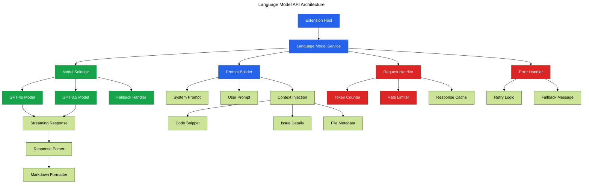

# Phase 18: Language Model API Integration

**Purpose**: Integrate VSCode Language Model API for AI-powered explanations and suggestions using Copilot's models.

**Dependencies**: Phase 17 (Copilot Chat Participant)

**Deliverables**: Language Model service wrapper, prompt templates, streaming responses, error handling

## Overview

Phase 18 adds deep Language Model API integration:

1. Create Language Model service wrapper
2. Implement model selection (gpt-4o, gpt-3.5-turbo)
3. Build prompt template system
4. Add streaming response handling
5. Implement token management and rate limiting
6. Add caching for repeated queries
7. Create fallback mechanisms for API failures

## Architecture



## File Changes

### 1. Language Model Service

**File**: `src/ai/language-model-service.ts`

```typescript
import * as vscode from 'vscode';
import type { ComplexityInsight } from '@vipr/common';

export interface LanguageModelRequest {
  prompt: string;
  systemPrompt?: string;
  context?: {
    code?: string;
    file?: string;
    issue?: ComplexityInsight;
  };
  temperature?: number;
  maxTokens?: number;
}

export interface LanguageModelResponse {
  text: string;
  model: string;
  tokensUsed: number;
}

/**
 * Service for interacting with VSCode Language Model API
 */
export class LanguageModelService {
  private cache = new Map<string, string>();
  private requestCount = 0;
  private readonly MAX_REQUESTS_PER_MINUTE = 20;

  /**
   * Send request to language model
   */
  async sendRequest(request: LanguageModelRequest): Promise<LanguageModelResponse> {
    // Check rate limit
    if (!this.checkRateLimit()) {
      throw new Error('Rate limit exceeded. Please wait a moment.');
    }

    // Check cache
    const cacheKey = this.getCacheKey(request);
    if (this.cache.has(cacheKey)) {
      return {
        text: this.cache.get(cacheKey)!,
        model: 'cached',
        tokensUsed: 0,
      };
    }

    // Select model
    const models = await vscode.lm.selectChatModels({
      vendor: 'copilot',
      family: 'gpt-4o',
    });

    if (models.length === 0) {
      // Fallback to gpt-3.5
      const fallbackModels = await vscode.lm.selectChatModels({
        vendor: 'copilot',
        family: 'gpt-3.5-turbo',
      });

      if (fallbackModels.length === 0) {
        throw new Error('No language models available. Ensure GitHub Copilot is active.');
      }
    }

    const model = models[0];

    try {
      // Build messages
      const messages: vscode.LanguageModelChatMessage[] = [];

      if (request.systemPrompt) {
        messages.push(vscode.LanguageModelChatMessage.User(request.systemPrompt));
      }

      messages.push(vscode.LanguageModelChatMessage.User(request.prompt));

      // Send request
      const response = await model.sendRequest(messages, {
        justification: 'Analyzing code quality and providing suggestions',
      });

      // Collect streamed response
      let fullText = '';
      for await (const chunk of response.text) {
        fullText += chunk;
      }

      // Cache result
      this.cache.set(cacheKey, fullText);

      return {
        text: fullText,
        model: model.id,
        tokensUsed: this.estimateTokens(fullText),
      };
    } catch (error) {
      if (error instanceof vscode.LanguageModelError) {
        console.error('[Vipr] Language model error:', error.message, error.code);

        // Handle specific error codes
        switch (error.code) {
          case vscode.LanguageModelError.NotFound.name:
            throw new Error('Language model not found. Ensure Copilot is installed.');
          case vscode.LanguageModelError.NoPermissions.name:
            throw new Error('No permission to access language model. Check Copilot settings.');
          case vscode.LanguageModelError.Blocked.name:
            throw new Error('Request blocked by content filter.');
          default:
            throw new Error(`Language model error: ${error.message}`);
        }
      }

      throw error;
    }
  }

  /**
   * Stream response from language model
   */
  async streamRequest(
    request: LanguageModelRequest,
    onChunk: (chunk: string) => void
  ): Promise<LanguageModelResponse> {
    const models = await vscode.lm.selectChatModels({
      vendor: 'copilot',
      family: 'gpt-4o',
    });

    if (models.length === 0) {
      throw new Error('No language models available');
    }

    const model = models[0];

    const messages: vscode.LanguageModelChatMessage[] = [];

    if (request.systemPrompt) {
      messages.push(vscode.LanguageModelChatMessage.User(request.systemPrompt));
    }

    messages.push(vscode.LanguageModelChatMessage.User(request.prompt));

    const response = await model.sendRequest(messages, {
      justification: 'Analyzing code quality',
    });

    let fullText = '';
    for await (const chunk of response.text) {
      fullText += chunk;
      onChunk(chunk);
    }

    return {
      text: fullText,
      model: model.id,
      tokensUsed: this.estimateTokens(fullText),
    };
  }

  /**
   * Explain code quality issue
   */
  async explainIssue(issue: ComplexityInsight, code?: string): Promise<string> {
    const systemPrompt = `You are a code quality expert. Explain code quality issues clearly and suggest improvements. Be concise and actionable.`;

    let prompt = `Explain this code quality issue:\n\n`;
    prompt += `**Severity**: ${issue.severity}\n`;
    prompt += `**Category**: ${issue.category}\n`;
    prompt += `**Message**: ${issue.message}\n\n`;

    if (code) {
      prompt += `**Code**:\n\`\`\`typescript\n${code}\n\`\`\`\n\n`;
    }

    if (issue.suggestion) {
      prompt += `**Current Suggestion**: ${issue.suggestion}\n\n`;
    }

    prompt += `Provide:\n`;
    prompt += `1. Why this is an issue\n`;
    prompt += `2. Potential impact\n`;
    prompt += `3. Specific steps to fix\n`;

    const response = await this.sendRequest({
      prompt,
      systemPrompt,
      temperature: 0.7,
    });

    return response.text;
  }

  /**
   * Suggest fix for issue
   */
  async suggestFix(issue: ComplexityInsight, code: string, filePath: string): Promise<string> {
    const systemPrompt = `You are an expert developer. Suggest specific code fixes for quality issues. Provide working code examples.`;

    let prompt = `Suggest a fix for this code quality issue:\n\n`;
    prompt += `**Issue**: ${issue.message}\n`;
    prompt += `**File**: ${filePath}\n`;
    prompt += `**Current Code**:\n\`\`\`typescript\n${code}\n\`\`\`\n\n`;
    prompt += `Provide:\n`;
    prompt += `1. Refactored code\n`;
    prompt += `2. Explanation of changes\n`;
    prompt += `3. Why this improves quality\n`;

    const response = await this.sendRequest({
      prompt,
      systemPrompt,
      temperature: 0.5,
    });

    return response.text;
  }

  /**
   * Generate workspace quality summary
   */
  async generateSummary(metrics: {
    fileCount: number;
    issueCount: number;
    avgScore: number;
    criticalCount: number;
  }): Promise<string> {
    const systemPrompt = `You are a technical lead reviewing code quality metrics. Provide actionable insights.`;

    let prompt = `Analyze this workspace quality summary:\n\n`;
    prompt += `- Files analyzed: ${metrics.fileCount}\n`;
    prompt += `- Average quality score: ${metrics.avgScore.toFixed(1)}/100\n`;
    prompt += `- Total issues: ${metrics.issueCount}\n`;
    prompt += `- Critical issues: ${metrics.criticalCount}\n\n`;
    prompt += `Provide:\n`;
    prompt += `1. Overall assessment\n`;
    prompt += `2. Top priorities\n`;
    prompt += `3. Recommended actions\n`;

    const response = await this.sendRequest({
      prompt,
      systemPrompt,
      temperature: 0.7,
    });

    return response.text;
  }

  /**
   * Check if model is available
   */
  async isAvailable(): Promise<boolean> {
    try {
      const models = await vscode.lm.selectChatModels({
        vendor: 'copilot',
      });
      return models.length > 0;
    } catch {
      return false;
    }
  }

  /**
   * Check rate limit
   */
  private checkRateLimit(): boolean {
    this.requestCount++;

    setTimeout(() => {
      this.requestCount = Math.max(0, this.requestCount - 1);
    }, 60000); // Reset after 1 minute

    return this.requestCount <= this.MAX_REQUESTS_PER_MINUTE;
  }

  /**
   * Generate cache key
   */
  private getCacheKey(request: LanguageModelRequest): string {
    return `${request.prompt}-${request.systemPrompt || ''}-${JSON.stringify(request.context || {})}`;
  }

  /**
   * Estimate token count (rough approximation)
   */
  private estimateTokens(text: string): number {
    return Math.ceil(text.length / 4);
  }

  /**
   * Clear cache
   */
  clearCache(): void {
    this.cache.clear();
  }
}
```

### 2. Update Chat Participant to Use Language Model Service

**File**: `src/ai/chat-participant.ts` (enhancements)

```typescript
import { LanguageModelService } from './language-model-service';

const languageModelService = new LanguageModelService();

/**
 * Enhanced handle explain intent with LM API
 */
async function handleExplainIntent(
  request: vscode.ChatRequest,
  context: ChatContext,
  response: vscode.ChatResponseStream,
  token: vscode.CancellationToken
): Promise<void> {
  if (!context.issues || context.issues.length === 0) {
    response.markdown('No code quality issues found.');
    return;
  }

  const issue = context.issues[0];

  response.markdown('## Explaining Issue\n\n');
  response.markdown(`**${issue.severity.toUpperCase()}**: ${issue.message}\n\n`);

  try {
    // Get code context
    let code: string | undefined;
    if (context.activeFile && issue.location) {
      const startLine = Math.max(0, issue.location.line - 3);
      const endLine = Math.min(context.activeFile.lineCount - 1, issue.location.line + 2);
      const range = new vscode.Range(startLine, 0, endLine, 1000);
      code = context.activeFile.getText(range);
    }

    // Stream explanation from LM
    response.markdown('---\n\n');
    await languageModelService.streamRequest(
      {
        prompt: `Explain this code quality issue: ${issue.message}`,
        context: { code, issue },
      },
      chunk => {
        response.markdown(chunk);
      }
    );
  } catch (error) {
    response.markdown(
      `\n\n⚠️ Unable to generate AI explanation: ${error instanceof Error ? error.message : String(error)}`
    );

    // Fallback to basic explanation
    if (issue.suggestion) {
      response.markdown(`\n\n💡 **Suggestion**: ${issue.suggestion}`);
    }
  }
}

/**
 * Enhanced handle suggest intent with LM API
 */
async function handleSuggestIntent(
  request: vscode.ChatRequest,
  context: ChatContext,
  response: vscode.ChatResponseStream,
  token: vscode.CancellationToken
): Promise<void> {
  if (!context.issues || context.issues.length === 0) {
    response.markdown('No issues found to suggest fixes for.');
    return;
  }

  const issue = context.issues[0];

  // Get code context
  if (!context.activeFile || !issue.location) {
    response.markdown('Unable to suggest fix: missing file context.');
    return;
  }

  const startLine = Math.max(0, issue.location.line - 5);
  const endLine = Math.min(context.activeFile.lineCount - 1, issue.location.line + 5);
  const range = new vscode.Range(startLine, 0, endLine, 1000);
  const code = context.activeFile.getText(range);

  response.markdown('## Suggested Fix\n\n');

  try {
    await languageModelService.streamRequest(
      {
        prompt: `Suggest a fix for: ${issue.message}\n\nCode:\n${code}`,
        context: { code, issue, file: context.activeFile.fileName },
      },
      chunk => {
        response.markdown(chunk);
      }
    );
  } catch (error) {
    response.markdown(
      `⚠️ Unable to generate AI suggestion: ${error instanceof Error ? error.message : String(error)}`
    );

    if (issue.suggestion) {
      response.markdown(`\n\n💡 ${issue.suggestion}`);
    }
  }
}
```

### 3. Add Model Status Command

**File**: `src/commands/check-lm-status.ts`

```typescript
import * as vscode from 'vscode';
import { LanguageModelService } from '../ai/language-model-service';

/**
 * Command: Check Language Model availability
 */
export async function checkLanguageModelStatus(): Promise<void> {
  const lmService = new LanguageModelService();

  const available = await lmService.isAvailable();

  if (available) {
    const models = await vscode.lm.selectChatModels({ vendor: 'copilot' });
    const modelList = models.map(m => `- ${m.id}`).join('\n');

    vscode.window.showInformationMessage(`Language Models Available:\n${modelList}`, {
      modal: true,
    });
  } else {
    vscode.window
      .showWarningMessage(
        'No language models available. Ensure GitHub Copilot is installed and active.',
        'Open Settings'
      )
      .then(action => {
        if (action === 'Open Settings') {
          vscode.commands.executeCommand('workbench.action.openSettings', 'github.copilot');
        }
      });
  }
}
```

### 4. Register Commands

**File**: `clients/vscode-extension/package.json` (additions)

```json
{
  "commands": [
    {
      "command": "vipr.checkLMStatus",
      "title": "Check Language Model Status",
      "category": "Vipr"
    }
  ]
}
```

## Configuration

Add Language Model settings:

**File**: `clients/vscode-extension/package.json` (additions)

```json
{
  "configuration": {
    "properties": {
      "vipr.ai.useLanguageModel": {
        "type": "boolean",
        "default": true,
        "description": "Use Language Model API for AI explanations"
      },
      "vipr.ai.preferredModel": {
        "type": "string",
        "enum": ["gpt-4o", "gpt-3.5-turbo", "auto"],
        "default": "auto",
        "description": "Preferred language model for AI features"
      },
      "vipr.ai.temperature": {
        "type": "number",
        "default": 0.7,
        "minimum": 0,
        "maximum": 1,
        "description": "Temperature for AI responses (higher = more creative)"
      }
    }
  }
}
```

## Acceptance Criteria

- [ ] Language Model service successfully selects models
- [ ] Requests send to Copilot models correctly
- [ ] Streaming responses work without blocking
- [ ] Rate limiting prevents excessive requests
- [ ] Cache reduces redundant API calls
- [ ] Error handling gracefully manages API failures
- [ ] Fallback to gpt-3.5-turbo works when gpt-4o unavailable
- [ ] Token estimation tracks usage
- [ ] Explain intent uses LM API
- [ ] Suggest intent uses LM API
- [ ] Summary generation works
- [ ] Check status command reports availability
- [ ] Settings control AI behavior
- [ ] Works with Copilot subscription
- [ ] Gracefully degrades without Copilot

## Testing Strategy

### Prerequisites

- GitHub Copilot subscription
- GitHub Copilot extension active

### Manual Verification

1. Run "Vipr: Check Language Model Status"
2. Verify models listed
3. Open file with issues
4. Run @techdebt explain
5. Verify AI-generated explanation appears
6. Verify explanation is streaming
7. Test suggestion: @techdebt suggest a fix
8. Verify AI-generated fix appears
9. Test rate limiting:
   - Send 25 requests rapidly
   - Verify rate limit error after 20
10. Test caching:
    - Send same request twice
    - Verify second request instant (cached)
11. Test error handling:
    - Disable Copilot
    - Send request
    - Verify graceful error message
12. Test settings:
    - Change temperature
    - Verify responses change creativity
13. Check extension logs for token usage

### Performance Testing

1. Measure response time for typical request
2. Should complete within 3-5 seconds
3. Verify no memory leaks after 50 requests
4. Verify cache cleanup works

## Summary

Phase 18 deeply integrates VSCode's Language Model API, enabling rich AI-powered explanations and suggestions using Copilot's models with proper streaming, caching, rate limiting, and error handling.
