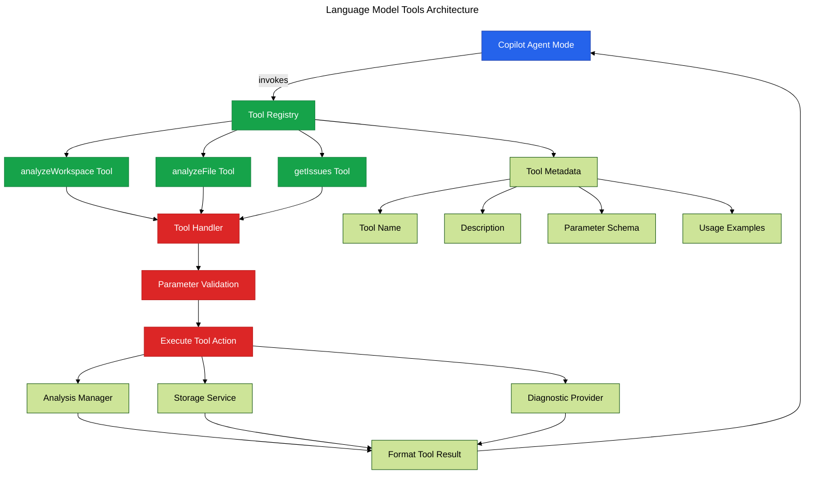

# Phase 19: Language Model Tools

**Purpose**: Register language model tools enabling Copilot's agent mode to invoke Vipr analysis capabilities.

**Dependencies**: Phase 18 (Language Model API Integration)

**Deliverables**: Tool registration, tool handlers, parameter schemas, result formatting

## Overview

Phase 19 exposes Vipr functionality as tools for Copilot agent mode:

1. Register language model tools in package.json
2. Implement tool handler for analysis requests
3. Create parameter schemas for tool inputs
4. Add tool result formatting
5. Implement workspace analysis tool
6. Add file analysis tool
7. Create issue lookup tool

## Architecture



## File Changes

### 1. Register Tools in package.json

**File**: `clients/vscode-extension/package.json` (additions)

```json
{
  "contributes": {
    "languageModelTools": [
      {
        "name": "vipr_analyzeWorkspace",
        "displayName": "Analyze Workspace Code Quality",
        "modelDescription": "Scans the entire workspace for code quality issues, technical debt, complexity metrics, and maintainability indicators. Returns overall quality score and issue summary.",
        "icon": "$(search)",
        "inputSchema": {
          "type": "object",
          "properties": {
            "includeTests": {
              "type": "boolean",
              "description": "Whether to include test files in analysis",
              "default": false
            },
            "severityFilter": {
              "type": "string",
              "enum": ["all", "critical", "error", "warning"],
              "description": "Filter issues by severity level",
              "default": "all"
            }
          }
        }
      },
      {
        "name": "vipr_analyzeFile",
        "displayName": "Analyze Single File Quality",
        "modelDescription": "Analyzes a specific file for code quality issues, complexity metrics, and maintainability. Returns detailed issue list and file score.",
        "icon": "$(file-code)",
        "inputSchema": {
          "type": "object",
          "properties": {
            "filePath": {
              "type": "string",
              "description": "Relative or absolute path to the file to analyze"
            }
          },
          "required": ["filePath"]
        }
      },
      {
        "name": "vipr_getIssues",
        "displayName": "Get Code Quality Issues",
        "modelDescription": "Retrieves detailed list of code quality issues from the most recent analysis. Can filter by file, severity, or category.",
        "icon": "$(warning)",
        "inputSchema": {
          "type": "object",
          "properties": {
            "filePath": {
              "type": "string",
              "description": "Filter issues for specific file (optional)"
            },
            "severity": {
              "type": "string",
              "enum": ["critical", "error", "warning", "info"],
              "description": "Filter by severity level (optional)"
            },
            "category": {
              "type": "string",
              "description": "Filter by issue category (optional)"
            },
            "limit": {
              "type": "number",
              "description": "Maximum number of issues to return",
              "default": 20
            }
          }
        }
      }
    ]
  }
}
```

### 2. Tool Handler Implementation

**File**: `src/ai/language-model-tools.ts`

```typescript
import * as vscode from 'vscode';
import type { FileAnalysisResult, ComplexityInsight } from '@vipr/common';
import { getExtensionState } from '../extension';

interface AnalyzeWorkspaceParams {
  includeTests?: boolean;
  severityFilter?: 'all' | 'critical' | 'error' | 'warning';
}

interface AnalyzeFileParams {
  filePath: string;
}

interface GetIssuesParams {
  filePath?: string;
  severity?: 'critical' | 'error' | 'warning' | 'info';
  category?: string;
  limit?: number;
}

/**
 * Register language model tool handlers
 */
export function registerLanguageModelTools(context: vscode.ExtensionContext): void {
  // Register analyzeWorkspace tool
  context.subscriptions.push(
    vscode.lm.registerTool('vipr_analyzeWorkspace', {
      invoke: async (parameters, token) => {
        const params = parameters as AnalyzeWorkspaceParams;
        return handleAnalyzeWorkspace(params, token);
      },
    })
  );

  // Register analyzeFile tool
  context.subscriptions.push(
    vscode.lm.registerTool('vipr_analyzeFile', {
      invoke: async (parameters, token) => {
        const params = parameters as AnalyzeFileParams;
        return handleAnalyzeFile(params, token);
      },
    })
  );

  // Register getIssues tool
  context.subscriptions.push(
    vscode.lm.registerTool('vipr_getIssues', {
      invoke: async (parameters, token) => {
        const params = parameters as GetIssuesParams;
        return handleGetIssues(params, token);
      },
    })
  );

  console.log('[Vipr] Language model tools registered');
}

/**
 * Handle workspace analysis tool invocation
 */
async function handleAnalyzeWorkspace(
  params: AnalyzeWorkspaceParams,
  token: vscode.CancellationToken
): Promise<vscode.LanguageModelToolResult> {
  const { analysisManager } = getExtensionState();

  try {
    // Run analysis
    await vscode.commands.executeCommand('vipr.analyzeWorkspace');

    // Wait for analysis to complete (with timeout)
    await new Promise(resolve => setTimeout(resolve, 2000));

    // Get results
    const results = analysisManager.getResults() as FileAnalysisResult[];

    if (!results || results.length === 0) {
      return new vscode.LanguageModelToolResult([
        new vscode.LanguageModelTextPart(
          'No analysis results available. The workspace may be empty or analysis failed.'
        ),
      ]);
    }

    // Filter results based on parameters
    let filteredResults = results;

    if (!params.includeTests) {
      filteredResults = filteredResults.filter(
        r => !r.filePath.includes('.test.') && !r.filePath.includes('.spec.')
      );
    }

    // Calculate summary metrics
    const totalFiles = filteredResults.length;
    const totalIssues = filteredResults.reduce((sum, r) => sum + r.insights.length, 0);
    const avgScore = filteredResults.reduce((sum, r) => sum + r.overallScore, 0) / totalFiles;

    const criticalCount = filteredResults.reduce((sum, r) => {
      return sum + r.insights.filter(i => i.severity === 'critical').length;
    }, 0);

    const errorCount = filteredResults.reduce((sum, r) => {
      return sum + r.insights.filter(i => i.severity === 'error').length;
    }, 0);

    const warningCount = filteredResults.reduce((sum, r) => {
      return sum + r.insights.filter(i => i.severity === 'warning').length;
    }, 0);

    // Format result
    const resultText = `
# Workspace Code Quality Analysis

**Summary:**
- Files analyzed: ${totalFiles}
- Average quality score: ${avgScore.toFixed(1)}/100
- Total issues: ${totalIssues}

**Issues by Severity:**
- Critical: ${criticalCount}
- Errors: ${errorCount}
- Warnings: ${warningCount}

**Assessment:**
${getQualityAssessment(avgScore, criticalCount)}

**Top Files Needing Attention:**
${getTopProblematicFiles(filteredResults, 5)}
`;

    return new vscode.LanguageModelToolResult([new vscode.LanguageModelTextPart(resultText)]);
  } catch (error) {
    const message = error instanceof Error ? error.message : String(error);
    return new vscode.LanguageModelToolResult([
      new vscode.LanguageModelTextPart(`Analysis failed: ${message}`),
    ]);
  }
}

/**
 * Handle file analysis tool invocation
 */
async function handleAnalyzeFile(
  params: AnalyzeFileParams,
  token: vscode.CancellationToken
): Promise<vscode.LanguageModelToolResult> {
  const { analysisManager } = getExtensionState();

  if (!params.filePath) {
    return new vscode.LanguageModelToolResult([
      new vscode.LanguageModelTextPart('Error: filePath parameter is required'),
    ]);
  }

  try {
    // Resolve file path
    const workspaceRoot = vscode.workspace.workspaceFolders?.[0]?.uri.fsPath;
    const absolutePath = params.filePath.startsWith('/')
      ? params.filePath
      : `${workspaceRoot}/${params.filePath}`;

    const uri = vscode.Uri.file(absolutePath);

    // Run analysis
    await vscode.commands.executeCommand('vipr.analyzeFile', uri);

    // Wait for analysis
    await new Promise(resolve => setTimeout(resolve, 1000));

    // Get results
    const results = analysisManager.getResults() as FileAnalysisResult[];
    const fileResult = results?.find(r => r.filePath === absolutePath);

    if (!fileResult) {
      return new vscode.LanguageModelToolResult([
        new vscode.LanguageModelTextPart(`No analysis results for ${params.filePath}`),
      ]);
    }

    // Format result
    const resultText = `
# File Analysis: ${params.filePath}

**Quality Score:** ${fileResult.overallScore}/100

**Metrics:**
- Cyclomatic Complexity: ${fileResult.metrics.cyclomaticComplexity}
- Maintainability Index: ${fileResult.metrics.maintainabilityIndex}

**Issues Found:** ${fileResult.insights.length}

${fileResult.insights.length > 0 ? formatIssues(fileResult.insights, 10) : '✅ No issues found!'}
`;

    return new vscode.LanguageModelToolResult([new vscode.LanguageModelTextPart(resultText)]);
  } catch (error) {
    const message = error instanceof Error ? error.message : String(error);
    return new vscode.LanguageModelToolResult([
      new vscode.LanguageModelTextPart(`Analysis failed: ${message}`),
    ]);
  }
}

/**
 * Handle get issues tool invocation
 */
async function handleGetIssues(
  params: GetIssuesParams,
  token: vscode.CancellationToken
): Promise<vscode.LanguageModelToolResult> {
  const { analysisManager } = getExtensionState();

  try {
    const results = analysisManager.getResults() as FileAnalysisResult[];

    if (!results || results.length === 0) {
      return new vscode.LanguageModelToolResult([
        new vscode.LanguageModelTextPart('No analysis results available. Run an analysis first.'),
      ]);
    }

    // Collect all issues
    let allIssues: Array<ComplexityInsight & { filePath: string }> = [];
    for (const result of results) {
      for (const issue of result.insights) {
        allIssues.push({ ...issue, filePath: result.filePath });
      }
    }

    // Apply filters
    if (params.filePath) {
      const workspaceRoot = vscode.workspace.workspaceFolders?.[0]?.uri.fsPath;
      const absolutePath = params.filePath.startsWith('/')
        ? params.filePath
        : `${workspaceRoot}/${params.filePath}`;
      allIssues = allIssues.filter(i => i.filePath === absolutePath);
    }

    if (params.severity) {
      allIssues = allIssues.filter(i => i.severity === params.severity);
    }

    if (params.category) {
      allIssues = allIssues.filter(i => i.category === params.category);
    }

    // Limit results
    const limit = params.limit || 20;
    const limitedIssues = allIssues.slice(0, limit);

    // Format result
    const resultText = `
# Code Quality Issues

**Total:** ${allIssues.length} (showing ${limitedIssues.length})

${formatDetailedIssues(limitedIssues)}

${allIssues.length > limit ? `\n_...and ${allIssues.length - limit} more issues_` : ''}
`;

    return new vscode.LanguageModelToolResult([new vscode.LanguageModelTextPart(resultText)]);
  } catch (error) {
    const message = error instanceof Error ? error.message : String(error);
    return new vscode.LanguageModelToolResult([
      new vscode.LanguageModelTextPart(`Failed to get issues: ${message}`),
    ]);
  }
}

/**
 * Helper: Get quality assessment
 */
function getQualityAssessment(avgScore: number, criticalCount: number): string {
  if (criticalCount > 0) {
    return `⚠️ **Action Required**: ${criticalCount} critical issues need immediate attention.`;
  } else if (avgScore < 50) {
    return '❌ **Poor**: Code quality is below acceptable standards. Significant refactoring needed.';
  } else if (avgScore < 70) {
    return '⚡ **Fair**: Code quality needs improvement. Address warnings and refactor low-scoring files.';
  } else if (avgScore < 90) {
    return '✅ **Good**: Code quality is acceptable. Continue monitoring for new issues.';
  } else {
    return '🌟 **Excellent**: Code quality is very high. Maintain current standards.';
  }
}

/**
 * Helper: Get top problematic files
 */
function getTopProblematicFiles(results: FileAnalysisResult[], limit: number): string {
  const sorted = [...results].sort((a, b) => a.overallScore - b.overallScore);
  const top = sorted.slice(0, limit);

  return top
    .map((r, i) => {
      const fileName = r.filePath.split('/').pop();
      return `${i + 1}. ${fileName} (score: ${r.overallScore}, issues: ${r.insights.length})`;
    })
    .join('\n');
}

/**
 * Helper: Format issues list
 */
function formatIssues(issues: ComplexityInsight[], limit: number): string {
  return issues
    .slice(0, limit)
    .map((issue, i) => {
      return `${i + 1}. **${issue.severity.toUpperCase()}**: ${issue.message}${issue.location ? ` (line ${issue.location.line})` : ''}`;
    })
    .join('\n');
}

/**
 * Helper: Format detailed issues
 */
function formatDetailedIssues(issues: Array<ComplexityInsight & { filePath: string }>): string {
  return issues
    .map((issue, i) => {
      const fileName = issue.filePath.split('/').pop();
      return `
${i + 1}. **${issue.severity.toUpperCase()}** - ${issue.category}
   ${issue.message}
   📁 ${fileName}${issue.location ? `:${issue.location.line}` : ''}
`;
    })
    .join('\n');
}
```

### 3. Register Tools in Extension

**File**: `src/extension.ts` (additions)

```typescript
import { registerLanguageModelTools } from './ai/language-model-tools';

export function activate(context: vscode.ExtensionContext) {
  // ... existing code

  // Register language model tools
  try {
    registerLanguageModelTools(context);
    console.log('[Vipr] Language model tools registered');
  } catch (error) {
    console.log('[Vipr] Language model tools not available:', error);
  }

  // ... rest of activation code
}
```

## Configuration

No additional configuration needed.

## Acceptance Criteria

- [ ] Tools registered in package.json
- [ ] Tools appear in Copilot agent mode tool list
- [ ] analyzeWorkspace tool executes analysis
- [ ] analyzeWorkspace returns formatted summary
- [ ] analyzeFile tool analyzes specified file
- [ ] analyzeFile returns file metrics and issues
- [ ] getIssues tool retrieves filtered issues
- [ ] All tools handle missing parameters gracefully
- [ ] All tools handle errors without crashing
- [ ] Tool results format correctly for LLM consumption
- [ ] Copilot agent can invoke tools naturally
- [ ] Tool descriptions guide agent usage correctly
- [ ] Parameter schemas validate inputs
- [ ] Tools work with cancellation tokens

## Testing Strategy

### Prerequisites

- GitHub Copilot subscription
- Copilot agent mode enabled (preview feature)

### Manual Verification

1. Enable Copilot agent mode in settings
2. Open Copilot chat
3. Type: `@workspace analyze code quality`
4. Verify Copilot invokes vipr_analyzeWorkspace tool
5. Verify analysis runs
6. Verify formatted summary appears in chat
7. Type: `@workspace check file src/index.ts`
8. Verify Copilot invokes vipr_analyzeFile tool
9. Verify file analysis runs
10. Verify file results appear
11. Type: `@workspace show critical issues`
12. Verify Copilot invokes vipr_getIssues tool
13. Verify filtered issues appear
14. Test natural language variations:
    - "What's the code quality like?"
    - "Check if there are any errors"
    - "Analyze the current file"
15. Verify tool descriptions guide Copilot correctly
16. Test error cases:
    - Invalid file path
    - No analysis results
    - Workspace not open
17. Verify graceful error handling

### Edge Cases

1. Empty workspace
2. Workspace with no issues
3. Workspace with 1000+ issues
4. Very long file paths
5. Special characters in file names
6. Rapid tool invocations

## Summary

Phase 19 exposes Vipr's analysis capabilities as language model tools, enabling Copilot's agent mode to naturally invoke code quality analysis, retrieve issues, and present results as part of multi-step reasoning workflows.
