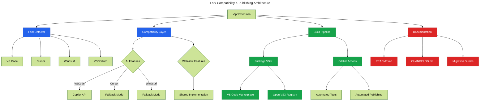

# Phase 21: Fork Compatibility & Publishing

**Purpose**: Ensure extension compatibility with VSCode forks and publish to multiple marketplaces.

**Dependencies**: Phase 20 (Performance Optimization)

**Deliverables**: Fork detection, compatibility layer, dual marketplace publishing, documentation

## Overview

Phase 21 finalizes the extension for broad distribution:

1. Implement fork detection (Cursor, Windsurf, VSCodium)
2. Create compatibility layer for fork-specific features
3. Test extension in all target environments
4. Set up dual publishing (VS Code Marketplace + Open VSX)
5. Create comprehensive README and documentation
6. Add changelog and migration guides
7. Configure GitHub Actions for automated publishing

## Architecture



## File Changes

### 1. Fork Detection

**File**: `src/utils/fork-detection.ts`

```typescript
import * as vscode from 'vscode';

export enum EditorFork {
  VSCode = 'vscode',
  Cursor = 'cursor',
  Windsurf = 'windsurf',
  VSCodium = 'vscodium',
  Unknown = 'unknown',
}

export interface EditorInfo {
  fork: EditorFork;
  version: string;
  supportsCopilot: boolean;
  supportsLanguageModel: boolean;
}

/**
 * Detect which VSCode fork is running
 */
export function detectEditorFork(): EditorInfo {
  const appName = vscode.env.appName.toLowerCase();
  const appRoot = (vscode.env as any).appRoot?.toLowerCase() || '';

  let fork: EditorFork;

  if (appName.includes('cursor')) {
    fork = EditorFork.Cursor;
  } else if (appName.includes('windsurf') || appName.includes('codeium')) {
    fork = EditorFork.Windsurf;
  } else if (appName.includes('vscodium')) {
    fork = EditorFork.VSCodium;
  } else if (appName.includes('visual studio code')) {
    fork = EditorFork.VSCode;
  } else {
    fork = EditorFork.Unknown;
  }

  const version = vscode.version;

  // Determine feature support
  const supportsCopilot = fork === EditorFork.VSCode;
  const supportsLanguageModel = supportsCopilot;

  return {
    fork,
    version,
    supportsCopilot,
    supportsLanguageModel,
  };
}

/**
 * Check if specific feature is supported
 */
export function isFeatureSupported(feature: 'copilot' | 'languageModel' | 'webview'): boolean {
  const info = detectEditorFork();

  switch (feature) {
    case 'copilot':
      return info.supportsCopilot;
    case 'languageModel':
      return info.supportsLanguageModel;
    case 'webview':
      return true; // All forks support webviews
    default:
      return false;
  }
}
```

### 2. Compatibility Layer

**File**: `src/core/compatibility-layer.ts`

```typescript
import * as vscode from 'vscode';
import { detectEditorFork, EditorFork, isFeatureSupported } from '../utils/fork-detection';

/**
 * Compatibility layer for fork-specific behavior
 */
export class CompatibilityLayer {
  private editorInfo = detectEditorFork();

  /**
   * Get editor fork name
   */
  getEditorName(): string {
    return this.editorInfo.fork;
  }

  /**
   * Check if AI features are available
   */
  hasAISupport(): boolean {
    return isFeatureSupported('copilot');
  }

  /**
   * Get AI availability message for user
   */
  getAIAvailabilityMessage(): string {
    if (this.hasAISupport()) {
      return 'AI features powered by GitHub Copilot are available.';
    }

    switch (this.editorInfo.fork) {
      case EditorFork.Cursor:
        return 'AI features are not available in Cursor. Cursor uses its own proprietary AI system.';
      case EditorFork.Windsurf:
        return 'AI features are not available in Windsurf. Windsurf uses its own AI system.';
      case EditorFork.VSCodium:
        return 'AI features require GitHub Copilot, which is not available in VSCodium.';
      default:
        return 'AI features are not available in this editor.';
    }
  }

  /**
   * Initialize AI features if supported
   */
  async initializeAIFeatures(context: vscode.ExtensionContext): Promise<boolean> {
    if (!this.hasAISupport()) {
      console.log('[Vipr] AI features not supported in this editor');
      return false;
    }

    try {
      // Try to initialize Copilot integration
      const copilotExt = vscode.extensions.getExtension('GitHub.copilot');

      if (!copilotExt) {
        console.log('[Vipr] GitHub Copilot extension not installed');
        return false;
      }

      if (!copilotExt.isActive) {
        console.log('[Vipr] GitHub Copilot extension not active');
        return false;
      }

      console.log('[Vipr] AI features initialized');
      return true;
    } catch (error) {
      console.error('[Vipr] Failed to initialize AI features:', error);
      return false;
    }
  }

  /**
   * Show editor-specific welcome message
   */
  showWelcomeMessage(): void {
    const editorName = this.getEditorName();
    const hasAI = this.hasAISupport();

    let message = `Vipr Code Quality Analysis activated in ${editorName}!`;

    if (!hasAI) {
      message += ` (AI features unavailable in this editor)`;
    }

    vscode.window.showInformationMessage(message);
  }
}
```

### 3. Update Extension Activation

**File**: `src/extension.ts` (fork compatibility)

```typescript
import { CompatibilityLayer } from './core/compatibility-layer';
import { detectEditorFork } from './utils/fork-detection';

let compatibilityLayer: CompatibilityLayer | undefined;

export async function activate(context: vscode.ExtensionContext) {
  console.log('[Vipr] Activating extension...');

  // Detect editor fork
  const editorInfo = detectEditorFork();
  console.log(`[Vipr] Running in ${editorInfo.fork} (${editorInfo.version})`);

  // Initialize compatibility layer
  compatibilityLayer = new CompatibilityLayer();

  // Initialize AI features if supported
  const hasAI = await compatibilityLayer.initializeAIFeatures(context);

  if (hasAI) {
    // Register AI features (chat participant, language model tools)
    try {
      registerChatParticipant(context);
      registerLanguageModelTools(context);
    } catch (error) {
      console.warn('[Vipr] AI features initialization failed:', error);
    }
  }

  // Show welcome message
  compatibilityLayer.showWelcomeMessage();

  // ... rest of activation
}
```

### 4. Dual Publishing Configuration

**File**: `.github/workflows/publish.yml`

```yaml
name: Publish Extension

on:
  push:
    tags:
      - 'v*'

jobs:
  publish:
    runs-on: ubuntu-latest

    steps:
      - name: Checkout code
        uses: actions/checkout@v4

      - name: Setup Node.js
        uses: actions/setup-node@v4
        with:
          node-version: '18'

      - name: Install pnpm
        uses: pnpm/action-setup@v2
        with:
          version: 8

      - name: Install dependencies
        run: pnpm install --frozen-lockfile

      - name: Build extension
        run: pnpm build

      - name: Run tests
        run: pnpm test

      - name: Package extension
        run: |
          cd clients/vscode-extension
          pnpm vsce package

      - name: Publish to VS Code Marketplace
        if: success()
        run: |
          cd clients/vscode-extension
          pnpm vsce publish -p ${{ secrets.VSCE_PAT }}
        env:
          VSCE_PAT: ${{ secrets.VSCE_PAT }}

      - name: Publish to Open VSX Registry
        if: success()
        run: |
          cd clients/vscode-extension
          pnpm ovsx publish -p ${{ secrets.OVSX_PAT }}
        env:
          OVSX_PAT: ${{ secrets.OVSX_PAT }}

      - name: Create GitHub Release
        if: success()
        uses: actions/create-release@v1
        env:
          GITHUB_TOKEN: ${{ secrets.GITHUB_TOKEN }}
        with:
          tag_name: ${{ github.ref }}
          release_name: Release ${{ github.ref }}
          draft: false
          prerelease: false
```

### 5. README

**File**: `clients/vscode-extension/README.md`

````markdown
# Vipr - Code Quality Analysis

Advanced code quality and technical debt analysis for JavaScript, TypeScript, and React projects.

## Features

- **Real-time Analysis**: Detect code quality issues as you type
- **Interactive Dashboard**: Visualize metrics with charts and tables
- **AI-Powered Insights**: Get explanations and fix suggestions with GitHub Copilot
- **PDF Reports**: Export professional quality reports
- **Historical Tracking**: Track quality trends over time
- **TreeView Navigation**: Browse files by quality score

## Requirements

- VS Code 1.74.0 or higher
- Node.js 18+ for analyzed projects
- GitHub Copilot (optional, for AI features)

## Quick Start

1. Install the extension
2. Open a JavaScript/TypeScript project
3. Run command: `Vipr: Analyze Workspace`
4. View results in the dashboard

## Editor Compatibility

This extension works in:

- ✅ **Visual Studio Code** - Full feature support including AI
- ✅ **Cursor** - Core features supported (AI features use Cursor's own AI)
- ✅ **Windsurf** - Core features supported (AI features use Windsurf's AI)
- ✅ **VSCodium** - Core features supported (no AI features)

## Commands

- `Vipr: Analyze Workspace` - Analyze all files in workspace
- `Vipr: Analyze File` - Analyze current file
- `Vipr: Show Dashboard` - Open quality dashboard
- `Vipr: Export Report` - Export PDF report

## Configuration

```json
{
  "vipr.enableAiFixing": true,
  "vipr.autoAnalyzeOnSave": true,
  "vipr.storage.retentionDays": 30
}
```
````

## AI Features

When GitHub Copilot is available:

- **@techdebt** chat participant for Q&A
- AI-powered issue explanations
- Automated fix suggestions
- Natural language analysis via agent mode

## Support

- [Documentation](https://github.com/yourusername/vipr/docs)
- [Issues](https://github.com/yourusername/vipr/issues)
- [Discussions](https://github.com/yourusername/vipr/discussions)

## License

MIT License - See LICENSE file for details

````

### 6. Changelog

**File**: `clients/vscode-extension/CHANGELOG.md`

```markdown
# Changelog

All notable changes to the Vipr extension will be documented in this file.

## [2.0.0] - 2026-01-XX

### Added

- Rich dashboard with @vscode-elements components
- Chart.js visualizations for quality metrics
- SQLite storage for analysis history
- PDF report export
- GitHub Copilot chat participant (@techdebt)
- Language Model API integration
- Language Model Tools for agent mode
- TreeView file navigator
- Worker thread analysis for performance
- Result caching
- Fork detection and compatibility layer

### Changed

- Migrated UI to @vscode-elements from deprecated toolkit
- Improved performance with lazy loading
- Enhanced AI features with streaming responses

### Deprecated

- None

### Removed

- Old webview UI toolkit dependency

### Fixed

- Memory leaks in analysis engine
- Race conditions in worker threads
- CSP violations in webviews

## [1.0.0] - 2025-XX-XX

Initial release with basic analysis features.
````

## Configuration

Add publisher configuration:

**File**: `clients/vscode-extension/package.json` (additions)

```json
{
  "publisher": "your-publisher-name",
  "license": "MIT",
  "homepage": "https://github.com/yourusername/vipr",
  "repository": {
    "type": "git",
    "url": "https://github.com/yourusername/vipr.git"
  },
  "bugs": {
    "url": "https://github.com/yourusername/vipr/issues"
  },
  "icon": "resources/logo.png",
  "galleryBanner": {
    "color": "#1e1e1e",
    "theme": "dark"
  },
  "keywords": [
    "code quality",
    "technical debt",
    "analysis",
    "complexity",
    "maintainability",
    "react",
    "typescript",
    "javascript"
  ],
  "categories": ["Linters", "Programming Languages", "Testing"],
  "engines": {
    "vscode": "^1.74.0"
  }
}
```

## Acceptance Criteria

- [ ] Fork detection correctly identifies VSCode, Cursor, Windsurf, VSCodium
- [ ] Compatibility layer gracefully handles missing AI features
- [ ] Extension works in all target editors
- [ ] AI features only initialize in VS Code
- [ ] Welcome message shows editor-specific information
- [ ] README documents editor compatibility
- [ ] CHANGELOG follows standard format
- [ ] GitHub Actions workflow configured
- [ ] Extension published to VS Code Marketplace
- [ ] Extension published to Open VSX Registry
- [ ] Icon and gallery banner look professional
- [ ] Keywords optimize discoverability
- [ ] All documentation links work
- [ ] License file included

## Testing Strategy

### Fork Testing Matrix

| Feature          | VS Code | Cursor | Windsurf | VSCodium |
| ---------------- | ------- | ------ | -------- | -------- |
| Core Analysis    | ✅      | ✅     | ✅       | ✅       |
| Dashboard        | ✅      | ✅     | ✅       | ✅       |
| Charts           | ✅      | ✅     | ✅       | ✅       |
| TreeView         | ✅      | ✅     | ✅       | ✅       |
| PDF Export       | ✅      | ✅     | ✅       | ✅       |
| SQLite Storage   | ✅      | ✅     | ✅       | ✅       |
| Chat Participant | ✅      | ❌     | ❌       | ❌       |
| Language Model   | ✅      | ❌     | ❌       | ❌       |
| AI Suggestions   | ✅      | ❌     | ❌       | ❌       |

### Manual Verification

1. **VS Code**:
   - Install extension
   - Verify all features work
   - Test Copilot integration
   - Test Language Model Tools
2. **Cursor**:
   - Install VSIX manually
   - Verify core features work
   - Verify AI features gracefully disabled
   - Check welcome message
3. **Windsurf**:
   - Install VSIX manually
   - Verify core features work
   - Verify no crashes when AI features unavailable
4. **VSCodium**:
   - Install from Open VSX
   - Verify core features work
   - Verify appropriate messaging about AI
5. **Publishing**:
   - Create git tag: `v2.0.0`
   - Push tag to trigger workflow
   - Verify GitHub Actions runs successfully
   - Verify extension appears on VS Code Marketplace
   - Verify extension appears on Open VSX
   - Verify installation from both marketplaces
6. **Documentation**:
   - Review README for clarity
   - Check all links work
   - Verify screenshots up to date
   - Review changelog for completeness

## Summary

Phase 21 ensures broad compatibility across VSCode forks through fork detection and feature adaptation, sets up automated dual publishing to VS Code Marketplace and Open VSX Registry, and provides comprehensive documentation for users across all supported editors.

---

# Implementation Plan Complete

All 12 phase documents (Phase 10-21) have been created, providing comprehensive guidance for enhancing the Vipr VSCode extension with:

- Modern UI components (@vscode-elements)
- Rich data visualizations (Chart.js)
- Persistent storage (SQLite)
- Professional reporting (PDF export)
- AI integration (Copilot, Language Model API)
- Performance optimizations (lazy loading, worker threads)
- Multi-editor support (VS Code, Cursor, Windsurf, VSCodium)
- Dual marketplace publishing

Each phase document includes architecture diagrams, complete code implementations, testing strategies, and acceptance criteria.
