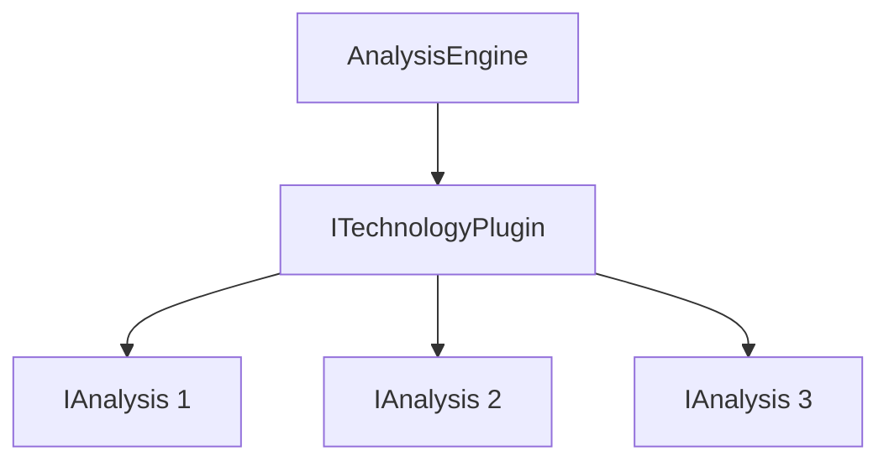

# Plugin Development Guide

## Overview

Vipr uses a plugin-based architecture that allows you to create custom analyzers for different technologies, frameworks, and code patterns. This guide will walk you through creating your first plugin and implementing custom analyses.

## Architecture

The plugin system consists of three main components:

1. **ITechnologyPlugin**: The main plugin interface that registers analyses
2. **IAnalysis**: Individual analysis units that perform specific checks
3. **AnalysisEngine**: Orchestrates plugin execution and aggregates results



## Creating Your First Plugin

### 1. Set up the package structure

Create a new package in the `analyzers/` directory:

```
analyzers/
  my-analyzer/
    src/
      analyses/
        my-analysis.ts
      plugin.ts
      index.ts
    package.json
    tsconfig.json
```

### 2. Implement ITechnologyPlugin

```typescript
// analyzers/my-analyzer/src/plugin.ts

import { SourceFile } from 'ts-morph';
import type { ITechnologyPlugin, PluginResult, AnalyzerConfig, IAnalysis } from '@vipr/types';
import { MyAnalysis } from './analyses/my-analysis';

export class MyAnalyzerPlugin implements ITechnologyPlugin {
  readonly id = 'my-analyzer';
  readonly name = 'My Analyzer';
  readonly version = '1.0.0';
  readonly filePatterns = ['**/*.myext'];

  private analyses: Map<string, IAnalysis> = new Map();

  constructor() {
    this.registerAnalyses();
  }

  private registerAnalyses(): void {
    const analysis = new MyAnalysis();
    this.analyses.set(analysis.id, analysis);
  }

  getAnalyses(): IAnalysis[] {
    return Array.from(this.analyses.values());
  }

  canHandle(sourceFile: SourceFile): boolean {
    return sourceFile.getFilePath().endsWith('.myext');
  }

  async analyze(sourceFile: SourceFile, config?: AnalyzerConfig): Promise<PluginResult> {
    const startTime = performance.now();
    const insights: ComplexityInsight[] = [];

    // Get enabled analyses
    const enabledAnalyses = this.getEnabledAnalyses(config);

    // Run analyses
    const analysisResults: AnalysisResult[] = [];
    for (const analysis of enabledAnalyses) {
      const result = await Promise.resolve(analysis.execute(sourceFile));
      analysisResults.push(result);
      insights.push(...result.insights);
    }

    // Aggregate results
    return this.aggregateResults(analysisResults, insights, startTime);
  }

  private getEnabledAnalyses(config?: AnalyzerConfig): IAnalysis[] {
    return Array.from(this.analyses.values()).filter(analysis => {
      const analysisConfig = config?.analyses?.[analysis.id];
      return analysisConfig?.enabled ?? analysis.enabledByDefault;
    });
  }

  private aggregateResults(
    analysisResults: AnalysisResult[],
    insights: ComplexityInsight[],
    startTime: number
  ): PluginResult {
    // Calculate composite score
    let totalScore = 0;
    let scoreCount = 0;
    for (const result of analysisResults) {
      if (result.score !== undefined) {
        totalScore += result.score;
        scoreCount++;
      }
    }
    const averageScore = scoreCount > 0 ? Math.round(totalScore / scoreCount) : undefined;

    // Build metrics
    const metrics: Record<string, unknown> = {};
    for (const result of analysisResults) {
      metrics[result.analysisId] = result.data;
    }

    return {
      pluginId: this.id,
      score: averageScore,
      insights,
      executionTimeMs: Math.round(performance.now() - startTime),
      metrics,
    };
  }

  getRules(): Rule[] {
    return [];
  }
}
```

### 3. Create analysis classes

```typescript
// analyzers/my-analyzer/src/analyses/my-analysis.ts

import { SourceFile } from 'ts-morph';
import type { IAnalysis, AnalysisResult, ComplexityInsight } from '@vipr/types';

interface MyAnalysisData {
  issueCount: number;
  details: string[];
}

export class MyAnalysis implements IAnalysis<unknown, MyAnalysisData> {
  readonly id = 'my-analysis';
  readonly name = 'My Analysis';
  readonly category = 'custom' as const;
  readonly description = 'Analyzes custom patterns';
  readonly version = '1.0.0';
  readonly enabledByDefault = true;
  readonly executionCost = 1 as const;

  validateConfig(): true | string {
    return true;
  }

  getDefaultConfig(): unknown {
    return {};
  }

  execute(sourceFile: SourceFile): AnalysisResult<MyAnalysisData> {
    const startTime = performance.now();
    const insights: ComplexityInsight[] = [];

    // Perform analysis
    const issueCount = this.countIssues(sourceFile);
    const details = this.collectDetails(sourceFile);

    // Generate insights
    if (issueCount > 10) {
      insights.push({
        severity: 'warning',
        category: 'custom',
        message: `Found ${issueCount} issues`,
        suggestion: 'Review and fix identified issues',
      });
    }

    // Calculate score
    const score = Math.max(0, 100 - issueCount * 5);

    return {
      analysisId: this.id,
      category: this.category,
      data: {
        issueCount,
        details,
      },
      insights,
      score,
      executionTimeMs: Math.round(performance.now() - startTime),
    };
  }

  private countIssues(sourceFile: SourceFile): number {
    // Implementation
    return 0;
  }

  private collectDetails(sourceFile: SourceFile): string[] {
    // Implementation
    return [];
  }
}
```

### 4. Export your plugin

```typescript
// analyzers/my-analyzer/src/index.ts

export { MyAnalyzerPlugin } from './plugin';
export { MyAnalysis } from './analyses/my-analysis';
```

## Best Practices

### Separation of Concerns

- Keep analysis logic separate from plugin coordination
- Each analysis should focus on a single concern
- Use utility functions for shared logic

### Testing Strategies

- Write unit tests for each analysis class
- Test plugin registration and coordination
- Use test fixtures for consistent test data

### Error Handling

- Always handle errors gracefully
- Return meaningful error messages
- Don't let one analysis failure break the entire plugin

### Performance Optimization

- Use execution cost to indicate analysis complexity
- Cache expensive computations when possible
- Avoid unnecessary AST traversals

## Examples

### Simple TypeScript Analyzer

```typescript
export class TypeScriptAnalysis implements IAnalysis {
  execute(sourceFile: SourceFile): AnalysisResult {
    // Analyze TypeScript-specific patterns
    const anyUsage = this.countAnyUsage(sourceFile);
    const untypedParams = this.countUntypedParameters(sourceFile);

    return {
      analysisId: 'typescript-quality',
      category: 'type-safety',
      data: { anyUsage, untypedParams },
      insights: this.generateInsights(anyUsage, untypedParams),
      score: this.calculateScore(anyUsage, untypedParams),
      executionTimeMs: 0,
    };
  }
}
```

### React-Specific Patterns

```typescript
export class ReactPatternAnalysis implements IAnalysis {
  execute(sourceFile: SourceFile): AnalysisResult {
    // Analyze React-specific patterns
    const propTypes = this.checkPropTypes(sourceFile);
    const hooks = this.analyzeHooks(sourceFile);

    return {
      analysisId: 'react-patterns',
      category: 'react',
      data: { propTypes, hooks },
      insights: [],
      score: 85,
      executionTimeMs: 0,
    };
  }
}
```

## API Reference

### IAnalysis Interface

```typescript
interface IAnalysis<TConfig, TResult, TMetrics> {
  readonly id: string;
  readonly name: string;
  readonly category: AnalysisCategory;
  readonly description: string;
  readonly version: string;
  readonly enabledByDefault: boolean;
  readonly executionCost: 1 | 2 | 3;

  validateConfig(): true | string;
  getDefaultConfig(): TConfig;
  execute(sourceFile: SourceFile, config?: AnalyzerConfig): AnalysisResult<TResult, TMetrics>;
}
```

### ITechnologyPlugin Interface

```typescript
interface ITechnologyPlugin {
  readonly id: string;
  readonly name: string;
  readonly version: string;
  readonly filePatterns: string[];

  getAnalyses(): IAnalysis[];
  canHandle(sourceFile: SourceFile): boolean;
  analyze(sourceFile: SourceFile, config?: AnalyzerConfig): Promise<PluginResult>;
  getRules(): Rule[];
}
```

## Publishing Plugins

In the future, plugins will be publishable as npm packages. For now, plugins are bundled with the CLI or loaded from the workspace.

## Next Steps

- Review existing plugins for examples
- Read the architecture documentation
- Check the migration guide if upgrading from v2
- Join the community for support
