# Testing Roadmap - Visual Guide

**Quick visual reference for testing priorities and dependencies**

## Priority Distribution

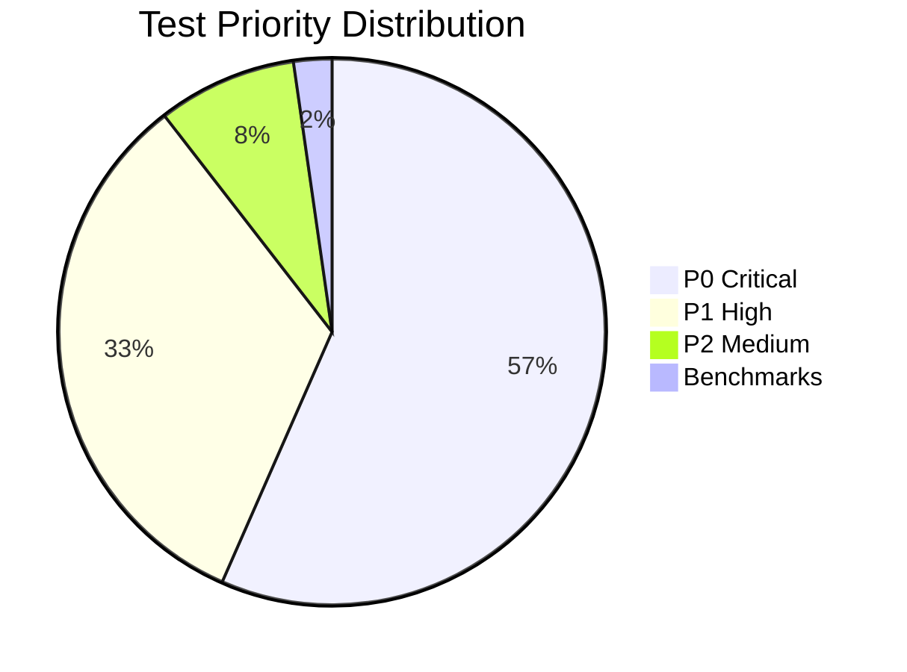

## Test Coverage Gap

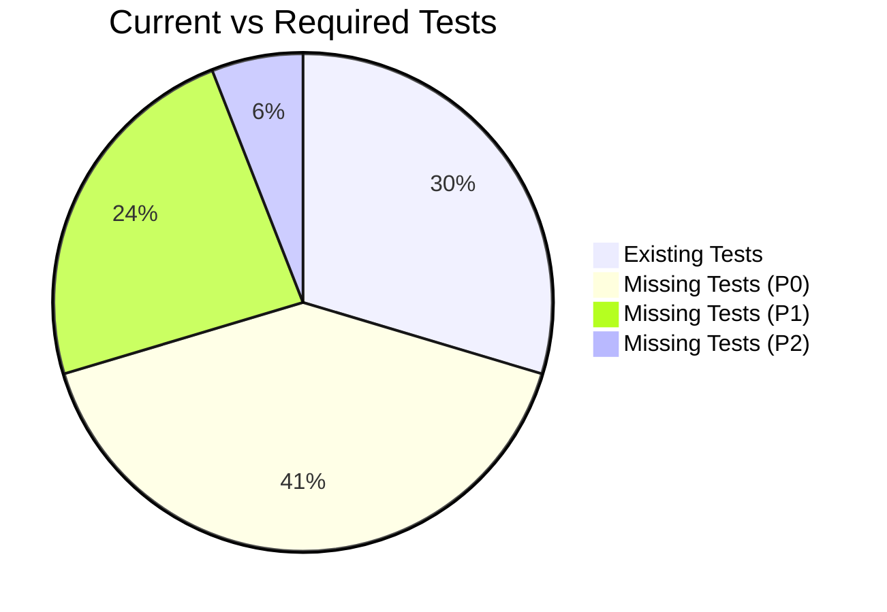

## Sprint Timeline

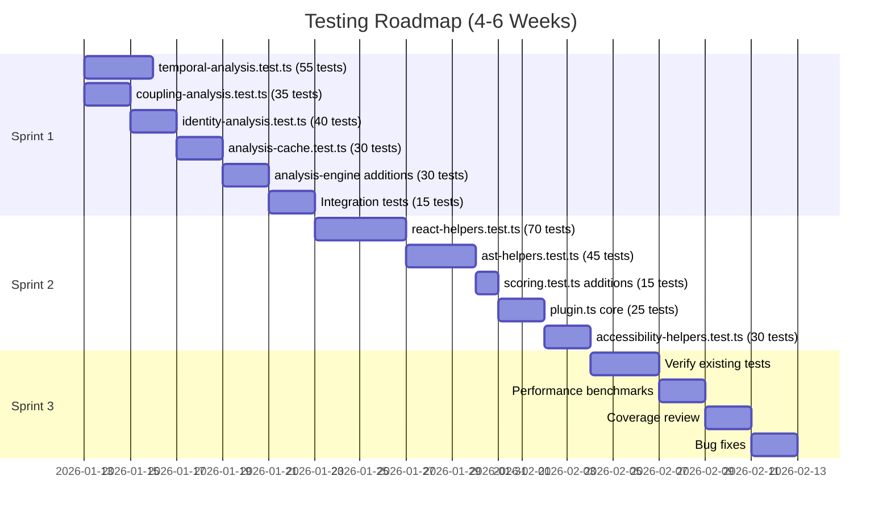

## Complexity vs Test Coverage

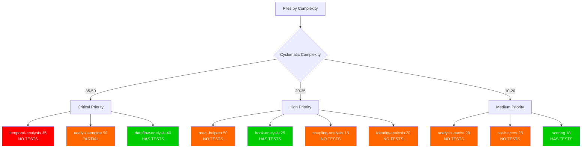

Legend:

- 🔴 Red: Critical - No tests, high complexity
- 🟠 Orange: High risk - Partial or no tests
- 🟢 Green: Has tests (may need verification)

## Analysis Engine Test Dependencies

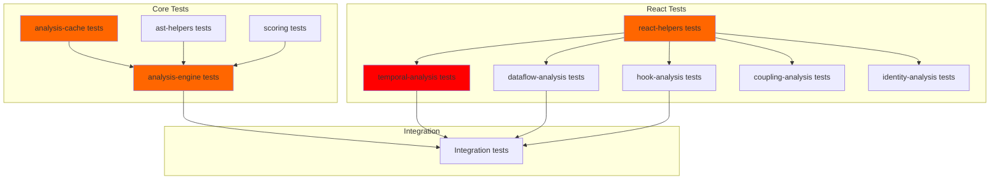

## Critical Path Analysis

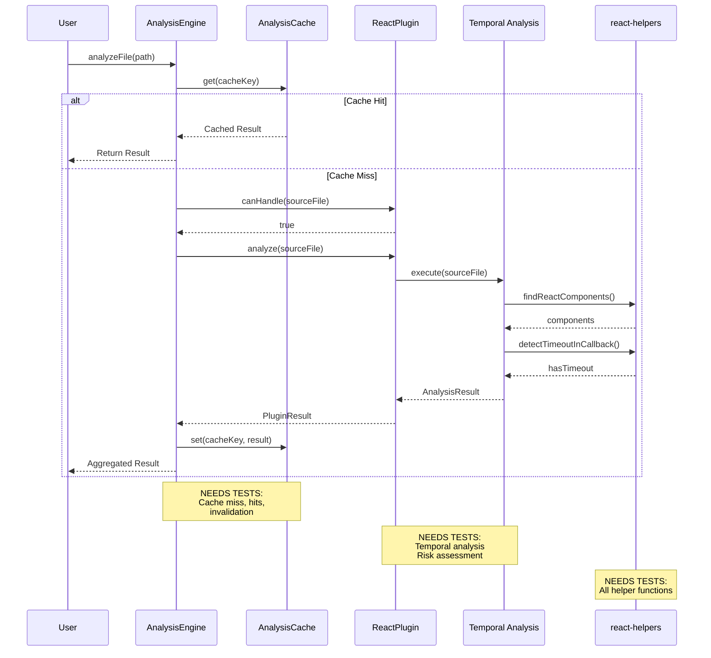

## Test Distribution by Package

```mermaid
graph LR
    A[Total: 486 Tests] --> B[@analyzers/core<br/>200-235 tests]
    A --> C[@analyzers/react<br/>325-370 tests]
    A --> D[Integration<br/>25-35 tests]

    B --> B1[analysis-engine<br/>50-60 tests]
    B --> B2[analysis-cache<br/>25-30 tests]
    B --> B3[ast-helpers<br/>40-45 tests]
    B --> B4[scoring<br/>30-35 tests]
    B --> B5[plugin<br/>20-25 tests]
    B --> B6[base-analyzer<br/>15-20 tests]

    C --> C1[temporal-analysis<br/>50-55 tests]
    C --> C2[dataflow-analysis<br/>45-50 tests]
    C --> C3[hook-analysis<br/>40-45 tests]
    C --> C4[react-helpers<br/>60-70 tests]
    C --> C5[coupling-analysis<br/>30-35 tests]
    C --> C6[identity-analysis<br/>35-40 tests]
    C --> C7[plugin<br/>40-45 tests]
    C --> C8[accessibility-helpers<br/>25-30 tests]

    style B1 fill:#ff6600
    style B2 fill:#ff6600
    style B3 fill:#ff9900
    style C1 fill:#ff0000
    style C4 fill:#ff6600
    style C5 fill:#ff6600
    style C6 fill:#ff6600
```

## Risk Assessment Matrix

```mermaid
quadrantChart
    title Code Complexity vs Test Coverage
    x-axis Low Complexity --> High Complexity
    y-axis Low Coverage --> High Coverage
    quadrant-1 High Complexity, Good Coverage (Verify)
    quadrant-2 High Complexity, Poor Coverage (CRITICAL)
    quadrant-3 Low Complexity, Poor Coverage (Medium)
    quadrant-4 Low Complexity, Good Coverage (Maintain)

    temporal-analysis: [0.88, 0.0]
    analysis-engine: [1.0, 0.4]
    dataflow-analysis: [0.85, 0.7]
    react-helpers: [0.95, 0.0]
    hook-analysis: [0.55, 0.75]
    coupling-analysis: [0.40, 0.0]
    identity-analysis: [0.45, 0.0]
    analysis-cache: [0.42, 0.0]
    scoring: [0.38, 0.8]
    plugin-core: [0.32, 0.0]
    ast-helpers: [0.60, 0.0]
    accessibility-helpers: [0.35, 0.0]
```

Quadrant Interpretation:

- **Q1 (Top-Right):** High complexity, good coverage - Verify and maintain
- **Q2 (Top-Left):** High complexity, poor coverage - CRITICAL PRIORITY
- **Q3 (Bottom-Left):** Low complexity, poor coverage - Medium priority
- **Q4 (Bottom-Right):** Low complexity, good coverage - Maintain

## Sprint Capacity Planning

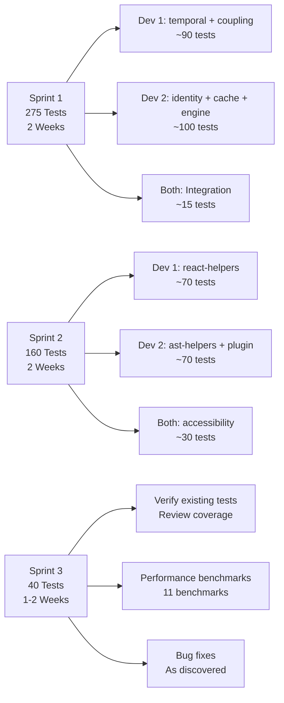

## Test Types Distribution

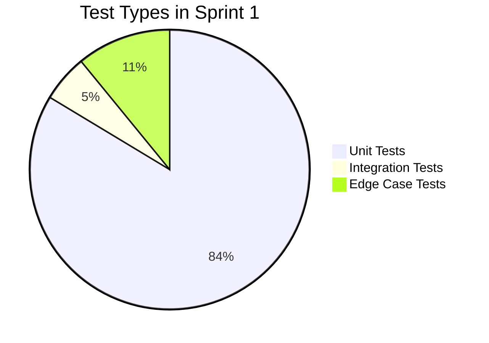

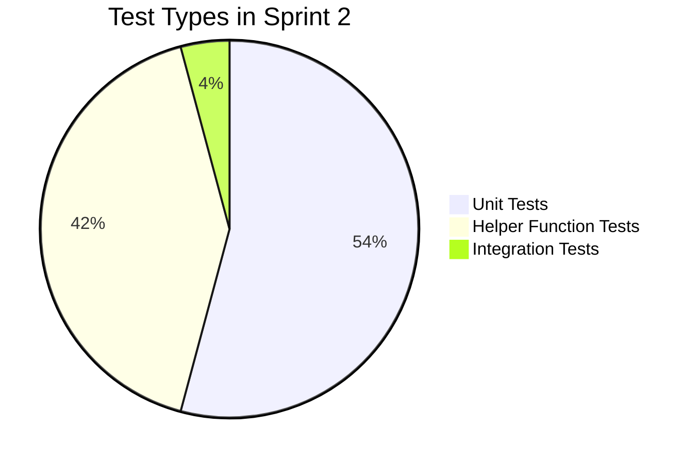

## Coverage Targets by Sprint

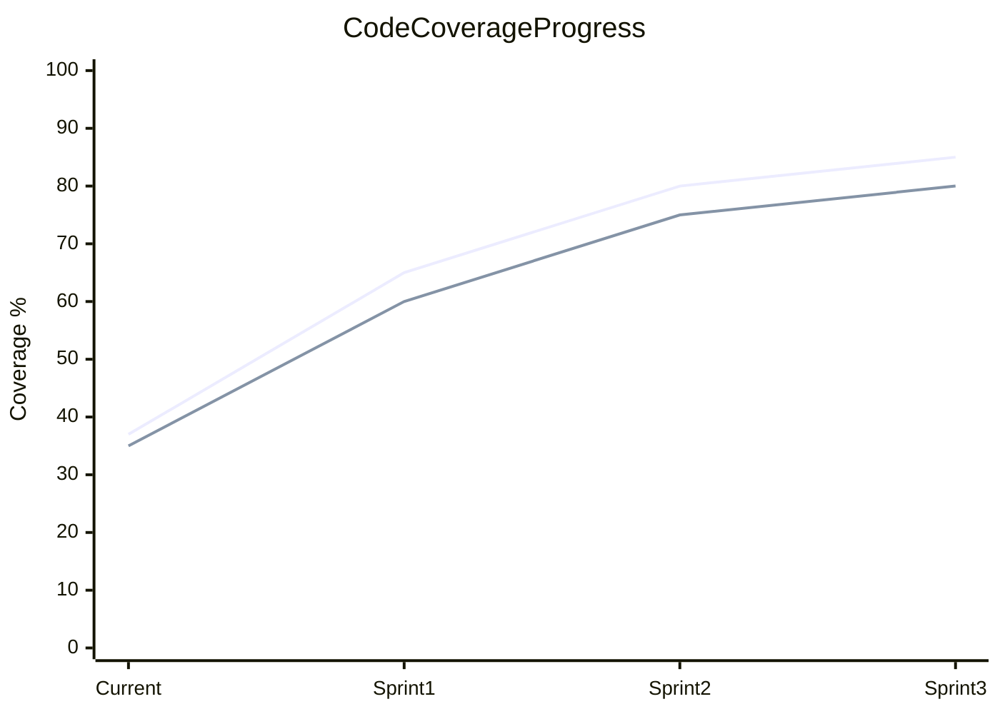

Legend:

- Blue: Line coverage
- Orange: Branch coverage

Target: 85% line, 80% branch

## File Prioritization Matrix

| Priority | File                     | Tests Needed | Sprint | Team Member |
| -------- | ------------------------ | ------------ | ------ | ----------- |
| 🔴 P0.1  | temporal-analysis.ts     | 55           | 1      | Dev 1       |
| 🔴 P0.2  | coupling-analysis.ts     | 35           | 1      | Dev 1       |
| 🔴 P0.3  | identity-analysis.ts     | 40           | 1      | Dev 2       |
| 🔴 P0.4  | analysis-cache.ts        | 30           | 1      | Dev 2       |
| 🔴 P0.5  | analysis-engine.ts       | 30           | 1      | Dev 2       |
| 🔴 P0.6  | Integration tests        | 15           | 1      | Both        |
| 🟠 P1.1  | react-helpers.ts         | 70           | 2      | Dev 1       |
| 🟠 P1.2  | ast-helpers.ts           | 45           | 2      | Dev 2       |
| 🟠 P1.3  | plugin.ts (core)         | 25           | 2      | Dev 2       |
| 🟠 P1.4  | accessibility-helpers.ts | 30           | 2      | Both        |
| 🟠 P1.5  | scoring.ts additions     | 15           | 2      | Dev 2       |
| 🟡 P2.1  | Verify existing          | 30           | 3      | Both        |
| 🟡 P2.2  | Benchmarks               | 11           | 3      | Both        |

## Quick Decision Tree

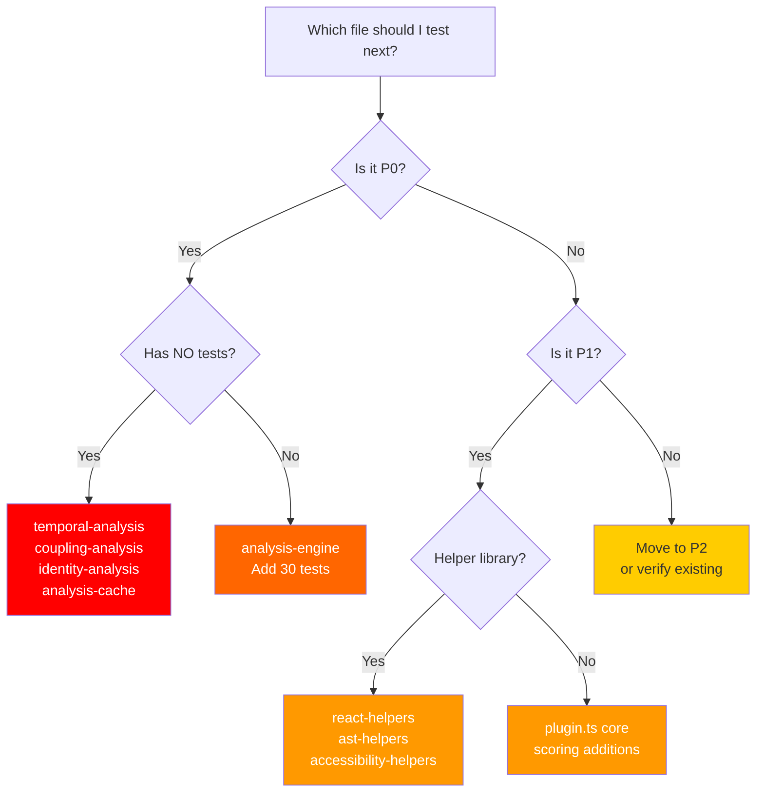

## Dependencies Between Test Files

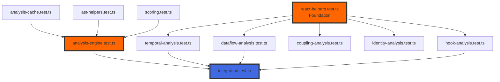

**Key Insight:** react-helpers.ts is a foundational dependency. Test it early in Sprint 2 to unblock other React analysis tests.

## Weekly Milestones

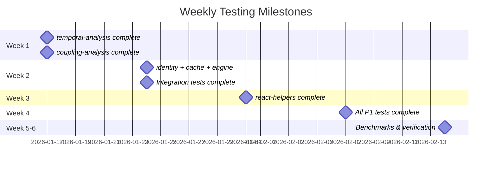

## Success Metrics Dashboard

Track these weekly:

| Metric          | Target | Current | Sprint 1 | Sprint 2 | Sprint 3 |
| --------------- | ------ | ------- | -------- | -------- | -------- |
| Line Coverage   | 85%    | 37%     | 65%      | 80%      | 85%      |
| Branch Coverage | 80%    | 35%     | 60%      | 75%      | 80%      |
| Tests Written   | 486    | ~200    | 475      | 635      | 686      |
| P0 Tests Done   | 275    | 0       | 275      | 275      | 275      |
| Bugs Found      | -      | 0       | TBD      | TBD      | TBD      |
| Benchmarks      | 11     | 0       | 0        | 0        | 11       |

## Resource Allocation

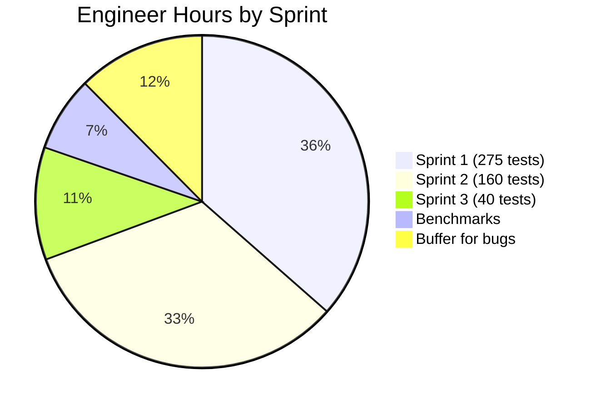

Total: 137 hours (17 days @ 8h/day with 2 engineers = 8.5 days)

## Conclusion

This visual roadmap provides:

- Clear prioritization (P0 → P1 → P2)
- Sprint-by-sprint plan (3 sprints, 4-6 weeks)
- Resource allocation (2 developers)
- Dependencies between test files
- Success metrics and milestones

**Next Action:** Begin Sprint 1 with temporal-analysis.test.ts (highest risk file).

---

**Related Documents:**

- `testing-summary.md` - Executive summary
- `testing-priority-checklist.md` - Detailed checklists
- `detailed-test-specifications.md` - Test specifications
- `complexity-matrix.md` - Complexity metrics
