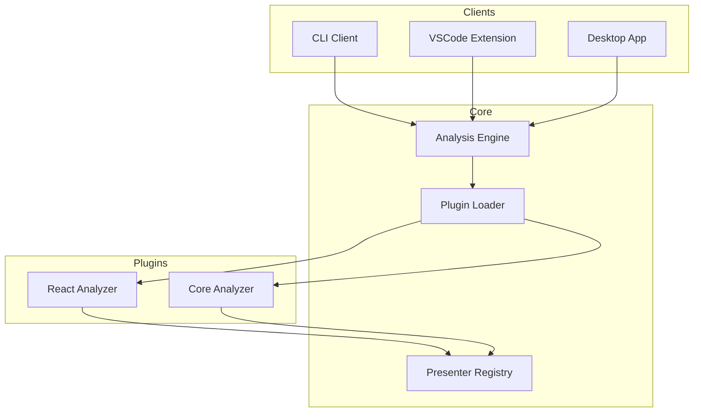

# Vipr Architecture

Vipr uses a plugin-based architecture to decouple analysis logic from presentation and client implementations.

## High-Level Overview

## Key Components

### Analysis Engine

Orchestrates the analysis process by coordinating plugins and managing results.

### Plugin System

Enables extensibility through a dynamic plugin architecture. Plugins can provide:

- Analysis capabilities
- Report presenters
- Custom metrics

### Presenter Registry

Manages report presenters and enables dynamic discovery of available reports.

### Clients

Multiple client applications consume the core engine:

- **CLI** - Command-line interface
- **VSCode** - Editor integration
- **Desktop** - Standalone GUI application

## Design Principles

### Decoupling

Clients never import from analyzers directly. All communication flows through interfaces and the plugin system.

### Dynamic Discovery

No hardcoded report types. Formatters query the registry for available reports at runtime.

### Metadata-Driven

UI elements (labels, icons, display order) come from presenter metadata, not client code.

## Learn More

For detailed architecture documentation, see:

- [Plugin Architecture](./plugin-architecture) - Comprehensive architecture guide with diagrams
