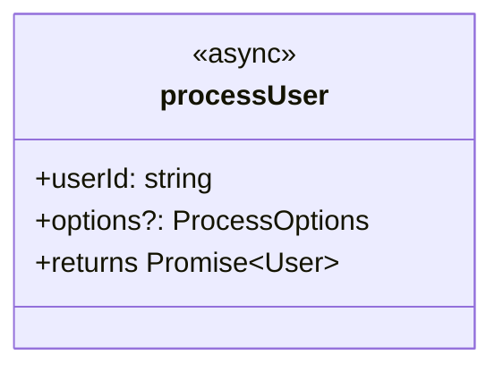

# FunctionUML Component

## Overview

The `FunctionUML` component converts function signatures into Mermaid UML class diagrams with full dark/light mode theming that respects the Vipr design system color tokens.

## Location

- **Component**: `packages/ui/src/components/diagrams/FunctionUML.tsx`
- **Export**: `@vipr/ui/function-uml`
- **Category**: Diagrams

## Features

- **Mermaid Integration**: Uses Mermaid.js to render UML class diagrams
- **Theme-Aware**: Automatically applies dark/light mode colors from `color-tokens.json`
- **Type Safety**: Accepts function metadata with strict TypeScript types
- **Multiple Variants**: Supports `inline` and `card` presentation modes
- **Accessibility**: Proper error states and loading handling

## API

```tsx
interface FunctionUMLProps {
  functionData: FunctionUMLData;
  darkMode?: boolean;
  className?: string;
  variant?: 'inline' | 'card';
}

interface FunctionUMLData {
  name: string;
  kind: 'function' | 'arrow' | 'method' | 'constructor';
  parameters: FunctionParameter[];
  returnType?: string | undefined;
  isAsync?: boolean | undefined;
  isExported?: boolean | undefined;
  isGenerator?: boolean | undefined;
  documentation?: string | undefined;
}

interface FunctionParameter {
  name: string;
  type?: string | undefined;
  optional?: boolean;
  defaultValue?: string | undefined;
}
```

## Usage

### Basic Usage (Card Variant)

```tsx
import { FunctionUML } from '@vipr/ui/function-uml';

<FunctionUML
  functionData={{
    name: 'processUser',
    kind: 'function',
    parameters: [
      { name: 'userId', type: 'string' },
      { name: 'options', type: 'ProcessOptions', optional: true },
    ],
    returnType: 'Promise<User>',
    isAsync: true,
    isExported: true,
  }}
  darkMode={theme === 'dark'}
  variant="card"
/>;
```

### Inline Usage

```tsx
<FunctionUML
  functionData={functionData}
  darkMode={darkMode}
  variant="inline"
  className="p-4 bg-gray-50 dark:bg-gray-900 rounded-lg"
/>
```

## Desktop Integration

In `clients/desktop/src/renderer/pages/FunctionDetail.tsx`, the component is integrated as a tabbed view:

```tsx
// State for switching between text signature and UML diagram
const [signatureView, setSignatureView] = useState<'text' | 'uml'>('text');

// Tabs for switching
<Tabs variant="simple">
  <Tab active={signatureView === 'text'} onClick={() => setSignatureView('text')}>
    Text Signature
  </Tab>
  <Tab active={signatureView === 'uml'} onClick={() => setSignatureView('uml')}>
    UML Diagram
  </Tab>
</Tabs>;

// Conditional rendering
{
  signatureView === 'text' ? (
    <FunctionSignature className="h-full w-full" functionData={functionData} />
  ) : (
    <FunctionUML
      className="h-full w-full"
      functionData={functionData}
      darkMode={theme === 'dark'}
      variant="card"
    />
  );
}
```

## Diagram Generation

The component generates Mermaid class diagram syntax:

**Input Function:**

```ts
export async function processUser(userId: string, options?: ProcessOptions): Promise<User>;
```

**Generated Mermaid:**



## Theming

The component maps Vipr color tokens to Mermaid theme variables:

| Vipr Token     | Mermaid Variable     | Light Mode   | Dark Mode    |
| -------------- | -------------------- | ------------ | ------------ |
| Primary text   | `primaryTextColor`   | `gray-800`   | `gray-100`   |
| Secondary text | `secondaryTextColor` | `gray-600`   | `gray-400`   |
| Background     | `mainBkg`            | `white`      | `gray-800`   |
| Border         | `primaryBorderColor` | `gray-300`   | `gray-600`   |
| Accent         | `noteBkgColor`       | `violet-500` | `violet-700` |

## Error Handling

The component includes robust error handling:

- Catches Mermaid rendering errors
- Displays user-friendly error messages
- Logs errors to console for debugging

## TypeScript Notes

Due to `exactOptionalPropertyTypes: true` in the Vipr TypeScript config:

- All optional properties explicitly include `| undefined`
- This ensures type compatibility with `FunctionMetadata` from desktop
- Theme constants use `as const` assertions for proper literal types

## Dependencies

- `mermaid`: ^11.12.3 (added to `@vipr/ui/package.json`)
- No additional dependencies required

## Component Catalog

The component is registered in `packages/ui/catalogs/component-catalog.json` under the `diagrams` category.

## Future Enhancements

Potential improvements:

1. **Export Capability**: Add button to export diagram as SVG/PNG
2. **Zoom Controls**: Add zoom in/out for complex signatures
3. **Interactive Elements**: Click parameters to highlight in code
4. **Custom Styling**: Accept custom Mermaid theme overrides
5. **Multiple Functions**: Show class diagrams with multiple related functions
