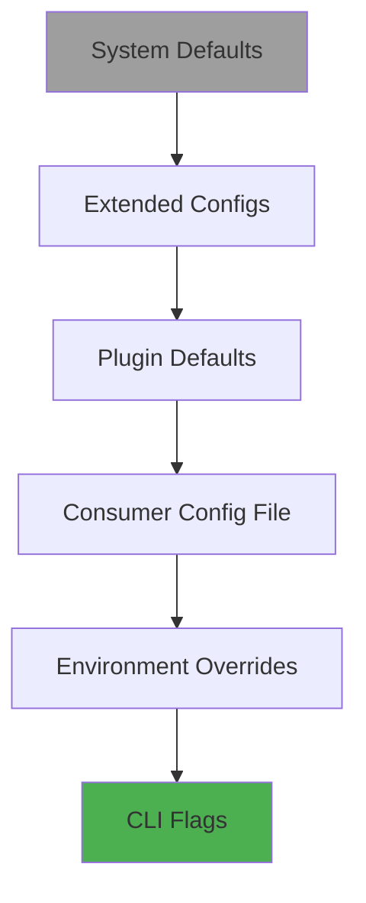

# Configuration Guide

Vipr provides a flexible hierarchical configuration system that allows you to customize analysis behavior, thresholds, and output formatting.

## Table of Contents

- [Quick Start](#quick-start)
- [Configuration File Discovery](#configuration-file-discovery)
- [Configuration Hierarchy](#configuration-hierarchy)
- [Basic Configuration](#basic-configuration)
- [Extending Configurations](#extending-configurations)
- [Plugin Configuration](#plugin-configuration)
- [Environment-Specific Configuration](#environment-specific-configuration)
- [CLI Overrides](#cli-overrides)
- [Configuration Reference](#configuration-reference)

## Quick Start

Create a `vipr.config.json` file in your project root:

```json
{
  "$schema": "https://vipr.dev/schemas/vipr-config.schema.json",
  "global": {
    "gradeBoundaries": {
      "A": 20,
      "B": 40,
      "C": 60,
      "D": 75
    }
  },
  "output": {
    "format": "cli",
    "minSeverity": "warning"
  },
  "ci": {
    "failThreshold": 70,
    "failOnCritical": true
  }
}
```

The `$schema` property enables IDE autocomplete and validation.

## Configuration File Discovery

Vipr searches for configuration files in the following order:

1. Explicit path via `--config` flag
2. `vipr.config.json` in current directory
3. `vipr.config.json` in parent directories (searches up to filesystem root)

Supported file names (in priority order):

- `vipr.config.json` (currently supported)
- `vipr.config.js` (planned)
- `vipr.config.mjs` (planned)
- `vipr.config.ts` (planned)
- `vipr.config.mts` (planned)

## Configuration Hierarchy

Configuration is resolved using a clear precedence order (lowest to highest priority):



1. **System Defaults** - Built-in defaults from `@vipr/common`
2. **Extended Configs** - Configs specified via `extends` property
3. **Plugin Defaults** - From `analyzer.config.json` in plugin packages
4. **Consumer Config File** - Your `vipr.config.json`
5. **Environment Overrides** - From `env` property in config
6. **CLI Flags** - Command-line arguments (highest priority)

## Basic Configuration

### Global Settings

Control system-wide behavior:

```json
{
  "global": {
    "debug": false,
    "cache": true,
    "gradeBoundaries": {
      "A": 25,
      "B": 45,
      "C": 65,
      "D": 80
    }
  }
}
```

### Output Configuration

Control how analysis results are displayed:

```json
{
  "output": {
    "format": "cli",
    "minSeverity": "info",
    "compact": false,
    "failThreshold": 0,
    "failOnCritical": false
  }
}
```

Available formats:

- `cli` - Colored console output with visual elements
- `json` - Compact JSON with core metrics
- `json-full` - Full JSON with all analysis details
- `markdown` - Markdown format for documentation

### File Filtering

Control which files are analyzed:

```json
{
  "include": ["src/**/*.{ts,tsx}", "components/**/*.{ts,tsx}"],
  "exclude": ["**/node_modules/**", "**/dist/**", "**/*.test.ts"]
}
```

## Extending Configurations

Share common configuration across projects or teams by extending base configurations:

### Single Extends

```json
{
  "extends": "./base-config.json",
  "output": {
    "format": "json"
  }
}
```

### Multiple Extends

```json
{
  "extends": ["./team-standards.json", "./react-defaults.json"],
  "plugins": {
    "react": {
      "thresholds": {
        "hooks": {
          "total": 12
        }
      }
    }
  }
}
```

Configs are merged left-to-right, with the current config having highest priority.

## Plugin Configuration

Override plugin-specific settings:

### React Plugin

```json
{
  "plugins": {
    "react": {
      "thresholds": {
        "structural": {
          "warning": 20,
          "critical": 35
        },
        "hooks": {
          "total": 12,
          "customHookSuggestion": 10,
          "stateCountWarning": 4
        },
        "coupling": {
          "contextWarning": 2,
          "propsWarning": 8
        }
      },
      "weights": {
        "complexity": {
          "structural": 0.25,
          "hooks": 0.25,
          "temporal": 0.2,
          "coupling": 0.15,
          "identity": 0.15
        }
      },
      "analyses": {
        "security": { "enabled": true },
        "accessibility": { "enabled": true },
        "performance": { "enabled": true },
        "react-migration": { "enabled": false }
      }
    }
  }
}
```

### Core Plugin

```json
{
  "plugins": {
    "core": {
      "thresholds": {
        "cyclomaticComplexity": {
          "warning": 15,
          "critical": 25
        },
        "halstead": {
          "difficulty": 35,
          "effort": 1500000
        },
        "maintainability": {
          "warning": 60,
          "critical": 35
        }
      }
    }
  }
}
```

## Environment-Specific Configuration

Use different settings for different environments:

```json
{
  "output": {
    "format": "cli",
    "minSeverity": "info"
  },
  "env": {
    "ci": {
      "output": {
        "format": "json",
        "minSeverity": "warning"
      },
      "ci": {
        "failThreshold": 70,
        "failOnCritical": true
      }
    },
    "production": {
      "output": {
        "minSeverity": "critical"
      }
    }
  }
}
```

Activate environment-specific config:

```bash
vipr analyze src/**/*.tsx --environment ci
```

## CLI Overrides

Command-line flags override all configuration sources:

```bash
# Override output format
vipr analyze src/**/*.tsx --format json

# Override minimum severity
vipr analyze src/**/*.tsx --min-severity critical

# Override cache setting
vipr analyze src/**/*.tsx --no-cache

# Use specific config file
vipr analyze src/**/*.tsx --config ./custom-config.json

# Skip config file entirely
vipr analyze src/**/*.tsx --no-config
```

## Configuration Reference

### Global Configuration

| Property            | Type      | Default | Description           |
| ------------------- | --------- | ------- | --------------------- |
| `debug`             | `boolean` | `false` | Enable debug logging  |
| `cache`             | `boolean` | `true`  | Enable result caching |
| `gradeBoundaries.A` | `number`  | `25`    | Max score for grade A |
| `gradeBoundaries.B` | `number`  | `45`    | Max score for grade B |
| `gradeBoundaries.C` | `number`  | `65`    | Max score for grade C |
| `gradeBoundaries.D` | `number`  | `80`    | Max score for grade D |

### Output Configuration

| Property         | Type      | Default  | Description                                           |
| ---------------- | --------- | -------- | ----------------------------------------------------- |
| `format`         | `string`  | `"cli"`  | Output format: `cli`, `json`, `json-full`, `markdown` |
| `minSeverity`    | `string`  | `"info"` | Minimum severity: `info`, `warning`, `critical`       |
| `compact`        | `boolean` | `false`  | Use compact output (JSON formats only)                |
| `failThreshold`  | `number`  | `0`      | Exit with error if score below this (0-100)           |
| `failOnCritical` | `boolean` | `false`  | Exit with error if critical issues found              |

### CI Configuration

| Property         | Type      | Default | Description                            |
| ---------------- | --------- | ------- | -------------------------------------- |
| `failThreshold`  | `number`  | -       | Score threshold for CI failure (0-100) |
| `failOnCritical` | `boolean` | `false` | Fail CI if critical issues found       |

## Best Practices

### 1. Use Extends for Shared Configuration

Create base configs for teams:

```json
// team-base.json
{
  "global": {
    "gradeBoundaries": {
      "A": 20,
      "B": 40,
      "C": 60,
      "D": 75
    }
  },
  "output": {
    "minSeverity": "warning"
  }
}
```

```json
// vipr.config.json
{
  "extends": "./configs/team-base.json",
  "plugins": {
    "react": {
      "thresholds": {
        "hooks": { "total": 10 }
      }
    }
  }
}
```

### 2. Separate CI Configuration

Use environment-specific config for CI:

```json
{
  "output": {
    "format": "cli"
  },
  "env": {
    "ci": {
      "output": {
        "format": "json-full"
      },
      "ci": {
        "failThreshold": 70,
        "failOnCritical": true
      }
    }
  }
}
```

### 3. Version Control Your Config

Commit your `vipr.config.json` to version control to ensure consistent analysis across your team.

### 4. Use JSON Schema

Include the `$schema` property for IDE support:

```json
{
  "$schema": "https://vipr.dev/schemas/vipr-config.schema.json"
}
```

Or use a relative path:

```json
{
  "$schema": "./node_modules/@vipr/common/schemas/vipr-config.schema.json"
}
```

### 5. Gradual Threshold Tightening

Start with loose thresholds and gradually tighten:

```json
{
  "plugins": {
    "react": {
      "thresholds": {
        "hooks": {
          "total": 15
        }
      }
    }
  }
}
```

After addressing issues:

```json
{
  "plugins": {
    "react": {
      "thresholds": {
        "hooks": {
          "total": 10
        }
      }
    }
  }
}
```

## Examples

### Strict Configuration

For high-quality codebases:

```json
{
  "global": {
    "gradeBoundaries": {
      "A": 15,
      "B": 30,
      "C": 50,
      "D": 70
    }
  },
  "plugins": {
    "react": {
      "thresholds": {
        "structural": { "warning": 12 },
        "hooks": { "total": 8 },
        "coupling": { "propsWarning": 6 }
      }
    }
  },
  "output": {
    "minSeverity": "warning"
  },
  "ci": {
    "failThreshold": 80,
    "failOnCritical": true
  }
}
```

### Lenient Configuration

For legacy codebases:

```json
{
  "global": {
    "gradeBoundaries": {
      "A": 35,
      "B": 55,
      "C": 75,
      "D": 90
    }
  },
  "plugins": {
    "react": {
      "thresholds": {
        "structural": { "warning": 25 },
        "hooks": { "total": 15 },
        "coupling": { "propsWarning": 15 }
      }
    }
  },
  "output": {
    "minSeverity": "critical"
  },
  "ci": {
    "failThreshold": 40
  }
}
```

## Troubleshooting

### Config Not Found

If Vipr can't find your config:

```bash
# Use explicit path
vipr analyze src/**/*.tsx --config ./vipr.config.json

# Enable debug logging to see search path
vipr analyze src/**/*.tsx --debug
```

### Invalid Configuration

If your config has errors:

1. Check JSON syntax (trailing commas, quotes)
2. Verify schema with `$schema` property
3. Enable debug mode: `vipr analyze --debug`

### Weights Don't Sum to 1.0

Plugin complexity weights must sum to 1.0:

```json
{
  "plugins": {
    "react": {
      "weights": {
        "complexity": {
          "structural": 0.2,
          "hooks": 0.25,
          "temporal": 0.25,
          "coupling": 0.15,
          "identity": 0.15
        }
      }
    }
  }
}
```

Total: 0.2 + 0.25 + 0.25 + 0.15 + 0.15 = 1.0 ✓

## See Also

- [Configuration Reference](./configuration-reference.md) - Complete API reference
- [CLI Usage](cli/usage) - Command-line interface guide
- [Plugin Architecture](./plugin-architecture.md) - Plugin system documentation
