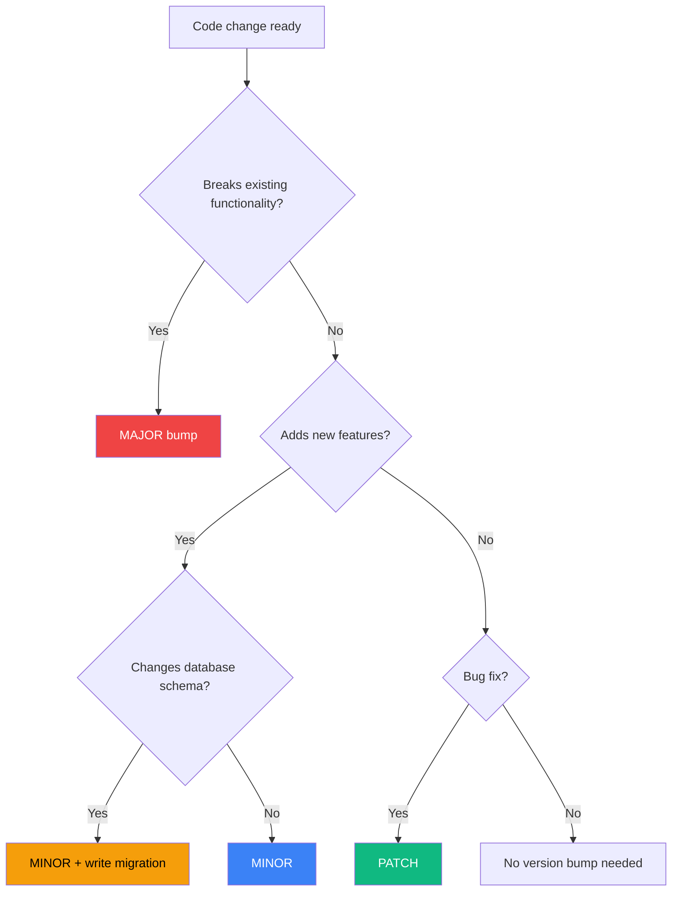

# Electron Auto-Update Maintenance Guide

**Audience:** Vipr maintainers, release engineers
**Purpose:** Day-to-day operations for auto-updates
**Last Updated:** 2026-02-14
**Related:** [Phase 22 - Self-Updating Electron](../feature-development/electron-app/round-two/22-self-updating-electron.md)

---

## Table of Contents

1. [Version Management](#1-version-management)
2. [Release Process](#2-release-process)
3. [Code Signing Setup](#3-code-signing-setup)
4. [Database Migration Writing](#4-database-migration-writing)
5. [Troubleshooting](#5-troubleshooting)
6. [Monitoring and Debugging](#6-monitoring-and-debugging)
7. [Update Server Management](#7-update-server-management)
8. [Release Checklists](#8-release-checklists)
9. [Quick Reference](#9-quick-reference)

---

## 1. Version Management

### Semantic Versioning Rules

Vipr follows strict semantic versioning for desktop releases:

```
MAJOR.MINOR.PATCH (e.g., 1.2.3)

PATCH (0.8.0 → 0.8.1):
  - Bug fixes only
  - No API changes
  - No database schema changes
  - Example: Fix crash on startup, correct typo in UI

MINOR (0.8.1 → 0.9.0):
  - New features
  - Database schema changes (with migrations)
  - Non-breaking API changes
  - Example: Add scheduled analysis, new MCP server feature

MAJOR (0.9.0 → 1.0.0):
  - Breaking changes
  - Incompatible database changes (require full rebuild)
  - Removed APIs
  - Example: Complete UI redesign, change workspace storage format
```

### Version Bump Commands

```bash
# Navigate to desktop package
cd clients/desktop

# PATCH bump (0.8.0 → 0.8.1)
pnpm version patch

# MINOR bump (0.8.1 → 0.9.0)
pnpm version minor

# MAJOR bump (0.9.0 → 1.0.0)
pnpm version major

# Pre-release (beta)
pnpm version prerelease --preid beta
# 0.9.0 → 0.9.1-beta.0

# Next beta
pnpm version prerelease --preid beta
# 0.9.1-beta.0 → 0.9.1-beta.1

# Promote beta to stable
pnpm version minor
# 0.9.1-beta.1 → 0.9.0
```

**Note:** The `pnpm version` command automatically updates `package.json` and creates a git commit. You still need to create and push the tag manually (see Release Process).

### Decision Tree: Which Version to Bump?



**Examples:**

| Change                                           | Version Type | Reasoning                        |
| ------------------------------------------------ | ------------ | -------------------------------- |
| Fix crash on Windows                             | PATCH        | Bug fix, no schema change        |
| Add "Export to PDF" feature                      | MINOR        | New feature, no schema change    |
| Add `last_exported_at` column to `workspaces`    | MINOR        | Schema change with migration     |
| Remove multi-workspace support                   | MAJOR        | Breaking change, removes feature |
| Change workspace file format from JSON to binary | MAJOR        | Incompatible change              |

---

## 2. Release Process

### Pre-Release Checklist

Before starting a release, verify:

- [ ] All tests passing (`pnpm test`)
- [ ] Linting clean (`pnpm lint`)
- [ ] TypeScript compiles (`pnpm typecheck`)
- [ ] Database migrations tested (up and down)
- [ ] `CHANGELOG.md` updated with user-facing changes
- [ ] Version bumped in `package.json`
- [ ] Code signing certificates valid (check expiry)
- [ ] Update server accessible (https://cdn.vipr.dev)
- [ ] No uncommitted changes (`git status`)

### Step-by-Step Release

#### 1. Clean Working Directory

```bash
# Verify clean state
git status

# Stash any uncommitted changes
git stash

# Switch to main branch
git checkout main

# Pull latest
git pull origin main
```

#### 2. Run Full Test Suite

```bash
# Install dependencies (use frozen lockfile for reproducibility)
pnpm install --frozen-lockfile

# Build all packages
pnpm build

# Run all tests
pnpm test

# Typecheck
pnpm typecheck

# Lint
pnpm lint
```

**If tests fail:** Fix issues before proceeding. Never release with failing tests.

#### 3. Update Changelog

Edit `CHANGELOG.md` following this format:

```markdown
## [0.9.0] - 2026-02-15

### Added

- Scheduled analysis (hourly, daily, weekly) [#123]
- Embedded MCP server for AI agents [#124]
- Beta update channel for early access [#125]

### Changed

- Improved dependency graph performance (50% faster) [#126]
- Updated React plugin to detect React 19 patterns [#127]

### Fixed

- Fixed crash when analyzing files with emojis in names [#128]
- Corrected complexity score calculation for async functions [#129]

### Database Migrations

- v3 → v4: Add `scheduled_analyses` table
- v4 → v5: Add `mcp_server_config` column to `workspaces`

### Breaking Changes

- Removed deprecated `getTotalComplexity()` API
```

**Principles:**

- User-facing language (not technical jargon)
- Link to GitHub issues/PRs with `[#123]`
- Group by category (Added, Changed, Fixed, etc.)
- Mention database migrations explicitly
- Flag breaking changes clearly

#### 4. Bump Version

```bash
# For minor release (0.8.1 → 0.9.0)
pnpm --filter @vipr/desktop version minor

# This updates package.json and creates a commit
```

Verify the version change:

```bash
git show HEAD
# Should show package.json version updated
```

#### 5. Commit Changelog

```bash
git add CHANGELOG.md
git commit --amend --no-edit
# Amends the version commit to include CHANGELOG.md
```

#### 6. Create and Push Tag

```bash
# Create annotated tag (preferred over lightweight tags)
git tag -a desktop-v0.9.0 -m "Release desktop v0.9.0"

# Push to GitHub (triggers CI/CD)
git push origin main --tags
```

#### 7. Monitor CI/CD

Navigate to: https://github.com/vipr/vipr/actions

Watch the "Release Desktop App" workflow:

- [ ] macOS build completes
- [ ] Windows build completes
- [ ] Linux build completes
- [ ] Code signing succeeds (macOS, Windows)
- [ ] Notarization succeeds (macOS)
- [ ] S3 upload completes
- [ ] GitHub Release created

**Estimated time:** 20-30 minutes for all platforms.

#### 8. Verify Release Artifacts

Check S3 bucket:

```bash
aws s3 ls s3://vipr-updates/releases/desktop-v0.9.0/
# Should show .dmg, .exe, .deb, .rpm, .AppImage
```

Check GitHub Release:

```bash
gh release view desktop-v0.9.0
# Or visit: https://github.com/vipr/vipr/releases/tag/desktop-v0.9.0
```

Verify checksums:

```bash
# Download SHA512SUMS
curl -O https://cdn.vipr.dev/releases/desktop-v0.9.0/SHA512SUMS

# Verify local build (if available)
sha512sum Vipr-0.9.0.dmg
# Compare with SHA512SUMS
```

#### 9. Smoke Test

Download and install on each platform:

**macOS:**

```bash
curl -O https://cdn.vipr.dev/releases/desktop-v0.9.0/Vipr-0.9.0.dmg
open Vipr-0.9.0.dmg
# Drag to Applications, launch, verify version
```

**Windows:**

```powershell
Invoke-WebRequest -Uri "https://cdn.vipr.dev/releases/desktop-v0.9.0/Vipr-0.9.0-Setup.exe" -OutFile "Vipr-Setup.exe"
.\Vipr-Setup.exe
# Install, launch, verify version
```

**Linux:**

```bash
curl -O https://cdn.vipr.dev/releases/desktop-v0.9.0/Vipr-0.9.0.AppImage
chmod +x Vipr-0.9.0.AppImage
./Vipr-0.9.0.AppImage
# Launch, verify version
```

**Smoke Test Checklist:**

- [ ] App launches without errors
- [ ] Version shown in About is correct
- [ ] Database migrations run successfully (check logs)
- [ ] Create new workspace (tests DB schema)
- [ ] Run analysis on sample project
- [ ] Check for updates (should show "Up to date")

#### 10. Publish Release

If CI created a draft release, publish it:

```bash
gh release edit desktop-v0.9.0 --draft=false
```

Or via GitHub UI: https://github.com/vipr/vipr/releases → Edit → Publish

#### 11. Announce

Post release announcement:

- Discord: #announcements channel
- Twitter: @vipr_dev
- Blog: vipr.dev/blog

**Template:**

```
🎉 Vipr Desktop v0.9.0 is now available!

New features:
- Scheduled analysis
- Embedded MCP server
- Beta update channel

Download: https://vipr.dev/download
Full changelog: https://github.com/vipr/vipr/releases/tag/desktop-v0.9.0

Existing users will receive an auto-update notification within 24 hours.
```

### Rollback Procedure

If a critical bug is discovered post-release:

#### Option 1: Hotfix (Preferred)

```bash
# Create hotfix branch
git checkout -b hotfix/0.9.1 desktop-v0.9.0

# Fix bug
# ... make changes ...

# Test thoroughly
pnpm test

# Bump patch version
pnpm --filter @vipr/desktop version patch

# Update CHANGELOG.md
# Add section: ## [0.9.1] - 2026-02-15 (Hotfix)

# Commit and tag
git commit -am "Hotfix: Fix critical startup crash"
git tag -a desktop-v0.9.1 -m "Hotfix release"

# Push
git push origin hotfix/0.9.1 --tags

# Merge back to main
git checkout main
git merge hotfix/0.9.1
git push origin main
```

#### Option 2: Rollback to Previous Version (Last Resort)

Only use if hotfix is not possible (e.g., architectural issue requiring redesign).

```bash
# 1. Delete tag from GitHub
git tag -d desktop-v0.9.0
git push origin :refs/tags/desktop-v0.9.0

# 2. Delete GitHub Release
gh release delete desktop-v0.9.0 --yes

# 3. Remove from S3
aws s3 rm s3://vipr-updates/releases/desktop-v0.9.0/ --recursive

# 4. Update latest.json to previous version
cat > latest.json <<EOF
{
  "version": "0.8.1",
  "releaseDate": "2026-02-10T10:00:00Z",
  "platforms": {
    "darwin": {
      "url": "https://cdn.vipr.dev/releases/desktop-v0.8.1/Vipr-0.8.1.dmg",
      "sha512": "...",
      "size": 123456789
    }
  }
}
EOF

aws s3 cp latest.json s3://vipr-updates/latest.json --cache-control "max-age=60"

# 5. Notify users
# Post announcement that v0.9.0 had critical issues and has been rolled back
```

**Important:** Rollback does not affect users who already installed v0.9.0. They must manually reinstall v0.8.1. Consider a targeted email to users who downloaded v0.9.0 (if download tracking is available).

---

## 3. Code Signing Setup

### macOS Certificate

#### Prerequisites

- Apple Developer account ($99/year): https://developer.apple.com
- macOS machine (required for Xcode tools)
- Xcode installed (`xcode-select --install`)

#### Steps

**1. Enroll in Apple Developer Program**

- Visit https://developer.apple.com/programs/enroll/
- Pay $99 annual fee
- Complete enrollment (1-2 days approval)

**2. Create Certificate Signing Request (CSR)**

```bash
# Open Keychain Access
open /Applications/Utilities/Keychain\ Access.app

# Menu: Keychain Access → Certificate Assistant → Request a Certificate from a Certificate Authority
# Fill in:
#   - User Email Address: releases@vipr.dev
#   - Common Name: Vipr Release Certificate
#   - CA Email: (leave empty)
#   - Request: Saved to disk
# Save as: CertificateSigningRequest.certSigningRequest
```

**3. Generate Certificate in Apple Developer Portal**

- Go to: https://developer.apple.com/account/resources/certificates/list
- Click "+" to create new certificate
- Select "Developer ID Application"
- Upload `CertificateSigningRequest.certSigningRequest`
- Download certificate: `developerID_application.cer`

**4. Install Certificate**

```bash
# Double-click to install in Keychain
open developerID_application.cer

# Verify installation
security find-identity -v -p codesigning
# Should show: "Developer ID Application: Vipr Inc (TEAM_ID)"
```

**5. Export for CI/CD**

```bash
# Export as .p12 (set password when prompted)
security export -k login.keychain -t identities -f pkcs12 -o certificate.p12

# Convert to base64
base64 -i certificate.p12 -o certificate.b64

# Copy contents
cat certificate.b64 | pbcopy
```

**6. Add to GitHub Secrets**

GitHub repository → Settings → Secrets and variables → Actions → New repository secret:

- `APPLE_CERTIFICATE`: Paste base64 content
- `APPLE_CERT_PASSWORD`: Password used in step 5
- `APPLE_IDENTITY`: "Developer ID Application: Vipr Inc (TEAM_ID)"

**7. Generate App-Specific Password for Notarization**

- Visit: https://appleid.apple.com/account/manage
- Sign in with Apple ID
- Security → App-Specific Passwords → Generate
- Label: "Vipr Desktop Notarization"
- Copy password (format: `xxxx-xxxx-xxxx-xxxx`)

**8. Add Notarization Secrets**

- `APPLE_ID`: Your Apple ID email (e.g., releases@vipr.dev)
- `APPLE_ID_PASSWORD`: App-specific password from step 7
- `APPLE_TEAM_ID`: Found in Apple Developer portal → Membership

#### Certificate Renewal

Apple Developer certificates expire annually. Set calendar reminder 30 days before expiry.

```bash
# Check expiry date
security find-certificate -c "Developer ID" -p | openssl x509 -noout -dates
# notBefore=Feb 14 10:00:00 2026 GMT
# notAfter=Feb 14 10:00:00 2027 GMT
```

**Renewal process:**

1. Renew Apple Developer membership ($99)
2. Generate new CSR (same process as steps 2-8)
3. Update GitHub secrets with new certificate

---

### Windows Certificate

#### Options

| Certificate Type               | Cost          | Trust                            | Delivery  | Recommended For |
| ------------------------------ | ------------- | -------------------------------- | --------- | --------------- |
| **Standard Code Signing (OV)** | $200-300/year | SmartScreen learning (2-4 weeks) | Email     | Small projects  |
| **Extended Validation (EV)**   | $400-500/year | Immediate SmartScreen trust      | USB token | Production apps |

**Recommendation for Vipr:** Start with Standard (OV), upgrade to EV after 1000+ users for instant trust.

#### Steps (Standard Code Signing)

**1. Purchase Certificate**

Trusted Certificate Authorities:

- DigiCert: https://www.digicert.com/code-signing
- Sectigo: https://sectigo.com/ssl-certificates-tls/code-signing
- GlobalSign: https://www.globalsign.com/en/code-signing-certificate

**2. Complete Verification**

- Submit business documents (articles of incorporation, tax ID)
- Verify phone number and email
- Wait for approval (2-7 business days)

**3. Download Certificate**

- Certificate issued as `.pfx` file (contains private key)
- Download from CA portal

**4. Export for CI/CD**

```bash
# Convert .pfx to base64
certutil -encode certificate.pfx certificate.b64
```

**5. Add to GitHub Secrets**

- `WINDOWS_CERTIFICATE`: Base64 content
- `WINDOWS_CERT_PASSWORD`: Certificate password

#### Certificate Renewal

Windows certificates expire every 1-3 years.

```bash
# Check expiry (Windows)
certutil -dump certificate.pfx
# Look for "NotAfter" field

# Check expiry (macOS/Linux)
openssl pkcs12 -in certificate.pfx -nokeys | openssl x509 -noout -dates
```

Set calendar reminder 60 days before expiry (renewal takes 1-2 weeks).

---

### Linux GPG Key

#### Generate Key

```bash
# Generate GPG key
gpg --full-generate-key

# Choose:
#   - Kind: (1) RSA and RSA
#   - Keysize: 4096
#   - Expiration: 0 (does not expire)
#   - Real name: Vipr Releases
#   - Email: releases@vipr.dev
#   - Comment: (leave empty)

# Set passphrase (store in password manager)
```

#### Export Keys

```bash
# List keys
gpg --list-secret-keys --keyid-format LONG
# /Users/you/.gnupg/pubring.kbx
# sec   rsa4096/ABCD1234EFGH5678 2026-02-14 [SC]
# uid                 [ultimate] Vipr Releases <releases@vipr.dev>

# Export public key
gpg --armor --export releases@vipr.dev > public.key

# Export private key
gpg --armor --export-secret-keys releases@vipr.dev > private.key

# Convert private key to base64 (for GitHub)
base64 -i private.key -o private.b64
```

#### Add to GitHub Secrets

- `GPG_PRIVATE_KEY`: Base64 content of private key
- `GPG_PASSPHRASE`: Passphrase from generation step

#### Publish Public Key

```bash
# Upload to keyserver (makes verification easier for users)
gpg --send-keys ABCD1234EFGH5678

# Verify uploaded
gpg --keyserver keyserver.ubuntu.com --recv-keys ABCD1234EFGH5678
```

#### User Verification (Documentation)

Add to download page:

```bash
# Download public key
curl https://vipr.dev/public.key | gpg --import

# Verify release
gpg --verify Vipr-0.9.0.AppImage.sig Vipr-0.9.0.AppImage
# Should show "Good signature from Vipr Releases <releases@vipr.dev>"
```

---

## 4. Database Migration Writing

### Conventions

**Golden Rules:**

1. **NEVER modify existing migrations** — breaks users who already applied them
2. **NEVER skip version numbers** — migrations run sequentially
3. **Always provide `up` and `down`** — rollback must work
4. **Test both directions** — run up, verify, run down, verify
5. **Use transactions** — automatic in migration runner
6. **Idempotent operations** — use `IF NOT EXISTS`, `IF EXISTS`

### Migration Template

```typescript
// src/main/db/migrations/version-4.ts
import { DatabaseSync } from 'node:sqlite';

export const migration = {
  version: 4,

  up: (db: DatabaseSync) => {
    // Create new table
    db.exec(`
      CREATE TABLE IF NOT EXISTS scheduled_analyses (
        id INTEGER PRIMARY KEY AUTOINCREMENT,
        workspace_id TEXT NOT NULL,
        frequency TEXT CHECK(frequency IN ('hourly', 'daily', 'weekly')) NOT NULL,
        last_run_at INTEGER,
        next_run_at INTEGER NOT NULL,
        enabled INTEGER NOT NULL DEFAULT 1,
        created_at INTEGER NOT NULL DEFAULT (unixepoch()),
        FOREIGN KEY (workspace_id) REFERENCES workspaces(id) ON DELETE CASCADE
      )
    `);

    // Create index
    db.exec(`
      CREATE INDEX IF NOT EXISTS idx_scheduled_analyses_workspace
        ON scheduled_analyses(workspace_id)
    `);

    // Create index for scheduled jobs
    db.exec(`
      CREATE INDEX IF NOT EXISTS idx_scheduled_analyses_next_run
        ON scheduled_analyses(next_run_at, enabled)
    `);

    // Add column to existing table (must allow NULL or have DEFAULT)
    db.exec(`
      ALTER TABLE workspaces
      ADD COLUMN mcp_server_enabled INTEGER DEFAULT 0
    `);
  },

  down: (db: DatabaseSync) => {
    // Reverse changes in opposite order

    // Remove added column
    // SQLite doesn't support DROP COLUMN, so recreate table
    db.exec(`
      CREATE TABLE workspaces_backup AS SELECT
        id, name, path, created_at, last_analysis_at
      FROM workspaces
    `);
    db.exec(`DROP TABLE workspaces`);
    db.exec(`ALTER TABLE workspaces_backup RENAME TO workspaces`);

    // Drop table
    db.exec(`DROP TABLE IF EXISTS scheduled_analyses`);
  },
};
```

### Common Patterns

#### Adding a Table

```typescript
db.exec(`
  CREATE TABLE IF NOT EXISTS table_name (
    id INTEGER PRIMARY KEY AUTOINCREMENT,
    column1 TEXT NOT NULL,
    column2 INTEGER,
    created_at INTEGER NOT NULL DEFAULT (unixepoch()),
    updated_at INTEGER
  )
`);
```

#### Adding an Index

```typescript
db.exec(`
  CREATE INDEX IF NOT EXISTS idx_table_column
    ON table_name(column_name)
`);
```

#### Adding a Foreign Key

```typescript
db.exec(`
  CREATE TABLE IF NOT EXISTS child_table (
    id INTEGER PRIMARY KEY,
    parent_id TEXT NOT NULL,
    FOREIGN KEY (parent_id) REFERENCES parent_table(id) ON DELETE CASCADE
  )
`);
```

#### Adding a Column (with Default)

```typescript
// Safe: has DEFAULT
db.exec(`
  ALTER TABLE workspaces
  ADD COLUMN new_column INTEGER DEFAULT 0
`);

// UNSAFE: NOT NULL without DEFAULT
// db.exec(`ALTER TABLE workspaces ADD COLUMN new_column INTEGER NOT NULL`);
// ❌ This will fail if table has existing rows
```

#### Removing a Column (SQLite Limitation)

SQLite doesn't support `DROP COLUMN`. Workaround:

```typescript
up: (db) => {
  // Create new table without unwanted column
  db.exec(`
    CREATE TABLE workspaces_new (
      id TEXT PRIMARY KEY,
      name TEXT NOT NULL,
      path TEXT NOT NULL
      -- removed: old_column
    )
  `);

  // Copy data
  db.exec(`
    INSERT INTO workspaces_new (id, name, path)
    SELECT id, name, path FROM workspaces
  `);

  // Drop old table
  db.exec(`DROP TABLE workspaces`);

  // Rename new table
  db.exec(`ALTER TABLE workspaces_new RENAME TO workspaces`);
},

down: (db) => {
  // Recreate old table with removed column
  db.exec(`
    CREATE TABLE workspaces_new (
      id TEXT PRIMARY KEY,
      name TEXT NOT NULL,
      path TEXT NOT NULL,
      old_column TEXT  -- restored
    )
  `);

  db.exec(`
    INSERT INTO workspaces_new (id, name, path)
    SELECT id, name, path FROM workspaces
  `);

  db.exec(`DROP TABLE workspaces`);
  db.exec(`ALTER TABLE workspaces_new RENAME TO workspaces`);
}
```

### Testing Migrations

#### Manual Testing

```bash
# 1. Start from clean state
rm ~/.vipr/databases/test-workspace.db

# 2. Run app, create workspace (triggers migrations to v3)
npm run dev

# 3. Verify schema version
sqlite3 ~/.vipr/databases/test-workspace.db \
  "SELECT value FROM metadata WHERE key = 'schema_version'"
# Should output: 3

# 4. Add migration v4 to code

# 5. Restart app (triggers v3 → v4 migration)
npm run dev

# 6. Verify schema version
sqlite3 ~/.vipr/databases/test-workspace.db \
  "SELECT value FROM metadata WHERE key = 'schema_version'"
# Should output: 4

# 7. Verify new table exists
sqlite3 ~/.vipr/databases/test-workspace.db ".schema scheduled_analyses"
# Should show CREATE TABLE statement

# 8. Test rollback (down migration)
# Manually run down migration (no automated tool yet)

# 9. Verify schema version reverted
```

#### Unit Testing

```typescript
// src/main/db/__tests__/migrations.test.ts
import { describe, it, expect, beforeEach } from 'vitest';
import { DatabaseSync } from 'node:sqlite';
import { runMigrations } from '../migrations';

describe('Migration v4', () => {
  let db: DatabaseSync;

  beforeEach(() => {
    db = new DatabaseSync(':memory:');
    // Run migrations up to v3
    runMigrations(db, { targetVersion: 3 });
  });

  it('should create scheduled_analyses table', () => {
    // Run v4 migration
    runMigrations(db, { targetVersion: 4 });

    // Verify table exists
    const tables = db
      .prepare(
        `
      SELECT name FROM sqlite_master
      WHERE type = 'table' AND name = 'scheduled_analyses'
    `
      )
      .all();

    expect(tables).toHaveLength(1);
  });

  it('should add mcp_server_enabled column to workspaces', () => {
    runMigrations(db, { targetVersion: 4 });

    const columns = db.prepare('PRAGMA table_info(workspaces)').all();
    const columnNames = columns.map(c => c.name);

    expect(columnNames).toContain('mcp_server_enabled');
  });

  it('should rollback cleanly', () => {
    // Run v4 migration
    runMigrations(db, { targetVersion: 4 });

    // Rollback to v3
    runMigrations(db, { targetVersion: 3, direction: 'down' });

    // Verify table removed
    const tables = db
      .prepare(
        `
      SELECT name FROM sqlite_master
      WHERE type = 'table' AND name = 'scheduled_analyses'
    `
      )
      .all();

    expect(tables).toHaveLength(0);
  });
});
```

### Common Pitfalls

**AVOID:**

❌ **Hardcoded timestamps**

```typescript
// BAD
db.exec(`INSERT INTO metadata (key, value) VALUES ('created_at', '1707908400')`);

// GOOD
db.exec(`INSERT INTO metadata (key, value) VALUES ('created_at', unixepoch())`);
```

❌ **NOT NULL without DEFAULT on existing tables**

```typescript
// BAD (fails if table has existing rows)
db.exec(`ALTER TABLE workspaces ADD COLUMN new_col INTEGER NOT NULL`);

// GOOD
db.exec(`ALTER TABLE workspaces ADD COLUMN new_col INTEGER DEFAULT 0`);
```

❌ **Dropping data without warning**

```typescript
// BAD (silent data loss)
db.exec(`DELETE FROM old_table`);

// GOOD (log warning, require user confirmation)
logger.warn('Migration v5 will delete old_table data. Backup created.');
```

❌ **Modifying existing migrations**

```typescript
// BAD (breaks users who already applied v3)
// migration v3 (modified)
export const migration = {
  version: 3,
  up: db => {
    db.exec(`CREATE TABLE dependencies (...)`);
    db.exec(`ALTER TABLE dependencies ADD COLUMN new_field TEXT`); // ❌ NEW
  },
};

// GOOD (create new migration)
// migration v4
export const migration = {
  version: 4,
  up: db => {
    db.exec(`ALTER TABLE dependencies ADD COLUMN new_field TEXT`);
  },
};
```

**DO:**

✅ **Use `IF NOT EXISTS` / `IF EXISTS`**

```typescript
db.exec(`CREATE TABLE IF NOT EXISTS table_name (...)`);
db.exec(`DROP TABLE IF EXISTS table_name`);
db.exec(`CREATE INDEX IF NOT EXISTS idx_name ON table(column)`);
```

✅ **Add indexes for foreign keys**

```typescript
db.exec(`
  CREATE INDEX IF NOT EXISTS idx_child_parent_id
    ON child_table(parent_id)
`);
```

✅ **Test both `up` and `down`**

✅ **Use transactions** (automatic in migration runner)

✅ **Log migration progress**

```typescript
logger.info('Running migration v4: Adding scheduled_analyses table');
```

---

## 5. Troubleshooting

### Common Issues

#### "Update not available" (when it should be)

**Symptoms:** "Check for Updates" shows "You're up to date" but newer version exists.

**Possible Causes:**

1. **Cached update manifest**

   ```bash
   # Clear electron-updater cache (macOS)
   rm -rf ~/Library/Caches/vipr-updater

   # Windows
   rmdir /s %LOCALAPPDATA%\vipr-updater

   # Linux
   rm -rf ~/.cache/vipr-updater
   ```

2. **Incorrect `latest.json`**

   ```bash
   # Check manifest
   curl https://cdn.vipr.dev/updates/latest.json

   # Should show:
   # {
   #   "version": "0.9.0",
   #   "platforms": { "darwin": { "url": "...", ... } }
   # }

   # If wrong, re-upload
   aws s3 cp latest.json s3://vipr-updates/latest.json \
     --cache-control "max-age=60"
   ```

3. **Version comparison logic**

   ```bash
   # Check current version
   /Applications/Vipr.app/Contents/MacOS/Vipr --version

   # electron-updater uses semver.compare()
   # Ensure versions are valid semver
   ```

#### "Download failed" (stuck at 0%)

**Symptoms:** Download starts but never progresses.

**Possible Causes:**

1. **Network issue**

   ```bash
   # Test connectivity
   curl -I https://cdn.vipr.dev/releases/desktop-v0.9.0/Vipr-0.9.0.dmg

   # Should return HTTP 200
   ```

2. **S3 permissions**

   ```bash
   # Verify public read access
   aws s3api get-object-acl --bucket vipr-updates --key releases/desktop-v0.9.0/Vipr-0.9.0.dmg

   # Should show:
   # "Grantee": { "Type": "Group", "URI": "http://acs.amazonaws.com/groups/global/AllUsers" }
   # "Permission": "READ"
   ```

3. **Firewall blocking download**
   - Corporate firewall may block large downloads
   - Ask user to try on different network

#### "Signature verification failed"

**Symptoms:** Download completes but install blocked with "Invalid signature" error.

**Possible Causes:**

1. **Certificate expired**

   ```bash
   # macOS
   security find-certificate -c "Developer ID" -p | openssl x509 -noout -dates

   # Windows
   certutil -dump certificate.pfx | findstr "NotAfter"
   ```

2. **File corrupted during download**

   ```bash
   # Verify checksum
   sha512sum Vipr-0.9.0.dmg

   # Compare with latest.json
   curl https://cdn.vipr.dev/updates/latest.json | jq '.platforms.darwin.sha512'
   ```

3. **Notarization failed (macOS)**

   ```bash
   # Check notarization status
   xcrun stapler validate /Applications/Vipr.app

   # If fails, re-notarize
   pnpm --filter @vipr/desktop notarize
   ```

#### "Migration failed" (app crashes after update)

**Symptoms:** Update installs but app crashes on restart with database error.

**Possible Causes:**

1. **Migration bug**

   ```bash
   # Check logs
   tail -n 100 ~/Library/Logs/Vipr/main.log

   # Look for:
   # ERROR: Migration v4 failed: SQLITE_ERROR: no such table
   ```

2. **Rollback didn't trigger**

   ```bash
   # Check migration_history table
   sqlite3 ~/.vipr/databases/workspace.db \
     "SELECT * FROM migration_history WHERE status = 'failed'"
   ```

3. **Manual recovery**
   ```bash
   # Restore from backup
   cp ~/.vipr/backups/workspace-TIMESTAMP.db.gz ~/.vipr/databases/workspace.db.gz
   gunzip ~/.vipr/databases/workspace.db.gz
   ```

#### "Won't restart" (update downloads but install fails)

**Symptoms:** "Restart to install" notification appears but clicking does nothing.

**Possible Causes:**

1. **Insufficient disk space**

   ```bash
   # Check free space
   df -h

   # Need ~2x installer size
   ```

2. **Permissions issue**

   ```bash
   # macOS: Check /Applications permissions
   ls -la /Applications/Vipr.app

   # Should be owned by current user or writable
   ```

3. **Process locked**

   ```bash
   # Check if another instance running
   ps aux | grep Vipr

   # Kill if found
   killall Vipr
   ```

### Debug Commands

```bash
# Check current version
pnpm --filter @vipr/desktop version

# Verify update server connectivity
curl -I https://cdn.vipr.dev/updates/latest.json

# List S3 releases
aws s3 ls s3://vipr-updates/releases/

# Check code signature (macOS)
codesign -dv --verbose=4 /Applications/Vipr.app

# Check code signature (Windows)
signtool verify /pa "C:\Program Files\Vipr\Vipr.exe"

# Verify GPG signature (Linux)
gpg --verify Vipr-0.9.0.AppImage.sig Vipr-0.9.0.AppImage

# Check database version
sqlite3 ~/.vipr/databases/workspace.db \
  "SELECT value FROM metadata WHERE key = 'schema_version'"

# List database tables
sqlite3 ~/.vipr/databases/workspace.db ".tables"

# Check migration history
sqlite3 ~/.vipr/databases/workspace.db \
  "SELECT * FROM migration_history ORDER BY started_at DESC LIMIT 10"

# Check disk space
df -h

# Check electron-updater cache
ls -lh ~/Library/Caches/vipr-updater/pending/
```

### Log Locations

```bash
# macOS
~/Library/Logs/Vipr/main.log
~/Library/Logs/Vipr/renderer.log

# Windows
%APPDATA%\Vipr\logs\main.log
%APPDATA%\Vipr\logs\renderer.log

# Linux
~/.config/Vipr/logs/main.log
~/.config/Vipr/logs/renderer.log

# Search logs for update errors
grep -i "update" ~/Library/Logs/Vipr/main.log | tail -20

# Search logs for migration errors
grep -i "migration" ~/Library/Logs/Vipr/main.log | tail -20

# Follow logs in real-time
tail -f ~/Library/Logs/Vipr/main.log
```

---

## 6. Monitoring and Debugging

### Update Telemetry

Track update events for monitoring:

```typescript
// src/main/services/update-service.ts
interface UpdateEvent {
  event: 'check' | 'download_start' | 'download_complete' | 'install_success' | 'install_failed';
  version: string;
  platform: string;
  timestamp: number;
  duration_ms?: number;
  error?: string;
}

function trackUpdateEvent(event: UpdateEvent) {
  logger.info('Update event', event);

  // Send to analytics (optional)
  analytics.track('update_event', {
    version: event.version,
    event_type: event.event,
    platform: process.platform,
    arch: process.arch,
    duration_ms: event.duration_ms,
    error: event.error,
  });
}

// Usage
autoUpdater.on('update-downloaded', info => {
  trackUpdateEvent({
    event: 'download_complete',
    version: info.version,
    platform: process.platform,
    timestamp: Date.now(),
    duration_ms: downloadDuration,
  });
});
```

### Success Metrics

Monitor these key metrics:

| Metric                        | Target  | How to Calculate                                 | Alert Threshold |
| ----------------------------- | ------- | ------------------------------------------------ | --------------- |
| **Update check success rate** | > 95%   | (successful checks / total checks) × 100         | < 90%           |
| **Download completion rate**  | > 90%   | (completed downloads / started downloads) × 100  | < 85%           |
| **Install success rate**      | > 95%   | (successful installs / attempted installs) × 100 | < 90%           |
| **Migration success rate**    | > 99%   | (successful migrations / total migrations) × 100 | < 98%           |
| **Rollback frequency**        | < 1%    | (rollbacks / total updates) × 100                | > 2%            |
| **Average update time**       | < 5 min | Median(download_time + install_time)             | > 10 min        |

### Alerts

Set up monitoring alerts:

**Critical (immediate action):**

- Update check failure rate > 10% for 1 hour
- Install failure rate > 5% for 1 hour
- Migration failure rate > 1% for any release
- Any signature verification failures

**Warning (investigate within 24 hours):**

- Update check failure rate > 5% for 4 hours
- Download completion rate < 85% for 4 hours
- Average update time > 10 minutes

### Debug Mode

Enable verbose logging for troubleshooting:

```bash
# macOS
DEBUG_UPDATES=1 /Applications/Vipr.app/Contents/MacOS/Vipr

# Windows
set DEBUG_UPDATES=1
"C:\Program Files\Vipr\Vipr.exe"

# Linux
DEBUG_UPDATES=1 ./Vipr.AppImage
```

In code:

```typescript
// src/main/services/update-service.ts
if (process.env.DEBUG_UPDATES) {
  autoUpdater.logger = {
    info: msg => console.log('[update]', msg),
    warn: msg => console.warn('[update]', msg),
    error: msg => console.error('[update]', msg),
    debug: msg => console.debug('[update]', msg),
  };
}
```

---

## 7. Update Server Management

### S3 Bucket Structure

```
s3://vipr-updates/
├── latest.json                    # Stable channel manifest
├── beta.json                      # Beta channel manifest
├── releases/
│   ├── desktop-v0.8.0/
│   │   ├── Vipr-0.8.0.dmg
│   │   ├── Vipr-0.8.0.dmg.blockmap
│   │   ├── Vipr-0.8.0-Setup.exe
│   │   ├── Vipr-0.8.0.AppImage
│   │   ├── Vipr-0.8.0.deb
│   │   ├── Vipr-0.8.0.rpm
│   │   └── SHA512SUMS
│   ├── desktop-v0.9.0/
│   │   └── ...
│   └── desktop-v0.10.0-beta.1/
│       └── ...
└── signatures/
    ├── desktop-v0.9.0.sig
    └── ...
```

### Updating `latest.json`

**Manual Method:**

```bash
# Create manifest
cat > latest.json <<EOF
{
  "version": "0.9.0",
  "releaseDate": "$(date -u +"%Y-%m-%dT%H:%M:%SZ")",
  "platforms": {
    "darwin": {
      "url": "https://cdn.vipr.dev/releases/desktop-v0.9.0/Vipr-0.9.0.dmg",
      "sha512": "$(sha512sum Vipr-0.9.0.dmg | cut -d' ' -f1)",
      "size": $(stat -f%z Vipr-0.9.0.dmg)
    },
    "win32": {
      "url": "https://cdn.vipr.dev/releases/desktop-v0.9.0/Vipr-0.9.0-Setup.exe",
      "sha512": "$(sha512sum Vipr-0.9.0-Setup.exe | cut -d' ' -f1)",
      "size": $(stat -f%z Vipr-0.9.0-Setup.exe)
    },
    "linux": {
      "url": "https://cdn.vipr.dev/releases/desktop-v0.9.0/Vipr-0.9.0.AppImage",
      "sha512": "$(sha512sum Vipr-0.9.0.AppImage | cut -d' ' -f1)",
      "size": $(stat -f%z Vipr-0.9.0.AppImage)
    }
  }
}
EOF

# Upload to S3
aws s3 cp latest.json s3://vipr-updates/latest.json \
  --acl public-read \
  --cache-control "max-age=60" \
  --content-type "application/json"

# Verify
curl https://cdn.vipr.dev/updates/latest.json
```

**Automated Method (CI/CD):**

See `scripts/generate-update-manifest.js` in release workflow.

### CloudFront Distribution (Optional)

For better global performance, add CloudFront CDN:

**Benefits:**

- Faster downloads (edge caching)
- Reduced S3 costs (fewer direct requests)
- Better reliability (DDoS protection)

**Setup:**

1. AWS Console → CloudFront → Create Distribution
2. Origin: `vipr-updates.s3.amazonaws.com`
3. Default cache behavior: TTL 60s for `latest.json`, 1 year for releases
4. Alternate domain name: `cdn.vipr.dev`
5. SSL certificate: ACM certificate for `cdn.vipr.dev`

**Update Code:**

```typescript
// Change update URL
autoUpdater.setFeedURL({
  provider: 'generic',
  url: 'https://cdn.vipr.dev/updates',
});
```

---

## 8. Release Checklists

### Patch Release (e.g., 0.8.0 → 0.8.1)

**Time:** 30-60 minutes

- [ ] Bug fix committed and tested
- [ ] All tests passing (`pnpm test`)
- [ ] Version bumped (`pnpm version patch`)
- [ ] CHANGELOG.md updated
- [ ] Tag created and pushed (`git tag desktop-v0.8.1`)
- [ ] CI build succeeds (all platforms)
- [ ] Smoke test on macOS
- [ ] Smoke test on Windows
- [ ] Smoke test on Linux
- [ ] Publish GitHub Release
- [ ] Verify auto-update detection
- [ ] Announce in Discord

---

### Minor Release (e.g., 0.8.1 → 0.9.0)

**Time:** 2-4 hours

- [ ] All features complete and tested
- [ ] Database migration written and tested (if applicable)
- [ ] Migration rollback tested
- [ ] All tests passing (`pnpm test`)
- [ ] Linting clean (`pnpm lint`)
- [ ] TypeScript compiles (`pnpm typecheck`)
- [ ] Version bumped (`pnpm version minor`)
- [ ] CHANGELOG.md updated with all changes
- [ ] Documentation updated (if API changes)
- [ ] Tag created and pushed
- [ ] CI succeeds all platforms
- [ ] Code signing verified (macOS, Windows)
- [ ] Notarization complete (macOS)
- [ ] Manual test macOS (fresh install + update)
- [ ] Manual test Windows (fresh install + update)
- [ ] Manual test Linux (fresh install + update)
- [ ] Publish GitHub Release
- [ ] Verify auto-update detection
- [ ] Monitor error rates for 24 hours
- [ ] Announce in Discord, Twitter, Blog

---

### Major Release (e.g., 0.9.0 → 1.0.0)

**Time:** 1-2 weeks

**Pre-Release Phase (Week 1):**

- [ ] All breaking changes implemented and documented
- [ ] Migration path tested (0.9.x → 1.0.0)
- [ ] Deprecation warnings added to 0.9.x
- [ ] Beta version released (1.0.0-beta.1)
- [ ] Blog post drafted
- [ ] User documentation updated
- [ ] API documentation updated

**Beta Testing (Week 2):**

- [ ] Beta channel users receive update
- [ ] Monitor feedback in Discord/GitHub
- [ ] Fix critical issues (1.0.0-beta.2, beta.3, etc.)
- [ ] Full QA on all platforms
- [ ] Performance testing
- [ ] Security audit

**Release (End of Week 2):**

- [ ] All beta issues resolved
- [ ] Version bumped to 1.0.0 (no pre-release suffix)
- [ ] CHANGELOG.md finalized
- [ ] Tag created and pushed
- [ ] CI succeeds all platforms
- [ ] Smoke test all platforms
- [ ] Publish GitHub Release
- [ ] Publish blog post
- [ ] Announce on all channels
- [ ] Monitor error rates for 48 hours
- [ ] Prepare hotfix plan (1.0.1) if needed

---

## 9. Quick Reference

### Essential Commands

```bash
# Version bumps
pnpm --filter @vipr/desktop version patch   # 0.8.0 → 0.8.1
pnpm --filter @vipr/desktop version minor   # 0.8.1 → 0.9.0
pnpm --filter @vipr/desktop version major   # 0.9.0 → 1.0.0

# Build and test
pnpm build                  # Build all packages
pnpm test                   # Run tests
pnpm lint                   # Lint code
pnpm typecheck              # TypeScript check

# Release
git tag desktop-v0.9.0                  # Create tag
git push origin main --tags             # Push to GitHub (triggers CI)

# Debug
DEBUG_UPDATES=1 /Applications/Vipr.app/Contents/MacOS/Vipr
tail -f ~/Library/Logs/Vipr/main.log    # Follow logs

# S3
aws s3 ls s3://vipr-updates/                                  # List releases
aws s3 cp latest.json s3://vipr-updates/latest.json           # Update manifest
aws s3 sync out/make s3://vipr-updates/releases/v0.9.0/       # Upload release

# Database
sqlite3 ~/.vipr/databases/workspace.db "SELECT value FROM metadata WHERE key = 'schema_version'"
sqlite3 ~/.vipr/databases/workspace.db ".tables"
sqlite3 ~/.vipr/databases/workspace.db "SELECT * FROM migration_history"

# Code signing
security find-certificate -c "Developer ID" -p | openssl x509 -noout -dates   # macOS cert expiry
codesign -dv --verbose=4 /Applications/Vipr.app                                # Verify macOS signature
signtool verify /pa "C:\Program Files\Vipr\Vipr.exe"                          # Verify Windows signature
gpg --verify Vipr-0.9.0.AppImage.sig Vipr-0.9.0.AppImage                       # Verify Linux signature
```

### Important URLs

- **Update server:** https://cdn.vipr.dev/updates/
- **Stable manifest:** https://cdn.vipr.dev/updates/latest.json
- **Beta manifest:** https://cdn.vipr.dev/updates/beta.json
- **GitHub Releases:** https://github.com/vipr/vipr/releases
- **CI/CD:** https://github.com/vipr/vipr/actions
- **Apple Developer:** https://developer.apple.com
- **electron-updater docs:** https://www.electron.build/auto-update

### GitHub Secrets

Required secrets for CI/CD:

**macOS:**

- `APPLE_CERTIFICATE` (base64 .p12)
- `APPLE_CERT_PASSWORD`
- `APPLE_ID`
- `APPLE_ID_PASSWORD` (app-specific password)
- `APPLE_TEAM_ID`

**Windows:**

- `WINDOWS_CERTIFICATE` (base64 .pfx)
- `WINDOWS_CERT_PASSWORD`

**Linux:**

- `GPG_PRIVATE_KEY` (base64)
- `GPG_PASSPHRASE`

**AWS:**

- `AWS_ACCESS_KEY_ID`
- `AWS_SECRET_ACCESS_KEY`

### Support

**Documentation:** `/documentation/docs/feature-development/electron-app/round-two/22-self-updating-electron.md`

**Issues:** https://github.com/vipr/vipr/issues

**Internal:** Ask in #engineering channel on Discord

---

**Last Updated:** 2026-02-14
**Maintainer:** Vipr Engineering Team
**Version:** 1.0
