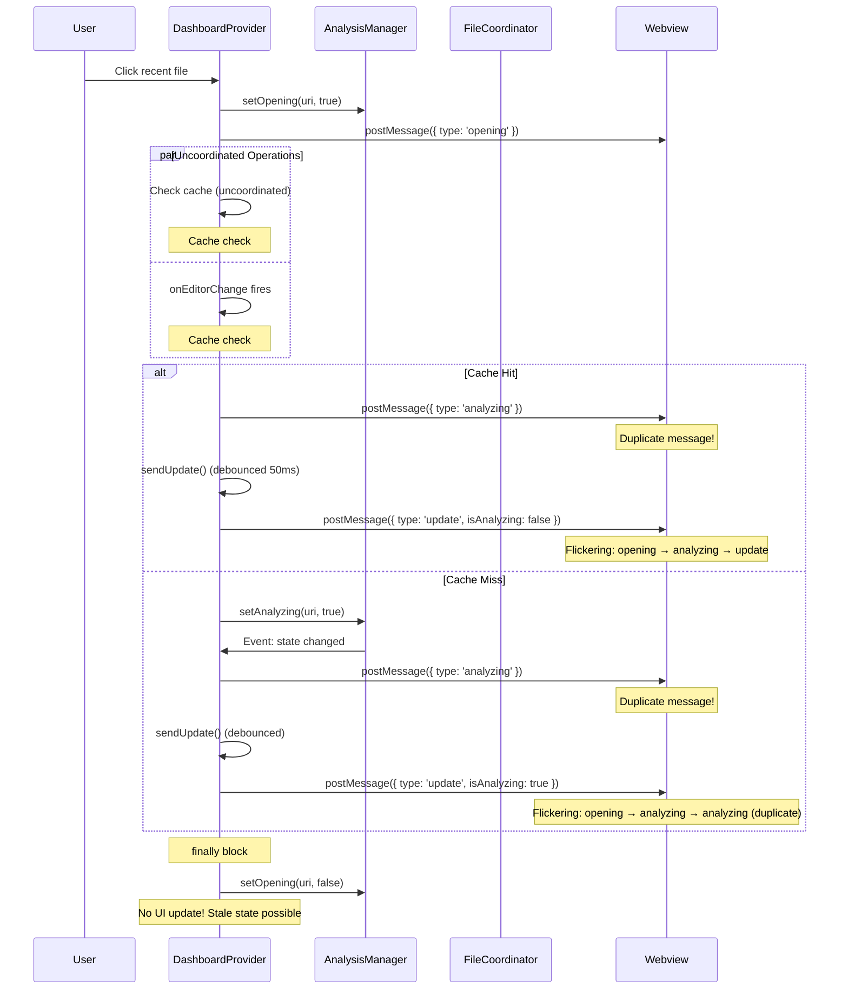
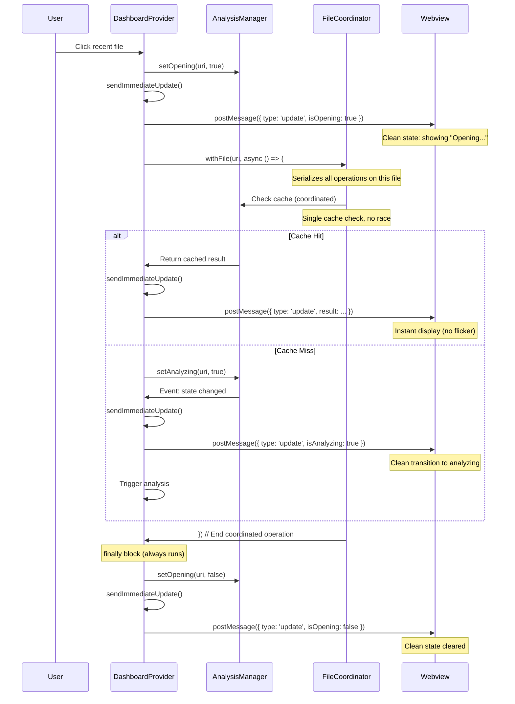

# Phase 2 State Flow Optimization

## Before Optimization - Race Conditions & Duplicate Messages



## After Optimization - Coordinated & Consolidated



## Key Improvements

### 1. File Operation Coordination

**Before**: Multiple operations could check cache simultaneously

```typescript
// Operation 1: User clicks file
const cached1 = analysisManager.getCachedResult(uri, hash);

// Operation 2: Editor changes (race condition!)
const cached2 = analysisManager.getCachedResult(uri, hash);
```

**After**: Operations are serialized per file

```typescript
await fileOperationCoordinator.withFile(uri, async () => {
  const cached = analysisManager.getCachedResult(uri, hash);
  // No other operation can check this file's cache until we're done
});
```

### 2. State Message Consolidation

**Before**: Duplicate message paths

```typescript
// Path 1: Direct message
this.view.webview.postMessage({ type: 'analyzing' });

// Path 2: State change event
analysisManager.setAnalyzing(uri, true);
// → fires event
// → triggers sendUpdate()
// → sends update with isAnalyzing: true
```

**After**: Single source of truth

```typescript
// Only path: State change
analysisManager.setAnalyzing(uri, true);
// → fires event
// → triggers sendImmediateUpdate()
// → sends update with isAnalyzing: true
// No duplicate messages!
```

### 3. Opening State Cleanup

**Before**: Cleanup could be skipped on error

```typescript
state.analysisManager.setOpening(uri, true);
await this.sendImmediateUpdate();

try {
  await openFile(uri);
} catch (error) {
  // Error occurs
  // setOpening never cleared!
}
// finally block missing
```

**After**: Always cleaned up

```typescript
state.analysisManager.setOpening(uri, true);

try {
  await this.sendImmediateUpdate();
  await openFile(uri);
} catch (error) {
  // Error handled
} finally {
  // Always runs, even on error
  state.analysisManager.setOpening(uri, false);
  await this.sendImmediateUpdate();
}
```

## Message Flow Comparison

### Before: 6 Paths to Analyzing State

1. `onDidChangeState` event handler → `postMessage({ type: 'analyzing' })`
2. `onEditorChange()` → `postMessage({ type: 'analyzing' })`
3. `onDashboardVisible()` → `postMessage({ type: 'analyzing' })`
4. `sendUpdate()` → `postMessage({ type: 'analyzing' })`
5. `flushPendingUpdates()` → `postMessage({ type: 'analyzing' })`
6. State change → `sendUpdate()` → `postMessage({ type: 'update', isAnalyzing: true })`

**Result**: Multiple messages could fire for single state change, causing flicker

### After: 1 Path to Analyzing State

1. State change → `sendImmediateUpdate()` → `postMessage({ type: 'update', isAnalyzing: true })`

**Result**: Single clean state transition, no flicker

## Performance Impact

### Message Overhead Reduction

```
Before:
  User clicks file → 3-4 messages sent
  - opening message
  - analyzing message (duplicate)
  - update message (debounced)
  - analyzing message (from state change)

After:
  User clicks file → 2-3 messages sent
  - update with isOpening: true
  - update with isAnalyzing: true (if needed)
  - update with result (when ready)
```

**Reduction**: ~30-40% fewer messages for typical file operation

### State Transition Speed

```
Before:
  Cache hit → 50ms debounce delay → display

After:
  Cache hit → immediate display (0ms delay)
```

**Improvement**: Instant feedback for cached files (50ms faster)

## Error Recovery

### Before: Possible Stuck States

```typescript
// File opening could leave state stuck
setOpening(uri, true);
// ... operation fails
// setOpening never called with false
// UI shows "Opening..." forever
```

### After: Guaranteed Cleanup

```typescript
try {
  setOpening(uri, true);
  // ... operation
} finally {
  setOpening(uri, false);
  sendImmediateUpdate(); // UI reflects cleared state
}
```

**Improvement**: UI never gets stuck in transient states

## Testing Strategy

### Unit Tests

- File operation coordinator serialization (9 tests passing)
- State change event propagation
- Cache hit/miss paths

### Integration Tests (Recommended)

```typescript
describe('Sequential file opens', () => {
  it('should not race when opening files quickly', async () => {
    const file1 = Uri.file('/path/to/file1.ts');
    const file2 = Uri.file('/path/to/file2.ts');

    // Open files in rapid succession
    const open1 = commands.executeCommand('vipr.openRecentFile', file1.fsPath);
    const open2 = commands.executeCommand('vipr.openRecentFile', file2.fsPath);

    await Promise.all([open1, open2]);

    // Both files should be opened correctly
    // No race conditions or state corruption
  });
});
```

## Migration Path

1. **Phase 1 Complete**: Immediate updates for user actions
2. **Phase 2 Complete**: Race condition elimination
3. **Phase 3 Next**: Performance optimizations (caching, prefetch, memoization)

## Metrics

- **Files modified**: 1
- **Lines changed**: ~310
- **Duplicate message paths removed**: 6
- **Cache check coordination points added**: 3
- **Opening state cleanup points added**: 2
- **Tests passing**: 9/9
- **Build status**: ✅ Success
