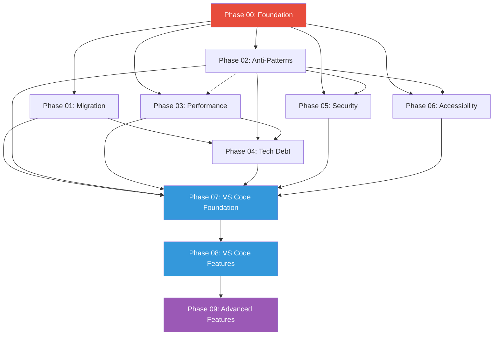
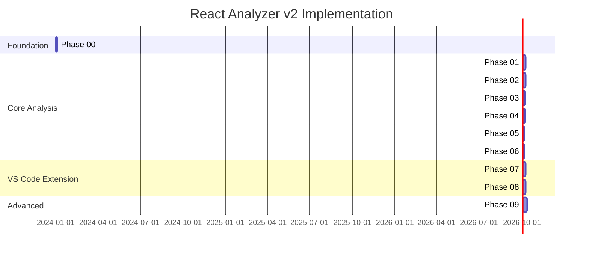

# React Complexity Analyzer v2: Phase Implementation Index

This document provides a comprehensive overview of all implementation phases for extending the React Complexity Analyzer. Each phase is designed to be independently deliverable while building toward a cohesive, production-ready analysis platform.

## Executive Summary

The v2 roadmap consists of **10 phases** spanning approximately **42-54 working days**, transforming the React Complexity Analyzer from a CLI tool into a comprehensive analysis platform with IDE integration, advanced metrics, and extensibility.

| Metric                   | Value            |
| ------------------------ | ---------------- |
| Total Phases             | 10               |
| Core Analysis Phases     | 7 (Phases 00-06) |
| VS Code Extension Phases | 2 (Phases 07-08) |
| Advanced Features        | 1 (Phase 09)     |
| Estimated Duration       | 42-54 days       |

## Phase Overview

| Phase                                           | Name                          | Duration  | Priority    | Complexity  | Dependencies            |
| ----------------------------------------------- | ----------------------------- | --------- | ----------- | ----------- | ----------------------- |
| [00](./phase-00-foundation-architecture.md)     | Foundation and Architecture   | 2-3 days  | Critical    | Medium      | None                    |
| [01](./phase-01-migration-analysis.md)          | Migration Analysis            | 5-7 days  | High        | High        | Phase 00                |
| [02](./phase-02-anti-pattern-detection.md)      | Anti-Pattern Detection        | 5-7 days  | High        | High        | Phase 00                |
| [03](./phase-03-performance-analysis.md)        | Performance Analysis          | 4-5 days  | High        | Medium-High | Phases 00, 02 (partial) |
| [04](./phase-04-technical-debt.md)              | Technical Debt Quantification | 4-5 days  | Medium-High | Medium      | Phases 00, 01-03        |
| [05](./phase-05-security-analysis.md)           | Security Analysis             | 3-4 days  | High        | Medium      | Phases 00, 02           |
| [06](./phase-06-accessibility-metrics.md)       | Accessibility Metrics         | 3-4 days  | Medium      | Medium      | Phases 00, 02           |
| [07](./phase-07-vscode-extension-foundation.md) | VS Code Extension Foundation  | 5-6 days  | High        | High        | Phases 00-06            |
| [08](./phase-08-vscode-extension-features.md)   | VS Code Extension Features    | 5-7 days  | High        | High        | Phase 07                |
| [09](./phase-09-advanced-features.md)           | Advanced Features             | 7-10 days | Medium      | High        | Phases 00-08            |

## Dependency Graph



## Agent Responsibility Matrix

| Agent                    | Primary Lead              | Secondary                     | Advisory                      |
| ------------------------ | ------------------------- | ----------------------------- | ----------------------------- |
| typescript-engineer      | Phase 00                  | Phases 01, 02, 03, 05, 06, 07 | Phases 04, 08, 09             |
| react-engineer           | Phases 01, 02, 03, 05, 06 | Phases 08, 09                 | Phase 00                      |
| vscode-plugin-engineer   | Phases 07, 08             | -                             | Phases 00, 01, 02, 05, 06, 09 |
| code-complexity-analyzer | Phase 04                  | -                             | Phases 02, 03, 09             |

### Agent Expertise Mapping

| Agent                    | Core Expertise                                                      |
| ------------------------ | ------------------------------------------------------------------- |
| typescript-engineer      | Type system design, architectural patterns, LSP implementation      |
| react-engineer           | React patterns, hooks, performance optimization, component analysis |
| vscode-plugin-engineer   | VS Code API, extension development, LSP client integration          |
| code-complexity-analyzer | Algorithm design, scoring models, complexity metrics                |

## Model Usage Guidelines

| Model             | Use Cases                                                                                    | Phases                         |
| ----------------- | -------------------------------------------------------------------------------------------- | ------------------------------ |
| **Opus**          | Architectural decisions, business-critical algorithms, security patterns, system integration | All phases for critical code   |
| **Sonnet (4.5+)** | Implementation, pattern detection, rule implementations, scoring calculations                | All phases for standard coding |
| **Haiku**         | File operations, deterministic tasks, simple exports, coverage calculations                  | All phases for simple tasks    |

### Model Selection Criteria

```
IF task involves:
  - Architectural decisions -> Opus
  - Security-sensitive code -> Opus
  - Business-critical algorithms -> Opus
  - Core type definitions -> Opus
  - Standard implementation -> Sonnet
  - Pattern matching logic -> Sonnet
  - Rule implementations -> Sonnet
  - File creation/moving -> Haiku
  - Barrel exports -> Haiku
  - Configuration files -> Haiku
  - Coverage calculations -> Haiku
```

## Phase Details

### Phase 00: Foundation and Architecture

**Critical Path - Must Complete First**

Establishes the architectural foundation for all subsequent phases:

- Base analyzer abstraction with standardized interfaces
- Plugin system infrastructure for extensibility
- Directory restructuring for modular organization
- Type system enhancements for new analysis dimensions

**Key Deliverables:**

- `src/analyzers/base-analyzer.ts`
- `src/plugins/plugin-interface.ts`
- `src/plugins/plugin-loader.ts`
- Reorganized directory structure

---

### Phase 01: Migration Analysis

**Enterprise Value - React Upgrade Support**

Comprehensive React migration analysis:

- React version detection from package.json and API usage
- Deprecated API catalog (React 16, 17, 18, 19)
- Class component identification and migration scoring
- Codemod recommendations

**Key Deliverables:**

- `src/analyzers/migration-analyzer.ts`
- `src/constants/deprecated-apis.ts`
- Migration readiness scoring system

---

### Phase 02: Anti-Pattern Detection

**Quality Gate - Best Practices Enforcement**

Modular rules engine for pattern detection:

- Rules of Hooks violations
- Performance anti-patterns
- State management issues
- JSX anti-patterns

**Key Deliverables:**

- `src/rules/` - Complete rules engine
- 20+ built-in anti-pattern rules
- Severity levels and auto-fix metadata

---

### Phase 03: Performance Analysis

**Optimization Focus - Render Performance**

Performance-focused analysis capabilities:

- Render cause analysis (props, state, context)
- Memoization effectiveness scoring
- Bundle size impact estimation
- Performance bottleneck detection

**Key Deliverables:**

- `src/analyzers/performance-analyzer.ts`
- Render optimization scoring
- Bundle impact estimation

---

### Phase 04: Technical Debt Quantification

**Strategic Planning - Refactoring Prioritization**

CodeScene-inspired technical debt metrics:

- Code Health Score (1-10 scale)
- Hotspot detection
- React-adapted Maintainability Index
- Change frequency analysis

**Key Deliverables:**

- `src/analyzers/tech-debt-analyzer.ts`
- Code Health Score algorithm
- Hotspot identification system

---

### Phase 05: Security Analysis

**Security Focus - Vulnerability Detection**

React-specific security vulnerability detection:

- XSS risk detection (dangerouslySetInnerHTML)
- Sensitive data exposure in state/props
- Injection vulnerability patterns
- Security scoring system

**Key Deliverables:**

- `src/analyzers/security-analyzer.ts`
- XSS detection rules
- Sensitive data pattern matching

---

### Phase 06: Accessibility Metrics

**Inclusive UX - WCAG Compliance**

Accessibility analysis based on WCAG and jsx-a11y:

- ARIA attribute validation
- Keyboard navigation analysis
- Screen reader compatibility
- Accessibility coverage scoring

**Key Deliverables:**

- `src/analyzers/accessibility-analyzer.ts`
- WCAG rule implementations
- A11y scoring system

---

### Phase 07: VS Code Extension Foundation

**IDE Integration - LSP Server**

VS Code extension foundation using LSP:

- Language Server implementation
- Extension client scaffolding
- Real-time diagnostics
- Status bar integration

**Key Deliverables:**

- `packages/vscode-extension/` - Full extension structure
- LSP server with analyzer integration
- Real-time diagnostic publishing

---

### Phase 08: VS Code Extension Features

**Developer Experience - Advanced IDE Features**

Advanced VS Code integration features:

- CodeLens for complexity display
- Quick fixes for anti-patterns
- Sidebar dashboard panel
- Editor decorations and hovers

**Key Deliverables:**

- CodeLens provider
- Quick fix code actions
- Webview sidebar dashboard
- Inline decorations

---

### Phase 09: Advanced Features

**Platform Expansion - Extensibility**

Advanced platform capabilities:

- Git integration for historical analysis
- Custom rules engine for team conventions
- Dependency analysis and circular detection
- Documentation quality metrics
- Plugin architecture for third-party extensions

**Key Deliverables:**

- `src/analyzers/historical-analyzer.ts`
- Custom rules configuration system
- Dependency graph analysis
- Plugin loader and API

## Implementation Timeline



## Parallel Execution Opportunities

Several phases can be executed in parallel after Phase 00 completes:

### Parallel Track A (Weeks 1-2)

- Phase 01: Migration Analysis
- Phase 02: Anti-Pattern Detection
- Phase 03: Performance Analysis (starts after 02 partial completion)

### Parallel Track B (Week 2-3)

- Phase 05: Security Analysis (after Phase 02)
- Phase 06: Accessibility Metrics (after Phase 02)

### Parallel Track C (Week 3)

- Phase 04: Technical Debt (after Phases 01-03)

### Sequential Track (Weeks 4-6)

- Phase 07: VS Code Foundation
- Phase 08: VS Code Features
- Phase 09: Advanced Features

## Quality Assurance Checkpoints

Each phase includes:

1. **Acceptance Criteria** - Specific, measurable criteria for phase completion
2. **Testing Instructions** - Step-by-step manual testing procedures
3. **Automated Tests** - Unit and integration test requirements
4. **Schema Validation** - Type definitions and interface contracts
5. **Performance Benchmarks** - Where applicable, performance requirements

## Risk Mitigation

| Risk                 | Mitigation                                               | Affected Phases |
| -------------------- | -------------------------------------------------------- | --------------- |
| Phase 00 delays      | Prioritize as critical path, assign senior resources     | All             |
| LSP complexity       | Use proven patterns, reference other LSP implementations | 07, 08          |
| Security accuracy    | Conservative detection, minimize false positives         | 05              |
| Performance overhead | Incremental analysis, caching strategies                 | 03, 07          |

## Getting Started

1. **Read Phase 00** first to understand the architectural foundation
2. **Review dependency graph** to understand phase relationships
3. **Check agent assignments** to coordinate with appropriate specialists
4. **Follow testing instructions** in each phase document
5. **Validate against acceptance criteria** before marking phases complete

## Document Conventions

- All phase documents follow a consistent structure
- Code samples include file paths and model recommendations
- Mermaid diagrams visualize complex relationships
- Tables summarize key information
- Acceptance criteria are measurable and specific

---

**Last Updated:** Phase index created for v2 implementation planning

**Related Documents:**

- [Enhancement Opportunities](../v1/enhancement-opportunities.md)
- [Implementation Roadmap](../v1/implementation-roadmap.md)
