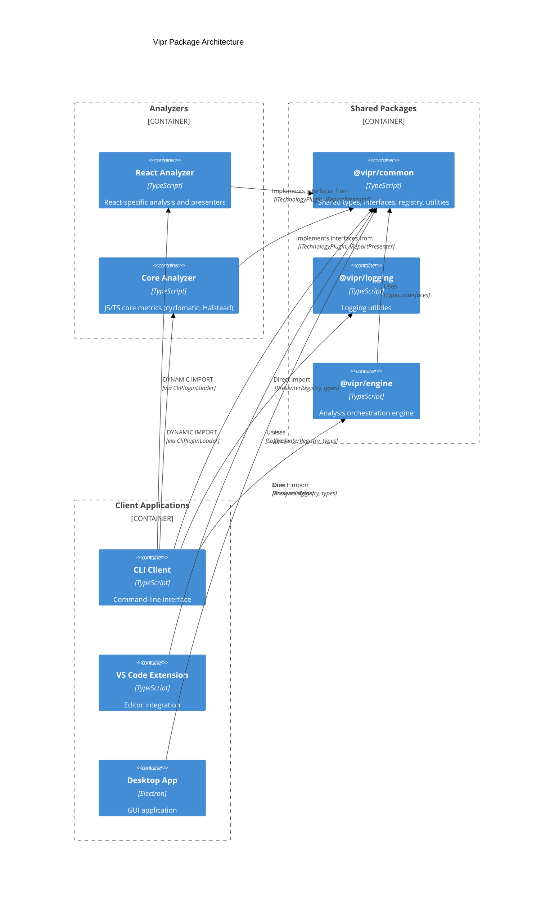
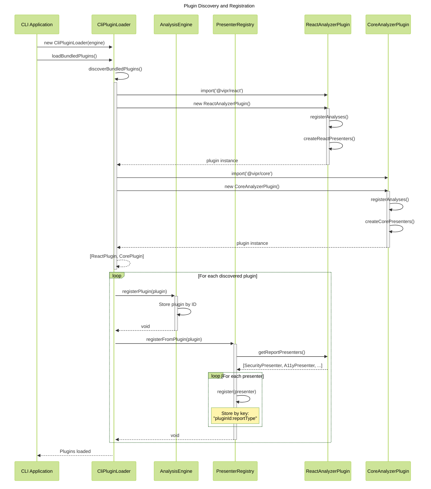
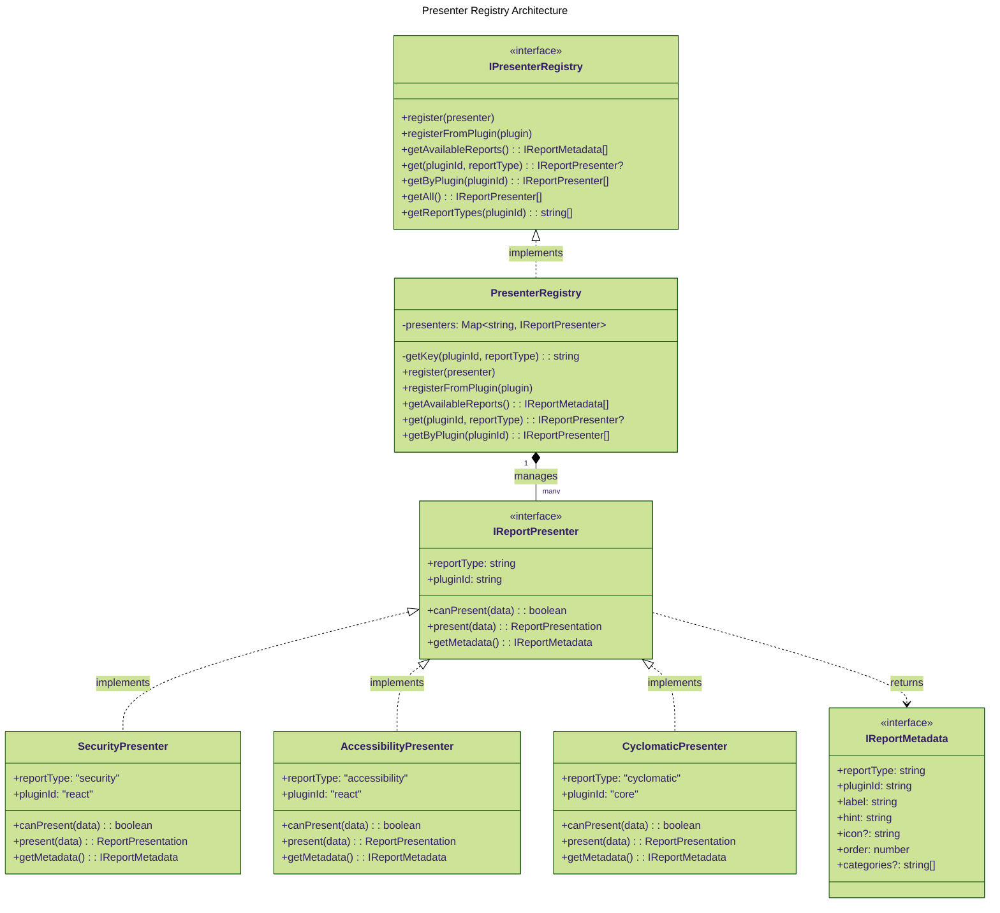
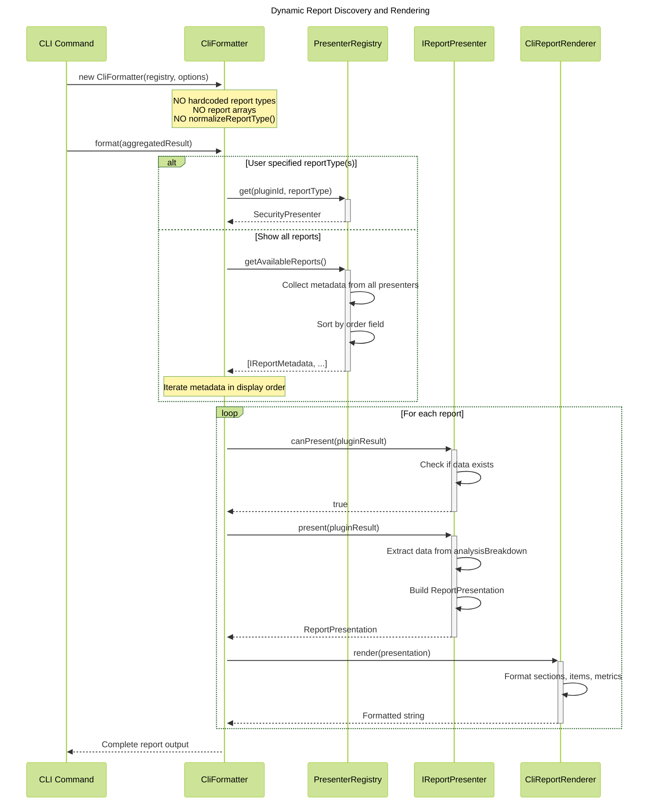
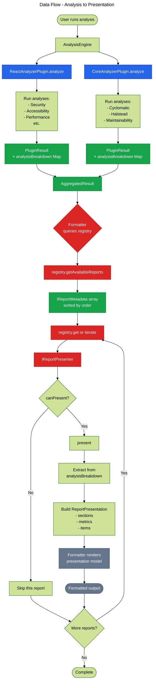
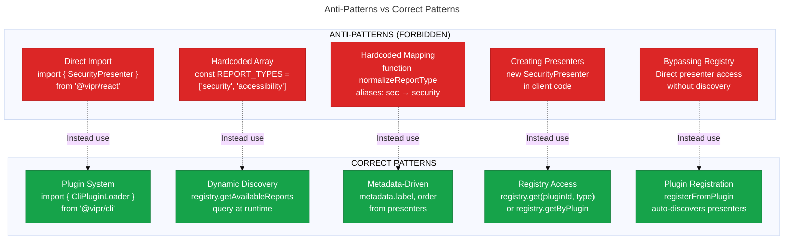

# Vipr Plugin Architecture

**Purpose**: Architecture documentation for the Vipr plugin system, presenter registry pattern, and dynamic discovery mechanism.

**Last Updated**: 2026-01-16

**Audience**: LLMs, developers, contributors working on Vipr architecture

## Overview

Vipr uses a plugin-based architecture to decouple analysis logic from presentation and client implementations. Plugins are discovered dynamically, and report presenters are registered at runtime, enabling extensibility without modifying client code.

## Diagrams

### 1. Package Structure and Boundaries



**Key Points**:

- Analyzers are isolated plugins (dynamically imported by CliPluginLoader)
- `@vipr/engine` is directly imported by clients for orchestration
- `@vipr/common` provides shared types, utilities, and registry
- Clients dynamically import analyzer plugins via CliPluginLoader (NOT compile-time imports)

### 2. Plugin Discovery and Registration Flow



**Key Mechanisms**:

- `CliPluginLoader.discoverBundledPlugins()` dynamically imports analyzer packages
- Each plugin constructor creates its presenters via factory function
- `registerFromPlugin()` extracts presenters via `getReportPresenters()`
- Registry stores presenters with composite key `{pluginId}:{reportType}`

### 3. Presenter Registry Pattern



**Registry Benefits**:

- **Dynamic Discovery**: Clients query registry for available reports instead of hardcoding
- **Decoupling**: Presenters defined in plugins, consumed through interface
- **Extensibility**: New plugins automatically register their presenters
- **Metadata-Driven**: UI elements (labels, icons, order) come from presenter metadata

### 4. Report Discovery and Rendering Flow



**Critical Design Decisions**:

- Formatters query `registry.getAvailableReports()` instead of maintaining hardcoded lists
- Report order determined by `IReportMetadata.order` field, not hardcoded arrays
- Presenters decide if they can present data via `canPresent()`
- No `normalizeReportType()` function or alias mapping needed

### 5. Data Flow from Analysis to Output



**Data Transformations**:

1. **Analysis**: Plugin runs analyses, stores results in `analysisBreakdown` Map
2. **Aggregation**: Engine combines plugin results into `AggregatedResult`
3. **Discovery**: Formatter queries registry for available reports
4. **Presentation**: Presenter extracts data and builds `ReportPresentation`
5. **Rendering**: Formatter renders presentation model to final format

### 6. Anti-Patterns and Correct Patterns



## How to Use

1. **View Online**: Copy diagram code to [Mermaid Live Editor](https://mermaid.live)
2. **VS Code**: Install Mermaid extension and preview this file
3. **GitHub**: Renders automatically in markdown files

## Customization

- **Change theme**: Modify `config: theme:` in frontmatter (`default`, `forest`, `dark`, `neutral`)
- **Adjust layout**: Switch to `elk` for complex diagrams in `config: layout: elk`
- **Colors**: Modify `classDef` statements for different color schemes

## Design Principles

### 1. Decoupling

Clients never import from analyzers directly. All communication flows through `@vipr/common` interfaces and the plugin system.

```typescript
// WRONG: Direct import
import { SecurityPresenter } from '@vipr/react';

// CORRECT: Plugin system
import { AnalysisEngine } from '@vipr/engine';

const engine = new AnalysisEngine();
const loader = new CliPluginLoader(engine);
await loader.loadBundledPlugins();
const registry = loader.getPresenterRegistry();
```

### 2. Dynamic Discovery

No hardcoded report types or presenter arrays. Formatters query the registry for available reports.

```typescript
// WRONG: Hardcoded array
const REPORT_TYPES = ['security', 'accessibility', 'performance'];

// CORRECT: Dynamic discovery
const availableReports = registry.getAvailableReports();
for (const metadata of availableReports) {
  const presenter = registry.get(metadata.pluginId, metadata.reportType);
  // ...
}
```

### 3. Registry Pattern

Central source of truth for available reports. Presenters register themselves, clients discover through queries.

```typescript
// Plugin exposes presenters
class ReactAnalyzerPlugin implements ITechnologyPlugin {
  getReportPresenters(): IReportPresenter[] {
    return createReactPresenters();
  }
}

// Loader registers them
registry.registerFromPlugin(plugin);

// Clients discover them
const presenter = registry.get('react', 'security');
```

### 4. Metadata-Driven

UI elements (labels, icons, display order) come from presenter metadata, not client code.

```typescript
class SecurityPresenter implements IReportPresenter {
  getMetadata(): IReportMetadata {
    return {
      reportType: 'security',
      pluginId: 'react',
      label: 'Security',
      hint: 'Security vulnerabilities and risks',
      icon: '🔒',
      order: 20,
      categories: ['security', 'reliability'],
    };
  }
}
```

## Related Documentation

- `/packages/common/src/types/presentation/presenter.ts` - Presenter interfaces
- `/packages/common/src/presenters/presenter-registry.ts` - Registry implementation
- `/clients/cli/src/plugins/loader.ts` - Plugin discovery and loading
- `/clients/cli/src/formatters/cli-formatter.ts` - Dynamic report rendering

## Notes

This architecture enables:

- New analyzers to be added without modifying client code
- Plugins to define their own report types and presentation logic
- Clients to dynamically discover available reports at runtime
- Consistent presentation model across different clients (CLI, VS Code, Desktop)
