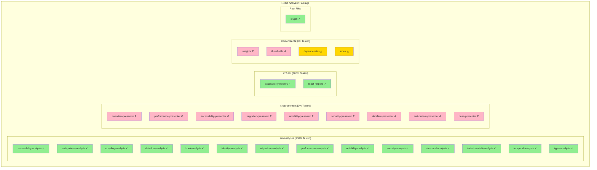
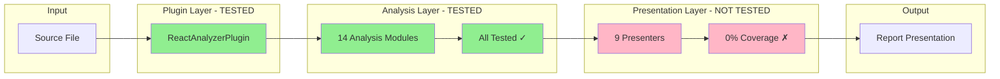
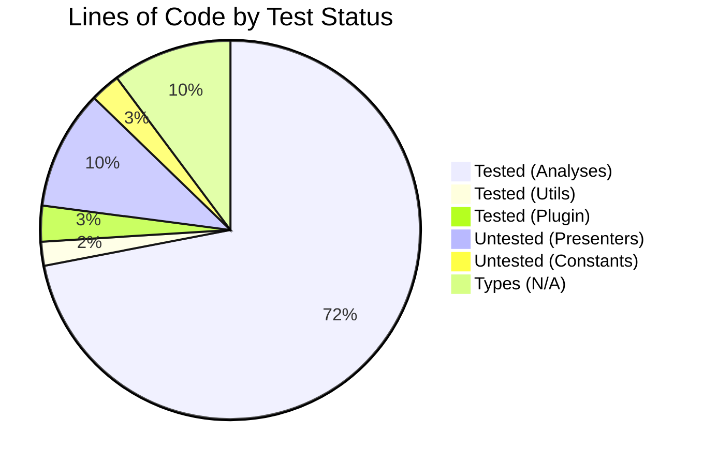
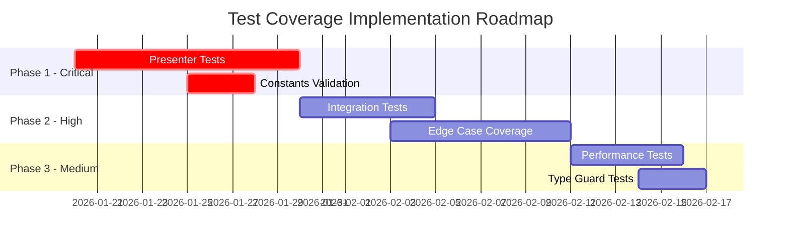
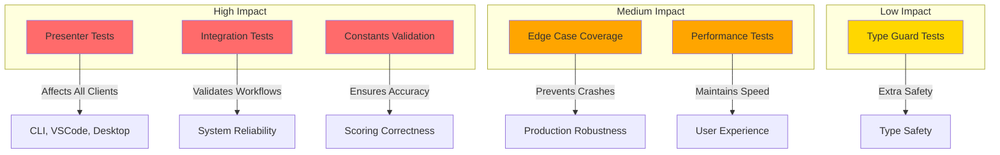
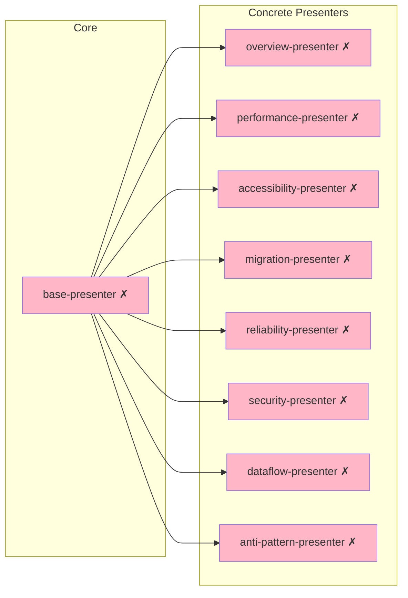
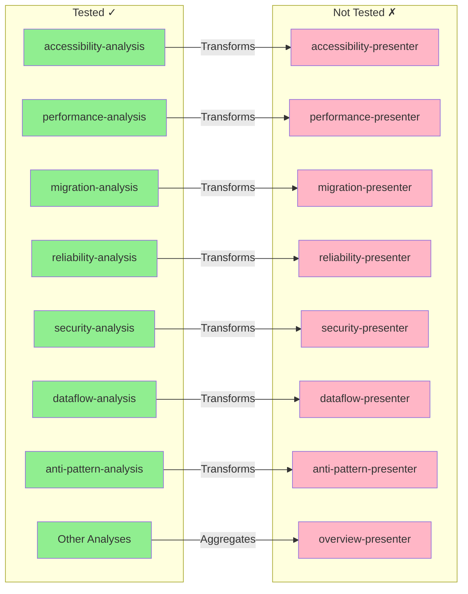
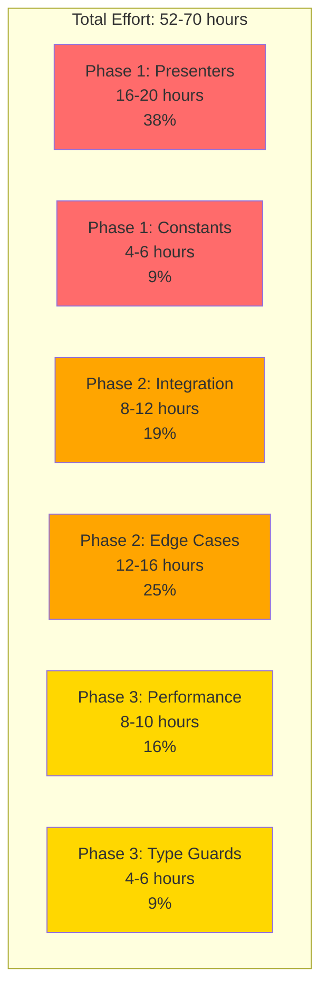
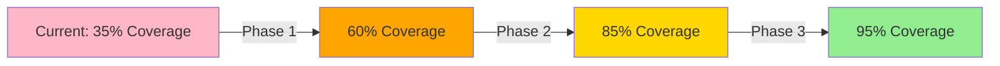

# Test Coverage Visual Reference

Visual representation of test coverage status for the React analyzer package.

## Coverage Heatmap



**Legend:**

- Green (✓): Tested
- Red (✗): Not Tested
- Yellow (△): Low Priority / Optional

## Architecture Flow



## Test Coverage Matrix

| Module Type | Total Files | Tested | Untested | Coverage % | Priority |
| ----------- | ----------- | ------ | -------- | ---------- | -------- |
| Analyses    | 14          | 14     | 0        | 100%       | Maintain |
| Presenters  | 9           | 0      | 9        | 0%         | Critical |
| Utilities   | 2           | 2      | 0        | 100%       | Maintain |
| Constants   | 4           | 0      | 2        | 0%         | High     |
| Plugin Core | 1           | 1      | 0        | 100%       | Maintain |
| Types       | 19          | 0      | 19       | N/A        | Low      |
| **Total**   | **49**      | **17** | **30**   | **35%**    | -        |

## Lines of Code Distribution



## Priority-Based Roadmap



## Test Impact Analysis



## Presenter Dependencies



**Note:** All presenters depend on `base-presenter`, so testing it first establishes patterns for all others.

## Analysis-to-Presenter Mapping



## Test Effort Distribution



## Coverage Progress Tracker

**Current State:** Week 0

```
Analyses:     ████████████████████ 100%
Utilities:    ████████████████████ 100%
Plugin:       ████████████████████ 100%
Presenters:   ░░░░░░░░░░░░░░░░░░░░   0%
Constants:    ░░░░░░░░░░░░░░░░░░░░   0%
Integration:  ████░░░░░░░░░░░░░░░░  20%
─────────────────────────────────────
Overall:      ███████░░░░░░░░░░░░░  35%
```

**Target State:** Week 6

```
Analyses:     ████████████████████ 100%
Utilities:    ████████████████████ 100%
Plugin:       ████████████████████ 100%
Presenters:   ███████████████████░  95%
Constants:    ████████████████░░░░  80%
Integration:  ████████████████████ 100%
─────────────────────────────────────
Overall:      ███████████████████░  95%
```

## Risk Assessment Matrix

| Gap                          | Impact | Likelihood | Risk Level | Priority |
| ---------------------------- | ------ | ---------- | ---------- | -------- |
| Presenter bugs in production | High   | Medium     | High       | Critical |
| Incorrect scoring weights    | High   | Low        | Medium     | High     |
| Integration failures         | High   | Low        | Medium     | High     |
| Edge case crashes            | Medium | Medium     | Medium     | Medium   |
| Performance regression       | Low    | Low        | Low        | Low      |

## Quick Reference: What to Test First

### Week 1-2: Critical Path

1. `base-presenter.test.ts` - Foundation for all presenters
2. `overview-presenter.test.ts` - Most complex, highest usage
3. `performance-presenter.test.ts` - High user visibility
4. `weights.test.ts` - Scoring accuracy
5. `thresholds.test.ts` - Scoring accuracy

### Week 3-4: High Impact

6. `accessibility-presenter.test.ts`
7. `migration-presenter.test.ts`
8. `reliability-presenter.test.ts`
9. `security-presenter.test.ts`
10. Expand `react.integration.ts`

### Week 5-6: Polish

11. `dataflow-presenter.test.ts`
12. `anti-pattern-presenter.test.ts`
13. Enhance `react.benchmark.ts`
14. Edge case coverage in analyses

## Success Visualization



## Key Metrics Dashboard

| Metric                | Current | Target     | Status       |
| --------------------- | ------- | ---------- | ------------ |
| Test Files            | 17      | 28         | 61%          |
| Presenter Coverage    | 0%      | 95%        | Needs Work   |
| Constants Coverage    | 0%      | 80%        | Needs Work   |
| Integration Scenarios | 3       | 15+        | Needs Work   |
| Total Coverage        | 35%     | 95%        | In Progress  |
| Test Suite Speed      | Unknown | `&lt;30`s` | To Establish |

---

**Legend:**

- ✓ = Tested
- ✗ = Not Tested
- △ = Low Priority
- Green = Good
- Yellow = Caution
- Red = Action Required
