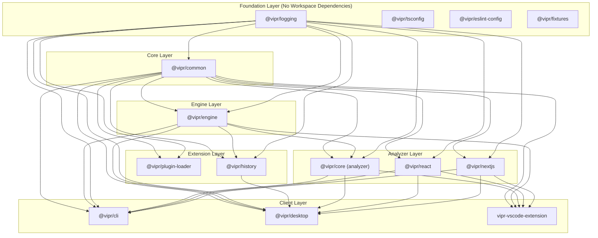

# Turborepo Configuration and Dependency Management

This document describes the Turborepo build pipeline configuration, dependency chains, and best practices for the Vipr monorepo.

## Overview

Turborepo orchestrates builds across the monorepo by understanding package dependencies and running tasks in the correct order. The configuration in `turbo.json` defines task pipelines with proper dependency chains to ensure consistent, efficient builds.

## Dependency Graph

The workspace packages are organized in layers based on their dependencies:



## Build Order

Turborepo builds packages in topological order based on workspace dependencies:

1. **Foundation Layer**: `@vipr/logging`, `@vipr/tsconfig`, `@vipr/eslint-config`, `@vipr/fixtures` (parallel)
2. **Core Layer**: `@vipr/common` (depends on nothing)
3. **Engine Layer**: `@vipr/engine` (depends on common, logging)
4. **Extension Layer**: `@vipr/plugin-loader`, `@vipr/history` (parallel, depends on core/engine)
5. **Analyzer Layer**: `@vipr/core`, `@vipr/react`, `@vipr/nextjs` (parallel, depends on core/engine)
6. **Client Layer**: `@vipr/cli`, `@vipr/desktop`, `vipr-vscode-extension` (parallel, depends on analyzers)

## Task Pipelines

### build

The primary build task that compiles TypeScript to JavaScript.

```json
{
  "build": {
    "dependsOn": ["^build"],
    "inputs": ["$TURBO_DEFAULT$", ".env*"],
    "outputs": ["dist/**", ".tsbuildinfo"]
  }
}
```

**Configuration Breakdown**:

- `"dependsOn": ["^build"]`: The `^` prefix means "build all workspace dependencies first"
- `"inputs"`: Files that affect the build (source files, config, env vars)
- `"outputs"`: Files generated by the build (cached for faster rebuilds)

**Package-Specific Overrides**:

```json
{
  "@vipr/desktop#build": {
    "dependsOn": ["^build"],
    "outputs": [".vite/**", "out/**"]
  },
  "@vipr/fixtures#build": {
    "dependsOn": [],
    "outputs": []
  },
  "vipr-vscode-extension#build": {
    "dependsOn": ["^build", "vipr-vscode-extension#build:docs"]
  }
}
```

### dev

Development mode with watch mode and rebuilds.

```json
{
  "dev": {
    "dependsOn": ["^build"],
    "cache": false,
    "persistent": true
  }
}
```

**Key Points**:

- `"dependsOn": ["^build"]`: All dependencies must be built before dev mode starts
- `"cache": false"`: Never cache dev mode (it's a long-running process)
- `"persistent": true"`: Task runs indefinitely (like a dev server)

**Why `^build` instead of `^dev`?**

Dev mode depends on workspace dependencies being built (not in dev mode). This prevents a cascade of watchers. For example:

- `@vipr/desktop` dev mode needs `@vipr/common` built (not watching)
- Multiple watchers would cause rebuild loops and consume excessive resources

### test

Run unit and integration tests.

```json
{
  "test": {
    "dependsOn": ["^build"],
    "inputs": ["$TURBO_DEFAULT$", "**/*.test.{ts,tsx,js,jsx}"],
    "outputs": ["coverage/**"]
  }
}
```

**Configuration**:

- Tests require dependencies to be built first
- Inputs include test files to trigger re-runs on test changes
- Coverage reports are cached

**Usage**:

```bash
# Run all tests
pnpm test

# Run tests for specific layers
pnpm test:packages    # Test packages/* only
pnpm test:analyzers   # Test analyzers/* only
pnpm test:clients     # Test clients/* only
```

### lint and typecheck

Static analysis tasks.

```json
{
  "lint": {
    "dependsOn": ["^build"],
    "inputs": ["$TURBO_DEFAULT$", "eslint.config.js", ".eslintrc.*"],
    "outputs": []
  },
  "typecheck": {
    "dependsOn": ["^build"],
    "inputs": ["$TURBO_DEFAULT$", "tsconfig*.json"],
    "outputs": []
  }
}
```

**Why depend on `^build`?**

- TypeScript type checking needs built `.d.ts` files from dependencies
- ESLint rules may reference types from dependencies
- Ensures type-safe linting and checking

## Root Scripts

The root `package.json` provides convenient commands for common operations:

### Build Commands

```bash
# Build everything
pnpm build

# Build specific layers
pnpm build:packages   # Build packages/* only
pnpm build:analyzers  # Build analyzers/* only
pnpm build:clients    # Build clients/* only

# Build specific package
pnpm desktop:build    # Equivalent to: turbo build --filter=@vipr/desktop
```

### Development Commands

```bash
# Start all dev servers/watchers
pnpm dev

# Start specific package in dev mode
pnpm desktop:dev      # turbo dev --filter=@vipr/desktop
pnpm docs:dev         # turbo docs:dev --filter=@vipr/docs
```

### Test Commands

```bash
# Run all tests
pnpm test

# Run tests by layer
pnpm test:packages
pnpm test:analyzers
pnpm test:clients

# Watch mode
pnpm test:watch
```

### Quality Commands

```bash
# Type checking
pnpm typecheck

# Linting
pnpm lint

# Formatting
pnpm format              # Apply Prettier formatting
pnpm checks:formatting   # Check formatting without changes
```

## Best Practices

### 1. Use Filters for Targeted Builds

Filter by package name:

```bash
turbo build --filter=@vipr/desktop
```

Filter by path pattern:

```bash
turbo build --filter='./packages/*'
turbo build --filter='./analyzers/*'
```

Filter excluding packages:

```bash
turbo test --filter='!@vipr/docs'
```

### 2. Understanding `dependsOn` Syntax

**`^build`** (caret prefix):

- Runs `build` on all workspace dependencies first
- Example: When building `@vipr/cli`, runs build on `@vipr/common`, `@vipr/engine`, etc.

**`build`** (no prefix):

- Runs `build` in the current package first
- Example: `make` depends on `build` in the same package

**`package#task`**:

- Depends on a specific task in a specific package
- Example: `vipr-vscode-extension#build` depends on `vipr-vscode-extension#build:docs`

### 3. Cache Invalidation

Turborepo caches task outputs based on inputs. The cache is invalidated when:

- Source files change (matched by `inputs`)
- Global dependencies change (`package.json`, `turbo.json`, etc.)
- Environment variables change (listed in `globalEnv`)

To clear the cache:

```bash
turbo clean
```

### 4. Parallel Execution

Turborepo runs tasks in parallel when possible:

- Packages at the same dependency level build concurrently
- Maximum parallelism is determined by available CPU cores
- Use `--concurrency` to limit parallel tasks

```bash
turbo build --concurrency=4
```

### 5. Development Workflow

For efficient development:

1. **Initial Setup**: Build all dependencies once

   ```bash
   pnpm build
   ```

2. **Start Development**: Use dev mode for clients, dependencies stay built

   ```bash
   pnpm desktop:dev
   ```

3. **Rebuild Dependencies**: If you change a dependency, rebuild it
   ```bash
   pnpm build:packages    # Rebuild shared packages
   pnpm desktop:dev       # Restart dev server
   ```

### 6. CI/CD Optimization

In CI environments, leverage Turborepo's remote caching:

```bash
# Build with remote cache
turbo build --cache-dir=.turbo

# Run tests only for changed packages
turbo test --filter='[HEAD^1]'
```

## Troubleshooting

### Build Order Issues

**Problem**: Package builds fail because dependency types are missing.

**Solution**: Ensure `"dependsOn": ["^build"]` is set for the task. Run `pnpm build` to rebuild all dependencies.

### Cache Issues

**Problem**: Changes aren't reflected in builds.

**Solution**: Clear the Turborepo cache:

```bash
turbo clean
pnpm build
```

### Circular Dependencies

**Problem**: Build hangs or fails with circular dependency errors.

**Solution**: Circular dependencies between workspace packages are not allowed. Review `package.json` dependencies and refactor to remove cycles.

### Type Errors in IDE

**Problem**: IDE shows type errors but builds succeed.

**Solution**: Ensure dependencies are built and TypeScript composite references are correct:

```bash
pnpm build:packages
pnpm typecheck
```

## Performance Tips

1. **Use filters**: Build only what you need during development
2. **Leverage caching**: Don't run `clean` unless necessary
3. **Parallel execution**: Let Turborepo parallelize automatically
4. **Watch mode**: Use `dev` tasks instead of rebuilding repeatedly
5. **Remote caching**: Configure remote cache for team/CI speedups

## Advanced Configuration

### Task-Specific Inputs

Customize inputs to optimize cache hits:

```json
{
  "test": {
    "inputs": ["$TURBO_DEFAULT$", "**/*.test.{ts,tsx}", "vitest.config.ts"]
  }
}
```

### Task-Specific Outputs

Specify outputs for better caching:

```json
{
  "build-storybook": {
    "outputs": ["storybook-static/**"]
  }
}
```

### Environment Variables

Add environment variables that affect builds:

```json
{
  "globalEnv": ["NODE_ENV", "CI"]
}
```

## References

- [Turborepo Documentation](https://turbo.build/repo/docs)
- [Pipeline Configuration](https://turbo.build/repo/docs/core-concepts/monorepos/running-tasks)
- [Filtering Workspaces](https://turbo.build/repo/docs/core-concepts/monorepos/filtering)
- [Caching](https://turbo.build/repo/docs/core-concepts/caching)
