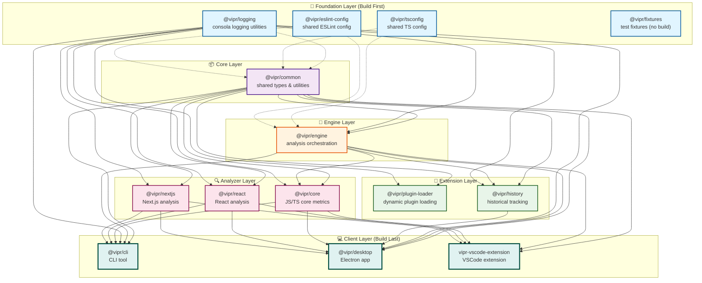

# Turborepo Dependency Graph

This document visualizes the complete dependency graph for the Vipr monorepo, showing how packages depend on each other and the build order Turborepo uses.

## Complete Dependency Graph



## Build Execution Order

Turborepo builds packages in topological order based on dependencies:

### Phase 1: Foundation (Parallel)

```
@vipr/logging       ⚡ No workspace dependencies
@vipr/tsconfig      ⚡ No workspace dependencies
@vipr/eslint-config ⚡ No workspace dependencies
@vipr/fixtures      ⚡ No build (test data)
@vipr/licensing     ⚡ No build (placeholder)
```

### Phase 2: Core

```
@vipr/common        📦 Depends on: [none]
```

### Phase 3: Engine

```
@vipr/engine        🔧 Depends on: common, logging
```

### Phase 4: Extensions (Parallel)

```
@vipr/plugin-loader 🔌 Depends on: common, logging
@vipr/history       📊 Depends on: common, engine, logging
```

### Phase 5: Analyzers (Parallel)

```
@vipr/core          🔍 Depends on: common, engine, logging
@vipr/react         ⚛️ Depends on: common, logging
@vipr/nextjs        ▲ Depends on: common, logging
```

### Phase 6: Clients (Parallel)

```
@vipr/cli           💻 Depends on: common, engine, logging, core, react, nextjs
@vipr/desktop       🖥️ Depends on: common, engine, logging, history, core, react, nextjs
vipr-vscode-ext     📝 Depends on: common, engine, core, react, nextjs
```

## Dependency Types

### Direct Dependencies (solid lines →)

These are workspace dependencies declared in `package.json`:

- Package directly imports and uses code from the dependency
- Example: `@vipr/engine` → `@vipr/common`

### Dev Dependencies (dashed lines -.→)

These are development-time dependencies:

- Configuration packages (tsconfig, eslint-config)
- Testing utilities (fixtures)
- Example: `@vipr/common` -.→ `@vipr/tsconfig`

## Critical Paths

Critical paths are the longest chains of dependencies that determine minimum build time:

### Path 1: Desktop Client (Longest)

```
@vipr/logging → @vipr/common → @vipr/engine → @vipr/history → @vipr/desktop
                                            → @vipr/core ──────┘
```

**Length**: 5 packages
**Time**: ~5 build units (if each package takes 1 unit)

### Path 2: CLI Client

```
@vipr/logging → @vipr/common → @vipr/engine → @vipr/core → @vipr/cli
```

**Length**: 5 packages
**Time**: ~5 build units

### Path 3: VSCode Extension

```
@vipr/logging → @vipr/common → @vipr/engine → @vipr/core → vipr-vscode-extension
```

**Length**: 5 packages
**Time**: ~5 build units

## Parallelization Opportunities

Turborepo can parallelize builds at each phase:

```
Phase 1: 3 packages in parallel (logging, tsconfig, eslint-config)
Phase 2: 1 package (common)
Phase 3: 1 package (engine)
Phase 4: 2 packages in parallel (plugin-loader, history)
Phase 5: 3 packages in parallel (core, react, nextjs)
Phase 6: 3 packages in parallel (cli, desktop, vscode-extension)
```

**Maximum Speedup**: With unlimited cores, build time is reduced from:

- Sequential: 13 packages × 1 unit = 13 units
- Parallel: 6 phases × 1 unit = 6 units
- Speedup: 2.17x

## Circular Dependency Prevention

The architecture is designed to prevent circular dependencies:

### Allowed Dependency Flow

```
Foundation → Core → Engine → Extensions → Analyzers → Clients
```

### Prohibited Patterns

- ❌ Clients → Analyzers (clients cannot provide analyzers)
- ❌ Analyzers → Engine (analyzers use engine, not vice versa)
- ❌ Engine → Common → Engine (circular)
- ❌ Any upward dependencies in the layer hierarchy

## Impact Analysis

When you change a package, these are the packages that need to be rebuilt:

### Change @vipr/common

**Affected packages** (all downstream):

- @vipr/engine
- @vipr/plugin-loader
- @vipr/history
- @vipr/core
- @vipr/react
- @vipr/nextjs
- @vipr/cli
- @vipr/desktop
- vipr-vscode-extension

**Command**: `turbo build --filter=...@vipr/common`

### Change @vipr/engine

**Affected packages**:

- @vipr/history
- @vipr/core
- @vipr/cli
- @vipr/desktop
- vipr-vscode-extension

**Command**: `turbo build --filter=...@vipr/engine`

### Change @vipr/react

**Affected packages**:

- @vipr/cli
- @vipr/desktop
- vipr-vscode-extension

**Command**: `turbo build --filter=...@vipr/react`

### Change @vipr/desktop

**Affected packages**: None (it's a leaf node)

**Command**: `turbo build --filter=@vipr/desktop`

## Workspace Configuration

The dependency graph is enforced by:

1. **pnpm workspace protocol**: `"@vipr/common": "workspace:*"`
2. **Turborepo task dependencies**: `"dependsOn": ["^build"]`
3. **TypeScript project references**: Ensures type checking follows dependencies

## Verification

To verify the dependency graph is correct:

```bash
# Show full dependency graph
pnpm list --depth=Infinity --workspace

# Show what would build for a specific package
turbo build --filter=@vipr/desktop --dry-run

# Visualize the graph (requires graphviz)
turbo build --graph | dot -Tpng > graph.png
```

## Best Practices

### 1. Keep Foundation Small

Foundation packages should have minimal dependencies:

- Only external npm packages
- No workspace dependencies
- Fast to build

### 2. Avoid Deep Chains

Limit the depth of dependency chains:

- Maximum depth: 5 levels (current architecture)
- Deep chains increase build time
- Consider flattening if depth > 5

### 3. Maximize Parallelization

Design packages to enable parallel builds:

- Packages at the same level should not depend on each other
- Example: All analyzers can build in parallel

### 4. Minimize Shared Dependencies

Reduce coupling between packages:

- Only depend on what you actually use
- Avoid "god packages" that everyone depends on
- Split large packages if they have distinct concerns

### 5. Use Filters Effectively

During development, build only what you need:

```bash
# Build a package and its dependencies
turbo build --filter=@vipr/desktop...

# Build a package and its dependents
turbo build --filter=...@vipr/common

# Build only changed packages
turbo build --filter='[HEAD^1]'
```

## Performance Metrics

### Build Time Estimates (Approximate)

**With cold cache** (all packages need building):

```
Sequential: ~60s (all packages one by one)
Parallel: ~25s (with 4 cores, 6 phases)
```

**With warm cache** (no changes):

```
All cached: ~1s (just cache checks)
```

**With changes to @vipr/common** (most impactful):

```
Rebuild common + 9 dependents: ~15s (parallel)
```

**With changes to @vipr/desktop** (leaf node):

```
Rebuild desktop only: ~3s
```

### Cache Hit Rates

Turborepo caching can dramatically improve build times:

- **100% hit rate**: ~1s total (everything cached)
- **50% hit rate**: ~12s (half from cache, half rebuilt)
- **0% hit rate**: ~25s (everything rebuilt)

## Conclusion

The dependency graph is optimized for:

- ✅ Logical separation of concerns
- ✅ Maximum build parallelization
- ✅ Minimal circular dependency risk
- ✅ Fast incremental builds
- ✅ Clear architectural boundaries

The configuration in `turbo.json` mirrors this graph to ensure efficient, correct builds.
