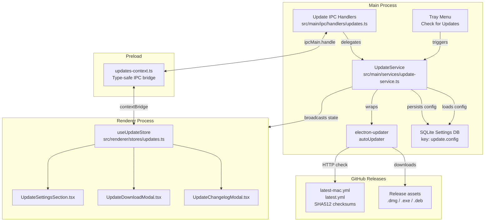
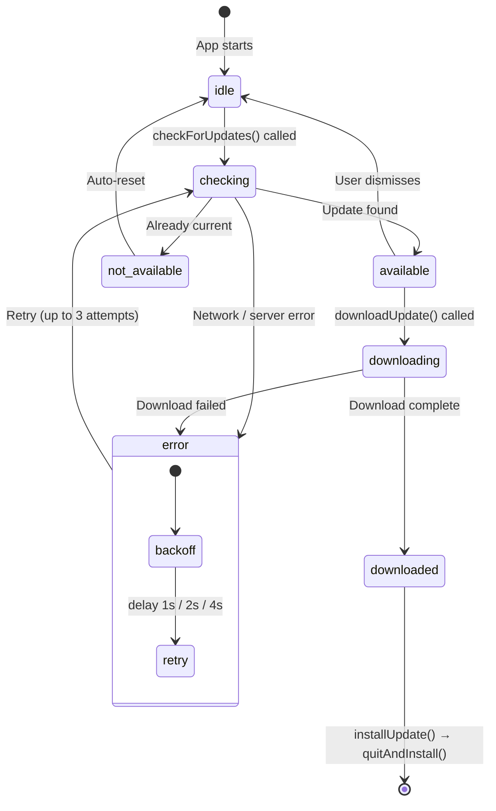
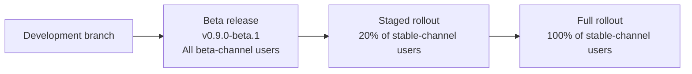

# Updates and Release Engineering

**Audience**: Developers and maintainers working on the Vipr desktop application.

**Scope**: Self-updating system architecture (Phase 22), update configuration, testing in mock mode, and the full release engineering pipeline including semver strategy, GitHub Actions, code signing, and distribution.

---

## Part 1: Self-Updating System

The Vipr desktop application ships with a built-in self-update mechanism powered by `electron-updater`. Updates are checked, downloaded, and installed without requiring the user to visit a download page.

### Architecture Overview

The update system is organized across four layers: a main-process service, IPC handlers, a preload bridge, and a renderer-side Zustand store.



### State Machine

`UpdateService` progresses through a well-defined set of statuses. The renderer reflects the current status in real time via broadcast events.



**Retry logic**: When `checkForUpdates()` encounters an error, it retries up to three times using exponential backoff — 1 second after the first failure, 2 seconds after the second, and 4 seconds after the third. All retries exhausted means the status settles at `error`.

### UpdateConfig Reference

Configuration is persisted to SQLite under the key `update.config` and loaded at construction time. Any field not found in the database falls back to the defaults below.

| Field                  | Type                                          | Default     | Description                                                     |
| ---------------------- | --------------------------------------------- | ----------- | --------------------------------------------------------------- |
| `autoCheck`            | `boolean`                                     | `true`      | Enable automatic update checks on the configured schedule       |
| `autoDownload`         | `boolean`                                     | `false`     | Automatically download when an update is found                  |
| `autoInstallOnAppQuit` | `boolean`                                     | `true`      | Install a downloaded update when the app quits (always enabled) |
| `checkFrequency`       | `'startup' \| 'daily' \| 'weekly' \| 'never'` | `'startup'` | How often to check automatically                                |
| `channel`              | `'stable' \| 'beta'`                          | `'stable'`  | Which release channel to track                                  |
| `notifyOnAvailable`    | `boolean`                                     | `true`      | Show OS notification when an update is available                |
| `notifyOnDownloaded`   | `boolean`                                     | `true`      | Show OS notification when an update finishes downloading        |

**Check frequency intervals**:

| Frequency | Behavior                                                             |
| --------- | -------------------------------------------------------------------- |
| `startup` | Checks 10 seconds after launch, then rechecks every 24 hours         |
| `daily`   | Checks every 24 hours                                                |
| `weekly`  | Checks every 7 days                                                  |
| `never`   | No automatic checks; manual-only via "Check Now" button or tray menu |

### IPC Channel Reference

The renderer communicates with the main process through the following IPC channels, all handled in `src/main/ipc/handlers/updates.ts`.

| Channel                     | Direction       | Description                            |
| --------------------------- | --------------- | -------------------------------------- |
| `updates:check`             | renderer → main | Trigger an immediate update check      |
| `updates:download`          | renderer → main | Start downloading the available update |
| `updates:install`           | renderer → main | Quit and install a downloaded update   |
| `updates:getState`          | renderer → main | Fetch current `UpdateState`            |
| `updates:getConfig`         | renderer → main | Fetch current `UpdateConfig`           |
| `updates:updateConfig`      | renderer → main | Persist a partial config update        |
| `updates:state-changed`     | main → renderer | Broadcast on every status transition   |
| `updates:download-progress` | main → renderer | Broadcast per-tick during download     |

Input validation on `updates:updateConfig` rejects unknown channel values (must be `stable` or `beta`), unknown frequency values (must be `startup`, `daily`, `weekly`, or `never`), and non-boolean values for boolean fields. Invalid payloads throw before reaching the service.

### Renderer Store

`useUpdateStore` (Zustand) is the single source of truth in the renderer. The store:

- Loads config and state on mount via `loadConfig()` and `loadState()`
- Applies optimistic updates for config changes; rolls back to server state on failure
- Subscribes to `updates:state-changed` and `updates:download-progress` via `subscribeToEvents()`
- Preserves in-flight download progress when a state broadcast arrives mid-download to prevent progress bar flicker

Call `subscribeToEvents()` in a top-level effect and invoke the returned cleanup function on unmount.

### UI Components

**`UpdateSettingsSection.tsx`** — Settings panel using the `SettingCard` pattern from Phase 12. Contains:

- Current version display (read-only)
- Auto-check toggle (`autoCheck`)
- Check frequency selector (`checkFrequency`)
- Auto-download toggle (`autoDownload`)
- Release channel selector (`channel`)
- Notify-on-available toggle (`notifyOnAvailable`)
- Notify-on-downloaded toggle (`notifyOnDownloaded`)
- "Check Now" button with inline status badge reflecting the current `UpdateStatus`
- Update available banner with download call-to-action

**`UpdateDownloadModal.tsx`** — Progress modal shown during and after download. Displays:

- Indeterminate spinner while download initiates
- Determinate progress bar with ARIA `role="progressbar"`, `aria-valuenow`, and `aria-valuemax`
- Download speed (`bytesPerSecond`) and size stats (`transferred` / `total`)
- "Install and Restart" button once `status === 'downloaded'`

**`UpdateChangelogModal.tsx`** — Renders release notes from the update manifest. Markdown is parsed and sanitized with `rehype-sanitize` to prevent XSS from untrusted release note content.

### Tray Integration

The system tray menu includes a "Check for Updates" item. When clicked it calls `updateService.checkForUpdates()` directly in the main process, bypassing the renderer. OS-level notifications are sent for:

- `update-available`: fires `notifyOnAvailable` listeners, triggering a notification if the config flag is enabled
- `update-downloaded`: fires `notifyOnDownloaded` listeners, prompting the user to restart

### Testing in Mock Mode

The mock data layer simulates the full update lifecycle including realistic progress ticks, so the UI can be exercised without a live GitHub Release or code-signed binary.

```bash
USE_MOCK_DATA=true pnpm --filter @vipr/desktop dev
```

With mock mode active:

1. Navigate to Settings and open the "Updates" section.
2. Click "Check Now". The status badge transitions `idle → checking → available` after a short simulated delay.
3. Click "Download Update". The `UpdateDownloadModal` opens and a progress bar advances through simulated ticks until `downloaded`.
4. Click "Install and Restart". The mock short-circuits `quitAndInstall()` so the app does not actually quit.

The mock does not require network access, code signing certificates, or a GitHub token.

---

## Part 2: Release Engineering

### Semver Strategy

Vipr desktop follows [Semantic Versioning 2.0.0](https://semver.org/). The version source of truth is `version` in `clients/desktop/package.json`.

```
MAJOR.MINOR.PATCH[-PRERELEASE]
```

| Segment     | When to increment                                                                                               | Examples        |
| ----------- | --------------------------------------------------------------------------------------------------------------- | --------------- |
| `MAJOR`     | Breaking changes: DB migrations requiring reinstall, removal of supported config keys, incompatible IPC changes | `0.x.x → 1.0.0` |
| `MINOR`     | New features, non-breaking enhancements to existing features                                                    | `0.8.0 → 0.9.0` |
| `PATCH`     | Bug fixes, security patches, dependency bumps with no behavior change                                           | `0.8.0 → 0.8.1` |
| Pre-release | Beta builds for testing before promotion to stable                                                              | `0.9.0-beta.1`  |

**Beta channel tags** follow the pattern `vX.Y.Z-beta.N` where `N` is an incrementing integer for successive betas on the same target version (e.g., `v0.9.0-beta.1`, `v0.9.0-beta.2`, `v0.9.0`).

### Git Workflow


| Branch                   | Purpose                                                                                           |
| ------------------------ | ------------------------------------------------------------------------------------------------- |
| `main`                   | Stable releases only. Every commit on `main` that carries a version tag is a releasable artifact. |
| `X.Y.Z` (e.g., `0.25.0`) | Active development branch. Named after the target version being built.                            |
| `beta`                   | Cut from the development branch when pre-release testing is needed.                               |

**Tagging convention**:

```bash
# Stable release
git tag v0.9.0
git push origin v0.9.0

# Beta release
git tag v0.9.0-beta.1
git push origin v0.9.0-beta.1
```

Tags drive the GitHub Actions release pipeline. A push to a tag matching `v*` starts the build matrix.

**Commit style**: Short imperative messages ("Add auto-update settings panel"). Conventional commits (`feat:`, `fix:`, `chore:`) are recommended — they enable automated changelog generation if tooling is added later.

### Build Artifacts

Electron Forge produces platform-specific installers. The maker configuration lives in `clients/desktop/forge.config.ts`.

| Platform | Architecture | Artifact                                             | Maker                                       |
| -------- | ------------ | ---------------------------------------------------- | ------------------------------------------- |
| macOS    | arm64, x64   | `.dmg`                                               | `MakerZIP` (produces universal or per-arch) |
| Windows  | x64          | `.exe` (Squirrel installer), `.nupkg` (delta update) | `MakerSquirrel`                             |
| Linux    | x64          | `.deb`                                               | `MakerDeb`                                  |
| Linux    | x64          | `.rpm`                                               | `MakerRpm`                                  |

The `asar: true` flag in `packagerConfig` packs all source files into an `.asar` archive. The `OnlyLoadAppFromAsar` Electron Fuse ensures the app only loads code from the verified archive, which is required for update signature validation.

### GitHub Actions CI/CD

The release pipeline is structured around two workflows: continuous integration on pull requests, and a release workflow triggered by version tags.

#### CI Workflow (`.github/workflows/ci.yml`)

Runs on every pull request targeting `main`:

```yaml
name: CI

on:
  pull_request:
    branches: [main]

jobs:
  checks:
    runs-on: ubuntu-latest
    steps:
      - uses: actions/checkout@v4
      - uses: pnpm/action-setup@v4
        with:
          version: 10
      - uses: actions/setup-node@v4
        with:
          node-version: '22.22.0'
          cache: 'pnpm'
      - run: pnpm install --frozen-lockfile
      - run: pnpm typecheck
      - run: pnpm lint
      - run: pnpm test
```

#### Release Workflow (`.github/workflows/release.yml`)

Triggered when a tag matching `v*` is pushed. Builds the full matrix of platform installers and publishes to GitHub Releases.

```yaml
name: Release

on:
  push:
    tags:
      - 'v*'

jobs:
  release:
    strategy:
      matrix:
        include:
          - os: macos-latest
            arch: arm64
          - os: macos-latest
            arch: x64
          - os: windows-latest
            arch: x64
          - os: ubuntu-latest
            arch: x64

    runs-on: ${{ matrix.os }}

    steps:
      - uses: actions/checkout@v4
      - uses: pnpm/action-setup@v4
        with:
          version: 10
      - uses: actions/setup-node@v4
        with:
          node-version: '22.22.0'
          cache: 'pnpm'
      - run: pnpm install --frozen-lockfile
      - run: pnpm build
        working-directory: clients/desktop

      - name: Package and publish
        working-directory: clients/desktop
        run: pnpm exec electron-forge publish
        env:
          GITHUB_TOKEN: ${{ secrets.GITHUB_TOKEN }}
          # macOS signing (see Code Signing section)
          APPLE_ID: ${{ secrets.APPLE_ID }}
          APPLE_ID_PASSWORD: ${{ secrets.APPLE_ID_PASSWORD }}
          APPLE_TEAM_ID: ${{ secrets.APPLE_TEAM_ID }}
          CSC_LINK: ${{ secrets.CSC_LINK }}
          CSC_KEY_PASSWORD: ${{ secrets.CSC_KEY_PASSWORD }}
          # Windows signing
          WIN_CSC_LINK: ${{ secrets.WIN_CSC_LINK }}
          WIN_CSC_KEY_PASSWORD: ${{ secrets.WIN_CSC_KEY_PASSWORD }}
```

The `@electron-forge/publisher-github` publisher (currently stubbed in `forge.config.ts`) creates or updates a GitHub Release for the tag and uploads all installer artifacts. `electron-updater` then reads the auto-generated manifest files from those release assets.

#### Update Manifests

`electron-updater` generates manifest files automatically during the publish step. These files are uploaded as release assets alongside the installers:

| File             | Platform | Contents                                          |
| ---------------- | -------- | ------------------------------------------------- |
| `latest-mac.yml` | macOS    | Version, release date, asset URL, SHA512 checksum |
| `latest.yml`     | Windows  | Version, release date, asset URL, SHA512 checksum |
| `latest.yml`     | Linux    | Version, release date, asset URL, SHA512 checksum |

When the running app checks for updates, `autoUpdater` fetches the appropriate manifest, compares the `version` field against `app.getVersion()`, and proceeds with the download if a newer version is found.

Example `latest-mac.yml` structure:

```yaml
version: 0.9.0
files:
  - url: Vipr-0.9.0-arm64.dmg
    sha512: <base64-encoded-sha512>
    size: 98765432
path: Vipr-0.9.0-arm64.dmg
sha512: <base64-encoded-sha512>
releaseDate: '2026-03-01T00:00:00.000Z'
```

### Code Signing

Code signing is required for `electron-updater` to verify update integrity. Without valid signatures, macOS Gatekeeper and Windows SmartScreen will block installation, and `autoUpdater` will reject the downloaded package.

The signing stubs in `forge.config.ts` are currently commented out. Enabling them requires acquiring certificates and populating the GitHub Actions secrets listed below.

#### macOS

macOS requires both code signing and notarization through Apple's services.

**Signing identity**: `Developer ID Application: <Your Name> (TEAM_ID)`

Enable the stubs in `forge.config.ts`:

```typescript
packagerConfig: {
  asar: true,
  name: 'Vipr',
  icon: './build/icon',
  osxSign: {
    identity: 'Developer ID Application: Your Name (TEAM_ID)',
    hardenedRuntime: true,
    entitlements: 'build/entitlements.mac.plist',
    entitlementsInherit: 'build/entitlements.mac.plist',
  },
  osxNotarize: {
    appleId: process.env['APPLE_ID'] ?? '',
    appleIdPassword: process.env['APPLE_ID_PASSWORD'] ?? '',
    teamId: process.env['APPLE_TEAM_ID'] ?? '',
  },
},
```

**Required GitHub Actions secrets**:

| Secret              | Value                                                    |
| ------------------- | -------------------------------------------------------- |
| `APPLE_ID`          | Apple Developer account email                            |
| `APPLE_ID_PASSWORD` | App-specific password (not account password)             |
| `APPLE_TEAM_ID`     | 10-character team identifier from Apple Developer portal |
| `CSC_LINK`          | Base64-encoded `.p12` certificate file                   |
| `CSC_KEY_PASSWORD`  | Password for the `.p12` certificate                      |

Generate the base64 value for `CSC_LINK`:

```bash
base64 -i certificate.p12 | pbcopy
```

Notarization submits the signed app to Apple's servers and waits for approval. The process typically takes under two minutes on the GitHub Actions runner. The notarized app is stapled before packaging so Gatekeeper can verify it offline.

#### Windows

Windows requires Authenticode signing to achieve SmartScreen reputation. An Extended Validation (EV) certificate provides immediate SmartScreen trust.

Add `@electron/windows-sign` to the forge config when the certificate is available:

```typescript
// In packagerConfig hooks or as a separate signing step
// WIN_CSC_LINK: base64-encoded .pfx
// WIN_CSC_KEY_PASSWORD: pfx password
```

**Required GitHub Actions secrets**:

| Secret                 | Value                                  |
| ---------------------- | -------------------------------------- |
| `WIN_CSC_LINK`         | Base64-encoded `.pfx` certificate file |
| `WIN_CSC_KEY_PASSWORD` | Password for the `.pfx` certificate    |

Unsigned Windows builds will trigger a SmartScreen warning on first run. The Squirrel installer will still function, but users will need to click through the warning. Delta updates (`.nupkg`) also require the same signing identity as the initial installer.

#### Linux

Linux `.deb` and `.rpm` packages can be GPG-signed, but signing is optional. The packages will install and `electron-updater` will still verify SHA512 checksums from the manifest. GPG signing is recommended for distribution through third-party repositories.

### Enabling the GitHub Publisher

The publisher stub in `forge.config.ts` needs to be uncommented once code signing is in place:

```typescript
// forge.config.ts
publishers: [
  {
    name: '@electron-forge/publisher-github',
    config: {
      repository: { owner: 'vipr-app', name: 'vipr' },
      prerelease: false, // set true for beta tags
      draft: false,
    },
  },
],
```

For beta releases, set `prerelease: true`. The `electron-updater` beta channel (`channel: 'beta'` in `UpdateConfig`) reads `latest-beta-mac.yml` / `latest-beta.yml` manifests, which Electron Forge generates automatically for pre-release GitHub Releases.

### Release Checklist

Before tagging a release:

1. Confirm `version` in `clients/desktop/package.json` matches the intended tag.
2. Run the full check suite: `pnpm typecheck && pnpm lint && pnpm test`.
3. Build locally to verify the packaged artifact: `pnpm --filter @vipr/desktop make`.
4. Test auto-update end-to-end from the previous version using a pre-release GitHub Release.
5. Confirm code signing certificates have not expired.
6. Push the tag — the release workflow runs automatically.
7. Verify the GitHub Release contains all expected artifacts and manifests.
8. Test `electron-updater` against the live release from a production build of the previous version.

---

## Part 3: Distribution Channels

### Direct Distribution (Current Approach)

The primary distribution model is direct download from GitHub Releases. This gives full control over update cadence with no review delays and is compatible with `electron-updater`'s GitHub Releases backend.

Advantages: immediate publishing, no review queue, full control over staged rollouts.
Tradeoffs: requires managing own code signing certificates and update hosting.

### Mac App Store

MAS distribution requires a separate build configuration and is **incompatible with `electron-updater`**. The Mac App Store mandates that apps distributed through it use Apple's own update mechanism (automatic App Store updates). The `electron-updater` auto-update code must be removed or disabled for MAS builds.

Additional MAS requirements:

- Separate code signing identity: `3rd Party Mac Developer Application: <Name> (TEAM_ID)`
- App sandbox entitlements (`com.apple.security.app-sandbox: true`)
- Electron Forge supports MAS targets via `MakerMAS` — a separate build script is recommended to avoid mixing direct-distribution and MAS configs

### Microsoft Store

MSIX packaging enables distribution through the Microsoft Store. If distributed via the Store, Microsoft handles updates, and `electron-updater` should be disabled for that build variant. For direct Windows distribution, `electron-updater` with Squirrel handles updates.

### Snap Store (Linux)

The Snap Store handles updates automatically for apps packaged as Snaps. `@electron-forge/maker-snap` produces the Snap package. Like MAS, `electron-updater` is not used in this distribution path because the Snap daemon manages version updates.

### Staged Rollouts

`electron-updater` supports percentage-based staged rollouts via the `stagingPercentage` field in the manifest file. When set, a deterministic hash of the machine ID is compared against the percentage, and only matching machines receive the update.

```yaml
# latest-mac.yml with staged rollout
version: 0.9.0
stagingPercentage: 20
# ... rest of manifest
```

A typical promotion pipeline:



Staged rollout is a future capability. The current release process is full rollout to all users on the channel.
