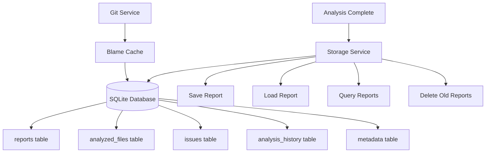

# SQLite Storage and Snapshot System

The Vipr extension uses SQLite for persistent storage of analysis results, enabling historical tracking, trend analysis, and regression detection.

## Architecture Overview



## Database Schema

### Core Tables

#### `reports`

Stores complete analysis reports tied to workspace snapshots.

```sql
CREATE TABLE reports (
  id TEXT PRIMARY KEY,
  workspace_path TEXT NOT NULL,
  created_at INTEGER NOT NULL,
  overall_score INTEGER NOT NULL,
  file_count INTEGER NOT NULL,
  issue_count INTEGER NOT NULL,
  summary TEXT,
  UNIQUE(workspace_path, created_at)
);
```

**Fields:**

- `id` - Unique report identifier (hex string)
- `workspace_path` - Absolute path to workspace root
- `created_at` - Unix timestamp (milliseconds)
- `overall_score` - Workspace average score (0-100)
- `file_count` - Number of files analyzed
- `issue_count` - Total issues found
- `summary` - Optional JSON summary data

**Indexes:**

- `idx_reports_workspace` on `workspace_path`
- `idx_reports_created` on `created_at DESC`

---

#### `analyzed_files`

Individual file analysis results within a report.

```sql
CREATE TABLE analyzed_files (
  id TEXT PRIMARY KEY,
  report_id TEXT NOT NULL,
  file_path TEXT NOT NULL,
  relative_path TEXT NOT NULL,
  score INTEGER NOT NULL,
  complexity REAL,
  maintainability REAL,
  issue_count INTEGER NOT NULL,
  FOREIGN KEY (report_id) REFERENCES reports(id) ON DELETE CASCADE
);
```

**Fields:**

- `id` - Unique file result identifier
- `report_id` - Parent report ID
- `file_path` - Absolute file path
- `relative_path` - Path relative to workspace
- `score` - File quality score (0-100)
- `complexity` - Cyclomatic complexity value
- `maintainability` - Maintainability index (0-100)
- `issue_count` - Number of issues in file

**Indexes:**

- `idx_files_report` on `report_id`
- `idx_files_score` on `score`

**Relationships:**

- Cascading delete: Removing a report deletes all associated files

---

#### `issues`

Individual code quality issues found during analysis.

```sql
CREATE TABLE issues (
  id TEXT PRIMARY KEY,
  file_id TEXT NOT NULL,
  severity TEXT NOT NULL,
  category TEXT NOT NULL,
  message TEXT NOT NULL,
  line INTEGER,
  column INTEGER,
  auto_fixable INTEGER DEFAULT 0,
  FOREIGN KEY (file_id) REFERENCES analyzed_files(id) ON DELETE CASCADE
);
```

**Fields:**

- `id` - Unique issue identifier
- `file_id` - Parent file result ID
- `severity` - `critical`, `warning`, or `info`
- `category` - Issue category (security, accessibility, etc.)
- `message` - Human-readable issue description
- `line` - Line number (1-indexed, nullable)
- `column` - Column number (0-indexed, nullable)
- `auto_fixable` - Boolean (0 or 1) indicating fix availability

**Indexes:**

- `idx_issues_file` on `file_id`
- `idx_issues_severity` on `severity`

**Relationships:**

- Cascading delete: Removing a file deletes all its issues

---

#### `analysis_history`

Lightweight trend tracking for score history.

```sql
CREATE TABLE analysis_history (
  id TEXT PRIMARY KEY,
  workspace_path TEXT NOT NULL,
  timestamp INTEGER NOT NULL,
  overall_score INTEGER NOT NULL,
  file_count INTEGER NOT NULL,
  issue_count INTEGER NOT NULL
);
```

**Fields:**

- `id` - Unique history entry identifier
- `workspace_path` - Workspace root path
- `timestamp` - Unix timestamp
- `overall_score` - Snapshot of workspace score
- `file_count` - Files analyzed at this time
- `issue_count` - Total issues at this time

**Indexes:**

- `idx_history_workspace` on `workspace_path`
- `idx_history_timestamp` on `timestamp DESC`

**Purpose:**

- Powers trend charts
- Enables score-over-time queries
- Lightweight records for visualization

---

#### `metadata`

Schema versioning and extension metadata.

```sql
CREATE TABLE metadata (
  key TEXT PRIMARY KEY,
  value TEXT NOT NULL
);
```

**Usage:**

```sql
INSERT INTO metadata (key, value) VALUES ('schema_version', '1');
```

**Keys:**

- `schema_version` - Current database schema version
- `last_cleanup` - Timestamp of last cleanup operation
- `extension_version` - Vipr extension version

---

## Storage Service API

### Initialization

```typescript
import { StorageService } from './core/storage-service';

const storageService = new StorageService(context);
await storageService.initialize();
```

**Initialization Steps:**

1. Creates global storage directory if needed
2. Opens SQLite database connection
3. Executes schema creation scripts
4. Runs migrations if schema version < current
5. Inserts/updates metadata

**Storage Location:**

- macOS: `~/Library/Application Support/Code/User/globalStorage/<extension-id>/`
- Windows: `%APPDATA%\Code\User\globalStorage\<extension-id>\`
- Linux: `~/.config/Code/User/globalStorage/<extension-id>/`

**Database File:** `vipr.db`

---

### Saving Reports

```typescript
const reportId = await storageService.saveReport(
  workspacePath: string,
  overallScore: number,
  fileResults: FileAnalysisResult[]
);
```

**Process:**

1. Generates unique report ID
2. Begins SQL transaction
3. Inserts report record
4. Inserts file records (batch)
5. Inserts issue records (batch)
6. Adds history entry
7. Commits transaction
8. Returns report ID

**Error Handling:**

- Transaction rollback on any error
- Logs error details
- Re-throws for caller handling

**Performance:**

- ~10-50ms for typical report (10 files, 50 issues)
- ~200-500ms for large report (100 files, 500 issues)

---

### Loading Reports

```typescript
const report = await storageService.loadReport(reportId: string);
```

**Returns:**

```typescript
interface StoredReport {
  id: string;
  workspacePath: string;
  createdAt: number;
  overallScore: number;
  fileCount: number;
  issueCount: number;
  summary?: string;
}
```

**Use Cases:**

- Viewing historical reports
- Comparing current vs. past analysis
- Generating comparison reports

---

### Querying History

Get trend data for workspace:

```typescript
const trend = await storageService.getWorkspaceHistory(
  workspacePath: string,
  limit: number = 30
);
```

**Returns:**

```typescript
interface TrendDataPoint {
  timestamp: number;
  score: number;
  fileCount: number;
  issueCount: number;
}
```

**Ordering:** Descending by timestamp (most recent first)

**Visualization:**

```typescript
// Prepare data for Chart.js
const labels = trend.map(t => new Date(t.timestamp).toLocaleDateString());
const scores = trend.map(t => t.score);

const chartData = {
  labels,
  datasets: [
    {
      label: 'Quality Score',
      data: scores,
      borderColor: 'rgb(75, 192, 192)',
      tension: 0.1,
    },
  ],
};
```

---

### Cleanup Operations

Delete old reports:

```typescript
const deletedCount = await storageService.deleteOldReports(
  daysToKeep: number = 30
);
```

**Behavior:**

- Calculates cutoff timestamp
- Deletes reports older than cutoff
- Cascading deletes remove files and issues
- Returns number of deleted reports
- Updates `last_cleanup` metadata

**Retention Recommendations:**

- **Daily active projects:** Keep 30 days
- **Weekly active projects:** Keep 90 days
- **Archived projects:** Keep 7 days or delete all

**Storage Growth:**

- Typical snapshot: 5-50KB
- 100 snapshots: 0.5-5MB
- 1000 snapshots: 5-50MB

---

## Snapshot Workflow

### On Analysis Complete

```typescript
// After workspace analysis completes
const { storageService } = getExtensionState();

if (storageService) {
  await storageService.saveReport(
    workspaceFolder.uri.fsPath,
    aggregatedResult.overallScore,
    fileResults
  );
}
```

**Trigger Points:**

- After workspace analysis completes
- After file save (if analyze-on-save enabled)
- Manual save via command (future feature)

---

### On Dashboard Load

```typescript
// Load recent history for trend chart
const history = await storageService.getWorkspaceHistory(workspacePath, 10);

// Render in dashboard
dashboardProvider.updateTrend(history);
```

---

### On Cleanup Command

```typescript
// User invokes "Vipr: Cleanup History"
const choice = await vscode.window.showQuickPick(['Keep 7 days', 'Keep 30 days', 'Keep 90 days']);

const daysMap = {
  'Keep 7 days': 7,
  'Keep 30 days': 30,
  'Keep 90 days': 90,
};

const deleted = await storageService.deleteOldReports(daysMap[choice]);
vscode.window.showInformationMessage(`Deleted ${deleted} old reports`);
```

---

## Advanced Queries

### Get File Trend

Track score history for a single file:

```typescript
// Custom query (not in base StorageService)
const fileTrend = await db
  .prepare(
    `
  SELECT af.score, r.created_at, r.workspace_path
  FROM analyzed_files af
  JOIN reports r ON af.report_id = r.id
  WHERE af.relative_path = ?
  ORDER BY r.created_at DESC
  LIMIT 50
`
  )
  .all([relativePath]);
```

---

### Find Top Hotspots

Get files with lowest average scores:

```typescript
const hotspots = await db
  .prepare(
    `
  SELECT
    relative_path,
    AVG(score) as avg_score,
    COUNT(*) as analysis_count
  FROM analyzed_files
  WHERE report_id IN (
    SELECT id FROM reports
    WHERE workspace_path = ?
  )
  GROUP BY relative_path
  HAVING analysis_count >= 3
  ORDER BY avg_score ASC
  LIMIT 10
`
  )
  .all([workspacePath]);
```

---

### Count Issues by Category

```typescript
const categoryStats = await db
  .prepare(
    `
  SELECT
    i.category,
    i.severity,
    COUNT(*) as count
  FROM issues i
  JOIN analyzed_files af ON i.file_id = af.id
  JOIN reports r ON af.report_id = r.id
  WHERE r.id = ?
  GROUP BY i.category, i.severity
  ORDER BY count DESC
`
  )
  .all([reportId]);
```

---

## Performance Considerations

### Optimization Strategies

**1. Batch Inserts**

Use prepared statements for bulk inserts:

```typescript
const stmt = db.prepare('INSERT INTO issues (...) VALUES (?, ?, ...)');
for (const issue of issues) {
  stmt.run([issue.id, issue.fileId, ...]);
}
stmt.finalize();
```

**2. Transaction Batching**

Group operations in transactions:

```typescript
db.exec('BEGIN TRANSACTION');
try {
  // Multiple inserts
  db.exec('COMMIT');
} catch (error) {
  db.exec('ROLLBACK');
  throw error;
}
```

**3. Index Usage**

Ensure queries use indexes:

```sql
EXPLAIN QUERY PLAN
SELECT * FROM reports WHERE workspace_path = ?;
-- Should show: SEARCH reports USING INDEX idx_reports_workspace
```

**4. Limit Result Sets**

Always use `LIMIT` for potentially large results:

```typescript
const recent = db
  .prepare(
    `
  SELECT * FROM reports
  WHERE workspace_path = ?
  ORDER BY created_at DESC
  LIMIT 10
`
  )
  .all([workspacePath]);
```

---

### Monitoring

Check database size:

```typescript
const dbPath = path.join(context.globalStorageUri.fsPath, 'vipr.db');
const stats = fs.statSync(dbPath);
console.log(`Database size: ${(stats.size / 1024 / 1024).toFixed(2)} MB`);
```

Vacuum database (compress):

```typescript
await db.exec('VACUUM');
```

**When to Vacuum:**

- After large cleanup operations
- When database > 100MB
- Monthly maintenance

---

## Troubleshooting

### Database Locked

**Symptom:** `SQLITE_BUSY: database is locked`

**Causes:**

- Multiple processes accessing database
- Long-running transaction
- Extension crash during transaction

**Solutions:**

```typescript
// Set busy timeout
db.pragma('busy_timeout = 5000'); // 5 seconds

// Use WAL mode for better concurrency
db.pragma('journal_mode = WAL');
```

---

### Corruption

**Symptom:** `SQLITE_CORRUPT: database disk image is malformed`

**Recovery:**

```bash
# Backup current database
cp vipr.db vipr.db.backup

# Try integrity check
sqlite3 vipr.db "PRAGMA integrity_check;"

# If recoverable, dump and restore
sqlite3 vipr.db ".dump" > dump.sql
rm vipr.db
sqlite3 vipr.db < dump.sql
```

**Prevention:**

- Regular backups
- Graceful shutdown (proper dispose)
- Avoid hard crashes during writes

---

### Migration Failures

**Symptom:** Extension fails to activate after update

**Check schema version:**

```typescript
const version = db.prepare('SELECT value FROM metadata WHERE key = ?').get(['schema_version']);
console.log('Current schema version:', version);
```

**Manual migration:**

```typescript
// Force schema version update
db.exec(`
  INSERT OR REPLACE INTO metadata (key, value)
  VALUES ('schema_version', '2')
`);
```

---

## Next Steps

- [Git Integration](./git-integration) - Blame and commit tracking
- [Regression Detection](./regression-detection) - Finding quality degradations
- [Performance Optimization](./performance) - Scaling to large workspaces
