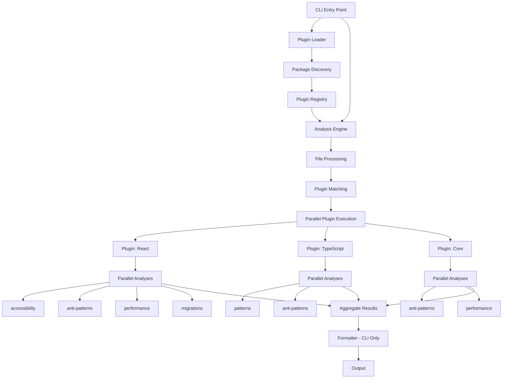

# Plugin Architecture Refactor

## Overview

Refactor the current architecture to implement a fully decoupled plugin system where:

- CLI has no direct dependencies on specific analyzers
- Plugins auto-discover from `analyzers/*` packages
- Each plugin registers standard analyses (migrations, anti-patterns, performance, etc.)
- Analyses run in parallel within each plugin
- Plugins run in parallel across files
- All analyzers are bundled with the CLI

## Architecture Changes

### 1. Analysis Registration System

**New Interface: `IAnalysis`**

- Standard interface for all analysis types
- Each analysis has a unique ID and category
- Analyses can be enabled/disabled per plugin

**Standard Analysis Types:**

- `migrations` - Migration readiness analysis
- `anti-patterns` - Anti-pattern detection
- `performance` - Performance metrics
- `technical-debt` - Technical debt hotspots
- `security` - Security vulnerabilities
- `accessibility` - A11y violations (React-specific)
- `patterns` - Language patterns (TypeScript-specific)

**Location:** `common/types/src/analysis/index.ts`

### 2. Enhanced Plugin Interface

**Update `ITechnologyPlugin`:**

- Add `getAnalyses()` method to return registered analyses
- Add `runAnalysis(analysisId, sourceFile, config)` method
- Plugins declare which analyses they support

**Location:** `common/types/src/plugin/index.ts`

### 3. Plugin Discovery System

**New Package: `common/plugin-loader`**

- Auto-discovers plugins from `analyzers/*` packages
- Loads plugin exports using dynamic imports
- Validates plugin structure
- Registers plugins with engine

**Key Files:**

- `common/plugin-loader/src/discovery.ts` - Package discovery
- `common/plugin-loader/src/loader.ts` - Plugin loading
- `common/plugin-loader/src/registry.ts` - Plugin registry

### 4. Enhanced Analysis Engine

**Update `AnalysisEngine`:**

- Support analysis-level parallelization
- Run registered analyses in parallel per plugin
- Aggregate analysis results into plugin results
- Maintain backward compatibility

**Location:** `analyzers/core/src/engine/analysis-engine.ts`

### 6. CLI Refactoring

**Remove Direct Dependencies:**

- Remove `@vipr/react` from CLI dependencies
- Use plugin loader to discover and register plugins
- Add formatter system for CLI output

**New Structure:**

- `clients/cli/src/plugin-loader.ts` - Plugin discovery and registration
- `clients/cli/src/formatters/` - Output formatters (JSON, CLI, etc.)
- `clients/cli/src/index.ts` - Main entry point (refactored)

### 7. React Analyzer Updates

**Refactor `ReactAnalyzerPlugin`:**

- Register analyses: `accessibility`, `anti-patterns`, `performance`, `migrations`, `technical-debt`
- Split current monolithic `analyze()` into separate analysis implementations
- Each analysis runs independently and in parallel

**Location:** `analyzers/react/src/plugin.ts`

### 8. Core Analyzer Plugin

**New: `analyzers/core/src/plugin.ts`**

- Create a core analyzer plugin that provides base analyses
- Register analyses: `anti-patterns`, `performance`, `technical-debt`
- Framework-agnostic analyses

## Implementation Plan

### Phase 1: Type System & Interfaces

1. **Create Analysis Interface** (`common/types/src/analysis/index.ts`)
   - `IAnalysis` interface
   - Standard analysis type definitions
   - Analysis result types

2. **Update Plugin Interface** (`common/types/src/plugin/index.ts`)
   - Add `getAnalyses()` method
   - Add `runAnalysis()` method
   - Update `PluginResult` to include analysis breakdown

### Phase 2: Plugin Discovery & Loading

3. **Create Plugin Loader Package** (`common/plugin-loader/`)
   - Package discovery from `analyzers/*`
   - Dynamic plugin loading
   - Plugin validation
   - Registry management

### Phase 3: Engine Enhancements

4. **Update Analysis Engine** (`analyzers/core/src/engine/analysis-engine.ts`)
   - Analysis-level parallelization
   - Analysis result aggregation
   - Maintain plugin-level parallelization

### Phase 4: Analyzer Refactoring

5. **Refactor React Analyzer** (`analyzers/react/`)
   - Split into separate analysis implementations
   - Register analyses
   - Update plugin class

6. **Create Core Analyzer Plugin** (`analyzers/core/src/plugin.ts`)
   - Framework-agnostic analyses
   - Register base analyses

### Phase 5: CLI Refactoring

8. **Refactor CLI** (`clients/cli/`)
   - Remove direct analyzer dependencies
   - Integrate plugin loader
   - Add formatter system
   - Update package.json

### Phase 6: Testing & Documentation

9. **Update Tests**
   - Plugin discovery tests
   - Analysis registration tests
   - Parallel execution tests

10. **Documentation**
    - Plugin development guide
    - Analysis registration guide
    - Architecture documentation

## File Structure Changes

```
common/
  plugin-loader/          # NEW: Plugin discovery and loading
    src/
      discovery.ts
      loader.ts
      registry.ts
      index.ts
  analyzer-template/      # NEW: Analyzer template
    template/
      src/
        plugin.ts
        analyses/
        index.ts
    scripts/
      create-analyzer.ts
    package.json

analyzers/
  core/
    src/
      plugin.ts          # NEW: Core analyzer plugin
      engine/
        analysis-engine.ts  # MODIFY: Add analysis parallelization

  react/
    src/
      plugin.ts          # MODIFY: Split into analyses
      analyses/          # NEW: Separate analysis implementations
        accessibility.ts
        anti-patterns.ts
        performance.ts
        migrations.ts
        technical-debt.ts

clients/
  cli/
    src/
      index.ts           # MODIFY: Use plugin loader
      plugin-loader.ts   # NEW: Plugin discovery
      formatters/        # NEW: Output formatters
        json.ts
        cli.ts
        index.ts
    package.json         # MODIFY: Remove @vipr/react dependency
```

## Data Flow



## Benefits & Tradeoffs

### Bundle All Analyzers (Selected Approach)

**Benefits:**

- Simpler deployment - no plugin installation needed
- Faster startup - no dynamic loading overhead
- Better offline support
- Easier version management
- No network requests for plugins

**Tradeoffs:**

- Larger bundle size
- All analyzers loaded even if unused
- Less flexibility for users

### Plugin Shipping Strategy

Since we're bundling all analyzers:

- All analyzers in `analyzers/*` are included
- CLI auto-discovers them at startup
- No runtime plugin installation needed
- Users can still disable specific analyzers via config

## Migration Considerations

- Maintain backward compatibility with existing `ITechnologyPlugin` interface
- Existing plugins continue to work via adapter pattern
- Gradual migration path for v2 integration
- Analysis registration is additive, not breaking

## Performance Considerations

- Analyses run in parallel within each plugin using `Promise.all()`
- Plugins run in parallel across files
- Results are cached at file level
- Analysis results are cached separately for better cache hits
- Lazy loading of analysis implementations (only load when enabled)
