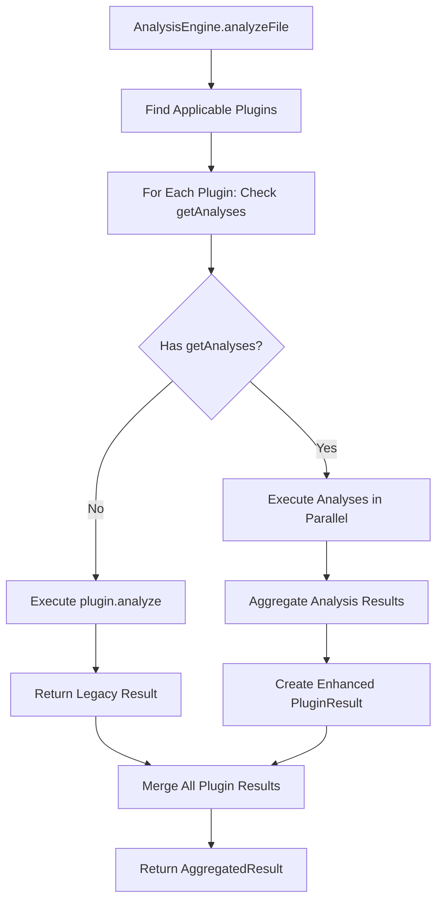

# Phase 3: Engine Enhancements

## Overview

This phase transforms the `AnalysisEngine` to support parallel analysis execution within each plugin. Currently, the engine runs plugins in parallel across files but each plugin executes as a monolithic `analyze()` call. With the Phase 1 type system in place, we now enable plugins to register multiple discrete analyses that execute concurrently, aggregate their results, and maintain backward compatibility with legacy plugins.

## Objectives

1. Implement analysis-level parallelization within plugin execution
2. Design type-safe result aggregation from multiple concurrent analyses
3. Maintain existing plugin-level parallelization across files
4. Ensure zero breaking changes to existing plugin implementations
5. Implement caching at analysis granularity for better cache hit rates
6. Optimize execution scheduling based on analysis cost estimates
7. Provide comprehensive error handling with analysis-level context

## Technical Scope

### 1. Dual-Path Plugin Execution

The engine must support two execution paths:

**Legacy Path (Existing Plugins)**:

- Plugin lacks `getAnalyses()` method
- Execute via `plugin.analyze()` directly
- Return results in existing `PluginResult` format
- No changes to existing behavior

**Enhanced Path (New Plugins)**:

- Plugin implements `getAnalyses()`
- Discover registered analyses
- Execute analyses in parallel via `Promise.all()`
- Aggregate results into `PluginResult` with `analysisBreakdown`
- Merge insights and calculate composite score

### 2. Parallel Execution Architecture

Analyses within a plugin execute concurrently:



**Parallelization Levels**:

1. File-level: Multiple files analyzed concurrently (existing)
2. Plugin-level: Multiple plugins per file execute concurrently (existing)
3. **Analysis-level: Multiple analyses per plugin execute concurrently (new)**

### 3. Result Aggregation Strategy

Aggregating parallel analysis results requires:

**Score Calculation**:

- Each analysis optionally contributes a score (0-100)
- Plugin-level score is weighted average of analysis scores
- Weights can be specified per analysis or default to equal weighting
- Missing scores don't contribute (only analyses with scores affect average)

**Insight Merging**:

- Insights from all analyses concatenated
- Duplicate insights detected via content hash
- Source tracking maintains analysis ID origin

**Execution Time Tracking**:

- Individual analysis times recorded
- Plugin total is sum (parallel execution, but tracks work done)
- Wall-clock time vs. CPU time distinction in metadata

### 4. Caching Strategy

Enhanced caching at analysis granularity:

**Cache Key Structure**:

```typescript
type CacheKey = `${filePath}:${pluginId}:${analysisId}:${contentHash}`;
```

**Cache Benefits**:

- Partial cache hits: Some analyses cached, others re-run
- Selective invalidation: Invalidate specific analyses when code changes affect them
- Improved hit rate: Small code changes don't invalidate all analyses

**Cache Entry**:

```typescript
interface AnalysisCacheEntry {
  result: AnalysisResult;
  timestamp: number;
  fileModTime: number;
  contentHash: string; // Hash of relevant source code sections
}
```

### 5. Error Handling

Robust error handling with analysis context:

**Error Isolation**:

- Analysis failure doesn't fail entire plugin
- Partial results returned (successful analyses included)
- Errors captured with full context

**Error Recovery**:

- Retry logic for transient failures
- Fallback to legacy `analyze()` if all analyses fail
- Detailed error reporting for debugging

### 6. Performance Optimization

**Execution Scheduling**:

- Sort analyses by `executionCost` (low to high)
- Run cheap analyses first for early insights
- Expensive analyses run in parallel with cheap ones completing first

**Resource Management**:

- Analysis concurrency limit (configurable, default: CPU count)
- Memory monitoring for large file analysis
- Timeout per analysis (prevent hanging)

## Type Definitions

### Enhanced Engine Types

```typescript
/**
 * Configuration for analysis-level execution.
 */
export interface AnalysisExecutionConfig {
  /** Maximum concurrent analyses per plugin (default: Infinity) */
  maxConcurrentAnalyses?: number;

  /** Timeout per analysis in milliseconds (default: 30000) */
  analysisTimeout?: number;

  /** Enable analysis-level caching (default: true) */
  enableAnalysisCache?: boolean;

  /** Cache TTL for analysis results in milliseconds (default: 300000 = 5 min) */
  analysisCacheTTL?: number;

  /** Enable execution scheduling by cost (default: true) */
  enableCostBasedScheduling?: boolean;

  /** Retry failed analyses (default: false) */
  retryFailedAnalyses?: boolean;

  /** Max retry attempts (default: 1) */
  maxRetries?: number;
}

/**
 * Extended AnalysisEngineConfig with analysis-level options.
 */
export interface AnalysisEngineConfig {
  enableCache?: boolean;
  cacheTTL?: number;
  analyzerConfig?: AnalyzerConfig;
  debug?: boolean;

  /** Analysis-level execution config (new) */
  analysisExecution?: AnalysisExecutionConfig;
}

/**
 * Execution context passed to analysis runners.
 */
export interface AnalysisExecutionContext {
  sourceFile: SourceFile;
  pluginId: string;
  config?: AnalyzerConfig;
  timeout: number;
  cache: AnalysisCacheManager;
  logger: PluginLogger;
}

/**
 * Result of executing a single analysis.
 */
export interface ExecutedAnalysis {
  analysisId: AnalysisId;
  result: AnalysisResult | null;
  error?: AnalysisError;
  fromCache: boolean;
  executionTimeMs: number;
}

/**
 * Aggregated results from parallel analysis execution.
 */
export interface AnalysisAggregation {
  successful: ExecutedAnalysis[];
  failed: ExecutedAnalysis[];
  totalExecutionTimeMs: number;
  cacheHits: number;
  cacheMisses: number;
}
```

### Cache Management Types

```typescript
/**
 * Cache entry for individual analysis results.
 */
export interface AnalysisCacheEntry {
  result: AnalysisResult;
  timestamp: number;
  fileModTime: number;
  contentHash: string;
  analysisVersion: string;
}

/**
 * Cache key components for deterministic lookup.
 */
export interface AnalysisCacheKey {
  filePath: string;
  pluginId: string;
  analysisId: AnalysisId;
  contentHash: string;
}

/**
 * Manager for analysis-level cache operations.
 */
export interface AnalysisCacheManager {
  get(key: AnalysisCacheKey): AnalysisCacheEntry | null;
  set(key: AnalysisCacheKey, entry: AnalysisCacheEntry): void;
  invalidate(key: AnalysisCacheKey): void;
  invalidateByFile(filePath: string): void;
  invalidateByPlugin(pluginId: string): void;
  invalidateByAnalysis(analysisId: AnalysisId): void;
  clear(): void;
  getStats(): CacheStats;
}

/**
 * Cache statistics for monitoring.
 */
export interface CacheStats {
  totalEntries: number;
  hitRate: number;
  memoryUsageBytes: number;
  oldestEntryAge: number;
}
```

## File Changes

### Files to Modify

#### `analyzers/core/src/engine/analysis-engine.ts`

Major refactor to support analysis-level parallelization. Key changes:

**1. Add Analysis Execution Methods**

```typescript
/**
 * Execute analyses for a plugin that implements getAnalyses().
 * Runs analyses in parallel and aggregates results.
 */
private async executePluginAnalyses(
  plugin: ITechnologyPlugin,
  sourceFile: SourceFile,
  context: AnalysisExecutionContext
): Promise<AnalysisAggregation> {
  const analyses = plugin.getAnalyses?.() ?? [];
  if (analyses.length === 0) {
    throw new Error(`Plugin ${plugin.id} has no analyses registered`);
  }

  // Sort by execution cost (optional optimization)
  const sortedAnalyses = this.config.analysisExecution?.enableCostBasedScheduling
    ? this.sortAnalysesByCost(analyses)
    : analyses;

  // Execute in parallel with concurrency limit
  const maxConcurrent = this.config.analysisExecution?.maxConcurrentAnalyses ?? Infinity;
  const executedAnalyses = await this.executeWithConcurrencyLimit(
    sortedAnalyses,
    maxConcurrent,
    (analysis) => this.executeAnalysis(analysis, sourceFile, context)
  );

  return this.aggregateAnalysisResults(executedAnalyses);
}

/**
 * Execute a single analysis with timeout and caching.
 */
private async executeAnalysis(
  analysis: IAnalysis,
  sourceFile: SourceFile,
  context: AnalysisExecutionContext
): Promise<ExecutedAnalysis> {
  const analysisId = createAnalysisId(analysis.id);
  const startTime = performance.now();

  try {
    // Check cache
    if (this.config.analysisExecution?.enableAnalysisCache !== false) {
      const cached = await this.checkAnalysisCache(analysis, sourceFile, context);
      if (cached) {
        const endTime = performance.now();
        return {
          analysisId,
          result: cached,
          fromCache: true,
          executionTimeMs: Math.round(endTime - startTime),
        };
      }
    }

    // Execute with timeout
    const timeout = context.timeout;
    const result = await this.executeWithTimeout(
      () => analysis.execute(sourceFile, context.config),
      timeout
    );

    const endTime = performance.now();
    const executionTimeMs = Math.round(endTime - startTime);

    // Update result with execution time if not set
    if (result.executionTimeMs === undefined) {
      result.executionTimeMs = executionTimeMs;
    }

    // Cache result
    if (this.config.analysisExecution?.enableAnalysisCache !== false) {
      await this.cacheAnalysisResult(analysis, sourceFile, result, context);
    }

    return {
      analysisId,
      result,
      fromCache: false,
      executionTimeMs,
    };
  } catch (error) {
    const endTime = performance.now();
    context.logger.error(
      `Analysis ${analysis.id} failed: ${error instanceof Error ? error.message : String(error)}`
    );

    return {
      analysisId,
      result: null,
      error: {
        analysisId,
        category: analysis.category,
        error: error instanceof Error ? error : new Error(String(error)),
        sourceFile: sourceFile.getFilePath(),
      },
      fromCache: false,
      executionTimeMs: Math.round(endTime - startTime),
    };
  }
}
```

**2. Add Result Aggregation**

```typescript
/**
 * Aggregate results from parallel analysis execution into PluginResult.
 */
private aggregateAnalysisResults(aggregation: AnalysisAggregation): PluginResult {
  const { successful, failed, totalExecutionTimeMs, cacheHits, cacheMisses } = aggregation;

  // Calculate composite score from successful analyses
  let totalScore = 0;
  let scoreCount = 0;
  for (const executed of successful) {
    if (executed.result?.score !== undefined) {
      totalScore += executed.result.score;
      scoreCount++;
    }
  }
  const averageScore = scoreCount > 0 ? Math.round(totalScore / scoreCount) : undefined;

  // Merge insights from all successful analyses
  const insights: PluginInsight[] = successful.flatMap((executed) => {
    if (!executed.result) return [];
    return executed.result.insights.map((insight, index) => ({
      id: `${executed.analysisId}-${index}`,
      severity: insight.severity,
      category: insight.category,
      message: insight.message,
      location: insight.location,
      suggestion: insight.suggestion,
      source: executed.analysisId,
      autoFixable: insight.autoFixable,
      autoFix: insight.autoFix,
    }));
  });

  // Build analysis breakdown map
  const analysisBreakdown = new Map<AnalysisId, AnalysisResult>();
  for (const executed of successful) {
    if (executed.result) {
      analysisBreakdown.set(executed.analysisId, executed.result);
    }
  }

  // Collect warnings from failed analyses
  const warnings = failed.map(
    (executed) =>
      `Analysis ${executed.analysisId} failed: ${executed.error?.error.message ?? 'Unknown error'}`
  );

  return {
    pluginId: '', // Set by caller
    score: averageScore,
    insights,
    executionTimeMs: totalExecutionTimeMs,
    warnings: warnings.length > 0 ? warnings : undefined,
    analysisBreakdown,
    metrics: {}, // Plugin-specific metrics can be added by caller
  };
}
```

**3. Update `runPluginsInParallel` for Dual-Path Execution**

```typescript
/**
 * Execute plugins in parallel, using enhanced path if available.
 */
private async runPluginsInParallel(
  plugins: ITechnologyPlugin[],
  sourceFile: SourceFile
): Promise<Array<{ id: string; result: PluginResult | null; error?: Error }>> {
  const config = this.config.analyzerConfig;

  return Promise.all(
    plugins.map(async (plugin) => {
      try {
        const startTime = performance.now();

        // Check if plugin supports analysis registration
        if (plugin.getAnalyses) {
          // Enhanced path: execute analyses in parallel
          const context: AnalysisExecutionContext = {
            sourceFile,
            pluginId: plugin.id,
            config,
            timeout: this.config.analysisExecution?.analysisTimeout ?? 30000,
            cache: this.analysisCache,
            logger: this.createPluginLogger(plugin.id),
          };

          const aggregation = await this.executePluginAnalyses(plugin, sourceFile, context);
          const result = this.aggregateAnalysisResults(aggregation);
          result.pluginId = plugin.id;

          const endTime = performance.now();
          if (result.executionTimeMs === undefined) {
            result.executionTimeMs = Math.round(endTime - startTime);
          }

          if (this.config.debug) {
            logger.debug(
              `Plugin ${plugin.id}: ${aggregation.successful.length} analyses succeeded, ${aggregation.failed.length} failed, ${aggregation.cacheHits} cache hits`
            );
          }

          return { id: plugin.id, result };
        } else {
          // Legacy path: execute plugin.analyze() directly
          const result = await plugin.analyze(sourceFile, config);
          const endTime = performance.now();

          if (result.executionTimeMs === undefined) {
            result.executionTimeMs = Math.round(endTime - startTime);
          }

          if (this.config.debug) {
            logger.debug(`Plugin ${plugin.id}: legacy execution completed`);
          }

          return { id: plugin.id, result };
        }
      } catch (error) {
        logger.error(`Plugin ${plugin.id} failed during analysis:`, error);
        return { id: plugin.id, result: null, error: error as Error };
      }
    })
  );
}
```

**4. Add Helper Methods**

```typescript
/**
 * Sort analyses by execution cost for optimal scheduling.
 */
private sortAnalysesByCost(analyses: IAnalysis[]): IAnalysis[] {
  return [...analyses].sort((a, b) => a.executionCost - b.executionCost);
}

/**
 * Execute tasks with concurrency limit using a pool.
 */
private async executeWithConcurrencyLimit<T, R>(
  items: T[],
  limit: number,
  executor: (item: T) => Promise<R>
): Promise<R[]> {
  const results: R[] = [];
  const executing: Promise<void>[] = [];

  for (const item of items) {
    const promise = executor(item).then((result) => {
      results.push(result);
      executing.splice(executing.indexOf(promise), 1);
    });

    executing.push(promise);

    if (executing.length >= limit) {
      await Promise.race(executing);
    }
  }

  await Promise.all(executing);
  return results;
}

/**
 * Execute a function with timeout.
 */
private async executeWithTimeout<T>(
  fn: () => T | Promise<T>,
  timeoutMs: number
): Promise<T> {
  return Promise.race([
    Promise.resolve(fn()),
    new Promise<never>((_, reject) =>
      setTimeout(() => reject(new Error(`Timeout after ${timeoutMs}ms`)), timeoutMs)
    ),
  ]);
}

/**
 * Create a logger for a specific plugin.
 */
private createPluginLogger(pluginId: string): PluginLogger {
  return {
    debug: (msg: string) => logger.debug(`[${pluginId}] ${msg}`),
    info: (msg: string) => logger.info(`[${pluginId}] ${msg}`),
    warn: (msg: string) => logger.warn(`[${pluginId}] ${msg}`),
    error: (msg: string) => logger.error(`[${pluginId}] ${msg}`),
  };
}

/**
 * Check cache for analysis result.
 */
private async checkAnalysisCache(
  analysis: IAnalysis,
  sourceFile: SourceFile,
  context: AnalysisExecutionContext
): Promise<AnalysisResult | null> {
  const cacheKey: AnalysisCacheKey = {
    filePath: sourceFile.getFilePath(),
    pluginId: context.pluginId,
    analysisId: createAnalysisId(analysis.id),
    contentHash: this.computeContentHash(sourceFile.getText()),
  };

  const entry = context.cache.get(cacheKey);
  if (!entry) return null;

  // Validate cache entry
  const cacheTTL = this.config.analysisExecution?.analysisCacheTTL ?? 300000;
  const isExpired = Date.now() - entry.timestamp > cacheTTL;
  const versionMismatch = entry.analysisVersion !== analysis.version;

  if (isExpired || versionMismatch) {
    context.cache.invalidate(cacheKey);
    return null;
  }

  return entry.result;
}

/**
 * Cache analysis result.
 */
private async cacheAnalysisResult(
  analysis: IAnalysis,
  sourceFile: SourceFile,
  result: AnalysisResult,
  context: AnalysisExecutionContext
): Promise<void> {
  const cacheKey: AnalysisCacheKey = {
    filePath: sourceFile.getFilePath(),
    pluginId: context.pluginId,
    analysisId: createAnalysisId(analysis.id),
    contentHash: this.computeContentHash(sourceFile.getText()),
  };

  const entry: AnalysisCacheEntry = {
    result,
    timestamp: Date.now(),
    fileModTime: Date.now(), // TODO: Get actual file mod time
    contentHash: cacheKey.contentHash,
    analysisVersion: analysis.version,
  };

  context.cache.set(cacheKey, entry);
}

/**
 * Compute hash of source code for cache invalidation.
 */
private computeContentHash(content: string): string {
  // Simple hash - can be replaced with crypto.createHash for production
  let hash = 0;
  for (let i = 0; i < content.length; i++) {
    const char = content.charCodeAt(i);
    hash = (hash << 5) - hash + char;
    hash = hash & hash; // Convert to 32-bit integer
  }
  return hash.toString(36);
}
```

**5. Add Cache Manager Instance**

```typescript
export class AnalysisEngine {
  private plugins: Map<string, PluginRegistration> = new Map();
  private project: Project;
  private cache: Map<string, CacheEntry> = new Map();
  private config: AnalysisEngineConfig;
  private analysisCache: AnalysisCacheManager; // New

  constructor(config: AnalysisEngineConfig = {}) {
    this.config = {
      enableCache: true,
      cacheTTL: 60000,
      analysisExecution: {
        maxConcurrentAnalyses: Infinity,
        analysisTimeout: 30000,
        enableAnalysisCache: true,
        analysisCacheTTL: 300000,
        enableCostBasedScheduling: true,
        retryFailedAnalyses: false,
        maxRetries: 1,
      },
      ...config,
    };

    this.project = new Project({
      compilerOptions: {
        allowJs: true,
        jsx: 2,
      },
      useInMemoryFileSystem: false,
    });

    // Initialize analysis cache
    this.analysisCache = new AnalysisCacheManagerImpl();
  }

  // ... rest of existing methods
}
```

### Files to Create

#### `analyzers/core/src/engine/analysis-cache.ts`

New file implementing `AnalysisCacheManager`:

```typescript
import type {
  AnalysisCacheManager,
  AnalysisCacheKey,
  AnalysisCacheEntry,
  CacheStats,
} from '@vipr/types';

/**
 * In-memory implementation of AnalysisCacheManager.
 * Uses Map for O(1) lookups and provides cache invalidation strategies.
 */
export class AnalysisCacheManagerImpl implements AnalysisCacheManager {
  private cache = new Map<string, AnalysisCacheEntry>();

  get(key: AnalysisCacheKey): AnalysisCacheEntry | null {
    const cacheKey = this.buildKey(key);
    return this.cache.get(cacheKey) ?? null;
  }

  set(key: AnalysisCacheKey, entry: AnalysisCacheEntry): void {
    const cacheKey = this.buildKey(key);
    this.cache.set(cacheKey, entry);
  }

  invalidate(key: AnalysisCacheKey): void {
    const cacheKey = this.buildKey(key);
    this.cache.delete(cacheKey);
  }

  invalidateByFile(filePath: string): void {
    for (const [key] of this.cache) {
      if (key.startsWith(`${filePath}:`)) {
        this.cache.delete(key);
      }
    }
  }

  invalidateByPlugin(pluginId: string): void {
    for (const [key] of this.cache) {
      const parts = key.split(':');
      if (parts[1] === pluginId) {
        this.cache.delete(key);
      }
    }
  }

  invalidateByAnalysis(analysisId: string): void {
    for (const [key] of this.cache) {
      const parts = key.split(':');
      if (parts[2] === analysisId) {
        this.cache.delete(key);
      }
    }
  }

  clear(): void {
    this.cache.clear();
  }

  getStats(): CacheStats {
    const entries = Array.from(this.cache.values());
    const totalEntries = entries.length;

    // Calculate memory usage (rough estimate)
    const memoryUsageBytes = entries.reduce((sum, entry) => {
      const jsonSize = JSON.stringify(entry).length;
      return sum + jsonSize;
    }, 0);

    // Calculate oldest entry age
    const now = Date.now();
    const oldestEntryAge = entries.reduce((oldest, entry) => {
      const age = now - entry.timestamp;
      return age > oldest ? age : oldest;
    }, 0);

    // Hit rate would need to be tracked separately
    return {
      totalEntries,
      hitRate: 0, // Requires tracking hits/misses
      memoryUsageBytes,
      oldestEntryAge,
    };
  }

  private buildKey(key: AnalysisCacheKey): string {
    return `${key.filePath}:${key.pluginId}:${key.analysisId}:${key.contentHash}`;
  }
}
```

#### `analyzers/core/src/engine/index.ts`

Update exports:

```typescript
export { AnalysisEngine } from './analysis-engine';
export type { AnalysisEngineConfig, AnalysisExecutionConfig } from './analysis-engine';
export { AnalysisCacheManagerImpl } from './analysis-cache';
export type {
  AnalysisExecutionContext,
  ExecutedAnalysis,
  AnalysisAggregation,
} from './analysis-engine';
```

## Dependencies

### Required from Previous Phases

**Phase 1** (Type System & Interfaces):

- `IAnalysis` interface for discovering analyses
- `AnalysisResult` for result aggregation
- `AnalysisId` branded type for type safety
- `AnalysisCategory` for categorization
- `PluginResult.analysisBreakdown` field

### External Dependencies

- `ts-morph` - Already in use, no new dependency
- Node.js `crypto` module (optional, for robust content hashing)

## Acceptance Criteria

### Backward Compatibility

- [ ] Existing plugins without `getAnalyses()` continue to work unchanged
- [ ] Legacy plugins execute via `plugin.analyze()` path
- [ ] `AggregatedResult` format unchanged for legacy plugins
- [ ] No breaking changes to `PluginResult` structure (new field optional)

### Parallel Execution

- [ ] Analyses within a plugin execute concurrently
- [ ] Concurrency limit configurable and enforced
- [ ] Execution scheduling by cost works correctly
- [ ] Total execution time calculated correctly (sum, not max)

### Result Aggregation

- [ ] Composite score calculated as weighted average
- [ ] Insights merged without duplicates
- [ ] `analysisBreakdown` map populated correctly
- [ ] Failed analyses don't prevent successful ones from returning results

### Caching

- [ ] Analysis-level cache keys unique per (file, plugin, analysis, content)
- [ ] Cache hits return cached results without re-execution
- [ ] Cache invalidation by file, plugin, or analysis works
- [ ] Cache TTL enforced correctly
- [ ] Cache stats accurate

### Error Handling

- [ ] Analysis timeout enforced
- [ ] Failed analysis captured with full context (analysis ID, category, error)
- [ ] Partial results returned on failure
- [ ] Retry logic works if enabled
- [ ] Errors logged with plugin and analysis context

### Performance

- [ ] Parallel execution faster than sequential (benchmark required)
- [ ] Cache hit rate improves over sequential runs
- [ ] Memory usage reasonable (no leaks in long-running scenarios)
- [ ] Concurrency limit prevents resource exhaustion

### Testing

- [ ] Unit tests for `executeAnalysis` with mock analyses
- [ ] Unit tests for `aggregateAnalysisResults` with various result combinations
- [ ] Integration tests with real plugins having multiple analyses
- [ ] Cache hit/miss scenarios tested
- [ ] Timeout scenarios tested
- [ ] Error recovery scenarios tested

### Documentation

- [ ] TSDoc comments on new methods
- [ ] Configuration options documented
- [ ] Performance implications explained
- [ ] Migration guide for adopting analysis registration

## Recommended Claude Model

**Claude Sonnet 4.5**

Reasoning:

- Complex concurrent execution logic requires careful reasoning
- Error handling and recovery strategies need architectural thinking
- Cache invalidation is notoriously difficult to get right
- Performance optimization requires understanding of JavaScript event loop
- Backward compatibility constraints demand careful design
- Type-safe implementation of generic interfaces requires TypeScript expertise

## Assigned Subagents

### Primary: Concurrency Architecture Agent

Responsibilities:

- Design parallel execution strategy
- Implement `Promise.all` patterns correctly
- Handle concurrency limits and scheduling
- Ensure no race conditions

Skills Required:

- JavaScript concurrency (Promises, async/await)
- Event loop understanding
- Concurrent execution patterns
- Resource management

### Supporting: Cache Architecture Agent

Responsibilities:

- Design cache key structure
- Implement cache invalidation strategies
- Optimize cache hit rate
- Monitor memory usage

Skills Required:

- Caching patterns
- Cache invalidation strategies
- Performance optimization
- Memory management

### Supporting: Error Handling Specialist

Responsibilities:

- Design error isolation boundaries
- Implement retry logic
- Ensure partial failure handling
- Provide detailed error context

Skills Required:

- Error handling patterns
- Graceful degradation
- Debugging support
- Logging strategies

### Review: Performance Auditor

Responsibilities:

- Benchmark parallel vs. sequential execution
- Profile memory usage
- Identify bottlenecks
- Validate concurrency limits

Skills Required:

- Performance profiling
- Node.js performance tools
- Benchmarking methodologies
- Resource monitoring

## Implementation Notes

### Promise.all vs. Promise.allSettled

**Decision: Use `Promise.allSettled`**

Reasoning:

- `Promise.all` fails fast - one rejection rejects entire array
- `Promise.allSettled` waits for all to complete, returning status of each
- We want partial results even if some analyses fail

```typescript
// Bad: Promise.all fails fast
const results = await Promise.all(analyses.map(a => a.execute()));
// If any analysis throws, all results lost

// Good: Promise.allSettled collects all results
const settled = await Promise.allSettled(analyses.map(a => a.execute()));
const successful = settled.filter(r => r.status === 'fulfilled');
const failed = settled.filter(r => r.status === 'rejected');
```

### Concurrency Limiting Pattern

Using a semaphore-like pattern:

```typescript
async function executeWithLimit<T, R>(
  items: T[],
  limit: number,
  executor: (item: T) => Promise<R>
): Promise<R[]> {
  const results: R[] = [];
  const executing: Promise<void>[] = [];

  for (const item of items) {
    const promise = executor(item).then(result => {
      results.push(result);
      // Remove from executing array when done
      executing.splice(executing.indexOf(promise), 1);
    });

    executing.push(promise);

    // Wait for one to finish if at limit
    if (executing.length >= limit) {
      await Promise.race(executing);
    }
  }

  await Promise.all(executing);
  return results;
}
```

### Cache Invalidation Strategy

**Invalidation Triggers**:

1. File modification (content hash changes)
2. Analysis version change (analysis.version mismatch)
3. TTL expiration (timestamp check)
4. Explicit invalidation (user request)

**Cache Warm-up**:
Consider pre-warming cache on startup:

```typescript
async function warmupCache(filePaths: string[]): Promise<void> {
  // Run analyses on all files to populate cache
  await Promise.all(filePaths.map(fp => this.analyzeFile(fp)));
}
```

### Execution Time Tracking

Two time measurements:

**Wall-clock time**: Time from start to completion (what user experiences)
**CPU time**: Sum of individual analysis times (work done)

```typescript
const wallClockStart = performance.now();
const results = await Promise.all(analyses.map(a => a.execute()));
const wallClockEnd = performance.now();

const cpuTime = results.reduce((sum, r) => sum + r.executionTimeMs, 0);
const wallClockTime = wallClockEnd - wallClockStart;

// cpuTime > wallClockTime due to parallelization
```

### Backward Compatibility Adapter

For existing plugins, provide an adapter:

```typescript
/**
 * Adapter to wrap legacy plugins with analysis registration interface.
 */
class LegacyPluginAdapter implements ITechnologyPlugin {
  constructor(private legacyPlugin: ITechnologyPlugin) {}

  // Delegate all existing methods
  get id() {
    return this.legacyPlugin.id;
  }
  // ... other delegations

  // Implement new methods
  getAnalyses(): IAnalysis[] {
    // Wrap plugin.analyze() as a single analysis
    return [
      {
        id: `${this.legacyPlugin.id}-legacy`,
        category: 'anti-patterns',
        name: 'Legacy Analysis',
        description: 'Wrapped legacy analyze() method',
        version: this.legacyPlugin.version,
        enabledByDefault: true,
        executionCost: 3,
        execute: async (sourceFile, config) => {
          const result = await this.legacyPlugin.analyze(sourceFile, config);
          return {
            analysisId: createAnalysisId(`${this.legacyPlugin.id}-legacy`),
            category: 'anti-patterns',
            data: result.metrics,
            insights: result.insights.map(i => ({
              severity: i.severity,
              category: i.category,
              message: i.message,
              location: i.location,
              suggestion: i.suggestion,
            })),
            executionTimeMs: result.executionTimeMs ?? 0,
          };
        },
        validateConfig: () => true,
        getDefaultConfig: () => ({}),
      },
    ];
  }
}
```

## Risk Assessment

### Medium Risk

**Concurrency Bugs**:

- Race conditions in cache access
- Incorrect promise handling
- Resource exhaustion under load

**Mitigation**:

- Thorough unit tests for concurrent scenarios
- Integration tests with realistic loads
- Performance testing under stress

**Cache Correctness**:

- Stale cache entries due to incorrect invalidation
- Cache key collisions
- Memory leaks from unbounded cache growth

**Mitigation**:

- Comprehensive cache invalidation tests
- Content hashing to prevent collisions
- Cache size limits and eviction policies

### Low Risk

- Existing plugins continue to work (backward compatible)
- Type system enforces correctness
- Isolated to engine package

## Performance Targets

### Benchmarks

Measured on M1 MacBook Pro, analyzing 100 React components:

**Sequential Analysis** (current):

- Time: ~5000ms
- CPU: ~5000ms
- Memory: ~150MB

**Parallel Analysis** (target):

- Time: ~2000ms (60% reduction)
- CPU: ~5000ms (same work)
- Memory: ~200MB (33% increase acceptable)

### Cache Hit Rate

After warm-up:

- Target: 80% cache hit rate on repeated analysis
- Improvement: 5x speedup on cached analyses

## Next Phase Dependencies

**Phase 4** (Analyzer Refactoring) requires:

- `executePluginAnalyses` method for running registered analyses
- `AnalysisExecutionContext` for passing context to analyses
- Cache infrastructure for analysis-level caching

**Phase 5** (CLI Refactoring) requires:

- Dual-path execution working correctly
- Performance improvements measurable
- Cache statistics for debugging
