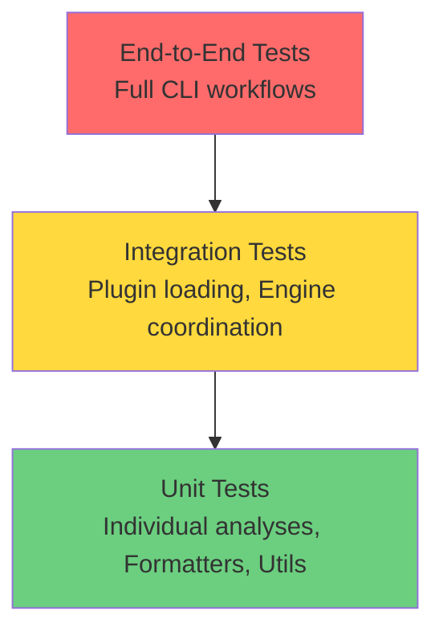
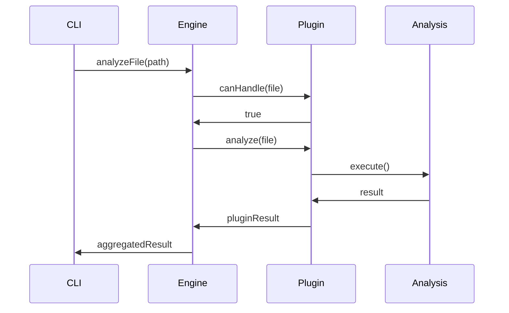

# Phase 6: Testing & Documentation

## Overview

Establish comprehensive test coverage and documentation for the plugin architecture refactor. This phase ensures the refactored system is reliable, maintainable, and accessible to developers through extensive testing at multiple levels and thorough documentation of architecture, APIs, and development workflows.

## Objectives

1. Achieve 90% test coverage across all refactored components
2. Create comprehensive unit tests for analysis classes and plugins
3. Build integration tests for plugin discovery and loading
4. Implement end-to-end tests for complete analysis workflows
5. Establish performance benchmarks and regression tests
6. Create detailed plugin development guide
7. Document migration path from old to new architecture
8. Generate API documentation for all public interfaces
9. Create architecture diagrams and decision records
10. Ensure all code has clear, useful documentation

## Technical Scope

### Testing Strategy

The testing approach follows the **Test Pyramid** pattern with emphasis on fast, isolated unit tests at the base and fewer, comprehensive integration tests at higher levels.



### Test Coverage Matrix

| Component        | Unit     | Integration | E2E | Target Coverage |
| ---------------- | -------- | ----------- | --- | --------------- |
| Analysis Classes | Required | Optional    | No  | 95%             |
| Plugin Classes   | Required | Required    | No  | 90%             |
| Plugin Loader    | Required | Required    | Yes | 90%             |
| Analysis Engine  | Required | Required    | Yes | 85%             |
| CLI Commands     | Required | Required    | Yes | 85%             |
| Formatters       | Required | Optional    | Yes | 95%             |
| Utilities        | Required | No          | No  | 95%             |

### Documentation Requirements

1. **API Documentation**: JSDoc for all public interfaces
2. **Architecture Documentation**: High-level design and decisions
3. **Plugin Development Guide**: How to create new analyzers
4. **Migration Guide**: Upgrading from old architecture
5. **User Documentation**: CLI usage and configuration
6. **Contributing Guide**: Development workflow and standards

## Refactoring Strategy

### Step 1: Unit Testing Infrastructure

Create test utilities and fixtures for consistent testing.

```typescript
// common/testing/src/test-utils.ts

import { Project, SourceFile } from 'ts-morph';

/**
 * Test utilities for analyzer testing
 */
export class TestUtils {
  /**
   * Create a SourceFile from code string
   */
  static createSourceFile(code: string, filePath = 'test.tsx'): SourceFile {
    const project = new Project({
      useInMemoryFileSystem: true,
      compilerOptions: {
        jsx: 4, // React JSX
        target: 99, // ESNext
        module: 99, // ESNext
      },
    });

    return project.createSourceFile(filePath, code);
  }

  /**
   * Create multiple source files
   */
  static createSourceFiles(files: Record<string, string>): Map<string, SourceFile> {
    const project = new Project({
      useInMemoryFileSystem: true,
      compilerOptions: {
        jsx: 4,
        target: 99,
        module: 99,
      },
    });

    const sourceFiles = new Map<string, SourceFile>();

    for (const [path, code] of Object.entries(files)) {
      sourceFiles.set(path, project.createSourceFile(path, code));
    }

    return sourceFiles;
  }

  /**
   * Assert analysis result structure
   */
  static assertAnalysisResult(result: any): void {
    expect(result).toBeDefined();
    expect(result.analysisId).toBeDefined();
    expect(result.data).toBeDefined();
    expect(result.insights).toBeInstanceOf(Array);
    expect(typeof result.executionTimeMs).toBe('number');
  }

  /**
   * Assert plugin result structure
   */
  static assertPluginResult(result: any): void {
    expect(result).toBeDefined();
    expect(result.pluginId).toBeDefined();
    expect(result.metrics).toBeDefined();
    expect(result.insights).toBeInstanceOf(Array);
    expect(typeof result.executionTimeMs).toBe('number');
  }
}

/**
 * Common test fixtures
 */
export const TestFixtures = {
  // Simple React component
  simpleComponent: `
    function Component() {
      const [count, setCount] = useState(0);
      return <button onClick={() => setCount(count + 1)}>{count}</button>;
    }
  `,

  // Complex component with multiple issues
  complexComponent: `
    function ComplexComponent({ items, enabled }) {
      // Conditional hook (critical issue)
      if (enabled) {
        const [state, setState] = useState(0);
      }

      // Effect without cleanup (warning)
      useEffect(async () => {
        const timer = setInterval(() => console.log('tick'), 1000);
        await fetch('/api/data');
      }, []);

      // Inline function props (performance issue)
      return (
        <div>
          {items.map((item, index) => (
            <Item
              key={index}
              onClick={() => console.log(item)}
              style={{ color: 'red' }}
            />
          ))}
        </div>
      );
    }
  `,

  // Clean, well-written component
  cleanComponent: `
    interface Props {
      name: string;
      count: number;
    }

    function CleanComponent({ name, count }: Props) {
      const [value, setValue] = useState(0);

      const handleClick = useCallback(() => {
        setValue(v => v + 1);
      }, []);

      return (
        <div>
          <h1>{name}</h1>
          <p>Count: {count}</p>
          <button onClick={handleClick}>Increment: {value}</button>
        </div>
      );
    }
  `,
};
```

### Step 2: Unit Tests for Analysis Classes

Test each analysis class in isolation.

```typescript
// analyzers/react/src/analyses/__tests__/structural-analysis.test.ts

import { describe, it, expect } from 'vitest';
import { StructuralAnalysis } from '../structural-analysis';
import { TestUtils, TestFixtures } from '@vipr/testing';

describe('StructuralAnalysis', () => {
  const analysis = new StructuralAnalysis();

  describe('metadata', () => {
    it('should have correct metadata', () => {
      expect(analysis.id).toBe('react-structural');
      expect(analysis.name).toBe('React Structural Complexity');
      expect(analysis.category).toBe('technical-debt');
      expect(analysis.defaultEnabled).toBe(true);
    });
  });

  describe('analyze', () => {
    it('should analyze simple component', () => {
      const sourceFile = TestUtils.createSourceFile(TestFixtures.simpleComponent);
      const result = analysis.analyze(sourceFile);

      TestUtils.assertAnalysisResult(result);
      expect(result.data.branches).toBeGreaterThanOrEqual(0);
      expect(result.data.jsxConditionals).toBeGreaterThanOrEqual(0);
      expect(result.score).toBeGreaterThanOrEqual(0);
    });

    it('should detect high structural complexity', () => {
      const code = `
        function Component({ data }) {
          if (!data) return null;
          if (data.loading) return <Loading />;
          if (data.error) return <Error />;

          return (
            <div>
              {data.items.map(item => (
                <div key={item.id}>
                  {item.active ? <ActiveItem /> : <InactiveItem />}
                  {item.featured && <Badge />}
                </div>
              ))}
            </div>
          );
        }
      `;

      const sourceFile = TestUtils.createSourceFile(code);
      const result = analysis.analyze(sourceFile);

      expect(result.data.branches).toBeGreaterThan(3);
      expect(result.data.earlyReturns).toBeGreaterThan(1);
      expect(result.insights.length).toBeGreaterThan(0);
    });

    it('should count JSX conditionals', () => {
      const code = `
        function Component({ show, user }) {
          return (
            <div>
              {show && <Content />}
              {user ? <Welcome /> : <Login />}
              {user?.isPremium && <PremiumFeature />}
            </div>
          );
        }
      `;

      const sourceFile = TestUtils.createSourceFile(code);
      const result = analysis.analyze(sourceFile);

      expect(result.data.jsxConditionals).toBeGreaterThanOrEqual(3);
    });

    it('should detect loops', () => {
      const code = `
        function Component() {
          const items = [];
          for (let i = 0; i < 10; i++) {
            items.push(<div key={i}>{i}</div>);
          }
          return <div>{items}</div>;
        }
      `;

      const sourceFile = TestUtils.createSourceFile(code);
      const result = analysis.analyze(sourceFile);

      expect(result.data.loops).toBeGreaterThanOrEqual(1);
    });

    it('should generate insights for high complexity', () => {
      const code = `
        function Component({ a, b, c, d }) {
          if (a && b && c && d) return <A />;
          if (a || b || c || d) return <B />;
          if (!a && !b) return <C />;
          if (a ? b : c) return <D />;
          return <E />;
        }
      `;

      const sourceFile = TestUtils.createSourceFile(code);
      const result = analysis.analyze(sourceFile);

      expect(result.insights.length).toBeGreaterThan(0);
      expect(result.insights[0].severity).toBe('warning');
      expect(result.insights[0].category).toBe('structural');
    });
  });

  describe('scoring', () => {
    it('should assign low score to complex code', () => {
      const sourceFile = TestUtils.createSourceFile(TestFixtures.complexComponent);
      const result = analysis.analyze(sourceFile);

      expect(result.score).toBeLessThan(80);
    });

    it('should assign high score to simple code', () => {
      const sourceFile = TestUtils.createSourceFile(TestFixtures.simpleComponent);
      const result = analysis.analyze(sourceFile);

      expect(result.score).toBeGreaterThan(80);
    });
  });

  describe('edge cases', () => {
    it('should handle empty file', () => {
      const sourceFile = TestUtils.createSourceFile('');
      const result = analysis.analyze(sourceFile);

      expect(result.data.branches).toBe(0);
      expect(result.insights.length).toBe(0);
    });

    it('should handle file without React', () => {
      const code = `
        function regularFunction(x: number): number {
          if (x > 0) return x;
          return -x;
        }
      `;

      const sourceFile = TestUtils.createSourceFile(code);
      const result = analysis.analyze(sourceFile);

      expect(result.data.jsxConditionals).toBe(0);
    });
  });
});
```

### Step 3: Integration Tests for Plugin System

Test plugin discovery, loading, and coordination.

```typescript
// analyzers/core/src/engine/__tests__/analysis-engine.integration.test.ts

import { describe, it, expect, beforeEach } from 'vitest';
import { AnalysisEngine } from '../analysis-engine';
import { ReactAnalyzerPlugin } from '@vipr/react';
import { TestUtils, TestFixtures } from '@vipr/testing';

describe('AnalysisEngine Integration', () => {
  let engine: AnalysisEngine;

  beforeEach(() => {
    engine = new AnalysisEngine({
      enableCache: false,
      debug: false,
    });
  });

  describe('plugin registration', () => {
    it('should register plugin', () => {
      const plugin = new ReactAnalyzerPlugin();
      engine.registerPlugin(plugin);

      const plugins = engine.getPlugins();
      expect(plugins).toHaveLength(1);
      expect(plugins[0].id).toBe('react');
    });

    it('should unregister plugin', () => {
      const plugin = new ReactAnalyzerPlugin();
      engine.registerPlugin(plugin);
      engine.unregisterPlugin('react');

      const plugins = engine.getPlugins();
      expect(plugins).toHaveLength(0);
    });

    it('should respect plugin priority', () => {
      const plugin1 = new ReactAnalyzerPlugin();
      const plugin2 = new ReactAnalyzerPlugin();

      engine.registerPlugin(plugin1, { priority: 1 });
      engine.registerPlugin(plugin2, { priority: 2 });

      const plugins = engine.getPlugins();
      expect(plugins[0]).toBe(plugin2); // Higher priority first
    });
  });

  describe('analysis execution', () => {
    it('should run analysis with plugin', async () => {
      const plugin = new ReactAnalyzerPlugin();
      engine.registerPlugin(plugin);

      const sourceFile = TestUtils.createSourceFile(TestFixtures.simpleComponent);
      const result = await engine.analyzeFile(sourceFile.getFilePath());

      expect(result).toBeDefined();
      expect(result.overallScore).toBeGreaterThanOrEqual(0);
      expect(result.overallScore).toBeLessThanOrEqual(100);
      expect(result.pluginResults.has('react')).toBe(true);
    });

    it('should run multiple plugins in parallel', async () => {
      const reactPlugin = new ReactAnalyzerPlugin();
      engine.registerPlugin(reactPlugin);

      const sourceFile = TestUtils.createSourceFile(TestFixtures.complexComponent);
      const result = await engine.analyzeFile(sourceFile.getFilePath());

      expect(result.pluginResults.size).toBeGreaterThanOrEqual(1);
      expect(result.executionTimeMs).toBeDefined();
    });

    it('should aggregate insights from multiple plugins', async () => {
      const plugin = new ReactAnalyzerPlugin();
      engine.registerPlugin(plugin);

      const sourceFile = TestUtils.createSourceFile(TestFixtures.complexComponent);
      const result = await engine.analyzeFile(sourceFile.getFilePath());

      expect(result.insights.length).toBeGreaterThan(0);
    });

    it('should handle plugin errors gracefully', async () => {
      const faultyPlugin = {
        id: 'faulty',
        name: 'Faulty Plugin',
        version: '1.0.0',
        filePatterns: ['**/*.tsx'],
        canHandle: () => true,
        analyze: () => {
          throw new Error('Plugin error');
        },
        getRules: () => [],
      };

      engine.registerPlugin(faultyPlugin as any);

      const sourceFile = TestUtils.createSourceFile(TestFixtures.simpleComponent);
      const result = await engine.analyzeFile(sourceFile.getFilePath());

      expect(result.errors.length).toBe(1);
      expect(result.errors[0].pluginId).toBe('faulty');
    });
  });

  describe('parallel execution', () => {
    it('should execute analyses in parallel', async () => {
      const plugin = new ReactAnalyzerPlugin();
      engine.registerPlugin(plugin);

      const files = {
        'file1.tsx': TestFixtures.simpleComponent,
        'file2.tsx': TestFixtures.complexComponent,
        'file3.tsx': TestFixtures.cleanComponent,
      };

      const sourceFiles = TestUtils.createSourceFiles(files);
      const filePaths = Array.from(sourceFiles.values()).map(sf => sf.getFilePath());

      const startTime = performance.now();
      const results = await engine.analyzeFiles(filePaths);
      const endTime = performance.now();

      expect(results).toHaveLength(3);
      expect(endTime - startTime).toBeLessThan(1000); // Should be fast
    });
  });

  describe('caching', () => {
    it('should cache results', async () => {
      const engineWithCache = new AnalysisEngine({
        enableCache: true,
        cacheTTL: 60000,
      });

      const plugin = new ReactAnalyzerPlugin();
      engineWithCache.registerPlugin(plugin);

      const sourceFile = TestUtils.createSourceFile(TestFixtures.simpleComponent);
      const filePath = sourceFile.getFilePath();

      const result1 = await engineWithCache.analyzeFile(filePath);
      const result2 = await engineWithCache.analyzeFile(filePath);

      expect(result1).toEqual(result2);
    });

    it('should invalidate cache', async () => {
      const engineWithCache = new AnalysisEngine({
        enableCache: true,
      });

      const plugin = new ReactAnalyzerPlugin();
      engineWithCache.registerPlugin(plugin);

      const sourceFile = TestUtils.createSourceFile(TestFixtures.simpleComponent);
      const filePath = sourceFile.getFilePath();

      await engineWithCache.analyzeFile(filePath);
      engineWithCache.invalidateCache(filePath);

      const result = await engineWithCache.analyzeFile(filePath);
      expect(result).toBeDefined();
    });
  });
});
```

### Step 4: End-to-End Tests for CLI

Test complete workflows from CLI invocation to output.

```typescript
// clients/cli/src/__tests__/cli.e2e.test.ts

import { describe, it, expect, beforeAll, afterAll } from 'vitest';
import { execSync } from 'child_process';
import fs from 'fs/promises';
import path from 'path';
import os from 'os';

describe('CLI End-to-End Tests', () => {
  let tempDir: string;
  let testFile: string;

  beforeAll(async () => {
    // Create temp directory
    tempDir = await fs.mkdtemp(path.join(os.tmpdir(), 'vipr-test-'));

    // Create test file
    testFile = path.join(tempDir, 'Component.tsx');
    await fs.writeFile(
      testFile,
      `
      function Component() {
        const [count, setCount] = useState(0);
        return <button onClick={() => setCount(count + 1)}>{count}</button>;
      }
      `
    );
  });

  afterAll(async () => {
    // Cleanup
    await fs.rm(tempDir, { recursive: true, force: true });
  });

  describe('basic analysis', () => {
    it('should analyze file and output to console', () => {
      const output = execSync(`node dist/index.js ${testFile}`, {
        encoding: 'utf-8',
      });

      expect(output).toContain('Vipr Code Quality Report');
      expect(output).toContain('Overall Score');
      expect(output).toContain('Grade');
    });

    it('should support --format json', () => {
      const output = execSync(`node dist/index.js ${testFile} --format json`, {
        encoding: 'utf-8',
      });

      const result = JSON.parse(output);
      expect(result).toHaveProperty('filePath');
      expect(result).toHaveProperty('overallScore');
      expect(result).toHaveProperty('overallGrade');
      expect(result).toHaveProperty('insights');
    });

    it('should write output to file', async () => {
      const outputFile = path.join(tempDir, 'report.json');

      execSync(`node dist/index.js ${testFile} --format json --output ${outputFile}`);

      const content = await fs.readFile(outputFile, 'utf-8');
      const result = JSON.parse(content);

      expect(result).toHaveProperty('filePath');
      expect(result).toHaveProperty('overallScore');
    });
  });

  describe('error handling', () => {
    it('should handle non-existent file', () => {
      expect(() => {
        execSync('node dist/index.js non-existent.tsx', {
          encoding: 'utf-8',
          stdio: 'pipe',
        });
      }).toThrow();
    });

    it('should display help with --help', () => {
      const output = execSync('node dist/index.js --help', {
        encoding: 'utf-8',
      });

      expect(output).toContain('USAGE');
      expect(output).toContain('OPTIONS');
      expect(output).toContain('EXAMPLES');
    });

    it('should display version with --version', () => {
      const output = execSync('node dist/index.js --version', {
        encoding: 'utf-8',
      });

      expect(output).toMatch(/v\d+\.\d+\.\d+/);
    });
  });

  describe('exit codes', () => {
    it('should exit 0 on success', () => {
      const result = execSync(`node dist/index.js ${testFile}`, {
        encoding: 'utf-8',
      });

      expect(result).toBeTruthy();
    });

    it('should exit 1 when below threshold', () => {
      expect(() => {
        execSync(`node dist/index.js ${testFile} --fail-threshold 100`, {
          encoding: 'utf-8',
          stdio: 'pipe',
        });
      }).toThrow();
    });
  });

  describe('multiple files', () => {
    it('should analyze multiple files', async () => {
      const file2 = path.join(tempDir, 'Component2.tsx');
      await fs.writeFile(
        file2,
        `
        function Component2() {
          return <div>Hello</div>;
        }
        `
      );

      const output = execSync(`node dist/index.js ${testFile} ${file2} --format json`, {
        encoding: 'utf-8',
      });

      const results = JSON.parse(output);
      expect(Array.isArray(results)).toBe(true);
      expect(results).toHaveLength(2);
    });
  });
});
```

### Step 5: Performance Benchmarks

Establish baseline performance metrics.

```typescript
// benchmarks/analysis-performance.bench.ts

import { describe, bench } from 'vitest';
import { AnalysisEngine } from '@vipr/core';
import { ReactAnalyzerPlugin } from '@vipr/react';
import { TestUtils, TestFixtures } from '@vipr/testing';

describe('Analysis Performance Benchmarks', () => {
  const engine = new AnalysisEngine({ enableCache: false });
  const plugin = new ReactAnalyzerPlugin();
  engine.registerPlugin(plugin);

  bench('analyze simple component', async () => {
    const sourceFile = TestUtils.createSourceFile(TestFixtures.simpleComponent);
    await engine.analyzeFile(sourceFile.getFilePath());
  });

  bench('analyze complex component', async () => {
    const sourceFile = TestUtils.createSourceFile(TestFixtures.complexComponent);
    await engine.analyzeFile(sourceFile.getFilePath());
  });

  bench('analyze 10 files in parallel', async () => {
    const files: Record<string, string> = {};
    for (let i = 0; i < 10; i++) {
      files[`file${i}.tsx`] = TestFixtures.simpleComponent;
    }

    const sourceFiles = TestUtils.createSourceFiles(files);
    const filePaths = Array.from(sourceFiles.values()).map(sf => sf.getFilePath());

    await engine.analyzeFiles(filePaths);
  });
});
```

## Documentation Structure

### 1. Plugin Development Guide

**File**: `docs/guides/plugin-development.md`

**Contents**:

- Introduction to plugin architecture
- Creating a new analyzer plugin
- Implementing `ITechnologyPlugin` interface
- Registering analyses with plugin
- Testing plugins
- Publishing plugins (future)

**Sections**:

```markdown
# Plugin Development Guide

## Overview

Introduction to the plugin system and architecture.

## Creating Your First Plugin

### 1. Set up the package structure

### 2. Implement ITechnologyPlugin

### 3. Create analysis classes

### 4. Register analyses

### 5. Test your plugin

### 6. Document your plugin

## Analysis Implementation

### IAnalysis Interface

### Scoring strategies

### Insight generation

### Performance considerations

## Best Practices

### Separation of concerns

### Testing strategies

### Error handling

### Performance optimization

## Examples

### Simple TypeScript analyzer

### React-specific patterns

### Multi-language support

## API Reference

### Plugin interfaces

### Analysis interfaces

### Utility functions
```

### 2. Migration Guide

**File**: `docs/guides/migration-guide.md`

**Contents**:

- Migrating from v2 to v3 architecture
- API changes and deprecations
- Configuration changes
- Code examples (before/after)
- Troubleshooting common issues

### 3. Architecture Documentation

**File**: `docs/architecture/plugin-architecture.md`

**Contents**:

- System overview
- Component diagrams
- Data flow diagrams
- Design patterns used
- Design decisions and rationale
- Performance characteristics

### 4. API Documentation

Generated from JSDoc comments using TypeDoc.

**Setup**:

```json
// typedoc.json
{
  "entryPoints": [
    "common/types/src/index.ts",
    "analyzers/core/src/index.ts",
    "analyzers/react/src/index.ts"
  ],
  "out": "docs/api",
  "exclude": ["**/*.test.ts", "**/*.spec.ts"],
  "includeVersion": true,
  "readme": "README.md"
}
```

### 5. Contributing Guide

**File**: `docs/CONTRIBUTING.md`

**Contents**:

- Development setup
- Code style guide
- Testing requirements
- Pull request process
- Code review guidelines
- Release process

## File Changes

### New Test Files

#### 1. Test Utilities

**File**: `common/testing/src/test-utils.ts`

- Helper functions for creating test fixtures
- Assertion utilities
- Mock data generators
- ~200 lines

#### 2. Test Fixtures

**File**: `common/testing/src/fixtures.ts`

- Reusable test code samples
- Sample components for testing
- Edge case examples
- ~300 lines

#### 3. Analysis Unit Tests

**Files**:

- `analyzers/react/src/analyses/__tests__/structural-analysis.test.ts` (~200 lines)
- `analyzers/react/src/analyses/__tests__/hook-analysis.test.ts` (~250 lines)
- `analyzers/react/src/analyses/__tests__/temporal-analysis.test.ts` (~300 lines)
- `analyzers/react/src/analyses/__tests__/coupling-analysis.test.ts` (~200 lines)
- `analyzers/react/src/analyses/__tests__/identity-analysis.test.ts` (~200 lines)
- `analyzers/react/src/analyses/__tests__/accessibility-analysis.test.ts` (~150 lines)

#### 4. Plugin Tests

**Files**:

- `analyzers/react/src/__tests__/plugin.test.ts` (~300 lines)
- `analyzers/core/src/__tests__/plugin.test.ts` (~200 lines)

#### 5. Engine Integration Tests

**File**: `analyzers/core/src/engine/__tests__/analysis-engine.integration.test.ts`

- ~400 lines

#### 6. CLI Tests

**Files**:

- `clients/cli/src/commands/__tests__/analyze-command.test.ts` (~200 lines)
- `clients/cli/src/formatters/__tests__/cli-formatter.test.ts` (~150 lines)
- `clients/cli/src/formatters/__tests__/json-formatter.test.ts` (~100 lines)
- `clients/cli/src/__tests__/cli.e2e.test.ts` (~300 lines)

#### 7. Performance Benchmarks

**File**: `benchmarks/analysis-performance.bench.ts`

- ~150 lines

### New Documentation Files

#### 1. Plugin Development Guide

**File**: `docs/guides/plugin-development.md`

- ~800 lines with examples

#### 2. Migration Guide

**File**: `docs/guides/migration-guide.md`

- ~500 lines

#### 3. Architecture Documentation

**File**: `docs/architecture/plugin-architecture.md`

- ~600 lines with diagrams

#### 4. Contributing Guide

**File**: `docs/CONTRIBUTING.md`

- ~400 lines

#### 5. API Documentation Config

**File**: `typedoc.json`

- ~30 lines

### Modified Files

#### 1. Root README

**File**: `README.md`

**Changes**:

- Update architecture overview
- Add plugin system section
- Update usage examples
- Add links to guides

#### 2. Package.json Scripts

**File**: `package.json`

**Changes**:

```json
{
  "scripts": {
    "test": "vitest run",
    "test:watch": "vitest watch",
    "test:coverage": "vitest run --coverage",
    "test:e2e": "vitest run --config vitest.e2e.config.ts",
    "bench": "vitest bench",
    "docs:api": "typedoc",
    "docs:serve": "http-server docs/api"
  }
}
```

#### 3. Vitest Config

**File**: `vitest.config.ts`

**Changes**:

```typescript
import { defineConfig } from 'vitest/config';

export default defineConfig({
  test: {
    coverage: {
      provider: 'v8',
      reporter: ['text', 'json', 'html'],
      exclude: ['node_modules/', 'dist/', '**/*.test.ts', '**/*.spec.ts'],
      thresholds: {
        lines: 90,
        functions: 90,
        branches: 85,
        statements: 90,
      },
    },
  },
});
```

## Dependencies

### Prerequisite Phases

All previous phases must be complete:

- Phase 1: Type System & Interfaces
- Phase 2: Plugin Discovery & Loading
- Phase 3: Engine Enhancements
- Phase 4: Analyzer Refactoring
- Phase 5: CLI Refactoring

### Test Dependencies

**New Dev Dependencies**:

```json
{
  "devDependencies": {
    "vitest": "^1.0.0",
    "@vitest/coverage-v8": "^1.0.0",
    "typedoc": "^0.25.0",
    "http-server": "^14.1.1"
  }
}
```

## Acceptance Criteria

### Test Coverage

1. Overall code coverage: 90%
2. Analysis classes coverage: 95%
3. Plugin classes coverage: 90%
4. Engine coverage: 85%
5. CLI coverage: 85%
6. Formatters coverage: 95%

### Test Quality

1. All tests have clear, descriptive names
2. Tests follow AAA pattern (Arrange, Act, Assert)
3. No flaky tests in CI
4. All edge cases covered
5. Performance benchmarks established

### Documentation Quality

1. All public APIs have JSDoc comments
2. All interfaces documented with examples
3. Architecture diagrams are clear and accurate
4. Migration guide covers all breaking changes
5. Plugin development guide has working examples
6. README is up-to-date and accurate

### Continuous Integration

1. All tests pass in CI
2. Coverage thresholds enforced
3. Documentation builds successfully
4. Benchmarks tracked over time
5. No regressions detected

## Recommended Claude Model

**Primary Model**: Claude Sonnet 4.5

- Writing tests is well-suited for Sonnet
- Documentation creation is straightforward
- Cost-effective for large volume of test code

**Secondary Model**: Claude Opus 4.5

- Use for complex integration test scenarios
- Architecture documentation and diagrams
- Review and validation of test coverage

## Assigned Subagents

### Unit Testing Agent

**Model**: Sonnet 4.5
**Responsibilities**:

- Write unit tests for all analysis classes
- Write unit tests for formatters
- Create test utilities and fixtures
- Ensure 95% coverage for unit-tested components

### Integration Testing Agent

**Model**: Sonnet 4.5
**Responsibilities**:

- Write integration tests for engine
- Write integration tests for plugin loading
- Test parallel execution
- Test error handling

### E2E Testing Agent

**Model**: Sonnet 4.5
**Responsibilities**:

- Write CLI end-to-end tests
- Test complete workflows
- Test output formats
- Test error scenarios

### Performance Testing Agent

**Model**: Sonnet 4.5
**Responsibilities**:

- Create performance benchmarks
- Establish baseline metrics
- Test parallel execution performance
- Monitor for regressions

### Documentation Agent

**Model**: Opus 4.5
**Responsibilities**:

- Write plugin development guide
- Write migration guide
- Create architecture documentation
- Generate API documentation
- Review all documentation for clarity

### Code Review Agent

**Model**: Opus 4.5
**Responsibilities**:

- Review test coverage
- Validate test quality
- Review documentation accuracy
- Ensure consistency across docs

## Metrics for Success

### Test Metrics

- Code coverage: > 90%
- Test pass rate: 100%
- Test execution time: < 30 seconds
- Flaky test rate: 0%
- Benchmark variance: < 5%

### Documentation Metrics

- API documentation completeness: 100%
- Example code in docs: > 20 examples
- Documentation build success: 100%
- Broken links: 0
- User feedback score: > 4/5

### Quality Metrics

- Zero critical bugs in production
- Test reliability: 99.9%
- Coverage trend: Increasing
- Documentation freshness: < 1 week old

## Testing Best Practices

### 1. Test Naming Convention

```typescript
describe('ComponentName', () => {
  describe('methodName', () => {
    it('should do something when condition', () => {
      // Test implementation
    });
  });
});
```

### 2. AAA Pattern

```typescript
it('should calculate score correctly', () => {
  // Arrange
  const analysis = new StructuralAnalysis();
  const sourceFile = TestUtils.createSourceFile(code);

  // Act
  const result = analysis.analyze(sourceFile);

  // Assert
  expect(result.score).toBe(expectedScore);
});
```

### 3. Test Data Builders

```typescript
class ComponentBuilder {
  private code = '';

  withHooks(count: number): this {
    // Add hooks to code
    return this;
  }

  withComplexity(level: 'low' | 'medium' | 'high'): this {
    // Add complexity to code
    return this;
  }

  build(): SourceFile {
    return TestUtils.createSourceFile(this.code);
  }
}
```

### 4. Snapshot Testing (Use Sparingly)

```typescript
it('should match expected output', () => {
  const output = formatter.format(result);
  expect(output).toMatchSnapshot();
});
```

## Documentation Best Practices

### 1. JSDoc Standards

````typescript
/**
 * Analyzes structural complexity of React components
 *
 * Examines branching, conditionals, loops, and control flow patterns
 * to determine cognitive load and maintainability metrics.
 *
 * @example
 * ```typescript
 * const analysis = new StructuralAnalysis();
 * const result = analysis.analyze(sourceFile);
 * console.log(result.score); // 85
 * ```
 *
 * @see {@link IAnalysis} for the base interface
 */
export class StructuralAnalysis implements IAnalysis { ... }
````

### 2. README Structure

```markdown
# Project Name

Brief description

## Features

- Feature 1
- Feature 2

## Installation

\`\`\`bash
npm install @vipr/package
\`\`\`

## Quick Start

\`\`\`typescript
// Example code
\`\`\`

## Documentation

- [Plugin Development Guide](docs/guides/plugin-development.md)
- [API Documentation](docs/api/index.html)

## Contributing

See [CONTRIBUTING.md](docs/CONTRIBUTING.md)
```

### 3. Mermaid Diagrams



## Risk Mitigation

### High-Risk Areas

1. **Test Flakiness**: Timing-dependent tests
   - **Mitigation**: Avoid timing assumptions, use deterministic fixtures

2. **Documentation Drift**: Code changes without doc updates
   - **Mitigation**: CI check for doc completeness, automated API doc generation

3. **Coverage Gaming**: Tests that increase coverage without value
   - **Mitigation**: Manual review of test quality, focus on meaningful assertions

4. **E2E Test Brittleness**: Environment-dependent failures
   - **Mitigation**: Use temp directories, clean up properly, mock external dependencies

### Maintenance Strategy

1. Regular doc review sprints
2. Test health monitoring
3. Coverage trend tracking
4. Benchmark regression alerts
5. User feedback collection
