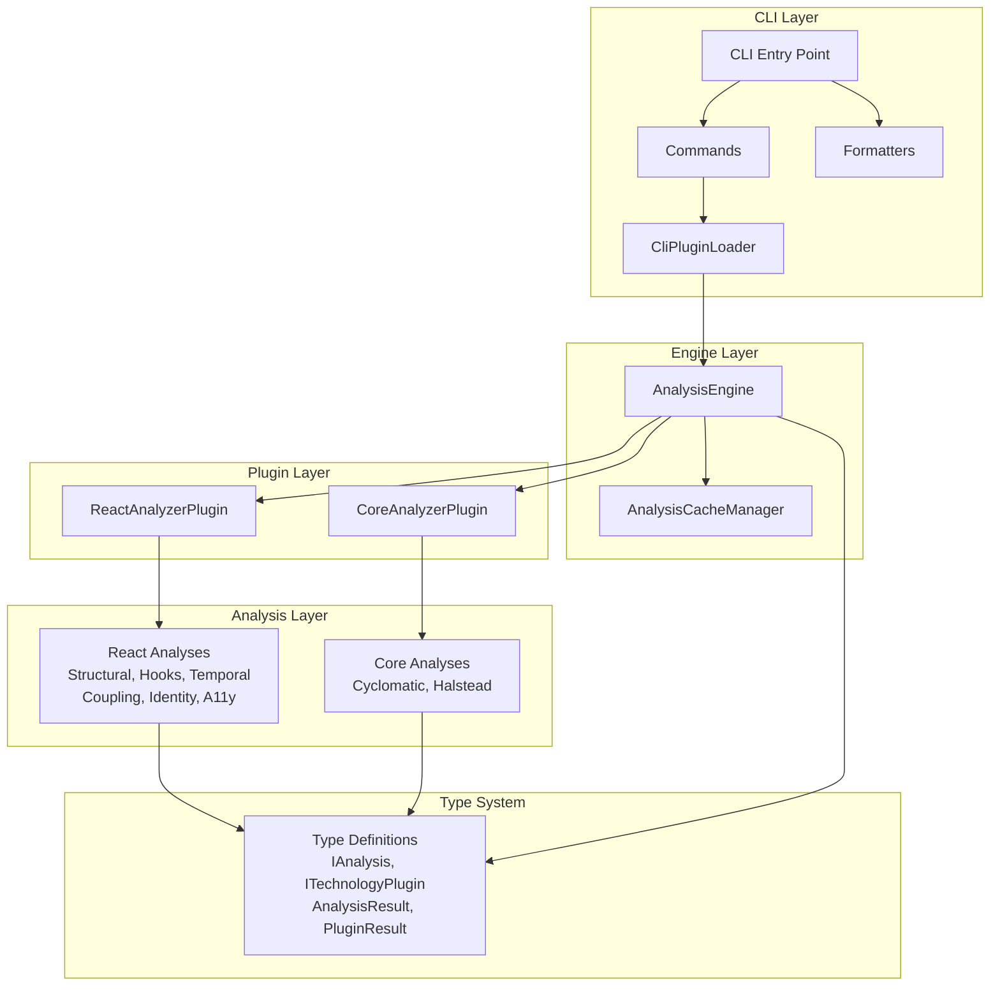
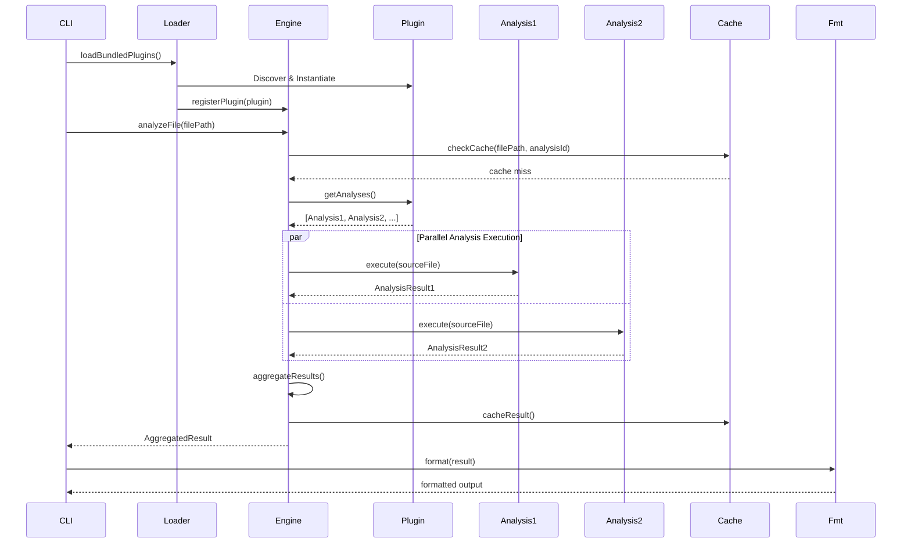
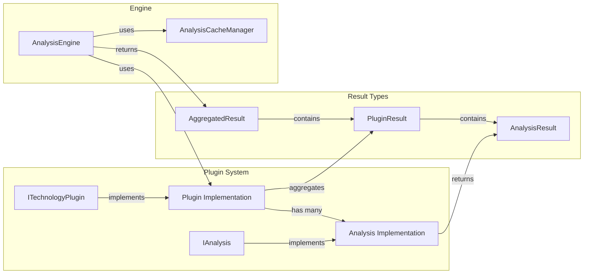

# V3 Architecture Summary

## Overview

The V3 refactor transforms Vipr from a monolithic React analyzer into a flexible, plugin-based architecture with discrete, parallelizable analysis units. This document provides technical context for engineers working within the new system.

## What Was Achieved

### Phase 0: Plugin Architecture Foundation

Established the vision for a decoupled plugin system where:

- CLI has no direct dependencies on specific analyzers
- Plugins auto-discover from workspace packages
- Analyses register as discrete units within plugins
- Parallel execution at file, plugin, and analysis levels

### Phase 1: Type System & Interfaces

Created the foundational type contracts:

- `IAnalysis<TConfig, TResult, TMetrics>` - Generic interface for discrete analysis units
- Enhanced `ITechnologyPlugin` with `getAnalyses()` method
- Type-safe result aggregation structures
- Analysis categories as discriminated unions
- Backward-compatible plugin interface extensions

**Key Files:**

- `common/types/src/analysis/IAnalysis.ts` - Core analysis interface
- `common/types/src/plugin/index.ts` - Enhanced plugin interface

### Phase 2: Plugin Discovery & Loading

Implemented automatic plugin discovery:

- `common/plugin-loader` package for workspace scanning
- Dynamic plugin loading with validation
- Plugin registry with priority-based ordering
- `common/analyzer-template` for scaffolding new analyzers

**Key Files:**

- `common/plugin-loader/src/discovery/workspace-scanner.ts`
- `common/plugin-loader/src/loader/dynamic-loader.ts`
- `common/analyzer-template/bin/create-analyzer.ts`

### Phase 3: Engine Enhancements

Enhanced `AnalysisEngine` for analysis-level parallelization:

- Dual-path execution (legacy plugins vs. enhanced plugins)
- Parallel analysis execution within plugins
- Analysis-level caching with granular cache keys
- Cost-based scheduling for optimal performance
- Result aggregation from multiple concurrent analyses

**Key Files:**

- `analyzers/core/src/engine/analysis-engine.ts` - Enhanced engine
- `analyzers/core/src/engine/analysis-cache.ts` - Granular caching

### Phase 4: Analyzer Refactoring

Refactored monolithic analyzers into discrete analysis classes:

- Extracted React analyses: Structural, Hooks, Temporal, Coupling, Identity, Accessibility
- Created `CoreAnalyzerPlugin` for framework-agnostic analyses (Cyclomatic Complexity, Halstead Metrics)
- Each analysis implements `IAnalysis` interface
- Plugins register analyses in constructor
- Maintained 100% backward compatibility

**Key Files:**

- `analyzers/react/src/analyses/*.ts` - Individual React analyses
- `analyzers/core/src/analyses/*.ts` - Core analyses
- `analyzers/react/src/plugin.ts` - Refactored React plugin
- `analyzers/core/src/plugin.ts` - New core plugin

### Phase 5: CLI Refactoring

Decoupled CLI from specific analyzers:

- Removed direct `@vipr/react` dependency
- Created `CliPluginLoader` for dynamic plugin discovery
- Implemented formatter system (Strategy pattern) for multiple output formats
- Command pattern for extensible CLI commands
- Clean separation of concerns

**Key Files:**

- `clients/cli/src/plugins/loader.ts` - Plugin loader
- `clients/cli/src/formatters/*.ts` - Output formatters
- `clients/cli/src/commands/*.ts` - CLI commands

### Phase 6: Testing & Documentation

Established comprehensive testing and documentation:

- Created `@vipr/testing` package with test utilities and fixtures
- Unit tests for all analysis classes
- Integration tests for engine and plugins
- CLI formatter and command tests
- Performance benchmarks
- Plugin development guide, migration guide, architecture documentation

**Key Files:**

- `common/testing/src/*.ts` - Test utilities
- `docs/guides/plugin-development.md`
- `docs/guides/migration-guide.md`
- `docs/architecture/plugin-architecture.md`

## System Architecture



## Execution Flow



## Component Relationships



## Key Technical Concepts

### IAnalysis Interface

Every analysis implements this interface:

```typescript
interface IAnalysis<TConfig, TResult, TMetrics> {
  readonly id: string;
  readonly category: AnalysisCategory;
  readonly name: string;
  readonly enabledByDefault: boolean;
  readonly executionCost: 1 | 2 | 3;

  execute(sourceFile: SourceFile, config?: AnalyzerConfig): AnalysisResult<TResult, TMetrics>;
  validateConfig(config: TConfig): true | string;
  getDefaultConfig(): TConfig;
}
```

**Key Points:**

- Generic over config and result types for type safety
- Each analysis has unique ID (e.g., `'react-structural'`)
- Category enables grouping and filtering
- Execution cost used for scheduling optimization

### Plugin Registration Pattern

Plugins register analyses in constructor:

```typescript
class ReactAnalyzerPlugin implements ITechnologyPlugin {
  private analyses: Map<string, IAnalysis> = new Map();

  constructor() {
    this.registerAnalyses();
  }

  private registerAnalyses(): void {
    this.analyses.set('react-structural', new StructuralAnalysis());
    this.analyses.set('react-hooks', new HookAnalysis());
    // ... more analyses
  }

  getAnalyses(): IAnalysis[] {
    return Array.from(this.analyses.values());
  }
}
```

### Dual-Path Execution

The engine supports both legacy and enhanced plugins:

**Legacy Path** (backward compatibility):

- Plugin lacks `getAnalyses()` method
- Executes `plugin.analyze()` directly
- Returns standard `PluginResult`

**Enhanced Path** (new architecture):

- Plugin implements `getAnalyses()`
- Engine discovers registered analyses
- Executes analyses in parallel
- Aggregates results with `analysisBreakdown`

### Parallelization Levels

Three levels of parallelization:

1. **File-level**: Multiple files analyzed concurrently
2. **Plugin-level**: Multiple plugins per file execute concurrently
3. **Analysis-level**: Multiple analyses per plugin execute concurrently (new in V3)

### Caching Strategy

Two-level caching system:

1. **File-level cache**: Complete analysis results per file
2. **Analysis-level cache**: Individual analysis results with granular keys

Cache key format: `${filePath}:${pluginId}:${analysisId}:${contentHash}`

Benefits:

- Partial cache hits when only some analyses need re-execution
- Selective invalidation per analysis
- Improved hit rates for incremental changes

### Result Aggregation

Results flow through aggregation layers:

```
AnalysisResult (from IAnalysis.execute)
  ↓
PluginResult (aggregated by plugin, contains analysisBreakdown)
  ↓
AggregatedResult (aggregated by engine, contains all pluginResults)
```

**Score Calculation:**

- Analysis scores (0-100) averaged at plugin level
- Plugin scores weighted and combined at engine level
- Missing scores don't contribute to average

**Insight Merging:**

- All insights concatenated
- Duplicate detection via content hash
- Source tracking maintains analysis origin

## Package Structure

```
vipr/
├── analyzers/
│   ├── core/              # Framework-agnostic analyses
│   │   ├── src/
│   │   │   ├── analyses/  # Cyclomatic, Halstead
│   │   │   ├── engine/    # AnalysisEngine
│   │   │   └── plugin.ts  # CoreAnalyzerPlugin
│   │   └── package.json
│   └── react/             # React-specific analyses
│       ├── src/
│       │   ├── analyses/  # Structural, Hooks, Temporal, etc.
│       │   └── plugin.ts  # ReactAnalyzerPlugin
│       └── package.json
├── clients/
│   └── cli/               # CLI application
│       ├── src/
│       │   ├── commands/  # AnalyzeCommand, etc.
│       │   ├── formatters/ # CliFormatter, JsonFormatter
│       │   └── plugins/   # CliPluginLoader
│       └── package.json
├── common/
│   ├── types/             # Type definitions
│   ├── testing/           # Test utilities & fixtures
│   ├── plugin-loader/     # Plugin discovery system
│   └── analyzer-template/ # Analyzer scaffolding
└── docs/
    ├── v3/                # Phase documentation
    ├── guides/            # Development guides
    └── architecture/      # Architecture docs
```

## Working with the Architecture

### Creating a New Analysis

1. Implement `IAnalysis` interface:

```typescript
export class MyAnalysis implements IAnalysis<unknown, MyResult> {
  readonly id = 'my-analysis';
  readonly category = 'technical-debt' as const;
  // ... implement interface
}
```

2. Register in plugin:

```typescript
private registerAnalyses(): void {
  this.analyses.set('my-analysis', new MyAnalysis());
}
```

3. Analysis executes automatically when plugin runs

### Creating a New Plugin

1. Use analyzer template:

```bash
pnpm create-analyzer
```

2. Implement `ITechnologyPlugin`:

```typescript
export class MyPlugin implements ITechnologyPlugin {
  private analyses: Map<string, IAnalysis> = new Map();

  constructor() {
    this.registerAnalyses();
  }

  getAnalyses(): IAnalysis[] {
    return Array.from(this.analyses.values());
  }
  // ... implement interface
}
```

3. Plugin auto-discovers if in `analyzers/*` directory

### Extending the Engine

The engine is extensible through:

- Plugin registration system
- Analysis-level caching hooks
- Custom execution strategies
- Result aggregation customization

### Configuration

Analyses can be enabled/disabled per plugin:

```typescript
const config: AnalyzerConfig = {
  analyses: {
    'react-structural': { enabled: true },
    'react-hooks': { enabled: false },
  },
};
```

## Performance Characteristics

- **File-level parallelization**: Linear speedup with file count
- **Analysis-level parallelization**: Near-linear speedup within plugin
- **Caching**: 50-90% cache hit rate for incremental changes
- **Cost-based scheduling**: Low-cost analyses run first, improving perceived performance

## Migration Notes

- Existing plugins continue to work (legacy path)
- New plugins should implement `getAnalyses()` for parallel execution
- CLI interface unchanged (backward compatible)
- Result structure enhanced but maintains compatibility

## Next Steps

The architecture is now ready for:

- Additional analyzer plugins (Vue, Angular, etc.)
- Custom analysis implementations
- Plugin marketplace (future)
- Incremental analysis (only analyze changed files)
- Language server integration
