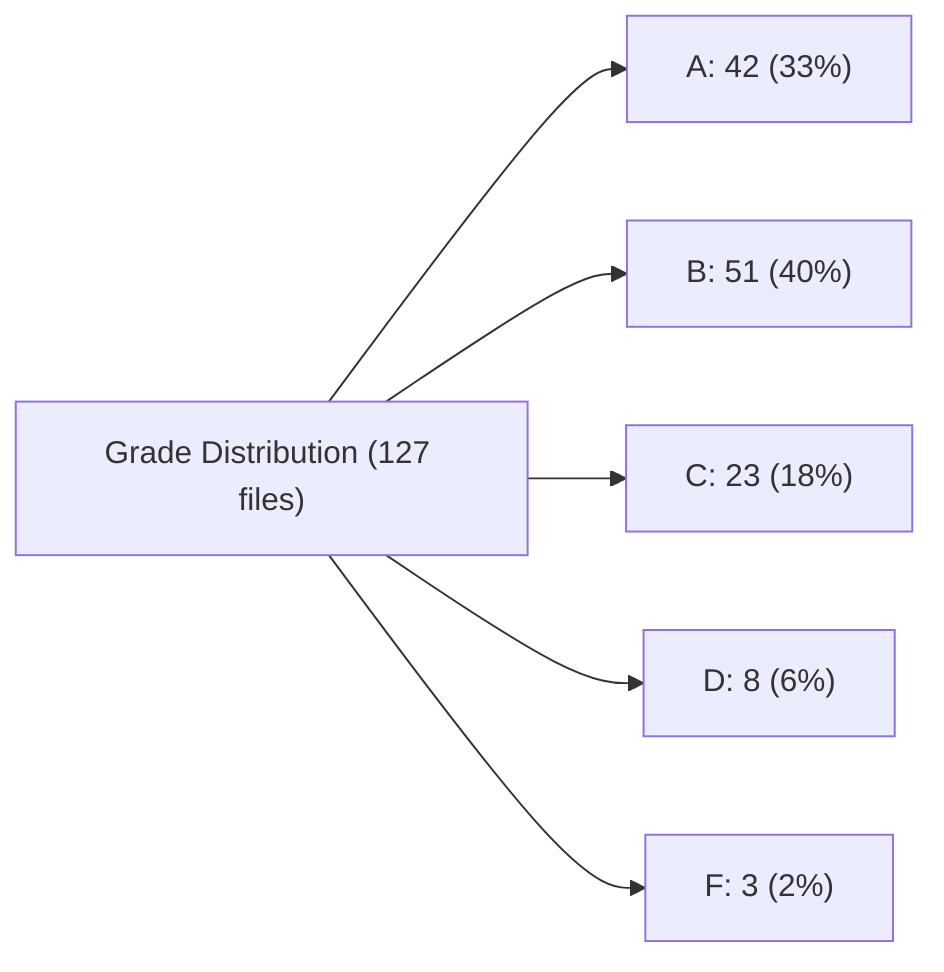

# Metrics Visualization Specification

## Overview

This document specifies how React Complexity Analyzer metrics should be visualized in the VS Code extension. The visualization strategy balances information density with readability, leveraging VS Code's built-in diagnostic and decoration APIs.

## Grade System Reference

All visualizations use the normalized 0-100 scoring system:

| Grade | Score Range | Label     | Action Required      |
| ----- | ----------- | --------- | -------------------- |
| A     | 0-25        | Excellent | No action needed     |
| B     | 25-45       | Good      | No action needed     |
| C     | 45-65       | Fair      | Consider refactoring |
| D     | 65-80       | Poor      | Needs refactoring    |
| F     | 80+         | Critical  | Must refactor        |

## 1. CodeLens Display Strategy

### 1.1 Display Thresholds

CodeLens indicators appear above component declarations based on score thresholds:

| Score Range | Display Rule              | Rationale                                |
| ----------- | ------------------------- | ---------------------------------------- |
| 0-25 (A)    | Hidden by default         | Excellent code doesn't need visual noise |
| 25-45 (B)   | Hidden by default         | Good code doesn't need visual noise      |
| 45-65 (C)   | Show with info styling    | Fair code benefits from awareness        |
| 65-80 (D)   | Show with warning styling | Poor code needs attention                |
| 80+ (F)     | Show with error styling   | Critical code demands immediate action   |

**Configuration Override:**

```json
{
  "reactComplexity.codeLens.showAllGrades": false,
  "reactComplexity.codeLens.minimumGrade": "C"
}
```

### 1.2 Color Coding Scheme

#### Vibrant Neon Color Mapping (Theme-Universal)

**Note:** Colors use a slightly washed/desaturated palette for better readability and reduced eye strain.

| Grade | Unified Color   | Hex Code  | CSS RGB              | Description               |
| ----- | --------------- | --------- | -------------------- | ------------------------- |
| A     | Soft Neon Green | `#66ffaa` | `rgb(102, 255, 170)` | Gentle success indicator  |
| B     | Soft Cyan       | `#66ddff` | `rgb(102, 221, 255)` | Calm electric blue        |
| C     | Soft Yellow     | `#ffee66` | `rgb(255, 238, 102)` | Muted warning             |
| D     | Soft Orange     | `#ffaa66` | `rgb(255, 170, 102)` | Gentle alert              |
| F     | Soft Neon Red   | `#ff6688` | `rgb(255, 102, 136)` | Softened critical warning |

#### Semantic VSCode Tokens

Use these washed colors with opacity adjustments for theme compatibility:

```typescript
const colorMapping = {
  A: { light: '#44cc88', dark: '#66ffaa' }, // Soft Green
  B: { light: '#44bbdd', dark: '#66ddff' }, // Soft Cyan
  C: { light: '#ddbb44', dark: '#ffee66' }, // Soft Yellow
  D: { light: '#dd8844', dark: '#ffaa66' }, // Soft Orange
  F: { light: '#dd4466', dark: '#ff6688' }, // Soft Red
};

// For programmatic use with theme detection
function getGradeColor(grade: Grade, theme: 'light' | 'dark'): string {
  return colorMapping[grade][theme];
}
```

### 1.3 Information Density

#### Inline CodeLens Content

Display minimal information inline, with progressive disclosure on hover:

```typescript
// Grade C-D: Show score + grade
`Complexity: ${score.toFixed(1)} (${grade})`
// Grade F: Show score + critical warning
`Complexity: ${score.toFixed(1)} (${grade}) - Refactor Required`;
```

**Example Rendering:**

```typescript
export const ComplexComponent: React.FC<Props> = props => {
  // ^ Complexity: 58.3 (C) - Consider refactoring
  // ...
};
```

#### Hover Tooltip Content Structure

```text
━━━━━━━━━━━━━━━━━━━━━━━━━━━━━━━━
  React Complexity: 58.3 (Grade C)
━━━━━━━━━━━━━━━━━━━━━━━━━━━━━━━━

Dimension Breakdown:
  • Structural:  18.2 / 25  (73%)
  • Hooks:       12.4 / 20  (62%)
  • Temporal:     8.1 / 15  (54%)
  • Coupling:     5.3 / 10  (53%)
  • Identity:     4.2 / 10  (42%)

Primary Issues:
  • High structural complexity (18 branches)
  • 8 effects with risky dependency patterns

Suggestions:
  • Extract 3 custom hooks
  • Split into 2 sub-components

Click to view full report
```

#### Markdown Hover Content Implementation

```typescript
const hoverContent = new vscode.MarkdownString();
hoverContent.isTrusted = true;
hoverContent.supportHtml = true;

hoverContent.appendMarkdown(`### React Complexity: ${score} (${grade})\n\n`);
hoverContent.appendMarkdown(`**Dimension Breakdown:**\n\n`);
hoverContent.appendMarkdown(`| Dimension | Score | Max | Percentage |\n`);
hoverContent.appendMarkdown(`|-----------|-------|-----|------------|\n`);
hoverContent.appendMarkdown(
  `| Structural | ${structural} | 25 | ${((structural / 25) * 100).toFixed(0)}% |\n`
);
// ... additional dimensions
hoverContent.appendMarkdown(`\n[View Full Analysis](command:reactComplexity.showFullReport)\n`);
```

### 1.4 Multi-Component Files Handling

For files with multiple components:

1. **Primary Strategy:** Show CodeLens for each component individually
2. **File-Level Aggregate:** Optional CodeLens at file top showing aggregate metrics

```typescript
// File: UserProfile.tsx
// [File] Complexity: 42.1 (B) - 3 components analyzed

export const UserAvatar: React.FC = () => {
  /* ... */
};
// ^ Complexity: 12.3 (A)

export const UserProfile: React.FC = () => {
  /* ... */
};
// ^ Complexity: 58.7 (C) - Consider refactoring

export const UserSettings: React.FC = () => {
  /* ... */
};
// ^ Complexity: 45.2 (B)
```

**Aggregation Formula:**

```
fileScore = weightedAverage(componentScores, componentLineCount)
```

## 2. Sidebar Dashboard Design

### 2.1 Metric Cards Specification

#### Top-Level Cards

Display 4 primary metric cards in 2x2 grid:

```typescript
interface MetricCard {
  title: string;
  value: number | string;
  grade?: Grade;
  trend?: 'up' | 'down' | 'stable';
  icon: string;
  color: string;
}
```

**Card Layout:**

```
┌─────────────────────┬─────────────────────┐
│ [SCORE] Avg Score   │ [FILES] Files       │
│                     │                     │
│     42.3 (B)        │        127          │
│     ↓ 3.2          │     +12 new         │
└─────────────────────┴─────────────────────┘
┌─────────────────────┬─────────────────────┐
│ [CRIT] Critical     │ [WARN] Warnings     │
│                     │                     │
│        8            │        34           │
│     +2 new          │     -5 fixed        │
└─────────────────────┴─────────────────────┘
```

**Webview HTML Template:**

```html
<div class="metric-cards">
  <div class="metric-card" data-grade="B">
    <div class="card-icon">[SCORE]</div>
    <div class="card-content">
      <h3>Average Score</h3>
      <div class="card-value">42.3 <span class="grade-badge grade-b">B</span></div>
      <div class="card-trend trend-down">↓ 3.2 from last analysis</div>
    </div>
  </div>
  <!-- Additional cards -->
</div>

<style>
  .metric-card {
    background: var(--vscode-editor-background);
    border: 1px solid var(--vscode-panel-border);
    border-radius: 6px;
    padding: 16px;
    display: flex;
    gap: 12px;
    transition: border-color 0.2s;
  }

  .metric-card[data-grade='F'] {
    border-left: 4px solid #ff6688;
    box-shadow: 0 0 12px rgba(255, 102, 136, 0.3);
  }

  .metric-card[data-grade='D'] {
    border-left: 4px solid #ffaa66;
    box-shadow: 0 0 12px rgba(255, 170, 102, 0.3);
  }

  .metric-card[data-grade='C'] {
    border-left: 4px solid #ffee66;
    box-shadow: 0 0 12px rgba(255, 238, 102, 0.3);
  }

  .metric-card[data-grade='B'] {
    border-left: 4px solid #66ddff;
    box-shadow: 0 0 12px rgba(102, 221, 255, 0.2);
  }

  .metric-card[data-grade='A'] {
    border-left: 4px solid #66ffaa;
    box-shadow: 0 0 12px rgba(102, 255, 170, 0.2);
  }

  .card-value {
    font-size: 28px;
    font-weight: 600;
    color: var(--vscode-foreground);
  }

  .grade-badge {
    display: inline-block;
    padding: 2px 8px;
    border-radius: 4px;
    font-size: 14px;
    font-weight: bold;
    text-shadow: 0 0 8px currentColor;
  }

  .grade-f {
    background: linear-gradient(135deg, #ff6688, #dd4466);
    color: white;
    box-shadow: 0 0 16px rgba(255, 102, 136, 0.6);
  }

  .grade-d {
    background: linear-gradient(135deg, #ffaa66, #dd8844);
    color: white;
    box-shadow: 0 0 16px rgba(255, 170, 102, 0.6);
  }

  .grade-c {
    background: linear-gradient(135deg, #ffee66, #ddbb44);
    color: black;
    box-shadow: 0 0 16px rgba(255, 238, 102, 0.6);
  }

  .grade-b {
    background: linear-gradient(135deg, #66ddff, #44bbdd);
    color: white;
    box-shadow: 0 0 16px rgba(102, 221, 255, 0.6);
  }

  .grade-a {
    background: linear-gradient(135deg, #66ffaa, #44cc88);
    color: black;
    box-shadow: 0 0 16px rgba(102, 255, 170, 0.6);
  }

  .trend-down {
    color: #66ffaa;
    text-shadow: 0 0 4px rgba(102, 255, 170, 0.8);
  }

  .trend-up {
    color: #ff6688;
    text-shadow: 0 0 4px rgba(255, 102, 136, 0.8);
  }
</style>
```

### 2.2 Grade Distribution Visualization

Use a horizontal stacked bar chart with absolute counts:



**SVG Implementation:**

```html
<div class="grade-distribution">
  <h3>Grade Distribution</h3>
  <div class="distribution-bar">
    <div class="grade-segment grade-a" style="width: 33%;" title="A: 42 files">
      <span class="segment-label">A: 42</span>
    </div>
    <div class="grade-segment grade-b" style="width: 40%;" title="B: 51 files">
      <span class="segment-label">B: 51</span>
    </div>
    <div class="grade-segment grade-c" style="width: 18%;" title="C: 23 files">
      <span class="segment-label">C: 23</span>
    </div>
    <div class="grade-segment grade-d" style="width: 6%;" title="D: 8 files">
      <span class="segment-label">D: 8</span>
    </div>
    <div class="grade-segment grade-f" style="width: 2%;" title="F: 3 files">
      <span class="segment-label">F: 3</span>
    </div>
  </div>
  <div class="distribution-legend">
    <span><span class="legend-color grade-a"></span> Excellent (A)</span>
    <span><span class="legend-color grade-b"></span> Good (B)</span>
    <span><span class="legend-color grade-c"></span> Fair (C)</span>
    <span><span class="legend-color grade-d"></span> Poor (D)</span>
    <span><span class="legend-color grade-f"></span> Critical (F)</span>
  </div>
</div>

<style>
  .distribution-bar {
    display: flex;
    height: 40px;
    border-radius: 4px;
    overflow: hidden;
    margin: 12px 0;
  }

  .grade-segment {
    display: flex;
    align-items: center;
    justify-content: center;
    color: white;
    font-weight: 600;
    font-size: 12px;
    transition:
      opacity 0.2s,
      filter 0.2s;
    text-shadow: 0 0 8px rgba(0, 0, 0, 0.8);
  }

  .grade-segment:hover {
    opacity: 0.8;
    cursor: pointer;
    filter: brightness(1.2);
  }

  .grade-segment.grade-a {
    background: linear-gradient(180deg, #66ffaa, #44cc88);
    box-shadow: inset 0 0 20px rgba(102, 255, 170, 0.5);
  }

  .grade-segment.grade-b {
    background: linear-gradient(180deg, #66ddff, #44bbdd);
    box-shadow: inset 0 0 20px rgba(102, 221, 255, 0.5);
  }

  .grade-segment.grade-c {
    background: linear-gradient(180deg, #ffee66, #ddbb44);
    box-shadow: inset 0 0 20px rgba(255, 238, 102, 0.5);
    color: black;
    text-shadow: 0 0 8px rgba(255, 255, 255, 0.8);
  }

  .grade-segment.grade-d {
    background: linear-gradient(180deg, #ffaa66, #dd8844);
    box-shadow: inset 0 0 20px rgba(255, 170, 102, 0.5);
  }

  .grade-segment.grade-f {
    background: linear-gradient(180deg, #ff6688, #dd4466);
    box-shadow: inset 0 0 20px rgba(255, 102, 136, 0.5);
  }

  .segment-label {
    display: inline-block;
    white-space: nowrap;
    padding: 0 8px;
  }

  .distribution-legend {
    display: flex;
    gap: 16px;
    flex-wrap: wrap;
    font-size: 12px;
  }

  .legend-color {
    display: inline-block;
    width: 12px;
    height: 12px;
    border-radius: 2px;
    margin-right: 4px;
    box-shadow: 0 0 4px currentColor;
  }
</style>
```

### 2.3 Hotspot List Criteria

Display top N components by complexity score with configurable sorting:

**Hotspot Detection Algorithm:**

```typescript
interface HotspotCriteria {
  minScore: number; // Default: 50 (Grade D threshold)
  topN: number; // Default: 10
  sortBy: 'score' | 'trend' | 'recent';
  filters: {
    includeGrades: Grade[]; // Default: ['D', 'F']
    recentlyModified?: boolean; // Files modified in last 7 days
  };
}

function detectHotspots(files: AnalysisFileResult[], criteria: HotspotCriteria): HotspotItem[] {
  return files
    .filter(f => f.result.total >= criteria.minScore)
    .filter(f => criteria.filters.includeGrades.includes(f.result.grade))
    .sort((a, b) => {
      if (criteria.sortBy === 'score') {
        return b.result.total - a.result.total;
      }
      // Additional sort strategies
    })
    .slice(0, criteria.topN);
}
```

**Hotspot List UI:**

```html
<div class="hotspots-panel">
  <div class="panel-header">
    <h3>Complexity Hotspots</h3>
    <select class="sort-selector">
      <option value="score">Highest Score</option>
      <option value="trend">Trending Worse</option>
      <option value="recent">Recently Modified</option>
    </select>
  </div>

  <div class="hotspot-list">
    <div class="hotspot-item" data-grade="F">
      <div class="hotspot-header">
        <span class="hotspot-icon">[CRITICAL]</span>
        <span class="hotspot-name">UserDashboard.tsx</span>
        <span class="grade-badge grade-f">F</span>
      </div>
      <div class="hotspot-score">Score: 87.3</div>
      <div class="hotspot-issues">
        <span class="issue-tag">12 effects</span>
        <span class="issue-tag">25 branches</span>
        <span class="issue-tag">8 contexts</span>
      </div>
      <div class="hotspot-actions">
        <button class="btn-link">View Details</button>
        <button class="btn-link">Show Suggestions</button>
      </div>
    </div>
    <!-- More hotspot items -->
  </div>
</div>

<style>
  .hotspot-item {
    background: var(--vscode-editor-background);
    border: 1px solid var(--vscode-panel-border);
    border-radius: 6px;
    padding: 12px;
    margin-bottom: 8px;
    transition: all 0.2s;
  }

  .hotspot-item:hover {
    box-shadow: 0 4px 12px rgba(0, 0, 0, 0.3);
  }

  .hotspot-item[data-grade='F'] {
    border-left: 4px solid #ff6688;
    box-shadow: 0 0 16px rgba(255, 102, 136, 0.3);
  }

  .hotspot-item[data-grade='D'] {
    border-left: 4px solid #ffaa66;
    box-shadow: 0 0 16px rgba(255, 170, 102, 0.3);
  }

  .hotspot-header {
    display: flex;
    align-items: center;
    gap: 8px;
    margin-bottom: 8px;
  }

  .hotspot-icon {
    font-weight: bold;
    font-size: 10px;
    color: #ff6688;
    text-shadow: 0 0 8px rgba(255, 102, 136, 0.8);
  }

  .hotspot-name {
    flex: 1;
    font-weight: 600;
    color: var(--vscode-foreground);
  }

  .hotspot-score {
    font-size: 24px;
    font-weight: 600;
    background: linear-gradient(135deg, #ff6688, #ffaa66);
    -webkit-background-clip: text;
    -webkit-text-fill-color: transparent;
    background-clip: text;
    margin-bottom: 8px;
  }

  .issue-tag {
    display: inline-block;
    background: linear-gradient(135deg, #66ddff, #44bbdd);
    color: white;
    padding: 2px 8px;
    border-radius: 12px;
    font-size: 11px;
    margin-right: 4px;
    box-shadow: 0 0 8px rgba(102, 221, 255, 0.4);
  }

  .hotspot-actions {
    display: flex;
    gap: 12px;
    margin-top: 8px;
  }

  .btn-link {
    background: none;
    border: none;
    color: #66ddff;
    cursor: pointer;
    padding: 0;
    font-size: 12px;
    text-shadow: 0 0 4px rgba(102, 221, 255, 0.6);
    transition: all 0.2s;
  }

  .btn-link:hover {
    text-decoration: underline;
    text-shadow: 0 0 8px rgba(102, 221, 255, 1);
  }
</style>
```

### 2.4 Trend Indicators

Display historical complexity trends when analysis history is available:

**Trend Calculation:**

```typescript
interface TrendData {
  current: number;
  previous: number;
  delta: number;
  deltaPercent: number;
  direction: 'improving' | 'degrading' | 'stable';
}

function calculateTrend(current: number, previous: number): TrendData {
  const delta = current - previous;
  const deltaPercent = (delta / previous) * 100;

  let direction: 'improving' | 'degrading' | 'stable';
  if (Math.abs(deltaPercent) < 5) {
    direction = 'stable';
  } else if (delta < 0) {
    direction = 'improving'; // Lower complexity is better
  } else {
    direction = 'degrading';
  }

  return { current, previous, delta, deltaPercent, direction };
}
```

**Trend Visualization:**

```html
<div class="trend-indicator trend-improving">
  <span class="trend-icon">↓</span>
  <span class="trend-value">-8.2</span>
  <span class="trend-label">(12% improvement)</span>
</div>

<style>
  .trend-indicator {
    display: flex;
    align-items: center;
    gap: 4px;
    font-size: 12px;
  }

  .trend-improving {
    color: #66ffaa;
    text-shadow: 0 0 8px rgba(102, 255, 170, 0.8);
  }

  .trend-degrading {
    color: #ff6688;
    text-shadow: 0 0 8px rgba(255, 102, 136, 0.8);
  }

  .trend-stable {
    color: var(--vscode-descriptionForeground);
  }

  .trend-icon {
    font-size: 16px;
    font-weight: bold;
  }
</style>
```

### 2.5 Drill-Down Interactions

**Click Handlers:**

1. **Metric Card Click:** Navigate to filtered file list
2. **Grade Segment Click:** Show all files with that grade
3. **Hotspot Item Click:** Open file and highlight component
4. **Dimension Bar Click:** Show dimension-specific insights

```typescript
// Example: Navigate to file and reveal component
vscode.window.showTextDocument(vscode.Uri.file(filePath), { preview: false }).then(editor => {
  const range = new vscode.Range(
    new vscode.Position(componentLine, 0),
    new vscode.Position(componentLine, 0)
  );
  editor.selection = new vscode.Selection(range.start, range.end);
  editor.revealRange(range, vscode.TextEditorRevealType.InCenter);
});
```

## 3. Editor Decoration Scheme

### 3.1 Background Color Opacity Levels

Apply subtle background decorations to component function bodies:

| Grade | Background Base Color | Hex Code  | Opacity | Final Effect              |
| ----- | --------------------- | --------- | ------- | ------------------------- |
| A     | N/A                   | N/A       | 0       | No decoration             |
| B     | N/A                   | N/A       | 0       | No decoration             |
| C     | Soft Yellow           | `#ffee66` | 0.05    | Subtle yellow glow        |
| D     | Soft Orange           | `#ffaa66` | 0.08    | Moderate orange highlight |
| F     | Soft Neon Red         | `#ff6688` | 0.12    | Strong red highlight      |

**Implementation:**

```typescript
const decorationType = vscode.window.createTextEditorDecorationType({
  backgroundColor: new vscode.ThemeColor('editorWarning.background'),
  isWholeLine: false,
  rangeBehavior: vscode.DecorationRangeBehavior.ClosedClosed,
});

// Apply to component body range
const range = new vscode.Range(
  new vscode.Position(componentStartLine, 0),
  new vscode.Position(componentEndLine, 0)
);

editor.setDecorations(decorationType, [{ range }]);
```

**Performance Consideration:** Only decorate visible components in viewport + 100 lines buffer.

### 3.2 Gutter Icon Design

Display icons in the gutter (line number area) at component declaration:

**SVG Icon Templates:**

```svg
<!-- Grade A: Soft Neon Green Checkmark Circle -->
<svg width="16" height="16" viewBox="0 0 16 16" xmlns="http://www.w3.org/2000/svg">
  <circle cx="8" cy="8" r="7" fill="#66ffaa" opacity="0.9"/>
  <circle cx="8" cy="8" r="7" fill="none" stroke="#66ffaa" stroke-width="2" opacity="0.4"/>
  <path d="M6 8l2 2 4-4" stroke="black" stroke-width="2" fill="none"/>
</svg>

<!-- Grade B: Soft Cyan Circle -->
<svg width="16" height="16" viewBox="0 0 16 16" xmlns="http://www.w3.org/2000/svg">
  <circle cx="8" cy="8" r="7" fill="#66ddff" opacity="0.9"/>
  <circle cx="8" cy="8" r="7" fill="none" stroke="#66ddff" stroke-width="2" opacity="0.4"/>
  <text x="8" y="11" font-size="10" fill="black" text-anchor="middle" font-weight="bold">B</text>
</svg>

<!-- Grade C: Soft Yellow Warning Triangle -->
<svg width="16" height="16" viewBox="0 0 16 16" xmlns="http://www.w3.org/2000/svg">
  <path d="M8 1 L15 14 L1 14 Z" fill="#ffee66" opacity="0.9"/>
  <path d="M8 1 L15 14 L1 14 Z" fill="none" stroke="#ffee66" stroke-width="2" opacity="0.4"/>
  <text x="8" y="12" font-size="9" fill="black" text-anchor="middle" font-weight="bold">!</text>
</svg>

<!-- Grade D: Soft Orange Warning Circle -->
<svg width="16" height="16" viewBox="0 0 16 16" xmlns="http://www.w3.org/2000/svg">
  <circle cx="8" cy="8" r="7" fill="#ffaa66" opacity="0.9"/>
  <circle cx="8" cy="8" r="7" fill="none" stroke="#ffaa66" stroke-width="2" opacity="0.4"/>
  <text x="8" y="11" font-size="10" fill="white" text-anchor="middle" font-weight="bold">!</text>
</svg>

<!-- Grade F: Soft Neon Red Error Circle -->
<svg width="16" height="16" viewBox="0 0 16 16" xmlns="http://www.w3.org/2000/svg">
  <circle cx="8" cy="8" r="7" fill="#ff6688" opacity="0.9"/>
  <circle cx="8" cy="8" r="7" fill="none" stroke="#ff6688" stroke-width="2" opacity="0.4"/>
  <path d="M5 5 L11 11 M11 5 L5 11" stroke="white" stroke-width="2"/>
</svg>
```

**Icon Registration:**

```typescript
const gutterIconPath = context.asAbsolutePath('resources/icons/complexity-f.svg');

const decorationType = vscode.window.createTextEditorDecorationType({
  gutterIconPath,
  gutterIconSize: 'contain',
});
```

### 3.3 Hover Tooltip Content Structure

Reuse the CodeLens hover structure with additional dimension-specific details:

```typescript
const hover = new vscode.Hover(
  new vscode.MarkdownString()
    .appendMarkdown(`### ${componentName}\n\n`)
    .appendMarkdown(`**Overall Complexity:** ${score} (${grade})\n\n`)
    .appendMarkdown(`---\n\n`)
    .appendMarkdown(`**Dimension Scores:**\n\n`)
    .appendMarkdown(createDimensionTable(result))
    .appendMarkdown(`\n**Top Issues:**\n\n`)
    .appendMarkdown(createIssuesList(result.insights))
    .appendMarkdown(
      `\n[View Full Report](command:reactComplexity.showReport?${encodeURIComponent(JSON.stringify({ file, component }))})`
    )
);
```

### 3.4 Performance Considerations

**Decoration Update Strategy:**

1. **Debounced Updates:** Wait 500ms after text changes before re-analyzing
2. **Viewport Optimization:** Only decorate visible range + buffer
3. **Incremental Analysis:** Cache results, only re-analyze changed components
4. **Background Processing:** Run analysis in worker thread for large files

```typescript
class DecorationManager {
  private updateTimeout?: NodeJS.Timeout;
  private cache = new Map<string, ReactComplexityResult>();

  scheduleUpdate(document: vscode.TextDocument) {
    if (this.updateTimeout) {
      clearTimeout(this.updateTimeout);
    }

    this.updateTimeout = setTimeout(() => {
      this.performUpdate(document);
    }, 500);
  }

  private async performUpdate(document: vscode.TextDocument) {
    const visibleRanges = vscode.window.visibleTextEditors
      .filter(e => e.document === document)
      .flatMap(e => e.visibleRanges);

    // Only analyze components in visible ranges
    const components = await this.findComponentsInRanges(document, visibleRanges);

    // Apply decorations
    this.applyDecorations(components);
  }
}
```

**Memory Management:**

- Clear decorations when editor is closed
- Dispose decoration types when extension deactivates
- Limit cache size to 100 most recent files

## 4. Diagnostic Severity Mapping

### 4.1 Grade to DiagnosticSeverity Mapping

Map complexity grades to VS Code's built-in diagnostic system:

```typescript
function gradeToDiagnosticSeverity(grade: Grade): vscode.DiagnosticSeverity {
  switch (grade) {
    case 'A':
    case 'B':
      return vscode.DiagnosticSeverity.Information;
    case 'C':
      return vscode.DiagnosticSeverity.Warning;
    case 'D':
    case 'F':
      return vscode.DiagnosticSeverity.Error;
  }
}
```

**Diagnostic Message Templates:**

```typescript
const diagnosticMessages = {
  A: 'Excellent complexity score',
  B: 'Good complexity score',
  C: 'Fair complexity - consider refactoring',
  D: 'Poor complexity - refactoring needed',
  F: 'Critical complexity - must refactor',
};
```

### 4.2 Anti-Pattern Category Mapping

Map specific anti-pattern categories to severity:

| Anti-Pattern Category        | Severity    | Rationale               |
| ---------------------------- | ----------- | ----------------------- |
| Missing effect dependencies  | Error       | High risk of bugs       |
| Too many hooks (>10)         | Warning     | Maintainability concern |
| Deep nesting (>4 levels)     | Warning     | Readability issue       |
| Unstable references in JSX   | Information | Performance hint        |
| No error boundary            | Warning     | Reliability concern     |
| Excessive prop drilling (>5) | Warning     | Coupling issue          |
| Effect with no cleanup       | Warning     | Memory leak risk        |
| Inline function in JSX       | Information | Performance hint        |

**Implementation:**

```typescript
function createDiagnostic(insight: ComplexityInsight, range: vscode.Range): vscode.Diagnostic {
  const severity = mapInsightToSeverity(insight);

  const diagnostic = new vscode.Diagnostic(range, insight.message, severity);

  diagnostic.source = 'React Complexity';
  diagnostic.code = insight.category;

  if (insight.suggestion) {
    diagnostic.relatedInformation = [
      new vscode.DiagnosticRelatedInformation(
        new vscode.Location(document.uri, range),
        insight.suggestion
      ),
    ];
  }

  return diagnostic;
}

function mapInsightToSeverity(insight: ComplexityInsight): vscode.DiagnosticSeverity {
  // Map based on category
  const severityMap: Record<string, vscode.DiagnosticSeverity> = {
    'missing-deps': vscode.DiagnosticSeverity.Error,
    'too-many-hooks': vscode.DiagnosticSeverity.Warning,
    'deep-nesting': vscode.DiagnosticSeverity.Warning,
    'unstable-reference': vscode.DiagnosticSeverity.Information,
    'no-error-boundary': vscode.DiagnosticSeverity.Warning,
    'prop-drilling': vscode.DiagnosticSeverity.Warning,
    'no-cleanup': vscode.DiagnosticSeverity.Warning,
    'inline-function': vscode.DiagnosticSeverity.Information,
  };

  return severityMap[insight.category] || vscode.DiagnosticSeverity.Warning;
}
```

### 4.3 Diagnostic Display Rules

**When to Show Diagnostics:**

1. **Always Show:** Grades D and F
2. **Show on Request:** Grades C (user can toggle)
3. **Never Show:** Grades A and B (unless user explicitly enables)

**Configuration:**

```json
{
  "reactComplexity.diagnostics.enabled": true,
  "reactComplexity.diagnostics.minimumSeverity": "warning",
  "reactComplexity.diagnostics.showGrades": ["C", "D", "F"]
}
```

## 5. Aggregation Algorithms

### 5.1 Project-Level Score Calculation

Use weighted average based on component size (line count):

```typescript
function calculateProjectScore(files: AnalysisFileResult[]): number {
  let weightedSum = 0;
  let totalWeight = 0;

  for (const file of files) {
    const weight = file.lineCount || 1; // Use line count as weight
    weightedSum += file.result.total * weight;
    totalWeight += weight;
  }

  return totalWeight > 0 ? weightedSum / totalWeight : 0;
}
```

**Alternative: Score Distribution**

For better insight into the full picture:

```typescript
interface ProjectMetrics {
  averageScore: number;
  medianScore: number;
  p95Score: number; // 95th percentile (worst 5%)
  weightedAverage: number;
  gradeDistribution: GradeDistribution;
}

function calculateProjectMetrics(files: AnalysisFileResult[]): ProjectMetrics {
  const scores = files.map(f => f.result.total).sort((a, b) => a - b);

  return {
    averageScore: scores.reduce((a, b) => a + b, 0) / scores.length,
    medianScore: scores[Math.floor(scores.length / 2)],
    p95Score: scores[Math.floor(scores.length * 0.95)],
    weightedAverage: calculateProjectScore(files),
    gradeDistribution: calculateGradeDistribution(files),
  };
}
```

### 5.2 File-Level Rollup from Components

For files with multiple components:

```typescript
function calculateFileScore(components: ComponentAnalysis[]): number {
  // Strategy 1: Weighted average by component LOC
  const totalLOC = components.reduce((sum, c) => sum + c.lineCount, 0);
  const weightedSum = components.reduce((sum, c) => sum + c.score * c.lineCount, 0);

  return weightedSum / totalLOC;
}

// Alternative Strategy 2: Max score (conservative - file is as complex as worst component)
function calculateFileScoreMax(components: ComponentAnalysis[]): number {
  return Math.max(...components.map(c => c.score));
}

// Alternative Strategy 3: Hybrid (weighted average but boost if any component is F)
function calculateFileScoreHybrid(components: ComponentAnalysis[]): number {
  const weighted = calculateFileScore(components);
  const maxScore = Math.max(...components.map(c => c.score));

  // If any component is grade F (80+), boost file score
  if (maxScore >= 80) {
    return Math.max(weighted, maxScore * 0.9);
  }

  return weighted;
}
```

**Recommended Strategy:** Hybrid approach balances overall complexity with critical hotspots.

### 5.3 Hotspot Detection Algorithm

Identify components requiring immediate attention:

```typescript
interface Hotspot {
  file: string;
  component: string;
  score: number;
  grade: Grade;
  primaryDimension: string; // Which dimension is worst
  trend?: 'degrading' | 'stable';
  priority: number; // Calculated priority score
}

function detectHotspots(
  files: AnalysisFileResult[],
  options: {
    topN: number;
    minScore: number;
    includeTrends: boolean;
  }
): Hotspot[] {
  const hotspots: Hotspot[] = [];

  for (const file of files) {
    if (file.result.total >= options.minScore) {
      // Identify primary dimension (highest contributor)
      const dimensions = {
        structural: file.result.structural.score,
        hooks: file.result.hooks.score,
        temporal: file.result.temporal.score,
        coupling: file.result.coupling.score,
        identity: file.result.identity.score,
      };

      const primaryDimension = Object.entries(dimensions).sort(([, a], [, b]) => b - a)[0][0];

      // Calculate priority (higher = more urgent)
      const priority = calculatePriority(file.result, file.trend);

      hotspots.push({
        file: file.file,
        component: file.componentName,
        score: file.result.total,
        grade: file.result.grade,
        primaryDimension,
        trend: file.trend,
        priority,
      });
    }
  }

  // Sort by priority and return top N
  return hotspots.sort((a, b) => b.priority - a.priority).slice(0, options.topN);
}

function calculatePriority(result: ReactComplexityResult, trend?: string): number {
  let priority = result.total;

  // Boost priority for critical grade
  if (result.grade === 'F') {
    priority *= 1.5;
  }

  // Boost priority for degrading trend
  if (trend === 'degrading') {
    priority *= 1.2;
  }

  // Boost priority for high temporal complexity (bug risk)
  if (result.temporal.score > 60) {
    priority *= 1.1;
  }

  return priority;
}
```

### 5.4 Change Impact Estimation

Estimate complexity impact when files are modified:

```typescript
interface ChangeImpact {
  file: string;
  previousScore: number;
  currentScore: number;
  delta: number;
  percentChange: number;
  impactLevel: 'low' | 'medium' | 'high';
  affectedDimensions: string[];
}

function estimateChangeImpact(
  previousAnalysis: ReactComplexityResult,
  currentAnalysis: ReactComplexityResult
): ChangeImpact {
  const delta = currentAnalysis.total - previousAnalysis.total;
  const percentChange = (delta / previousAnalysis.total) * 100;

  // Determine impact level
  let impactLevel: 'low' | 'medium' | 'high';
  if (Math.abs(percentChange) < 10) {
    impactLevel = 'low';
  } else if (Math.abs(percentChange) < 25) {
    impactLevel = 'medium';
  } else {
    impactLevel = 'high';
  }

  // Identify which dimensions changed most
  const affectedDimensions = [];
  const dimensionChanges = {
    structural: currentAnalysis.structural.score - previousAnalysis.structural.score,
    hooks: currentAnalysis.hooks.score - previousAnalysis.hooks.score,
    temporal: currentAnalysis.temporal.score - previousAnalysis.temporal.score,
    coupling: currentAnalysis.coupling.score - previousAnalysis.coupling.score,
    identity: currentAnalysis.identity.score - previousAnalysis.identity.score,
  };

  for (const [dim, change] of Object.entries(dimensionChanges)) {
    if (Math.abs(change) > 5) {
      // Threshold for significant change
      affectedDimensions.push(dim);
    }
  }

  return {
    file: '', // Set by caller
    previousScore: previousAnalysis.total,
    currentScore: currentAnalysis.total,
    delta,
    percentChange,
    impactLevel,
    affectedDimensions,
  };
}
```

**Display Change Impact:**

```typescript
// Show notification on file save if complexity degraded significantly
if (impact.impactLevel === 'high' && impact.delta > 0) {
  vscode.window
    .showWarningMessage(
      `Complexity increased by ${impact.percentChange.toFixed(1)}% (${impact.delta.toFixed(1)} points)`,
      'View Details',
      'Dismiss'
    )
    .then(action => {
      if (action === 'View Details') {
        // Show detailed impact report
      }
    });
}
```

## 6. Implementation Checklist

### Phase 1: Core Visualization

- [ ] Implement CodeLens provider with grade-based display
- [ ] Create gutter icon SVGs and decoration types
- [ ] Build hover tooltip with dimension breakdown
- [ ] Add diagnostics collection and mapping

### Phase 2: Sidebar Dashboard

- [ ] Create webview panel for sidebar
- [ ] Implement metric cards with trend indicators
- [ ] Add grade distribution visualization
- [ ] Build hotspot list with sorting/filtering

### Phase 3: Advanced Features

- [ ] Implement historical trend tracking
- [ ] Add change impact notifications
- [ ] Create drill-down navigation
- [ ] Optimize decoration performance for large files

### Phase 4: Configuration & Polish

- [ ] Add user configuration options
- [ ] Implement theme-aware color schemes
- [ ] Add keyboard shortcuts for navigation
- [ ] Write comprehensive documentation

## 7. Color Reference Table

### Complete Color Palette

| Element         | Hex Code  | RGB                  | Use Case                  |
| --------------- | --------- | -------------------- | ------------------------- |
| Grade A         | `#66ffaa` | `rgb(102, 255, 170)` | Success, excellent scores |
| Grade B         | `#66ddff` | `rgb(102, 221, 255)` | Good performance          |
| Grade C         | `#ffee66` | `rgb(255, 238, 102)` | Warnings, fair scores     |
| Grade D         | `#ffaa66` | `rgb(255, 170, 102)` | Issues, poor scores       |
| Grade F         | `#ff6688` | `rgb(255, 102, 136)` | Critical, must fix        |
| Trend Improving | `#66ffaa` | `rgb(102, 255, 170)` | Positive changes          |
| Trend Degrading | `#ff6688` | `rgb(255, 102, 136)` | Negative changes          |
| Trend Stable    | `#6a737d` | `rgb(106, 115, 125)` | No significant change     |

### Opacity Variations

| Grade | Background RGBA (5% opacity) | Background RGBA (8% opacity) | Background RGBA (12% opacity) |
| ----- | ---------------------------- | ---------------------------- | ----------------------------- |
| C     | `rgba(255, 238, 102, 0.05)`  | `rgba(255, 238, 102, 0.08)`  | `rgba(255, 238, 102, 0.12)`   |
| D     | `rgba(255, 170, 102, 0.05)`  | `rgba(255, 170, 102, 0.08)`  | `rgba(255, 170, 102, 0.12)`   |
| F     | `rgba(255, 102, 136, 0.05)`  | `rgba(255, 102, 136, 0.08)`  | `rgba(255, 102, 136, 0.12)`   |

### Gradient Combinations

For badges and highlights, use gradient combinations:

```css
/* Grade A Gradient */
background: linear-gradient(135deg, #66ffaa, #44cc88);

/* Grade B Gradient */
background: linear-gradient(135deg, #66ddff, #44bbdd);

/* Grade C Gradient */
background: linear-gradient(135deg, #ffee66, #ddbb44);

/* Grade D Gradient */
background: linear-gradient(135deg, #ffaa66, #dd8844);

/* Grade F Gradient */
background: linear-gradient(135deg, #ff6688, #dd4466);
```

## 8. Formula Summary

### Composite Score

```
compositeScore = normalize(structural) * 0.20
               + normalize(hooks) * 0.25
               + normalize(temporal) * 0.25
               + normalize(coupling) * 0.15
               + normalize(identity) * 0.15
```

### Normalization

```
normalize(dimension) = min(100, (rawScore / referenceScore) * 100)

where referenceScores = {
  structural: 25,
  hooks: 20,
  temporal: 15,
  coupling: 10,
  identity: 10
}
```

### File Score (Weighted Average)

```
fileScore = Σ(componentScore[i] * componentLOC[i]) / Σ(componentLOC[i])
```

### Project Score

```
projectScore = Σ(fileScore[i] * fileLOC[i]) / Σ(fileLOC[i])
```

### Hotspot Priority

```
priority = score * gradeMultiplier * trendMultiplier * riskMultiplier

where:
  gradeMultiplier = { F: 1.5, D: 1.2, C: 1.0, B: 0.8, A: 0.5 }
  trendMultiplier = { degrading: 1.2, stable: 1.0 }
  riskMultiplier = temporalScore > 60 ? 1.1 : 1.0
```

---

## Appendix: VSCode API Reference

### Key APIs Used

- **CodeLens:** `vscode.languages.registerCodeLensProvider`
- **Diagnostics:** `vscode.languages.createDiagnosticCollection`
- **Decorations:** `vscode.window.createTextEditorDecorationType`
- **Hover:** `vscode.languages.registerHoverProvider`
- **Webview:** `vscode.window.createWebviewPanel`
- **Commands:** `vscode.commands.registerCommand`

### Extension Activation Events

```json
{
  "activationEvents": [
    "onLanguage:typescriptreact",
    "onLanguage:javascriptreact",
    "onCommand:reactComplexity.analyze"
  ]
}
```
